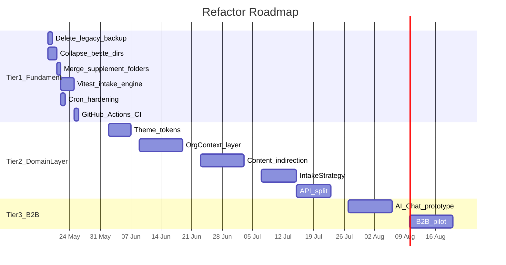

# PerfectSupplement Architectuur Refactor Roadmap

## Huidige staat (samenvatting uit verkenning)

- **8 statische `beste-*` directories** met identieke page-structuur, alleen data-import verschilt
- **Dubbele supplement-folders**: `src/data/supplements/` (vergelijkingsdata) + `src/data/supplementen/` (gidsdata) + `src/features/` (losse artikeldata)
- **17 dode bestanden** in `src/app/_legacy_backup/`
- **0 tests**, geen test framework, geen CI
- **2 cron endpoints** zonder IP/HMAC beveiliging (`/api/cron/nurture`, `/api/cron/thema-nurture`)
- **38 `"use client"` bestanden** (redelijk, meeste zijn interactieve UI)
- **Hardcoded org ID** via `getDefaultOrganizationId()` in 5 API routes
- **Theme tokens** in `globals.css` (Tailwind v4 CSS-first), niet parametriseerbaar per tenant

---

## Tier 1 -- Fundament (Week 1-2, ~10-12 dagen)

### 1. Delete `_legacy_backup/` (5 min)

Verwijder de hele directory [src/app/_legacy_backup/](src/app/_legacy_backup/) (17 dode bestanden). Puur hygiëne.

### 2. Collapse 8 `beste-*` dirs naar `/beste/[supplement]` (2 dagen)

**Wat:**
De 8 statische directories (`beste-magnesium/`, `beste-omega-3-supplement/`, etc.) consolideren naar 1 dynamische route.

**Hoe:**
- Maak `src/app/beste/[supplement]/page.tsx` met `generateStaticParams()` en `generateMetadata()`, exact zoals [src/app/supplementen/[supplement]/page.tsx](src/app/supplementen/[supplement]/page.tsx) al werkt
- Data lookup via een `getSupplementComparisonData(slug)` functie in `src/data/supplements/index.ts` die op basis van slug het juiste data-bestand importeert
- De 8 bestaande `page.tsx` bestanden zijn vrijwel identiek -- ze importeren data + renderen dezelfde componenten (`ChoiceHero`, `ComparisonTable`, `ProductCard`, `BuyingGuide`, `FaqSection`, `StickyMobileCta`)
- **Redirects:** `next.config.ts` redirects van `/beste-magnesium` naar `/beste/magnesium` (301) voor SEO continuïteit
- Update [src/app/sitemap.ts](src/app/sitemap.ts) `VERGELIJKINGS_PADEN` naar nieuwe URL-structuur
- Verwijder de 8 losse directories na validatie

**Referentiepatroon** (al in de codebase):

```1:1:src/app/supplementen/[supplement]/page.tsx
// Dit bestand gebruikt al generateStaticParams + slug-based data lookup
```

### 3. Merge supplement folders + delete `src/features/` (1 dag)

**Probleem:** Drie parallelle locaties voor supplement-gerelateerde data:
- `src/data/supplements/` -- 8 bestanden (vergelijkingsdata met producten)
- `src/data/supplementen/` -- 8 bestanden (gidsdata voor informatieve pagina's)
- `src/features/` -- 3 directories met losse artikeldata

**Aanpak:**
- `src/data/supplements/` en `src/data/supplementen/` hebben **verschillende types** en **verschillende doelen** -- deze blijven gescheiden maar worden hernoemd naar duidelijke namen:
  - `src/data/supplements/` -> `src/data/supplement-comparisons/` (product vergelijkingsdata)
  - `src/data/supplementen/` -> `src/data/supplement-guides/` (informatieve gidsdata)
- `src/features/` bestanden (omega3 artikelen, magnesium artikelen) verplaatsen naar `src/data/blog/` waar de andere artikelen al staan
- Verwijder lege `src/features/` directory
- Update alle imports

### 4. Vitest suite voor intake-engine.ts (2-3 dagen)

**Setup:**
- Installeer `vitest` + `@testing-library/react` (voor toekomstige component tests)
- Maak `vitest.config.ts` met path alias `@/` = `src/`

**Test scope voor [src/lib/intake-engine.ts](src/lib/intake-engine.ts)** (691 regels, 6 exports):

| Functie | Wat testen | ~Aantal tests |
|---------|-----------|--------------|
| `calcDomainScores()` | Normalisatie per domein, edge cases (0, max, missing answers) | 8-10 |
| `getUrgency()` | Threshold grenzen (critical/moderate/mild/healthy) | 6-8 |
| `getProfileLabel()` | Alle 4 profielen + grensgevallen | 6-8 |
| `getAdvice()` | Ranking, dedup, supplement matching per profiel | 8-10 |
| `getDeficiencySignals()` | Trigger combinaties voor alle 6 supplementen | 6-8 |
| `getSortedDomains()` | Sortering, ties | 3-4 |

Totaal: ~35-48 tests in `src/lib/__tests__/intake-engine.test.ts`

### 5. Cron endpoint hardening (1 dag)

**Huidige staat:** [src/app/api/cron/nurture/route.ts](src/app/api/cron/nurture/route.ts) en [src/app/api/cron/thema-nurture/route.ts](src/app/api/cron/thema-nurture/route.ts) hebben geen access control.

**Aanpak:**
- Maak `src/lib/cron-auth.ts` met:
  - HMAC signature verificatie (shared secret uit env var `CRON_SECRET`)
  - IP allowlist (optioneel, voor als je een vaste cron-server hebt)
- Wrap beide cron handlers met de auth check
- Voeg `CRON_SECRET` toe aan `.env.example`

### 6. Basic CI met GitHub Actions (0.5 dag)

Maak `.github/workflows/ci.yml`:

```yaml
name: CI
on: [push, pull_request]
jobs:
  check:
    runs-on: ubuntu-latest
    steps:
      - uses: actions/checkout@v4
      - uses: actions/setup-node@v4
        with: { node-version: 22 }
      - run: npm ci
      - run: npm run lint
      - run: npx vitest run
      - run: npm run build
```

---

## Tier 2 -- Domain Layer + Config (Week 3-8)

### 7. Theme tokens parametriseerbaar maken (Week 3)

- Extract CSS custom properties uit [src/app/globals.css](src/app/globals.css) naar een `src/config/theme.ts` config object
- Maak een `ThemeProvider` die CSS variables injecteert op basis van org config
- Standaard: huidige kleuren/fonts (Source Sans 3 + Lora)
- B2B: overschrijfbaar per tenant

### 8. OrgContext layer (Week 4-5)

**Doel:** Elke request weet welke organisatie het betreft.

- Maak `src/lib/org-context.ts` met een `OrgConfig` type:

```typescript
interface OrgConfig {
  id: string;
  name: string;
  theme: ThemeConfig;
  scoring: ScoringConfig;    // weights, thresholds
  supplements: string[];      // welke supplementen zichtbaar
  emailTemplates: string;     // welke nurture sequence
  affiliatePrefix: string;
}
```

- Middleware in `src/middleware.ts` die subdomain/header leest en org context zet
- React context `<OrgProvider>` voor client components
- Server-side: `getOrgConfig(request)` helper
- Migreer de 5 plekken waar `getDefaultOrganizationId()` wordt aangeroepen

### 9. Content indirection layer (Week 5-6)

- Maak `src/lib/content.ts` met functies als:
  - `getProfileCopy(slug, orgId)` -- profiel teksten
  - `getSupplementData(slug, orgId)` -- supplement vergelijkingsdata
  - `getNurtureContent(day, profile, orgId)` -- email content
- Huidige TS data files worden de "default" provider
- Later te vervangen door CMS/database lookup per org

### 10. IntakeStrategy interface (Week 6-7)

**Doel:** Intake ontkoppelen van form-only delivery.

```typescript
interface IntakeStrategy {
  collectAnswers(): Promise<IntakeAnswers>;
  presentResults(results: IntakeResults): void;
}

class FormIntakeStrategy implements IntakeStrategy { /* huidige flow */ }
class ChatIntakeStrategy implements IntakeStrategy { /* toekomstig */ }
```

- Refactor huidige intake componenten om `FormIntakeStrategy` te gebruiken
- Scoring engine (`calcDomainScores`, `getAdvice`, etc.) blijft ongewijzigd -- alleen de delivery layer wordt abstract

### 11. API split: public vs internal (Week 7-8)

- Herstructureer API routes:
  - `src/app/api/public/` -- intake, affiliate, contact, unsubscribe
  - `src/app/api/internal/` -- cron, admin
  - `src/app/api/partner/` -- toekomstige B2B endpoints
- Shared middleware per groep (rate limiting, auth, CORS)

---

## Tier 3 -- AI Chat + B2B Pilot (Week 9-12)

### 12. AI Chat prototype (Week 9-10)

- Implementeer `ChatIntakeStrategy` met OpenAI/Anthropic API
- Conversational intake die dezelfde scoring engine aanroept
- A/B test toggle tussen form en chat

### 13. B2B pilot (Week 11-12)

- Eerste partner tenant configuratie via `OrgConfig`
- Custom theme, subset supplementen, eigen affiliate links
- Partner dashboard (read-only analytics)

---

## Visueel overzicht



---

## Belangrijk: wat NIET verandert

- Scoring engine logica (`intake-engine.ts`) blijft inhoudelijk ongewijzigd -- alleen tests eromheen
- Affiliate link structuur en Daisycon/Arctic Blue integratie blijft intact
- Bestaande SEO pagina's krijgen 301 redirects, geen broken links
- Database schema wijzigt niet in Tier 1
- `.env.local` wordt niet aangeraakt
