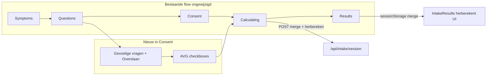

# Intake 40+ upgrade (prioriteiten #1–#12)

## Context en constraints

- **Scoring-engine**: [`src/lib/intake-engine.ts`](src/lib/intake-engine.ts) (niet `scoring.ts` — bestaat niet). `src/lib/scoring.ts` blijft onaangeroerd.
- **`src/app/intake/`**: geen wijzigingen. Vraagflow blijft `QUESTIONS.map` in `IntakeClient`; nieuwe **verplichte** vragen werken automatisch zolang ze in `QUESTIONS` staan.
- **Andropauze-toggle (#1)**: zonder `IntakeClient` → **gevoelige vragen in consent-fase** ([`IntakeConsent.tsx`](src/components/intake/IntakeConsent.tsx)), niet in de vraag-loop.
- **Docs**: [`docs/_MASTER_INDEX.md`](docs/_MASTER_INDEX.md) → intake: `docs/core/INTAKE_SYSTEM.md` + `docs/core/ENTITY_MODEL.md`. `docs/core/master_index.md` bestaat niet.



---

## 1. Vragenlijst herstructureren ([`src/data/intake-questions.ts`](src/data/intake-questions.ts))

### Verplichte vragen (in `QUESTIONS`, tellen mee voor domeinscores)

| Actie | ID(s) | Detail |
|-------|--------|--------|
| Herijken | `NRG_PATN`, `NRG_DEP`, `STR_RECV` | Optiewaarden **4-3-2-1** zonder gaps/dubbelen; `NRG_DEP` + optie alcohol als ontspanning (score 1–2) |
| Vervangen | `NUT_QUAL` → `NUT_VEG` | Concrete frequentie: groenteporties/dag (4 opties, 4-3-2-1) |
| Uitbreiden | `NUT_PROT` | Subtitle met gram-schatting (~20–30 g per eiwitmaaltijd) |
| Splitsen | `MOV_FREQ` → `MOV_STR` + `MOV_CARD` | Kracht ≥2×/week (ja-nee-schaal) + cardio-frequentie (1-4) |
| Toevoegen slaap | `SLP_ONSET`, `SLP_WAKE` | Inslaap >30 min; nachtelijk wakker worden — aparte routes melatonine vs magnesium |
| Toevoegen leefstijl | `LIF_ALC`, `LIF_SUN` | Alcohol ≥3 glazen/avond; zonblootstelling/suppletie D3 (nieuwe categorie `leefstijl` in `CATEGORIES`) |

`questionIndex` per categorie bijwerken; `QuestionId` union + [`src/types/intake-answers.ts`](src/types/intake-answers.ts) uitbreiden.

### Symptoom-triage ([`SYMPTOMS`](src/data/intake-questions.ts))

Toevoegen (40+-herkenning, geen scoring): `libido`, `brain-fog`, `buikvet` — [`IntakeSymptoms.tsx`](src/components/intake/IntakeSymptoms.tsx) rendert automatisch uit `SYMPTOMS`.

### Optionele andropauze-vragen (aparte export)

Nieuwe `SENSITIVE_QUESTIONS` + `SensitiveQuestionId` (niet in `QuestionId`):

- `AND_LIB` — libido/seksueel functioneren  
- `AND_ERE` — ochtend/spontane erecties (proxy T)  
- `AND_STR` — spierkracht-/massaverlies  
- `AND_BEL` — buikvet/lijfssamenstelling  
- `AND_MOO` — stemming/drive los van stress  

Copy: *"Gevoelige vragen — overslaan mag"*.

---

## 2. Validatie & persistentie

### [`src/lib/intake-compute.ts`](src/lib/intake-compute.ts)

- `validateIntakeSubmission`: alleen **core** `QUESTIONS` (niet sensitive).
- Nieuwe `validateSensitiveAnswers(answers, skipped)` voor optionele IDs.
- `computeIntakePersistenceFields(answers, ctx?)`: optioneel `ageRange` + sensitive answers voor profiel-engine.

### [`src/lib/intake-consent.ts`](src/lib/intake-consent.ts) + [`src/lib/intake-storage.ts`](src/lib/intake-storage.ts)

Uitbreiden `IntakeConsentPayload`:

```ts
sensitiveSkipped: boolean;
sensitiveAnswers: Partial<Record<SensitiveQuestionId, number>> | null;
```

`saveIntakeSession` stuurt `sensitiveSkipped` + `sensitiveAnswers` mee in POST-body.

### [`src/app/api/intake/session/route.ts`](src/app/api/intake/session/route.ts)

- Sensitive antwoorden mergen in `answers` JSONB vóór `computeIntakePersistenceFields`.
- `profile_label` / `domain_scores` op server met merged set (bron van waarheid voor nurture/admin).

---

## 3. Scoring-engine ([`src/lib/intake-engine.ts`](src/lib/intake-engine.ts))

### `calcDomainScores` — nieuwe maxima

| Domein | Formule (indicatief) |
|--------|----------------------|
| slaap | `SLP_QUAL + SLP_CONS + SLP_ONSET + SLP_WAKE` (max ~14) |
| beweging | `MOV_STR + MOV_CARD + MOV_DAILY` (max ~11) |
| voeding | `NUT_VEG + NUT_O3 + NUT_PROT` (max 11) |
| overige | energie/stress/herstel: bestaande 2-vraag-max, waarden herijkt |

`LIF_ALC` / `LIF_SUN`: **geen domeinscore**; alleen signalen/routes.

### Signalen & routes

- **`melatonine_signal`**: `SLP_ONSET` laag + lage stress (niet alleen `SLP_QUAL`).
- **`magnesium_signal`**: `SLP_WAKE` of `SLP_QUAL` + stressherstel.
- **`zink_signal`**: verplaatsen van [`IntakeResults.tsx`](src/components/intake/IntakeResults.tsx) (regel 117–120) naar `getDeficiencySignals` — logica hergebruiken uit [`getSupplementRoute.ts`](src/lib/getSupplementRoute.ts) `matchesZink`.
- **D3-personalisatie**: `LIF_SUN` laag → sterkere D3-trigger in `getAdvice` / supplement-route.
- **Alcohol**: `LIF_ALC` slecht → quick win slaap/T; geen medische claim.
- **Overtrainer**: `MOV_STR + MOV_CARD` equivalent van huidige `MOV_FREQ >= 3` ([`matchesOvertrainerAnswers`](src/lib/getSupplementRoute.ts)).
- **Creatine**: `MOV_STR` + herstelscores in `creatine_signal`.

### Profiel **"Hormonale Dip"** (#1)

Uitbreiden `ProfileLabel["name"]` + `getProfileLabel(scores, ctx)`:

- Trigger: `ageRange` ∈ {45–49, 50–54, 55+} **én** ≥3 van 5 sensitive antwoorden “laag” (waarde ≤2), **tenzij** `sensitiveSkipped`.
- Prioriteit: na slaap/stress-hardcoded checks, vóór “Lage Batterij” — documenteer in code-comment (bestaande slaap `<40` override blijft).
- Route: zink + vitamine D3 + eiwit-quick-wins via [`getSupplementRoute.ts`](src/lib/getSupplementRoute.ts) / `getAdvice`.

### `getUrgency` (#9)

Catch-all fix: als alle scores `>30` maar niet alle `>60` en geen eerdere branch → **`moderate`** i.p.v. `mild` (edge case 31/31/…).

### Comments (#3 in analyse)

Korte comment bij `getAdvicePrimaryDomain` / `getProfileLabel` slaap-`<40` override.

---

## 4. UI-resultaten (zonder IntakeClient)

### [`IntakeConsent.tsx`](src/components/intake/IntakeConsent.tsx)

Twee stappen:

1. Sensitive block (5 vragen, zelfde styling als intake) + **"Liever overslaan"** → `sensitiveSkipped: true`.
2. Bestaande AVG-checkboxes.

Bij continue: `sessionStorage.setItem("ps_sensitive_answers", …)` voor client-side merge.

### [`IntakeResults.tsx`](src/components/intake/IntakeResults.tsx)

- Hook/helper `mergeAnswersWithSensitive(base, storage)` → herbereken `scores`, `profile`, `deficiencySignals`, `supplementRoute` voor weergave (sync met server na save).
- Verwijder lokale `zinkSignal`; gebruik `deficiencySignals.zink_signal`.
- Profiel-link voor `Hormonale Dip` → `/profiel/hormonale-dip`.
- Foundation-filter: creatine (#10) conditioneel tonen (40+, `MOV_STR` laag of sarcopenie-signaal).

### Foundation & UX (#8, #10)

[`src/data/foundation-stack.ts`](src/data/foundation-stack.ts):

- `vitamine-d3.hasComparison: true` (gidspagina [`/supplementen/vitamine-d`](src/app/supplementen/vitamine-d) — knoptekst in [`FoundationStack.tsx`](src/components/intake/FoundationStack.tsx) eventueel "Bekijk gids" i.p.v. "vergelijking" als `href` geen `/beste/` is).
- Optioneel vierde foundation-item **creatine** met EFSA-claim (3 g/dag ultrakorte spiertaken) — alleen zichtbaar bij relevant signaal.

### Melatonine-claim (#EFSA)

[`src/data/supplement-routes.ts`](src/data/supplement-routes.ts): dosisvoorwaarde toevoegen in `reason` (≥1 mg voor het slapen).

---

## 5. Profielpagina Hormonale Dip (#1)

Nieuw: [`src/data/profiles/hormonale-dip.ts`](src/data/profiles/hormonale-dip.ts) + export in [`src/data/profiles/index.ts`](src/data/profiles/index.ts).

- 8-sectie structuur conform [`docs/core/PERSONALIZATION_ENGINE.md`](docs/core/PERSONALIZATION_ENGINE.md).
- Disclaimers: geen diagnoses, huisarts bij aanhoudende klachten, geen T-diagnose.
- Cross-links: `/testosteron-na-40` (toekomstige pillar), zink, vitamine D, eiwit.

Dynamische route [`src/app/profiel/[slug]/page.tsx`](src/app/profiel/[slug]/page.tsx) pakt slug automatisch op — **geen** nieuwe static page nodig.

---

## 6. Compliance (#12)

Nieuw optioneel blok in [`SupplementAdviceDisclaimer.tsx`](src/components/intake/SupplementAdviceDisclaimer.tsx) of `SupplementInteractionHints.tsx`:

| Supplement | Korte hint |
|------------|------------|
| Omega-3 | Bloedverdunners |
| Magnesium | Diuretica / nierfunctie |
| Melatonine | Sedativa/slaapmiddelen |

Tonen onder [`SupplementRoute.tsx`](src/components/intake/SupplementRoute.tsx) / foundation wanneer betreffend supplement in route zit. Algemene disclaimer blijft leidend.

---

## 7. Secundaire sync

| Bestand | Wijziging |
|---------|-----------|
| [`src/lib/chat-intake.ts`](src/lib/chat-intake.ts) | Nieuwe vraag-IDs + labels |
| [`src/lib/nurture-email-dispatch.ts`](src/lib/nurture-email-dispatch.ts) | Vraagsets bijwerken |
| [`src/data/nurture-content.ts`](src/data/nurture-content.ts) | Blokken voor `Hormonale Dip` |
| [`src/lib/__tests__/intake-engine.test.ts`](src/lib/__tests__/intake-engine.test.ts) | Alle nieuwe maxima, signalen, urgency edge case, hormonale profiel |
| [`CLAUDE.md`](CLAUDE.md) | "12 vragen" → actueel aantal (~19 core + 5 optioneel) |
| [`docs/core/INTAKE_SYSTEM.md`](docs/core/INTAKE_SYSTEM.md) | Vragenlijst + profieltabel bijwerken |

---

## 8. Verificatie (na implementatie)

1. `npm run build` — TypeScript + allowlists.
2. `npm test` (vitest) — intake-engine tests groen.
3. `grep -rn "console.log" src/` — geen nieuwe debug logs.
4. Handmatig: intake doorlopen met/zonder sensitive skip; controleren resultaten + foundation-knoppen + profiel-link.
5. API POST met `sensitiveAnswers` → DB `profile_label` = `Hormonale Dip` bij trigger-set.

---

## Risico's en mitigatie

| Risico | Mitigatie |
|--------|-----------|
| Client toont andere scores dan DB vóór merge-fix | `IntakeResults` herberekent uit merged answers; server merge in API |
| Bestaande sessies missen nieuwe keys | `getAnswer` default 0; oude sessies blijven geldig |
| Meer vragen → langere intake | Sensitive optioneel; progress `total` volgt `QUESTIONS.length` |
| Profielpagina content-groot | Minimale maar complete 8-sectie copy (geen placeholders) |

---

## Bestanden buiten scope (niet aanraken)

`src/app/intake/**`, `src/data/affiliate-links.ts`, `globals.css`, `deploy.sh`, `.env.local`, git-commando's.
