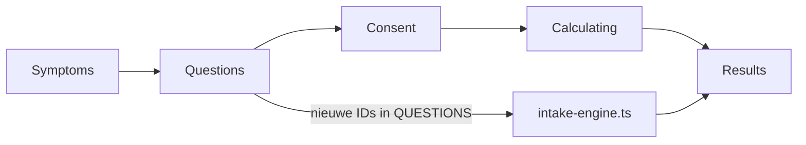

# Intake 40+ upgrade — sprint scope (technische fixes)

## In scope (bouw nu)

| # | Prioriteit | Wat |
|---|------------|-----|
| **2** | Kracht vs cardio | `MOV_FREQ` → `MOV_STR` + `MOV_CARD`; overtrainer/creatine-triggers in engine/routes aanpassen |
| **3** | Score-mappings | `NRG_PATN`, `NRG_DEP`, `STR_RECV`: waarden **4-3-2-1**, geen gaps/dubbelen; alcohol-optie bij `NRG_DEP` |
| **4** | Slaap uitbreiden | `SLP_ONSET` (inslaap >30 min), `SLP_WAKE` (doorslapen); melatonine vs magnesium-routes scherper |
| **6** | Alcohol | `LIF_ALC` (≥3 glazen/avond); signaal voor slaap/energie-advies, geen medische claim |
| **7** | Zon / D3 | `LIF_SUN`; personaliseert D3-advies in engine/routes |
| **8** | Foundation UX | `vitamine-d3.hasComparison: true` + knop "Bekijk gids" als `href` geen `/beste/` is |

## Uitgesteld (aparte sprint)

| Item | Reden |
|------|--------|
| **#1** Andropauze-vragen + toggle | Juridische framing eerst af |
| **#1** Profiel **Hormonale Dip** + profielpagina + nurture | Zelfde sprint als andropauze, na legal |
| **#5** `zinkSignal` → engine | Niet in deze batch (blijft in `IntakeResults.tsx`) |
| **#9** `getUrgency` catch-all | Niet in deze batch |
| **#10** Creatine in Foundation Stack | Niet in deze batch |
| **#11** `CLAUDE.md` | Niet in deze batch |
| **#12** Medicatie-interactie disclaimers | Niet in deze batch |
| `NUT_QUAL` → `NUT_VEG`, `NUT_PROT` subtitle, extra symptomen | Niet in deze batch |

---

## Context en constraints

- **Scoring-engine**: [`src/lib/intake-engine.ts`](src/lib/intake-engine.ts) — `src/lib/scoring.ts` bestaat niet / niet aanraken.
- **`src/app/intake/`**: geen wijzigingen. Nieuwe vragen in `QUESTIONS` worden automatisch door de bestaande flow getoond.
- **Geen** wijzigingen aan `IntakeConsent`, sensitive merge, `sessionStorage`, of profiel-engine voor andropauze.
- **Docs**: alleen [`docs/core/INTAKE_SYSTEM.md`](docs/core/INTAKE_SYSTEM.md) vraagtelling bijwerken (geen `CLAUDE.md` in deze sprint).

---

## 1. Vragenlijst ([`src/data/intake-questions.ts`](src/data/intake-questions.ts))

### Wijzigingen

| Actie | ID(s) | Detail |
|-------|--------|--------|
| Herijken | `NRG_PATN`, `NRG_DEP`, `STR_RECV` | Opties **4-3-2-1**; `NRG_DEP` + "alcohol als ontspanning" (lage score) |
| Splitsen | `MOV_FREQ` → `MOV_STR`, `MOV_CARD` | Kracht ≥2×/week; cardio-frequentie (1-4) |
| Toevoegen | `SLP_ONSET`, `SLP_WAKE` | Inslaap >30 min; nachtelijk wakker worden |
| Toevoegen | `LIF_ALC`, `LIF_SUN` | Nieuwe categorie `leefstijl` in `CATEGORIES` |

- `QuestionId` union + [`src/types/intake-answers.ts`](src/types/intake-answers.ts).
- `questionIndex` per categorie corrigeren.
- **`NUT_QUAL` blijft** (geen `NUT_VEG` in deze sprint).
- **Geen** `SENSITIVE_QUESTIONS`, **geen** extra `SYMPTOMS`.

---

## 2. Scoring-engine ([`src/lib/intake-engine.ts`](src/lib/intake-engine.ts))

### `calcDomainScores` — nieuwe maxima

| Domein | Formule |
|--------|---------|
| slaap | `SLP_QUAL + SLP_CONS + SLP_ONSET + SLP_WAKE` (max 14) |
| beweging | `MOV_STR + MOV_CARD + MOV_DAILY` (max 11) |
| energie / stress | `NRG_*` / `STR_*` (max 8 elk, herijkte waarden) |

`LIF_ALC` / `LIF_SUN`: **geen** domeinscore; alleen in `getSignals` / `getAdvice` / routes.

### Signalen & routes

- **`melatonine_signal`**: lage `SLP_ONSET` + stress niet dominant (i.p.v. alleen `SLP_QUAL`).
- **`magnesium_signal`**: `SLP_WAKE` en/of `SLP_QUAL` + stressherstel.
- **D3**: `LIF_SUN` laag → sterkere D3 in `getAdvice` / [`getSupplementRoute.ts`](src/lib/getSupplementRoute.ts).
- **Alcohol**: `LIF_ALC` slecht → quick win (slaap/ritme), geen T-claim.
- **Overtrainer / creatine**: [`matchesOvertrainerAnswers`](src/lib/getSupplementRoute.ts) en `creatine_signal` op `MOV_STR` + `MOV_CARD` (equivalent huidige `MOV_FREQ >= 3`).

### Niet in deze sprint

- Profiel **Hormonale Dip**
- `zink_signal` in engine (blijft lokaal in `IntakeResults.tsx`)
- `getUrgency` edge-case fix

---

## 3. Foundation UX (#8)

[`src/data/foundation-stack.ts`](src/data/foundation-stack.ts):

- `vitamine-d3.hasComparison: true` (href blijft `/supplementen/vitamine-d`).

[`src/components/intake/FoundationStack.tsx`](src/components/intake/FoundationStack.tsx):

- CTA-tekst: **"Bekijk gids"** wanneer `href` niet onder `/beste/` valt; anders "Bekijk vergelijking".

---

## 4. Secundaire sync

| Bestand | Wijziging |
|---------|-----------|
| [`src/lib/chat-intake.ts`](src/lib/chat-intake.ts) | Labels/IDs: `MOV_STR`, `MOV_CARD`, `SLP_*`, `LIF_*`; verwijder `MOV_FREQ` |
| [`src/lib/nurture-email-dispatch.ts`](src/lib/nurture-email-dispatch.ts) | Zelfde vraagset |
| [`src/lib/__tests__/intake-engine.test.ts`](src/lib/__tests__/intake-engine.test.ts) | Nieuwe maxima, signalen, overtrainer met MOV-split |
| [`docs/core/INTAKE_SYSTEM.md`](docs/core/INTAKE_SYSTEM.md) | Vragenlijst + aantal vragen (was 12/13, wordt ~17) |

**Geen** wijzigingen: `nurture-content.ts` (Hormonale Dip), `profiles/`, `IntakeConsent`, API sensitive merge.

---

## 5. Verificatie

1. `npm run build`
2. `npm test` — intake-engine tests
3. `grep -rn "console.log" src/`
4. Handmatig: intake doorlopen; controleren slaap-/bewegingsvragen, foundation vitamine-D knop, supplementroutes melatonine/magnesium

---

## Bestanden buiten scope

`src/app/intake/**`, `src/data/affiliate-links.ts`, `globals.css`, `deploy.sh`, `.env.local`, git-commando's, andropauze/consent/profiel/compliance-sprint items hierboven.
