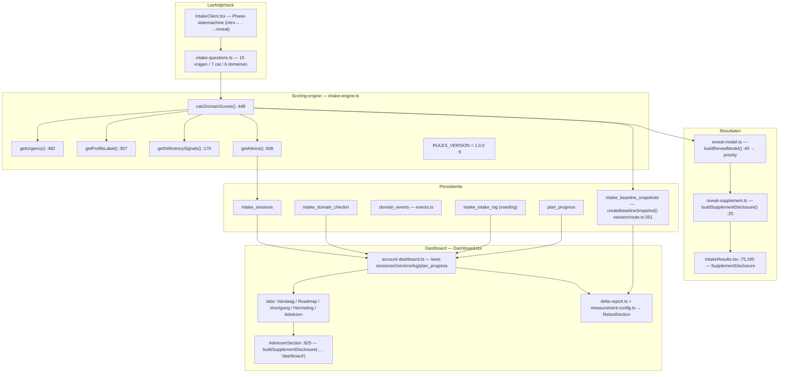

# Diepte-analyse: leefstijlcheck → resultaten → supplementen → dashboard

> **Status:** analyse-doc (geen code gewijzigd). Alle bevindingen zijn terug te voeren op
> `bestand:regelnummer`. Doelgroep van het product: mannen 40+, mobiel-first (375px).
> Principe: *adviezen, geen diagnoses*. Monetisatie via affiliate → routing naar `/beste/*`.
> Datum analyse: 21 juni 2026.

---

## Samenvatting (TL;DR)

De keten check → resultaten → supplement → dashboard werkt, maar het **supplement-advies komt
uit vijf parallelle systemen met drie verschillende route-bronnen** die elkaar kunnen tegenspreken.
De scherpste uiting: een gebruiker met prioriteit **stress** wordt op het resultaatscherm/dashboard
naar **ashwagandha** geleid (`PILLAR_COMPARISON_ROUTES.stress`), terwijl de interventie-engine
voor dezelfde gebruiker **magnesium** kiest (`supplement-routes.ts`). Ashwagandha is bovendien
`on_hold` (geen goedgekeurde EFSA-claim, VWS-verbodrisico medio 2026) — dus dit is én een
inconsistentie én een compliance-risico, precies op de zwakste schakel.

**Top-3 aanbevolen acties (onderbouwing in Deel D):**
1. **Stress-routing harmoniseren + ashwagandha herzien** (quick win, hoog risico-reductie).
2. **Eén unified recommendation engine + supplement-keyed route-tabel** als single source of
   truth (fundament — voedt resultaten, dashboard, hub én nurture).
3. **Explainability + delta→advies-terugkoppeling** (toekomst — vertrouwen + "wat werkte").

Drie premissen uit de oorspronkelijke opdracht bleken na verificatie onjuist of onnauwkeurig;
ze zijn hieronder gecorrigeerd (A.3).

---

## Deel A — Huidige staat

### A.1 Dataflow leefstijlcheck → DB → resultaten → dashboard



**Tekst.** De intake (`src/app/intake/IntakeClient.tsx:47-66`, `Phase`-statemachine met
`answers`-state) verzamelt 15 antwoorden (`src/data/intake-questions.ts`). De engine
(`src/lib/intake-engine.ts`) leidt daaruit af: domeinscores (`calcDomainScores:448`),
urgentie (`getUrgency:482`), profiellabel (`getProfileLabel:507`, waarden "Onrustige Slaper" /
"Lage Batterij" / "Stressdrager" / "In Balans"), tekortsignalen (`getDeficiencySignals:170`) en
advies (`getAdvice:608`) — alles onder `RULES_VERSION = "1.0.0"` (`:9`). Bij sessie-aanmaak wordt
een baseline-snapshot bevroren (`src/app/api/intake/session/route.ts:351`,
`createBaselineSnapshot`). Het resultaatscherm bouwt zijn prioriteit via
`buildRevealModel` (`src/lib/reveal-model.ts:40`) en zijn supplement-blok via
`buildSupplementDisclosure` (`src/lib/reveal-supplement.ts:25`), gerenderd in
`IntakeResults.tsx:195`. Het dashboard (`src/lib/account-dashboard.ts`) leest de gekoppelde
sessies, check-ins (`intake_domain_checkin:258`), voeding-log (`intake_intake_log:263`) en
`plan_progress`, en rendert de tabs in `src/components/dashboard/Dashboard.tsx`. De Adviezen-tab
gebruikt **hetzelfde** `buildSupplementDisclosure` (`Dashboard.tsx:825`, met
`from: "dashboard"`). Het delta-rapport draait op de net gebouwde domein-agnostische engine
(`src/lib/delta-report.ts` + `src/data/measurement-config.ts`).

### A.2 Inventaris: alle plekken waar uit scores/antwoorden een supplement-advies valt

Er zijn **vijf parallelle routing-systemen** + één dood component. Per systeem: input → logica →
output-route → UI-landing.

- **Systeem A — Pijler-disclosure.** `src/lib/reveal-supplement.ts:25` (`buildSupplementDisclosure`).
  - *Input:* de prioriteit-pijler (`priority.supplement` + pijler-id).
  - *Logica:* pakt route uit `PILLAR_COMPARISON_ROUTES` (`src/data/dashboard/index.ts:244` — **3
    pijlers**: slaap→`/beste/magnesium`, stress→`/beste/ashwagandha`,
    voeding→`/beste/omega-3-supplement`); on-hold-gate via `isSupplementOnHold:15` +
    `isSupplementAvailable`.
  - *Output:* `comparisonPath` (`/beste/*?from=results|dashboard`).
  - *UI:* resultaatscherm `SupplementDisclosure` (`IntakeResults.tsx:75,195`) **én** dashboard
    Adviezen-tab (`Dashboard.tsx:825`). Beide surfaces zijn onderling consistent (zelfde functie).
  - *Let op — dubbele/driedubbele mapping:* het pijler→supplement-verband staat hier **drie keer**:
    `PILLAR_COMPARISON_ROUTES`, het `supplement`-veld op het PILLAR-object, én `SUPPLEMENT_SLUG`
    (`reveal-supplement.ts:10-14`). Drift-risico.

- **Systeem B — Trigger-engine.** `src/lib/getSupplementRoute.ts:113` + data
  `src/data/supplement-routes.ts` (`SUPPLEMENT_ROUTE_DEFINITIONS`).
  - *Input:* `scores` + `profileLabel` + `answers`.
  - *Logica:* trigger-clauses (`domainBelow`/`anyOf`) + custom matchers (`matchesZink`,
    `matchesCreatine`, `matchesOvertrainerAnswers`); gates `isComparisonAllowed` +
    `isSupplementAvailable`.
  - *Output:* tot 3 routes uit **5 supplementen** (omega-3, magnesium-glycinaat, zink, creatine,
    vitamine-d3). Stress<50 → **magnesium-glycinaat** (`supplement-routes.ts:51-66`).
  - *UI:* PLAN / stepped-care-interventies via `src/lib/content/match-interventions.ts:300`
    (`source: "fallback_supplement_routes"`).

- **Systeem C — Hub-recommendations.** `src/lib/build-recommendations.ts` (`buildRecommendations`,
  `selectLegacyHubRecommendations:43`).
  - *Input:* `scores` + `answers`.
  - *Logica:* eigen drempels (sleep<50, stress<50, omega3-antwoord, energy<40, recovery<40).
  - *Output:* `affiliateUrl` → `/beste/*` (tot 3).
  - *UI:* supplementen-hub `src/components/supplement-hub/RecommendedForYou.tsx`.

- **Systeem D — Statische profielen.** `src/data/profiles/*` (4 profielen: `lage-batterij`,
  `onrustige-slaper`, `overtrainer`, `stressdrager`) → profielpagina's. Hand-gecureerde fits,
  losgekoppeld van A/B/C.

- **Systeem E — Nurture.** `src/lib/resolve-domain-supplement-tip.ts` → `src/data/nurture-content.ts`
  (domein → supplement-tip in de e-mailsequence).

- **DOOD CODE — `src/components/intake/SupplementRoute.tsx`.** Nergens gerenderd: geen
  `<SupplementRoute` en geen component-import in de codebase. Kandidaat voor verwijdering.

### A.3 Correcties op de opdracht-premissen (geverifieerd)

1. **"`getSupplementRoute` ongebruikt" — onjuist.** De functie wordt aangeroepen in
   `src/lib/content/match-interventions.ts:300`. Wél klopt: de reveal/dashboard-UI gebruikt 'm
   niet (die draait op systeem A). `IntakeResults.tsx:22` importeert enkel `matchesOvertrainerAnswers`
   uit die module.
2. **"`SupplementRoute.tsx` ongebruikt" — bevestigd dood.** De eerdere "import in IntakeResults"
   was een substring-false-positive op de modulenaam `@/lib/getSupplementRoute`.
3. **"`profile_label` niet voor routing" — bevestigd.** In `src/lib/account-dashboard.ts:218-232`
   is `profile_label` alleen een filter (`=== ANON_PROFILE_LABEL`), geen routing-input — terwijl
   systeem B het wél als input kent. Onbenut signaal (zie B.2).

---

## Deel B — Gap- & meerwaarde-analyse

### B.1 Waar verliest de gebruiker waarde/momentum

- **Geen herleidbaarheid resultaat → dashboard → supplement → terug.** Het advies op de reveal en
  in de Adviezen-tab is consistent (zelfde functie), maar de stap naar `/beste/*` draagt alleen
  `?from=results|dashboard` mee zonder retour-affordance op de vergelijkingspagina. Op 375px kost
  elke verdwaalde tik momentum.
- **Eén supplement zichtbaar waar er meerdere relevant zijn.** Systeem A toont per pijler één
  supplement; systeem B/C kennen er meer (zink, creatine, vitamine-d). Een voeding-zwakke gebruiker
  ziet op de reveal alleen omega-3, terwijl de hub ook andere zou tonen — afhankelijk van wélke
  surface hij toevallig bezoekt.
- **Anonieme reveal vs. ingelogd dashboard.** Diepte (trend/delta/historie) zit achter de login;
  de reveal is de conversiekans. Dat is bewust, maar de overgang moet de moat ("dit onthoudt je")
  expliciet verkopen — nu impliciet.

### B.2 Data die we wél verzamelen maar niet benutten

- **`getDeficiencySignals` (`intake-engine.ts:170`)** — tekortsignalen worden berekend maar zijn
  geen routing-input in A of C. Dit is precies de explainability-grondstof ("omdat signaal Z").
- **`profile_label`** — alleen filter in het dashboard (A.3 #3), geen routing/personalisatie.
- **`primary_theme` (`src/lib/primary-theme.ts`)** — voedt de theme-reveal/`intake.theme_revealed`,
  niet de supplement-routing.
- **`intake_intake_log` (voeding)** — wél getoond als `nutritionIntake`
  (`account-dashboard.ts:273-289`), maar niet teruggekoppeld naar advies ("je krijgt te weinig X
  binnen → overweeg Y").
- **`plan_progress`** — sinds kort gebruikt als `SustainedAction[]` voor de delta-gedragskoppeling
  (`account-dashboard.ts:131-167`), nog niet als advies-input ("dit hield je vol → volgende stap").
- **Hermeting-delta** — wordt getoond, maar niet teruggekoppeld naar welk advies daarna volgt.

### B.3 Inconsistenties tussen de engines (sterkste bevinding)

Voor één en dezelfde gebruiker met **prioriteit stress**:

- **Systeem A** (reveal + dashboard) → **ashwagandha** (`PILLAR_COMPARISON_ROUTES.stress =
  /beste/ashwagandha`).
- **Systeem B** (interventies) → **magnesium-glycinaat** (`supplement-routes.ts:51-66`,
  `stress_score < 50`).

Twee surfaces, tegengesteld advies. Bovendien is **ashwagandha `on_hold`**
(`src/data/approved-claims.ts:377-385`: *"GEEN goedgekeurde EFSA-claim … VWS overweegt verbod,
besluit medio 2026. Niet opnemen in Foundation Stack."*). Systeem A vangt dit deels op met een
hardcoded `stress → on_hold = true` (`reveal-supplement.ts:15-20`, disclaimer), maar de
**strategische vraag** blijft: waarom een gemeten-gestreste gebruiker überhaupt proactief naar een
on-hold/verbodrisico-middel sturen, terwijl je eigen engine magnesium kiest? Dit ondergraaft de
"Consumentenbond"-positionering. Verdere drift: de drempels verschillen per systeem
(A: pijler-prioriteit; B: `<50`; C: `<50`/`<40`), dus dezelfde scores leiden tot verschillende
adviezen afhankelijk van de surface.

---

## Deel C — Toekomstvisie: datatransformatie & onderbouwing die sterk staat

### C.1 Het probleem in één zin

Er is **geen single source of truth** voor "welk supplement hoort bij deze gebruiker en waarom" —
het advies is verspreid over drie route-bronnen (`PILLAR_COMPARISON_ROUTES`,
`SUPPLEMENT_ROUTE_DEFINITIONS`, `build-recommendations`-drempels), elk met eigen input en
drempels, plus statische profielen en nurture.

### C.2 Eén SSOT: supplement-keyed merge-tabel (gekozen richting)

Voeg de drie route-bronnen samen tot **één supplement-keyed tabel** als enige bron. Elk
supplement één entry met: route (`/beste/*`), EFSA-status (uit `approved-claims.ts`), gedekte
domeinen, en de triggers die het activeren. Pijler→supplement wordt een **afgeleide view** erop
(compat voor de reveal/dashboard-disclosure), zodat A's UI ongewijzigd kan blijven werken terwijl
de bron verschuift. Hergebruik de bestaande gates `isComparisonAllowed` / `isSupplementAvailable`
en `approved-claims.ts` — niet dupliceren.

### C.3 Engine-contract (interface, geen implementatie)

```ts
// src/lib/recommendation-engine.ts (voorstel)
import type { DomainScores } from "@/lib/intake-engine";

export interface RecommendationInput {
  scores: DomainScores;
  signals: DeficiencySignal[];        // uit getDeficiencySignals()
  profileLabel: ProfileLabel;         // nu onbenut als routing-input
  answers: Record<string, number>;
  rulesVersion: string;               // RULES_VERSION op moment van advies
}

export interface RankedRecommendation {
  supplementId: string;               // bv. "magnesium-glycinaat"
  comparisonPath: string;             // "/beste/magnesium"
  efsaStatus: "approved" | "on_hold" | "forbidden";  // uit approved-claims.ts
  domains: DomainId[];                // gedekte domeinen
  rank: number;
  reason: RecommendationReason;       // explainability — zie C.5
  available: boolean;                 // isSupplementAvailable + isComparisonAllowed
}

export function getRecommendations(input: RecommendationInput): RankedRecommendation[];

// Afgeleide view voor de bestaande pijler-disclosure (compat met systeem A):
export function getPillarRecommendation(
  input: RecommendationInput,
  pillar: PillarId,
): RankedRecommendation | null;
```

Eén engine voedt **alle** consumers: reveal (`buildSupplementDisclosure` → `getPillarRecommendation`),
dashboard Adviezen-tab (idem), hub (`RecommendedForYou` → `getRecommendations`), en nurture
(`resolve-domain-supplement-tip` → `getRecommendations`). De interventie-engine (systeem B) kan de
`fallback_supplement_routes`-bron vervangen door dezelfde tabel.

### C.4 Datamodel-evolutie: versioneerbaar & herleidbaar

Het fundament hiervoor staat al: `RULES_VERSION` (`intake-engine.ts:9`) +
`intake_baseline_snapshots` (`createBaselineSnapshot`, `session/route.ts:351`) +
`computePerDomainDelta` (hergebruikt in `delta-report.ts`). Aanvulling:

- Sla bij elk geserveerd advies de `rulesVersion` + de gevuurde `reason` op (in
  `domain_events`-payload), zodat je achteraf kunt reconstrueren *waaróm* een advies viel onder
  welke regelset. Dit maakt regelwijzigingen auditbaar zonder oude data te breken.

### C.5 Onderbouwing / explainability

Elk advies traceerbaar maken — voor de gebruiker (vertrouwen) én intern (debugging):

```ts
export interface RecommendationReason {
  triggeredBy: Array<
    | { type: "domain_below"; domain: DomainId; score: number; threshold: number }
    | { type: "signal"; signal: DeficiencySignalKey }
    | { type: "profile"; label: ProfileLabel }
  >;
  efsaNote?: string;   // verplichte on-hold-disclaimer waar status === "on_hold"
}
```

UI-vertaling (geen diagnose-taal): *"Omdat je stress-score onder 50 zit en je weinig herstel
rapporteert."* — exact dezelfde `reason` voedt de debug-view en de "Waarom dit advies?"-uitklap
die al in de reveal/dashboard zit.

### C.6 Delta-rapport toekomstvast

De domein-agnostische delta-engine (Laag 1 `delta-report.ts`, Laag 2 `measurement-config.ts`) is
de juiste basis. Toekomstvast maken:

- Koppel `RankedRecommendation.reason` aan de delta zodat je "wat werkte" kunt tonen op **gedrag**
  (`SustainedAction[]` uit `plan_progress`), nooit op een supplement — conform de bestaande
  compliance-guardrails (verandering, geen status; nooit toeschrijven aan een product).
- Houd de delta-berekening regelset-bewust: bewaar `rulesVersion` op baseline én hermeting, zodat
  een voor/na-vergelijking eerlijk blijft als de scoringregels evolueren.

---

## Deel D — Geprioriteerde roadmap

**Scoringsmethode:** `prioriteit = (impact × bereik) ÷ effort`, waarbij impact = gebruikerswaarde +
conversie/affiliate + risico-reductie (1-5), bereik = aandeel gebruikers geraakt (1-5), effort =
bouwkosten (1-5). Afhankelijkheden gaan vóór score.

### Fase 1 — Quick wins (UI/koppeling, kan nu)

- **D1. Stress-routing harmoniseren + ashwagandha herzien.**
  - *Probleem:* systeem A → ashwagandha (on_hold), systeem B → magnesium; tegenstrijdig +
    compliance-risico (B.3).
  - *Aanpak:* kies één bron voor stress (advies: magnesium, conform engine + EFSA-approved); of,
    als ashwagandha blijft, alleen mét de verplichte on-hold-disclaimer én niet als enige optie.
  - *Geraakt:* `src/lib/reveal-supplement.ts`, `src/data/dashboard/index.ts`
    (`PILLAR_COMPARISON_ROUTES`).
  - *Impact:* hoog (risico-reductie + merkconsistentie). *Bereik:* elke stress-prioriteit-gebruiker.
    *Effort:* laag. *Afh.:* geen. *Risico:* laag.
  - *Score: (5×4)÷1 = 20 → top-prioriteit.*

- **D2. Dood `SupplementRoute.tsx` verwijderen.**
  - *Probleem:* verwarrende dode code (A.2). *Aanpak:* verwijderen. *Geraakt:*
    `src/components/intake/SupplementRoute.tsx`. *Impact:* laag (hygiëne). *Effort:* triviaal.
    *Afh.:* geen. *Risico:* nihil (geverifieerd ongebruikt).
  - *Score: (1×1)÷1 = 1 → meenemen, niet blokkerend.*

- **D3. Retour-affordance op `/beste/*` bij `?from=`.**
  - *Probleem:* momentumverlies bij doorklik (B.1). *Aanpak:* "← terug naar je resultaten/dashboard"
    tonen wanneer `?from=results|dashboard`. *Geraakt:* `/beste/[supplement]`-pagina. *Impact:*
    medium (conversie/retentie). *Bereik:* iedereen die doorklikt. *Effort:* laag. *Afh.:* geen.
  - *Score: (3×4)÷2 = 6.*

### Fase 2 — Fundament (datamodel/engine)

- **D4. Unified recommendation engine + supplement-keyed route-tabel (SSOT).**
  - *Probleem:* drie route-bronnen, tegenstrijdig advies (C.1). *Aanpak:* engine-contract uit C.3
    bouwen; één tabel; pijler-view als compat-laag. *Geraakt:* nieuw
    `src/lib/recommendation-engine.ts` + nieuwe route-tabel; hergebruik `approved-claims.ts`,
    `comparison-availability`, `supplement-availability`. *Impact:* hoog (lost B.3 structureel op,
    fundament voor alles). *Bereik:* alle surfaces. *Effort:* hoog. *Afh.:* na D1. *Risico:* medium
    (raakt meerdere consumers).
  - *Score: (5×5)÷4 ≈ 6,3 → fundament, na de quick wins.*

- **D5. Consumers migreren naar de engine.**
  - *Aanpak:* `reveal-supplement.ts`, `Dashboard.tsx` (Adviezen), `RecommendedForYou.tsx`,
    `match-interventions.ts`, `resolve-domain-supplement-tip.ts` laten consumeren uit D4. *Geraakt:*
    die vijf. *Impact:* hoog (consistentie overal). *Effort:* medium. *Afh.:* D4. *Risico:* medium.

### Fase 3 — Toekomst (delta / onderbouwing / personalisatie)

- **D6. Explainability-laag** (C.5) — `reason` op elk advies, "Waarom dit advies?"-uitklap voeden,
  audit in `domain_events`. *Afh.:* D4. *Impact:* hoog voor vertrouwen, medium conversie.
- **D7. `getDeficiencySignals` + `profile_label` als routing-input** (B.2) — rijkere
  personalisatie. *Afh.:* D4.
- **D8. Delta → advies-terugkoppeling** ("wat werkte" op gedrag, niet supplement) (C.6). *Afh.:*
  D4 + de bestaande delta-engine.

### Top-3, gemotiveerd

1. **D1 (stress/ashwagandha-fix)** — hoogste score (20). Lost een actief compliance-risico op de
   zwakste schakel op, laag effort, geen afhankelijkheden. Doen vóór je meer verkeer aantrekt.
2. **D4 (unified engine + SSOT)** — het fundament dat de hele fragmentatie structureel opheft en
   D5-D8 ontsluit. Hoogste strategische waarde; vergt D1 eerst zodat je geen tegenstrijdigheid
   inbakt in de nieuwe bron.
3. **D3 (retour-affordance)** — goedkope conversie/retentie-winst die nu al kan, los van de engine.

### Afhankelijkheidsvolgorde

```
D1, D2, D3 (quick wins, parallel)  →  D4 (engine + tabel)  →  D5 (consumers)  →  D6, D7, D8
```

**Monetisatie:** in alle stappen blijft routing naar `/beste/*` met affiliate intact; de engine
centraliseert juist de `comparisonPath`-bron, waardoor affiliate-consistentie tóeneemt. Geen
directe affiliate-links in reveal/dashboard — die blijven via de vergelijkingspagina.

---

## Bijlage — verificatie van dit doc

- Elke claim verwijst naar een bestaand `bestand:regelnummer` (steekproef: A.2-inventaris,
  B.3-tegenstrijdigheid, A.3-correcties).
- Geen code gewijzigd door deze analyse (`git status` toont alleen dit doc onder `docs/analyse/`).
- Geen medische claims; alle adviestaal blijft binnen "adviezen, geen diagnoses" en de
  on-hold-disclaimerplicht (`approved-claims.ts`).
