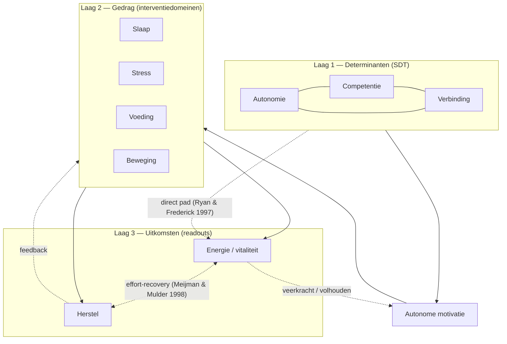

# SDT, energie & herstel — conceptueel model Leefstijlcheck

> **Layer 0 — Analyse.** Wetenschappelijke second opinion op het conceptuele
> model achter de Leefstijlcheck. Geen SSOT; de code (`domain-role.ts`) en
> [DOMAIN_MODEL.md](../core/DOMAIN_MODEL.md) blijven leidend.
> Datum: juli 2026 · baseline: rules_version 1.2.0.

**Panel:** leefstijlwetenschap · gedragspsychologie · Self-Determination Theory ·
epidemiologie · psychometrie · vragenlijstontwikkeling · preventie · UX.
**Status:** kritisch, actief op zoek naar weerleggend bewijs.

Bewijsschaal (consistent met `/onderbouwing`): ★☆☆☆☆ speculatief →
★★★★★ meta-analytisch/richtlijn-robuust.

---

## 1. Wetenschappelijke beoordeling van het huidige model

### 1.1 De voorgestelde keten is deels juist, deels onjuist geordend

Gehypothetiseerde keten:

> Autonomie → Verbinding → Competentie → intrinsieke motivatie → gezond gedrag
> → energie → herstel → nieuwe energie

Er zitten één structurele fout en één weglating in.

**Fout — de drie basisbehoeften zijn niet sequentieel.** SDT (Deci & Ryan 2000;
Ryan & Deci 2000) stelt autonomie, competentie en verbondenheid voor als drie
**parallelle, gelijkwaardige, niet-substitueerbare** behoeften. Er is geen
theoretische of empirische basis voor een volgorde autonomie → verbinding →
competentie. Ze werken tegelijk en versterken elkaar; frustratie van één
ondermijnt het geheel.

**Weglating — behoeftebevrediging voedt vitaliteit óók direct.** Need-satisfactie
voorspelt subjectieve vitaliteit rechtstreeks, niet alleen via gedrag
(Ryan & Frederick 1997; Nix et al. 1999; Reis et al. 2000). Autonoom handelen
geeft energie; gecontroleerd/verplicht handelen kost energie — bij identiek
gedrag. De lineaire keten mist dit directe pad `behoeften → vitaliteit`.

### 1.2 Schakel-voor-schakel

| Schakel | Oordeel | Bewijs | Bron (selectie) |
|---|---|---|---|
| 3 behoeften (parallel) → autonome motivatie | Sterk | ★★★★★ | Ng et al. 2012; Deci & Ryan 2000 |
| Autonome motivatie → volgehouden gedrag | Sterk | ★★★★☆ | Ntoumanis et al. 2021; Teixeira et al. 2012 |
| Gedrag (slaap/beweging) → ervaren energie | Sterk–matig | ★★★★☆ | Puetz et al. 2006; Loy et al. 2013 |
| Behoeften → vitaliteit **direct** (ontbreekt in model) | Sterk | ★★★★☆ | Ryan & Frederick 1997; Reis et al. 2000 |
| Volgorde autonomie→verbinding→competentie | **Onjuist** | — | Geen steun; parallelle behoeften |
| Energie → herstel → nieuwe energie (batterij-loop) | Speculatief als mechanisme | ★★☆☆☆ | zie 1.3 |
| "Energie en herstel beïnvloeden elkaar continu" | Plausibel, moeilijk falsifieerbaar | ★★☆☆☆ | mogelijk één latent construct |

### 1.3 De energie–herstel-loop is de zwakste schakel — en deels weerlegd

De batterij-metafoor heeft een legitieme tegenhanger op **gedragsniveau**:
het effort–recovery-model (Meijman & Mulder 1998), Conservation of Resources
(Hobfoll 1989) en herstelonderzoek (Sonnentag & Fritz 2007). Drie kanttekeningen:

1. **Het willpower-/depletie-mechanisme is grotendeels niet gerepliceerd.**
   "Ego-depletion" faalde in grootschalige preregistered replicaties
   (Hagger et al. 2016) en toont sterke publicatiebias (Carter & McCullough 2014).
   Een loop die leunt op een psychologische energie-batterij staat op contested
   terrein.
2. **Energie en herstel zijn hier beide éénmalig zelfgerapporteerde toestanden**
   en empirisch nauwelijks te scheiden — waarschijnlijk facetten van hetzelfde
   latente construct (vitaliteit ↔ vermoeidheid).
3. **Een cyclus is niet vast te stellen in een eenmalige check** — dat vereist
   herhaalde meting over tijd.

**Conclusie:** bruikbaar als narratief, niet houdbaar als causale keten. De
verdedigbare kern is een **drielaags determinant → gedrag → uitkomst-structuur
met feedback**, niet een lineaire loop.

---

## 2. Energie en herstel: readouts, geen leefstijldomeinen

Bevestigd en al architectureel verankerd (`domain-role.ts`: energie/herstel =
`readout`; zie [DOMAIN_MODEL.md](../core/DOMAIN_MODEL.md) §2). Literatuur meet
energie/vitaliteit als **uitkomst** (SVS — Ryan & Frederick 1997; SF-36 Vitality
— Ware & Sherbourne 1992) en herstel als **uitkomst van belasting + rust**
(REST-Q; Sonnentag & Fritz 2007). Geen van de dominante leefstijlmodellen
(MEDLIFE, WHO 24-uurs, Blue Zones) voert ze als zelfstandig gedragsdomein.

**Nieuw inzicht:** het model heeft drie lagen, niet twee:

- **Determinanten** — psychologische behoeften (autonomie, competentie,
  verbinding) + motivatie. *Grotendeels ongemeten.*
- **Gedrag** — slaap, stress, voeding, beweging (+ leefstijl: alcohol, licht).
  *De interventiedomeinen.*
- **Uitkomsten (readouts)** — energie, herstel; overkoepelend: vitaliteit.

De SDT-behoeften horen in laag 1 — en die laag is nu leeg (de `connection`-pijler
bestaat als scaffold maar wordt niet gemeten).

---

## 3. Past dit binnen de huidige architectuur? — scenario's

| Scenario | Kern | Impact | Wetenschap | UX | Oordeel |
|---|---|---|---|---|---|
| **A** — alleen uitleg | Niets meten, wel SDT/readout uitleggen | Nihil | ★★☆ | ★★★★ | Onvoldoende — SDT-claim blijft onmeetbaar |
| **B** — behoeften als onderliggende laag | Autonomie/competentie/verbinding als determinantlaag | Klein–middel; `connection`-scaffold bestaat | ★★★★ | ★★★★ | Sterk |
| **C** — energie/herstel = uitkomstmaten | Readout-model consequent | Klein; al ingezet op 1.2.0 | ★★★★ | ★★★★ | Sterk |
| **D** — volledig alternatief (COM-B/BCW) | Nieuw raamwerk | Groot | ★★★★ | ★★☆ | Niet nu — funnel-breuk |

**Aanbeveling: B + C gecombineerd, incrementeel.** C is grotendeels gedaan
(1.1.0/1.2.0). B is de nieuwe stap: de `connection`-scaffold ombouwen naar
gemeten items (V1), plus de SDT-behoeften expliciet als determinantlaag
benoemen op `/onderbouwing`.

---

## 4. Analyse bestaande vragenlijst (15 vragen)

Rol: **G** gedrag/interventie · **U** uitkomst/readout · **S** signaal.
SDT: — geen / ~ zwak / ✓ deels.

| # | Vraag (ID) | Domein | Rol | Auton. | Verb. | Compet. | Energie | Herstel | Onderbouwing | Ontbrekend |
|---|---|---|---|:--:|:--:|:--:|:--:|:--:|:--:|---|
| 1 | SLP_QUAL | slaap | G | — | — | — | ✓ | ✓ | ★★★★★ | uitkomst-item in gedragsdomein |
| 2 | SLP_CONS | slaap | G | ~ | — | ~ | — | ✓ | ★★★★☆ | — |
| 3 | SLP_ONSET | slaap | G | — | — | — | — | ✓ | ★★★★☆ | — |
| 4 | SLP_WAKE | slaap | G | — | — | — | ~ | ✓ | ★★★★☆ | — |
| 5 | NRG_PATN | energie | U | — | — | — | ✓✓ | ~ | ★★★☆☆ | zuivere uitkomst |
| 6 | NRG_DEP | energie | U | ~ | — | — | ✓ | — | ★★★☆☆ | **dubbeltelt alcohol met LIF_ALC** |
| 7 | STR_FREQ | stress | G | — | — | — | ~ | ✓ | ★★★★☆ | uitkomst-item in gedragsdomein |
| 8 | STR_RCV | stress | G | ✓ | — | ~ | — | ✓ | ★★★★☆ | raakt autonomie/zelfregulatie |
| 9 | NUT_O3 | voeding | G | — | — | — | — | — | ★★★★☆ | smalle voedingsproxy |
| 10 | NUT_PROT | voeding | G | — | — | ~ | ~ | ✓ | ★★★★☆ | — |
| 11 | MOV_STR | beweging | G | — | — | ✓ | ~ | ✓ | ★★★★★ | — |
| 12 | MOV_CARD | beweging | G | — | — | ✓ | ✓ | ~ | ★★★★★ | **geen zit-/dagactiviteit (NEAT)** |
| 13 | RCV_PHYS | herstel | U | — | — | — | ✓ | ✓✓ | ★★★★☆ | **1-item schaal ({33,67,100})** |
| 14 | LIF_ALC | leefstijl | S | ~ | — | — | ~ | ✓ | ★★★★☆ | — |
| 15 | LIF_SUN | leefstijl | S | — | — | — | ✓ | — | ★★★★☆ | — |

**Twee harde bevindingen:**

1. **De SDT-kolommen zijn vrijwel leeg** — alleen STR_RCV raakt autonomie
   substantieel. De SDT-onderbouwing is nu narratief, niet gemeten.
2. **Alcohol wordt dubbel geteld** (LIF_ALC én NRG_DEP-optie); NRG_DEP mengt
   bovendien cafeïne/suiker/alcohol op één ordinale as met impliciet
   waardeoordeel.

---

## 5. Ontbrekende domeinen & vragen (evidence-based)

Voorwaarde: kernflow blijft ~3–4 min. Scherp prioriteren.

### Sterk aanbevolen (content-validiteitsgaten)

- **V1 — Sociale verbinding (1 item).** Maakt de getoonde-maar-niet-gemeten
  pijler écht meetbaar en vult de zwakst gedekte SDT-behoefte.
  Basis: Holt-Lunstad et al. 2015; Umberson & Montez 2010. **★★★★★**
- **V2 — Zit-/dagelijkse activiteit (NEAT, 1 item).** Beweging meet nu alleen
  gestructureerde training; iemand kan 2× trainen én 10 u/dag zitten.
  Basis: Ekelund et al. 2016; Stamatakis et al. 2019; Bull et al. 2020. **★★★★☆**
- **V3 — Groente/vezel (1 item).** Kern van het mediterrane patroon (de
  positionering) ontbreekt volledig; voeding meet alleen omega-3 + eiwit.
  Basis: Dinu et al. 2018; Reynolds et al. 2019; Estruch et al. 2018. **★★★★★**

### Optionele SDT-verdiepingsmodule (na de kernflow)

- **V4 — Zelfeffectiviteit (competentie).** Bandura; Sheeran et al. 2016. **★★★★☆**
- **V5 — Autonome motivatie (TSRQ-stijl).** Ng et al. 2012; Teixeira et al. 2012. **★★★★☆**
- **V6 — Gewoonte-automatisme (SRBAI).** Gardner et al. 2012; Lally et al. 2010. **★★★★☆**

### Bewust niet nu

Betekenis/purpose (★★★☆☆, lastig kort valide te meten), natuur en
psychologische flexibiliteit (te specialistisch), daglicht/ontspanning
(al gedekt via LIF_SUN, STR_RCV).

---

## 6. Conceptueel model (gecorrigeerd)

Drielaags met feedback en een direct behoeften → vitaliteit-pad; geen lineaire
batterij-loop.

| Pijl | Sterkte | Steun |
|---|---|---|
| Behoeften (parallel) → autonome motivatie | ★★★★★ | Ng 2012; Deci & Ryan 2000 |
| Motivatie → gedrag | ★★★★☆ | Ntoumanis 2021; Teixeira 2012 |
| Gedrag → energie/herstel | ★★★★☆ | Puetz 2006; Loy 2013 |
| Behoeften → vitaliteit (direct) | ★★★★☆ | Ryan & Frederick 1997; Reis 2000 |
| Energie ↔ herstel | ★★☆☆☆ | Meijman & Mulder 1998; Sonnentag 2007 |
| Uitkomsten → motivatie (feedback) | ★★★☆☆ | plausibel, deels bidirectioneel |

**Bewust vervallen:** de volgorde autonomie→verbinding→competentie en de
batterij-loop als causaal mechanisme.

---

## 7. Sterke en zwakke punten

**Sterk:** readout-intentie verankerd (1.2.0); slaap/beweging robuust
onderbouwd; kort en mobiel-first; SDT- en mediterrane taal aanwezig.

**Zwak:** SDT beleden maar niet gemeten; voorgestelde keten fout geordend +
deels weerlegd mechanisme; psychometrie (herstel 1-item; NRG_DEP mengt
constructen + dubbeltelt alcohol; gemengde antwoordschalen; geen
criteriumvalidatie); content-validiteit (geen groente/vezel, geen zit-activiteit);
documentconsistentie (sterrenschalen).

---

## 8. Prioriteitenlijst

W = wetenschappelijke meerwaarde · G = gebruikersimpact · C = complexiteit (L/M/H).

| Prio | Aanbeveling | Status / haakpunt | W | G | C |
|---|---|---|:--:|:--:|:--:|
| P0 | Readout-model consequent (vitality 4 interventies, profiel driver-based) | **gedaan (1.2.0)** | ★★★★★ | ★★★ | M |
| P0 | Conceptueel model corrigeren op `/onderbouwing` | dit rapport | ★★★★★ | ★★ | L |
| P1 | V1 Verbinding meten — activeer `connection`-scaffold | 1.3.0 | ★★★★★ | ★★★★ | M |
| P1 | V2 Zit-/dagactiviteit | 1.4.0 | ★★★★☆ | ★★★ | M |
| P1 | V3 Groente/vezel | 1.5.0 | ★★★★★ | ★★★ | M |
| P1 | NRG_DEP ontkoppelen van alcohol | 1.5.1 | ★★★☆ | ★★ | L |
| P2 | SDT-verdiepingsmodule V4–V6 (opt-in) | 1.6.0 | ★★★★☆ | ★★★ | H |
| P2 | Psychometrie: herstel/verbinding ≥2 items; energie-readout tegen SVS-proxy | later | ★★★★☆ | ★★ | M |
| P2 | Sterrenschalen harmoniseren (2 schalen expliciet) | later | ★★★☆ | ★★ | L |

**Besliste koers (juli 2026):** SDT gaan meten (V1 Verbinding als eerste
kernvraag; V4–V6 als optionele module ná de 18 kernvragen). Check groeit met +3
(V1+V2+V3), één voor één met `rules_version`-bump per vraag. Conceptueel model op
`/onderbouwing` corrigeren (parallelle behoeften, geen batterij-loop).

---

## Referenties

APA + DOI. **(✓)** = geverifieerd tegen de evidence-bibliotheek in
`leefstijlcheck-evidence.ts`; overige zijn standaard-landmark-referenties waarvan
de DOI/PMID vóór publicatie op `/onderbouwing` nog geverifieerd moet worden.

1. Ryan, R. M., & Deci, E. L. (2000). Self-determination theory and the facilitation of intrinsic motivation. *American Psychologist, 55*(1), 68–78. https://doi.org/10.1037/0003-066X.55.1.68 **(✓, PMID 11392867)**
2. Deci, E. L., & Ryan, R. M. (2000). The "what" and "why" of goal pursuits. *Psychological Inquiry, 11*(4), 227–268.
3. Ng, J. Y. Y., Ntoumanis, N., Thøgersen-Ntoumani, C., et al. (2012). Self-determination theory applied to health contexts: A meta-analysis. *Perspectives on Psychological Science, 7*(4), 325–340. https://doi.org/10.1177/1745691612447309
4. Ntoumanis, N., et al. (2021). A meta-analysis of SDT-informed intervention studies in the health domain. *Health Psychology Review, 15*(1), 110–130. https://doi.org/10.1080/17437199.2020.1718529 **(✓, PMID 32064938)**
5. Teixeira, P. J., Carraça, E. V., Markland, D., Silva, M. N., & Ryan, R. M. (2012). Exercise, physical activity, and self-determination theory: A systematic review. *IJBNPA, 9*, 78. https://doi.org/10.1186/1479-5868-9-78
6. Ryan, R. M., & Frederick, C. (1997). On energy, personality, and health: Subjective vitality. *Journal of Personality, 65*(3), 529–565.
7. Reis, H. T., Sheldon, K. M., Gable, S. L., Roscoe, J., & Ryan, R. M. (2000). Daily well-being: The role of autonomy, competence, and relatedness. *PSPB, 26*(4), 419–435. https://doi.org/10.1177/0146167200266002
8. Nix, G. A., Ryan, R. M., Manly, J. B., & Deci, E. L. (1999). Revitalization through self-regulation. *Journal of Experimental Social Psychology, 35*(3), 266–284.
9. Meijman, T. F., & Mulder, G. (1998). Psychological aspects of workload. In *Handbook of Work and Organizational Psychology*.
10. Hobfoll, S. E. (1989). Conservation of resources. *American Psychologist, 44*(3), 513–524.
11. Sonnentag, S., & Fritz, C. (2007). The Recovery Experience Questionnaire. *Journal of Occupational Health Psychology, 12*(3), 204–221. https://doi.org/10.1037/1076-8998.12.3.204
12. Hagger, M. S., et al. (2016). A multilab preregistered replication of the ego-depletion effect. *Perspectives on Psychological Science, 11*(4), 546–573. https://doi.org/10.1177/1745691616652873
13. Carter, E. C., & McCullough, M. E. (2014). Publication bias and the limited strength model of self-control. *Frontiers in Psychology, 5*, 823. https://doi.org/10.3389/fpsyg.2014.00823
14. Puetz, T. W., O'Connor, P. J., & Dishman, R. K. (2006). Effects of chronic exercise on feelings of energy and fatigue: A meta-analysis. *Psychological Bulletin, 132*(6), 866–876.
15. Lally, P., van Jaarsveld, C. H. M., Potts, H. W. W., & Wardle, J. (2010). How are habits formed. *EJSP, 40*(6), 998–1009. https://doi.org/10.1002/ejsp.674 **(✓)**
16. Gardner, B., Abraham, C., Lally, P., & de Bruijn, G. J. (2012). Towards parsimony in habit measurement (SRBAI). *IJBNPA, 9*, 102. https://doi.org/10.1186/1479-5868-9-102
17. Holt-Lunstad, J., Smith, T. B., Baker, M., et al. (2015). Loneliness and social isolation as risk factors for mortality. *Perspectives on Psychological Science, 10*(2), 227–237. https://doi.org/10.1177/1745691614568352 **(✓, PMID 25910392)**
18. Ekelund, U., et al. (2016). Does physical activity attenuate the association between sitting time and mortality? *The Lancet, 388*(10051), 1302–1310. https://doi.org/10.1016/S0140-6736(16)30370-1
19. Dinu, M., Pagliai, G., Casini, A., & Sofi, F. (2018). Mediterranean diet and multiple health outcomes: umbrella review. *EJCN, 72*(1), 30–43. https://doi.org/10.1038/ejcn.2017.58 **(✓, PMID 28488692)**
20. Reynolds, A., et al. (2019). Carbohydrate quality and human health. *The Lancet, 393*(10170), 434–445. https://doi.org/10.1016/S0140-6736(18)31809-9 **(✓, PMID 30638909)**
21. Estruch, R., et al. (2018). Primary prevention of cardiovascular disease with a Mediterranean diet. *NEJM, 378*, e34. https://doi.org/10.1056/NEJMoa1800389 **(✓, PMID 29897866)**
22. Bull, F. C., et al. (2020). WHO 2020 guidelines on physical activity and sedentary behaviour. *BJSM, 54*(24), 1451–1462. https://doi.org/10.1136/bjsports-2020-102955 **(✓, PMID 33239350)**
23. Alimujiang, A., et al. (2019). Association between life purpose and mortality. *JAMA Network Open, 2*(5), e194270. https://doi.org/10.1001/jamanetworkopen.2019.4270
