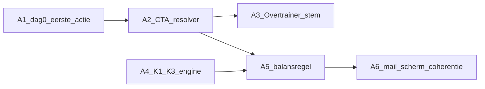

# FASE A — Implementatie-instructies (funnel-narratief)

> **✅ STATUS: GEÏMPLEMENTEERD (7 juni 2026).** Dit document is een *afgerond* plan en gearchiveerd — niet langer een openstaande opdracht. Alle stappen A1–A6 staan in `src/` en de bijbehorende tests draaien groen (`resolve-nurture-cta.test.ts` + `intake-engine.balance.test.ts`, 107 tests). Bouw hieruit **niets opnieuw**; gebruik het als naslag voor het *waarom* achter de huidige nurture-/engine-code. Vervolgwerk (meetlaag/events) staat in [`PLAN_MEASUREMENT_PERSONALIZATION.md`](../plan/PLAN_MEASUREMENT_PERSONALIZATION.md).
>
> | Stap | Onderwerp | Status | Bewijs in code |
> |---|---|---|---|
> | A1 | Dag-0 recap → eerste actie | ✅ | `renderWeakSpotBlock` + `weakSpotCopyForDomain` in `email-templates/nurture/helpers.ts`; groene guide-CTA verwijderd |
> | A2 | Centrale CTA-resolver | ✅ | `src/lib/resolve-nurture-cta.ts` (`resolveNurtureCta`, `kind`) + test |
> | A3 | Overtrainer eigen stem | ✅ | `NurtureProfileKey = ProfileLabelName \| "Overtrainer"`, eigen blokken dag 0–30, fallback verwijderd |
> | A4 | K1–K3 domein-interactie | ✅ | `lowRecoveryNoLoad` / `sleepIssueNoStress` / `energyDipUnexplained` in `intake-engine.ts` |
> | A5 | Cross-domein-balansregel | ✅ | `enforceCrossDomainBalance` + `nurtureOutputHasCrossDomainBalance` + `intake-engine.balance.test.ts` |
> | A6 | Mail/scherm-coherentie | ✅ | `profileUrlForLabel` + "Herlees je profiel →"-anker in `helpers.ts` |
>
> **Opruiming na afronding:** ongebruikte `renderLifestyleOverviewBlock` (+ helper `lifestyleOverviewIntroHtml` en import uit `lifestyle-overview-display`) uit `helpers.ts` verwijderd op 7 juni 2026.

> **Layer 3 — Plan.** Concrete werkinstructies per stap A1–A6. Geen analyse — direct naar welk bestand, wat precies, waarom zo. Copy-voorbeelden zijn kopieerbaar als startpunt. Koppeling: [`PLAN_FUNDAMENT_PRIORITEIT.md`](../plan/PLAN_FUNDAMENT_PRIORITEIT.md) · [`PLAN_FUNNEL_DATA_PRIORITY.md`](../plan/PLAN_FUNNEL_DATA_PRIORITY.md) · [`ANALYSIS_PILLAR_COVERAGE.md`](../plan/ANALYSIS_PILLAR_COVERAGE.md) · [`BRAND_POSITIONING.md`](../core/BRAND_POSITIONING.md)
>
> **Scope:** copy/resolver/engine — geen schema-migratie. Volgorde: A1 → A2 → A3 → A4 → A5; A6 naast A1–A5.

---

## Waarom FASE A eerst

De funnel-plumbing staat (tier-gating, EFSA, ashwagandha-fix, `buildNurtureEmail`-dedup). Wat nu het verschil maakt is **narratief en gating**: dag 0 beweegt niet vooruit, dag 3 kan direct naar supplement-CTA, Overtrainer verliest zijn stem na dag 0, en de cross-domein-balansregel geldt niet structureel.

FASE A lost dat op **zonder nieuwe data of schema** — puur copy, resolver, engine-regels en tests. Het is de hoogste hefboom vóór tier-2 meetlaag of n8n.



---

## A1 — Dag-0 herinrichten: recap → eerste actie

**Spoor:** 1 (nurture mail) · **Bron:** FUNNEL §1A · **Afhankelijkheid:** geen

### Bedoeling

Dag 0 is de enige mail die landt op de **piek van betrokkenheid** (net resultaat gezien). Nu herhaalt hij wat de gebruiker net zag. Na A1: één scherpe vervolgactie, niet een tweede weergave van het scherm.

### Huidige staat

[`src/lib/email-templates/nurture/day-0.ts`](../../src/lib/email-templates/nurture/day-0.ts) regel 336–344:

```
mainRows + lifestyleOverviewBlock + guideBlock(s)
```

- `renderLifestyleOverviewBlock` (helpers) = volledig domein-scoreoverzicht, identiek aan `IntakeResults`.
- Guide-blokken (`buildSleepGuideBlock`, `buildEnergyGuideBlock`, etc.) bevatten elk eigen CTA-knoppen/links → meerdere concurrerende acties.
- Primaire CTA is vaak "Bekijk je leefstijl-overzicht" → terug naar hetzelfde scherm.

### Doelstructuur dag-0

| # | Blok | Regel |
|---|---|---|
| 1 | Profielbevestiging | Eén zin herken-en-valideer ([`WRITING_VOICE.md`](../core/WRITING_VOICE.md): begrip → urgentie → actie) |
| 2 | Eerste actie (held) | Quick-win uit **zwakste domein** in quote-blok — "doe dit vandaag", één ding |
| 3 | Primaire CTA | Eén knop: profielpagina of leefstijl-overzicht (recovery-URL) |
| 4 | Gids (secundair) | Tekstlink alleen, geen tweede knop |

### Bestanden

| Actie | Bestand |
|---|---|
| Nieuw helper | [`src/lib/email-templates/nurture/helpers.ts`](../../src/lib/email-templates/nurture/helpers.ts) — `renderWeakSpotBlock(domainScores, firstName?)` |
| Hernieuw dag-0 | [`src/lib/email-templates/nurture/day-0.ts`](../../src/lib/email-templates/nurture/day-0.ts) |
| Zwakste domein | Hergebruik `getWeakestDomain()` uit [`src/data/nurture-content.ts`](../../src/data/nurture-content.ts) |

### `renderWeakSpotBlock` — pseudostructuur

```typescript
// helpers.ts — nieuw
export function renderWeakSpotBlock(
  domainScores: Record<string, number>,
  firstName?: string | null,
): string {
  const weakest = getWeakestDomain(domainScores)
  const { label, action, statusPill } = weakSpotCopyForDomain(weakest)
  // Render: 1 statusregel (zwakste domein) + 1 actie-quote, GEEN volledige 6-domein-tabel
}
```

`weakSpotCopyForDomain` — lookup per `DomainKey`:

| Zwakste domein | Statusregel | Eerste actie (vandaag) |
|---|---|---|
| `stress_score` | Stress vraagt nu je aandacht | 5 min ademhaling vóór je telefoon pakt |
| `sleep_score` | Slaap is je duidelijkste signaal | Vaste bedtijd, 3 nachten aanhouden |
| `energy_score` | Energie staat onder druk | Eiwitrijk eerste moment na opstaan |
| `recovery_score` | Herstel loopt achter | Plan 2 lichte dagen deze week |
| `movement_score` | Beweging heeft ruimte | 10 min daglicht vóór 10:00 |
| `nutrition_score` | Voeding is je zwakste pijler | 2× deze week vette vis of eiwitrijke lunch |

### Copy-startpunt per profiel (dag-0 openingszin)

Gebruik in de bestaande profiel-specifieke renderers (`renderStressdragerDay0PersonalizedRows`, `renderRecoveryLeadDay0PersonalizedRows`, `renderPersonalizedRows`):

- **Stressdrager:** "Je zenuwstelsel staat langer aan dan je zelf merkt. Vandaag: 5 minuten ademhaling vóór je telefoon pakt — dat is het enige."
- **Onrustige Slaper:** "Je slaap was het duidelijkste signaal. Vandaag: kies een vaste bedtijd en houd hem drie nachten aan."
- **Lage Batterij:** "Energie begint bij eiwit bij je eerste maaltijd. Niet de derde kop koffie."
- **Overtrainer:** "Meer trainen is niet de oplossing — je lichaam heeft twee lichte dagen nodig. Plan ze nu."
- **In Balans:** "Je basis staat goed. Vandaag: kies één domein om te verfijnen en doe daar één concrete stap."

### Guide-blokken aanpassen

In `buildSleepGuideBlock`, `buildEnergyGuideBlock`, `buildRecoveryGuideBlock`, `buildStressGuideBlock`:

- Verwijder de groene CTA-knop (`display: inline-block; padding: 12px 24px; background-color: #2D5016`).
- Behoud PDF als **onderstreepte tekstlink** onder de primaire CTA.
- Profiel-deep-dive blijft tekstlink, geen tweede knop.

### Primaire CTA per profiel (dag 0)

| Profiel | CTA-tekst | URL |
|---|---|---|
| Stressdrager | Bekijk je profiel | `/profiel/stressdrager` |
| Onrustige Slaper | Bekijk je profiel | `/profiel/onrustige-slaper` |
| Lage Batterij | Bekijk je profiel | `/profiel/lage-batterij` |
| Overtrainer | Bekijk je profiel | `/profiel/overtrainer` |
| In Balans | Bekijk je leefstijl-overzicht | recovery-URL (`resolveIntakeRecoveryUrl`) |
| Fallback | Doe je eerste stap vandaag | recovery-URL |

### Acceptatiecriteria A1

- [ ] Geen `renderLifestyleOverviewBlock` meer op dag 0
- [ ] Exact één primaire CTA-knop per mail
- [ ] Gids-PDF alleen als secundaire tekstlink
- [ ] Zwakste domein + één actie zichtbaar (niet alle 6 domeinen)
- [ ] Toon conform `WRITING_VOICE.md` — geen diagnose-taal

### Open beslispunt

Volledig overzicht in de mail laten (vertrouwd) of indikken (vooruit)? **Aanbeveling: indikken.** Volledig overzicht blijft via recovery-link.

---

## A2 — Centrale CTA-resolver + leefstijl-guard

**Spoor:** 1 · **Bron:** FUNNEL §1B-i · **Afhankelijkheid:** geen (A3 bouwt hierop)

### Bedoeling

Bundel alle CTA-keuzes op één plek. Geen supplement-compare als enige actie vóór dag 14. Hergebruik bestaande poorten: `approved-claims.ts`, `resolveNurtureTierAction`, `loadNurturePlanGate`.

### Huidige staat

Elke `NurtureBlock` in [`src/data/nurture-content.ts`](../../src/data/nurture-content.ts) heeft hardcoded `cta: { text, url }`. Bekende schendingen:

| Dag | Profiel | Huidige CTA | Probleem |
|---|---|---|---|
| 3 | Lage Batterij | `/beste/omega-3-supplement` | Supplement vóór leefstijl-hefboom |
| 3 | Onrustige Slaper | `/beste/magnesium` | Idem |
| 7 | Lage Batterij | `/beste/omega-3-supplement` | Idem |
| 14 | Lage Batterij | `/beste/omega-3-supplement` | Mag pas met tier-gate |
| 21 | Onrustige Slaper | `/beste/magnesium` | Alleen als highlight + gate groen |

### Nieuw bestand

[`src/lib/resolve-nurture-cta.ts`](../../src/lib/resolve-nurture-cta.ts)

```typescript
import type { ProfileLabelName } from "@/data/nurture-content"
import type { NurturePlanGate } from "@/lib/content/nurture-interventions"
import { isComparisonAllowed } from "@/lib/intake-engine" // bestaande helper

export type NurtureSequenceDay = 0 | 3 | 7 | 14 | 21 | 30

export type ResolvedNurtureCta = {
  text: string
  url: string
  kind: "lifestyle" | "pillar" | "supplement" | "remeasure"
}

export function resolveNurtureCta(
  profileLabel: ProfileLabelName | "Overtrainer",
  sequenceDay: NurtureSequenceDay,
  planGate: NurturePlanGate | null,
  interventionHighlightHasComparePath: boolean,
): ResolvedNurtureCta {
  // dag 0 en 3 → altijd leefstijl
  if (sequenceDay <= 3) {
    return lifestyleCtaForProfile(profileLabel)
  }
  // dag 7 → educatief / pillar
  if (sequenceDay === 7) {
    return pillarCtaForProfile(profileLabel)
  }
  // dag 30 → hermeting
  if (sequenceDay === 30) {
    return { text: "Doe de herhaalmeting", url: "/intake", kind: "remeasure" }
  }
  // dag 14/21 → supplement alleen als tier-gate + highlight + approved path
  const tierAllowsSupplement =
    planGate != null &&
    planGate.visibleTiers.includes(3) &&
    interventionHighlightHasComparePath

  if (sequenceDay >= 14 && tierAllowsSupplement) {
    const supplement = supplementCtaForProfile(profileLabel)
    if (supplement && isComparisonAllowed(supplement.url)) {
      return { ...supplement, kind: "supplement" }
    }
  }
  // fallback: altijd leefstijl
  return lifestyleCtaForProfile(profileLabel)
}
```

### Lookup-tabellen (illustratie)

**`lifestyleCtaForProfile`:**

| Profiel | Tekst | URL |
|---|---|---|
| Stressdrager | Lees de praktische stressgids | `/stress-verminderen-man` |
| Onrustige Slaper | Bekijk je slaap-overzicht | recovery-URL of `/slaap-verbeteren-na-40` |
| Lage Batterij | Bekijk je leefstijl-overzicht | recovery-URL |
| Overtrainer | Bekijk je herstel-overzicht | recovery-URL of `/profiel/overtrainer` |
| In Balans | Bekijk je leefstijl-overzicht | recovery-URL |

**`pillarCtaForProfile`:** pillar-pagina per zwakste thema (slaap/stress/energie/herstel/voeding/beweging).

**`supplementCtaForProfile`:** alleen stoffen met `approved-claims.status === 'approved'` + `comparisonPath`.

### Integratiepunten

| Bestand | Wijziging |
|---|---|
| [`src/data/nurture-content.ts`](../../src/data/nurture-content.ts) | `buildNurtureEmail` accepteert optioneel `planGate` + `resolvedCta`; overschrijft `blocks.cta` |
| [`src/lib/nurture-cron.ts`](../../src/lib/nurture-cron.ts) | Geeft `planGate` door aan email-build |
| [`src/lib/email-templates/nurture/day-3.ts`](../../src/lib/email-templates/nurture/day-3.ts) t/m `day-21.ts` | Gebruik `resolvedCta` i.p.v. `blocks.cta` |

### Testset (verplicht)

Nieuw: `src/lib/resolve-nurture-cta.test.ts`

```
Voor elke combinatie (profiel × dag 0/3/7/14/21/30 × planGate aan/uit):
  assert: dag 0/3 → kind === "lifestyle"
  assert: dag 7 → kind === "pillar" | "lifestyle"
  assert: dag 14/21 zonder gate → kind !== "supplement" OF supplement niet enige actie
  assert: geen URL naar forbidden/on_hold comparison paths
```

### Acceptatiecriteria A2

- [ ] Geen hardcoded supplement-CTA meer als primaire actie vóór dag 14
- [ ] Resolver is enige bron voor primaire CTA in dag 3–30 templates
- [ ] Testset dekt alle profiel/dag-combinaties

---

## A3 — Per-profiel zwaartepunt + Overtrainer eigen stem

**Spoor:** 1 · **Bron:** FUNNEL §1B-ii · **Afhankelijkheid:** A2

### Bedoeling

Vanaf dag 3 klinkt elke mail bewust anders per profiel. Overtrainer/recovery verliest niet meer de "Lage Batterij"-fallback.

### Huidige staat

[`src/data/nurture-content.ts`](../../src/data/nurture-content.ts) regel 494–499:

```typescript
const normalizedLabel =
  trimmed === "Stilzitter" ||
  trimmed === "Overtrainer" ||
  trimmed === "Stille Slijter"
    ? "Lage Batterij"
    : trimmed;
```

`nurtureContent` heeft alleen 4 profiel-keys; geen `Overtrainer`.

### Wijzigingen

1. **Verwijder** Overtrainer → "Lage Batterij" mapping. `Stilzitter` / `Stille Slijter` mogen naar "Lage Batterij" blijven (geen eigen pagina).
2. **Breid `ProfileLabelName` uit** met `"Overtrainer"` OF gebruik apart type `NurtureProfileKey = ProfileLabelName | "Overtrainer"`.
3. **Voeg `Overtrainer`-blokken toe** voor elke `TemplateKey` (dag 0 via day-0.ts, dag 3/7/14/21/30 in `nurtureContent`).

### Zwaartepunt per profiel (naslag)

| Profiel | Zwaartepunt reeks | Supplement secundair vanaf |
|---|---|---|
| Stressdrager | Ritme, ademhaling, herstelmomenten | dag 21, magnesium-context |
| Onrustige Slaper | Licht, bedtijd, schermen | dag 14, magnesium |
| Lage Batterij | Eiwit, daglicht, cafeïne | dag 14, omega-3 (géén energie-claim) |
| Overtrainer | Volume terug, slaap eerst | dag 21, magnesium |
| In Balans | Optimalisatie/behoud | dag 21 |

### Overtrainer copy per dag (startpunt)

| Dag | Onderwerp | Tip (leefstijl-eerst) | CTA via resolver |
|---|---|---|---|
| 3 | Wat doe je deze week minder? | Kies 2 zware sessies → licht of schrappen | Leefstijl |
| 7 | Herstel vraagt meer dan training | 30–40 min wandelen zonder stopwatch | `/gids/herstel` of profiel |
| 14 | Slaapkwaliteit check-in | Halfuur eerder naar bed, 2 avonden | Leefstijl-overzicht |
| 21 | Magnesium als aanvulling | Alleen na volume + slaap eerlijk gehouden | Supplement (gate) |
| 30 | Hermeting | Vergelijk recovery-score met start | `/intake` |

### Acceptatiecriteria A3

- [ ] Overtrainer krijgt eigen `NurtureBlock`-set voor dag 3–30
- [ ] Geen Overtrainer → "Lage Batterij" fallback meer
- [ ] Copy consistent met profielpagina [`/profiel/overtrainer`](../../src/app/profiel/overtrainer/page.tsx)

---

## A4 — Domein-interactie K1–K3 versterken

**Spoor:** 2 (engine) · **Bron:** PILLAR §3 · **Afhankelijkheid:** geen — nul nieuwe data

### Bedoeling

Drie patronen die nu tussen wal en schip vallen, worden expliciete kruisregels. Dit is het coach-onderscheid: patroon zien, niet symptoom afvinken. Corrigeert scheefheid **vóór** de voedings-meetlaag live gaat.

### Bestand

[`src/lib/intake-engine.ts`](../../src/lib/intake-engine.ts) — zelfde patroon als `magnesiumSignal`, `cortisolRisk`, `recoveryDeficit`.

### K1 — Onderherstel zonder training-oorzaak

```typescript
// Signaal
const lowRecoveryNoLoad =
  scores.recovery_score < 45 && getMovementLoad(answers) < 2

// Duiding: onderherstel NIET door training
// Advies: slaap/stress-route; quickWin uit sleep of stress
// Supplement: géén beweging-gerelateerd supplement als primaire route
// Copy: "Meer trainen is nu niet de oplossing"
```

### K2 — Slaap zonder stressdrijver

```typescript
// Signaal — LET OP: STR_FREQ >= 3 = stress gezond (hoge score)
const sleepIssueNoStress =
  answers.SLP_ONSET <= 2 && answers.STR_FREQ >= 3

// Onderscheidt van melatonine_signal (eist STR_FREQ <= 2, stress hoog)
// Advies: inslaapritueel + licht; géén stress-interventie opdringen
// quickWin: sleep-domein (bedtijd, schermen)
```

### K3 — Energie-dip zonder slaap/voeding-verklaring

```typescript
const energyDipUnexplained =
  scores.energy_score < 40 &&
  scores.sleep_score >= 50 &&
  scores.nutrition_score >= 50

// Advies: wandeling/daglicht vóór elk supplement
// quickWin: movement of connection (buiten, daglicht)
// Supplement: géén omega-3 als "energie"-fix (geen EFSA energie-claim)
```

### Integratie in `getAdvice()`

Elk signaal voegt toe aan `quickWins` met `priority` lager (eerder) dan supplement-suggesties. Volg bestaand `RankedItem`-patroon.

### Acceptatiecriteria A4

- [ ] K1–K3 als named signalen in `getDeficiencySignals()` of equivalent
- [ ] Elke regel levert minstens één `quickWin` uit ander domein dan trigger
- [ ] Geen nieuwe intake-vragen
- [ ] Unit-tests per signaal (happy path + boundary)

---

## A5 — Cross-domein-balansregel (harde invariant)

**Spoor:** 1 + 2 · **Bron:** FUNNEL §1B-iii + PILLAR §2 · **Afhankelijkheid:** A2, A4

### Bedoeling

Structureel garanderen: **elke output met supplement-suggestie bevat ≥1 leefstijl-quick-win uit een ander domein.** Zelfde principe op scherm (`getAdvice`) en in mail (`buildNurtureEmail`).

### Invariant

```
als (supplements.length > 0)
   dan (quickWins bevat ≥1 item waar domain ≠ supplementDomain)
```

### Engine — [`src/lib/intake-engine.ts`](../../src/lib/intake-engine.ts)

Aan het einde van `getAdvice()`, vóór return:

```typescript
function enforceCrossDomainBalance(result: AdviceResult, scores: DomainScores): AdviceResult {
  if (result.supplements.length === 0) return result

  const supplementDomain = result.supplements[0].domain
  const hasOther = result.quickWins.some((qw) => qw.domain !== supplementDomain)

  if (!hasOther) {
    const fallback = pickStrongestQuickWinFromOtherDomain(scores, supplementDomain)
    if (fallback) {
      result.quickWins = uniqueTopQuickWins([...result.quickWins, fallback])
    }
  }
  return result
}
```

### Mail — [`src/data/nurture-content.ts`](../../src/data/nurture-content.ts) + templates

Vóór render van dag 14/21 met supplement-tip of intervention-highlight:

```typescript
function nurtureOutputHasCrossDomainBalance(
  tip: string,           // leefstijl quick-win in mail
  supplementMentioned: boolean,
  supplementDomain: DomainKey,
  quickWinDomains: DomainKey[],
): boolean {
  if (!supplementMentioned) return true
  return quickWinDomains.some((d) => d !== supplementDomain)
}
```

Als false → injecteer leefstijl-tip uit zwakste **ander** domein (niet het supplement-domein).

### Tests

Nieuw: `src/lib/intake-engine.balance.test.ts` (property-based of matrix):

- Alle domein laag/hoog permutaties
- Geïsoleerd voedings-gat (andere domeinen gezond) → output bevat niet-voedings quick-win
- Combineer met `FORBIDDEN_PHRASES` test (inname-vs-status)

Mail-test: `resolve-nurture-cta.test.ts` uitbreiden met balans-check op dag 14/21 mock-output.

### Acceptatiecriteria A5

- [ ] Invariant in `getAdvice()` — geen enkele `AdviceResult` met supplement zonder ander-domein quick-win
- [ ] Mail dag 14/21 voldoet aan dezelfde regel
- [ ] Gedocumenteerd in [`COMPLIANCE.md`](../core/COMPLIANCE.md) als structurele borging (optioneel, 1 alinea)

---

## A6 — Mail/scherm-coherentie + profielpagina-anker

**Spoor:** 1 · **Bron:** FUNNEL §1C · **Afhankelijkheid:** naast A1–A5

### Bedoeling

Eén verhaal van scherm naar mail: zelfde toon, zelfde profiel-stem, terugkerend anker voor verdieping. `In Balans` heeft geen profielpagina — geen dode links.

### Wijzigingen per bestand

| Bestand | Actie |
|---|---|
| [`day-3.ts`](../../src/lib/email-templates/nurture/day-3.ts) t/m [`day-30.ts`](../../src/lib/email-templates/nurture/day-30.ts) | Voeg footer-regel toe: "Herlees je profiel →" met profiel-URL |
| [`nurture-content.ts`](../../src/data/nurture-content.ts) | `In Balans`: vervang "je profiel" door "je leefstijl-overzicht" waar geen `/profiel/in-balans` bestaat |
| [`helpers.ts`](../../src/lib/email-templates/nurture/helpers.ts) | `profileUrlForLabel(label)` — centrale lookup |

### Profiel-URL lookup

```typescript
const PROFILE_URLS: Record<string, string> = {
  "Onrustige Slaper": "/profiel/onrustige-slaper",
  "Stressdrager": "/profiel/stressdrager",
  "Lage Batterij": "/profiel/lage-batterij",
  "Overtrainer": "/profiel/overtrainer",
  // "In Balans" → null → gebruik recovery-URL
}
```

### SEO-regel per mail

Elke nurture-mail linkt naar **≥2 bestemmingen**:

1. Profielpagina of leefstijl-overzicht (primair anker)
2. Pillar-, gids- of educatieve pagina (secundair)

Geen mail met alleen één affiliate/compare-link als enige bestemming.

### Acceptatiecriteria A6

- [ ] Dag 3–30 bevatten profiel-anker (of leefstijl-overzicht voor In Balans)
- [ ] Geen dode "je profiel"-verwijzing voor In Balans
- [ ] Minimaal 2 interne links per mail

---

## Implementatievolgorde (morgen)

| Volgorde | Stap | Geschatte focus |
|---|---|---|
| 1 | A1 dag-0 | Copy + `renderWeakSpotBlock` — hoogste impact |
| 2 | A2 resolver + tests | Blokkeert schone reeks |
| 3 | A3 Overtrainer-blokken | Na resolver |
| 4 | A4 K1–K3 engine | Parallel mogelijk met A2/A3 |
| 5 | A5 balansregel + tests | Na A4 |
| 6 | A6 profiel-ankers | Copy-pass over alle templates |

**Kritiek pad:** A1 → A2 → A3 → A5. A4 kan parallel met A2.

---

## Koppeling merk & toekomst

| FASE A stap | Merkbelofte ([`BRAND_POSITIONING.md`](../core/BRAND_POSITIONING.md)) | Toekomst (FASE B–F) |
|---|---|---|
| A1 eerste actie | "Leefstijl eerst" — niet recap, maar momentum | Dag-0 wordt haak voor tier-2 "verdiep je profiel" |
| A2 CTA-guard | Transparant: geen supplement-push vóór bewijs | Events (`nurture.email_sent`) meten of guard werkt |
| A3 Overtrainer | Onderscheidend profiel-content | Wearable-horizon verrijkt recovery-data |
| A4 K1–K3 | Coach i.p.v. symptoomchecker — de moat | Meetlaag landt in al versterkt multi-domein frame |
| A5 balansregel | Anti-scheefheid: geen kale supplementlijst | Zelfde invariant bij inname-gaps (FASE C) |
| A6 profiel-anker | Spinnenweb: profiel als herkennings-hub | Nurture + content + social media één verhaal |

---

## Wat bewust NIET in FASE A

- Geen schema-migratie, geen nieuwe intake-vragen
- Geen wijziging tier-gating / EFSA-logica (al live)
- Geen `nurture.email_sent` events (FASE D)
- Geen productschema-normalisatie (FASE B)
- Geen herbouw 5–6 juni fixes

---

## Kruisverwijzingen

| Document | Relevantie |
|---|---|
| [`PLAN_FUNDAMENT_PRIORITEIT.md`](../plan/PLAN_FUNDAMENT_PRIORITEIT.md) | Geconsolideerde volgorde; FASE A = eerste blok |
| [`PLAN_FUNNEL_DATA_PRIORITY.md`](../plan/PLAN_FUNNEL_DATA_PRIORITY.md) | DEEL 1 analyse + aanbevelingen |
| [`ANALYSIS_PILLAR_COVERAGE.md`](../plan/ANALYSIS_PILLAR_COVERAGE.md) | K1–K3 definitie, balansregel §2 |
| [`BRAND_POSITIONING.md`](../core/BRAND_POSITIONING.md) | Propositie, differentiatie, social media |
| [`WRITING_VOICE.md`](../core/WRITING_VOICE.md) | Copy-toon alle mails |
| [`EMAIL_SYSTEM.md`](../core/EMAIL_SYSTEM.md) | Nurture-sequence, cron |
| [`PERSONALIZATION_ENGINE.md`](../core/PERSONALIZATION_ENGINE.md) | Profielen, Overtrainer-patroon |

---

*Opgesteld: 6 juni 2026. Implementatie-instructies — geen code in dit document; wijzigingen in `src/` volgen deze volgorde.*
