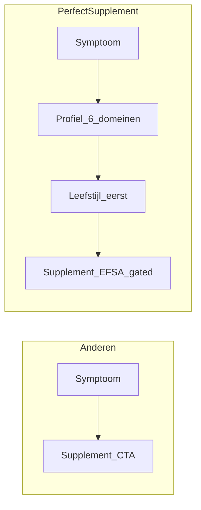
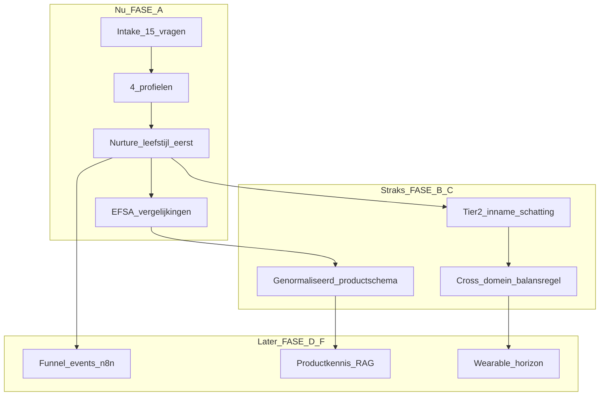

# BRAND POSITIONING — PerfectSupplement

> **Layer 1 — Core.** Merkstrategie: propositie, differentiatie, social media, transparantie vs. bescherming. Aanvulling op [`WRITING_VOICE.md`](WRITING_VOICE.md) (hoe we praten) — dit document beschrijft **waarom we bestaan** en **waar we ons onderscheiden**. Design tokens: [`DESIGN_TOKENS.md`](DESIGN_TOKENS.md).

---

## 1. Kernpropositie

PerfectSupplement is de **onafhankelijke supplementen-gids voor mannen 40+** die een persoonlijk leefstijlprofiel gebruikt om **EFSA-compliant advies** te geven — leefstijl altijd eerst, supplement altijd als aanvulling, nooit als oplossing.

**Eén zin:** De Consumentenbond van supplementen — maar dan voor jouw profiel.

**Wat we beloven:**

| Belofte | Concreet |
|---|---|
| Onafhankelijk | Geen eigen producten; affiliate volgt de redactionele keuze, niet andersom |
| Leefstijl eerst | Elke aanbeveling begint met gedrag; supplement is tier 3, niet tier 1 |
| Evidence-based | EFSA-claims letterlijk; geen hype, geen energie-claims op omega-3 |
| Persoonlijk | 6 domeinen, profiellabel, nurture op maat — geen generiek advies |
| Eerlijk over grenzen | Adviezen, geen diagnoses; inname-inschatting, geen statusclaim |

**Wat we niet zijn:**

- Geen supplementenverkoper die leefstijl als marketingpraat gebruikt
- Geen influencer die "boost" en "stack" verkoopt
- Geen generieke vergelijkingssite zonder personalisatie
- Geen medische dienst of diagnose-platform

---

## 2. Doelgroep

**Primair:** man 40+, actief leven, gezondheid serieus maar geen gezondheidsgekkie. Herkent zich in: druk werk, minder herstel, slaap/stress/energie die niet meer vanzelf terugkomen, geen tijd om alles uit te zoeken.

**Secundair (later):** coaches zonder BIG via white-label (`organization_id`) — zelfde leefstijlcoach-scope, geen klinische duiding.

**Architectuurprincipe (no-regret):** de datalaag (`SupplementCategory` in `src/types/supplement.ts`, `ThemaPageData` in `src/types/thema.ts`, profielen, intake-scoring) is symptoom-gebaseerd en gender-neutraal — geen aanname over doelgroep in schema of types. De contentlaag (copy, blog, nurture-mails) is bewust scherp gericht op de primaire doelgroep. URL's volgen leeftijd/thema (`-na-40`-conventie), nooit gender — zo blijft een eventuele toekomstige doelgroepuitbreiding een contentvraagstuk, geen architectuurmigratie.

---

## 3. Differentiatiematrix

| Dimensie | Supplementenverkopers / influencers | Generieke vergelijkingssites | PerfectSupplement |
|---|---|---|---|
| **Advies-basis** | Merk, commissie, hype | Productscores, reviews | EFSA-claims, deterministische engine |
| **Volgorde** | Supplement first | Vergelijk en kies | Leefstijl eerst → supplement als aanvulling |
| **Personalisatie** | Geen of quiz-met-affiliate-uitkomst | Geen | 6 domeinen, 4 profielen, nurture 30 dagen |
| **Claim-taal** | "Boost je energie", "detox" | Vaak vaag | Exacte EFSA-formulering + dosering |
| **Belang** | Max commissie, eigen merk | Traffic, clicks | Beste keuze wint; onafhankelijk |
| **Doelgroep** | Iedereen | Iedereen | Man 40+ (sarcopenie, cortisol, herstel, testosteron-context) |
| **Wat we níet doen** | Zeggen zelden "nee" | Zeggen zelden "nee" | Publiek: melatonine, ashwagandha, energie-claims op omega-3 |

### Het onderscheid in één mechanisme

De meeste spelers verkorten het pad: *symptoom → supplement*. PerfectSupplement verlengt het bewust: *symptoom → profiel → leefstijl-actie → (later) EFSA-conform supplement*. Dat voelt trager, maar het is het coach-onderscheid — en het beschermt compliance én vertrouwen.

---

## 4. De moat — wat je beschermt

Dit is bedrijfsinformatie die **niet publiek** hoort. Het is het onderscheid dat concurrenten niet kopiëren door alleen content te scrapen.

| Beschermd | Waarom privé |
|---|---|
| Scoring-engine (gewichten, domein-maxima) | Kern van personalisatie |
| 11+ domein-interactieregels (K1–K3 e.a.) | Coach-logica; het echte differentiator |
| Nurture-timing en sequence-logica (dag 0–30) | Conversie-architectuur |
| CTA-resolver + tier-gating regels | Funnel-intelligentie |
| Affiliate sub-ID strategie | Monetisatie-details |
| Exacte trigger-condities per profiel | Reverse-engineering voorkomen |

**Regel:** deel de *waarom* (leefstijl eerst, EFSA, doelgroep). Houd de *hoe* (scores, triggers, timing) intern.

---

## 5. Wat je actief deelt (publiek = onderscheidend)

Transparantie over keuzes **bouwt vertrouwen** — vooral als je ook zegt wat je níet doet.

| Deel publiek | Voorbeeld | Waarom het werkt |
|---|---|---|
| Methodologie op hoofdlijnen | "6 leefstijl-domeinen, leefstijl eerst" | Onderscheidt zonder engine te lekken |
| EFSA-standpunten | "Omega-3 heeft geen energie-claim — wij claimen dat niet" | Autoriteit + eerlijkheid |
| Uitsluitingen | "Ashwagandha on-hold; melatonine geen affiliate" | Niemand anders zegt dit hardop |
| Profielen | Onrustige Slaper, Stressdrager, Lage Batterij, Overtrainer | Herkennings-content = social media brandstof |
| Dosering/vorm-uitleg | "Magnesium bisglycinaat vs oxide — waarom het verschil uitmaakt" | Educatie, geen verkoop |
| Inname vs status | "Wij schatten inname, geen bloedwaarden" | Compliance + verwachtingsmanagement |

**In content mag je zeggen:** "We gebruiken een persoonlijk profiel op basis van 6 leefstijl-domeinen."

**Niet zeggen:** "stress_score < 40 triggert profiel Stressdrager."

---

## 6. Transparantie vs. bescherming — operationele regels

| Context | Deel | Bescherm |
|---|---|---|
| Website / blog | Waarom leefstijl eerst; EFSA-uitleg; profielherkenning | Exacte engine-triggers |
| Nurture-mails | Concrete acties, profiel-stem, EFSA-conforme supplement-tips | Sequence-logica, A/B-details |
| Social media | Herkenning, claim-checks, "waarom wij X niet aanbevelen" | Cron-timing, tier-gates |
| Media / interviews | Consumentenbond-positionering, onafhankelijkheid, doelgroep | Scoring-gewichten, affiliate-structuur |
| AI / LLM (later) | Productkennis-RAG (niet-persoonlijk) | Persoonsdata, anonimiseringspad |

**Vuistregel:** als het de lezer helpt beter te kiezen → deel. Als het een concurrent helpt het systeem na te bouwen → bescherm.

---

## 7. Social media strategie

Drie contentpijlers. Elke post eindigt met **één CTA** naar `/intake` of profielpagina — nooit direct naar vergelijkingspagina (consistent met FASE A CTA-guard).

### Pijler 1 — Herkenning (profiel-content)

**Format:** "Herken jij dit?" + 1 situatie + profiel-link

| Profiel | Post-idee |
|---|---|
| Stressdrager | "Je bent 's avonds uitgeput maar je hoofd gaat niet uit. Herkenbaar?" |
| Onrustige Slaper | "Je wordt moe wakker en denkt: dat hoort erbij na 40. Dat hoeft niet." |
| Lage Batterij | "Derde kop koffie vóór 14:00. Niet omdat je het lekker vindt — omdat het moet." |
| Overtrainer | "Meer trainen terwijl je lichaam rust vraagt. Herkenbaar?" |

**Kanalen:** LinkedIn (autoriteit, mannen 40+ professioneel), Instagram (visuele herkenning, carrousel "4 profielen").

**CTA:** "Doe de gratis Leefstijlcheck → link in bio" of profielpagina.

### Pijler 2 — Transparantie (claim-check)

**Format:** "Waarom wij [supplement] niet aanbevelen" of "Wat EFSA wél en niet toestaat"

| Onderwerp | Hook |
|---|---|
| Melatonine | "Boven 0,3 mg is het een geneesmiddel — daarom geen koop-CTA bij ons" |
| Ashwagandha | "On-hold bij EFSA + verbod-risico NL — wij wachten af" |
| Omega-3 + energie | "Geen EU-claim op energie — wie dat wél claimt, liegt of liegt door" |
| Magnesium vormen | "Oxide vs bisglycinaat: het verschil dat je absorbptie bepaalt" |

**Onderscheidend:** bijna niemand in de supplement-space zegt publiekelijk wat ze **niet** verkopen en waarom.

**Kanalen:** LinkedIn (long-form), YouTube/Shorts (60–90 sec uitleg), nieuwsbrief (diepere versie).

### Pijler 3 — Educatie (leefstijl eerst)

**Format:** "3 dingen die meer impact hebben dan een supplement" — per profiel of domein

| Domein | Post-idee |
|---|---|
| Slaap | "Vaste bedtijd 3 nachten — meer effect dan melatonine voor de meeste mannen" |
| Stress | "5 minuten uitademen vóór je werkmail — kleiner dan een pil, groter effect op cortisolritme" |
| Energie | "Eiwit bij het eerste eten — vóór de derde koffie" |
| Herstel | "Twee lichte dagen plannen — geen supplement lost onderherstel op" |

**CTA:** altijd `/intake` of pillar-pagina. Supplement pas in post 4+ van een serie, nooit in post 1.

### Publicatieritme (richtlijn)

| Kanaal | Frequentie | Pijler-mix |
|---|---|---|
| LinkedIn | 2–3×/week | 40% herkenning, 30% transparantie, 30% educatie |
| Instagram | 3–4×/week | 50% herkenning, 20% transparantie, 30% educatie |
| Nieuwsbrief | 1×/maand (naast nurture) | Diepere claim-check of educatie |

### Wat niet op social media

- Korting-codes of exclusieve deals als hoofdboodschap (ondermijnt Consumentenbond-positionering)
- Voor/na claims, getransformeerde lichamen
- "Boost", "stack", emoji-reeksen, superlatieven (zie `WRITING_VOICE.md`)
- Exacte engine-logica of commissie-structuren

---

## 8. Koppeling product → merk → toekomst

Het product IS het merk. Elke FASE bouwt de propositie sterker:

| Fase | Merk-effect |
|---|---|
| **FASE A** (nu) | Nurture = leefstijl-eerst-verhaal; social media en site zeggen hetzelfde |
| **FASE B** | "Objectief" wordt afdwingbaar (dosering ≥ EFSA-drempel) — sterkere Consumentenbond-claim |
| **FASE C** | Persoonlijker zonder diagnose; "inname-inschatting" als nieuwe educatie-pijler |
| **FASE D** | Meetbare funnel; beslisdata voor groei, niet giswerk |
| **Horizon** | Wearable/RAG verdiepen zonder kernbelofte te verlaten |

---

## 9. Concurrentie-respons (korte scripts)

**"Jullie verdienen toch ook aan affiliate links?"**
→ "Ja, en dat staat open op elke vergelijkingspagina. Het verschil: onze keuze wordt eerst gemaakt op basis van kwaliteit en EFSA-claims. De affiliate-link volgt die keuze — niet andersom."

**"Waarom geen ashwagandha?"**
→ "Geen goedgekeurde EFSA-claim, en er is een reëel verbod-risico in Nederland. Wij adviseren alleen wat we onderbouwd kunnen verantwoorden."

**"Hoe persoonlijk is het echt?"**
→ "Je krijgt een profiel op basis van 6 leefstijl-domeinen — slaap, stress, energie, voeding, beweging, herstel. Daaruit volgen concrete acties, niet een generieke supplementlijst."

**"Zijn jullie een coach / arts?"**
→ "Nee. Wij zijn een onafhankelijke gids. Adviezen, geen diagnoses. Bij aanhoudende klachten: huisarts of specialist."

---

## 10. Review-checklist (content & merk)

### Per social post
- [ ] Eén CTA (intake of profiel, geen directe affiliate)
- [ ] Toon conform `WRITING_VOICE.md`
- [ ] Geen engine-triggers of scoring-details gelekt
- [ ] Geen statusclaims of energie-claims op omega-3
- [ ] Affiliate-disclosure niet nodig op social (geen directe koop-link)

### Per nurture-mail / site-pagina
- [ ] Leefstijl-actie vóór supplement (FASE A guard)
- [ ] Cross-domein-balansregel (bij supplement-vermelding)
- [ ] `rel="nofollow sponsored"` op affiliate links
- [ ] MedicalDisclaimer waar vereist

### Per strategische beslissing
- [ ] Versterkt het "leefstijl eerst" zonder compliance te schenden?
- [ ] Is het uitlegbaar aan de doelgroep in één zin?
- [ ] Lekt het beschermde bedrijfsinformatie?

---

## Kruisverwijzingen

| Document | Relevantie |
|---|---|
| [`WRITING_VOICE.md`](WRITING_VOICE.md) | Toon en woorden — pas toe op alle merkuitingen |
| [`COMPLIANCE.md`](COMPLIANCE.md) | EFSA, inname-vs-status, affiliate disclosure |
| [`PERSONALIZATION_ENGINE.md`](PERSONALIZATION_ENGINE.md) | Profielen, triggers (intern kennis, niet social) |
| [`PLAN_FUNDAMENT_PRIORITEIT.md`](../plan/PLAN_FUNDAMENT_PRIORITEIT.md) | Product-roadmap ↔ merkwaardentrap |
| [`FASE_A_IMPLEMENTATIE.md`](../archive/FASE_A_IMPLEMENTATIE.md) | Concrete nurture-implementatie |
| [`SEO_RULES.md`](SEO_RULES.md) | Spinnenweb, interne links |
| [`AFFILIATE_SYSTEM.md`](AFFILIATE_SYSTEM.md) | Monetisatie (intern) |

---

*Opgesteld: 6 juni 2026. Layer 1 — Core. Stem en positionering: volg `WRITING_VOICE.md` voor copy; dit document voor strategische keuzes.*
