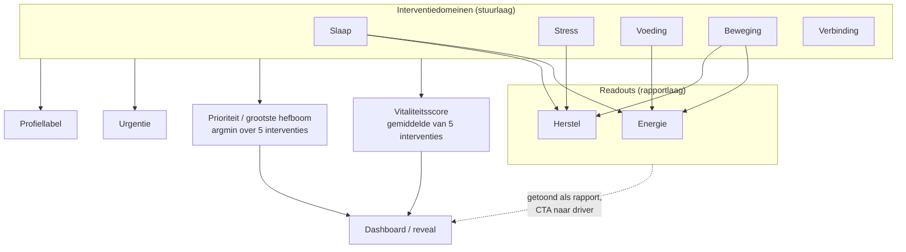

# DOMEINMODEL — PerfectSupplement Leefstijlcheck

> **Layer 1 — Concepten.** Eén bron voor wat een domein, readout, facet,
> profiel, urgentie en prioriteit betekenen. Code is leidend
> (`domain-role.ts` is SSOT); dit document beschrijft de bedoeling.
> Laatst herzien: juli 2026 · rules_version ≥ 1.3.0

Zie ook: [INTAKE_SYSTEM.md](./INTAKE_SYSTEM.md) voor flow en vragenlijst.

---

## 1. Conceptueel model

De check meet 16 vragen → 7 domeinscores. Vijf daarvan zijn **interventiedomeinen** (we routeren er een plan naartoe), twee zijn **readouts** (ervaren uitkomst; wijzen naar hun drivers). Prioriteit, urgentie, profiel en de vitaliteitsscore worden **uitsluitend** afgeleid uit de interventiedomeinen. Readouts worden getoond, niet gestuurd.

---

## 2. Definities

| Term | Definitie | SSOT |
|------|-----------|------|
| Interventiedomein | Domein waar een leefstijlplan naartoe gerouteerd wordt: slaap, stress, voeding, beweging, verbinding. Bepaalt prioriteit, urgentie, profiel en vitaliteit. | `INTERVENTION_DOMAIN_SCORE_KEYS` |
| Readout (rapportdomein) | Ervaren uitkomst zonder eigen plan: energie, herstel. Wordt getoond met "Rapport"-label + "aangedreven door"-drivers + CTA naar de sterkste driver. Stuurt niets. | `DOMAIN_ROLE`, `READOUT_DRIVERS` |
| Domeinscore | 0–100 genormaliseerde som van de bijbehorende items. Bestaat voor alle 7 domeinen (readouts inclusief, puur ter weergave). | `calcDomainScores` |
| Facet | Component van de vitaliteitsscore = de 5 interventiedomeinen. Readouts zijn géén facet. | `resolveVitaliteitFacets` |
| Vitaliteitsscore | Gewogen gemiddelde van de 5 interventie-facets (0–100). "De score van de knoppen waar je aan draait." | `computeVitaliteit` |
| Urgentie | Ernst-classificatie (critical/moderate/mild/healthy) o.b.v. hoeveel interventiedomeinen onder drempels vallen. | `getUrgency` |
| Prioriteit / grootste hefboom | Laagste interventiedomein (met movement→nutrition/stress-verfijning en overtrainer-uitzondering). Eén bron voor reveal-kop, dashboard-priority en nurture `primary_domain`. | `getPrimaryTheme` → `getPriorityPillarId` |
| Profiellabel | Herkenbaar archetype (Onrustige Slaper / Stressdrager / Lage Batterij / In Balans) afgeleid van interventie-drivers. Marketing/nurture-laag; nooit rechtstreeks door een readout getriggerd. | `getProfileLabel` |

---

## 3. Scoringregels per laag

### 3.1 Domeinscores (0–100)

| Domein | Rol | Items | Max |
|--------|-----|-------|-----|
| slaap | interventie | SLP_QUAL + SLP_CONS + SLP_ONSET + SLP_WAKE | 15 |
| stress | interventie | STR_FREQ + STR_RCV | 8 |
| voeding | interventie | NUT_O3 + NUT_PROT | 7 |
| beweging | interventie | MOV_STR + MOV_CARD | 8 |
| verbinding | interventie | CON_SOC | 4 |
| energie | readout | NRG_PATN + NRG_DEP | 8 |
| herstel | readout | RCV_PHYS | 3 |

`STR_RCV` telt alleen in stress (niet in herstel) — scoringfix juli 2026.

`LIF_ALC`, `LIF_SUN` → géén domeinscore; sturen signalen/advies.

Let op: herstel is een 1-item schaal ({33, 67, 100}). Behandel als grof signaal, niet als precisiemaat.

### 3.2 Vitaliteitsscore

- Facets = **alle** interventiedomeinen (nu 5), gelijk gewicht.
- Beide readouts (energie én herstel) staan buiten de vitaliteitsscore — symmetrisch.
- Reden: vitaliteit representeert de bestuurbare basis; een readout mengt uitkomst en gedrag.
- `vitalityDelta` is daarmee interpreteerbaar als "veranderde mijn gedrag".

### 3.3 Urgentie

Telling uitsluitend over de 5 interventie-scores (`getInterventionScoreValues`).

- critical: ≥2 < 30
- moderate: 1 < 30 of ≥3 < 50
- healthy: alle > 60
- anders mild

### 3.4 Profiellabels

Volgorde: slaap < 40 → Onrustige Slaper; stress < 40 → Stressdrager; daarna de "energie/beweging-cluster" → Lage Batterij; anders In Balans.

De "Lage Batterij"-trigger:

- `movement_score < 35` → domain `movement`
- `energy_score < 40` → label blijft, maar domain = laagste score onder energie-drivers (slaap, voeding, beweging), tiebreak slaap > voeding > beweging

`profile.domain` is altijd een interventiedomein — nooit `energy` of `recovery`.

Nutrition en verbinding hebben geen eigen label (vallen onder In Balans).

### 3.5 Prioriteit / grootste hefboom

`getPrimaryTheme`: argmin over {slaap, stress, voeding, beweging, verbinding}, vaste tiebreak slaap > stress > voeding > beweging > verbinding, plus overtrainer-uitzondering en movement→nutrition/stress-verfijning.

Eén bron voor reveal-kop, dashboard-priority, nurture `primary_domain` en nurture-tip-domein.

---

## 4. Vraag-naar-construct mapping (16 vragen)

| Vraag | Bereik | Domein | Rol | Constructtype |
|-------|--------|--------|-----|---------------|
| SLP_QUAL | 1–4 | slaap | interventie | uitkomst-item in gedragsdomein |
| SLP_CONS | 1–3 | slaap | interventie | gedrag (ritme) |
| SLP_ONSET | 1–4 | slaap | interventie | uitkomst/gedrag |
| SLP_WAKE | 1–4 | slaap | interventie | uitkomst |
| STR_FREQ | 1–4 | stress | interventie | ervaren belasting |
| STR_RCV | 1–4 | stress | interventie | gedrag (herstelmomenten) |
| CON_SOC | 1–4 | verbinding | interventie | sociale steun |
| NUT_O3 | 1–3 | voeding | interventie | gedrag |
| NUT_PROT | 1–4 | voeding | interventie | gedrag |
| MOV_STR | 1–4 | beweging | interventie | gedrag |
| MOV_CARD | 1–4 | beweging | interventie | gedrag |
| NRG_PATN | 1–4 | energie | readout | ervaren uitkomst |
| NRG_DEP | 1–4 | energie | readout | compensatiegedrag/uitkomst |
| RCV_PHYS | 1–3 | herstel | readout | ervaren uitkomst |
| LIF_ALC | 1–4 | — (signaal) | — | gedrag |
| LIF_SUN | 1–4 | — (signaal) | — | gedrag |

Driver-mapping: energie ← slaap · voeding · beweging; herstel ← slaap · beweging · stress.

---

## 5. UX-principes (7 zichtbare pijlers)

- Alle 7 domeinen blijven zichtbaar; readouts krijgen "Rapport"-badge + "Uitkomst · aangedreven door …" + CTA naar driver.
- Readouts staan onderaan de prioriteitsladder (`derivePriority`), nooit als focus-rij.
- Vitaliteitsscore-uitleg noemt alleen de 5 interventiedomeinen.
- Geen copy noemt energie/herstel een "interventiedomein".

---

## 6. Transparantie & communicatie

- `/onderbouwing` legt interventie-vs-rapport uit met MEDLIFE/WHO/SDT-basis.
- Twee sterrenschalen: (a) signaalsterkte per vraag vs (b) domeinschaal-sterkte in het evaluatierapport.
- Bij methodiek-updates: `RULES_VERSION` bump + changelog-regel + transparantienoot.

---

## 7. Meetstrategie

- `domain_events`: prioriteits-pijler, `profile_label`, `urgency_level`, `rules_version`.
- Segment readout-divergentie: `primaryTheme ≠ profile.domain` (verwacht ≈ 0).
- Readout-CTA-clicks apart van interventie-CTA's.
- Retest-delta's taggen met `rules_version`; delta's over versiegrens markeren als niet-vergelijkbaar.

---

## 8. Migratie & backwards compatibility

| Versie | Wijziging |
|--------|-----------|
| 1.0.0 | Initiële regelset |
| 1.1.0 | `recovery_score` alleen RCV_PHYS; urgentie/priority op interventiedomeinen |
| 1.2.0 | Vitaliteit = 4 interventiedomeinen; profiellabel driver-based |
| 1.3.0 | Verbinding als 5e interventiedomein (CON_SOC); vitaliteit = 5 interventiedomeinen |

Baseline↔hermeting: recovery-, connection- en vitality-delta over een `rules_version`-grens worden onderdrukt of geannoteerd ("methodiek gewijzigd"). Historische sessies worden niet herrekend; ontbrekende `connection_score` in oude sessies wordt bij laden als 0 behandeld.
