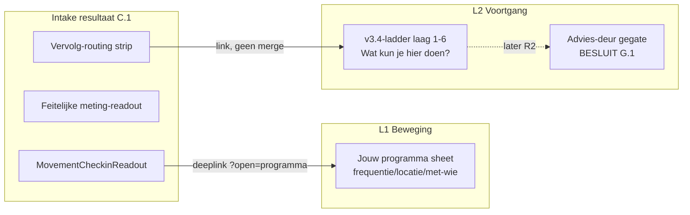

# Prompt — Beweging R0-verfijning: helderheid, meting, vervolg

> **Gebruik:** kopieer alles onder **Prompt (copy-paste)** naar Claude Opus (nieuw gesprek, Artifacts aan).
> **Output:** design/IA-spec **A t/m M** + **één standalone HTML-prebuild** met drie frames (Q vraag · R resultaat · V vervolg-strip). Geen React, geen repo-patch.
> **Doelbestand na review:** `docs/cursors/claude-opus-beweging-r0-verfijning-verdict-2026-08.md`
> **HTML na review:** `docs/design/beweging-checkin-verfijning-prebuild-r0b-2026-08.html`
> **Opgesteld:** 9 augustus 2026.

---

## Plaats in de reeks


| Doc                                                                                                                                | Relatie                                                                                           |
| ---------------------------------------------------------------------------------------------------------------------------------- | ------------------------------------------------------------------------------------------------- |
| `[claude-opus-beweging-r0-resultaat-prompt.md](claude-opus-beweging-r0-resultaat-prompt.md)`                                       | **Voorganger** — R0-brug: feit → delta → implicatie → routing; locks L1–L10 blijven staan         |
| `[claude-opus-beweging-v3.4-react-l2-verdict-2026-08.md](claude-opus-beweging-v3.4-react-l2-verdict-2026-08.md)`                   | **Implementatiepad** — R0–R5; ladder rung 1–6 is R2; F1a-freeze tot 20 aug                        |
| `[BESLUIT_BEWEGING_PRODUCT_EN_IA.md](../design/BESLUIT_BEWEGING_PRODUCT_EN_IA.md)`                                                 | §A.2 lagen · §A.4 verbod 4 (geen readout die telt wat je niet deed) · §C.2 woorden · §G.1         |
| `[beweging-checkin-readout-prebuild-r0-2026-08.html](../design/beweging-checkin-readout-prebuild-r0-2026-08.html)`                 | **Visuele basis** — `.checkin-readout` + tokens; frame R is hiervan de uitbreiding                |
| `[beweging-keuze-consumentenbond-prebuild-v3.4-2026-08.html](../design/beweging-keuze-consumentenbond-prebuild-v3.4-2026-08.html)` | Ladder-context (`LAYERS` :2954+) — alleen als bron voor de vervolg-copy, niet om te bouwen        |
| Dit document                                                                                                                       | **R0-verfijning lock** — band is intern · feit vóór kwaliteit · uitleg opt-in · vervolg = routing |


---

## Wat R0-verfijning oplost (diagnose uit codebase + test)

R0 staat live (`[MovementCheckinReadout.tsx](../../src/components/intake/MovementCheckinReadout.tsx)`, `[buildMovementFocusDelta](../../src/lib/movement-assessment.ts#L316)`). De testronde legde vier gaten bloot, en de code-inspectie voegde er twee aan toe.


| #   | Bevinding                      | Huidige staat                                                                                                    | Bestand                                                                                                                                                                      |
| --- | ------------------------------ | ---------------------------------------------------------------------------------------------------------------- | ---------------------------------------------------------------------------------------------------------------------------------------------------------------------------- |
| 1   | **"Band" is vaag**             | `"… — een band lager."` + alsoLine `"consistentie ging een band omlaag"`; ook in de tests vastgelegd             | `[movement-assessment.ts:304-305](../../src/lib/movement-assessment.ts#L304-L305)`, `[:373-375](../../src/lib/movement-assessment.ts#L373-L375)`                             |
| 2   | **Geen vraag-uitleg**          | De vraag-tak rendert **alleen** `q.question` + knoppen; `subtitle` bestaat op 1/11 vragen en wordt nooit getoond | `[MovementCapture.tsx:486-503](../../src/components/intake/MovementCapture.tsx#L486-L503)` vs `[movement-checkin/index.ts:55](../../src/data/movement-checkin/index.ts#L55)` |
| 3   | **Geen feitelijke meting**     | 11 chips Aandacht/Redelijk/Sterk, geen antwoord, geen richtlijn-vergelijking                                     | `[MovementCapture.tsx:275-296](../../src/components/intake/MovementCapture.tsx#L275-L296)`                                                                                   |
| 4   | **Onduidelijk vervolg**        | Primaire CTA = programma-deeplink; geen zicht op ladder, Voortgang of Mijn Dag                                   | `[MovementCheckinReadout.tsx:89-116](../../src/components/intake/MovementCheckinReadout.tsx#L89-L116)`                                                                       |
| 5   | *(erbij)* **Vijf affordances** | Onder de readout staan al: ijkpunt-prompt, terug-naar-beweging, gids-CTA, Leefstijlcheck-link                    | `[MovementCapture.tsx:311-343](../../src/components/intake/MovementCapture.tsx#L311-L343)`                                                                                   |
| 6   | *(erbij)* **"Sinds je start"** | Eigen sage-kaart ónder de readout — de prebuild had hem als footnote *in* het delta-blok (`.ro-delta .start`)    | `[MovementCapture.tsx:266-273](../../src/components/intake/MovementCapture.tsx#L266-L273)`                                                                                   |


Bevinding 5 is de reden dat de vervolg-strip **niet** mag aanbouwen: het resultaat heeft nu al vier concurrerende uitgangen onder het conclusie-blok. De strip vervangt ze of hij verliest.

### Architectuur-lock (niet onderhandelbaar in de prompt)




- **Jouw programma** (C.1-sheet) ≠ **v3.4-ladder** (cross-domein advies-navigator) — bewuste knip uit `BESLUIT §C.1`
- Koppelen = link via deeplink, **nooit** programma-dials in de ladder-brug trekken
- Supplement/conversie niet op het intake-resultaat — alleen routing naar L2, waar de G.1-poorten gelden

### Twee toevoegingen op de opdracht (bewust, met reden)

1. **L15 link-budget** naast de gevraagde L11–L14. Zonder budget-lock levert Opus een strip die bovenop bevinding 5 komt te staan; dan zijn er zeven uitgangen en is de primaire CTA dood.
2. **Aerobe equivalentie-regel** in sectie D. WHO 2020 rekent 1 minuut intensief als 2 minuten matig — cardio en intensieve inspanning apart als "onder de norm" tonen is dubbeltelling en dus een evidence-fout, geen copy-fout.

---

## Gebruiksinstructie

1. Open Claude Opus, nieuw gesprek, Artifacts aan.
2. Voeg bijlagen toe (checklist hieronder).
3. Kopieer het volledige blok onder **Prompt (copy-paste)**.
4. Verwachte output: **A t/m M**, met **K** als klikbaar HTML-bestand (drie frames + state-switcher F1–F6).
5. Review **B**, **C**, **D**, **I**, **K** op **375px** primair.
6. Sla verdict op als `docs/cursors/claude-opus-beweging-r0-verfijning-verdict-2026-08.md`.
7. Sla HTML op als `docs/design/beweging-checkin-verfijning-prebuild-r0b-2026-08.html`.
8. Na review: Cursor-implementatie via sectie **L** (slices R0d–R0g, aparte prompts).

### Bijlagen-checklist

- **Verplicht** — screenshot huidig resultaat (375px) met de "één band lager"-regel: de case uit de test
- **Verplicht** — `[beweging-checkin-readout-prebuild-r0-2026-08.html](../design/beweging-checkin-readout-prebuild-r0-2026-08.html)`
- **Aanbevolen** — `[beweging-keuze-consumentenbond-prebuild-v3.4-2026-08.html](../design/beweging-keuze-consumentenbond-prebuild-v3.4-2026-08.html)` scherm C (ladder-context)
- **Aanbevolen** — `[WRITING_VOICE.md](../core/WRITING_VOICE.md)`
- **Optioneel** — uitvoer van `[scripts/movement-delta-falsify.mjs](../../scripts/movement-delta-falsify.mjs)` (T1–T7-verdeling op echte data; bepaalt of T5 of T1 de standaard-ervaring is)

---

## Prompt (copy-paste)

```text
═══════════════════════════════════════════════════════════════════════════════
ROL
═══════════════════════════════════════════════════════════════════════════════

Je bent Senior product designer + evidence editor voor PerfectSupplement
(perfectsupplement.nl) — de Consumentenbond van leefstijl voor mannen 40+.

Je levert GEEN React, GEEN repo-patch, GEEN SQL. Je levert:
  1. Een design/IA-spec secties A t/m M (markdown in je antwoord)
  2. Eén self-contained HTML-prebuild (vanilla JS, inline CSS, Google Fonts OK,
     geen andere externe assets, geen emoji) — sectie K

Alle copy in het Nederlands, jij-vorm. Nooit vage aanbevelingen: invulbare
strings, tabellen, exacte regels.

═══════════════════════════════════════════════════════════════════════════════
CONTEXT — wat er al staat (R0, live)
═══════════════════════════════════════════════════════════════════════════════

Na een volledige beweegcheck (11 vragen, schaal 1–5) ziet de gebruiker een
gedeeld readout-blok dat identiek op twee surfaces staat: het intake-resultaat
en Voortgang › Beweging. Het blok bevat, in deze volgorde:

  eyebrow "Wat je beweegcheck zegt"
  headline      → "Op basis van jouw antwoorden ligt jouw grootste beweegwinst
                   bij kracht."
  antwoord-pil  → "Kracht · Minder dan 1x per week"
  statement     → één zin over die dimensie
  delta-blok    → label "Sinds je vorige meting" + regel + optionele alsoLine
  implicatie    → één zin waar de winst zit
  routing       → terra-knop "Naar je beweegplan →" + hint-regel

Daaronder op het resultaat: een sage-kaart "Sinds je start", een rij van 11
chips ("Hoe je nu beweegt": Kracht · Aandacht, Cardio · Redelijk, …), een
optioneel blok "Herstel & klachten", een ijkpunt-prompt, een terug-knop naar
het dashboard, en een footer met gids-CTA + Leefstijlcheck-link.

Engine-begrippen die je moet kennen (en die INTERN blijven):
  • band = aandacht (antwoord 1–2) · redelijk (3) · sterk (4–5)
  • focus-dimensie = de laagste stuurbare dimensie; kandidaten zijn alleen
    zitten · kracht · conditie · consistentie · intensiteit · mobiliteit
  • herstel en klachten zijn MODERATOREN (nooit focus), motivatie bepaalt de
    grootte van de stap, conditie_ervaren en belastbaarheid zijn uitlezingen
    van conditie
  • stalled-override: consistentie ≤2 én motivatie ≤2 → focus = consistentie

═══════════════════════════════════════════════════════════════════════════════
PROBLEEM — vier bevindingen uit de testronde
═══════════════════════════════════════════════════════════════════════════════

1. "BAND" IS VAAG. De delta-regel luidt letterlijk:
     "Consistentie ging van "2 weken" naar "1 week" — een band lager."
   en de alsoLine: "Cardio ging een band omlaag."
   De gebruiker weet niet wat een band is, hoe breed hij is, of hoeveel banden
   er zijn. Het is engine-vocabulaire dat naar buiten lekt.

2. GEEN VRAAG-UITLEG. Tijdens de check staat er alleen een vraag met vijf
   knoppen. Er is één vraag met een toelichtende regel in de data (cardio,
   "zone 2"-uitleg) en die wordt zelfs niet gerenderd. De gebruiker weet niet
   waarom iets gevraagd wordt en wat hij ermee terugkrijgt.

3. GEEN FEITELIJKE METING. Het resultaat toont kwalitatieve chips
   (Aandacht/Redelijk/Sterk) zonder zijn eigen antwoord en zonder
   richtlijn-vergelijking. Voor een platform dat zich "de Consumentenbond van
   leefstijl" noemt is dat het omgekeerde van wat het belooft: oordeel zonder
   meetlat.

4. ONDUIDELIJK VERVOLG. Eén primaire CTA naar de programma-sheet, en verder
   niets over wat het platform nog voor hem heeft. Onder de readout staan
   ondertussen al vier concurrerende uitgangen (ijkpunt-prompt, terug-knop,
   gids-CTA, Leefstijlcheck-link) die niemand als "vervolg" leest.

Dit is geen styling-probleem. Het is een taal-, meetlat- en routing-probleem.

═══════════════════════════════════════════════════════════════════════════════
NOORDSTER — R0-verfijning
═══════════════════════════════════════════════════════════════════════════════

> Iemand die de beweegcheck afrondt, leest zijn eigen antwoord terug, ziet
> waar dat antwoord staat ten opzichte van een norm die we durven noemen, en
> weet welke drie dingen het platform hierna voor hem doet — in taal die hij
> ook aan een vriend zou kunnen uitleggen.

Keten:
  Vraag (+ opt-in uitleg: waarom vragen we dit)
    → Feit (jouw antwoord, letterlijk)
      → Meetlat (richtlijn waar die bestaat, eerlijk gelabeld waar niet)
        → Verandering (in antwoordlabels, nooit in banden)
          → Implicatie (één zin: waar zit winst)
            → Vervolg (maximaal drie routes, één primair)

═══════════════════════════════════════════════════════════════════════════════
HARDE LOCKS — schending = afgekeurd
═══════════════════════════════════════════════════════════════════════════════

R0-locks, ongewijzigd van kracht:

L1  GEEN "Jouw volgende 3 acties" op het check-in resultaat. Geen genummerde
    actielijst, geen micro-stappen op intake.
L2  GEEN interactieve keuzeknoppen op het resultaat. Keuze hoort op L1
    (programma/dagstap). Een disclosure die alleen tekst uitvouwt is geen
    keuzeknop — die mag (zie L13 en sectie D).
L3  GEEN plek-chips (thuis/gym/groep/coach) op het resultaat. Routing
    deeplinkt naar de programma-sheet.
L4  GEEN creatine/supplement/vergelijk/koop op het resultaat. De advies-deur
    staat alleen op Voortgang, achter twee poorten (voedingscheck + hertest).
L5  VERBODEN UI-WOORDEN, ook in aria-labels: stappenplan · route · fase ·
    spoor · startpatroon · categorie · cockpit · kompas · journey · deep view ·
    coming soon.
L6  ÉÉN primaire CTA op het resultaat: "Naar je beweegplan →" (terra-knop).
    Al het overige vervolg is een link, geen knop.
L7  SSOT: het readout-blok is identiek op het check-in resultaat en op
    Voortgang › Beweging. Alleen de omringende chrome verschilt.
L8  Delta primair = sinds de VORIGE beweegcheck. "Sinds je start" is
    secundair (footnote-gewicht, in of direct onder het delta-blok).
L9  Adviezen, geen diagnoses. Geen medische claims. Stem: begrip → urgentie →
    actie, korte zinnen, jij-vorm.
L10 F1a-freeze: ontwerp GEEN wijziging aan de L1-hero of de voorselectie.
    Deeplink-parameters (focus, open=programma) zijn toegestaan.

Nieuw in deze ronde:

L11 BAND IS INTERN. Het woord "band" mag niet voorkomen in user-facing copy,
    aria-labels, delta-regels of chip-labels. De engine mag MovementBand
    houden; de UI leest uitsluitend antwoordlabels + een feitelijke richting.
    Zelfde verbod op: niveau · trede · schijf · categorie · punten · score
    (als iets dat stijgt of daalt).

L12 FEIT VÓÓR KWALITEIT. Op het resultaat komt per dimensie eerst het eigen
    antwoord, dan de meetlat (waar die bestaat), en pas daarna een
    kwalificatie. Een chip Aandacht/Redelijk/Sterk mag nooit als enige of als
    eerste informatie over een dimensie op het scherm staan.

L13 VRAAG-UITLEG IS OPT-IN. Per vraag één expandable "Waarom vragen we dit?",
    default dicht, één regel als trigger. Tijdens de check NOOIT een band,
    score, tussenstand of voorspelling tonen — dat besmet de volgende
    antwoorden.

L14 VERVOLG IS ROUTING, GEEN SCHAP. Maximaal drie vervolg-opties op het
    resultaat, elk precies één link. Geen productkaarten, geen supplement,
    geen prijs, geen ordinaal ("laag 3 van 6", "stap 2 van 5"). De ladder
    (laag 1–6) wordt op het resultaat NIET getoond, alleen benoemd in gewone
    taal en gelinkt.

L15 LINK-BUDGET. Het resultaat heeft na deze ronde maximaal vijf uitgangen
    totaal: 1 primaire CTA + 3 vervolg-links + 1 footer-link. Er staan er nu
    al vier ónder de readout (ijkpunt-prompt, terug-naar-dashboard, gids-CTA,
    Leefstijlcheck-link). De vervolg-strip VERVANGT er dus minimaal twee.
    Lever in sectie E een expliciete voor/na-tabel van alle uitgangen met
    "blijft / verhuist / valt weg" per stuk. Aanbouwen is afkeur.

WAAR DE NIEUWE BLOKKEN DE OUDE LOCKS RAKEN — en hoe je dat oplost:
  • L2 vs D/K: "toon alle elf" en "Waarom vragen we dit?" zijn disclosures.
    Toegestaan, mits ze niets opslaan, niets kiezen en niets versturen.
  • L6 vs E: de secundaire en tertiaire vervolg-route zijn tekstlinks met een
    chevron, visueel duidelijk lichter dan de terra-knop.
  • L4 vs E: de Voortgang-route mag benoemen dát er verdieping achter zit,
    maar nooit wát voor product. "Bekijk je volledige beeld →" mag;
    "bekijk supplementen" niet.
  • L14 vs de ladder: laag 1–3 in mensentaal ("je week kleiner maken ·
    volhouden · later verdiepen") mag; laagnummers, piramide-beeld en
    "Wat kun je hier doen?"-acties blijven R2 op Voortgang.

═══════════════════════════════════════════════════════════════════════════════
BRON-DATA — de 11 vragen, letterlijk (gebruik deze labels, verzin ze niet)
═══════════════════════════════════════════════════════════════════════════════

Formaat: veld | dimensie (UI-label) | vraag | opties van 5 naar 1

MOV2_STR | kracht (Kracht)
  "Hoe vaak doe je doelgerichte kracht- of weerstandstraining?"
  5 "3x per week of vaker" · 4 "2x per week" · 3 "1x per week"
  2 "Minder dan 1x per week" · 1 "Nooit"

MOV2_CARD | conditie (Cardio)
  "Hoeveel minuten beweeg je gemiddeld per week matig intensief — stevig
   doorwandelen, fietsen of sport waarbij praten nog lukt, maar zingen niet?"
  bestaande subtitle: "Dit tempo (zone 2) traint je conditie — de basis onder
   je energie en herstel."
  5 "300 minuten of meer" · 4 "150-299 minuten" · 3 "90-149 minuten"
  2 "30-89 minuten" · 1 "Minder dan 30 minuten"

MOV2_VIG | intensiteit (Intensieve inspanning)
  "Hoeveel minuten per week beweeg je intensief — hardlopen, interval,
   stevige sport?"
  5 "150 minuten of meer" · 4 "75-149 minuten" · 3 "30-74 minuten"
  2 "Minder dan 30 minuten" · 1 "Niet"

MOV2_SIT | zitten (Zitten)
  "Hoeveel uur zit je gemiddeld per dag?"
  5 "Minder dan 4 uur" · 4 "4-6 uur" · 3 "6-8 uur" · 2 "8-10 uur"
  1 "Meer dan 10 uur"

MOV2_COND | conditie_ervaren (Ervaren conditie)
  "Hoe ervaar je jouw conditie op dit moment?"
  5 "Uitstekend" · 4 "Goed" · 3 "Redelijk" · 2 "Matig" · 1 "Slecht"

RCV_FEEL | herstel (Herstel) — MODERATOR
  "Hoe hersteld voel je je vandaag?"
  5 "Fris — klaar voor belasting" · 4 "Redelijk — lichte sessie lukt"
  3 "Matig — liever rustig aan" · 2 "Moe — liever licht of rust"
  1 "Uitgeput — liever rust"

MOV2_PAIN | klachten (Klachten) — MODERATOR
  "Heb je spierpijn of lichamelijke klachten die je beweging beperken?"
  5 "Nee" · 4 "Licht" · 3 "Regelmatig" · 2 "Veel" · 1 "Ernstig"

MOV2_MOB | mobiliteit (Mobiliteit)
  "Hoe soepel voel je je — bukken, reiken, draaien?"
  5 "Zeer soepel" · 4 "Redelijk soepel" · 3 "Gemiddeld" · 2 "Stijf"
  1 "Erg stijf"

MOV2_FUNC | belastbaarheid (Belastbaarheid)
  "Kun je twee verdiepingen traplopen zonder buiten adem te raken?"
  5 "Ja, gemakkelijk" · 4 "Meestal" · 3 "Soms" · 2 "Moeizaam" · 1 "Nee"

MOV2_CONSIST | consistentie (Consistentie)
  "Hoeveel weken heb je de afgelopen maand je beweegdoel gehaald?"
  5 "4 weken" · 4 "3 weken" · 3 "2 weken" · 2 "1 week" · 1 "Geen"

MOV2_MOTIV | motivatie (Motivatie)
  "Hoe gemotiveerd ben je om komende week te bewegen?"
  5 "Heel gemotiveerd" · 4 "Gemotiveerd" · 3 "Twijfelend"
  2 "Weinig motivatie" · 1 "Geen motivatie"

RICHTLIJN-BRONNEN die je mag noemen (en alleen deze):
  • WHO 2020 / Nederlandse Beweegrichtlijnen 2017: 150–300 minuten matig
    intensief per week, OF 75–150 minuten intensief, OF een combinatie —
    1 minuut intensief telt als 2 minuten matig.
  • WHO 2020: minimaal twee keer per week spierversterkende activiteit.
  • WHO 2020 / Beweegrichtlijnen: "voorkom veel stilzitten" — KWALITATIEF,
    er is GEEN getalsnorm. De grens van ~8 uur per dag komt uit
    cohortonderzoek naar zitgedrag, niet uit een richtlijn. Label dat
    verschil expliciet.
  • Geen richtlijn, geen norm, geen percentiel voor: ervaren conditie,
    herstel, klachten, mobiliteit, belastbaarheid, consistentie, motivatie.
    Daar is het eigen antwoord de enige meetlat ("jouw ijkpunt").

═══════════════════════════════════════════════════════════════════════════════
OUTPUT — secties A t/m M
═══════════════════════════════════════════════════════════════════════════════

── A · Diagnose testfeedback ──
Tabel met vier rijen (bevinding 1–4 uit PROBLEEM) plus minimaal twee rijen die
je zelf toevoegt. Kolommen: bevinding · huidige copy/gedrag letterlijk · waarom
het faalt (gebruikersgevolg, niet smaak) · gewenst gedrag in één zin.
Sluit af met: welke van deze zes is de duurste als je er maar één fixt, en
waarom.

── B · Delta-copy vervanging (band → feitelijk) ──
Herschrijf de zeven delta-templates. Ze heten T1–T7 en dekken:
  T1 eerste check (nulpunt)          T5 antwoord ongewijzigd
  T2 focus vooruit, statuswissel     T6 geen focus, niets veranderd
  T3 focus achteruit, statuswissel   T7 geen focus, vorige focus opgelost
  T4 focus bewoog binnen dezelfde status

Eisen:
  • minimaal 8 invulbare strings met {placeholders} — bv. {label},
    {answerLabel}, {previousAnswerLabel}, {benchmarkShort}
  • richting in mensentaal: "een stap vooruit" · "minder dan vorige keer" ·
    "hetzelfde antwoord als vorige keer" — geen band, geen niveau, geen pijl
  • T3 (de screenshot-case) krijgt naast het feit één niet-verwijtende
    vervolgzin die naar verkleinen wijst, nooit naar meer doen
  • alsoLine: maximaal 2 dimensies, puur feitelijk, met letterlijke
    antwoordlabels — "Cardio: 90-149 minuten → 30-89 minuten"
  • expliciete KILL-lijst: welke woorden en formuleringen verboden zijn, met
    per woord het alternatief

Toon-ijkpunt voor T3 (verbeter dit, kopieer het niet):
  "Consistentie: je haalde vorige maand 2 weken, nu 1 week. Dat is minder dan
   vorige keer — en precies het moment om je week kleiner te maken, niet
   zwaarder."

── C · Vraag-uitleg contract ──
Voor alle 11 velden:
  helpTitle   — max 5 woorden, identiek patroon over alle vragen
  helpBody    — 2–3 zinnen: waarom we dit vragen + wat hij ermee terugkrijgt
                op zijn resultaat
  helpAnchor  — richtlijn/bron in max 8 woorden, of null waar er geen is
                (en dan expliciet: "geen norm — dit is jouw eigen ijkpunt")

Plus:
  • UI-patroon: <details>/<summary>-disclosure onder de vraag, boven de
    knoppen of eronder — kies één en onderbouw op 375px met duimbereik
  • trigger-copy: één vaste string voor alle 11 vragen
  • wat er NIET in mag: bandgrenzen, "hiermee scoor je hoger", voorbeelden die
    het gewenste antwoord verklappen
  • hergebruik-notitie: de bestaande cardio-subtitle wordt helpBody of
    verdwijnt — kies, en zeg waarom
  • meetpunt-voorstel (zie G)

── D · Feitelijke meting-readout ──
Nieuw blok op het resultaat, boven de chips. Lever:

D1 Data-contract:
     MovementFactRow {
       dimension: MovementDimensionKey
       answerLabel: string            // letterlijk het gekozen label
       benchmarkLabel: string | null   // "Richtlijn: 150–300 min per week"
       benchmarkSource: string | null  // "WHO 2020"
       status: 'below' | 'near' | 'meets' | 'own'   // 'own' = geen norm
       whyLine: string                 // max 12 woorden, waarom dit meetelt
     }

D2 Mapping-tabel met een rij per dimensie (11 rijen), kolommen:
     dimensie · heeft richtlijn? · benchmarkLabel · bron ·
     status per antwoordwaarde 5/4/3/2/1
   Wel een richtlijn: kracht (≥2×/week) · conditie (150–300 min matig) ·
   intensiteit (75–150 min intensief).
   Zitten: GEEN getalsnorm — het kwalitatieve "voorkom veel stilzitten" is de
   richtlijn, de ~8-uursgrens is cohortonderzoek. Los dit eerlijk op.
   Geen richtlijn: ervaren conditie · mobiliteit · belastbaarheid ·
   consistentie · motivatie → status 'own', benchmarkLabel null.
   Herstel en klachten: beslis of ze überhaupt in de tabel horen of in het
   bestaande blok "Herstel & klachten" blijven — met argument. Klachten mag
   in geen geval een 'below'-oordeel krijgen (medische claim).

D3 AEROBE EQUIVALENTIE — verplicht:
   WHO rekent intensief dubbel. Iemand met 150–299 minuten matig ÉN "niet"
   intensief haalt de norm; twee losse 'below'-rijen zouden hem twee gaten
   tonen die er één is, of nul. Specificeer de regel: één gecombineerde
   aerobe uitkomst, of twee rijen met een expliciete equivalentie-regel
   ertussen. Kies er één en verdedig hem.

D4 Copy-regels bij 'below': feit + kans, nooit saldo, nooit schuld
   (BESLUIT §A.4 verbod 4: geen readout die telt wat je niet deed). Geef drie
   goede en twee afgekeurde voorbeeldregels.

D5 Verhouding tot de 11 chips: blijven ze, verdwijnen ze, of worden ze de
   samenvouwing van deze tabel? Eén besluit, met argument en met wat er op
   375px zichtbaar is boven de vouw.

── E · Vervolg-routing model ──
E0 Voor/na-tabel van ALLE uitgangen op het resultaat (L15). Kolommen:
   uitgang · nu · na deze ronde (blijft/verhuist/valt weg) · reden.
   Nu aanwezig: primaire CTA programma · ijkpunt-prompt · terug-naar-dashboard
   (alleen from=dashboard) · gids-CTA · Leefstijlcheck-link.

E1 De drie routes, één primair:
     Programma (primair, altijd)   "Naar je beweegplan →"
       → /dashboard?tab=vandaag&kompas=beweging&focus={dim}&open=programma
     Voortgang (secundair, altijd) "Bekijk je volledige beeld →"
       → /dashboard?tab=voortgang&screen=beweging
     Mijn Dag (tertiair, alleen als hij van het dashboard kwam)
       → bestaand terug-patroon
   Geef per route: copy, hint-regel van max 12 woorden, wanneer zichtbaar.

E2 Conditionele strip-varianten (kop + 1–2 regels + welke routes):
     S1 eerste check of laag totaalbeeld → wat het platform hierna doet, in
        drie stappen in gewone taal (week kleiner maken · volhouden · later
        verdiepen), zonder laagnummers
     S2 achteruitgang (screenshot-case) → empathie + één route: kleiner, niet
        meer
     S3 alles redelijk of sterk → volhouden, geen upsell, geen nieuwe taak

E3 Wat de strip NIET is: geen actielijst (L1), geen keuze (L2), geen product
   (L4), geen ladder-UI (L14). Benoem het verschil tussen "waar PS je
   naartoe stuurt" en "wat je moet doen" in twee zinnen.

── F · States — minimaal zes ──
  F1 eerste check, focus kracht, geen vorige meting
  F2 achteruitgang consistentie 2 weken → 1 week (de screenshot-case)
  F3 vooruitgang kracht "1x per week" → "2x per week" (haalt nu de norm)
  F4 alles sterk, geen focus (onderhoud)
  F5 beweging binnen dezelfde status (geen statuswissel)
  F6 stalled-override: consistentie ≤2 én motivatie ≤2
Per state: welk delta-template, welke fact-rijen zichtbaar, welke
strip-variant, welke routes, en welke regel er NIET staat.

── G · Meetplan ──
Hergebruik vóór nieuw. Bestaand:
  movement_checkin_completed { surface, focus_dimension, has_dimension_delta,
    is_recheck }
  movement_checkin_routing_click { target, surface }
  domain_tool.snapshot_viewed { domain, has_conclusion }
  clarityTag("movement_flow", …)
Kandidaten nieuw (GA4, vrije string — geen registratie nodig):
  movement_checkin_question_help_opened { field }
  movement_checkin_fact_readout_expanded { dimension | "alle" }
  movement_checkin_followup_click { target: programma|voortgang|mijn_dag }
Beslis per kandidaat: nieuw event of extra parameterwaarde op een bestaand
event. Voor de laatste geldt: movement_checkin_routing_click heeft al een
target-parameter — motiveer waarom een apart followup-event beter of slechter
is dan één funnel met drie targets. Aanbeveling van het huis is hergebruik;
overtuig of volg.
Harde eisen: geen PII, geen vrije tekst in payloads, geen nieuw durable
domain_event (die lock staat), en per event één zin "hier lees je X aan af".

── H · Commissie (verplicht — gebruik slash-prompts) ──
  /KRAAK AF [dit verfijningsplan] — geef 5 redenen om nee te zeggen
  /WELKE AANNAMES zitten onuitgesproken in [jouw ontwerp]
  /PRE-MORTEM: de verfijning mislukte over 6 weken — schrijf waarom
  /WAT ZIE IK OVER HET HOOFD in [jouw ontwerp]
Daarna per punt: jouw tegenargument én wat je concreet in het ontwerp
aanpast. Minimaal twee punten moeten tot een echte wijziging leiden — als
alles blijft staan, was de commissie decoratie.
Neem in elk geval één van deze twee mee: (a) een richtlijn noemen maakt een
'below'-antwoord confronterender dan een chip, en dat kan afhaken vergroten;
(b) uitleg per vraag verlengt een check van 11 vragen en kan de afronding
verlagen.

── I · Copy-voorbeelden — drie persona's, volledige copy ──
Geen bullets, geen lorem: het complete resultaatscherm van kop tot
strip-copy, inclusief fact-rijen en delta-regel.
  I1 Consistentie achteruit (screenshot-case): CONSIST 3→2 ("2 weken" →
     "1 week"), MOTIV 2, CARD 3, STR 2
  I2 Eerste check, cardio laag: CARD 2 ("30-89 minuten"), STR 3, SIT 2,
     geen vorige meting
  I3 Herstel-moderator actief + focus kracht: RCV_FEEL 2, PAIN 3, STR 2,
     CARD 4 (haalt de norm)

── J · Layout 375px ──
Verticale stack met geschatte hoogtes en de vouw op ~640px gemarkeerd:
  h1 + subkop → readout (feit/delta/implicatie/routing) → feitelijke meting
  (max 4 rijen zichtbaar + "toon alles") → chips secundair of samengevouwen →
  vervolg-strip → moderator-blok → footer.
Eén h1. Alle tap-targets ≥44px. Zeg expliciet wat er boven de vouw staat en
waarom juist dat.

── K · HTML-prebuild ──
Eén self-contained bestand, uitbreiding van de bestaande R0-prebuild
(zelfde tokens: shell #0E1A0F, bg #132414, sage #5A8F6A, sage-lt #9CC5A9,
terra #C8956C, move #C26E4B, ink #F1EFE8, soft #CDD7D0, mut #9FB0A6,
subtle #7E8C82; DM Sans + DM Serif Display; radius 16/14/10).

Vereisten:
  • sticky prebuild-chrome met twee switchers: frame (Q · R · V) en
    state (F1–F6), aria-pressed op de actieve knop, plus een statenote-regel
    die uitlegt wat je in deze combinatie ziet
  • Frame Q — beweegcheck-vraag: progress-strip, vraagnummer, vraag,
    5 antwoordknoppen, en de "Waarom vragen we dit?"-disclosure in beide
    toestanden (open én dicht demonstreerbaar, aria-expanded correct)
  • Frame R — resultaat: bestaande .checkin-readout ongewijzigd van vorm,
    daaronder het nieuwe meting-blok met max 4 rijen + "toon alles"-toggle,
    chips volgens je besluit in D5, dan de vervolg-strip
  • Frame V — alleen de vervolg-strip, geïsoleerd, in de drie varianten
    S1/S2/S3 achter elkaar, zodat de review de copy naast elkaar leest
  • 375px telefoonframe, werkt offline na fonts-load, geen emoji,
    geen console-fouten
  • geen actielijst, geen keuzeknoppen, geen supplement, geen laagnummers

── L · Cursor-slices (na review) ──
Genummerd R0d–R0g, geen code, wel bestanden en acceptatiecriterium per slice:
  R0d Delta-copy zonder band  → movement-assessment.ts (buildAlsoLine,
      buildMovementFocusDelta) + movement-assessment.test.ts. LET OP: de
      bestaande tests asserten de band-strings letterlijk ("een band omhoog",
      "een band lager", en een split op "ging een band" voor de
      max-2-alsoLine-regel) — die assertions moeten mee veranderen, niet
      omzeild worden.
  R0e Vraag-help data + UI → movement-checkin/index.ts (help-velden per
      vraag), MovementCapture.tsx (vraag-tak; de bestaande subtitle wordt
      nu pas gerenderd of verhuist naar helpBody)
  R0f Feitelijke meting + vervolg-strip → movement-assessment.ts
      (benchmark-mapping + rijen), MovementCheckinReadout.tsx of een nieuw
      zusje, MovementCapture.tsx (resultaat-tak)
  R0g Voortgang-parity → VoortgangDomeinScreen.tsx: welke van de nieuwe
      blokken horen óók op Voortgang (L7) en welke zijn intake-only. Beslis
      per blok; het delta-blok wordt daar teruggelezen uit opgeslagen velden
      (delta_line, delta_also_line, answer_label, implication_line), dus
      copy-wijzigingen in R0d gelden alleen voor nieuwe metingen — benoem
      die migratie-naad expliciet.
Zeg per slice of hij alleen kan of een voorganger nodig heeft.

── M · Brug-contract v3.4 (spec-only, niet bouwen) ──
  • Hoe het intake-resultaat naar Voortgang linkt zonder ladder-UI te
    dupliceren: welke parameters, welke landingspositie, wat de gebruiker
    daar als eerste ziet
  • Wat R2 blijft: laag 1–6, "Wat kun je hier doen?" op laag 3–6,
    zelf-calibratie. Geen laagnummer op het resultaat, ooit.
  • Wat R5 blijft: inplannen via Mijn Dag — alleen het deeplink-contract
    beschrijven, geen UI
  • Eén tabel: element × intake-resultaat × Voortgang × programma-sheet, met
    per cel primair/secundair/verboden

═══════════════════════════════════════════════════════════════════════════════
WAT NIET IN SCOPE VALT
═══════════════════════════════════════════════════════════════════════════════

• De volledige v3.4-ladder (laag 1–6) bouwen — dat is R2
• De programma-sheet uitbreiden (vier plek-waarden) — dat is R1
• Supplement- of vergelijk-CTA's op het intake-resultaat — G.1-poorten
• chosen_actions persistentie en teruglezing — dat is R3
• L1-hero copy of voorselectie — F1a-freeze
• Pulse-modus (alleen de herstelvraag) — benoem dat het buiten scope blijft
• Slaap/stress/energie — alleen noemen als erfgenaam van het patroon

═══════════════════════════════════════════════════════════════════════════════
KWALITEITSCHECK vóór je oplevert
═══════════════════════════════════════════════════════════════════════════════

[ ] Het woord "band" (en niveau/trede/schijf/categorie) staat in GEEN enkele
    user-facing string in A t/m M en niet in de HTML
[ ] B heeft ≥8 invulbare templates met placeholders + een KILL-lijst met
    alternatief per verboden woord
[ ] C dekt alle 11 velden, met helpAnchor null waar er geen norm is
[ ] D2 heeft 11 rijen; D3 lost de aerobe equivalentie expliciet op;
    klachten krijgt nooit 'below'
[ ] E0 is een voor/na-tabel van alle uitgangen en het totaal is ≤5 (L15)
[ ] F heeft zes states die echt verschillende copy opleveren
[ ] G motiveert per event hergebruik-of-nieuw en bevat geen nieuw durable event
[ ] H bevat vier slash-prompts en leidt tot ≥2 echte wijzigingen
[ ] I is volledige copy, geen bullets
[ ] K heeft drie frames + zes states + werkende disclosures met aria-expanded
[ ] L benoemt dat de bestaande tests de band-strings asserten
[ ] Geen enkele plek toont een ordinaal ("laag 3 van 6", "stap 2 van 5")
```

---

## Na Opus-review — Cursor-volgorde


| Slice | Wat                               | Bestanden                                                                                      | Afhankelijk van |
| ----- | --------------------------------- | ---------------------------------------------------------------------------------------------- | --------------- |
| R0d   | Delta-copy zonder band            | `movement-assessment.ts`, `__tests__/movement-assessment.test.ts`                              | —               |
| R0e   | Vraag-help data + UI              | `data/movement-checkin/index.ts`, `MovementCapture.tsx` (vraag-tak)                            | —               |
| R0f   | Feitelijke meting + vervolg-strip | `movement-assessment.ts`, `MovementCheckinReadout.tsx`, `MovementCapture.tsx` (resultaat-tak)  | R0d             |
| R0g   | Voortgang-parity + migratie-naad  | `VoortgangDomeinScreen.tsx`, evt. `api/intake/movement-checkin/route.ts` (`raw_inputs`-velden) | R0f             |


**Migratie-naad om niet te vergeten:** Voortgang leest het readout-blok terug uit `intake_domain_checkin.raw_inputs` (`delta_line`, `delta_also_line`, `answer_label`, `implication_line` — `[route.ts:232-247](../../src/app/api/intake/movement-checkin/route.ts#L232-L247)`). Nieuwe copy uit R0d geldt dus alleen voor metingen ná de deploy; oude rijen blijven "een band lager" tonen tot iemand hermeet. Dat is acceptabel, maar het moet een besluit zijn en geen verrassing.

**Meetpunt:** `movement_checkin_completed` (afronding · `has_dimension_delta`) · `movement_checkin_routing_click{target}` (welke vervolg-route wint) · `movement_checkin_question_help_opened{field}` (of de uitleg gelezen wordt, en bij welke vraag) · `domain_tool.snapshot_viewed{has_conclusion}` (terugkeer naar Voortgang) — hier lees je het effect af.

---

## Gerelateerde docs

- Voorganger-prompt: `[claude-opus-beweging-r0-resultaat-prompt.md](claude-opus-beweging-r0-resultaat-prompt.md)`
- Implementatiepad + slice-roadmap: `[claude-opus-beweging-v3.4-react-l2-verdict-2026-08.md](claude-opus-beweging-v3.4-react-l2-verdict-2026-08.md)` §E, §G
- IA-besluit: `[BESLUIT_BEWEGING_PRODUCT_EN_IA.md](../design/BESLUIT_BEWEGING_PRODUCT_EN_IA.md)` §A.2, §A.4, §C.1–C.2, §G.1
- Falsificatie-script voor de delta-aanname: `[scripts/movement-delta-falsify.mjs](../../scripts/movement-delta-falsify.mjs)`

