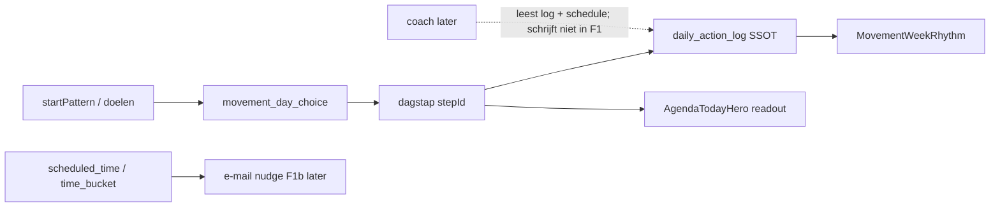

# Prompt — Beweging vandaag × programma × Mijn Dag (koppeling, reminder, coach-naad)

> **Gebruik:** kopieer alles onder **Prompt (copy-paste)** naar Claude Opus in een nieuw gesprek. Voeg de screenshots toe (bijlagen-checklist).
>
> **Output:** uitsluitend IA + datastroom-oordeel + meetplan + fasering — geen code, geen diffs, geen bestandspatches.
>
> **Opgesteld:** 1 augustus 2026. Harde context geverifieerd tegen `s0-s1-stappenplan-ontdichten` (basis `06bd779`) **inclusief de uncommitted `movement_day_choice`-laag** (19 gewijzigde bestanden + 1 nieuwe migratie).

## Plaats in de reeks

| Doc | Levert | Relatie tot dit doc |
| --- | --- | --- |
| [`BESLUIT_BEWEGING_PRODUCT_EN_IA.md`](../design/BESLUIT_BEWEGING_PRODUCT_EN_IA.md) | product + IA Beweging, F1/F1b/F2/F3 | **de lock** — §F (nudge), §I.4 vraag 3 (Mijn Dag), §H.1 (attributie) |
| [`claude-brug-beweging-voortgang-na-f1-prompt.md`](claude-brug-beweging-voortgang-na-f1-prompt.md) | de brug Beweging → Voortgang | **parallelle naad** — die gaat over *meten*, deze over *doen* |
| [`fable-agenda-checkin-verdict-2026-07.md`](fable-agenda-checkin-verdict-2026-07.md) | 4 gelockte agenda-besluiten | `agenda_preferences`, `agenda.slot_tweaked`, build-trigger |
| [`fable-roadmap-vervolg-verdict-2026-07.md`](fable-roadmap-vervolg-verdict-2026-07.md) | kolom-freeze `account_priority_pref` (§2.3) | **de spanning** die deze ronde moet oplossen |
| [`ROADMAP_DASHBOARD_COCKPIT.md`](../core/ROADMAP_DASHBOARD_COCKPIT.md) | analyse · plan · agenda · evidence | SSOT-lagen |

**Verschil met de brug-prompt.** Die sluit de naad Beweging ↔ Voortgang (analyse ontvangen). Deze sluit de naad
Beweging ↔ Mijn Dag (executie synchroon houden) en beantwoordt de drie vragen die daarachter hangen: mag het
programma de agenda vullen, hoe komt er een herinnering op de telefoon, en wat mag een coach later.

## Vertrekpunt — het verdict dat deze prompt vastlegt

| Koppeling | Slim? | Waarom |
| --- | --- | --- |
| `vandaag.trainen` ↔ Mijn Dag (zelfde stap/titel/afvink) | **Ja** | Eén mentaal model; de uncommitted `movement_day_choice`-laag doet dit al grotendeels |
| `startPattern` / dagelijks ritme → welke "Trainen"-stap | **Ja (al zo)** | Programma is *input* voor de dagstap, geen tweede doe-surface |
| Programma-dosis (2×/week) → automatisch `agenda_blocks` | **Nee (nu)** | Maakt een tweede completion-bron + vinklijst; botst met SSOT `daily_action_log` |
| Reminder naar mobiel | **Deels** | E-mail-nudge F1b (bestaand besluit), geen web-push; timing via `time_bucket` / `scheduled_time` |
| Coaches later | **Alleen naad openhouden** | Entitlement `"coach"` bestaat; geen coach-writepad tot AVG/DPIA/tenant rond zijn |

Opus mag hiervan afwijken, maar alleen met onderbouwing en expliciet gemarkeerd als PIVOT.

## De vier waarheidslagen

Houd ze apart; koppel alleen waar de gebruiker anders twee waarheden ziet.



## Gebruiksinstructie

1. Open Claude Opus (nieuw gesprek).
2. Voeg bijlagen toe (checklist onderaan) — **zonder screenshots geen IA-oordeel over Mijn Dag**.
3. Kopieer het volledige blok onder **Prompt (copy-paste)**.
4. Verwachte output: secties **A t/m J** exact.
5. Review **A** (verdict per laag) en **J** (de ene volgende slice) → daarna pas een implementatie-opdracht.

---

## Prompt (copy-paste)

```text
ROL: Je bent Senior UX-architect + productstrateeg + behavioral scientist voor
PerfectSupplement (perfectsupplement.nl). Je beoordeelt en ontwerpt één naad: de
dagstap beweging, het programma erachter, en het cross-domein-scherm Mijn Dag —
plus de drie vragen die daaraan hangen (agenda-materialisatie, herinnering,
coach-naad).

OUTPUT-CONTRACT: uitsluitend analyse, informatiestructuur, datastroom-oordeel,
meetplan en fasering. GEEN code, GEEN diffs, GEEN JSX, GEEN SQL, GEEN Tailwind,
GEEN bestandspatches, GEEN "ik ga nu bouwen". Output in het Nederlands;
identifiers/veldnamen/componentnamen in het Engels.

Lees CLAUDE.md mee als je het hebt.

═══════════════════════════════════════════════════════════════════════════════
SCHERMSTAAT — uit de code gelezen op 1 augustus 2026, inclusief working tree
Er zijn GEEN screenshots. Dit blok vervangt ze. Neem het als waar aan; verzin
geen aanvullende schermstaat en label niets als AANNAME wat hier staat.
═══════════════════════════════════════════════════════════════════════════════

BEWEGING 375px — staat 1: er is nog geen keuze vastgelegd (het VOORSTEL)
  Donkere kaart, aria-label "Vandaag — beweging".
    eyebrow   "Vandaag · {kracht|conditie|herstel}" (modaliteit uit de step-tags)
    kop       de titel van de plan-stap, serif 20px
    optioneel "↳ Past bij: {anker}" als er een anker gekozen is
    body      eerste zin van de step-rationale + eventuele anker-suffix
    duur      klok-icoon + durationLabel — "10–20 min" / "20–45 min" / "30–45 min"
    primary   "Gedaan" (volle breedte-helft)
    secondary "Ik doe de korte" + subregel "telt volledig mee" (niet bij herstel)
    onder     tekstknop "Wijzig keuze"
    daaronder uitklap "{whyLinkLabel}" met de tier-uitleg
    daaronder gestippeld kader met label "Straks"

BEWEGING 375px — staat 2: ná "Wijzig keuze" (de tier-lijst)
  Drie ChoiceCards onder elkaar, elk: icoon · label ("Herstel" / "Matig bewegen"
  / "Trainen") · optioneel badge "Aanbevolen" · subregel "{titel van de stap} ·
  {durationLabel}" · chevron rechts. De aanbevolen kaart heeft accentrand.
  Kies je "Trainen", dan komt eerst de trainingspoort (copy: "Na zware training
  is rust of matig bewegen vaak slimmer. Kies wat …").

MIJN DAG — de linkerkolom (desktop; op 375px onder de vouw)
  CockpitProfileRail toont onder het kopje "VANDAAG" een statusbolletje en één
  regel: "Gedaan — je stap van vandaag is afgevinkt." óf "Je dagstap staat klaar
  — nog niet afgevinkt."
  ⚠ Die regel leest een ANDERE bron dan de Gedaan-knop: hij komt uit
  `model.activeHabit.state === "done"` (server-model), terwijl elke Gedaan-knop
  uit `daily_action_log` leest. Op een geverifieerde schermafdruk van 1 augustus
  staat links "nog niet afgevinkt" terwijl het detailscherm rechts "✓ Gedaan" en
  "Morgen staat hier je volgende stap." toont. Dit is dus geen
  verversingsvertraging maar een derde readout op een eigen bron.

MIJN DAG 375px — de dagtijdlijn
  Boven de tijdlijn hangt een VASTGEPINDE strip, géén blok in het raster:
    label   "STAP UIT JE PLAN" (10px, uppercase)
    titel   {block.title}, één regel, truncate
    verder  niets — GEEN tijd, GEEN duur, GEEN tier-label, GEEN vinkje
  Het onderliggende TimelineBlock heeft wél een startTime (uit scheduledTime /
  time_bucket) en een HARDGECODEERDE duur van 45 minuten
  (ANALYSIS_BLOCK_DURATION_MINUTES), ongeacht welke tier is gekozen. Die tijd en
  duur worden nergens getoond en positioneren de strip niet in het raster.
  Onder de tijdlijn: weekstrip + knoppen "Moment" en "Hoe verschuift je analyse?".
  Het raster loopt van 07:00 tot 22:00 en is voor een gebruiker met alleen een
  dagstap vólledig leeg — vijftien uur wit, met alleen de nu-lijn.

MIJN DAG — de sheet "Nieuw leefstijlmoment" (achter de knop "Moment")
  CATEGORIE als chips: Slaap · Stress · Voeding · Beweging · Verbinding ·
  Supplementen · Water drinken · Werk · Ontspanning · Persoonlijke routine.
  Daarna "HOE NOEM JE DIT MOMENT?" (vrij tekstveld), START en EIND (tijdvelden,
  default 12:00 / 12:30) en de primary "+ Toevoegen".
  Een zo aangemaakt moment landt WÉL als blok in het uurraster, met zichtbare
  begin- en eindtijd. Er ontstaan dus twee visueel verschillende "balken" op één
  dag: het voorstel (strip, buiten het raster, geen tijd zichtbaar) en het zelf
  gezette moment (blok, in het raster, tijd zichtbaar).

MIJN DAG 375px — het detailscherm achter die strip
  AgendaBlockDetailSheet rendert AgendaTodayHero (variant "detail"):
    eyebrow  "Beweging · stap uit je plan" + rechts tekstknop "Verplaats"
    "Verplaats" klapt AgendaTimeBucketPicker uit (zet scheduledTime)
    kop      de titel van de geldende tier (volgt movementDayChoice, anders het
             daily-log, anders de default dagstap)
    body     rationale/contextregel
    primary  "Markeer als gedaan" → wordt "✓ Gedaan"
    onder    "X dagen op rij" bij streak ≥ 2 · "Morgen staat hier je volgende
             stap." als afgevinkt
    links    "Waarom? →" · eventueel planLink · na afvinken de follow-up-link
  ⚠ Wat hier NIET staat: de durationLabel van de gekozen tier, het tier-label
  zelf, en enige tier-picker. `durationLabel` komt in de hele codebase maar op
  twee plekken voor, allebei in MovementTodayHero.

SHEET "JOUW PROGRAMMA"
  Achter de regel "Je programma · {label}, {frequency} ›" op Beweging. Toont
  dosis + dagen; heeft eigen lokale state.

OPTIONEEL MEEGEGEVEN: BESLUIT_BEWEGING_PRODUCT_EN_IA.md; het agenda-verdict.

═══════════════════════════════════════════════════════════════════════════════
WAAROM DEZE PROMPT BESTAAT
═══════════════════════════════════════════════════════════════════════════════

Beweging is sinds F1a één doe-surface met één afvink-oppervlak. Maar de dagstap
bestaat op twee plekken: op Beweging (de hero, waar je de zwaarte kiest) en op
Mijn Dag (dezelfde stap, in het detailscherm van de dagtijdlijn). Tot vandaag
liepen die uit elkaar: Beweging kende drie tiers, Mijn Dag toonde altijd de
default. Er ligt nu ongecommitte code die dat oplost door de dagkeuze expliciet
op te slaan in plaats van hem af te leiden uit welk vinkje toevallig aanstaat.

Dat werk maakt drie vervolgvragen acuut, en die zijn de reden voor deze ronde:

  1. Hoe ver mag de koppeling gaan? Als het programma zegt "2× kracht per week",
     mag dat dan automatisch tijdblokken in Mijn Dag zetten? Dat voelt logisch
     en is waarschijnlijk fout — het zou een tweede completion-bron maken.
  2. Hoe komt er een herinnering op iemands telefoon? Er is geen push-
     infrastructuur en die is expliciet gelockt uit F1. Wat blijft er over, en
     waar haalt dat zijn timing vandaan?
  3. Wat mag een coach straks? Het entitlement bestaat al, het portaal niet.
     Welke naad moet je nu schoonhouden zodat je later niet hoeft te slopen?

En er is een openstaande architectuur-spanning die je in deze ronde MOET
beslechten (zie het blok ROADMAP-SPANNING hieronder).

JOUW JOB: beoordeel per laag of koppelen slim is (taak A), maak de doel-IA
concreet (taak B), ontwerp de reminder-architectuur en de coach-naad (taak C),
en lever één volgende slice op (taak D). Alles wat daar niet in past, parkeer
je expliciet.

═══════════════════════════════════════════════════════════════════════════════
DE VIER WAARHEIDSLAGEN — houd ze uit elkaar
═══════════════════════════════════════════════════════════════════════════════

  laag 1  PROGRAMMA-CONFIG   startPattern (kracht / conditie / dagelijks_ritme),
                             doel-dosis (sessies × minuten), gekozen sporten.
                             Woont in movement-prefs + het plan-profiel.
  laag 2  DAGKEUZE           welke zwaarte geldt vandaag: herstel | matig |
                             trainen. Nieuw, expliciet opgeslagen, verloopt om
                             middernacht.
  laag 3  EXECUTIE           daily_action_log — de SSOT van "gedaan". Eén rij
                             per domein per dag met een keys-array.
  laag 4  AGENDA-TIJD        wanneer op de dag. scheduled_time / time_bucket
                             (één per account) en agenda_blocks (handmatige
                             momenten met start- en eindtijd).

  Datastroom zoals hij nu is:

    startPattern ─┐
                  ├─► dagstap-resolver ─► stepId ─┬─► daily_action_log (SSOT)
    dagkeuze ─────┘                               ├─► Beweging-hero
                                                  └─► Mijn Dag (readout)
    scheduled_time / time_bucket ─► (nog nergens naartoe: geen kanaal)
    daily_action_log ─► weekritme "Deze week"
    agenda_blocks ─► dagtijdlijn (los van bovenstaande keten)

═══════════════════════════════════════════════════════════════════════════════
HARDE CONTEXT — GEVERIFIEERD 1 AUGUSTUS 2026
Neem dit als waar aan. Verzin geen alternatieve staat. Oudere analysedocumenten
die hiermee conflicteren zijn verouderd.
═══════════════════════════════════════════════════════════════════════════════

BEWEGING — de doe-surface (in productie)

  MovementCockpit rendert, in deze volgorde:
    1. MovementTodayHero  — het voorstel + Gedaan + "Ik doe de korte" +
                            "Wijzig keuze"; het ENIGE afvink-oppervlak op deze
                            surface. 759 regels.
    2. regel "Je programma · {label}, {frequency} ›" → opent MovementProgramSheet
    3. positieregel ("Je bouwt basis · week 3 · sinds 14 juli")
    4. MovementWeekRhythm — "Deze week", leest uitsluitend daily_action_log
    5. conditioneel: "Klopt dit voor jou?" → MovementStartChoice inline

  DE DRIE TIERS (movement-today-choices.ts):
    herstel  "Herstel"        10–20 min  · herstel/mobiliteit/rust
    matig    "Matig bewegen"  20–45 min  · conditie zonder je te slopen
    trainen  "Trainen"        30–45 min  · volle belasting, kracht of conditie
    Elke tier wijst naar een échte stap-id uit het movement-plan-template.
    "Trainen" wordt geforceerd naar een stap met intensityTier "high", zodat
    trainen nooit dezelfde stap toont als herstel.

  PROGRAMMA → DAGSTAP (movement-prefs.ts, resolvePatternTrainingStepId):
    startPattern = kracht | conditie  → eerste passende, niet-rust stap uit de
                                        actuele fase van het plan-template
    startPattern = dagelijks_ritme of null → fallback op de day-model-stap
    Dit is de enige plek waar het programma de dagstap stuurt. Er is GEEN
    weekrooster dat zegt "dinsdag = kracht".

  TRAININGSPOORT: kiest de gebruiker "trainen", dan komt eerst de vraag of hij
  de afgelopen 24–48 uur al zwaar getraind heeft; pas ná die poort ligt de dag
  vast. Afhaken bij de vraag laat de dag dus onbeslist.

MIJN DAG — het cross-domein-scherm (in productie)

  AgendaScreen = dagtijdlijn + weekstrip + twee knoppen onderaan:
  "Moment" (voegt een agenda_block toe) en "Hoe verschuift je analyse?"
  (naar Voortgang).
  De dagstap staat er als strip "Stap uit je plan". Tik je die aan, dan opent
  AgendaBlockDetailSheet met daarin AgendaTodayHero (variant "detail",
  actionSurface "agenda_block_detail"). Dáár zit een tweede Gedaan-knop.
  ⚠ Belangrijk: dat is een tweede afvink-KNOP, maar geen tweede waarheid — hij
  schrijft naar hetzelfde daily_action_log. In dat scherm kun je de tijd zetten
  (AgendaTimeBucketPicker) maar NIET de zwaarte kiezen; de tier-picker bestaat
  alleen op Beweging.

AGENDA-BLOKKEN (in productie)
  Tabel agenda_blocks: account_id, date, category_id, title, start_time,
  end_time, source (default "routine"), status, external_provider,
  external_ref, deleted_at. RLS deny-all, service-role-only.
  Categorie "beweging" bestaat, maar een blok draagt GEEN stepId, GEEN tier en
  GEEN programma-koppeling. Een blok afvinken is een andere handeling dan de
  dagstap afvinken. external_* zijn gereserveerd en ongebruikt.

HERINNERINGEN (stand van zaken)
  Er is GEEN service worker, GEEN web-push, GEEN PushSubscription, GEEN SMS —
  niets van dat alles bestaat in de codebase. Wat wél bestaat: Resend voor
  transactionele mail, de nurture-sequence, en intake/hermeting-mails.
  De beweeg-nudge is in BESLUIT §F vastgelegd als F1b: e-mail via Resend, één
  kanaal, timing uit time_bucket (ochtend 07:30 / middag 12:30 / avond 18:00),
  geen bucket gezet = niet sturen, max 1 per dag, suppressie gecontroleerd op
  het verzendmoment, landing = de VANDAAG-kaart, onderwerp en preheader
  domeinvrij én scorevrij (AVG art. 9).

COACH (stand van zaken)
  ENTITLEMENT_FEATURES = ["trends", "coach", "q2"] bestaat in de code.
  De wachtlijst kent interesses "beweging-coach" e.d. onder één opgeslagen
  feature "premium-coaching". Er is GEEN coach-portal, GEEN rolmodel, GEEN
  organisatie-UI, GEEN gedeelde-toegangslaag. Multi-tenant is horizon, geen
  scope.

EVENTS DIE BESTAAN
  Client/GA4 : dashboard_vandaag_action_toggled (de regressiewacht) ·
               dashboard_vandaag_step_alternative{choice} — vuurt óók bij een
               tier-keuze en bij "Wijzig keuze" · dashboard_vandaag_training_gate
               · dashboard_vandaag_card_shown · agenda_plan_step_dismissed
  Durable    : agenda.block_created / _toggled / _deleted / _restored ·
               agenda.plan_step_dismissed / _restored · dashboard.time_bucket_set
               · dashboard.priority_selected · dashboard.beweging_programma_open
               · movement.session_logged
  ONTBREEKT  : movement.nudge_sent (F1b, nog niet gebouwd) ·
               dashboard_beweging_voortgang_click · agenda.slot_tweaked

═══════════════════════════════════════════════════════════════════════════════
DE UNCOMMITTED LAAG — neem aan dat dit er is, beoordeel hem wel
═══════════════════════════════════════════════════════════════════════════════

Er ligt ongecommitte code (19 bestanden + 1 migratie) die de dagkeuze expliciet
maakt. Wat hij doet:

  - Migratie: twee kolommen op account_priority_pref —
    movement_day_choice (herstel|matig|trainen) en movement_day_choice_date.
    Zelfde "waarde + datum"-patroon als plan_step_dismissed_date: de keuze geldt
    alleen als de datum vandaag is.
  - API: nieuwe actie set_movement_day_choice op de bestaande pref-route;
    choice=null wist de keuze ("Wijzig keuze"). Deze actie emit GEEN domain
    event (andere acties op dezelfde route doen dat wél).
  - Server: de keuze wordt bij het bouwen van het dashboard-model al tegen
    "vandaag" geresolved, zodat componenten geen datumlogica hebben.
  - Beweging-hero: het voorstel is een VOORSTEL en wordt niet opgeslagen; alleen
    een expliciete pick — of het passeren van de trainingspoort — legt de dag
    vast. De oude hydratatie-fetch (raad de keuze uit het daily-log) is weg.
  - Mijn Dag: leidt dezelfde drie tiers af uit het model en herkent daardoor
    welke tier vandaag geldt; titel en afvink-state volgen die tier. De
    vastgelegde keuze wint; het daily-log blijft terugval voor wie afvinkte
    zonder expliciet te kiezen.
  - "Deze week" ververst nu direct na een toggle in plaats van pas bij herladen.
  - De leefstijllijn toont bij een gevuld beweeg-log de programma-dosis ernaast
    ("doel 2× 30 min") als feitelijke ankerregel — expliciet geen ratio.

BEKEND GAT (moet je in sectie H beoordelen, niet oplossen met code): de dagkeuze
wordt weggeschreven, maar het geladen dashboard-model wordt daarna niet
ververst. Kiest iemand op Beweging een tier zonder af te vinken en gaat hij
daarna naar Mijn Dag, dan ziet hij daar nog de default totdat de pagina opnieuw
laadt. Er bestaat wel een onPrefUpdated-terugkoppeling in het dashboard, maar de
beweeg-hero is er niet op aangesloten.

TWEEDE BEKEND GAT — DE PLANBAARHEID VAN DE GEKOZEN TIER (geverifieerd, en voor
Dennis het zwaarste punt van deze ronde): de tier draagt een duur, maar die duur
bereikt de dag nooit.
  - Op Beweging staat de duur er wél: "10–20 min" / "20–45 min" / "30–45 min",
    zowel op de tier-kaart als in de gekozen staat.
  - Op Mijn Dag staat hij nergens. De strip toont alleen de titel; het
    detailscherm toont titel + Gedaan-knop. Geen minuten, geen tier-label.
  - Het onderliggende timeline-blok krijgt een startTime uit scheduledTime /
    time_bucket, maar een vaste duur van 45 minuten voor élke tier — dus "Herstel
    10–20 min" beslaat in het model net zoveel dag als "Trainen 30–45 min".
  - Die starttijd en duur zijn onzichtbaar: de strip hangt vastgepind bóven de
    tijdlijn en wordt niet in het uurraster gepositioneerd.
  Gevolg voor de gebruiker: hij kiest 's ochtends "Trainen · 30–45 min" en kan
  op Mijn Dag niet zien wanneer dat past of hoeveel ruimte het kost — precies de
  vraag waarvoor Mijn Dag bestaat.
  BEHANDEL DIT EXPLICIET: (a) hoort de duur van de gekozen tier zichtbaar te zijn
  op Mijn Dag, (b) hoort hij de lengte van het plan-stap-blok te bepalen in
  plaats van de vaste 45 minuten, en (c) hoort dat blok in het uurraster te
  staan in plaats van erboven te hangen — of is de vastgepinde strip juist de
  bewuste keuze. Toon per deelvraag hoe je voorkomt dat er een tweede waarheid
  ontstaat; een readout van duur is geen tweede completion-bron, maar een
  bewerkbare eindtijd zou dat wél kunnen worden. Dit is géén auto-materialisatie
  van agenda_blocks uit de weekdosis — houd die twee streng uit elkaar.

═══════════════════════════════════════════════════════════════════════════════
ROADMAP-SPANNING — je MOET hier één kant kiezen
═══════════════════════════════════════════════════════════════════════════════

Er ligt een expliciete regel uit de roadmap-evaluatie (juli 2026):

  "account_priority_pref draagt al plan_step_dismissed_date + plan_steps_hidden
   naast focus en tijd — UI-state in een unique(account_id)-rij. Werkt voor 1
   domein; bij multi-domein past per-domein-state hier structureel niet. Regel:
   GEEN NIEUWE KOLOMMEN meer op deze tabel; per-domein-state landt in het al
   gelockte agenda_preferences-ontwerp zodra de tweak-trigger slaat."

De uncommitted migratie doet precies wat die regel verbiedt: twee nieuwe
kolommen, en ze zijn per definitie domeinspecifiek (movement_*).

Kies één van twee, en verdedig hem in sectie A. Half doen mag niet:
  (i)  ACCEPTEER DE UITZONDERING. Leg dan uit waarom dit géén per-domein-state
       is of waarom de kosten van de tabel nu niet opwegen, en formuleer de
       harde grens: wat is de VOLGENDE wens die deze kolommen NIET meer mag
       krijgen, en welk signaal betekent "nu alsnog verhuizen".
  (ii) SCHRIJF EEN MIGRATIEPAD. Beschrijf hoe de dagkeuze naar agenda_preferences
       gaat (of naar een andere vorm), wat er dan met de bestaande kolommen
       gebeurt, en of dat nú moet of pas bij de tweede domeinkeuze — inclusief
       wat dat kost aan werk dat je vandaag niet nodig hebt.

Er is nog een derde optie die je mag voorstellen als je hem sterker vindt: de
dagkeuze helemaal niet persisteren en hem opnieuw afleiden uit het daily-log +
sessiestate. Als je die kiest, moet je uitleggen hoe iemand die kiest maar niet
afvinkt zijn keuze terugziet op Mijn Dag.

═══════════════════════════════════════════════════════════════════════════════
TWEE TOETSEN DIE ELK VERDICT MOET DOORSTAAN
Deze ronde blijft over de naad beweging-dagstap ↔ Mijn Dag. Maar geen enkel
verdict mag omvallen zodra Mijn Dag zijn werk voor de andere domeinen doet, en
geen enkel verdict mag de afnemer stukmaken die er al ligt.
═══════════════════════════════════════════════════════════════════════════════

TOETS 1 — HOUDBAAR BIJ n DOMEINEN
  Mijn Dag is al cross-domein aan de invoerkant: de sheet "Nieuw leefstijlmoment"
  kent tien categorieën. De VOORSTEL-kant is dat niet: `buildPlanStepBlock` geeft
  precies één plan-stap per dag, van het prioriteitsdomein.
  Zeg per verdict of het houdbaar is als er straks twee of drie domeinen
  tegelijk een dagstap voorstellen. Beantwoord daarbij expliciet, als ontwerp —
  niet als bouwopdracht:
    - Hoeveel voorstellen mogen er maximaal op één dag staan, en wat gebeurt er
      met de rest: onderdrukt, opgevouwen, of alleen het prioriteitsdomein?
    - Wat als twee voorstellen dezelfde starttijd claimen (beide time_bucket
      "ochtend")?
    - Blijft "één afvink-oppervlak per dagstap" staan bij drie dagstappen, of
      wordt dat "één afvink-oppervlak per domein per dag"?
  Ontwerp het slot-model voor n; ga ervan uit dat er voor 1 gebouwd wordt. Een
  verdict dat alleen klopt bij precies één domein is een KILL, geen GO.

TOETS 2 — DE BALK-TAAL
  Op één dag staan nu twee soorten balk (zie SCHERMSTAAT): het voorstel en het
  zelf gezette moment. Inhoudelijk zijn dat terecht twee objecten — een voorstel
  komt uit de engine en leeft in `daily_action_log`, een moment zet de gebruiker
  zelf en leeft in `agenda_blocks`; ze samenvoegen zou de tweede completion-bron
  maken die gelockt is.
  Maar het onderscheid wordt vandaag uitgedrukt als "de één zit in de tijd, de
  ander niet". Beoordeel of dat de juiste as is. Als je vindt van niet: op welke
  as hoort het verschil dan wél zichtbaar te zijn (vorm? toon? label? herkomst-
  regel?), en hoe voorkom je dat één balk-taal ertoe leidt dat een moment gaat
  meetellen als gedaan-bewijs. Geef één regel die zegt wanneer iets een voorstel
  is en wanneer een afspraak.

TOETS 3 — DE CONVERSIEKAART IS DE AFNEMER
  Er ligt een prebuild voor Voortgang (`voortgang-conversiekaart-prebuild-
  2026-07.html`) die al eisen stelt aan wat Mijn Dag oplevert. Drie van de vier
  worden vandaag niet waargemaakt. Toets je doel-IA er expliciet aan:

    (a) "De momenten die je op Mijn Dag zet. Elke dag met een moment vult één
        streepje op de liniaal."
        STAND: `agenda_blocks` voeden niets; "Deze week" leest uitsluitend
        `daily_action_log`. Twee teleenheden waar de kaart één liniaal aanneemt.
        BESLIS: telt een zelf gezet moment mee voor die liniaal, alleen een
        afgevinkte dagstap, of beide — en zo ja, hoe blijft dat één bron?
    (b) "Je stap stond op een uur. Je kunt 'm op Mijn Dag korter zetten."
        STAND: de duur is op Mijn Dag niet zichtbaar en nergens verstelbaar; het
        blok is vast 45 minuten. De kaart neemt het tegendeel aan.
        BESLIS: wordt de duur verstelbaar, alleen zichtbaar, of vervalt de
        aanname in de kaart?
    (c) "Je momenten met een stof erachter — waar dit vandaan komt."
        STAND: een `agenda_block` draagt geen herkomst: geen stepId, geen tier,
        geen gap-verwijzing.
        BESLIS: hoort herkomst op het moment te landen, en zo ja: is dat een
        veld of een afleiding — zonder dat herkomst gaat betekenen "dit telt".
    (d) "Wat je op Mijn Dag afvinkt telt hier mee als context — niet als score."
        STAND: klopt vandaag. Dit is de enige van de vier die je moet BEWAKEN in
        plaats van dichten; zeg per verdict of het deze regel intact laat.

  Behandel (a)–(d) in een eigen sub-tabel in sectie C: eis | stand vandaag |
  jouw besluit | of het de fasering raakt.

═══════════════════════════════════════════════════════════════════════════════
GELOCKTE BESLUITEN — respecteer; alleen als PIVOT met sterke onderbouwing
bediscussieerbaar, en dan expliciet gemarkeerd in sectie A
═══════════════════════════════════════════════════════════════════════════════

1.  Beweging is ÉÉN doe-surface. Geen Overzicht / Stappenplan / Programma, geen
    tabbalk, geen ?view=-routes. "Jouw programma" is één sheet achter één regel.
2.  Eén completion-waarheid: daily_action_log. Meerdere knoppen mogen ernaar
    schrijven; een tweede lijst met eigen status mag niet bestaan.
3.  Programma = input voor de dagstap, nooit een tweede doe-surface.
    Minuten uit het gedaan-log zijn evidence, nooit een tweede score.
4.  Voortgang meet, Mijn Dag doet. Geen scores of oordelen in Mijn Dag.
5.  De nudge is e-mail (F1b), geen push, geen SMS, geen in-app tegenhanger. Hij
    gaat pas aan ná een meetvenster op de geconsolideerde surface.
6.  Geen gezondheidscontext (AVG art. 9) in e-mailonderwerp of preheader: geen
    domein, geen score, geen getal dat een toestand verraadt.
7.  Geen streaks, badges, schuld-mechaniek of "0 van je 2"-taal.
8.  Geen medische claims of diagnose-taal.
9.  Geen localStorage — state hoort in Supabase.
10. B2B/white-label is horizon: geen multi-tenant, geen coach-portal, geen
    organisatie-UI. Alleen de naad schoon houden.
11. Nieuw client-event = registratie op drie plekken benoemen (events.ts,
    intake-events-client.ts, allowlist in api/intake/events/route.ts).
12. Verboden UI-woorden blijven verboden: stappenplan · route · fase · spoor ·
    startpatroon · categorie · cockpit · kompas · journey · deep view ·
    overzicht (als navigatielabel) · coming soon.

CASHFLOW-PRIORITEIT (gebruik dit om te wegen bij elk verdict)
  Retentie op de dagstap = waar dit doc over gaat; de dagstap is gratis en is de
  reden dat iemand terugkomt. Vergelijken/affiliate is de omzet-as maar hoort
  niet op deze surface. Data/wearable/B2B is horizon. Een voorstel dat geen van
  drieën dient, hoort op de parklijst.

═══════════════════════════════════════════════════════════════════════════════
DE ENE VRAAG VAN DEZE RONDE
═══════════════════════════════════════════════════════════════════════════════

  "Waar mogen de dagkeuze, het programma en de agenda-tijd elkaar raken zonder
   dat er een tweede waarheid ontstaat — en hoe bereikt één herinnering iemand
   die vandaag niet uit zichzelf opent?"

  Met als scherpste deelvraag, en de directe aanleiding voor deze ronde: de
  training die iemand op Beweging kiest draagt een duur; wat moet er van die
  duur zichtbaar en planbaar worden op Mijn Dag, zodat hij kan zien wanneer het
  past en hoeveel dag het kost — zónder dat de agenda een tweede plek wordt die
  beweert wat er gedaan is?

Alles wat die vraag niet beantwoordt, hoort in de parklijst (sectie I).

═══════════════════════════════════════════════════════════════════════════════
TAAK A — HET KOPPEL-VERDICT (primaire deliverable)
═══════════════════════════════════════════════════════════════════════════════

A1. Geef per koppeling een verdict GO / PIVOT / KILL / DEFER, met één zin
    onderbouwing en één zin over wat er kapotgaat als je het tóch doet.
    Minimaal deze koppelingen:
      - dagkeuze zichtbaar op Mijn Dag (titel + afvink-state)
      - dagkeuze wijzigbaar op Mijn Dag (tier-picker daar ook)
      - duur van de gekozen tier zichtbaar op Mijn Dag (strip en/of detail)
      - duur van de gekozen tier bepaalt de lengte van het plan-stap-blok, in
        plaats van de vaste 45 minuten
      - het plan-stap-blok in het uurraster op zijn starttijd, in plaats van
        vastgepind boven de tijdlijn
      - eindtijd van dat blok handmatig bewerkbaar op Mijn Dag
      - programma-dosis → automatisch agenda_blocks
      - agenda_block "beweging" → telt als dagstap gedaan
      - dagstap → automatisch een tijd op de dagtijdlijn
      - weekritme "Deze week" ook op Mijn Dag
      - de dagkeuze persisteren (en waar)
      - e-mailnudge op basis van time_bucket
      - web-push
      - coach leest daily_action_log
      - coach schrijft in het programma
A2. Benoem de grens in ÉÉN toetsbare regel: wanneer is iets "dezelfde stap op
    twee plekken tonen" (goed) en wanneer is het "twee plekken die hetzelfde
    beweren" (fout)? De regel moet toepasbaar zijn op een koppeling die hier
    niet in de lijst staat.
A3. Zet achter elk verdict uit A1 één kolom "n-domeinen": houdbaar / valt om /
    n.v.t., met bij "valt om" één zin wat er dan misgaat. Dit is TOETS 1 en is
    verplicht — een GO die alleen bij precies één domein klopt is geen GO.

═══════════════════════════════════════════════════════════════════════════════
TAAK B — DE HUIDIGE FRICTIE EN DE DOEL-IA
═══════════════════════════════════════════════════════════════════════════════

B1. FRICTIE. Waar lopen Beweging, het programma en Mijn Dag vandaag uit elkaar,
    en wat merkt de gebruiker daarvan? Maximaal 8 rijen, gesorteerd op impact.
    Neem in elk geval mee: de lokale state in de programma-sheet versus de hero
    versus Mijn Dag; wat er gebeurt als je op Mijn Dag afvinkt en dan naar
    Beweging gaat; wat "dagelijks_ritme" doet met de betekenis van "Trainen"; en
    het duur-gat uit TWEEDE BEKEND GAT (duur zichtbaar op Beweging, afwezig op
    Mijn Dag, vaste 45 min in het model, strip buiten het uurraster); de derde
    readout in de linkerkolom die `activeHabit.state` leest in plaats van
    `daily_action_log` en daardoor "nog niet afgevinkt" kan zeggen naast een
    afgevinkte stap; en de twee balk-soorten op één dag (TOETS 2).
B2. DOEL-IA. Beschrijf wat de gebruiker ziet op Beweging en wat op Mijn Dag,
    in drie toestanden: (a) niets gekozen, niets gedaan · (b) tier gekozen, niet
    afgevinkt · (c) afgevinkt. Per toestand: de kop, de primary, wat er secundair
    staat, en wat er expliciet NIET staat. Wees concreet over de copy in het
    Nederlands. Zeg per toestand expliciet wat Mijn Dag toont over TIJD en DUUR:
    staat er een tijdvak, staan er minuten, staan ze op de strip of pas in het
    detail — en waarom die keuze geen tweede waarheid maakt.
B3. WIE MAG WAT VERANDEREN. Eén tabel: veld | waar je het zet | waar je het
    alleen ziet | waarom niet op de andere plek.

═══════════════════════════════════════════════════════════════════════════════
TAAK C — REMINDER-ARCHITECTUUR EN COACH-NAAD
═══════════════════════════════════════════════════════════════════════════════

C1. REMINDER. Werk F1b uit tot een architectuur, binnen de lock (e-mail, geen
    push). Beantwoord expliciet:
      - Timing-bron: time_bucket, scheduled_time, of beide — en wat er gebeurt
        als er geen van beide gezet is.
      - Wie triggert de verzending: een cron/queue in de app, n8n, of Resend
        scheduling? Geef één aanbeveling met de reden, en zeg wat je NIET kiest.
      - Suppressie-regels en op welk moment ze gecontroleerd worden.
      - Landings-URL en hoe je de klik terugziet zonder PII.
      - Privacy: wat mag in onderwerp/preheader, wat in de body, welk verzendlog
        met welke bewaartermijn, en waarom dat een art. 9-vraag is.
      - Opt-in: apart van de nurture-sequence of erin, en waar de gebruiker hem
        aanzet.
      - Wanneer web-push wél terug op tafel mag: noem de exacte voorwaarde.
C2. COACH-NAAD. Beschrijf wat een coach later mag lezen en schrijven zonder dat
    er een tweede SSOT ontstaat. Minimaal:
      - Welke objecten read-only zijn (log, schedule, programma-config).
      - Waarom schrijven in F1 niet mag, en welke drie dingen er eerst moeten
        bestaan voordat het wel mag.
      - Welke naad je NU al schoon moet houden zodat je later niet hoeft te
        slopen — in maximaal 5 regels, zonder multi-tenant te bouwen.

═══════════════════════════════════════════════════════════════════════════════
TAAK D — WAT NIET BOUWEN, FASERING, EN DE ENE VOLGENDE SLICE
═══════════════════════════════════════════════════════════════════════════════

D1. ANTI-PATTERNS met reden (minimaal: auto-materialisatie van agenda_blocks uit
    de weekdosis · een tweede vinklijst · web-push in F1 · een tier-picker op
    twee plekken · een coach-writepad · de dagkeuze als score).
D2. FASERING F0 / F1a / F1b / F2 met per fase: wat er user-visible verandert,
    welk meetvenster hij opent of sluit, en wat er in dat venster bevroren moet
    blijven. Hergebruik bestaande events vóór je nieuwe verzint; als je een nieuw
    event wilt, noem de drie registratieplekken.
D3. ÉÉN volgende implementatieslice, maximaal één PR groot. Met: naam, wat de
    gebruiker merkt, toetsbare acceptatiecriteria (geen implementatietaken), wat
    er NIET in zit, en welk meetpunt hij oplevert. Als je vindt dat de
    uncommitted laag eerst af moet vóór er iets nieuws bij komt, zeg dat.

═══════════════════════════════════════════════════════════════════════════════
AANBEVOLEN DEFAULT — hier begin je; afwijken mag met onderbouwing
═══════════════════════════════════════════════════════════════════════════════

  - Pariteit Beweging ↔ Mijn Dag via één gedeeld model + daily_action_log.
  - Programma blijft input voor de dagstap; "Deze week" blijft readout.
  - agenda_blocks blijven handmatige tijd; geen auto-materialisatie uit dosis.
  - Duur van de gekozen tier is een READOUT op Mijn Dag — hij mag de lengte van
    het plan-stap-blok bepalen, maar hij is nergens bewerkbaar en verandert
    nooit wat er in daily_action_log staat.
  - Reminder = e-mail F1b, ná het meetvenster van de surface. Push = DEFER.
  - Coach later: read-only op log + schedule; schrijven alleen met expliciete
    toestemming en pas na een tenant-model.

═══════════════════════════════════════════════════════════════════════════════
KRITIEKRONDE (verplicht vóór de definitieve versie)
═══════════════════════════════════════════════════════════════════════════════

Beoordeel je eigen A–D vanuit vier perspectieven. Per perspectief 2 scherpe
kritiekpunten + 1 verbetering; verwerk ze en markeer wat je wijzigde:

1. 45-jarige man, drukke week: hij kiest 's ochtends "Trainen · 30–45 min" op
   Beweging en opent tussen twee afspraken door Mijn Dag om te zien of het nog
   past. Klopt wat hij ziet, snapt hij waaróm, en kan hij die 30–45 minuten
   daadwerkelijk in zijn dag plaatsen — of moet hij dat zelf uitrekenen?
2. Gedragswetenschapper: wat doet het vastleggen van een dagkeuze met iemand die
   hem daarna niet haalt? Wanneer wordt een expliciete keuze een schuldbewijs?
3. Front-end realist: hoeveel state-synchronisatie vraagt jouw doel-IA echt, en
   wat is de goedkoopste vorm die niet in een refresh-storm eindigt?
4. Product-eigenaar/DPO: is het reminder-ontwerp verdedigbaar zonder DPIA-
   uitbreiding, en is het effect ervan los meetbaar van de surface-wijziging?

═══════════════════════════════════════════════════════════════════════════════
OUTPUTFORMAAT (exact deze secties, in deze volgorde)
═══════════════════════════════════════════════════════════════════════════════

A. Executive verdict
   - Eén zin: hoe ver de koppeling gaat en waar hij stopt.
   - De verdict-tabel uit A1 (koppeling | GO/PIVOT/KILL/DEFER | reden | wat
     kapotgaat als je het tóch doet).
   - Je keuze in de ROADMAP-SPANNING (i / ii / derde optie) met 3 regels
     onderbouwing en de harde grens die erbij hoort.
   - Je verdict op het duur-/planbaarheidsgat: wat wordt zichtbaar op Mijn Dag,
     wat bepaalt de bloklengte, en staat het blok in het raster of erboven.
   - Als je ergens tóch iets moest aannemen dat niet in SCHERMSTAAT of HARDE
     CONTEXT staat: benoem het als AANNAME. Screenshots ontbreken bewust; dat is
     op zichzelf geen reden om iets als AANNAME te labelen.

B. Huidige frictie
   De tabel uit B1, max 8 rijen: probleem | wat de gebruiker merkt | oorzaak |
   raakt welk oppervlak.

C. Doel-IA
   B2 en B3 uitgewerkt: de drie toestanden op beide schermen, met NL-copy voor
   koppen en CTA's, plus de tabel wie-mag-wat-veranderen. Sluit af met de
   toetsbare grensregel uit A2.

D. Reminder-architectuur
   C1 volledig, als beslistabel (trigger | kanaal | timing-bron | suppressie |
   landing | privacy | opt-in) plus de verzendketen in maximaal 10 regels
   proza. Inclusief de exacte voorwaarde waaronder push terug op tafel mag.

E. Coach-naad
   C2: read/write-matrix, de drie voorwaarden vóór schrijven, en de vijf regels
   naad-hygiëne voor nu.

F. Wat niet bouwen
   D1, per anti-pattern 2–3 regels: wat het is, waarom het aantrekkelijk lijkt,
   wat het breekt.

G. Fasering + meetplan
   D2 als tabel (fase | user-visible | leidend event | venster | wat bevroren
   blijft). Harde eis: het pariteits-effect en het reminder-effect zijn met
   verschillende events in verschillende vensters af te lezen, en geen van beide
   vervuilt de regressiewacht dashboard_vandaag_action_toggled. Sluit af met:
   "Meetpunt: <event(s)> — hier lees je het effect af."

H. Open gaten in de uncommitted laag
   Genummerd, per gat: wat het is, wanneer een gebruiker het merkt, hoe erg het
   is (blokkerend / hinderlijk / cosmetisch), en jouw aanbevolen oplossing in
   één zin — geen code. Neem in elk geval mee: het model-refresh-gat, het
   ontbrekende domain event op set_movement_day_choice (beoordeel of dat er hoort
   te zijn of dat het GA4-event volstaat), en het duur-/planbaarheidsgat uit
   TWEEDE BEKEND GAT — split dat laatste in de drie deelvragen (zichtbaarheid ·
   bloklengte · positie in het raster) met een eigen ernst per deelvraag.
   Neem daarnaast, apart gemarkeerd als BESTOND AL (niet uit de uncommitted
   laag), de derde readout in de linkerkolom mee: die leest `activeHabit.state`
   waar elke Gedaan-knop `daily_action_log` leest. Oordeel of dat binnen deze
   naad hoort te worden opgelost of een eigen fix is.

I. Privacy- en register-checklist
   Wat er aan het verwerkingsregister/DPIA moet veranderen vóór de reminder
   live mag, en wat er NIET aan hoeft. Genummerd, toetsbaar.

J. De ene volgende slice + parklijst
   D3 volledig uitgeschreven. Daarna de parklijst: per item 3–5 regels — wat er
   geparkeerd is, waarom nu niet, wat er eerst moet bestaan, in welke fase het
   op zijn vroegst terugkomt. Daarna genummerde open vragen voor Dennis, elk met
   JOUW aanbevolen antwoord. Geen open vraag zonder voorkeur.

Sluit af met SELF-SCORECARD (1–10 + één regel) op:
  helderheid van de koppel-grens · trouw aan de bestaande locks · realisme van
  de bouwlast · privacy-discipline van het reminder-ontwerp · meetbaarheid van
  pariteit vs. reminder.

═══════════════════════════════════════════════════════════════════════════════
CONSTRAINTS
═══════════════════════════════════════════════════════════════════════════════

- GEEN code, GEEN diffs, GEEN SQL, GEEN patches, GEEN bestandsnamen als opdracht.
- GEEN tweede completion-bron, in welke vorm dan ook.
- GEEN push, GEEN ICS-export, GEEN agenda-OAuth zolang het register dat niet
  dekt — en noem het als je vindt dat het register moet meegroeien.
- GEEN coach-portal, GEEN multi-tenant, GEEN rolmodel in F1.
- GEEN nieuwe engine, GEEN scoring-wijziging, GEEN tweede habit-engine.
- GEEN medische claims, GEEN diagnose-taal.
- GEEN scores of oordelen in Mijn Dag; GEEN producten of koop-CTA's op de
  doe-surface.
- Als je een gelockt besluit PIVOTt: markeer het expliciet in sectie A en geef
  het sterkste tegenargument dat je hebt. Anders respecteer de lock.
- Schrijf alsof Dennis morgen op basis hiervan een implementatie-opdracht
  schrijft.
```

---

## Bijlagen — niets te doen

Screenshots zijn **niet nodig**. Het blok `SCHERMSTAAT` in de prompt is uit de code
gelezen (1 aug 2026, inclusief working tree) en beschrijft alle vier de schermen
element voor element. Dat is preciezer dan een screenshot, omdat een screenshot van
de dev-server de *oude* staat kan tonen: de ongecommitte laag verandert juist wat
Mijn Dag laat zien.

Wél handig om mee te sturen als je ze bij de hand hebt (optioneel):

- [ ] [`BESLUIT_BEWEGING_PRODUCT_EN_IA.md`](../design/BESLUIT_BEWEGING_PRODUCT_EN_IA.md)
- [ ] [`fable-agenda-checkin-verdict-2026-07.md`](fable-agenda-checkin-verdict-2026-07.md)
- [ ] [`voortgang-conversiekaart-prebuild-2026-07.html`](../design/voortgang-conversiekaart-prebuild-2026-07.html) — de vier eisen eruit staan al in TOETS 3, dus alleen nodig als je het model de hele kaart wil laten wegen

## Wat je daarna doet met de output

1. Sectie **A** (verdict + keuze in de roadmap-spanning) en **C** (doel-IA) reviewen — dat is het besluit.
2. Sectie **H** eerst afhandelen: de uncommitted laag afmaken vóór er iets nieuws bij komt.
3. Pas daarna de slice uit **J**, met het meetplan uit **G** in dezelfde wijziging.
4. F1b (e-mail) blijft een eigen deploy met een eigen venster — nooit samen met een surface-wijziging.

## Verificatie-log (1 aug 2026)

Gecontroleerd op branch `s0-s1-stappenplan-ontdichten` (basis `06bd779`), inclusief working-tree-wijzigingen:

- Programma → dagstap: [`movement-prefs.ts:132`](../../src/lib/movement-prefs.ts#L132) `resolvePatternTrainingStepId` — `dagelijks_ritme`/`null` valt terug op de day-model-stap
- Drie tiers + geforceerde `intensityTier: "high"` voor trainen: [`movement-today-choices.ts`](../../src/lib/movement-today-choices.ts) (417 regels, `resolveTrainingStepId` is nieuw)
- Beweging-hero, enig afvink-oppervlak op die surface: [`MovementTodayHero.tsx`](../../src/components/dashboard/beweging/MovementTodayHero.tsx) (759 regels)
- Tweede Gedaan-knop op Mijn Dag: [`AgendaTodayHero.tsx`](../../src/components/dashboard/agenda/AgendaTodayHero.tsx) wordt uitsluitend gerenderd vanuit [`AgendaBlockDetailSheet.tsx:124`](../../src/components/dashboard/agenda/AgendaBlockDetailSheet.tsx#L124) — schrijft naar hetzelfde `daily_action_log`
- Mijn Dag-scherm: [`AgendaScreen.tsx:356-425`](../../src/components/dashboard/agenda/AgendaScreen.tsx#L356-L425) — tijdlijn, weekstrip, "Moment", "Hoe verschuift je analyse?"
- `agenda_blocks` zonder stepId/tier: [`20260718160000_agenda_blocks.sql`](../../supabase/migrations/20260718160000_agenda_blocks.sql) + soft delete
- Geen push-infrastructuur: `grep -rn "serviceWorker\|web-push\|PushSubscription\|Notification.requestPermission" src public` → 0 treffers
- Nudge-besluit: [`BESLUIT_BEWEGING_PRODUCT_EN_IA.md`](../design/BESLUIT_BEWEGING_PRODUCT_EN_IA.md) §F.2 (tabel trigger/kanaal/timing/suppressie/landing) en §I.4 vraag 3 (Mijn Dag blijft, onder de vouw)
- Coach: `ENTITLEMENT_FEATURES = ["trends", "coach", "q2"]` in [`db/entitlements.ts:15`](../../src/lib/db/entitlements.ts#L15); wachtlijst-interesses incl. `beweging-coach` in [`api/account/waitlist/route.ts`](../../src/app/api/account/waitlist/route.ts) — geen portal, geen rolmodel
- Kolom-freeze: [`fable-roadmap-vervolg-verdict-2026-07.md:32`](fable-roadmap-vervolg-verdict-2026-07.md) §2.3 — conflicteert met de nieuwe migratie [`20260801120000_account_priority_pref_movement_day_choice.sql`](../../supabase/migrations/20260801120000_account_priority_pref_movement_day_choice.sql)
- Geen event op de nieuwe pref-actie: `set_movement_day_choice` in [`api/account/priority-pref/route.ts`](../../src/app/api/account/priority-pref/route.ts) emit niets, terwijl de andere acties `agenda.plan_step_*` / `dashboard.time_bucket_set` emitten
- Model-refresh-gat: `postMovementDayChoice` wordt fire-and-forget aangeroepen in de hero; `onPrefUpdated` bestaat in [`Dashboard.tsx:225`](../../src/components/dashboard/Dashboard.tsx#L225) maar loopt niet naar `MovementCockpit`

### Duur- en planbaarheidsgat (aanvulling, zelfde controle)

- `durationLabel` bestaat per tier (`10–20` / `20–45` / `30–45 min`) in [`movement-today-choices.ts:58-80`](../../src/lib/movement-today-choices.ts#L58-L80)
- `grep -rn "durationLabel" src/` geeft buiten dat bestand exact 2 treffers, beide in [`MovementTodayHero.tsx:134`](../../src/components/dashboard/beweging/MovementTodayHero.tsx#L134) (tier-kaart) en [`:607`](../../src/components/dashboard/beweging/MovementTodayHero.tsx#L607) (gekozen staat) — **nul treffers in `agenda/`**
- [`AgendaPlanStepStrip.tsx`](../../src/components/dashboard/agenda/AgendaPlanStepStrip.tsx) rendert alleen `"Stap uit je plan"` + `block.title`; geen tijd, geen duur, geen tier
- [`AgendaTodayHero.tsx:329-333`](../../src/components/dashboard/agenda/AgendaTodayHero.tsx#L329-L333) toont `effectiveTitle` + supportingLine; de `durationLabel` van de gekozen tier wordt nergens opgehaald
- Vaste bloklengte: `ANALYSIS_BLOCK_DURATION_MINUTES = 45` in [`agenda-timeline.ts:17`](../../src/lib/agenda-timeline.ts#L17), toegepast in `buildAnalysisBlock` ([`:103-127`](../../src/lib/agenda-timeline.ts#L103-L127)) — starttijd komt wél uit `resolveScheduledTime`, de duur is voor elke tier gelijk
- De strip staat buiten het uurraster: [`AgendaDayTimeline.tsx:236-241`](../../src/components/dashboard/agenda/AgendaDayTimeline.tsx#L236-L241) rendert `AgendaPlanStepStrip` vóór het raster; alleen `blocks` krijgen `getBlockTimelineStyle(...)` en dus een positie

### Derde readout + cross-domein (2 aug, n.a.v. de schermafdrukken)

- Derde bron voor dezelfde vraag: [`CockpitProfileRail.tsx:100-104`](../../src/components/dashboard/cockpit/CockpitProfileRail.tsx#L100-L104) en [`CockpitContextRail.tsx:329`](../../src/components/dashboard/cockpit/CockpitContextRail.tsx#L329) tonen "Je dagstap staat klaar — nog niet afgevinkt", gevoed door `statusDone={model?.activeHabit?.state === "done"}` in [`Dashboard.tsx:4012`](../../src/components/dashboard/Dashboard.tsx#L4012) — een andere bron dan `daily_action_log`. Op de schermafdruk van 1 aug staat die regel naast een afgevinkte stap. **Bestond al, zit niet in de uncommitted laag.**
- Eén plan-stap per dag: `buildPlanStepBlock` geeft één blok van het prioriteitsdomein; er is geen n-domein-slot-model
- Invoerkant is wél al cross-domein: 10 categorie-chips in de sheet "Nieuw leefstijlmoment" (Slaap t/m Persoonlijke routine), met START/EIND-velden — die momenten landen wél in het uurraster
- Conversiekaart-aannames: [`voortgang-conversiekaart-prebuild-2026-07.html`](../design/voortgang-conversiekaart-prebuild-2026-07.html) regel 1120 (moment vult een streepje op de liniaal), regel 1352 ("Je stap stond op een uur. Je kunt 'm op Mijn Dag korter zetten"), regel 1044 ("Je momenten met een stof erachter"), regel 1398 ("telt mee als context — niet als score"). De eerste drie worden vandaag niet waargemaakt; de vierde wel
