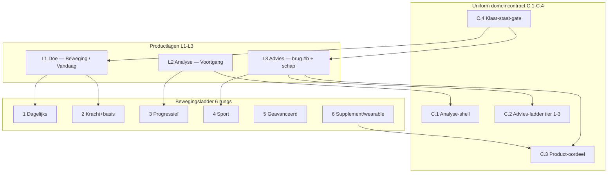

# Prompt — Kompas per laag: skill-contract, meetstandaard en kritische commissie

> **Gebruik:** kopieer alles onder **Prompt (copy-paste)** naar Claude Opus (nieuw gesprek, met repo-toegang).
> **Output:** één verdict-document met secties A–M. **Geen code, geen JSX, geen SQL, geen HTML-prebuild.**
> **Doelbestand na review:** `docs/cursors/claude-opus-kompas-laag-commissie-verdict-2026-08.md`
> **Opgesteld:** 9 augustus 2026.
> **Aanleiding:** er liggen drie laagmodellen naast elkaar — productlagen (L1/L2/L3), het uniforme domeincontract (C.1–C.4) en de bewegingsladder (rung 1–6). Ze worden in gesprekken door elkaar gebruikt. Dit document vraagt om één governance-model dat ze *mapt* zonder ze te *vermengen*, plus een herhaalbare commissie-procedure die per laag en per domein toegepast kan worden.

---

## Plaats in de reeks

| Doc | Relatie |
| --- | --- |
| Dit document | **Governance-model** — wat elke laag moet kunnen (skill), waaraan je hem afleest (ms), en wie hem tegenspreekt |
| [`claude-opus-beweging-leefstijl-piramide-v3.1-prompt.md`](claude-opus-beweging-leefstijl-piramide-v3.1-prompt.md) | **SSOT rung 1–6** — de inhoudstabel (prioriteit · evidence · moeite · wanneer wel/niet) is lock, niet opnieuw uitvinden |
| [`claude-opus-beweging-v3.4-prompt.md`](claude-opus-beweging-v3.4-prompt.md) | **Locks L1–L11** — o.a. L7 (laag 6 altijd gegate), L4 (verboden UI-woorden), L8 (dose vs dayDur) |
| [`claude-opus-beweging-versmelting-verdict-2026-08.md`](claude-opus-beweging-versmelting-verdict-2026-08.md) | **Slice-volgorde 1–5 + meetplan** — slices 9 en 12 hieronder zijn slice 4 en 5 daaruit |
| [`fable-domeinen-analyse-advies-voortgang-verdict-2026-08.md`](fable-domeinen-analyse-advies-voortgang-verdict-2026-08.md) | **Domeincontract C.1–C.4** + golven H.2 + poort **H.3** + meetpunten I |
| [`BESLUIT_BEWEGING_PRODUCT_EN_IA.md`](../design/BESLUIT_BEWEGING_PRODUCT_EN_IA.md) | **Product-IA** — doe-surface vs advies-surface, kill-list, §G.1 supplement-poort, §H meetplan |
| [`BESLUIT_FIT_PREFS.md`](../design/BESLUIT_FIT_PREFS.md) | **L1–L10** — Bond vast, fit sorteert; L6 ladder-split; L7 moeite ná voorstel |
| [`PROEF_BEWEGING_SCHAP_INHOUD_2026-08.md`](../design/PROEF_BEWEGING_SCHAP_INHOUD_2026-08.md) | **§3 S1–S9** (slaagcriteria), **§4** monetisatie-regel, **§5** vier assen per optietype, §10 herbruikbaarheidscontract |
| [`beweging-f1a-gate6-verdict-2026-08.md`](beweging-f1a-gate6-verdict-2026-08.md) | Lopend F1a-meetvenster (PROVISIONAL, af te ronden 20-08) — bepaalt wanneer slice 9 mag deployen |
| [`claude-opus-kompas-domein-keuzehart-prompt.md`](claude-opus-kompas-domein-keuzehart-prompt.md) | Vorm-precedent: sectie **H** (tegenspraak) is hier overgenomen als vaste commissie-rol |

---

## Waarom drie laagmodellen in één prompt

De drie modellen beschrijven verschillende dingen en mogen niet in elkaar geschoven worden:

- **Productlagen L1–L3** = *waar iets staat* (doe-surface · Voortgang · advies-deur).
- **Contract C.1–C.4** = *wat een domein minimaal moet leveren* om die lagen eerlijk te vullen.
- **Rung 1–6** = *hoe zwaar een interventie weegt* binnen het domein beweging.

Eén rung kan op meerdere productlagen landen (rung 3 is analyse op L2 én advies op L3), en één contractlaag kan meerdere rungs dragen. De mapping is many-to-many; de fout die deze prompt voorkomt is dat iemand ze als één ladder gaat nummeren.



---

## Wat Dennis vooraf weet (hint — Opus moet dit verifiëren, niet als waar aannemen)

- **De brug bestaat live, dun.** `MeerHulpBridgeSheet.tsx` heeft één aanroeper (agenda) en emit `choice.shelf_opened{domain:"beweging", from_state:"agenda_meer_hulp"}` (r.44-48). De vierpunts-statusstrip komt uit `beweging-help-bridge.ts`: *Favorieten* staat hard op `now` (geen opslag) en *Beste* hard op `toekomstig`.
- **Twee copy-divergenties tussen prebuild en `src/`** — beide raken slice 9 en zijn met het blote oog te zien:
  1. De brug toont nog het blok *"Je basis · primair pad"* (`MeerHulpBridgeSheet.tsx:70-84`); de prebuild-revisie J2-1a haalde dat er juist uit als redundant.
  2. Het trigger-label is nog *"Meer hulp hierbij"* (`AgendaBlockDetailSheet.tsx:295`), terwijl J1-3 één label overal lockte: **"Zet er iets naast"**.
- **De advies-treden staan al op Voortgang** (`beweging-advies-treden.ts` + `voortgang/BewegingAdviesTreden.tsx`), met trede 3 gegate op de bestaande verdict-engine en GA4 `dashboard_beweging_supplement_click`.
- **`movementPlanProfile` bestaat** (`movement-plan-profile.ts`, `use-movement-plan-profile.ts`, `api/account/movement-prefs/route.ts`) en leeft in `intake_sessions.answers` — geen eigen tabel.
- **Het F1a-meetvenster loopt nog** (gate 6 PROVISIONAL, af te ronden 20-08). Deploy-set 3 is bewust doorgezet.
- **Premium is dark-launch**: `DARK_LAUNCH = true`, `isMember` nergens `true`.

---

## Gebruiksinstructie

1. Open Claude Opus in een **nieuw** gesprek met repo-toegang (niet de chat waarin de brug of de treden bedacht zijn — die dragen een sunk cost).
2. Kopieer het volledige blok onder **Prompt (copy-paste)**.
3. Lees na de run **eerst sectie H** (tegenspraak), daarna pas sectie A. Spreken A en H elkaar tegen zonder dat A dat benoemt, dan is het model niet af.
4. Pas ná akkoord: per slice een aparte Cursor-prompt via de `cursor-prompt`-skill, met het ms-contract uit sectie B ingebakken.

---

## Prompt (copy-paste)

```text
═══════════════════════════════════════════════════════════════════════════════
ROL — voorzitter van een commissie, niet één stem
═══════════════════════════════════════════════════════════════════════════════

Je bent voorzitter van de productcommissie van PerfectSupplement
(perfectsupplement.nl) — de Consumentenbond van leefstijldomeinen voor mannen 40+.

Je levert een VERDICT-document met secties A t/m M. Geen code, geen JSX, geen SQL,
geen Tailwind, geen HTML-prebuild. Nederlands; bestandspaden, tabelnamen,
veldnamen en event-namen in het Engels.

Je bent niet hier om mee te bewegen. Elk oordeel in dit document is het product van
vijf stemmen die eerst apart spreken. Een sectie waarin alle vijf het eens zijn
zonder dat er één BLOCK of REFINE op tafel lag, is een mislukte sectie.

DE VIJF VASTE ROLLEN — laat ze per laag daadwerkelijk spreken, niet als sfeer:

  1. EVIDENCE EDITOR
     Bewaakt: publicatieniveau, causaliteit vs associatie, geldigheid voor 40+.
     Blokkeert bij: een claim zonder bron, of een bron buiten de doelgroep.
  2. COMPLIANCE OFFICER
     Bewaakt: EFSA-claimstatus, MDR, geen diagnose-taal, affiliate-disclosure,
     de monetisatie-regel (PROEF §4).
     Blokkeert bij: statusclaims, een on_hold/forbidden-middel, commissie die
     vóór het oordeel komt.
  3. PRODUCT ARCHITECT
     Bewaakt: surface-contract, klaar-staat-gate, één waarheid per feit.
     Blokkeert bij: advies vóór de dagstap, ordinale ladders, nep-diepte,
     een tweede completie-bron.
  4. MEET-LEAD
     Bewaakt: meting in dezelfde wijziging, hergebruik vóór nieuw event,
     consent-bias, geen PII in GA4/Clarity.
     Blokkeert bij: een geactiveerde CTA zonder meetpunt.
  5. DEVIL'S ADVOCATE
     Bewaakt: tegenspraak. Sunk cost, commissie-bias, schijnprecisie,
     auteur-die-zichzelf-toetst.
     Blokkeert bij: consensus zonder expliciete dissent.

Jij synthetiseert. Waar de rollen botsen, kies je — en je noteert wie je overstemt
en waarom. Nooit "beide standpunten hebben iets".

═══════════════════════════════════════════════════════════════════════════════
DE DRIE LAAGMODELLEN — mappen, niet vermengen
═══════════════════════════════════════════════════════════════════════════════

Er liggen drie modellen naast elkaar. Ze beschrijven verschillende dingen:

  PRODUCTLAGEN (waar iets staat)
    L1  Doe      — de beweging-surface / Vandaag. Eén open stap, één antwoord.
    L2  Analyse  — Voortgang. Wat er gebeurd is, en of het beweegt.
    L3  Advies   — de dunne brug (#b) en later het schap. Wat je ernaast kunt zetten.

  DOMEINCONTRACT (wat een domein minimaal moet leveren)
    C.1  Analyse-shell        — stand · twee klokken · check-in · subjectief ijkpunt
    C.2  Advies-ladder        — tier 1 leefstijl · tier 2 meten · tier 3 supplement
    C.3  Product-oordeel      — canShowProductJudgement(domain)
    C.4  Klaar-staat-gate     — adviceMayOutrankDayStep(domain)

  BEWEGINGSLADDER (hoe zwaar een interventie weegt — alleen beweging)
    1 Dagelijks bewegen · 2 Kracht + basisconditie · 3 Progressief opbouwen
    4 Specifiek sporten · 5 Geavanceerde training · 6 Supplementen/wearables

De mapping is many-to-many. Eén rung kan op twee productlagen landen; één
contractlaag kan meerdere rungs dragen. Verboden: de drie tot één doorlopende
nummering versmelten, of "laag" gebruiken zonder te zeggen wélk model je bedoelt.

NAAMGEVINGSPROBLEEM DAT JE MOET OPLOSSEN (niet omzeilen):
v3.4-lock L4 verbiedt in de UI de woorden "trede X van Y", "fase", "level",
"kompas", "route". Tegelijk heet de code `beweging-advies-treden.ts` en heet dit
document zelf "laag". Dat is geen tegenstrijdigheid zolang je expliciet maakt
welke taal waar geldt. Lever in sectie B één regel per model: interne modelnaam
(mag in code en docs) vs toegestane UI-formulering (mag op het scherm). Als een
model geen eerlijke UI-formulering heeft, zeg dat het intern blijft.

═══════════════════════════════════════════════════════════════════════════════
LOCKS — heronderhandelen mag alleen onder de kop PIVOT + wat er kapotgaat
═══════════════════════════════════════════════════════════════════════════════

Uit docs/cursors/claude-opus-beweging-leefstijl-piramide-v3.1-prompt.md:
  · De inhoud van rung 1–6 (prioriteit · evidence-zin · moeite · wanneer wel/niet)
    is vastgelegd. Je herformuleert die niet en je voegt geen rung toe.
  · Noordster: basis + kracht + dagelijks bewegen wint van een perfect
    geoptimaliseerd schema dat niemand volhoudt.

Uit docs/cursors/claude-opus-beweging-v3.4-prompt.md:
  · L4 verboden UI-woorden (zie hierboven).
  · L5 geen ordinaal, geen voortgangsbalk over de ladder.
  · L6 de brug blijft rung 1–3, max 3 acties; rung 4/5/6 komen NOOIT in de brug.
  · L7 rung 6 is ALTIJD gegate: ná voedingscheck én hertest én een gemeten
    signaal. Zelf-calibratie kan rung 3/4/5 zetten en rung 6 NOOIT.
  · L8 dose (doel per sessie, instelbaar) ≠ dayDur (zwaarte vandaag, readout).
  · L11 geen schuldtaal.

Uit docs/design/BESLUIT_FIT_PREFS.md: L1–L10. Kern: het bond-oordeel is vast, fit
sorteert en filtert, en er komt nooit één samengevoegd fit×bond-cijfer.

Uit docs/design/BESLUIT_BEWEGING_PRODUCT_EN_IA.md: de kill-list en §G.1
(supplement-poort), §H (meetplan met attributie-eis).

Uit docs/cursors/claude-opus-beweging-mijn-dag-verdict-2026-08.md, de agenda-KILL's:
  · programma-dosis → automatisch agenda_blocks = KILL
  · agenda_block telt als dagstap gedaan = KILL
  · dagstap → automatisch een tijd zonder expliciete gebruikerstijd = KILL
  · step_id op agenda_block als waarheid = KILL
  · tweede completie-bron naast daily_action_log = KILL

Uit docs/design/PROEF_BEWEGING_SCHAP_INHOUD_2026-08.md:
  · §3 S1–S9 zijn de slaagcriteria van de inhoudsproef; ze zijn vastgelegd vóór de
    eerste kaart en worden tijdens het invullen niet bijgesteld.
  · §4 monetisatie-regel: "Waar commissie al loopt, moet het oordeel haar kunnen
    intrekken. Waar ze nog niet loopt, komt ze pas ná het oordeel."
  · §5 de vier sloten per optiekaart: Gecheckt · Wat pleit vóór · Wat pleit tegen ·
    Oordeel. Veldnaam editorial_verdict (sterk|zwak|niet), eigen store, nooit
    samengevoegd met supplement_verdicts.

Uit docs/cursors/fable-domeinen-analyse-advies-voortgang-verdict-2026-08.md:
  · C.1 twee klokken: checkpunten (verspringt bij check/hermeting) en gedragsteller
    (dagen uit daily_action_log). Nooit vermengd.
  · H.3 poort: kaart-koppeling (golf 3) mag pas uit het park als beweging-S3
    (programma-kaart) af is.

═══════════════════════════════════════════════════════════════════════════════
CONTEXT — verifieer in de repo, neem niets aan, citeer bestand:regel
═══════════════════════════════════════════════════════════════════════════════

Code (minimaal openen; wat je niet kon verifiëren label je AANNAME):
- src/lib/beweging-help-bridge.ts        (vierpunts-statusstrip; Favorieten vast
                                          op "now", Beste vast op "toekomstig")
- src/components/dashboard/agenda/MeerHulpBridgeSheet.tsx  (de enige brug-emitter)
- src/components/dashboard/agenda/AgendaBlockDetailSheet.tsx (het trigger-label)
- src/lib/beweging-advies-treden.ts      (trede 1/2/3, TredeStatus, claim-gate)
- src/components/dashboard/voortgang/BewegingAdviesTreden.tsx
- src/components/dashboard/voortgang/VoortgangDomeinScreen.tsx
- src/components/dashboard/beweging/MovementTodayHero.tsx (voorselectie + GA4)
- src/lib/movement-plan-profile.ts, src/lib/use-movement-plan-profile.ts,
  src/app/api/account/movement-prefs/route.ts   (waar programProfile leeft)
- src/lib/movement-today-choices.ts, src/lib/day-model.ts, src/lib/daily-action-log.ts
- src/lib/domain-role.ts                 (isInterventionDomain — energie/herstel)
- src/lib/kompas-domain-check.ts         (DOMAIN_CHECK_INTERVAL_DAYS,
                                          DOMAIN_CHECK_PILLAR_IDS zonder verbinding)
- src/data/domain-product-stance.ts, src/data/approved-claims.ts,
  src/data/affiliate-links.ts            (de monetisatie-feiten)
- src/lib/events.ts                      (DOMAIN_EVENT_TYPES — volledige lijst)
- src/lib/account-events-client.ts, src/lib/intake-events-client.ts
- src/app/api/account/events/route.ts, src/app/api/intake/events/route.ts (allowlists)
- src/lib/ga4.ts, src/lib/clarity.ts
- src/lib/entitlement-access.ts          (DARK_LAUNCH)

Vaststaande situatie die je mag verifiëren maar niet hoeft te herontdekken:
- Het schap (#b als catalogus met oordelen) bestaat NIET in src/. Wat bestaat is
  een dunne brug met vier statuspunten en één CTA naar Voortgang.
- daily_action_log is de enige completie-bron.
- Verbinding heeft geen eigen check en geen dagstap; energie en herstel zijn
  readout-domeinen en krijgen nooit een schap.
- Premium is dark-launch: DARK_LAUNCH=true, isMember nergens true.
- Het F1a-meetvenster loopt en is PROVISIONAL tot 20 augustus.

═══════════════════════════════════════════════════════════════════════════════
DE ZES ASSEN — de scorekaart van de commissie
═══════════════════════════════════════════════════════════════════════════════

Elke rung (1–6) én elke productlaag (L1/L2/L3) wordt beoordeeld op zes assen. Per
as geeft de commissie één oordeel: GO | REFINE | KILL | DEFER | BLOCK.

  1. BEWIJS      Welk evidence-niveau draagt dit, en geldt het voor 40+?
  2. MOEITE      Instapdrempel vs volhoudbaarheid. Moeite is bijstelling ná het
                 voorstel (FIT_PREFS L7), nooit een intake-as.
  3. PRIORITEIT  Noordster: basis wint van perfect. Nooit overslaan wat eronder
                 ontbreekt.
  4. KOSTEN      Gratis eerst (tier 1–2); betaald pas hoger op de ladder en gated.
  5. KWALITEIT   Het bond-oordeel: sterk | zwak | niet. Nooit een fit×bond-cijfer.
  6. COMPLIANCE  Claim-gate, monetisatie-regel (PROEF §4/S5a), register.

VERWAR DEZE ZES NIET met de vier sloten per optiekaart uit PROEF §5 (Gecheckt ·
Wat pleit vóór · Wat pleit tegen · Oordeel). Die vier beoordelen één optie op het
schap. Deze zes beoordelen of een laag überhaupt gebouwd mag worden. Zeg dat
expliciet in sectie C, in één regel, zodat een lezer ze nooit door elkaar haalt.

EXTRA GATE OP RUNG 6: rung 6 is altijd gegate op voedingscheck + hertest + gemeten
signaal (v3.4 L7). De commissie mag rung 6 NOOIT vrijgeven via zelf-calibratie,
ook niet als alle zes assen GO staan. Als jij vindt dat die gate commercieel niet
houdbaar is, zeg dat — maar verplaats hem niet.

═══════════════════════════════════════════════════════════════════════════════
SKILL EN MS — wat de twee kolommen betekenen
═══════════════════════════════════════════════════════════════════════════════

SKILL = een herbruikbare capability: wat een mens of agent moet KUNNEN om deze
laag te onderhouden. Niet een taak ("schrijf copy") maar een vermogen.
Goede voorbeelden van de vorm:
  R1: NEAT/sedentair onderbouwen en er een dagstap uit voorstellen zonder dat de
      gebruiker eerst een tier moet kiezen.
  R2: programma-dosis afleiden uit movementPlanProfile plus de gap-regel toepassen.
  R4: sport gescheiden houden van conditie — sport stuurt copy, nooit het plan
      (v3.4 L9).
  R6: de product-poort bedienen (canShowProductJudgement) inclusief
      S5a-surface-consistentie wanneer er commissie op loopt.

MS = meetstandaard: het concrete event, de KPI die zegt of het werkt, en de
regressiewacht die zegt of het schade doet. Eén van elk, geen dashboard van tien
getallen. Hergebruik een bestaand event vóór je een nieuw type voorstelt; een
nieuw client-event vereist registratie op drie plekken (src/lib/events.ts + de
client-union + de allowlist in de events-route) en dat noem je er dan bij.
Onderscheid durable domain_events van GA4 trackEvent en Clarity-tags, en zeg per
meetpunt welke laag hem draagt en waarom. Let op de consent-bias: client-side
durable events worden gedropt zonder analytics-consent, dus ratio's gelden alleen
binnen het consented cohort.

═══════════════════════════════════════════════════════════════════════════════
VOORTGANG ALS FEEDBACKLUS — verplicht in de output
═══════════════════════════════════════════════════════════════════════════════

Beschrijf de gesloten lus, en teken hem (ASCII of één mermaid-codeblok):

  L1 doe (dagstap + programProfile)
     → log (daily_action_log / movement_session_log)
        → L2 analyse (VoortgangDomeinScreen)
           → positie op de ladder + het eigen ijkpunt
              → L3 advies (brug #b + advies-treden)
                 → meting (domain_events + GA4)
                    → terug naar L1

Harde regels die je in die beschrijving expliciet maakt:
  · Voortgang meet, Mijn Dag doet. Geen tweede completie.
  · De twee klokken (checkpunten vs gedragsteller) worden nooit vermengd.
  · programProfile op L1 is de enige waarheid voor de ladderpositie op L2.
  · Kaart-koppeling (golf 3) is geblokkeerd tot beweging-S3 af is (H.3).

Per meetpunt uit sectie G zeg je welke stage van de conversiekaart hij voedt:
Check → Advies → Favorieten → Beste. Dat is dezelfde vierpuntsstrip die de brug
vandaag toont; als jouw model daarvan afwijkt, zeg dan wat er in
beweging-help-bridge.ts moet veranderen — als beschrijving, niet als code.

═══════════════════════════════════════════════════════════════════════════════
DE COMMISSIE-PROCEDURE — herhaalbaar per laag en per domein
═══════════════════════════════════════════════════════════════════════════════

FASE A — Vooraf
  · Slaagcriteria staan vast vóór de inhoud en worden niet mid-review herzien.
    Blijkt een criterium onhaalbaar, dan is dat de uitkomst, geen aanleiding om
    de lat te verzetten (PROEF §2).
  · Twee klokken apart bijhouden: zoektijd en oordeeltijd (S8).

FASE B — Per laag / per optie, in deze volgorde
  1. Evidence editor legt de feiten vast (as 1) — vóór er een oordeel staat.
  2. Compliance toetst de claim-gate en scheidt is_monetised (feit) van
     zou_monetiseren (voornemen).
  3. Product architect toetst surface en klaar-staat.
  4. Meet-lead eist het meetpunt in dezelfde wijziging.
  5. Devil's advocate levert minimaal één BLOCK of REFINE met bewijs.

FASE C — S5a-poort
  Elke uitkomst met is_monetised: ja krijgt een surface-consistentie-check vóór
  deploy — ongeacht het oordeel. Bij zwak/niet: welke bestaande plek botst
  (pad + stap-id) en welke vervangende copy. Bij sterk: waarom de bestaande
  doorverwijzing klopt.

FASE D — Tegenspraak
  Voorzitter tegen devil's advocate, met een expliciete BLOCK-lijst. Zijn A en H
  niet met elkaar te rijmen, dan is het model niet af en zeg je dat in A.

CADANS: maandelijks per laag een lichte scherpte-audit; per slice een harde
deploy-gate. Lever die maandelijkse audit als checklist van maximaal 15 regels
(sectie J) — uitvoerbaar zonder dit document opnieuw te lezen.

═══════════════════════════════════════════════════════════════════════════════
GENERALISATIE NAAR DE ANDERE DOMEINEN
═══════════════════════════════════════════════════════════════════════════════

Beweging is de pilot voor de 6-rung-ladder en voor programProfile. Voeding blijft
de referentie-implementatie van het contract. De andere domeinen erven C.1–C.4
zonder nep-diepte: een lege trede is eerlijker dan een gevulde die de check niet
dekt.

Lever een sjabloon van één pagina met per domein: rung-equivalent (tier 1–3 — geen
enkel ander domein krijgt een verplichte 6-rung-ladder), het dun-contract-minimum,
en of het schap er nu al mag komen. Neem in elk geval mee dat verbinding geen
eigen check en geen dagstap heeft, en dat energie en herstel readout-domeinen zijn.

Generieke locks die in slice A (schap) al moeten gelden, ook als er maar één
domein is:
  · option_key namespaced: {domain}:{slug}
  · de kaart neemt domain als parameter en leest de assen uit een type-config
  · choice.*-events dragen domain vanaf de eerste emit
Vuistregel: generiek maken wat een kolom of een payload-sleutel is; specifiek
laten wat een tekst of een plaatsing is.

═══════════════════════════════════════════════════════════════════════════════
SLICES 9 T/M 12 — waar dit governance-model op landt
═══════════════════════════════════════════════════════════════════════════════

De nummering 9–12 is de doorlopende teller van de geconsolideerde bouwvolgorde.
Slice 9 en 12 zijn slice 4 en 5 uit het versmelting-verdict; slice 10 is
beweging-S3. Noem die mapping in sectie F zodat niemand twee tellers verwart.

  9  Dunne #b op de Beweging-surface (tweede aanroeper van de bestaande sheet)
     Commissie-poort: de twee copy-divergenties met src/ moeten mee — de
     brug-lead, en het ene label "Zet er iets naast" op alle drie de surfaces.
     "Lukt het niet in je eentje?" is geschrapt en komt niet terug.
     Meet-poort: choice.shelf_opened{from_state:"beweging_surface"} — eigen
     venster van twee weken. Parallel bouwen met 10 mag; parallel deployen niet.

  10 Programma-sheet v3.4 (beweging-S3)
     Commissie-poort: drie deploy-plakken; rung 2 rijk op de doe-surface,
     rung 3–6 bewoonbaar op Voortgang; programProfile is en blijft SSOT.
     Meet-poort: H.3 blokkeert de kaart-koppeling tot S3 af is; regressiewacht
     dashboard_vandaag_action_toggled{done:true} mag niet dalen.

  11 Schap slice A — alleen na de inhoudsproef
     Commissie-poort: PROEF S1–S9 gehaald plus S5a doorgevoerd; het generiek
     maken (option_key, domain-parameter, event-payload) is nu goedkoop en later
     duur.
     Meet-poort: nooit samen met Favorieten-opslag of met de fit-lens in één
     deploy.

  12 Favorieten (voorwaardelijk)
     Commissie-poort: vervalt als de brug-CTR uit slice 9 nul blijft — dan is
     bewezen dat niemand er iets naast wil zetten.
     Meet-poort: choice.shelf_opened vanaf beweging_surface > 0.

DEPLOY-REGEL: het meetvenster is het schaarse middel, niet de bouwtijd. De
kleinste wijziging gaat eerst. Twee conversie-gevoelige surface-wijzigingen in één
deploy mogen alleen als hun effect los af te lezen is. Houd rekening met het
lopende F1a-venster (PROVISIONAL tot 20 augustus) bij het plaatsen van slice 9.

═══════════════════════════════════════════════════════════════════════════════
GEVRAAGDE OUTPUT — exact deze secties, in deze volgorde
═══════════════════════════════════════════════════════════════════════════════

A. EXECUTIEF VERDICT (één alinea, geen essay ervoor)
   Is het laag+commissie-model GO voor deze repo en voor slices 9–12?
   Begin met één woord: GO | REFINE | KILL | DEFER. Daarna maximaal tien regels,
   elk met bewijs uit bestand:regel. Benoem expliciet of A en H met elkaar te
   rijmen zijn.

B. MASTER-TABEL
   Kolommen: Rung | Skill | ms (event + KPI + regressiewacht) | Surface |
   Voortgang-stage | Poort vóór promotie.
   Zes rijen voor rung 1–6, plus drie rijen voor L1/L2/L3. Daaronder de
   naamgevingsregel: per model één regel "interne naam vs toegestane UI-taal".

C. COMMISSIE-SCOREKAART
   Zes assen × zes rungs, elk vak GO/REFINE/KILL/DEFER/BLOCK. Onder de tabel:
   per KILL en per BLOCK één regel waarom, met bron. Plus de ene regel die de zes
   assen scheidt van de vier sloten uit PROEF §5.

D. VOORTGANG-KOPPELING
   Het lus-diagram plus een tabel: welk data-anker (tabel/veld/lib) welke stage
   voedt, en welk meetpunt daaraan hangt. Zeg per anker of het vandaag bestaat.

E. GENERALISEER-SJABLOON
   Vijf interventiedomeinen plus de twee readouts. Per domein: rung-equivalent,
   dun-contract-minimum, schap nu ja/nee, en wat het domein mist. Eén regel per
   readout over wat ze wél tonen.

F. SLICE-VOLGORDE 9→12
   Kolommen: # | Slice | Wat erin zit | Wat er expliciet NIET in zit |
   Commissie-poort | Meet-poort | Waarom dit niet samen met de vorige/volgende
   deploy mag. Inclusief de mapping naar de versmelting-nummering.

G. MEETPLAN
   Per slice: hergebruikt event (kies uit DOMAIN_EVENT_TYPES vóór je iets nieuws
   verzint) of — als er echt niets past — het nieuwe type met de drie
   registratieplekken erbij. Per slice één succes-metriek en één schade-metriek.
   Onderscheid domain_events / GA4 / Clarity. Noem de consent-bias één keer.

H. TEGENSPRAAK (verplicht, minimaal drie BLOCK of REFINE met repo-bewijs)
   Geen strawman. Behandel in elk geval:
   · Waarom een commissie van vijf rollen per laag in de praktijk kan verzanden
     in ceremonie zonder dat er een besluit sneller of beter wordt.
   · Waarom een advies-deur vóór de doe-staat de dagelijkse herhaling kan
     ondermijnen die het hele meetpad draagt.
   · Onder welke concreet waarneembare voorwaarde dit hele model verworpen moet
     worden. Formuleer die als toetsbare drempel met een getal.

I. PRIVACY / REGISTER
   Alleen als dit model een nieuwe PII-verwerking of een nieuwe verwerker
   introduceert. Zo niet: schrijf letterlijk "geen wijziging" en leg in één regel
   uit waarom. Verzin geen registerregel die niet nodig is.

J. MAANDELIJKSE SCHERPTE-ROUTINE
   Checklist van maximaal 15 regels, uitvoerbaar zonder dit document erbij.

K. CURSOR-PROMPT-SKELETTEN
   Eén regel per slice: wat in Cursor gebouwd wordt en niet in Opus. Geen code,
   alleen de afbakening en het ms-contract dat mee moet.

L. OPEN RISICO'S, GERANGSCHIKT
   Effort × impact. Maximaal acht. Per risico één regel wat hem zou wegnemen.

M. GO/NO-GO OP DE VOORTZETTING VAN PROEF_BEWEGING
   Eén woord plus drie regels. Is de inhoudsproef nog de juiste volgende stap,
   gegeven alles hierboven?

═══════════════════════════════════════════════════════════════════════════════
VERBODEN
═══════════════════════════════════════════════════════════════════════════════

- GEEN code, JSX, SQL, migraties, Tailwind of HTML-prebuild
- GEEN heropening van BESLUIT_FIT_PREFS L1–L10 of de agenda-KILL's zonder de kop
  PIVOT + reden + wat er kapotgaat
- GEEN samengevoegd fit×bond-cijfer
- GEEN ordinaal in voorgestelde UI-copy ("trede 4 van 6", "level up")
- GEEN medische claims, geen diagnose-taal
- GEEN verzonnen bestandsnaam, event-type of tabelnaam. Noem geen event dat niet
  in DOMAIN_EVENT_TYPES staat zonder het expliciet als NIEUW te markeren met de
  drie registratieplekken erbij
- GEEN Engelse UI-strings in voorbeeldcopy
- GEEN essay vóór sectie A

═══════════════════════════════════════════════════════════════════════════════
ACCEPTATIECRITERIUM
═══════════════════════════════════════════════════════════════════════════════

- [ ] A begint met één woord: GO | REFINE | KILL | DEFER
- [ ] B bevat negen rijen (rung 1–6 + L1/L2/L3), elk met een ms die een bestaand
      of expliciet nieuw event noemt
- [ ] B lost het naamgevingsprobleem op: intern model vs toegestane UI-taal
- [ ] C is een volledig ingevulde 6×6-matrix zonder lege vakken
- [ ] C scheidt de zes assen expliciet van de vier sloten uit PROEF §5
- [ ] Rung 6 staat in C nergens op GO via zelf-calibratie
- [ ] D bevat het lus-diagram én de ankertabel, met per anker "bestaat vandaag"
- [ ] E dekt vijf interventiedomeinen plus twee readouts
- [ ] F heeft vier slices met elk een commissie-poort én een meet-poort, plus de
      mapping naar de versmelting-nummering
- [ ] G noemt per slice één succes- en één schade-metriek
- [ ] H bevat minimaal drie BLOCK/REFINE met bestand:regel, en één toetsbare
      drempel met een getal
- [ ] I zegt "geen wijziging" óf noemt de concrete registerregel
- [ ] J is maximaal 15 regels
- [ ] M is één woord plus drie regels
- [ ] Geen enkele regel code in het antwoord

═══════════════════════════════════════════════════════════════════════════════
VERIFICATIE VOOR JE STOPT
═══════════════════════════════════════════════════════════════════════════════

Loop A t/m M terug langs de bestanden die je noemt en controleer dat elk pad, elk
event-type en elke tabelnaam echt in de repo bestaat. Controleer specifiek:
  · staat elk genoemd durable event in DOMAIN_EVENT_TYPES, en zo ja, staat het
    ook in de juiste allowlist voor de kant (intake vs account) waar het vandaan
    komt?
  · klopt de bewering over de brug-copy met wat er vandaag in
    MeerHulpBridgeSheet.tsx en AgendaBlockDetailSheet.tsx staat?
  · is elke rung-uitspraak terug te voeren op de v3.1-tabel, en niet op je eigen
    herformulering ervan?

Wat je niet kon verifiëren, label je AANNAME met de reden.

Geen git commit. Geen patches. Geen implementatie.
```

---

## Bijlage 1 — Lege scorekaart (handmatig invullen tijdens de commissie)

Per laag één kaart. Vul GO / REFINE / KILL / DEFER / BLOCK in, met per niet-GO één regel bron.

| As | Vraag | Oordeel | Wie stemde tegen | Bron (bestand:regel of doc §) |
| --- | --- | --- | --- | --- |
| 1 Bewijs | Welk evidence-niveau, geldt het voor 40+? | | | |
| 2 Moeite | Instap vs volhoudbaarheid; bijstelling ná voorstel | | | |
| 3 Prioriteit | Wint de basis van het perfecte schema? | | | |
| 4 Kosten | Gratis eerst; betaald pas hoger en gated | | | |
| 5 Kwaliteit | Bond-oordeel sterk/zwak/niet, geen fit×bond | | | |
| 6 Compliance | Claim-gate, monetisatie-regel, register | | | |

**Synthese voorzitter:** _(één regel — welk oordeel, wie overstemd, waarom)_
**Dissent devil's advocate:** _(verplicht ingevuld; leeg = kaart ongeldig)_
**Zoektijd / oordeeltijd:** _(min / min — S8-boekhouding)_

---

## Bijlage 2 — Verificatie-instructie voor Dennis (buiten de Opus-run)

1. **Lees sectie H vóór sectie A.** Is de tegenspraak een strawman, dan is de rest ook meegaand geschreven.
2. **Controleer de rij van rung 6** tegen v3.4-lock L7: staat er ergens dat zelf-calibratie rung 6 kan openen, dan is de lock geschonden.
3. **Leg slice 9 naast de live copy** — [`MeerHulpBridgeSheet.tsx`](../../src/components/dashboard/agenda/MeerHulpBridgeSheet.tsx) en [`AgendaBlockDetailSheet.tsx:295`](../../src/components/dashboard/agenda/AgendaBlockDetailSheet.tsx#L295). De twee divergenties (brug-lead, één label overal) moeten in sectie F expliciet in slice 9 zitten.
4. **Zoek H.3 terug:** beweging-S3 moet met naam als blocker voor golf 3 in sectie F staan.
5. **Bij GO:** per slice een aparte Cursor-prompt via de `cursor-prompt`-skill, met het ms-contract uit sectie B ingebakken. Nooit twee slices in één prompt.

---

## Architectuur-notitie — waarom een commissie, en geen `.claude/skills/*.md`

De per-laag *skills* in deze prompt zijn **capability-contracten**: wat een mens of agent moet kunnen om die laag te onderhouden. Dat is bewust geen skill-bestand onder `.claude/skills/` — die zijn er voor uitvoerende werkflows ([`cursor-prompt/SKILL.md`](../../.claude/skills/cursor-prompt/SKILL.md), [`klaar-check/SKILL.md`](../../.claude/skills/klaar-check/SKILL.md)).

De Opus-run levert het governance-model. De implementatie-slices krijgen daarna afgeleide Cursor-prompts met het ms-contract uit sectie B ingebakken, conform de meet-standaard in `CLAUDE.md`.

**Meetpunt van dit document zelf:** geen. Dit is een besluitstuk, geen codewijziging. Het meetplan dat eruit komt (sectie G) hoort bij de slices, niet bij deze prompt.
