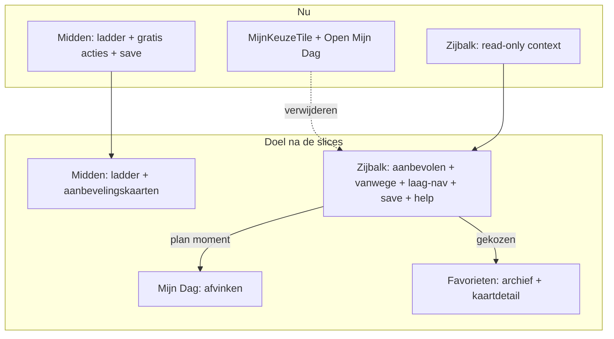

# Opus-prompt — De Kompas-zijbalk als keuzehart

> **Gebruik:** kopieer het blok vanaf "OPDRACHT" in een verse Claude Code-sessie (Opus) op branch `main`.
> **Output:** één verdict-document, secties A–J, in `docs/cursors/claude-opus-kompas-sidebar-keuzehart-verdict-2026-08.md`.
> **Datum:** 22 augustus 2026 · besluitronde, geen bouwronde.

## Plaats in de reeks

| Doc | Relatie |
|---|---|
| [`KOMPAS_SIDEBAR_ROADMAP_2026-08.md`](KOMPAS_SIDEBAR_ROADMAP_2026-08.md) | **VAST** — het surface-contract, §6 getekend op 22 aug 2026. Niet heropenen, alleen uitwerken |
| [`claude-opus-ecosysteem-aanbevelingsmotor-prompt.md`](claude-opus-ecosysteem-aanbevelingsmotor-prompt.md) + [verdict](opus-ecosysteem-aanbevelingsmotor-verdict-2026-08.md) | **BINDEND** — §C, §D, §F, §I zijn input, geen suggestie |
| [`claude-opus-beweging-mijn-dag-verdict-2026-08.md`](claude-opus-beweging-mijn-dag-verdict-2026-08.md) | **BINDEND** — de afvink-KILL's (#7, #8) |
| [`claude-opus-kompas-domein-keuzehart-prompt.md`](claude-opus-kompas-domein-keuzehart-prompt.md) + [wederprompt](claude-opus-kompas-domein-keuzehart-wederprompt.md) | historisch (#b-als-hart, deels achterhaald); de overladings-grens uit G′ blijft gelden |
| [`claude-opus-kompas-laag-commissie-prompt.md`](claude-opus-kompas-laag-commissie-prompt.md) | P1–P6 governance |

---

## OPDRACHT

Je beoordeelt één voorstel: **de rechter contextkolom van het dashboard wordt het keuzehart van Kompas** — de plek waar
de aanbevolen laag staat mét de reden, waar je van laag wisselt, waar je opslaat, en waar de dashboard-uitleg woont.
De middenkolom blijft ladder + aanbevelingskaarten. Afvinken blijft op Mijn Dag.

Het surface-contract ligt vast in de roadmap. Jouw werk is **hoe** de zijbalk dat contract uitvoert, en waar het breekt.

### De zes stellingen

**Wat al getekend is (roadmap §6, 22 aug):** R1 = S4 (`MijnKeuzeTile` van héél Kompas af), R2 = S3 (save primair in de
zijbalk, spiegel in het midden, volledig functioneel onder 1280px) en R4 = de afvink-clausule van S5. Op die drie luidt
je verdict **GO of REFINE — de uitvoering, niet de vraag óf.** PARKEER daarop mag alleen onder een kop `PIVOT` met
schade-analyse. S1, S2, S6 en het spectrum-deel van S5 staan volledig open. Je tegenspraak hoort hoe dan ook in §J:
een getekend besluit sluit een argument niet uit, het verplaatst het alleen naar de drempel waarop het terugkomt.

| # | Stelling |
|---|---|
| **S1** | De aanbevolen ladder uit de domeincheck hoort in de rechter zijbalk: `P{n}` + *vanwege* (niet alleen een staat-label), meebewegend met de laagselectie, met save op de aanbevolen actie. |
| **S2** | P1–P6 zijn in de zijbalk finetune-baar (je kiest je eigen werklaag) zonder lock N6 te breken — geen tweede volledige ladder, wel een laag-navigator die sync't met het midden. |
| **S3** | Save/unsave hoort primair in de zijbalk; de middenkolom mag spiegel zijn, niet de enige plek. |
| **S4** | `MijnKeuzeTile` verdwijnt van héél Kompas (home + domein); het keuze-archief leeft in de zijbalk (huidige laag) en op Voortgang/Favorieten (cross-domein). |
| **S5** | Kompas blijft interactief met aanbevelingen (het gratis→premium-spectrum per laag, §D ecosysteem-verdict); het schap is transitie, geen eindtoestand. Geen afvinken op Kompas. |
| **S6** | "Hoe werkt dit dashboard?" wordt een inline dashboard-variant in de zijbalk; `/hoe-werkt-dashboard` blijft voor pre-login en SEO. |

### As-built → doel

### Leeslijst — verplicht, citeer `pad:regel`

**Besluiten (lock):**
- `docs/cursors/KOMPAS_SIDEBAR_ROADMAP_2026-08.md` — hele doc, inclusief de twee as-built correcties in §3
- `docs/cursors/opus-ecosysteem-aanbevelingsmotor-verdict-2026-08.md` — §C, §D, §F, §I
- `docs/cursors/claude-opus-beweging-mijn-dag-verdict-2026-08.md` — de afvink-KILL's

**Code (as-built):**
- `src/lib/cockpit-inspector.ts` — `buildLadderInspectorCards`, lock N6 (r.101-141)
- `src/components/dashboard/cockpit/CockpitInspector.tsx` — de kaartvormen die er vandaag zijn
- `src/components/dashboard/cockpit/CockpitFrame.tsx` + `src/lib/cockpit-context-layout.ts` — sidebar/drawer/sheet
- `src/components/dashboard/Dashboard.tsx` r.3531-3636 — `dashboardInfoCard`, `ladderInspectorCards`, `inspectorExtra`
- `src/lib/domain-ladder-focus-context.tsx` — de naad midden ↔ zijbalk
- `src/lib/domain-ladder-readout.ts` — `DomainLadderReadout` (r.54-67) en welke domeinen `null` leveren
- `src/components/dashboard/domain/DomainKompasScreen.tsx` · `DomainFreeActionsTile.tsx` · `LadderActionRow.tsx`
- `src/components/dashboard/MijnKeuzeTile.tsx` (te verwijderen van Kompas) + `kompas/KompasHomeCard.tsx:819`
- `src/components/dashboard/voortgang/PrioriteitenLadder.tsx` — het save-patroon zoals het op Voortgang staat
- `src/data/dashboard-unlock.ts` — de publieke uitleg-SSOT
- `src/lib/events.ts` · `src/lib/account-events-client.ts` · `src/app/api/account/events/route.ts` — de drie registratieplekken

### Gevraagde output — secties A–J

| Sectie | Inhoud |
|---|---|
| **A** | Verdict S1–S6: per stelling **GO / REFINE / PARKEER** met bewijs `bestand:regel`. Begin met één regel totaaloordeel |
| **B** | Zone-contract van de zijbalk — tabel: Zone (Aanbevolen · Laag-nav · Acties+save · Gekozen op laag · Help) × interactief × databron × desktop vs. drawer × wat er uit midden/home verdwijnt |
| **C** | De N6-oplossing: kies **CompactNav / LayerStrip / Hybrid**; onderbouw met het 375px-gedrag uit `CockpitFrame`; benoem wat er bij de twee afvallers kapotgaat |
| **D** | *Vanwege*-contract per domein: welk readout-veld (`headline`, `whyWait`, `evidenceByLayer`, `stateLabels`) de zin levert — en wat voeding en verbinding missen, eerlijk |
| **E** | Save-contract: `FavoriteSaveButton` + `source: "aanbevolen" \| "mijn_keuze"`, de sleutel `laag-<domein>-p<n>-<slug>`, en hoe midden en zijbalk één staat delen zonder tweede bron |
| **F** | `MijnKeuzeTile`-migratie: wat vervangt de home-variant, wat de domein-variant, en waar het cross-domein archief landt (Voortgang-hub-regel of zijbalk) |
| **G** | Schap-transitie: hoe Kompas interactief blijft terwijl het schap nog leeft (W2), en wanneer `choice.shelf_opened` retiret (W4-gate) — reken met correctie C-a uit de roadmap: het schap is React, niet een iframe, en dekt drie domeinen. **Dit is het enige open besluit uit roadmap §6 (R3): lever hier een tekenbaar voorstel, niet een afweging** |
| **H** | Dashboard-help: inline paneel met `dashboard-unlock.ts` als SSOT; wat op de publieke pagina blijft |
| **I** | Slice-volgorde, max 5: W1-datacontract (indien nog open) · zijbalk-slice beweging · overige domeinen · schap-retire · help-inline. Per slice: wat er in zit, wat niet, en waaraan je het afleest |
| **J** | Tegenspraak: minstens drie argumenten tégen de zijbalk als keuzehart, plus de toetsbare drempel waarop Dennis ongelijk heeft. Sluit af met je eigen aanbeveling |

### Harde constraints

- **Geen code, geen diffs, geen SQL, geen JSX.** Proza, tabellen, `pad:regel`.
- De roadmap en §C/§F/§I van het ecosysteem-verdict niet heropenen zonder kop `PIVOT` + schade-analyse.
- **Lock N6:** geen tweede volledige ladder in de contextkolom.
- **Geen afvinken op Kompas** — niet in het midden, niet in de zijbalk.
- Geen semantische overlading van bestaande GA4-events (les G′ uit de keuzehart-wederprompt): een nieuwe betekenis krijgt
  een nieuw event, geen extra waarde op een bestaande param.
- Meet-standaard: een save-knop in de zijbalk is een nieuw meetpunt in **dezelfde** slice als de knop; account-scoped
  events vereisen registratie op drie plekken (`events.ts`, `account-events-client.ts`, `api/account/events/route.ts`).
- Het contract geldt voor alle vijf domeinen; **slice 1 is alleen beweging.**
- Verbinding draait op Kompas nog als prebuild-iframe — zeg of het zijbalk-contract vóór of ná die React-migratie geldt.

### Acceptatiecriterium

- [ ] A: alle zes stellingen GO/REFINE/PARKEER met bewijs
- [ ] B: vijf zijbalk-zones benoemd, inclusief drawer-gedrag
- [ ] C: één gekozen N6-oplossing + expliciet 375px-argument
- [ ] D: *vanwege* per domein, met een eerlijke lege plek voor voeding en verbinding
- [ ] F: expliciete bestemming voor de inhoud van `MijnKeuzeTile` na verwijdering
- [ ] G: schap-transitie gekoppeld aan W2/W4, gerekend met de React-schap-correctie, met één tekenbaar voorstel voor R3
- [ ] I: maximaal vijf slices, beweging eerst
- [ ] J: minstens drie tegenargumenten + één toetsbare drempel
- [ ] Geen regel code in het antwoord

**Meetpunt van dit document:** geen product-events — besluitstuk. Effect af te lezen aan het aantal PARKEER-items in A
en aan de tijd tot slice 1 start.
