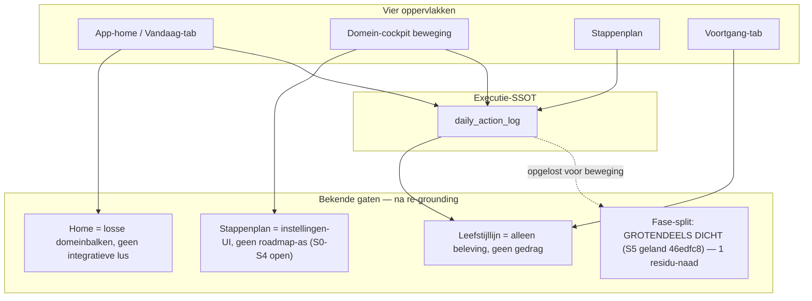
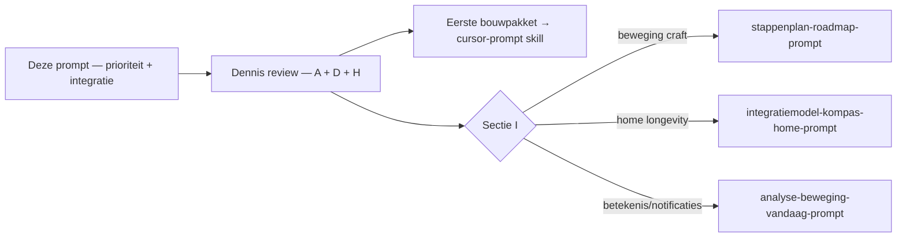

# Prompt — Prioriteit & integratie: Vandaag · Home · Voortgang als één gesloten lus (Opus)

> **Gebruik:** kopieer alles onder **Prompt (copy-paste)** naar Claude Opus in een nieuw gesprek. Bijlagen zijn aanbevolen maar niet vereist (zie bijlagen-checklist).
>
> **Output:** strategische prioriteitsanalyse → integratiecontract → bouwgolven → eerste bouwpakket. Geen code, geen diffs.
>
> **Opgesteld:** 23 juli 2026. Harde context geverifieerd tegen `main` op die datum — zie "Verificatie-log" onderaan.
>
> **Relatie tot de drie bestaande docs:** dit **vervangt** [`claude-analyse-beweging-vandaag-stappenplan-prompt.md`](claude-analyse-beweging-vandaag-stappenplan-prompt.md), [`claude-integratiemodel-kompas-home-prompt.md`](claude-integratiemodel-kompas-home-prompt.md) en [`claude-opus-stappenplan-roadmap-supplementen-prompt.md`](claude-opus-stappenplan-roadmap-supplementen-prompt.md) **niet**. Het is de *routing-analyse* die bepaalt welke van de drie je daarna alsnog gedetailleerd laat draaien, en in welke volgorde je bouwt.

---

## Probleem dat deze prompt oplost

Er liggen drie sterke maar **losse** Opus-prompts klaar, plus twee blauwdrukken. Geen van de drie is gedraaid:

| Spoor | Prompt-doc | Kernvraag |
|---|---|---|
| Beweging | [`claude-analyse-beweging-vandaag-stappenplan-prompt.md`](claude-analyse-beweging-vandaag-stappenplan-prompt.md) | Betekenis Vandaag ↔ Reis ↔ Stappenplan + notificaties |
| Home/longevity | [`claude-integratiemodel-kompas-home-prompt.md`](claude-integratiemodel-kompas-home-prompt.md) | Virtuous/vicious-loop op App-home (Pătru → PSF) |
| Stappenplan craft | [`claude-opus-stappenplan-roadmap-supplementen-prompt.md`](claude-opus-stappenplan-roadmap-supplementen-prompt.md) | Roadmap-IA, supplementen, slices S0–S7 |

Slice-volgorde staat in [`BLAUWDRUK_STAPPENPLAN_ROADMAP_EN_SPORTLAAG.md`](../plan/BLAUWDRUK_STAPPENPLAN_ROADMAP_EN_SPORTLAAG.md); het Voortgang-gat in [`PLAN_WEEKLIJKSE_LEEFSTIJLLOG.md`](../plan/PLAN_WEEKLIJKSE_LEEFSTIJLLOG.md).

De vraag is niet "nog een diepe UX-analyse", maar een **integratie- en prioriteitsanalyse**:

> Welke strategische keuzes en bouwgolven maken het Vandaag-stappenplan en de App-home sterk **samen**, zodat *vooruitgang · doel behalen · gedragsverandering* één gesloten lus worden?

Tijdshorizon: **strategie eerst, daarna bouwen** — geen letterlijke urenplanning.

---

## Waarom een nieuw doc i.p.v. de drie

De drie bestaande prompts zijn diep maar smal. Deze meta-prompt:

1. Bundelt de **harde codebase-feiten** uit de drie verificatie-logs én uit een verse re-grounding tegen `main` (zie verificatie-log — één premisse is inmiddels achterhaald).
2. Maakt de **gedragslus** expliciet tot prioriteitscriterium.
3. Lost **conflicten tussen de plannen** op (S0-eerst vs S5-vertrouwensfix; home-diagram vóór vs ná `buildWeeklyLifestyleLog`).
4. Levert een **prioriteitsmatrix + bouwgolven** die 1-op-1 naar Cursor-prompts vertaald worden.

**De belangrijkste correctie t.o.v. de oorspronkelijke opdracht** (details in de verificatie-log): het "kritieke feit voor prioritering" — de fase-split waarbij de Vandaag-hero op fase 1 bleef terwijl het stappenplan fase 2 toonde — is **inmiddels opgelost**. Slice **S5 (Lock 5, positie-unificatie) is geland** in commit `46edfc8` (23 jul). De Vandaag-hero, de route-ladder én het stappenplan lezen nu dezelfde, uit de daily-log afgeleide fase. Dat verschuift Golf 0: de grootste vertrouwensbreuk is grotendeels dicht; wat rest is één residu-naad + de generalisatie naar de andere domeinen, en `buildWeeklyLifestyleLog` is nu **ontgrendeld**.

---

## Gebruiksinstructie

1. Open Claude Opus (nieuw gesprek).
2. Voeg bijlagen toe (checklist hieronder) — optioneel.
3. Kopieer het volledige blok onder **Prompt (copy-paste)**.
4. Verwachte output: secties **A t/m L**. Geen code.
5. Review sectie **A** (strategische bets), **D** (prioriteitsmatrix) en **H** (eerste bouwpakket) → daarna per PR uit sectie H een Cursor-prompt via de `cursor-prompt` skill.

### Bijlagen-checklist

- [ ] Aanbevolen — screenshots App-home (375px), beweeg-Vandaag (vóór/na tier/na gedaan), stappenplan-view, Voortgang-tab.
- [ ] Optioneel — Fig. 3–5 uit Pătru et al. (*Nutrients* 2026), [`CLAUDE.md`](../../CLAUDE.md), [`WRITING_VOICE.md`](../core/WRITING_VOICE.md).
- [ ] Niet vereist — de output van de drie andere Opus-prompts (die zijn nog niet gedraaid; deze prompt bepaalt júist óf en wanneer je ze draait).

---

## Centrale spanningen (context voor de reviewer, niet voor Opus)



**Gedragslus** (uit [`ONTWERP_BEWEEGDASHBOARD_BESTURINGSSYSTEEM.md`](../plan/ONTWERP_BEWEEGDASHBOARD_BESTURINGSSYSTEEM.md) §1.2/§6): *actie → bewijs → herkalibratie → nieuwe, iets grotere stap.* Opus moet per gap scoren: welk gat breekt welke stap van de lus het hardst?

**Drie meetlatten** (niet mengen — [`PLAN_WEEKLIJKSE_LEEFSTIJLLOG.md`](../plan/PLAN_WEEKLIJKSE_LEEFSTIJLLOG.md) §3):
- **Adherence** — gedrag (`daily_action_log`)
- **Beleving** — check-in (`intake_domain_checkin`) → leefstijllijn
- **Evidence** — beweging-minuten (`movement_session_log`), nooit een tweede score

**Gelockte invarianten** (samengevat): één check-off (Vandaag-hero) · geen streaks/badges/tweede scores · Future You = copy/richting, geen percentage · KOAG: vier banden, geen totaalscore · stepped care (supplementen ná voedingscheck) · positie afgeleid, route gekozen (Lock 5).

**Strategische SSOT** [`ROADMAP_DASHBOARD_COCKPIT.md`](../core/ROADMAP_DASHBOARD_COCKPIT.md): North Star = *één lus kogelvrij → de klok starten → zien of het domein-cijfer beweegt*. Het risico is polijsten zonder cohort.

---

## Prompt (copy-paste)

```text
ROL: Je bent Senior Product Strategist, Behavioral Scientist en UX-architect voor
PerfectSupplement (perfectsupplement.nl). Je levert een STRATEGISCHE PRIORITEIT- en
INTEGRATIE-analyse, geen vierde UX-deep-dive.

OUTPUT-CONTRACT: je levert UITSLUITEND strategie: prioriteitsmatrix → integratie-
contract → bouwgolven → eerste bouwpakket. GEEN code, GEEN diffs, GEEN bestands-
patches, GEEN JSX. Je mag bestaande bestanden bij naam noemen; je wijzigt niets.
Taal: Nederlands. Identifiers, componentnamen en veldnamen: Engels.

Lees CLAUDE.md en WRITING_VOICE.md mee als je ze hebt.

═══════════════════════════════════════════════════════════════════════════════
BIJLAGEN (door Dennis)
═══════════════════════════════════════════════════════════════════════════════

1. AANBEVOLEN: screenshots App-home (375px), beweeg-Vandaag (vóór tier / na
   "Trainen" / na afvinken), stappenplan-view, Voortgang-tab. Dit is de HUIDIGE
   staat, niet de doelarchitectuur.
2. OPTIONEEL: Fig. 3–5 Pătru et al. (Nutrients 2026), CLAUDE.md, WRITING_VOICE.md.
3. NIET VEREIST: output van de drie andere Opus-prompts — die zijn nog niet
   gedraaid; jij bepaalt júist óf en wanneer ze nodig zijn.

═══════════════════════════════════════════════════════════════════════════════
PRODUCTCONTEXT
═══════════════════════════════════════════════════════════════════════════════

PerfectSupplement is een onafhankelijk leefstijlplatform voor mannen 40+ (slaap,
stress, energie, herstel, beweging, voeding, verbinding). Positionering: "de
Consumentenbond van supplementen", doorgegroeid naar leefstijlcoach. Adviezen,
geen diagnoses. Stepped care: leefstijl eerst, supplementen laat.

Na de Leefstijlcheck landt de gebruiker op een dashboard dat op één cockpit-shell
draait. Er zijn vier oppervlakken die samen de lus moeten sluiten:

  APP-HOME (Vandaag-tab)   = "waar sta ik, wat is mijn ene ding vandaag, waar
                             werk ik naartoe". De Vandaag-hero is de ENIGE check-off.
  DOMEIN-COCKPIT (beweging)= het verst ontwikkelde domein; blauwdruk voor de
                             andere vier. Tier-keuze, dagstap, route-rail.
  STAPPENPLAN (view)       = structuur/roadmap: fasen read-only, aanbevolen
                             programma, profiel. Leest uit de daily-log.
  VOORTGANG (tab)          = de payoff-surface voor "vooruitgang": trend/leefstijllijn.

Het STRATEGISCHE doel: van vier losse oppervlakken naar één gesloten lus, waarin
VOORUITGANG · DOEL BEHALEN · GEDRAGSVERANDERING zichtbaar op elkaar aangrijpen.

═══════════════════════════════════════════════════════════════════════════════
HARDE CONTEXT — GEVERIFIEERD TEGEN DE CODEBASE OP 23 JULI 2026
Neem dit als waar aan. Verzin geen alternatieve staat en ga niet uit van eerdere
analysedocumenten waar die hiermee conflicteren.
═══════════════════════════════════════════════════════════════════════════════

WAT INMIDDELS GELAND IS (niet opnieuw voorstellen als "gap")

- S5 / LOCK 5 (POSITIE-UNIFICATIE) IS GELAND (commit 46edfc8, 23 jul). Er is nu
  ÉÉN afleiding van de fase-positie uit de daily-log (deriveMovementRouteProgress).
  De Vandaag-hero (MovementTodayHero), de route-ladder (MovementRouteLadder) én het
  stappenplan lezen dezelfde, uit de daily-log afgeleide fase via
  model.movementPlanProgress. De opgeslagen current_phase_id is nog hooguit een
  cache voor metadata-velden. DE FASE-SPLIT "HERO FASE 1 / PLAN FASE 2" IS VOOR
  BEWEGING OPGELOST. Behandel dit niet meer als het grootste openstaande gat.
  * Eén RESIDU-NAAD blijft te verifiëren: dashboard-active-plan.ts heeft nog een
    "progress?.currentPhaseId ?? computeCurrentPhaseId(...)"-voorkeur. Beoordeel of
    die met de geünificeerde bron gevoed wordt of een laatste lek is. Deze
    unificatie geldt alléén beweging; de andere vier domeinen gebruiken nog de
    opgeslagen plan_progress.
- Tier-keuze laadt direct de bijbehorende dagstap; de resolver is FASE-AWARE (hij
  bepaalt eerst de actieve fase, valt alleen terug op fase 1). "Tier-picker vast op
  week 1" is ACHTERHAALD.
- One-way sync: de daily-log is de executie-SSOT; het stappenplan LEEST daaruit af.
  Handmatige plan-checkboxes zijn in account-context uit; anonieme intake-gebruikers
  houden ze als enige tracker.
- Sessie-catalogus bestaat (5 varianten, kracht-sportschool op coming_soon) en wordt
  gerenderd als tegel "Aanbevolen programma".
- Profielvelden startPattern, preferredSport en weeklyFrequency persisteren via de
  movement-prefs-API; opslaan per veld.
- Gedaan-log bestaat (minuten per modaliteit). Regel: minuten = EVIDENCE, nooit score.
- Het hele dashboard draait op één donkere cockpit-shell; er is GEEN dark→light-breuk.
- A2 (TrendPoint + echte baseline) en A3 zijn geland (871e507, ff107a0) — het
  fundament voor "beweegt de score?" is eerlijk.

WAT AANTOONBAAR STUK, LEEG OF LELIJK IS (dit is je werkgebied)

- LEEFSTIJLLIJN IMPORTEERT GÉÉN GEDRAGSBRON. leefstijllijn.ts importeert alleen
  PILLARS, domain-role en types — de lijn beweegt uitsluitend op beleving +
  voedingslog, nooit op adherence. "Gedrag loggen ≠ je lijn zien bewegen" is het
  closed-loop-gat dat de Voortgang-payoff blokkeert.
- buildWeeklyLifestyleLog BESTAAT NOG NIET. Het is een VOORGESTELDE afgeleide
  read-laag (adherence + beleving + evidence per week). Hij moest per plan ná S5
  komen — en S5 is nu geland, dus hij is ONTGRENDELD. Ga er niet van uit dat hij
  bestaat; je ontwerp mag hem als geplande datalaag aannemen.
- APP-HOME = LOSSE DOMEINBALKEN, geen integratieve lus. Domeinen staan náást elkaar,
  niet in verband. Het virtuous/vicious-idee (pijlers voeden elkaar) is nergens
  zichtbaar.
- STAPPENPLAN LEEST ALS INSTELLINGEN, niet als roadmap: score-ring die bij Vandaag
  hoort, chip-form vóór inhoud, additief uitklappende fase-tabstrip (geen "je bent
  hier"-as), platte programma-tegel, twee identieke asides. BREEDTE ONBEGRENSD: op
  1920px met ingeklapt contextpaneel wordt de leeskolom ~1600px (proza 200+ tekens).
- HET SPORT-VELD IS DODE INPUT: "Trainingsvorm" (5 opties) verandert het advies niet
  behalve thuis-vs-sportschool bij startspoor kracht; het mengt bovendien LOCATIE en
  SPORT. Wie "Fietsen" kiest krijgt hetzelfde plan als wie niets kiest.
- REIS-RAIL DUPLICATIE: de waypoints "Waarom", "Mijn doel" en "Future You" renderen
  dezelfde anker-bron.
- SUPPLEMENTEN hangen ernaast: een rail-tool die je uit je plan schopt (view-reset)
  + een footer-blok in Vandaag; de builder krijgt geen tier/fase/recovery-context.
- ER IS GEEN NOTIFICATIELAAG (geen engine, geen inbox, geen nudge), terwijl de
  ingrediënten liggen (scheduled_time, time_bucket, agenda-blocks, Resend-crons).

KRITIEK FEIT VOOR PRIORITERING (gecorrigeerd t.o.v. de oorspronkelijke opdracht)

  De oorspronkelijke opdracht noemde de fase-split (hero fase 1 / plan fase 2) als
  het grootste vertrouwensgat en als kandidaat voor Golf 0. Dat is INMIDDELS GELAND
  (S5, commit 46edfc8). Herweeg daarom expliciet: als de grootste vertrouwensbreuk
  al dicht is, wat is dan nu het hoogst-hefboom werk voor de gesloten lus? Neem de
  input-hint onderaan (van Dennis) mee, maar TOETS hem — herhaal hem niet.

DRIE MEETLATTEN (bestaand, mag NIET gemengd worden)
- ADHERENCE = gedrag (daily_action_log). Geen score, mag er niet als score uitzien.
- BELEVING = hoe je je voelt (intake_domain_checkin). Episodisch, geen dagwaarde.
- EVIDENCE = minuten/sessies (movement_session_log), alleen beweging, nooit score.

═══════════════════════════════════════════════════════════════════════════════
GELOCKTE INVARIANTEN — respecteer deze, bediscussieer ze niet
═══════════════════════════════════════════════════════════════════════════════

1. Eén check-off: uitsluitend de Vandaag-hero. Geen tweede vinklijst, nergens.
2. Geen streaks, badges, vlammetjes, calorieën of schuld-mechaniek.
3. Adherence is geen score en ziet er niet als score uit; minuten zijn evidence.
4. Future You = copy/richting, nooit een percentage of tweede cijfer.
5. KOAG: geen numerieke totaalscore in UI-copy. Alleen de vier banden
   (Sterk/Voldoende/Aandacht/Prioriteit).
6. Stepped care: supplementen verschijnen nooit vóór de voedingscheck. Een
   supplement is nooit een dagtaak en wordt nooit afgevinkt.
7. Positie is AFGELEID (uit de daily-log), route is GEKOZEN. De opgeslagen
   current_phase_id is een cache, nooit een tweede waarheid (Lock 5).
8. Geen affiliate of koop-CTA in het dashboard.
9. Eén canonieke naam: "stappenplan". Eén doorway (route-ladder + rail-tool),
   geen derde ingang in de hero.
10. Geen gezondheidscontext (AVG art. 9) in push-/e-mail-onderwerp of preview.
11. Nieuwe client-events vereisen registratie op drie plekken (event-definitie,
    client-helper, server-allowlist). De roadmap is reuse-first: verzin een nieuw
    event alleen als geen bestaand surface-event het meetdoel dekt.
12. Roadmap-freeze respecteren (zie hieronder): geen agenda-diepte, Stripe, web
    push/SMS, of verbinding-module naar voren halen.

═══════════════════════════════════════════════════════════════════════════════
ROADMAP-KADER (strategische SSOT — hiertegen prioriteer je)
═══════════════════════════════════════════════════════════════════════════════

North Star: "één lus kogelvrij → de klok starten → zien of het domein-cijfer
beweegt." Het risico is niet een ontbrekende feature; het is eindeloos polijsten
van half-live oppervlakken zónder ooit één cohort de lus te laten lopen (prod N=2).

  P0  Waarheid + instap (A2/A3 geland).
  P1  Eén lus kogelvrij (referentie-domein beweging 0→hermeting compleet).
  P2  De klok starten: 20–50 echte mannen 40+.
  P3  FREEZE (actief bevriezen): Mijn Dag categorie-diepte / herhalende blokken,
      Stripe/premium-gating, web push/SMS, verbinding-module, nieuwe event-types (KILL).

Je prioriteitsmatrix en DEFER/KILL-lijst moeten hiermee aligned zijn.

═══════════════════════════════════════════════════════════════════════════════
INPUT-HINT — RICHTING VAN DENNIS (TOETS DIT, NEEM HET NIET OVER)
Dit is materiaal om kritisch te beoordelen, GEEN antwoord dat je herhaalt.
═══════════════════════════════════════════════════════════════════════════════

- Golf 0 was bedoeld als S5/routeProgress (fase-unificatie). Die is INMIDDELS
  GELAND. Herweeg wat Golf 0 nu is: het sluiten van de residu-naad
  (dashboard-active-plan.ts) + generalisatie naar de andere domeinen, of juist
  doorschuiven naar buildWeeklyLifestyleLog (nu ontgrendeld) als eerste dunne
  read-laag.
- Home-integratiediagram pas ná een dunne read-laag: minimaal
  buildWeeklyLifestyleLog fase A (pure lib, geen UI) of een subset die adherence
  per domein levert. Anders teken je een systeem zonder data om de pijlen te voeden.
- Voortgang-tab is de payoff-surface voor "vooruitgang"; home krijgt hooguit een
  compact diagram (home = actie, Voortgang = trend).
- Craft-slices S0–S3 parallelliseren met Golf 0 als ze geen datamodel raken —
  S0 breedte-ladder is goedkoop en lost het ~1600px-probleem op.
- Notificaties en S7 supplement-strip = DEFER tot de lus-waarheid staat: een
  retentie-trigger zonder gesloten waarheid is ruis.

Beoordeel deze richting scherp. Waar wringt hij? Wijk gemotiveerd af.

═══════════════════════════════════════════════════════════════════════════════
KERNOPDRACHT — VIJF TAKEN
═══════════════════════════════════════════════════════════════════════════════

TAAK 1 — LUS-DIAGNOSE
Map de closed loop over de vier oppervlakken (App-home · beweeg-Vandaag ·
stappenplan · Voortgang). Per stap van de lus (actie / bewijs / herkalibratie /
volgende stap): wat werkt, wat ontbreekt, welk oppervlak is eigenaar. Markeer
expliciet welke stap na S5 nog het zwakst is.

TAAK 2 — DRIE PIJLERS VERTALEN
Vertaal de drie doelen naar product, per pijler: productvertaling · primair
oppervlak · minimale data-eis.
  - Gedragsverandering: ene dagstap, terugkeer zonder schuld → Vandaag-hero → daily-log.
  - Doel behalen: Future You + fase-positie + route → stappenplan + reis → routeProgress.
  - Vooruitgang: adherence + beleving gescheiden → Voortgang + home-diagram → weekly read-model.
Toets of deze mapping klopt nu S5 geland is; corrigeer waar nodig.

TAAK 3 — PRIORITEITSMATRIX
Score elk werkitem op vijf assen. Werkitems minimaal:
  S0 breedte-ladder · S1 positie-header · S2 fase-as+paneel · S3 programma-kaart ·
  S4 veldsplitsing · S5 residu-naad + domein-generalisatie · S5b hermeting-haak ·
  S6 sport-lens · S7 supplement-strip · buildWeeklyLifestyleLog (fase A) ·
  integratief home-diagram · reis-rail-fix · notificaties (F3).
Assen:
  - Loop-kritiek (1–5): sluit het de gedragslus?
  - Vertrouwen (1–5): lost het een resterende inconsistentie of dode input op?
  - Zichtbaarheid (1–5): merkt een gebruiker het binnen 7 dagen?
  - Dev-kosten (S/M/L)
  - Afhankelijkheden
Lever een Impact × Loop-kritiek ranking + een expliciete DEFER/KILL-lijst, aligned
met P0–P3.

TAAK 4 — INTEGRATIECONTRACT
Ontwerp de gedeelde read-modellen (naam · bron · wie leest):
  - routeProgress (geland — beschrijf de huidige vorm + wat de residu-naad nog mist)
  - buildWeeklyLifestyleLog (fase A: adherence + beleving + evidence per week)
  - buildIntegrativeLoopStatus (home-MVP uit het integratiemodel-spoor)
Regel: welke laag moet als eerste bestaan zodat home én stappenplan nooit
tegenstrijdige waarheid tonen? Markeer per read-model welke velden NIEUW zijn.

TAAK 5 — BOUWGOLVEN (strategie → bouwen)
Drie tot vier golven, elk met: doel · user-visible winst · lib/UI-splitsing ·
acceptatiecriteria · welke bestaande Opus-prompt je daarna alsnog gedetailleerd
zou draaien. Voorbeeldstructuur (herorder gemotiveerd — S5 is al geland):

  Golf 0 — Waarheid afmaken : residu-naad dicht + evt. buildWeeklyLifestyleLog fase A
  Golf 1 — Vertrouwen & craft: stappenplan voelt als roadmap (S0 + S1 (+ S2))
  Golf 2 — Integratie zichtbaar: home toont systeem (weekly read-laag → compact diagram)
  Golf 3 — Vooruitgang-verhaal: Voortgang sluit de lus (adherence+beleving in lijn; S5b)

Sluit af met een EERSTE BOUWPAKKET: max 3 PR's die je na strategie-go direct in
Cursor kunt zetten, elk met 5 acceptatiecriteria en een expliciete "niet
aanraken"-lijst.

═══════════════════════════════════════════════════════════════════════════════
KRITIEKRONDE (verplicht vóór je definitieve versie)
═══════════════════════════════════════════════════════════════════════════════

Beoordeel je prioritering en golven vanuit vier perspectieven. Per perspectief
2–3 scherpe kritiekpunten + 1 concrete verbetering:
1. Gedragswetenschapper (sluit de lus echt, of polijst dit oppervlakken?)
2. 45-jarige gebruiker met een drukke week en matige motivatie
3. Compliance (KOAG/art. 9: verkapte totaalscore, gezondheidscontext in nudges)
4. Frontend-ontwikkelaar (375px, Dashboard.tsx-freeze, staatsexplosie, dev-realisme)
Markeer expliciet wat je wijzigde t.o.v. versie 1.

═══════════════════════════════════════════════════════════════════════════════
OUTPUTFORMAAT (exact deze secties A–L, in deze volgorde)
═══════════════════════════════════════════════════════════════════════════════

A. EXECUTIVE SUMMARY: top-3 strategische bets + top-3 DEFER + North Star in één zin.
B. SYSTEEMKAART (mermaid): home ↔ cockpit ↔ stappenplan ↔ Voortgang ↔ data.
C. LUS-DIAGNOSE tabel: stap × oppervlak × status × fix-principe.
D. PRIORITEITSMATRIX + Impact×Loop-kritiek ranking + DEFER/KILL (aligned P0–P3).
E. INTEGRATIECONTRACT: read-modellen, volgorde, nieuwe velden gemarkeerd.
F. CONFLICTOPLOSSING: expliciete keuzes waar blauwdruk vs integratiemodel vs
   roadmap botsen (minimaal: S0-eerst vs S5-eerst nu S5 geland; home-diagram vóór
   vs ná buildWeeklyLifestyleLog; blauwdruk-slice-volgorde vs de gelande S5).
G. BOUWGOLVEN 0–3 met acceptatiecriteria + welke Opus-prompt daarna nog nodig is.
H. EERSTE BOUWPAKKET (max 3 PR's) — Cursor-prompt-ready, elk 5 acceptatiecriteria
   + "niet aanraken"-lijst.
I. WELKE VAN DE DRIE BESTAANDE OPUS-PROMPTS nog nodig zijn, en wanneer (per prompt:
   nu / na Golf X / niet meer, met reden).
J. MEETPLAN (reuse-first; drievoudige registratie alleen bij nieuw). Weeg tegen de
   bestaande set (movement_plan_profile_updated, plan.viewed, dashboard_context_
   collapsed/_expanded). Sluit af met: "Meetpunt: <event(s)> — hier lees je het
   effect af."
K. OPEN VRAGEN met aanbevolen antwoord (genummerd, elk mét voorkeur).
L. SELF-SCORECARD (1–10 + één regel motivatie) op vijf dimensies: loop-sluiting ·
   vertrouwen · dev-realisme · KOAG · pre-traffic-fit. + ANTI-PATTERNS die je
   expliciet vermijdt (minimaal: polijsten zonder cohort, tweede vinklijst,
   verkapte totaalscore, home-diagram zonder data-laag, notificatie vóór gesloten
   waarheid, S5 opnieuw "oplossen" alsof hij nog open staat).

═══════════════════════════════════════════════════════════════════════════════
CONSTRAINTS
═══════════════════════════════════════════════════════════════════════════════

- GEEN code, GEEN diffs, GEEN JSX. Je verwijst naar bestanden, je wijzigt niets.
- Respecteer de roadmap-freeze (agenda-diepte, Stripe, push/SMS, verbinding-module).
- GEEN vierde parallelle UX-deep-dive — prioriteer en integreer.
- Behandel S5 als GELAND; "los de fase-split op" is geen geldige aanbeveling meer.
- Bij onduidelijkheid: kies de sterkste optie, documenteer als "AANNAME: ..." en ga
  door. Verzamel open vragen in sectie K, elk met voorkeur.
- Denk diep. Kies niet de voor de hand liggende volgorde. Waar je afwijkt van de
  input-hint of de blauwdruk: zeg het hardop en onderbouw het.

BEGIN.
```

---

## Verwachte output (checklist)

- [ ] **A** — Executive summary: top-3 bets + top-3 DEFER + North Star
- [ ] **B** — Systeemkaart (mermaid)
- [ ] **C** — Lus-diagnose tabel (stap × oppervlak × status × fix-principe)
- [ ] **D** — Prioriteitsmatrix + ranking + DEFER/KILL (aligned P0–P3)
- [ ] **E** — Integratiecontract (read-modellen, volgorde, nieuwe velden)
- [ ] **F** — Conflictoplossing (blauwdruk vs integratiemodel vs roadmap)
- [ ] **G** — Bouwgolven 0–3 met acceptatiecriteria
- [ ] **H** — Eerste bouwpakket (max 3 PR's), Cursor-prompt-ready
- [ ] **I** — Welke van de drie bestaande prompts nog nodig zijn, en wanneer
- [ ] **J** — Meetplan (reuse-first + drievoudige registratie bij nieuw)
- [ ] **K** — Open vragen mét aanbevolen antwoord
- [ ] **L** — Self-scorecard (5 dimensies) + anti-patterns

Geen code. Geen implementatie. Wel een prioriteitskaart die direct om te zetten is in Cursor-prompts.

---

## Verificatie-log (23 juli 2026, tegen `main`)

Eén premisse uit de oorspronkelijke opdracht bleek **achterhaald** en is in de prompt gecorrigeerd; de rest is bevestigd.

| Bewering in de opdracht | Werkelijke staat | Bron |
|---|---|---|
| **"Kritieke feit": Vandaag-hero op fase 1 (uit `plan_progress.steps`) vs stappenplan op fase 2 (uit `loggedStepIds`) — grootste vertrouwensbreuk, kandidaat Golf 0** | **ACHTERHAALD → S5 IS GELAND.** Er is nu één afleiding uit de daily-log; hero + route-ladder + stappenplan lezen dezelfde fase | commit [`46edfc8`](../../src/lib/movement-route-progress.ts) "fix(beweging): route-positie afleiden uit daily-log (lock 5, S5)" |
| S5-afleiding leeft op één plek | **Bevestigd.** `deriveMovementRouteProgress` is de enige afleiding; berekent `currentPhaseId` uit de gelogde stappen | [movement-route-progress.ts:20-64](../../src/lib/movement-route-progress.ts#L20-L64) |
| Vandaag-hero leest nu de geünificeerde bron | **Bevestigd.** Leest `model.movementPlanProgress?.steps` | [MovementTodayHero.tsx:165](../../src/components/dashboard/beweging/MovementTodayHero.tsx#L165) |
| Route-ladder leest nu de geünificeerde bron | **Bevestigd.** `planProgressOverride ?? model.movementPlanProgress ?? model.planProgress` | [MovementRouteLadder.tsx:64](../../src/components/dashboard/beweging/MovementRouteLadder.tsx#L64) |
| Account-dashboard leidt de route-fase af uit de daily-log, niet uit de opslag | **Bevestigd.** Lock 5-comment + `deriveMovementRouteProgress` met `getDailyActionState` + `getDailyActionWeekStepKeys` | [account-dashboard.ts:635-673](../../src/lib/account-dashboard.ts#L635-L673) |
| **Residu-naad** — nog een `current_phase_id ?? computeCurrentPhaseId`-voorkeur | **Bevestigd, te verifiëren.** Blijft staan in de active-plan-resolver; alleen beweging is geünificeerd, andere domeinen niet | [dashboard-active-plan.ts:162](../../src/lib/dashboard-active-plan.ts#L162) |
| Leefstijllijn importeert géén gedragsbron | **Bevestigd.** Alleen `PILLARS`, `domain-role`, types | [leefstijllijn.ts:1-9](../../src/lib/leefstijllijn.ts#L1-L9) |
| `buildWeeklyLifestyleLog` bestaat nog niet; komt ná S5 | **Bevestigd + nu ONTGRENDELD.** Voorgestelde read-laag; §6 zet hem ná S5, en S5 is geland | [PLAN_WEEKLIJKSE_LEEFSTIJLLOG.md §6-§7](../plan/PLAN_WEEKLIJKSE_LEEFSTIJLLOG.md) |
| Blauwdruk-slicevolgorde zet S0 eerst, S5 láát (ná de sport-lens S6) | **Bevestigd — en overtroffen door de praktijk.** §7 plant S5/S5b bewust laat; in werkelijkheid is S5 als eerste geland, buiten die volgorde | [BLAUWDRUK_STAPPENPLAN_ROADMAP_EN_SPORTLAAG.md §7:361-373](../plan/BLAUWDRUK_STAPPENPLAN_ROADMAP_EN_SPORTLAAG.md) |
| Stappenplan-breedte onbegrensd; midden-zone heeft geen max-width | **Bevestigd.** Frame `max-w-[2200px]`, `<main>` zonder cap; contextpaneel inklapbaar | [CockpitFrame.tsx](../../src/components/dashboard/cockpit/CockpitFrame.tsx) |
| Sport-veld = dode input, mengt locatie + sport | **Bevestigd** (zie stappenplan-roadmap-prompt verificatie-log) | [session-catalog.ts:110-164](../../src/data/movement/session-catalog.ts#L110-L164) |
| Fase-aware trainingstap-resolver | **Bevestigd.** `resolvePatternTrainingStepId` bepaalt eerst `computeCurrentPhaseId`, valt terug op fase 1 | [movement-prefs.ts:132-167](../../src/lib/movement-prefs.ts#L132-L167) |
| Roadmap North Star + P0–P3 + A2/A3 geland | **Bevestigd.** "één lus kogelvrij → klok starten"; A2/A3 geland (871e507, ff107a0); B1/agenda/push in P3-freeze | [ROADMAP_DASHBOARD_COCKPIT.md](../core/ROADMAP_DASHBOARD_COCKPIT.md) |

**Gevolg voor de prompt.** De input-hint "Golf 0 = S5" is gecorrigeerd naar "S5 is geland — Golf 0 = residu-naad dicht + evt. `buildWeeklyLifestyleLog` fase A". De prompt dwingt Opus expliciet om S5 niet opnieuw als open gat te behandelen (constraint + anti-pattern L).

---

## Volgende stap na Opus-output

1. Dennis draait de prompt (bijlagen optioneel).
2. Review: sectie **A** (bets), **D** (prioriteitsmatrix), **H** (eerste bouwpakket).
3. Per PR uit sectie **H** een Cursor-prompt via de `cursor-prompt` skill.
4. Sectie **I** bepaalt welke van de drie bestaande Opus-prompts je alsnog gedetailleerd draait, en wanneer.



Meetpunt: geen — dit document activeert niets. Het meetplan komt uit sectie J van de Opus-output en wordt pas bij implementatie geregistreerd (drievoudige client-event-registratie waar van toepassing).
