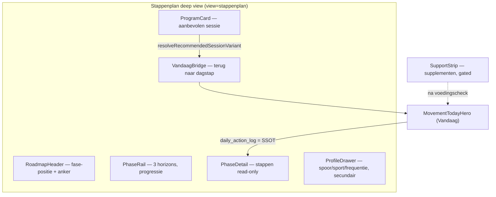
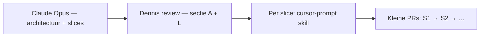

# Prompt — Stappenplan als roadmap + Supplementen in het Vandaag-systeem (Opus)

> **Gebruik:** kopieer alles onder **Prompt (copy-paste)** naar Claude Opus in een nieuw gesprek. Voeg de **screenshots** toe (zie bijlagen-checklist).
>
> **Output:** architectuur + implementatieslices. Geen code, geen diffs.
>
> **Opgesteld:** 23 juli 2026. Harde context geverifieerd tegen `main` op die datum — zie "Verificatie-log" onderaan.
>
> **Relatie tot het bestaande doc:** dit vervangt [`claude-analyse-beweging-vandaag-stappenplan-prompt.md`](claude-analyse-beweging-vandaag-stappenplan-prompt.md) niet. Dat doc blijft de analyse-basis voor betekenis en SSOT (Vandaag ↔ Reis ↔ Stappenplan ↔ notificaties). Dit doc bouwt erop voort met drie assen die daar ontbreken: **visuele kwaliteit**, **supplementen-positionering** en **implementatieslices**.

---

## Waarom een nieuw doc

| Gap in de bestaande prompt | Wat Dennis nu vraagt |
|---|---|
| Geen expliciete kwaliteitslat (craft, hiërarchie, roadmap-metafoor) | Screenshot toont platte pill-chips, een score-ring die bij Vandaag hoort, geen visuele fase-progressie |
| Supplementen alleen impliciet | Aparte rail-tool + footer-sectie in [BewegingScreen.tsx](../../src/components/dashboard/BewegingScreen.tsx) — voelt los van het systeem |
| Output stopt bij sectie J (roadmap) | Geen implementatieslices met componentnamen, props, bestandsstructuur |
| Analyse-first | Dennis wil blauwdruk → bouwslices die 1-op-1 naar Cursor-prompts gaan |

---

## Gebruiksinstructie

1. Open Claude Opus (nieuw gesprek).
2. Voeg bijlagen toe (checklist hieronder).
3. Kopieer het volledige blok onder **Prompt (copy-paste)**.
4. Verwachte output: secties **A t/m L**. Geen code.
5. Review sectie **A** (verdicts) en **L** (slice-volgorde) → daarna per slice een Cursor-prompt via de `cursor-prompt` skill.

### Bijlagen-checklist

- [ ] **Verplicht** — screenshot stappenplan (`view=stappenplan`) op **desktop** én **375px**, gescrold tot en met de fase-sectie.
- [ ] **Verplicht** — screenshot stappenplan op groot scherm **met ingeklapt contextpaneel** (dit is het breedste regime; hier zie je de leesregel-lengte).
- [ ] **Verplicht** — screenshot Vandaag-cockpit op 375px: (a) vóór tier-keuze, (b) na keuze "Trainen", (c) na afvinken.
- [ ] Optioneel — screenshot van de context-rail met de tool "Supplementen" (gelockte én ontgrendelde staat).
- [ ] Optioneel — de twee HCI One-screenshots (stambestanden-overzicht + de lijst "Sporten") als referentie bij taak F. **Let op de framing in de prompt:** dit is een fysio-EPD met een praktijkbeheerder, geen consumentenproduct — het dient als contrast, niet als voorbeeld om na te bouwen.
- [ ] Optioneel — [`CLAUDE.md`](../../CLAUDE.md), [`BLAUWDRUK_BEWEEGSYSTEEM_DASHBOARD_STAPPENPLAN.md`](../plan/BLAUWDRUK_BEWEEGSYSTEEM_DASHBOARD_STAPPENPLAN.md), [`BLAUWDRUK_DOMEIN_STAPPENPLANNEN.md`](../plan/BLAUWDRUK_DOMEIN_STAPPENPLANNEN.md), [`KOMPAS_BEWEGING_NAAR_STAPPENPLAN.md`](../plan/KOMPAS_BEWEGING_NAAR_STAPPENPLAN.md), [`WRITING_VOICE.md`](../core/WRITING_VOICE.md).

---

## Doel-IA in één beeld (context voor de reviewer, niet voor Opus)



---

## Prompt (copy-paste)

```text
ROL: Je bent Senior UX-architect, Product Designer en Frontend Systems Thinker voor
PerfectSupplement (perfectsupplement.nl). Je herontwerpt het beweeg-stappenplan van
het Leefstijlcheck-dashboard en positioneert supplementen in het Vandaag-systeem.

OUTPUT-CONTRACT: je levert UITSLUITEND architectuur + implementatieslices.
GEEN code, GEEN diffs, GEEN bestandspatches, GEEN "ik ga nu bouwen".
Je mag bestaande bestanden bij naam noemen om naar te verwijzen; je wijzigt niets.
Taal: Nederlands. Identifiers, componentnamen en veldnamen: Engels.

Lees CLAUDE.md mee als je het hebt.

═══════════════════════════════════════════════════════════════════════════════
BIJLAGEN (door Dennis)
═══════════════════════════════════════════════════════════════════════════════

1. VERPLICHT: screenshot stappenplan (view=stappenplan), desktop + 375px, gescrold
   tot en met de fase-sectie. Dit is de HUIDIGE staat, niet de doelstaat.
2. VERPLICHT: screenshots Vandaag-cockpit 375px — (a) vóór tier-keuze,
   (b) na keuze "Trainen", (c) na afvinken.
3. OPTIONEEL: screenshot context-rail met tool "Supplementen" (locked + unlocked).
4. OPTIONEEL: CLAUDE.md, blauwdruk-docs, WRITING_VOICE.md.

═══════════════════════════════════════════════════════════════════════════════
PRODUCTCONTEXT
═══════════════════════════════════════════════════════════════════════════════

PerfectSupplement is een onafhankelijk leefstijlplatform voor mannen 40+ (slaap,
stress, energie, herstel, beweging). Positionering: "de Consumentenbond van
supplementen", doorgegroeid naar leefstijlcoach. Adviezen, geen diagnoses.
Stepped care: leefstijl eerst, supplementen laat ("eerst tafel, dan potje").

Na de Leefstijlcheck krijgt de gebruiker een dashboard-cockpit. Beweging is het
verst ontwikkelde domein en fungeert als blauwdruk voor de andere vier.

Drie oppervlakken:

  VANDAAG (view=cockpit)      = executie + staat. Tier-keuze Herstel/Matig/Trainen,
                                dagstap, "Markeer als gedaan" (de ENIGE check-off).
                                Plus "Waar je staat" (score-ring + trend) en
                                "Jouw route" (waypoint-narratief).
  STAPPENPLAN (view=stappenplan) = structuur + configuratie. Planprofiel, aanbevolen
                                programma uit de sessie-catalogus, 3 fasen read-only,
                                mechanisme- en medische-grens-blokken.
  CONTEXT-RAIL (md+)          = navigatie: Vandaag · Stappenplan · Beweegcheck ·
                                Supplementen · Bewegingsgids · Leefstijl & inzichten.

Het probleem is niet meer techniek. Het is KWALITEIT en SAMENHANG: het stappenplan
leest als een instellingen-scherm in plaats van als een roadmap, en supplementen
hangen ernaast in plaats van erin.

═══════════════════════════════════════════════════════════════════════════════
HARDE CONTEXT — GEVERIFIEERD TEGEN DE CODEBASE OP 23 JULI 2026
Neem dit als waar aan. Verzin geen alternatieve staat en ga niet uit van eerdere
analysedocumenten waar die hiermee conflicteren.
═══════════════════════════════════════════════════════════════════════════════

WAT AL WERKT (niet opnieuw voorstellen als "gap")

- Tier-keuze laadt direct de bijbehorende dagstap. De resolver is FASE-AWARE: hij
  bepaalt eerst de actieve fase en valt alleen terug op fase 1 als die niet resolvet.
  De oude "tier-picker zit vast op week 1"-diagnose is ACHTERHAALD.
- One-way sync bestaat: de daily-log is de executie-SSOT; het stappenplan LEEST
  daaruit af (afgeleide step-state todo/done). Handmatige plan-checkboxes zijn in
  account-context uit; anonieme intake-gebruikers houden ze als enige tracker.
- De sessie-catalogus bestaat (5 varianten: kracht-thuis, kracht-sportschool
  [coming_soon], conditie-wandelen, conditie-zone2, dagelijks-ritme) met per variant
  label, doel, duur, frequentie, intensiteit en globale opbouw. De aanbeveling volgt
  uit startspoor + kracht-score + voorkeurssport.
- Profielvelden startPattern, preferredSport en weeklyFrequency persisteren via de
  movement-prefs-API; opslaan gaat per veld direct (optimistisch, geen formulier-submit).
- Gedaan-log bestaat als aparte tabel: minuten per modaliteit + optionele notitie.
  Gelockte regel: minuten zijn EVIDENCE, nooit een tweede score.
- Recovery-hint, week-ritme-readout, training-gate en exertie-microvraag bestaan.
  Het week-ritme leeft in de inspector-zone van het cockpit-frame, niet in de body.
- Het hele dashboard draait op één cockpit-shell (donker, cockpit-tokens, --ac als
  accentvariabele). Er is GEEN dark→light-breuk meer; het eerdere advies
  "plan-reader wordt light 768px" is ACHTERHAALD.
- De fase-ladder als component bestaat al en is goed: read-only horizonten, huidige
  fase licht op, mobiel verticale ladder / lg horizontale stepper, géén afvink-
  oppervlak. Hij leeft nu binnen de reis-rail op Vandaag, niet in het stappenplan.
- Supplement-aanbevelingen worden domein-gefilterd opgebouwd (voor beweging:
  creatine + eiwitpoeder, plus magnesium alleen als de herstelscore < 50) en zijn
  hard gegate op "voedingscheck gedaan".

WAT AANTOONBAAR STUK OF LELIJK IS (dit is je werkgebied)

Stappenplan-view (view=stappenplan):

- De score-ring hoort niet hier. Op stappenplan-diepte rendert de cockpit-laag nog
  steeds de tegel "Waar je staat" (score-ring 92px + trend-sparkline + Future-You-
  regel) — precies dezelfde tegel die op Vandaag staat. Ernaast staat een lege
  intro-tegel "Jouw stappenplan" met twee regels tekst die alleen herhalen dat
  afvinken elders gebeurt. De eerste viewport van de roadmap gaat dus op aan een
  readout die bij Vandaag hoort plus een disclaimer.
- Het planprofiel is een pill-form: drie rijen ronde chip-buttons (startspoor,
  trainingsvorm, frequentie) direct onder de titel, plus een tekstlink "Wijzig
  startspoor of doel →". Configuratie staat vóór inhoud; het leest als
  instellingen, niet als plan.
- "Aanbevolen programma" is een platte tegel: h3 + doelzin + een dl-grid met drie
  kolommen (Duur / Frequentie / Intensiteit) + één regel opbouw. Geen visuele
  hiërarchie, geen "dit is jouw sessie"-gevoel, geen relatie met de tier die de
  gebruiker vanochtend op Vandaag koos.
- Daaronder een accent-banner "Afvinken doe je in VANDAAG op je dashboard" — een
  correcte regel op de verkeerde plek: hij onderbreekt de leesroute tussen programma
  en fases, en hij is de derde plek op dit scherm die zegt dat je hier niets kunt doen.
- Fase-navigatie is een horizontale pill-tabstrip die ADDITIEF uitklapt: klikken
  voegt een fase toe aan de open-set, niets klapt dicht. Wie alle drie aanraakt,
  krijgt drie volledige fase-panelen onder elkaar. Er is geen "je bent hier"-as, geen
  voortgang per fase, geen zichtbare drempel naar de volgende fase.
- Onderaan twee tekst-asides (mechanisme, medische grens) die visueel identiek zijn
  aan elkaar en aan de rest — geen ritme, geen einde-van-document-gevoel.
- Er is geen zichtbare terugkoppeling naar Vandaag anders dan de tekstbanner: het
  plan weet wel welke sessie het aanbeveelt, maar de dagstap in de hero verwijst daar
  niet herkenbaar naar terug.
- BREEDTE IS ONBEGRENSD. De midden-zone van het cockpit-frame heeft geen max-width
  (alleen padding), en de plan-body is w-full. Het contextpaneel is sinds kort
  inklapbaar. Op 1920px met ingeklapte context wordt de leeskolom daardoor ~1600px:
  proza-regels van 200+ tekens in de fase-intro, het mechanisme-blok en de medische
  grens. Inklappen van de context maakt het scherm nu dus SLECHTER leesbaar in plaats
  van beter. Ter vergelijking: de Vandaag-view capt zijn onderste kolom wél op max-w-3xl,
  maar de hero, de score-tegel en de reis-rail daarboven weer niet.
- HET SPORT-VELD IS DODE INPUT. Het profiel toont een chip-rij "Trainingsvorm" met vijf
  opties (Kracht thuis · Sportschool · Wandelen/hardlopen · Fietsen · Zwemmen), maar in
  de resolver doet alleen "sportschool" iets: bij startspoor kracht bepaalt het
  thuis-versus-sportschool, en bij startspoor conditie wordt het veld volledig genegeerd
  (daar telt alleen de kracht-score). Wie "Fietsen" of "Zwemmen" kiest, krijgt exact
  hetzelfde plan als wie niets kiest. De gebruiker configureert iets dat niets verandert —
  dat is schadelijker dan het veld weglaten. Bovendien mengt het veld twee dingen:
  een LOCATIE (thuis/sportschool) en een SPORT (fietsen/zwemmen/hardlopen).

Supplementen:

- De context-rail heeft een tool "Supplementen" die GEEN pagina opent maar naar een
  anker scrollt in de Vandaag-view. Staat de gebruiker op het stappenplan, dan zet de
  klik de view stilzwijgend terug naar Vandaag en scrollt daarna — je verliest je
  plek in de roadmap zonder dat iets dat aankondigt.
- De sectie zelf is een footer-blok "Voeding & supplementen" onderaan de Vandaag-
  view (in de log-variant zelfs dichtgeklapt in een <details>), met eerst een
  voedingshint + link naar de voedingscheck, dan een lijst supplement-rijen met
  "Vergelijk →".
- De gate is hard en correct: zonder voltooide voedingscheck is de rail-tool disabled
  ("Doe eerst de voedingscheck — eerst tafel, dan potje") en levert de builder een
  lege lijst.
- Maar de inhoud is context-loos: de builder krijgt alleen de intake-sessie en de
  gate mee. Niet: de gekozen tier van vandaag, de actieve fase, de recovery-hint of
  de aanbevolen sessie-variant. Eiwit en creatine worden dus getoond zonder relatie
  tot "je traint nu 2× kracht in fase 2".
- Reis-rail duplicatie (bekend, blijft staan): de waypoints "Waarom" en "Mijn doel"
  renderen dezelfde anker-bron; "Future You" ook.

═══════════════════════════════════════════════════════════════════════════════
GELOCKTE BESLUITEN — respecteer deze, bediscussieer ze niet
═══════════════════════════════════════════════════════════════════════════════

1. De VANDAAG-hero is de ENIGE plek waar iets wordt afgevinkt. Geen tweede vinklijst,
   waar dan ook. Het stappenplan is read-only arc voor account-users.
2. Geen streaks, geen calorieën, geen badges, geen schuld-mechaniek.
3. Minuten uit de gedaan-log zijn evidence, nooit een tweede score.
4. De dagstap is en blijft GRATIS. Premium raakt alleen "wanneer & automatisch
   bijgesteld" (tijd-slots, agenda, herkalibratie, wearables), nooit "wat doe ik vandaag".
5. Eén canonieke naam: "stappenplan". Niet "leefstijlplan", niet "beweegplan" in UI.
6. Eén doorway naar het stappenplan vanuit het narratief (route-ladder) + de
   context-rail-tool. Geen derde ingang in de hero.
7. Geen affiliate-links en geen koop-CTA's in het dashboard. Supplement-links wijzen
   naar gids/vergelijkingspagina's buiten de cockpit.
8. Stepped care: supplementen verschijnen NOOIT vóór de leefstijl-basis. De gate
   "voedingscheck gedaan" blijft, tenzij je een sterk onderbouwd alternatief levert.
9. Een supplement is nooit een dagtaak en wordt nooit afgevinkt.
10. Geen medische claims, geen diagnose-taal, geen normwaarden als oordeel.
11. Nieuwe client-events vereisen registratie op drie plekken (event-definitie,
    client-helper, server-allowlist). Noem dat expliciet bij elk nieuw event.
12. De cockpit-shell blijft. Geen nieuwe route naast de bestaande dashboard-route;
    het stappenplan blijft een view-parameter binnen dezelfde shell.

═══════════════════════════════════════════════════════════════════════════════
KWALITEITSLAT — ontwerp hiertegen, niet tegen "het werkt"
═══════════════════════════════════════════════════════════════════════════════

Het dashboard haalt elders al een craft-niveau dat het stappenplan niet haalt.
Je ontwerp moet aan deze zes eisen voldoen, en je toetst er in sectie A op:

1. COCKPIT-TAAL. Donkere tegels, --ac als accentvariabele, serif voor koppen,
   uppercase micro-eyebrows, ronde 2xl-radii. Geen flat form-UI, geen chip-rijen als
   primaire inhoud.
2. ROADMAP-METAFOOR. Het scherm moet een AS hebben: waar kom je vandaan, waar sta je,
   wat komt eraan. Eén ondubbelzinnige "je bent hier"-markering. Fase-navigatie is
   navigatie langs die as, geen accordeon die stapelt.
3. ÉÉN PRIMAIRE BOODSCHAP PER VIEWPORT. Op 375px is de eerste viewport heilig:
   hij vertelt waar je staat in je plan, niet hoe je het instelt.
4. CONFIGURATIE ≠ NAVIGATIE ≠ INHOUD. Deze drie mogen nooit visueel dezelfde
   behandeling krijgen. Instellen is secundair en mag achter een drawer/sheet.
5. GEEN DUBBELE WIDGETS. Score en trend leven op precies één plek in het hele
   beweeg-domein. Kies welke, en zeg wat er op de andere plek voor terugkomt.
6. 375px-FIRST. De roadmap moet op mobiel als één verhaal lezen, niet als spreadsheet.
   Streef naar NUL horizontaal scrollende elementen — drie fasen passen op 375px als je
   de as als segmenten ontwerpt in plaats van als chips. Wijk je daarvan af, dan
   motiveer je het expliciet. Tik-doelen minimaal 44px. Alle tekst leesbaar zonder zoom.
7. BREEDTE IS MAAT, GEEN CONTAINER. Ontwerp met een expliciete breedte-ladder in plaats
   van "alles vult de kolom". Denk in minimaal drie maten en wijs elk element toe:
   een LEESMAAT voor proza (regellengte blijft comfortabel, ook op 4K), een WERKMAAT
   voor gestructureerde kaarten, en een ASMAAT die wél de volle breedte mag pakken
   omdat horizontale ruimte daar betekenis heeft (tijd). Extra breedte moet MEER
   BETEKENIS opleveren, nooit langere regels. Het inklappen van het contextpaneel moet
   het scherm aantoonbaar béter maken; benoem wat er dan verandert.

REFERENTIE-COMPONENTEN (tegen ontwerpen, niet blind kopiëren)
- De bestaande fase-ladder (read-only horizonten, "nu"-markering, verticaal mobiel /
  horizontaal lg) is qua vorm het dichtst bij wat het stappenplan nodig heeft.
- De reis-rail levert het waypoint-narratief: kort, met bron per waypoint.
- Het cockpit-frame levert de drie-zone-layout (rail · midden · inspector). De
  inspector is een legitieme bestemming voor secundaire readouts.

═══════════════════════════════════════════════════════════════════════════════
HUIDIGE SURFACE-KAART (referentie)
═══════════════════════════════════════════════════════════════════════════════

  VANDAAG (view=cockpit)                    STAPPENPLAN (view=stappenplan)
  ├─ tier: Herstel/Matig/Trainen            ├─ [cockpit-laag] Waar je staat  ← DUBBEL
  ├─ dagstap + rationale                    ├─ [cockpit-laag] intro-tegel    ← LEEG
  ├─ Markeer als gedaan ──► daily_action_log├─ Jouw planprofiel (3 chip-rijen)
  ├─ Waar je staat (score-ring + trend)     ├─ Aanbevolen programma (dl-grid)
  ├─ Jouw route (waypoints + fase-ladder)   ├─ banner "afvinken doe je elders"
  └─ Voeding & supplementen (footer/details)├─ fase-tabstrip (additief uitklappend)
        ▲                                   ├─ fase-panelen (read-only steps)
        │ scroll-anker                      ├─ mechanisme-aside
        │                                   └─ medische-grens-aside
  CONTEXT-RAIL ── "Supplementen" ───────────┘  (klik vanaf plan = view-reset)

  INSPECTOR-ZONE: week-ritme + meetmoment

═══════════════════════════════════════════════════════════════════════════════
TAAK A — DIAGNOSE KWALITEITSKLOOF
═══════════════════════════════════════════════════════════════════════════════

Vergelijk de screenshot met de doelstaat die de kwaliteitslat beschrijft. Lever een
tabel: element | huidige staat | waarom het "niet mooi" voelt | root cause | fix-principe.

Beoordeel minimaal:
1. De score-ring + intro-tegel bovenaan het stappenplan.
2. Het planprofiel als chip-form vóór de inhoud.
3. De platte programma-tegel met dl-grid.
4. De fase-tabstrip met additief uitklappen (geen progressie-as, groeiende stapel).
5. De accent-banner "Afvinken doe je in VANDAAG".
6. De twee identieke tekst-asides onderaan.

Per root cause: is dit een LAYOUT-, HIËRARCHIE-, MODEL- of COPY-probleem? Wees
expliciet, want dat bepaalt of een slice cosmetisch of structureel is.

═══════════════════════════════════════════════════════════════════════════════
TAAK B — STAPPENPLAN ALS ROADMAP (herontwerp IA)
═══════════════════════════════════════════════════════════════════════════════

Ontwerp de nieuwe informatie-architectuur van view=stappenplan.

Beantwoord:
1. Welke secties, in welke volgorde, mobile-first? Geef per sectie: functie, bron,
   en of hij hero / configuratie / read-only arc / afsluiting is.
2. Wat is de HERO van dit scherm? Eén element. Motiveer waarom juist dat element de
   vraag "waar sta ik in mijn plan?" beantwoordt.
3. Hoe ziet de fase-as eruit: horizontale timeline, verticale ladder, of hybride
   (compacte as + één open paneel)? Kies er één en motiveer tegen 375px én tegen de
   bestaande ladder-component. Beschrijf expliciet het gedrag bij fase-wissel:
   vervangt de selectie het paneel, of stapelt het? (De huidige stapeling is een bug
   in gedrag, niet in code — los hem op ontwerpniveau op.)
4. Wat gebeurt er met de score-ring? Kies: verhuist naar Vandaag-only, wordt hier een
   compacte fase-readout, of iets anders. Zeg wat er op de vrijgekomen plek komt.
5. Hoe koppelt "Aanbevolen programma" terug naar de tier-keuze in Vandaag? Ontwerp
   de tweerichtings-copy expliciet: wat leest de gebruiker in het plan over zijn
   keuze van vanochtend, en wat leest hij in de hero over zijn programma — zonder dat
   het één van beide letterlijk herhaalt.
6. Waar leeft profiel-bewerking (startspoor / trainingsvorm / frequentie) zonder
   form-UI-gevoel? Ontwerp de lichtste vorm die nog uitnodigt tot wijzigen. Beschrijf
   de leesstaat (wat zie je als je NIET wijzigt) en de bewerkstaat apart.
7. Wat verdwijnt er? Noem minstens drie elementen die van dit scherm af moeten, met
   hun nieuwe bestemming (of "geschrapt").
8. Wat gebeurt er met de sessie-variant die op coming_soon staat? Uitwerken,
   verbergen of expliciet labelen — en wat doet die keuze met vertrouwen.
9. BREEDTE-GEDRAG. Ontwerp expliciet drie breedte-regimes en zeg per regime welke
   layout geldt en waar de omslagpunten liggen:
   (a) 375–767px — één kolom, geen horizontale scroll.
   (b) tablet / laptop met contextpaneel open — de midden-zone is smal.
   (c) groot scherm, contextpaneel INGEKLAPT — de midden-zone kan ~1600px worden.
   Voor (c) is de kernvraag: wat doe je met die ruimte? Uitrekken van proza is geen
   antwoord. Overweeg minimaal een tweekoloms-omslag (as/positie naast het actieve
   fase-paneel, of paneel naast een blijvend zichtbaar programma) en beoordeel of de
   as sticky moet worden. Formuleer het als een regel die ook voor slaap en stress
   werkt, niet als een beweeg-hack. Geef per element uit je IA de toegewezen maat
   (lees / werk / as) uit kwaliteitseis 7.
10. Wat is de STICKY laag? Op mobiel verdwijnt je positie zodra je scrollt. Bepaal of
    er een compacte positie-header meescrolt, wat daarin staat (maximaal drie
    elementen) en hoe hij zich verhoudt tot de bestaande diepte-breadcrumb boven het
    scherm — je mag geen tweede navigatiebalk introduceren.

═══════════════════════════════════════════════════════════════════════════════
TAAK C — SUPPLEMENTEN IN HET VANDAAG-SYSTEEM
═══════════════════════════════════════════════════════════════════════════════

Supplementen zijn nu een footer-blok plus een rail-tool die je uit je plan schopt.
Ze moeten logisch in het systeem landen zonder de stepped-care-belofte te breken.

Werk deze drie opties uit en kies er één met GO / PIVOT / KILL per optie:

  C1 — SUPPORT STRIP. Een compacte "Ondersteuning"-regel in de Vandaag-hero of de
       inspector, die pas verschijnt na de voedingscheck en die inhoudelijk aansluit
       op de actieve tier/fase.
  C2 — FASE-GATED BLOK. Supplementen verschijnen in het stappenplan vanaf fase 2, of
       na X weken aantoonbare consistentie — de basis eerst, letterlijk in de tijd.
  C3 — RAIL BLIJFT. De rail-tool blijft, maar krijgt een eigen bestemming in plaats
       van een scroll-anker, en Vandaag krijgt één verwijzende regel.

Per optie: trigger (wanneer verschijnt het), copy-skelet, meetpunt, stepped-care-
compatibiliteit, en het risico dat het als winkel gaat voelen.

Beantwoord daarnaast expliciet:
1. Verdwijnt de rail-tool "Supplementen"? Zo ja: waar landt die navigatie? Zo nee:
   hoe voorkom je dat een klik vanaf het stappenplan je view stilzwijgend reset?
2. Hoe maak je de aanbeveling contextueel? De builder krijgt nu alleen de intake-
   sessie + de gate. Welke velden zou hij MOETEN krijgen (tier, actieve fase,
   recovery-hint, aanbevolen sessie-variant) en wat verandert dat aan de getoonde
   set en de copy? Markeer expliciet wat NIEUWE input is.
3. Hoe ziet de gelockte staat eruit? Nu is dat een disabled rail-knop met tooltip.
   Ontwerp iets dat de belofte "eerst tafel, dan potje" VERKOOPT in plaats van
   afgrendelt — zonder de gate te verzwakken.
4. Twee copy-voorbeelden die goed zijn en twee die je afkeurt, met uitleg.

HARDE CONSTRAINTS BIJ DEZE TAAK
- Geen supplement als dagtaak, geen afvink, nooit in de dagstap-flow.
- De gate "voedingscheck gedaan" blijft, tenzij je alternatief aantoonbaar sterker is.
- Geen affiliate, geen koop-CTA, geen prijzen in het dashboard.
- De bestaande domein-filtering (beweging = creatine + eiwitpoeder, magnesium alleen
  bij lage herstelscore) blijft het uitgangspunt; je mag beargumenteerd uitbreiden.

═══════════════════════════════════════════════════════════════════════════════
TAAK D — VANDAAG ↔ STAPPENPLAN ↔ REIS (samenhang)
═══════════════════════════════════════════════════════════════════════════════

Ingekort t.o.v. de eerdere analyse; alleen wat het herontwerp raakt.

1. Herpositioneer de hero: van picker naar "dit is hoe je ervoor staat, dit is je
   stap, dit komt eraan". Eén element voor "wat komt eraan", niet meer — en het mag
   geen tweede takenlijst worden. Motiveer je keuze.
2. Los de reis-rail-duplicatie op ("Waarom" / "Mijn doel" / "Future You" delen een
   bron). Geef per waypoint BRON en FUNCTIE, en bepaal het definitieve aantal.
3. Als de fase-ladder naar het stappenplan verhuist: wat blijft er dan van de reis-
   rail over op Vandaag, en is dat nog genoeg om de doorway te dragen?
4. Notificatielaag: houd het bij een schets van maximaal 4 berichttypen (trigger,
   kanaal in-app/e-mail, timing-bron, suppressie). Geen web push, geen SMS. Geen
   gezondheidscontext in onderwerp of preview (AVG art. 9). Dit is F3, geen F1-werk.

═══════════════════════════════════════════════════════════════════════════════
TAAK E — DOMEIN-AGNOSTISCHE BLAUWDRUK
═══════════════════════════════════════════════════════════════════════════════

Beweging is de referentie voor slaap, stress, voeding en verbinding. Markeer in je
ontwerp expliciet wat GENERIEK wordt en wat BEWEGING-SPECIFIEK blijft.

Lever een tabel: bouwsteen | generiek of domein-specifiek | wat een ander domein moet
leveren om hem te gebruiken.

Beoordeel minimaal: roadmap-header, fase-as, fase-paneel, profiel-slot, programma-
kaart, Vandaag-bridge, support-strip, tier-picker, sessie-catalogus.

Doel: slaap kan later dezelfde stappenplan-deep-view krijgen zonder rewrite. Zeg per
generieke bouwsteen welke prop-vorm dat afdwingt (bijv. een phases-array met horizon,
titel en afgeleide staat — niet een movement-specifiek template-type).

═══════════════════════════════════════════════════════════════════════════════
TAAK F — SPORT- EN BEWEEGVORM-MODEL
═══════════════════════════════════════════════════════════════════════════════

Het huidige "Trainingsvorm"-veld belooft personalisatie die het niet levert (zie harde
context: dode input, en het mengt locatie met sport). De vraag is wat ervoor in de
plaats komt.

TER INSPIRATIE — hoe een fysio-EPD dit doet (screenshots optioneel bijgevoegd):
een STAMBESTAND "Sporten": ~200 sporten alfabetisch, elk met status Actief/Inactief,
een filter "Toon alleen actief", en CRUD (Nieuw / Bewerken / Verwijderen) door de
praktijkbeheerder. Daar is een sport puur een REGISTRATIE-LABEL voor de anamnese;
er hangt geen advies aan. PerfectSupplement is mono-user en consument-gericht: er is
geen praktijkbeheerder, en een sport zonder advies heeft hier geen bestaansrecht.
Neem dit patroon dus niet klakkeloos over — beoordeel wat eraan deugt (statusveld,
uitbreidbaarheid, filter) en wat er niet past (CRUD-rol, 200 rijen, label-zonder-inhoud).

TE TOETSEN HYPOTHESE (van Dennis' kant voorgesteld — geef er een expliciet
GO / PIVOT / KILL op, neem hem niet over omdat hij er staat):

  LAAG 1 — BEWEEGVORM. Klein, gesloten, drager van de evidence en van het programma.
  Ordegrootte vijf: kracht · duurbasis · interval · mobiliteit · dagelijks ritme.
  Hier hangt dosis, opbouw, contra-indicatie en bron aan. Dit is wat het stappenplan
  programmeert. De bestaande sessie-catalogus is hiervan de voorloper.

  LAAG 2 — SPORT. Open, uitbreidbaar, met een DEKKINGSPROFIEL over laag 1 en géén
  eigen schema. Wielrennen dekt duurbasis, laat kracht en botbelasting liggen. Tennis
  dekt interval en deels bovenlichaam, laat duurbasis en hip hinge liggen. Wat de
  gebruiker leest is dus geen sport-schema maar een GAP-UITSPRAAK: "dit dek je al af,
  dit ontbreekt — daar begint je plan".

Beantwoord:
1. GO / PIVOT / KILL op de twee-lagen-hypothese, met onderbouwing. Als PIVOT: wat is
   het betere model? Weeg minimaal deze alternatieven: (i) helemaal geen sportveld,
   alleen kracht/conditie/ritme; (ii) sport als pure herkennings-tag zonder gevolgen
   voor het plan; (iii) sport-specifieke programma's per sport.
2. Wat wint de gebruiker met een sportveld dat hij niet wint met alleen kracht/conditie?
   Scheid daarbij twee behoeften die vaak op één hoop gaan: HERKENNING ("dit gaat over
   mij") en PROGRAMMERING ("dit verandert wat ik doe"). Zeg per behoefte wat een
   sportveld realistisch kan leveren.
3. Wat is de juiste OMVANG van de sportlijst bij de start, en op grond waarvan groeit
   hij? De doelgroep is mannen 40+ in Nederland. Ontwerp expliciet het gedrag bij
   "mijn sport staat er niet bij" — en of vrije tekst daar een rol speelt (bedenk: als
   het advies aan de beweegvorm hangt, is een onbekende sport niet blokkerend).
4. Waar leeft de catalogus? Statische data naast de sessie-catalogus, of een
   beheerscherm? Let op: /admin is inmiddels de PartnerDesk-shell (partner- en
   affiliate-beheer). Motiveer wat de goedkoopste vorm is die het werk doet, en welke
   voorwaarde vervuld moet zijn voordat een beheer-UI zichzelf terugverdient.
5. Statusveld: is een per-sport status ("klaar / in opbouw / verborgen") nodig, in de
   geest van de coming_soon-markering die de sessie-catalogus al kent? Wat toont de UI
   in elke staat?
6. Wat gebeurt er met het huidige veld? Het mengt locatie (thuis/sportschool) en sport
   (fietsen/zwemmen/hardlopen). Ontwerp de opsplitsing en zeg wat er gebeurt met
   bestaande opgeslagen waarden — die staan al in de movement-prefs.
7. Welke van deze velden mogen het PROGRAMMA sturen en welke alleen de COPY? Trek die
   grens hard: een veld dat de copy stuurt is goedkoop en veilig, een veld dat het
   programma stuurt vraagt onderbouwing per waarde. Zeg per veld wat het mag.
8. Medische grens: sport-specifiek advies schuift richting blessurepreventie en
   behandeling. Formuleer waar de grens ligt en drie copy-regels die je nooit schrijft.
9. Domein-generalisatie: is "sport" een beweeg-specifiek concept, of een instantie van
   iets algemeners (een CONTEXT-TAG die dekking en gaten bepaalt) dat slaap en voeding
   ook kunnen gebruiken? Verwerk je antwoord terug in de tabel van taak E.

═══════════════════════════════════════════════════════════════════════════════
TAAK G — IMPLEMENTATIESLICES
═══════════════════════════════════════════════════════════════════════════════

Dit is de kern van de opdracht. Lever 4 tot 6 bouwslices, elk klein genoeg voor één
reviewbare PR, in de volgorde waarin ze gebouwd moeten worden.

Per slice, in tabelvorm:

  Slice-ID | Naam | User-visible resultaat | Componenten (nieuw / hergebruik /
  vervangen) | Lib & data | API-touchpoints | Acceptatiecriteria | Risico

Lever 5 tot 7 slices (de sportlaag komt erbij ten opzichte van de eerdere telling).

Aanvullend per slice, in proza:
- Welk bestaand bestand wordt gesplitst of vervangen (primair het huidige plan-body-
  component van ~600 regels), en wat er precies uit gaat.
- Welke props uit het dashboard-model of bestaande hooks komen, en welke NIEUW zijn.
- Wat expliciet NIET wordt aangeraakt (intake-flow, scoring-engine, affiliate-data,
  daily-log-API).
- Acceptatiecriteria als checkbox-lijst, concreet genoeg om als Cursor-prompt te
  dienen ("op 375px past X in de eerste viewport", niet "ziet er beter uit").

Als startpunt (je mag herordenen, samenvoegen of schrappen — motiveer dat dan):

  S0  Breedte-ladder — lees/werk/as-maten toegepast op de bestaande plan-body, zonder
      IA-wijziging. Kandidaat voor eerste PR: klein, meetbaar, direct zichtbaar op
      groot scherm. Beoordeel of dat klopt of dat het juist bij S1/S2 hoort.
  S1  RoadmapHeader — fase-positie + anker; score-ring verdwijnt van dit scherm
  S2  PhaseRail + PhasePanel — vervangt tabstrip + stapelende panelen; inclusief het
      tweekoloms-gedrag bij ingeklapt contextpaneel
  S3  ProgramCard — sessie-catalogus als coach-kaart i.p.v. dl-grid
  S4  ProfileDrawer — spoor/locatie/frequentie uit de leesroute, secundair
  S5  VandaagBridge — tweerichtings-koppeling tier ↔ programma
  S6  SupportStrip — supplementen volgens de gekozen optie uit taak C
  S7  Sportlaag — beweegvorm + sport volgens taak F; splitsing van het huidige
      trainingsvorm-veld inclusief migratiegedrag voor bestaande waarden

Sluit af met een dependency-grafiek (welke slice blokkeert welke) en een expliciete
regel: "Slice X is de eerste PR; slice Y wacht op X omdat …". Markeer expliciet welke
slices puur visueel zijn (geen datamodel-wijziging) en welke het model raken — die
eerste groep is goedkoop terug te draaien, de tweede niet.

═══════════════════════════════════════════════════════════════════════════════
KRITIEKRONDE (verplicht vóór je definitieve versie)
═══════════════════════════════════════════════════════════════════════════════

Beoordeel je ontwerp uit A–G vanuit vijf perspectieven. Per perspectief 2–3 scherpe
kritiekpunten + 1 concrete verbetering:

1. Product Designer (hiërarchie, ritme, craft, 375px, gedrag op 27 inch)
2. 45-jarige gebruiker die zijn plan opent op een dinsdagavond — en dezelfde man die
   drie sporten doet en denkt dat het systeem daar iets mee kan
3. Frontend-ontwikkelaar (haalbaarheid binnen de cockpit-shell, staatsexplosie,
   splitsen van een 600-regelscomponent, regressierisico op de daily-log-sync)
4. Compliance/positionering (stepped care, geen koop-drang, geen medische claim,
   sport-advies dat richting blessurebehandeling schuift)
5. Contentbeheerder over twaalf maanden (wie onderhoudt de sportlijst en de
   dekkingsprofielen, en wat gebeurt er als niemand dat doet)

Verwerk de kritiek en markeer expliciet wat je hebt gewijzigd t.o.v. versie 1.

═══════════════════════════════════════════════════════════════════════════════
OUTPUTFORMAAT (exact deze secties, in deze volgorde)
═══════════════════════════════════════════════════════════════════════════════

A. Executive summary + GO / PIVOT / KILL per idee, één zin onderbouwing per verdict.
   Minimaal beoordelen: roadmap-header, fase-as, programma-kaart, profiel-drawer,
   Vandaag-bridge, supplement-optie C1/C2/C3, rail-tool behouden ja/nee, twee-lagen-
   sportmodel, beheer-UI voor de sportlijst.

B. Diagnose kwaliteitskloof — tabel uit taak A.

C. Doel-journey in 7 stappen: Vandaag → stappenplan → terug, met edge cases (geen
   startspoor gekozen · andere pijler is prioriteit · rustdag · voedingscheck niet
   gedaan · terugkeer na 2 weken stilte · anonieme intake-gebruiker zonder account).

D. Surface-architectuur: wat leeft in hero / stappenplan / inspector / rail /
   notificatie. Tabel.

E. Informatiemodel: per gegeven de bron, de scope (account of sessie) en wie ervan
   leest. Markeer expliciet welke velden NIEUW zouden zijn. Bevestig dat de daily-log
   de enige executie-SSOT blijft.

F. Supplementen-architectuur: gekozen optie + afgewezen opties met reden, trigger,
   gelockte staat, contextuele input, copy (2 goed / 2 afgekeurd).

G. Sport- & beweegvorm-model: verdict op de twee-lagen-hypothese, gekozen model,
   startomvang van de lijst, groeiregel, opslagplek, statusveld, splitsing van het
   huidige trainingsvorm-veld + migratiegedrag, en de harde grens tussen velden die
   het programma sturen en velden die alleen de copy sturen.

H. Domein-agnostische blauwdruk: tabel generiek vs beweging-specifiek + prop-vormen.

I. Copy & button-hiërarchie per oppervlak (primair / secundair / tertiair) met
   concrete NL-labels. Feit-eerst, geen coach-cliché, geen diagnose-taal.

J. Meetplan: per nieuwe CTA of oppervlak het event, de payload-velden, hergebruik-of-
   nieuw, en bij nieuw de drievoudige registratie. Geen PII. Sluit af met één regel:
   "Meetpunt: <event(s)> — hier lees je het effect af."

K. Gefaseerde roadmap F1 / F2 / F3 met per fase user-visible resultaat, backend-werk
   en acceptatiecriteria. Daarna open vragen voor Dennis, genummerd, elk met JOUW
   aanbevolen antwoord — geen open vraag zonder voorkeur.

L. Visueel ontwerp & component-spec
   - ASCII-wireframes 375px: stappenplan in drie fase-toestanden (fase 1 actief /
     fase 2 actief met fase 1 afgerond / laatste fase), en Vandaag in drie toestanden
     (vóór tier-keuze / na keuze / na afvinken).
   - ASCII-wireframe van het BREEDSTE regime: groot scherm met ingeklapt contextpaneel.
     Laat zien wat de extra ruimte doet.
   - Component-tree met props-interfaces in TypeScript-achtige notatie (alleen de
     signatuur — geen implementatie, geen JSX).
   - Design-regels: de breedte-ladder in concrete waarden (lees / werk / as), spacing-
     ritme, typografische schaal, accentgebruik, en wat je bewust NIET gebruikt
     (bijv. chips als primaire inhoud).

M. Implementatieslices
   - Tabel per slice zoals in taak G.
   - Dependency-grafiek.
   - Per slice een checkbox-lijst met acceptatiecriteria, Cursor-prompt-ready.
   - Expliciete volgorde-uitspraak: welke slice de eerste PR is en waarom.
   - Markering visueel-only vs model-rakend.

Sluit af met:
- SELF-SCORECARD (1–10 + één regel motivatie) op ZEVEN dimensies: SSOT-consistentie ·
  mobiel 375px · gedrag op groot scherm · retentie-potentie · dev-realisme ·
  stepped-care-integriteit · VISUELE KWALITEIT.
- ANTI-PATTERNS die je ontwerp expliciet vermijdt. Minimaal: dubbele score-widget,
  form-UI als roadmap, supplement vóór de basis, tweede vinklijst, stapelende
  accordeon zonder as, disclaimer-banner als inhoud, proza dat meerekt tot 1600px,
  en een keuzeveld dat het advies niet verandert.

═══════════════════════════════════════════════════════════════════════════════
CONSTRAINTS
═══════════════════════════════════════════════════════════════════════════════

- GEEN code, GEEN diffs, GEEN JSX, GEEN Tailwind-klassenlijsten. Props-signaturen in
  sectie K zijn de enige uitzondering en blijven types, geen implementatie.
- GEEN nieuwe routes; het stappenplan blijft een view binnen de dashboard-route.
- GEEN web push, GEEN SMS.
- GEEN affiliate of koop-CTA in het dashboard.
- Alle voorgestelde events blijven VOORSTELLEN — je registreert niets.
- Als iets onduidelijk is: kies de sterkste optie, documenteer de aanname expliciet
  als "AANNAME: …", en ga door. Stel geen vragen terug tijdens het uitwerken —
  verzamel ze in sectie J.
- Denk diep. Kies niet de voor de hand liggende indeling. Waar je afwijkt van de
  bestaande architectuur: zeg het hardop en onderbouw het.

BEGIN.
```

---

## Verwachte output (checklist)

- [ ] **A** — Executive summary + GO/PIVOT/KILL per idee
- [ ] **B** — Diagnose kwaliteitskloof (tabel, root cause getypeerd)
- [ ] **C** — Doel-journey 7 stappen + 6 edge cases
- [ ] **D** — Surface-architectuur
- [ ] **E** — Informatiemodel met nieuwe velden gemarkeerd
- [ ] **F** — Supplementen-architectuur (gekozen optie + afgewezen)
- [ ] **G** — Sport- & beweegvorm-model (verdict + omvang + opslagplek + veldsplitsing)
- [ ] **H** — Domein-agnostische blauwdruk (generiek vs beweging-specifiek)
- [ ] **I** — Copy & button-hiërarchie
- [ ] **J** — Meetplan met drievoudige registratie
- [ ] **K** — Roadmap F1/F2/F3 + open vragen mét aanbevolen antwoord
- [ ] **L** — Wireframes 375px (6 toestanden) + breed-scherm-wireframe + component-tree
      + breedte-ladder in concrete waarden
- [ ] **M** — 5–7 slices met acceptatiecriteria + dependency-grafiek
- [ ] Self-scorecard (7 dimensies) + anti-patterns

---

## Verificatie-log (23 juli 2026, tegen `main`)

Alles onder "harde context" in de prompt is hieronder terug te voeren op code. Regels uit het vorige doc zijn niet herhaald tenzij ze dit herontwerp raken.

| Claim in de prompt | Werkelijke staat | Bron |
|---|---|---|
| Score-ring + lege intro-tegel staan bovenaan het stappenplan | **Bevestigd.** Bij `isPlanView` verbergt de cockpit-laag de hero, maar rendert wél de tegel "Waar je staat" (ring 92px + sparkline + Future-You-regel) op `row-start-1`, met daarnaast een intro-tegel van twee regels | [MovementCockpit.tsx:103-207](../../src/components/dashboard/beweging/MovementCockpit.tsx#L103-L207) |
| Planprofiel = drie rijen chip-buttons + tekstlink | **Bevestigd.** `MOVEMENT_START_PATTERN_OPTIONS`, `MOVEMENT_SPORT_OPTIONS` en `MOVEMENT_FREQUENCY_OPTIONS` renderen als `rounded-full` buttons; opslaan gaat per klik via `saveProfilePatch` | [MovementPlanDeepBody.tsx:360-449](../../src/components/dashboard/beweging/MovementPlanDeepBody.tsx#L360-L449) |
| "Aanbevolen programma" = platte tegel met dl-grid | **Bevestigd.** `CockpitTile` + h3 + doelzin + `dl` met Duur/Frequentie/Intensiteit + één opbouw-regel | [MovementPlanDeepBody.tsx:452-479](../../src/components/dashboard/beweging/MovementPlanDeepBody.tsx#L452-L479) |
| Accent-banner "Afvinken doe je in VANDAAG" zit tussen programma en fases | **Bevestigd.** | [MovementPlanDeepBody.tsx:481-492](../../src/components/dashboard/beweging/MovementPlanDeepBody.tsx#L481-L492) |
| Fase-tabstrip klapt additief uit, niets sluit | **Bevestigd.** De tab-knop doet `setExpandedPhaseIds(prev => new Set([...prev, phase.id]))`; het renderblok toont elke fase in de set | [MovementPlanDeepBody.tsx:496-568](../../src/components/dashboard/beweging/MovementPlanDeepBody.tsx#L496-L568) |
| Twee visueel identieke asides sluiten het scherm af | **Bevestigd.** Mechanisme + medische grens, beide `rounded-2xl border border-white/10` | [MovementPlanDeepBody.tsx:571-598](../../src/components/dashboard/beweging/MovementPlanDeepBody.tsx#L571-L598) |
| Rail-tool "Supplementen" scrollt naar een anker in de Vandaag-view | **Bevestigd.** `BEWEGING_SUPPLEMENT_ANCHOR`; disabled zolang de voedingscheck ontbreekt | [context-rail.ts:59-114](../../src/lib/context-rail.ts#L59-L114) |
| Klik vanaf het stappenplan reset de view stilzwijgend | **Bevestigd.** De handler zet `deepView` terug naar `cockpit`, synct de URL en scrollt na twee `requestAnimationFrame`s | [Dashboard.tsx:3308-3375](../../src/components/dashboard/Dashboard.tsx#L3308-L3375) |
| Supplement-sectie bestaat alleen in de Vandaag-view (footer, soms in `<details>`) | **Bevestigd.** `voedingSupplementContent` rendert uitsluitend in de niet-plan-tak; met de log-flag zit hij in een dichtgeklapte `<details>` | [BewegingScreen.tsx:103-252](../../src/components/dashboard/BewegingScreen.tsx#L103-L252) |
| Aanbeveling is context-loos t.o.v. het beweegplan | **Bevestigd.** `buildMovementRecommendations(session, { nutritionLogCompleted })` — geen tier, fase, recovery-hint of sessie-variant als input | [BewegingScreen.tsx:86-88](../../src/components/dashboard/BewegingScreen.tsx#L86-L88), [build-recommendations.ts:133-142](../../src/lib/build-recommendations.ts#L133-L142) |
| Gate is hard | **Bevestigd.** `canShowSupplementStrip` vereist `nutritionLogCompleted === true`; anders lege lijst | [supplement-eligibility.ts:19-23](../../src/lib/supplement-eligibility.ts#L19-L23) |
| Domein-filter beweging = creatine + eiwitpoeder, magnesium alleen bij herstel < 50 | **Bevestigd.** | [build-recommendations.ts:111-142](../../src/lib/build-recommendations.ts#L111-L142) |
| Fase-ladder-component bestaat en is read-only, verticaal mobiel / horizontaal lg | **Bevestigd.** Leeft binnen de reis-rail op Vandaag, niet in het stappenplan | [MovementRouteLadder.tsx:44-80](../../src/components/dashboard/beweging/MovementRouteLadder.tsx#L44-L80), [MovementJourneyRail.tsx:268](../../src/components/dashboard/beweging/MovementJourneyRail.tsx#L268) |
| Week-ritme leeft in de inspector-zone | **Bevestigd.** | [Dashboard.tsx:4237](../../src/components/dashboard/Dashboard.tsx#L4237) |
| Sessie-catalogus: 5 varianten, `kracht-sportschool` op `coming_soon` | **Bevestigd.** | [session-catalog.ts](../../src/data/movement/session-catalog.ts) |
| Plan-body is één component van ~600 regels | **Bevestigd.** 607 regels, inclusief profiel-form, programma, fases en asides | [MovementPlanDeepBody.tsx](../../src/components/dashboard/beweging/MovementPlanDeepBody.tsx) |
| Midden-zone heeft geen max-width; plan-body is `w-full` | **Bevestigd.** `<main className="min-w-0 px-3 …">` binnen een frame van `max-w-[2200px]`; alleen de rail (208–280px) en het contextpaneel (288–360px) hebben vaste breedtes. De plan-body zelf capt niets. De Vandaag-view capt alleen zijn onderste kolom op `lg:max-w-3xl` | [CockpitFrame.tsx:196](../../src/components/dashboard/cockpit/CockpitFrame.tsx#L196), [CockpitFrame.tsx:229](../../src/components/dashboard/cockpit/CockpitFrame.tsx#L229), [MovementPlanDeepBody.tsx:338](../../src/components/dashboard/beweging/MovementPlanDeepBody.tsx#L338), [BewegingScreen.tsx:203](../../src/components/dashboard/BewegingScreen.tsx#L203) |
| Contextpaneel is inklapbaar → midden-zone groeit | **Bevestigd.** `contextCollapsed` schakelt tussen een twee- en driekoloms-grid | [CockpitFrame.tsx:46-52](../../src/components/dashboard/cockpit/CockpitFrame.tsx#L46-L52) |
| "Trainingsvorm" is grotendeels dode input | **Bevestigd.** `MOVEMENT_SPORT_OPTIONS` = thuis · sportschool · wandelen/hardlopen · fietsen · zwemmen. In `resolveRecommendedSessionVariant` wordt `preferredSport` alleen gelezen in de kracht-tak, en daar telt uitsluitend `sportschool`. Bij `startPattern === "conditie"` beslist alleen `movStr`; bij `dagelijks_ritme` niets. Fietsen/zwemmen/wandelen veranderen dus niets aan het advies | [session-catalog.ts:145-164](../../src/data/movement/session-catalog.ts#L145-L164), [session-catalog.ts:110-129](../../src/data/movement/session-catalog.ts#L110-L129) |
| Sessie-catalogus kent al een status-patroon | **Bevestigd.** `detailStatus: "ready" \| "coming_soon"` per variant, met eigen UI-regel in de programma-tegel | [session-catalog.ts:22](../../src/data/movement/session-catalog.ts#L22), [MovementPlanDeepBody.tsx:473-477](../../src/components/dashboard/beweging/MovementPlanDeepBody.tsx#L473-L477) |

---

## Relatie tot implementatie (na Opus)



1. Dennis draait de Opus-prompt mét screenshots.
2. Review: verdicts in sectie **A**, slice-volgorde in sectie **L**.
3. Per slice een Cursor-prompt via de `cursor-prompt` skill; meetpunten uit sectie **I** pas registreren bij de bouw van die slice.
4. Implementatie in aparte sessies, één PR per slice.

---

Meetpunt: geen — dit document activeert niets. Het meetplan komt uit sectie I van de Opus-output en wordt bij slice-implementatie geregistreerd (drievoudige client-event-registratie waar nodig).
