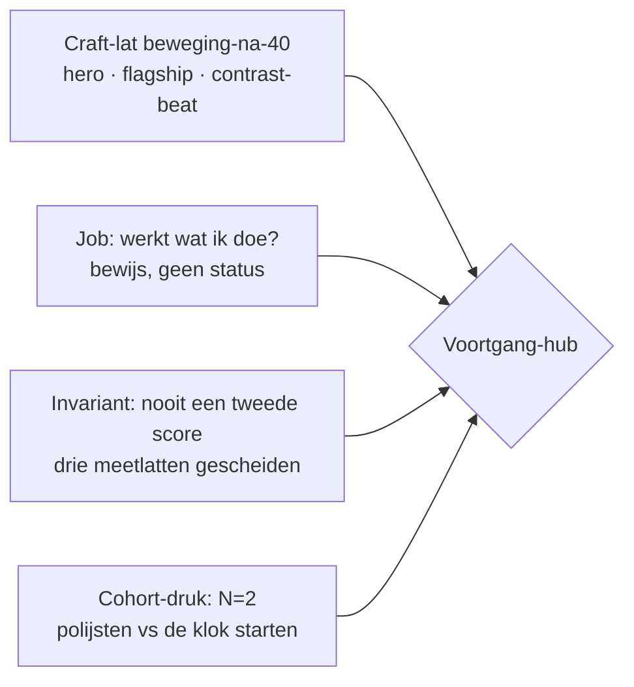
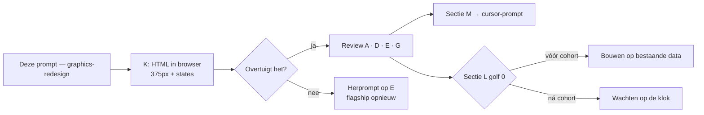

# Prompt — Voortgang als bewijs-documentaire: graphics-redesign + HTML-prebuild (Opus)

> **Gebruik:** kopieer alles onder **Prompt (copy-paste)** naar Claude Opus in een nieuw gesprek. Bijlagen sterk aanbevolen.
>
> **Output:** design-spec **A t/m N** + **één standalone HTML-prebuild**. Geen React, geen JSX, geen bestandspatches in de app — de HTML is het enige codeartefact.
>
> **Opgesteld:** 28 juli 2026. Harde context geverifieerd tegen `main` op die datum — zie "Verificatie-log" onderaan.
>
> **Familie:** volgt de structuur van [`claude-opus-voortgang-route-eigenaarschap-2026-07.md`](claude-opus-voortgang-route-eigenaarschap-2026-07.md) (meta + copy-paste-prompt + genummerde outputsecties). Waar die prompt *eigendom* bepaalde — wie vertelt welk signaal — bepaalt deze de *vorm*: hoe ziet de bewijs-surface eruit en hoe voelt hij.
>
> **Positie in de reeks:** eigenaarschap is beslist én gebouwd (commit `7bfb78b`). Deze prompt heropent dat niet. Hij vraagt: *de ingrediënten staan er nu — waarom leest het nog als een stapeling in plaats van als een documentaire over jouw bewijs?*

---

## Probleem dat deze prompt oplost

De hub is sinds `7bfb78b` **functioneel** een bewijs-surface: het kaartjesmenu is gedegradeerd, de bewijsregel staat bovenaan, de domeinen hebben een eigen readout. Wat er nu staat ([`VoortgangHub.tsx:995-1070`](../../src/components/dashboard/VoortgangHub.tsx#L995-L1070)):

| # | Blok | Component | Wat het vertelt |
|---|---|---|---|
| 1 | Bewijs | [`VoortgangBewijsRegel`](../../src/components/dashboard/voortgang/VoortgangBewijsRegel.tsx) | één zin, vier states, gedrag náást beleving |
| 2 | Reis | [`VoortgangReisStrip`](../../src/components/dashboard/voortgang/VoortgangReisStrip.tsx) | Check → Nu (dag N) → Hermeting (X dgn) |
| 3 | Je metingen | [`VoortgangDomeinRing`](../../src/components/dashboard/voortgang/VoortgangDomeinRing.tsx) | 7 domeinrijen: sparkline + band + delta + dekking |
| 4 | Focus | [`VoortgangKompasPanels`](../../src/components/dashboard/kompas/VoortgangKompasPanels.tsx) | prioriteitsdomein met picker — **nog steeds dezelfde component als op Kompas** |
| 5 | Je meetreeks | `MetingenCard` + [`VoortgangLogboekSection`](../../src/components/dashboard/voortgang/VoortgangLogboekSection.tsx) | check-historie |
| 6 | Verder kijken | 3 × `HubCard` + `PremiumWaitlistCard` | navigatie naar de subschermen |

Zes blokken, allemaal ongeveer even zwaar, allemaal in dezelfde `CockpitTile`-taal, allemaal even luid. **Er is geen first viewport, geen visuele hiërarchie en geen flagship.** De craft-lat van [`/beweging-na-40`](../../src/app/beweging-na-40/page.tsx) — hero met atmosfeer, één dominante interactieve visual, contrast-beat tussen secties — is nergens op het dashboard toegepast.

De vraag is dus niet meer "wie is eigenaar" maar:

> Hoe ziet Voortgang eruit als het een **documentaire over jouw bewijs** is in plaats van zes tegels onder elkaar — en welke van de aanwezige data verdient de rol van flagship?

---

## Wat er sinds de eigenaarschapsronde is veranderd

Belangrijk voor wie de vorige prompt kent: **de harde context van [`claude-opus-voortgang-route-eigenaarschap-2026-07.md`](claude-opus-voortgang-route-eigenaarschap-2026-07.md) is verouderd.** Doc en implementatie landden in dezelfde commit; de code liep er daarna doorheen.

| Toen (in die prompt) | Nu op `main` |
|---|---|
| `TAB_SECTIONS.voortgang = ["vitalityScore", "voortgangHub"]` | `= ["voortgangHub"]` — het vitaliteitsblok is van de tab af |
| Tab-subtitle "Je vitaalscore, je ritme en je levenslijn" | **"Wat zich opstapelt sinds je check."** |
| Hub landt op 3 `HubCard`s bovenaan | HubCards staan onderaan onder de kop "Verder kijken" |
| `cycleEvidence.activeDays` alleen in Hermeting | ook in de bewijsregel op Voortgang (4 states) |
| `KompasLogboekSection` op Kompas | verwijderd; `VoortgangLogboekSection` staat op Voortgang |
| `KompasVoortgangCard.tsx` = dode code | bestand verwijderd |

Wat **niet** is opgelost en dus open staat voor deze ronde: het focus-paneel is nog steeds letterlijk dezelfde component op Kompas én Voortgang ([`VoortgangKompasPanels.tsx:35-41`](../../src/components/dashboard/kompas/VoortgangKompasPanels.tsx#L35-L41) versus [`KompasHomeCard.tsx:715`](../../src/components/dashboard/kompas/KompasHomeCard.tsx#L715)).

---

## Vastgezette keuzes

| Keuze | Default |
|---|---|
| **Output** | Design-spec + standalone HTML-prebuild + data→UI-mapping + conversie + bouwgolven + eerste Cursor-bouwpakket — geen React/JSX in de app, wél één HTML-artifact |
| **Scope** | Hub-landing als redesign-focus; subschermen krijgen een IA-slot + navigatiecontract, geen pixel-redesign |
| **Visuele lat** | Craft van [`/beweging-na-40`](../../src/app/beweging-na-40/page.tsx) |
| **Palet** | Dashboard-sage/cockpit (`--bg #1a2e1a`, `--sage #5A8F6A`) — niet marketing-terracotta |
| **Productjob** | Voortgang = "Werkt wat ik doe?" / bewijs — nooit een tweede score |
| **Claude-rol** | Meedenkend architect — mag eerdere analyses challengen mét onderbouwing; mag betere compositie of conversie voorstellen als die de job scherper maakt |

---

## Gebruiksinstructie

1. Open Claude Opus (nieuw gesprek).
2. Bijlagen toevoegen (checklist hieronder) — screenshots zijn hier zwaarder nodig dan bij de eigenaarschapsprompt, want dit gaat over vorm.
3. Kopieer het volledige blok onder **Prompt (copy-paste)**.
4. Verwachte output: secties **A t/m N**, met **K** als klikbaar HTML-bestand.
5. Review **D** (hero), **E** (flagship) en **K** (prebuild) in de browser op 375px → daarna sectie **M** omzetten naar een Cursor-prompt.

### Bijlagen-checklist

- [ ] **Sterk aanbevolen** — screenshots op 375px: `?tab=voortgang` (hele scroll), `?tab=voortgang&screen=statistieken`, `&screen=favorieten`, `&screen=inzichten`, plus `?tab=vandaag` ter vergelijking van de craft-taal.
- [ ] **Sterk aanbevolen** — screenshots van [`/beweging-na-40`](../../src/app/beweging-na-40/page.tsx): hero, `MovementLifeline`, `MovementFuture`, `MovementDashboardPreview`, `MovementClosingCta`.
- [ ] **Aanbevolen als tekstbijlage** — [`claude-opus-voortgang-route-eigenaarschap-2026-07.md`](claude-opus-voortgang-route-eigenaarschap-2026-07.md), [`claude-opus-voortgang-statistieken-advies-2026-07.md`](claude-opus-voortgang-statistieken-advies-2026-07.md), [`PLAN_KOMPAS_VOORTGANG_DOELNARRATIEF.md`](../plan/PLAN_KOMPAS_VOORTGANG_DOELNARRATIEF.md), [`BEWEEG_COCKPIT_FUTURE_YOU.md`](../plan/BEWEEG_COCKPIT_FUTURE_YOU.md), [`claude-architectuur-beweeggids-2026-07.md`](claude-architectuur-beweeggids-2026-07.md) §16.
- [ ] **Optioneel** — [`CLAUDE.md`](../../CLAUDE.md), [`WRITING_VOICE.md`](../core/WRITING_VOICE.md), [`ROADMAP_DASHBOARD_COCKPIT.md`](../core/ROADMAP_DASHBOARD_COCKPIT.md), [`DESIGN_TOKENS.md`](../core/DESIGN_TOKENS.md).

---

## Centrale spanningen (context voor de reviewer, niet voor Opus)



Vier spanningen die Opus moet oplossen, niet omzeilen:

1. **Flagship vs invariant.** Een dominante visual wil één groot bewegend getal. Dat mag niet. De flagship moet indruk maken op *echte, meervoudige* data zonder tot één cijfer te condenseren.
2. **Documentaire vs dashboard.** `/beweging-na-40` is een leeservaring met een verhaal; de hub is een terugkerend werktuig dat een man op dag 12 in dertig seconden scant. De craft mag de scanbaarheid niet opeten.
3. **Dun bewijs is de normale toestand.** Bij één meting en drie actieve dagen moet het scherm nog steeds eerlijk en waardig zijn. De `dun`-state is geen edge case — die is bij N=2 de meest voorkomende.
4. **Craft vs cohort.** De roadmap-North-Star is "één lus kogelvrij → de klok starten". Opus moet verdedigen waarom deze ronde vóór of ná het cohort komt, of hem gemotiveerd afwijzen.

---

## Prompt (copy-paste)

```text
ROL: Je bent Senior Product Designer, Information Architect en frontend-craft-
architect voor PerfectSupplement (perfectsupplement.nl). Je herontwerpt één
dashboard-oppervlak — de Voortgang-hub — tot een visueel scherp bewijs-scherm,
en je levert daarnaast één klikbare HTML-prebuild waarin dat ontwerp te zien en
te voelen is.

OUTPUT-CONTRACT
- Secties A t/m N, exact in de volgorde onderaan deze prompt.
- Sectie K is een HARDE EIS: één standalone .html-bestand (artifact), zelfstandig
  te openen in een browser zonder build. Dat is het ENIGE codeartefact dat je
  levert.
- GEEN React, GEEN JSX, GEEN patches op bestaande bestanden. Je mag bestanden bij
  naam noemen; je wijzigt er niets aan.
- Taal: Nederlands. Identifiers, componentnamen en veldnamen: Engels, en gelijk
  aan de bestaande namen uit de harde context.

Lees CLAUDE.md en WRITING_VOICE.md mee als je ze hebt.

═══════════════════════════════════════════════════════════════════════════════
BIJLAGEN (door Dennis)
═══════════════════════════════════════════════════════════════════════════════

1. STERK AANBEVOLEN: screenshots op 375px van ?tab=voortgang (hele scroll) en de
   drie subschermen (&screen=statistieken / favorieten / inzichten). Dit is de
   HUIDIGE staat.
2. STERK AANBEVOLEN: screenshots van /beweging-na-40 — dit is de CRAFT-LAT, niet
   de doelinhoud. Neem de compositie en het ritme over, niet het onderwerp en
   niet het terracotta-accent.
3. AANBEVOLEN: de vier architectuurdocs uit de leeslijst hieronder.

═══════════════════════════════════════════════════════════════════════════════
PRODUCTCONTEXT
═══════════════════════════════════════════════════════════════════════════════

PerfectSupplement is een onafhankelijk leefstijlplatform voor mannen 40+ (slaap,
stress, energie, herstel, beweging, voeding, verbinding). Positionering: "de
Consumentenbond van supplementen", doorgegroeid naar leefstijlcoach. Adviezen,
geen diagnoses. Stepped care: leefstijl eerst, supplementen laat.

Na de Leefstijlcheck landt de gebruiker op een dashboard met vier tabs die één
cyclus vormen: Kompas (oriënteren) → Mijn Dag (uitvoeren) → Voortgang (bewijs
zien) → Hermeting (cyclus sluiten) → terug naar Kompas. De cyclus is 30 dagen.

Prod-realiteit: N=2 accounts. De meeste gebruikers hebben straks ÉÉN meting en
een handvol actieve dagen. Ontwerp voor dun bewijs als normaaltoestand, niet als
uitzondering.

═══════════════════════════════════════════════════════════════════════════════
ARCHITECTUUR DIE JE ERFT — behandel dit als input, niet als iets om opnieuw
uit te vinden
═══════════════════════════════════════════════════════════════════════════════

Vijf documenten leggen de fundering. De harde besluiten eruit staan hieronder
samengevat; als de bijlagen meegestuurd zijn, lees die dan integraal.

1. ROUTE-EIGENAARSCHAP (claude-opus-voortgang-route-eigenaarschap-2026-07.md)
   - Vier tabs = één cyclus. Voortgang is de BEWIJS-surface.
   - Voortgang mag geen tweede status-dashboard naast Kompas zijn en steelt het
     deltaReport niet van Hermeting.
   - Drie meetlatten blijven gescheiden: ADHERENCE (gedrag, daily_action_log,
     nooit een score) · BELEVING (intake_domain_checkin, episodisch) · EVIDENCE
     (minuten/sessies, movement_session_log, alleen beweging). Ze mengen nooit
     tot één cijfer.
   - LET OP: de harde context van dat doc is verouderd. Doc en implementatie
     landden in dezelfde commit. Gebruik de HARDE CONTEXT hieronder.

2. STATISTIEKEN/FAVORIETEN-ADVIES (claude-opus-voortgang-statistieken-advies-...)
   - Verdict-SSOT + stepped care horen in Statistieken en Favorieten.
   - De hub mag dat niet opnieuw als hero vertellen; supplementoordelen zijn op
     de hub hooguit een verwijzing.
   - De reis-strip is bewust score-loos: hij toont ritme, niet prestatie.

3. PRIORITEIT-STRATEGIE (claude-opus-prioriteit-strategie-vandaag-home-...)
   - De gedragslus Vandaag ↔ Home ↔ Voortgang is de motor; craft mag de lus niet
     vertragen. Cohort-prioriteit boven polijstwerk.

4. PLAN_KOMPAS_VOORTGANG_DOELNARRATIEF.md
   - Het narratief is oud-jij → nu → toekomstige-jij, PER DOMEIN. Geen tweede
     cijfer, geen aggregaat-voorspelling.
   - Niets wegsnijden zonder vervangende landingsplek. De hermeting-herinnering
     mag nooit verdwijnen.

5. BEWEEG_COCKPIT_FUTURE_YOU.md + claude-architectuur-beweeggids-2026-07.md §16
   - Future You zit in COPY en RICHTING, nooit in een percentage of tweede score.
   - De craft van MovementDashboardPreview wordt geport, maar de drie verzinsels
     daarin (Future You Score, streak-tegel, badge-tegel) worden expliciet NIET
     overgenomen.
   - §16 levert de documentaire-vorm: één flagship-visual die de emotie draagt
     (daar: de levenslijn-slider 30→85), sectie-ritme, "toekomstige ik" als stem
     en niet als diagram.

MEEDENK-CONTRACT
Je BEGINT sectie A met twee expliciete lijsten:
  (a) WAT IK OVERNEEM uit deze analyses — kort, per punt.
  (b) WAAR IK AFWIJK EN WAAROM — met de onderbouwing erbij.
Afwijken mag alleen als het (1) de ene job van Voortgang scherper maakt, of
(2) de conversie meetbaar versterkt. Esthetiek-only afwijkingen van het
eigenaarschapscontract zijn niet toegestaan. Benoem in A ook de spanningen die
je bewust open laat staan in plaats van glad te strijken.

═══════════════════════════════════════════════════════════════════════════════
HARDE CONTEXT — GEVERIFIEERD TEGEN main OP 28 JULI 2026
Neem dit als waar aan. Verzin geen alternatieve staat.
═══════════════════════════════════════════════════════════════════════════════

TAB-STRUCTUUR (src/data/dashboard/index.ts)
- DASHBOARD_TABS: vandaag (label "Kompas") · agenda ("Mijn Dag") · voortgang
  ("Voortgang") · hermeting ("Hermeting").
- Voortgang-subtitle: "Wat zich opstapelt sinds je check."
  emptyHint: "Doe je eerste check — daarna verzamelt zich hier je bewijs."
- TAB_SECTIONS.voortgang = ["voortgangHub"]. Het losse vitalityScore-blok is van
  deze tab AF (stond er tot 28 jul wel). Er is dus geen derde status-surface meer
  bovenaan Voortgang.
- LET OP — LEGE STAAT: in `empty`-modus filtert Dashboard.tsx de secties op
  EMPTY_SECTIONS = ["vitalityScore"]. Voor de Voortgang-tab levert dat een LEGE
  lijst op: zonder check rendert de tab geen enkele sectie, alleen de emptyHint
  uit de tab-config. Dat is een gat dat jij in sectie I moet dichten.

WAT DE HUB VANDAAG RENDERT (VoortgangHub.tsx, in deze volgorde)
1. VoortgangBewijsRegel — CockpitTile, eyebrow "Bewijs". Eén zin uit
   buildVoortgangBewijsRegel() (src/lib/voortgang-bewijs-copy.ts) met vier
   states: "beantwoord" | "opbouwend" | "dun" | "wachtend". Voedt zich met
   cycleEvidence.activeDays, cycleEvidence.cycleDay, daysUntilRemeasure,
   model.priority.label en model.deltaOf(priority). Alleen de "dun"-state heeft
   een ctaLabel ("Pak één moment terug" → onGoAgenda). De copy-regels staan als
   commentaar bovenaan het bestand: nooit een causaal voegwoord (geen "dus",
   "daardoor", "dankzij", "omdat"), nooit adherence en beleving samenvoegen tot
   één getal/percentage/balk, nooit een oordeel over de persoon, geen streaks of
   schuld-taal, geen totale vitaliteitsscore in de zin.
2. VoortgangReisStrip — een 5-koloms grid: node "Check" (datum) → lijn → node
   "Nu" (dag N) → lijn → node "Hermeting" (X dgn). Rendert null als cycleEvidence
   of remeasure ontbreekt. De tweede lijn wordt pas "actief" bij
   daysUntil <= 14.
3. VoortgangDomeinRing — CockpitTile, eyebrow "Je metingen", h3 "Wat je van
   jezelf weet". Dekkingsregel "Je hebt N van de 7 domeinen apart gemeten. X, Y
   nog niet." Daaronder een rij per pijler: kleurstip · label · Sparkline (72×24)
   · bandlabel · DeltaBadge · metaregel "N metingen · X dagen geleden". De lijst
   is gesplitst in interventiedomeinen en, onder een scheidslijn met het label
   "Volgt uit de rest", de readout-domeinen (isInterventionDomain /
   isReadoutDomain uit src/lib/domain-role.ts).
4. VoortgangKompasPanels — rendert KompasVoortgangFocusBlock met
   surface="kompas_voortgang_tab" en showHeader={false}. Dit is LETTERLIJK
   dezelfde component die KompasHomeCard op Kompas toont. Het paneel bevat: de
   focus-pill + picker, het domeincijfer groot in serif (34px) met bandlabel, een
   route van baseline → nu → volgende band, en een pijnregel uit
   getVitalityExplainer(). Deze duplicatie is het enige overgebleven
   eigenaarschapslek; behandel het in sectie A/F.
5. Kop "Je meetreeks" (serif 18) → MetingenCard + VoortgangLogboekSection
   (laatste 5 checks: datum, prioriteitsstip, vitaliteitscijfer).
6. Kop "Verder kijken" (serif 18) → drie HubCards (Statistieken · Favorieten ·
   Jouw inzichten) + PremiumWaitlistCard.

Alle zes blokken hebben ongeveer hetzelfde visuele gewicht, dezelfde
CockpitTile-taal en dezelfde ritmiek. Er is geen hero, geen flagship, geen
contrastwissel. Dat is het probleem dat je oplost.

SUBSCHERMEN (zelfde bestand, screen-state + deeplink)
- VoortgangScreen = "hub" | "inzichten" | "favorieten" | "statistieken" |
  "lichaamssamenstelling". De screen-state synct met de URL via ?screen= — de
  subschermen zijn dus deeplinkbaar en de terugknop werkt.
- Statistieken = StatistiekenAdviesSection (verdict + stepped care) → scheidsregel
  "Einde gratis advies" → LeefstijllijnSection → gratis of premium statistieken →
  HubCard naar Lichaamssamenstelling (premium).
- Favorieten = eigen keuze / aanrader / alle oordelen.
- Jouw inzichten = grote VitalityGauge (300px, hero-variant, LICHT thema) + copy
  uit getVitalityScoreCardCopy() + geblurde tips met waitlist-upsell voor
  niet-premium + MetingenCard.
- Lichaamssamenstelling = premium-slot, toont een terracotta pill "Binnenkort in
  te vullen".

DATALAAG — WAT ER IN DashboardData ZIT (src/types/dashboard.ts:203-237)
Live op de hub gebruikt:
  cycleEvidence { activeDays, cycleDay, daysUntilRemeasure, cycleStartDate,
  cycleEndDate } · remeasure { dueDate, daysUntil } · domainCheckDaysAgo ·
  model.scores · model.trend (per pijler max 6 punten) · model.deltaOf() ·
  model.history (CheckLogEntry[]) · model.priority · model.vitality.
Aanwezig maar op de hub ONBENUT:
  cycleEvidence.cycleStartDate en cycleEndDate (worden NERGENS in de UI
  gerenderd) · planProgress en movementPlanProgress · movementRecoveryTrend ·
  movementRcvFeel + movementRcvFeelAt · nutritionIntake (alleen als poort voor
  aanbevelings-eligibility) · sleepCheckinFocus · hasStressCheckin ·
  supplementVerdicts (leeft in Favorieten/Statistieken) · answers ·
  profileLabel · prev · trendBaselines (leeft in de Leefstijllijn).
Elders eigenaar, niet stelen:
  deltaReport (alleen bij >= 2 snapshots; Hermeting-tab) · de dagtaak-afvinklijst
  (Mijn Dag) · het "Wat je deed"-blok in Hermeting dat cycleEvidence.activeDays
  toont.
Toekomstslots die als "binnenkort" bestaan, niet als data:
  Signal-type met status "connected" | "binnenkort" (wearable) ·
  LichaamssamenstellingView.

HISTORIE EN BRONNEN (src/lib/account-dashboard.ts)
- `history` (CheckLogEntry[]) wordt uitsluitend uit `snapshots` gebouwd — volledige
  intake-sessies. Check-ins en voedingslogs zitten er niet in.
- `series` per pijler bevat WEL alle bronnen, elk punt met `source`
  ("intake" | "checkin" | "nutrition_log") + `rulesVersion`. Maar `trend` reduceert
  dat tot series[pillar].slice(-6).map(p => p.value) — kale getallen, per punt
  geen bron meer.
- `trendBaselines` behoudt bron + rules-versie per pijler; leefstijllijn.ts
  vertaalt dat via baselineSourceLabel() naar zichtbare copy ("op basis van je
  intake" / "je check-ins" / "wat je noteerde"). De BASELINE-bron is dus al
  ontsloten; wat ontbreekt is de bron PER PUNT in de reeks.

BANDEN EN KLEUREN (gebruik deze exact in de prebuild)
- Vitaliteitsbanden (src/lib/vitality-gauge.ts): Uit balans (0) #C24B4B ·
  Op gang (35) #D4824A · Goed (55) #C4A035 · Sterk (70) #5FA872 ·
  Optimaal (85) #3D8B5A.
- Domein-bandlabels kort (src/lib/score-bands.ts): < 40 "Laag" · < 65
  "Gemiddeld" · >= 65 "Sterk".
- Pijlerkleuren (src/data/dashboard/index.ts): slaap #5B6EAE · energie #C4873B ·
  stress #8B6E99 · voeding #5A8F6A · beweging #C26E4B · herstel #4A8A99 ·
  verbinding #7A8A6B.

DESIGN-TOKENS — DASHBOARD (.ps-dash in src/app/globals.css)
  --bg: #1a2e1a
  --panel: rgba(255,255,255,0.05)
  --panel-border: rgba(255,255,255,0.12)
  --text: rgba(255,255,255,0.95)
  --text-muted: rgba(255,255,255,0.60)
  --text-subtle: rgba(255,255,255,0.40)
  --divider: rgba(255,255,255,0.08)
  --divider-strong: rgba(255,255,255,0.16)
  --sage: #5A8F6A          ← het accent van het dashboard
  --terra: #C8956C         ← GERESERVEERD voor premium/waitlist-CTA's
  --f-serif: DM Serif Display
  --f-sans: DM Sans
  achtergrond: radial-gradient(120% 80% at 50% -5%, #21381f 0%, transparent 55%)
  op #1a2e1a.
CockpitTile = rounded-2xl, border 1px rgba(255,255,255,0.10), bg rgba(0,0,0,0.20),
padding 16px; eyebrow = 10px, 600, uppercase, letter-spacing .14em, #9FB0A6.

CRAFT-LAT — /beweging-na-40 (src/app/beweging-na-40/page.tsx + components/content)
- Hero: donker vlak #102018, subtiel raster (2 lineaire gradients, 64px, opacity
  .14) achter een radiale mask, één grote geblurde accent-cirkel, eyebrow 12px
  uppercase tracking .16em, h1 serif clamp(36px,6vw,64px) leading 1.04,
  intro 17-19px #9FB0A6, primaire CTA + tekstlink + micro-reassurance eronder.
- MovementLifeline = de flagship: één interactieve visual (leeftijd-slider
  30→85, twee scenario's die sluipend uiteenlopen) die het hele verhaal draagt.
- MovementFuture = de contrast-beat: één sectie die warmer/lichter wordt en de
  emotie draagt, tussen de analytische secties.
- MovementDashboardPreview = donkere kaart, linear-gradient(160deg,#131F1D,#0C1315),
  rounded-3xl, ring-SVG, "voorbeeld"-badge rechtsboven.
- MovementClosingCta = één afsluiting, geen kaartenmuur.
LET OP: die pagina gebruikt een terracotta accent (marketing). Het dashboard is
sage. Neem compositie, ritme en typografische schaal over — niet het accent.

MEETLAAG — WAT AL LEEFT
GA4/Clarity op Voortgang (src/lib/ga4.ts + src/lib/clarity.ts):
  dashboard_voortgang_bewijs_state { state, cycle_day, active_days }
  dashboard_voortgang_domein_click { domain }
  dashboard_voortgang_hub_click { destination, surface? }
  dashboard_voortgang_terug { from }
  dashboard_voortgang_tab_reset
  dashboard_voortgang_supplementen_click { surface }
  dashboard_inzichten_cta_click { surface }
  dashboard_inzichten_upsell { state, surface }
  dashboard_statistieken_upsell { state, surface, cta? }
  clarityTag("dashboard_voortgang", ...) op vrijwel elke interactie.
Durable domain-events (src/lib/events.ts) o.a.: remeasure.invited,
remeasure.completed, plan.checkin_completed, measurement.checkin_completed,
measurement.direction_detected, focus.viewed, verdict.changed,
premium.waitlist_joined.
Client-emit allowlist voor account-surfaces (src/app/api/account/events/route.ts,
CLIENT_EMIT_TYPES): dashboard.domain_check_cta_clicked,
domain_tool.snapshot_viewed, domain_tool.tier_preview_clicked, focus.viewed,
wearable.interest_clicked.
Een NIEUW durable client-event vereist registratie op drie plekken:
src/lib/events.ts + src/lib/account-events-client.ts + CLIENT_EMIT_TYPES in
src/app/api/account/events/route.ts. Reuse-first: een nieuw GA4-event is goedkoop,
een nieuw domain-event valt onder de roadmap-freeze.

STRATEGISCH KADER
- North Star (ROADMAP_DASHBOARD_COCKPIT.md): het percentage accounts waarbij het
  domein-cijfer meetbaar beweegt tussen check-in en hermeting
  (remeasure.invited → remeasure.completed, met een eerlijke delta).
- Prioriteitsladder: P0 waarheid + instap (geland) · P1 één lus kogelvrij ·
  P2 de klok starten met 20-50 echte mannen 40+ · P3 FREEZE (agenda-diepte,
  Stripe/premium-gating, web push/SMS, verbinding-module, nieuwe event-types).
- Dashboard.tsx is BEVROREN (>4000 regels): niet herbouwen, wel organisch
  uitsplitsen per aangeraakt scherm.

═══════════════════════════════════════════════════════════════════════════════
GELOCKTE INVARIANTEN — respecteer deze, bediscussieer ze niet
═══════════════════════════════════════════════════════════════════════════════

1.  Nooit een tweede score. Geen "Future You Score", geen bewijs-percentage, geen
    voortgangsbalk die naar 100% loopt, geen samengestelde index.
2.  De drie meetlatten blijven gescheiden: adherence, beleving en evidence mengen
    nooit tot één cijfer, balk of ring.
3.  Adherence is geen score en mag er niet als score uitzien. Minuten zijn
    evidence, geen prestatie.
4.  Geen streaks, badges, vlammetjes, calorieën of schuld-mechaniek.
5.  Eén check-off in de hele app: uitsluitend de Vandaag-hero op Mijn Dag. Op
    Voortgang wordt niets afgevinkt.
6.  Future You = copy en richting, nooit een percentage of tweede cijfer.
7.  KOAG: geen numerieke totaalscore als oordeel in UI-copy; werk met de
    bestaande bandlabels.
8.  Stepped care: supplementen verschijnen nooit vóór de voedingscheck; een
    supplement is nooit een dagtaak.
9.  Geen affiliate- of koop-CTA in het dashboard.
10. Geen gezondheidscontext (AVG art. 9) in push-/e-mail-onderwerp of preview;
    geen PII in GA4- of Clarity-payloads.
11. Voortgang steelt het deltaReport niet van Hermeting en wordt geen tweede
    Kompas.
12. Roadmap-freeze: geen agenda-diepte, Stripe, push/SMS, verbinding-module of
    nieuwe durable event-types naar voren halen.
13. Niets wegsnijden zonder vervangende landingsplek — de hermeting-herinnering
    verdwijnt nooit.
14. Verzin geen data. Wat niet bestaat, markeer je als "VEREIST NIEUW: ..." en
    plaats je in een golf.

═══════════════════════════════════════════════════════════════════════════════
WAAR JE MAG MEEDENKEN — EN WAAR NIET
═══════════════════════════════════════════════════════════════════════════════

MAG, zonder toestemming vooraf:
- Een sterkere flagship voorstellen dan de reis-strip of de domeinlijst, zolang
  hij op ECHTE, bestaande data draait.
- De sectievolgorde herzien als het bewijs-verhaal of de conversie erbij wint.
- Eén lichte contrast-beat introduceren (zoals MovementFuture doet), mits het
  scherm scanbaar blijft op 375px.
- De CTA-hiërarchie aanscherpen: hermeting vs vandaag-actie vs premium.
- Blokken samenvoegen, degraderen of verplaatsen naar een subscherm.

MAG NIET zonder expliciete, geschreven onderbouwing in sectie A:
- Een tweede score of Future-You-cijfer introduceren, in welke vorm dan ook.
- Het deltaReport van Hermeting naar Voortgang halen.
- Marketing-terracotta als dashboard-accent gebruiken.
- De hub opnieuw als kaartjesmenu opzetten.
- Een supplement-innamelog voorstellen als kortetermijnwerk (die data bestaat
  niet, is AVG art. 9-gevoelig en levert bij N=2 geen betrouwbaar antwoord).

═══════════════════════════════════════════════════════════════════════════════
KERNOPDRACHT — WAT ELKE SECTIE MOET DOEN
═══════════════════════════════════════════════════════════════════════════════

A. ARCHITECTUUR-OVERNAME. Twee lijsten: wat je overneemt, waar je afwijkt (met
   onderbouwing). Plus de spanningen die je bewust open laat. Behandel expliciet
   het overgebleven eigenaarschapslek: het gedeelde focus-paneel op Kompas én
   Voortgang — verdiepen, degraderen of verwijderen, en met welke vervangende
   landingsplek.

B. JOB EN INVARIANT. Formuleer de ene zin die Voortgang doet en geen ander
   oppervlak mag overnemen, plus de drie dingen die het scherm daardoor NIET
   doet. Eén alinea, geen essay.

C. DATA-INVENTARISMATRIX. Tabel over alle velden uit de harde context, elk in
   precies één categorie: LIVE (staat al op de hub) · ONDERBENUT (bestaat, wordt
   hier niet gebruikt — met de vraag: verdient het een plek?) · ELDERS EIGENAAR
   (niet stelen) · TOEKOMSTSLOT (bestaat als "binnenkort", niet als data). Per
   onderbenut veld: wat het visueel zou kunnen dragen, en of het zonder
   loaderwijziging kan.

D. FIRST VIEWPORT (HERO). Wat een man op dag 12 in de eerste 600 pixels ziet, op
   375px én op desktop. Wees concreet: volgorde van elementen, typografische
   schaal, wat groot is en wat klein, en de copy-intentie per element. De hero
   moet "werkt het?" beantwoorden — of eerlijk zeggen dat het nog te vroeg is.

E. FLAGSHIP-VISUAL. Eén dominante graphic op echte data. Beschrijf: welke data,
   welke vorm, welke interactie (indien enige), wat hij op 375px doet, en waarom
   hij geen tweede score is. Weeg minstens twee alternatieven tegen elkaar af en
   kies er één.

F. SECTIE-RITME. Vijf tot zeven secties met een expliciete contrast-beat: welke
   zijn donker/analytisch, welke is de warme beat, waar staan kaarten en waar
   juist niet. Kaarten alleen waar ze verdiend zijn. Geef per sectie een
   hoogte-indicatie op 375px.

G. CONVERSIEKAART + MEETPUNTEN. De CTA-hiërarchie (primair · secundair · soft)
   per bewijs-state, met per CTA het meetpunt. Hergebruik de bestaande
   dashboard_voortgang_*-events waar mogelijk; benoem nieuwe GA4-events apart van
   eventuele durable events (die laatste vallen onder de freeze). Sluit af met:
   "Meetpunt: <event(s)> — hier lees je het effect af."

H. COPY-RICHTING. Voorbeeldcopy voor hero, flagship, sectiekoppen en CTA's,
   volgens WRITING_VOICE (begrip → urgentie → actie, geen diagnose-taal) en de
   Future You-regel (richting in taal, niet in cijfers). Neem ook de vier
   bewijs-state-zinnen mee: houd de bestaande copy-regels aan (geen causaal
   voegwoord, geen oordeel, geen samengevoegd getal).

I. LEGE EN DUNNE STATES. Per state (dun · wachtend · opbouwend · beantwoord) hoe
   het scherm eruitziet — inclusief wat de flagship dan doet. Behandel apart de
   NUL-staat: de tab rendert vandaag niets zonder check. Wat komt daar te staan?

J. SUBSCHERM-CONTRACT. Wat blijft een apart scherm (Statistieken, Favorieten,
   Inzichten, Lichaamssamenstelling), wat wordt een sectie in de scroll, en hoe
   ziet de doorstap eruit nu de HubCards niet meer de hoofdmoot mogen zijn.
   Respecteer de deeplinks (?screen=).

K. HTML-PREBUILD. Zie het contract hieronder. HARDE EIS.

L. BOUWGOLVEN. Drie tot vier golven met doel · user-visible winst ·
   afhankelijkheden · acceptatiecriteria. Golf 0 draait volledig op bestaande
   data en bestaande events, zonder schemawijziging. Verdedig de plaatsing t.o.v.
   de P0-P3-ladder en het cohort-argument: waarom nu, of waarom pas na het
   cohort.

M. EERSTE CURSOR-BOUWPAKKET. Welke bestanden in welke volgorde, vijf
   acceptatiecriteria, en een expliciete "niet aanraken"-lijst (Dashboard.tsx is
   bevroren; de bewijs-copy-regels en hun tests staan vast).

N. BEWUST NIET. Wat je overwogen en verworpen hebt, met één regel motivatie per
   item.

═══════════════════════════════════════════════════════════════════════════════
SECTIE K — HTML-PREBUILD CONTRACT (harde eisen)
═══════════════════════════════════════════════════════════════════════════════

Lever één standalone .html-bestand dat een reviewer direct in een browser opent.

VERPLICHT:
1. Self-contained: alle CSS inline in een <style>-blok; alle JS inline in een
   <script>-blok. Geen build, geen bundler, geen CDN-afhankelijkheid die de craft
   draagt. Fonts via Google Fonts (DM Serif Display + DM Sans) MET een
   system-fallback in de font-stack, zodat het bestand ook offline klopt.
2. JS uitsluitend voor de interactie van de flagship en het omschakelen tussen
   de bewijs-states. Geen framework, geen router, geen state-library.
3. Palet exact de dashboard-tokens uit de harde context. Sage is het accent;
   terracotta uitsluitend op premium/waitlist. Zet de tokens als CSS custom
   properties op :root, met dezelfde namen als in globals.css.
4. 375px-first, plus minstens één desktop-breakpoint (>= 1024px). Op 375px mag er
   niets horizontaal scrollen.
5. Alle secties uit D, E en F staan er zichtbaar in, in de voorgestelde volgorde.
6. Realistische mock-data die 1:1 mapt op de ECHTE veldnamen. Zet de mockdata
   bovenaan het script in één object met de veldnamen uit de harde context
   (cycleEvidence.activeDays, cycleEvidence.cycleDay, remeasure.daysUntil,
   domainCheckDaysAgo, model.trend, model.scores, model.history, ...) zodat een
   ontwikkelaar de mapping in één blik ziet. Gebruik plausibele waarden voor een
   man op dag 12 van zijn cyclus, niet een showcase-account.
7. Een schakelaar (knoppen of select) waarmee de reviewer tussen de vier
   bewijs-states EN de nul-staat kan wisselen, zodat sectie I te zien is en niet
   alleen te lezen.
8. Toekomstdata (wearable, lichaamssamenstelling) verschijnt uitsluitend als
   zichtbare "binnenkort"-toestand — nooit als een nep-live metric.
9. Primaire en soft-CTA's zijn klikbaar: anchors, of een knop die zichtbaar maakt
   welk event zou vuren (bijv. een kleine toast/regel met de eventnaam). Genoeg
   om het conversiepad te voelen en de meetpunten uit sectie G te controleren.
10. Toegankelijk: echte knoppen voor klikbare dingen, aria-labels op de
    flagship-SVG, contrast dat op #1a2e1a leesbaar blijft, tikdoelen >= 44px.

VERBODEN IN DE PREBUILD:
- Een tweede score, een percentage-balk richting 100%, een streak of badge.
- Verzonnen datavelden die niet in de harde context staan.
- Terracotta als hoofdaccent.
- React, JSX, Tailwind-CDN of een externe chartbibliotheek.

Beschrijf in sectie K in tekst: de bestandsnaam, de sectievolgorde zoals ze in de
HTML staat, welke mockvelden je gebruikt hebt, en de drie plekken waar de
prebuild bewust afwijkt van wat vandaag in de code staat.

═══════════════════════════════════════════════════════════════════════════════
KRITIEKRONDE (verplicht vóór je definitieve versie)
═══════════════════════════════════════════════════════════════════════════════

Beoordeel je ontwerp vanuit vier perspectieven. Per perspectief 2-3 scherpe
kritiekpunten + 1 concrete verbetering die je ook echt doorvoert:
1. Gedragswetenschapper — geeft dit echt het gevoel van bewijs, of is het mooier
   gestapelde status?
2. 45-jarige gebruiker, dag 12, matige motivatie, drukke week, één meting gedaan.
   Wat ziet hij in drie seconden, en klopt dat?
3. Compliance (KOAG / AVG art. 9) — verkapte totaalscore, gezondheidsdata in
   events, impliciete causaliteitsclaim tussen gedrag en cijfer.
4. Frontend-ontwikkelaar — 375px, bevroren Dashboard.tsx, staatsexplosie in
   VoortgangHub (>1000 regels met vijf schermen in één bestand), realisme van de
   bouwgolven.

Markeer expliciet wat je wijzigde ten opzichte van je eerste versie.

═══════════════════════════════════════════════════════════════════════════════
OUTPUTFORMAAT (exact deze secties, in deze volgorde)
═══════════════════════════════════════════════════════════════════════════════

A. ARCHITECTUUR-OVERNAME — overgenomen / afgeweken + waarom / open spanningen
B. JOB EN INVARIANT — de ene zin + de drie dingen die het scherm niet doet
C. DATA-INVENTARISMATRIX — live / onderbenut / elders eigenaar / toekomstslot
D. FIRST VIEWPORT — 375px + desktop, element voor element, met copy-intentie
E. FLAGSHIP-VISUAL — keuze + afgewogen alternatieven + waarom het geen score is
F. SECTIE-RITME — 5-7 secties met contrast-beat en hoogte-indicatie
G. CONVERSIEKAART + MEETPUNTEN — CTA-hiërarchie per state, afgesloten met de
   meetpunt-regel
H. COPY-RICHTING — hero, flagship, sectiekoppen, CTA's, vier state-zinnen
I. LEGE EN DUNNE STATES — vier states + de nul-staat
J. SUBSCHERM-CONTRACT — apart scherm vs sectie, doorstap, deeplinks
K. HTML-PREBUILD — het bestand + de toelichting uit het contract hierboven
L. BOUWGOLVEN 0-3 — doel · winst · afhankelijkheden · acceptatiecriteria
M. EERSTE CURSOR-BOUWPAKKET — bestanden, volgorde, 5 criteria, niet-aanraken
N. BEWUST NIET — verworpen met één regel motivatie

═══════════════════════════════════════════════════════════════════════════════
CONSTRAINTS
═══════════════════════════════════════════════════════════════════════════════

- Eén codeartefact: de HTML-prebuild uit sectie K. Verder geen code, geen diffs,
  geen JSX.
- Behandel het eigenaarschapscontract als geldend. Vorm is open, eigendom niet —
  tenzij je in sectie A onderbouwd afwijkt.
- Ontwerp voor dun bewijs als normaaltoestand (N=2, vaak één meting).
- Hergebruik bestaande events vóór je nieuwe verzint; scheid GA4-events van
  durable domain-events.
- Verzin geen ontbrekende data. Markeer als "VEREIST NIEUW: ..." en plaats het in
  een golf.
- Bij onduidelijkheid: kies de sterkste optie, documenteer als "AANNAME: ..." en
  ga door.
- Denk diep. Waar je afwijkt van de eerdere analyses of van de craft-lat: zeg het
  hardop en onderbouw het.

BEGIN.
```

---

## Verwachte output (checklist)

- [ ] **A** — Architectuur-overname: overgenomen / afgeweken / open spanningen + oordeel over het gedeelde focus-paneel
- [ ] **B** — Job en invariant in één alinea
- [ ] **C** — Data-inventarismatrix (live / onderbenut / elders / toekomst)
- [ ] **D** — First viewport op 375px + desktop
- [ ] **E** — Flagship-visual met afgewogen alternatieven
- [ ] **F** — Sectie-ritme met contrast-beat
- [ ] **G** — Conversiekaart + meetpunten, afgesloten met de meetpunt-regel
- [ ] **H** — Copy-richting inclusief de vier state-zinnen
- [ ] **I** — Lege en dunne states, inclusief de nul-staat
- [ ] **J** — Subscherm-contract met deeplinks
- [ ] **K** — **HTML-prebuild** — standalone bestand, opent in de browser, state-schakelaar werkt
- [ ] **L** — Bouwgolven 0–3, golf 0 zonder schemawijziging
- [ ] **M** — Eerste Cursor-bouwpakket + niet-aanraken-lijst
- [ ] **N** — Bewust niet

Beoordeel **K** eerst in de browser op 375px. Als de prebuild niet overtuigt, hoeft de rest van de review niet.

---

## Verificatie-log (28 juli 2026, tegen `main`)

Alle harde context in de prompt is tegen de code gecontroleerd. Vier beweringen uit de uitgangsnotitie en uit het vorige doc bleken **onnauwkeurig**; die zijn gecorrigeerd verwerkt.

| Bewering | Werkelijke staat | Bron |
|---|---|---|
| Hub-volgorde = Bewijsregel → Reisstrip → Domeinring → Focuspanel → Meetreeks → HubCards + PremiumWaitlist | **Bevestigd**, exact deze zes blokken | [VoortgangHub.tsx:995-1070](../../src/components/dashboard/VoortgangHub.tsx#L995-L1070) |
| Voortgang-tab bevat een `vitalityScore`-blok | **ONJUIST (verouderd).** `TAB_SECTIONS.voortgang = ["voortgangHub"]` — het blok is van de tab af sinds `7bfb78b` | [index.ts:352-358](../../src/data/dashboard/index.ts#L352-L358) |
| Tab-subtitle "Je vitaalscore, je ritme en je levenslijn" | **ONJUIST (verouderd).** Nu: *"Wat zich opstapelt sinds je check."* | [index.ts:334-342](../../src/data/dashboard/index.ts#L334-L342) |
| KOAG-banden = "Sterk / Voldoende / Aandacht / Prioriteit" | **ONJUIST.** Twee bandsystemen in code: vijf vitaliteitsbanden (Uit balans · Op gang · Goed · Sterk · Optimaal) en drie domein-kortlabels (Laag · Gemiddeld · Sterk) | [vitality-gauge.ts:25-29](../../src/lib/vitality-gauge.ts#L25-L29), [score-bands.ts:25-33](../../src/lib/score-bands.ts#L25-L33) |
| Focus-paneel is nog steeds gedupliceerd | **Bevestigd.** `KompasVoortgangFocusBlock` draait op beide oppervlakken; op Voortgang alleen met `showHeader={false}` | [VoortgangKompasPanels.tsx:35-41](../../src/components/dashboard/kompas/VoortgangKompasPanels.tsx#L35-L41), [KompasHomeCard.tsx:715](../../src/components/dashboard/kompas/KompasHomeCard.tsx#L715) |
| Bewijsregel heeft vier states met harde copy-regels | **Bevestigd.** `beantwoord` / `opbouwend` / `dun` / `wachtend`; de regels (geen causaal voegwoord, geen samengevoegd getal, geen oordeel) staan als contract bovenaan het bestand, met unit-tests | [voortgang-bewijs-copy.ts:1-72](../../src/lib/voortgang-bewijs-copy.ts#L1-L72), [voortgang-bewijs-copy.test.ts](../../src/lib/__tests__/voortgang-bewijs-copy.test.ts) |
| `cycleEvidence` heeft alleen activeDays / cycleDay / daysUntilRemeasure | **Aangevuld.** Het type bevat óók `cycleStartDate` en `cycleEndDate` — die worden **nergens** in de UI gerenderd. Concreet onderbenut veld | [dashboard.ts:214-220](../../src/types/dashboard.ts#L214-L220) |
| **Extra vondst — nul-staat** | In `empty`-modus filtert Dashboard.tsx op `EMPTY_SECTIONS = ["vitalityScore"]`; voor Voortgang levert dat een lege sectielijst. Zonder check rendert de tab dus **geen enkele sectie**, alleen de `emptyHint` | [Dashboard.tsx:3479](../../src/components/dashboard/Dashboard.tsx#L3479), [:3710-3713](../../src/components/dashboard/Dashboard.tsx#L3710-L3713) |
| Subschermen zijn deeplinkbaar | **Bevestigd.** `?screen=` synct met de `VoortgangScreen`-state sinds `e2d01b2`; terugknop respecteert de hiërarchie (lichaamssamenstelling → statistieken → hub) | [VoortgangHub.tsx:903-915](../../src/components/dashboard/VoortgangHub.tsx#L903-L915), [Dashboard.tsx:3743-3746](../../src/components/dashboard/Dashboard.tsx#L3743-L3746) |
| Dashboard-events op Voortgang zijn GA4/Clarity, geen durable events | **Bevestigd.** `dashboard_voortgang_*` loopt via `trackEvent`/`clarityTag`; de durable client-allowlist bevat vijf types en geen Voortgang-specifiek event | [account/events/route.ts:9-15](../../src/app/api/account/events/route.ts#L9-L15) |
| Craft-lat = beweging-na-40 met terracotta accent | **Bevestigd én belangrijk.** `ACCENT = oklch(0.69 0.095 50)` op de marketingpagina; `MovementDashboardPreview` gebruikt daarentegen `#5A8F6A`. De prompt schrijft daarom expliciet voor: compositie overnemen, accent niet | [beweging-na-40/page.tsx:17](../../src/app/beweging-na-40/page.tsx#L17), [MovementDashboardPreview.tsx:4](../../src/components/content/MovementDashboardPreview.tsx#L4) |
| Dashboard-tokens | **Bevestigd.** `.ps-dash` levert `--bg #1a2e1a`, `--sage #5A8F6A`, `--terra #C8956C`, DM Serif Display + DM Sans via `--font-heading`/`--font-body` | [globals.css:431-452](../../src/app/globals.css#L431-L452), [layout.tsx:3-19](../../src/app/layout.tsx#L3-L19) |
| Dashboard.tsx bevroren, >3500 regels | **Aangescherpt.** Nu 4085 regels; `VoortgangHub.tsx` zelf is 1074 regels met vijf schermen in één bestand — dat staat als kritiekpunt 4 in de prompt | — |

**Gevolg voor de prompt.** Drie dingen zitten er als expliciete instructie in: (1) het vorige doc wordt als *verouderd op harde context* gemarkeerd zodat Opus niet op een verdwenen `vitalityScore`-blok gaat ontwerpen; (2) de nul-staat is als opdracht in sectie I gezet omdat de tab daar vandaag letterlijk niets rendert; (3) de bandlabels staan met exacte waarden in de prompt, zodat de prebuild geen verzonnen KOAG-taxonomie gebruikt.

---

## Volgende stap na Opus-output

1. Dennis draait de prompt met screenshots als bijlage.
2. **K** openen in de browser op 375px — de state-schakelaar door alle vijf toestanden.
3. Review **A** (afwijkingen), **D**+**E** (hero + flagship), **G** (meetpunten).
4. **M** → Cursor-prompt in de bestaande `cursor-*`-familie.
5. **L** golf 0 bepaalt of dit vóór of ná het cohort gebouwd wordt.



Meetpunt: geen — dit document activeert niets. Het meetplan komt uit sectie G van de Opus-output en wordt pas bij implementatie geregistreerd (GA4 direct herbruikbaar; durable events alleen met drievoudige registratie en buiten de freeze om).
