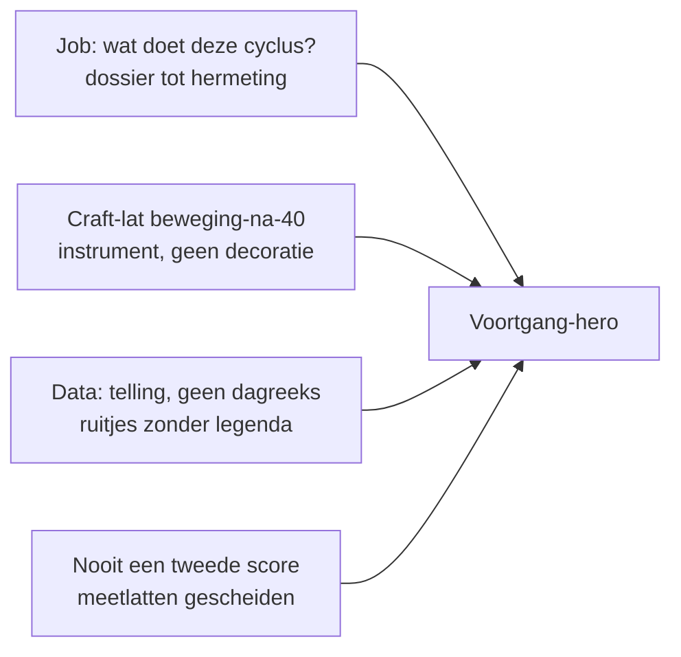

# Prompt — Voortgang-hero: de cyclus als premium bewijs-instrument (Opus)

> **Gebruik:** kopieer alles onder **Prompt (copy-paste)** naar Claude Opus in een **nieuw** gesprek. Screenshots op 375px zijn hier zwaarder nodig dan architectuurdocs — dit is craft + semantiek van één object.
>
> **Output:** design-spec **A t/m N** + **één standalone HTML-prebuild**. Geen React, geen JSX, geen patches op de app. De HTML is het enige codeartefact. Sectie **M** is een Cursor-bouwpakket dat 1:1 mapt op de drie live-bestanden, zodat de live-stap ná review mechanisch is.
>
> **Opgesteld:** 23 augustus 2026. Harde context geverifieerd tegen `main` (`fa1406c3`).
>
> **Familie:** volgt de structuur van [`claude-opus-voortgang-graphics-redesign-2026-07.md`](claude-opus-voortgang-graphics-redesign-2026-07.md). Die prompt herontwierp de hele hub tot documentaire. Deze heropent de hub **niet**. Hij vraagt alleen: *de flagship uit juli staat live — waarom leest hij nog als synthetische SVG-decoratie in plaats van als een instrument dat je in acht seconden begrijpt?*
>
> **Live patchen?** Nee. Opus mag `VoortgangHero.tsx` / `VoortgangBewijsband.tsx` niet wijzigen. De huidige hero *is* de React-vertaling van de juli-prebuild. Direct Tailwind/SVG-tweaken herhaalt dezelfde fout. Wat wél “direct toepasbaar” is: spec + klikbare HTML + sectie M. Na review op 375px bouwt Cursor de live versie zonder tweede ontwerpronde.

---

## Probleem dat deze prompt oplost

Dennis, letterlijk:

> Kijk naar voortgang-hero: de cyclus is niet mooi, statisch-syntetisch, ook geeft het niet duidelijk weer wat het doet, en zijn de tussenmetingen niet duidelijk in symbool of iets aangegeven. Kijk verder wat het nog meer mist, en hoe zou de hero echt premium-sterk-mooi-bruikbaar eruit kunnen gaan zien?

Drie falen zitten daarin. Behandel ze apart — ze kunnen los waar of onwaar zijn:

| # | Falen | As-built |
|---|---|---|
| **F1** | De cyclus **zegt niet wat hij doet**. “Je cyclus” is een label, geen job. | [`VoortgangBewijsband.tsx:399-404`](../../src/components/dashboard/voortgang/VoortgangBewijsband.tsx) — h2 “Je cyclus”, geen uitlegzin. |
| **F2** | Hij oogt **statisch-synthetisch**: dunne as, stippel-toekomst, sage-blob, raster-mask. Geen ritme, geen periode, geen dossier. | [`VoortgangHero.tsx:105-121`](../../src/components/dashboard/voortgang/VoortgangHero.tsx) (grid + blob) · [`VoortgangBewijsband.tsx:80-98`](../../src/components/dashboard/voortgang/VoortgangBewijsband.tsx) (as). |
| **F3** | **Tussenmetingen zijn onleesbaar.** Geroteerde 8.4px-rechthoeken, kleur-only per pijler, geen legenda, geen onderscheid leefstijlcheck vs domeincheck, geen icoon. | [`VoortgangBewijsband.tsx:100-135`](../../src/components/dashboard/voortgang/VoortgangBewijsband.tsx) · `measurementsOf` in [`voortgang-bewijsband.ts:45-69`](../../src/lib/voortgang-bewijsband.ts). |

Daarnaast een vierde, dat Dennis niet noemt maar dat de juli-spec beloofde en live **niet** heeft: een tweede rij onder de as voor actieve dagen, plus een voetregel + legenda. Die zijn nooit gebouwd. `cycleEvidence.activeDays` is een *telling*, geen datumreeks. Verzin geen dagmerken.

De vraag is dus niet “maak de ruitjes groter”, maar:

> Hoe ziet de first viewport van Voortgang eruit als de cyclus een **instrument** is — leesbaar, premium, bruikbaar op 375px — dat in ≤8 seconden uitlegt *wat hij doet*, *waar je nu zit*, en *waar tussenmetingen liggen*, zonder een tweede score te worden?

---

## Wat er sinds de juli-ronde is veranderd

Belangrijk: **de juli-prebuild is live.** Niet heropenen of de hele hub opnieuw documentair maken.

| Toen (juli-spec + prebuild) | Nu op `main` (23 aug) |
|---|---|
| Hub = zes gelijke tegels, geen hero | Hero bestaat: serif-H1 + bewijsregel + CTA + band |
| Reis-strip als los blok | Verdwenen; de band *is* de as |
| Gedeeld focus-paneel op Voortgang | Weg; [`VoortgangHubScroll.tsx`](../../src/components/dashboard/voortgang/VoortgangHubScroll.tsx) heeft hero → “Je werkt aan X” → DomeinRing → Leefstijllijn → RichtingBeat → OverTijd |
| Flagship: twee rijen (metingen boven, adherence-merken onder) + legenda + voetregel | **Alleen de bovenrij.** Geen adherence-merken, geen legenda, geen voetregel. Scrubber + caption wel. |
| `cycleEvidence.cycleStartDate` onderbenut | Live als START-datum links op de band |
| Screen `inzichten` | Canonical `leefstijlprofiel` |

Wat **niet** is opgelost, en dus open staat: F1–F3, plus de gap-lijst die jij in sectie C/N moet maken (o.a. `activeDayNumbers` nooit gebouwd).

---

## Vastgezette keuzes

| Keuze | Default |
|---|---|
| **Output** | Spec A–N + één HTML-prebuild + Cursor-bouwpakket (M). Geen React/JSX in de app. |
| **Scope** | **Alleen de first viewport:** [`VoortgangHero`](../../src/components/dashboard/voortgang/VoortgangHero.tsx) + [`VoortgangBewijsband`](../../src/components/dashboard/voortgang/VoortgangBewijsband.tsx) + [`voortgang-bewijsband.ts`](../../src/lib/voortgang-bewijsband.ts). De rest van de hub (DomeinRing, Leefstijllijn, RichtingBeat, OverTijd) blijft; sectie F/J beschrijft alleen hoe de nieuwe hero erin past. |
| **Visuele lat** | Craft van `/beweging-na-40` — compositie en ritme, niet terracotta, niet het onderwerp. |
| **Palet** | Dashboard-sage/cockpit. Sage `#5A8F6A`. Terracotta alleen premium/waitlist. |
| **Productjob** | Voortgang = “Werkt wat ik doe?” / bewijs. De hero is het dossier-in-aanbouw tot de hermeting-datum. |
| **Live patchen** | **Verboden.** Sectie M is het toepasbare pakket voor Cursor ná HTML-review. |
| **Claude-rol** | Meedenkend architect. Mag de juli-band *vervangen* als een ander object de job scherper maakt op echte data. Mag de scrubber killen. Mag niet de bewijsregel-copy herschrijven. |

---

## Gebruiksinstructie

1. Open Claude Opus (nieuw gesprek).
2. Bijlagen toevoegen (checklist hieronder).
3. Kopieer het volledige blok onder **Prompt (copy-paste)**.
4. Review **D** (hero), **E** (instrument) en **K** (prebuild) in de browser op **375px** → daarna sectie **M** als Cursor-prompt.

### Bijlagen-checklist

- [ ] **Verplicht** — screenshots op 375px van `?tab=voortgang` first viewport (hero + band + scrubber + caption), plus dezelfde staat op desktop (≥1024px, twee kolommen).
- [ ] **Verplicht** — close-up van de meet-ruitjes op de band (dag 1-check vs een domeincheck), plus de caption bij een lege dag.
- [ ] **Sterk aanbevolen** — dezelfde hub in `dun` en `wachtend` (dev-data of een account zonder tweede meting).
- [ ] **Sterk aanbevolen** — `/beweging-na-40` hero + `MovementLifeline` als craft-lat.
- [ ] **Aanbevolen als tekst** — [`claude-opus-voortgang-bewijsband-ontwerp-2026-07.md`](claude-opus-voortgang-bewijsband-ontwerp-2026-07.md) §D–E (wat juli beloofde), [`voortgang-bewijs-copy.ts`](../../src/lib/voortgang-bewijs-copy.ts), [`WRITING_VOICE.md`](../core/WRITING_VOICE.md).
- [ ] **Optioneel** — de juli-HTML [`voortgang-bewijsband-prebuild-2026-07.html`](../design/voortgang-bewijsband-prebuild-2026-07.html) (referentie, niet norm).

---

## Centrale spanningen (voor de reviewer, niet voor Opus)



Vier spanningen die Opus moet oplossen, niet omzeilen:

1. **Instrument vs score.** Een “mooie cyclus” wil een ring of een volle balk. Dat mag niet. Het object moet indruk maken op *meervoudige* echte merken zonder tot één cijfer te condenseren.
2. **Semantiek vs pixel.** Grotere ruitjes lossen F3 niet op als start-check en slaapcheck dezelfde vorm houden.
3. **Lege dagen zijn de normaalstaat.** De scrubber landt op “vandaag”; slepen over het verleden levert meestal “Nog geen bijzonderheid gelogd”. Dat mag niet de dominante ervaring blijven.
4. **Geen nep-adherence.** Juli beloofde merken onder de as. Die data bestaat niet als datums. Eerlijk weglaten of Golf 1 markeren — nooit acht verzonnen stokjes.

---

## Prompt (copy-paste)

```text
ROL: Je bent Senior Product Designer, Information Architect en frontend-craft-
architect voor PerfectSupplement (perfectsupplement.nl). Je herontwerpt ÉÉN
object op het dashboard: de Voortgang-hero en de cyclus-visual daarin. Je
levert een design-spec plus één klikbare HTML-prebuild. Je wijzigt geen
bestaande app-bestanden.

WAAROM DIT GEEN LIVE-PATCH IS
De huidige hero IS al de React-vertaling van de juli-bewijsband-prebuild.
Direct SVG/Tailwind tweaken in VoortgangHero.tsx herhaalt dezelfde fout
(dunne as, 8px-ruitjes, losse range-slider). Jij levert het visuele oordeel
en het artefact. Cursor bouwt daarna via jouw sectie M. Schrijf GEEN React,
GEEN JSX, GEEN diffs.

OUTPUT-CONTRACT
- Secties A t/m N, exact in de volgorde onderaan deze prompt.
- Sectie K is een HARDE EIS: één standalone .html-bestand (artifact),
  zelfstandig te openen in een browser zonder build. Dat is het ENIGE
  codeartefact dat je levert.
- GEEN React, GEEN JSX, GEEN patches. Je mag bestanden bij naam noemen.
- Taal: Nederlands. Identifiers, componentnamen en veldnamen: Engels, gelijk
  aan de bestaande namen uit de harde context.

Lees CLAUDE.md en WRITING_VOICE.md mee als je ze hebt.

═══════════════════════════════════════════════════════════════════════════════
DE STELLING DIE JE TOETST (niet: de opdracht die je klakkeloos uitvoert)
═══════════════════════════════════════════════════════════════════════════════

Dennis zegt, letterlijk:

  "Kijk naar voortgang-hero: de cyclus is niet mooi, statisch-syntetisch, ook
  geeft het niet duidelijk weer wat het doet, en zijn de tussenmetingen niet
  duidelijk in symbool of iets aangegeven. Kijk verder wat het nog meer mist,
  en hoe zou de hero echt premium-sterk-mooi-bruikbaar eruit kunnen gaan zien?"

Drie beweringen. Behandel ze apart in sectie A — ze kunnen los waar of onwaar
zijn:

  F1  De cyclus legt niet uit wat hij doet.
  F2  De vorm is statisch-synthetisch (lijn + stippel + blob), geen instrument.
  F3  Tussenmetingen missen een leesbaar symbool / onderscheid.

Daarna: wat MIST hij nog meer (gap-lijst, data + craft + copy + interactie),
en hoe ziet een premium-sterk-mooi-bruikbare first viewport eruit op 375px
én desktop.

Je mag F1–F3 deels weerspreken als de live code iets doet dat Dennis niet
ziet — maar alleen met pad:regel.

═══════════════════════════════════════════════════════════════════════════════
BIJLAGEN (door Dennis)
═══════════════════════════════════════════════════════════════════════════════

1. VERPLICHT: screenshots 375px + desktop van ?tab=voortgang first viewport.
2. VERPLICHT: close-up meetmerken + caption op een lege dag.
3. STERK AANBEVOLEN: dun- en wachtend-staat; /beweging-na-40 als craft-lat.
4. AANBEVOLEN: claude-opus-voortgang-bewijsband-ontwerp-2026-07.md §D–E
   (wat juli beloofde; dat is REFERENTIE, geen norm — live week daarvan af).

═══════════════════════════════════════════════════════════════════════════════
PRODUCTCONTEXT
═══════════════════════════════════════════════════════════════════════════════

PerfectSupplement is een onafhankelijk leefstijlplatform voor mannen 40+
(slaap, stress, energie, herstel, beweging, voeding, verbinding).
Positionering: "de Consumentenbond van supplementen", doorgegroeid naar
leefstijlcoach. Adviezen, geen diagnoses. Stepped care: leefstijl eerst,
supplementen laat.

Dashboard-cyclus van vier tabs: Kompas (oriënteren) → Mijn Dag (uitvoeren) →
Voortgang (bewijs zien) → Hermeting (cyclus sluiten). De cyclus is 30 dagen,
van leefstijlcheck tot hermeting.

Voortgang-subtitle (tab-config): "Wat zich opstapelt sinds je check."
emptyHint: "Doe je eerste check — daarna verzamelt zich hier je bewijs."

Prod-realiteit: weinig accounts, vaak ÉÉN meting en een handvol actieve
dagen. Ontwerp voor dun bewijs als normaaltoestand.

═══════════════════════════════════════════════════════════════════════════════
ARCHITECTUUR DIE JE ERFT — input, niet opnieuw uitvinden
═══════════════════════════════════════════════════════════════════════════════

1. ROUTE-EIGENAARSCHAP
   Voortgang is de BEWIJS-surface, geen tweede Kompas, steelt deltaReport
   niet van Hermeting. Drie meetlatten gescheiden: ADHERENCE (gedrag,
   daily_action_log, nooit een score) · BELEVING (intake_domain_checkin,
   episodisch) · EVIDENCE (minuten/sessies, alleen beweging). Mengen nooit
   tot één cijfer.

2. JULI-BEWIJSBAND (docs/cursors/claude-opus-voortgang-bewijsband-ontwerp-
   2026-07.md)
   Job-zin toen: "Voortgang laat zien wat er sinds je check is opgestapeld,
   en of dat al genoeg is om iets te kunnen zeggen — met een datum waarop
   je het antwoord krijgt." Flagship = horizontale tijdband, start→hermeting,
   ruiten boven de as (beleving), merken onder de as (adherence), scrubber,
   caption. De hub daaromheen is sindsdien gebouwd; JIJ herontwerpt die hub
   niet. Jij herontwerpt het object dat "Je cyclus" heet, omdat het live de
   job niet waarmaakt.

3. BEWIJSREGEL-COPY (src/lib/voortgang-bewijs-copy.ts) — GELOCKT
   Vier states: beantwoord | opbouwend | dun | wachtend.
   Regels: nooit causaal voegwoord (dus/daardoor/dankzij/omdat); nooit
   adherence+beleving tot één getal/balk; nooit oordeel over de persoon;
   geen streaks/vlammen/schuld; geen totale vitaliteitsscore — alleen
   focusDelta van het prioriteitsdomein.
   Tests in src/lib/__tests__/voortgang-bewijs-copy.test.ts. Geen letter
   van buildVoortgangBewijsRegel() herschrijven. H1_BY_STATE en
   REASSURANCE_BY_STATE in VoortgangHero.tsx MAG je herschrijven: die zijn
   niet de gelockte regel, dat is de omlijsting.

4. NARRATIEF
   oud-jij → nu → toekomstige-jij, PER DOMEIN. Future You = copy en richting,
   nooit een percentage. Hermeting-herinnering verdwijnt nooit.

MEEDENK-CONTRACT
Sectie A begint met twee lijsten:
  (a) WAT IK OVERNEEM uit juli + uit live.
  (b) WAAR IK AFWIJK EN WAAROM.
Afwijken mag als het F1, F2 of F3 scherper oplost, of de scanbaarheid op
375px meetbaar wint. Esthetiek-only ("de lijn 2px dikker") is geen afwijking
waard. Benoem spanningen die je bewust open laat.

═══════════════════════════════════════════════════════════════════════════════
HARDE CONTEXT — GEVERIFIEERD TEGEN main 23 AUGUSTUS 2026
Neem dit als waar aan. Verzin geen alternatieve staat. Citeer pad:regel.
═══════════════════════════════════════════════════════════════════════════════

WAT DE HUB RENDERT (VoortgangHubScroll.tsx, deze volgorde — JIJ WIJZIGT
ALLEEN BLOK 1)
1. VoortgangHero
   - Vlak: relative -mx-3 rounded-b-3xl bg-[#132414], grid-mask opacity .14
     64px achter radiale mask, sage-cirkel blur 120px rechtsboven opacity .18
     (VoortgangHero.tsx:101-121).
   - Eyebrow: "BEWIJS · DAG {cycleDay}" of "BEWIJS" (r.99, 126-128).
   - H1 serif, state-gestuurd (r.21-26, 129-135):
       beantwoord  "Er zit beweging in."
       opbouwend   "Er stapelt zich iets op. Lezen doe je straks."
       dun         "Er ligt nog te weinig om iets te lezen."
       wachtend    "Je bewijs begint bij je eerste dag."
   - Body = buildVoortgangBewijsRegel().line verbatim (r.136-138).
   - CTA-rij (r.140-176): als remeasure.daysUntil ≤ 14: primair "Naar je
     hermeting" + secundair "Wat staat er voor vandaag". Anders: primair
     regel.ctaLabel ?? "Wat staat er voor vandaag" + tekstlink "Bekijk je
     {priority}".
   - Reassurance 12.5px (r.28-33, 178-180).
   - Desktop: lg:grid twee kolommen, links narratief, rechts de band in een
     kaart (rounded-20, border white/10, bg black/22, p-22).
   - Mobiel: band ONDER de copy — op 375px ligt het instrument onder de fold
     als de copy + CTA + reassurance hun hoogte pakken. Behandel dat als
     craft-probleem in D.
   Events: dashboard_voortgang_bewijs_state {state, cycle_day?, active_days?}
           dashboard_voortgang_hub_click {destination, surface:"bewijs_hero"}
           dashboard_voortgang_domein_click {domain}
           clarityTag("dashboard_voortgang", ...)

2. Regel "Je werkt aan {priority}. Naar Vandaag →" (HubScroll r.88-100).
3. VoortgangDomeinRing — 7 rijen, sparkline + band + delta. NIET in scope.
4. LeefstijllijnSection compact. NIET in scope.
5. VoortgangRichtingBeat. NIET in scope.
6. VoortgangOverTijdSection. NIET in scope.

HET INSTRUMENT LIVE (VoortgangBewijsband.tsx + voortgang-bewijsband.ts)
- CYCLE_LENGTH = 30.
- viewBox 0 0 340 112. As y=58. Meet-lane y=36. xOf(day) lineair dag 1–30.
- As: verleden solid 1.5px rgba(255,255,255,.30) tot vandaag; toekomst
  stippel 1px dash 1 5 tot hermeting-knoop.
- START: cirkel r=4 sage .6 + "START" + formatShortDate(cycleStartDate).
- HERMETING: open cirkel r=5.5 sage stroke + "HERMETING" + dueDate.
- Vandaag: sage cirkel r=4 + verticale lijn.
- Leeskop: witte driehoek + lijn op headDay (scrubber).
- Metingen: per BandMeasurement een haarlijn lane→as, geroteerde rect
  8.4×8.4 in pijlerkleur (of #E7EDE8 als pillarId null = leefstijlcheck),
  stroke #132414. Laatste meting krijgt een ring r=9. GEEN legenda. GEEN
  tekst bij het merk. Kleur is het enige onderscheid.
- measurementsOf(): ALTIJD {day:1, pillarId:null, label:"Je leefstijlcheck"};
  plus per PILLAR waar domainCheckDaysAgo[id] gezet is: day = cycleDay −
  daysAgo, alleen als 1..30. Gesorteerd op dag. Nutrition-log, sleep/stress
  pulse, movementRcvFeel zitten HIER NIET IN — ook al bestaan die velden
  op DashboardData.
- Scrubber: <input type="range" min=1 max=30>, 44px sage thumb, disabled
  in wachtend. Event dashboard_voortgang_band_scrub {zone} eenmaal per
  1200ms (verleden|vandaag|toekomst).
- Caption (buildBandCaption):
    verleden + meting → "Dag N · datum" / "Je leefstijlcheck." of "Je mat
      je {label}."
    verleden leeg → "Nog geen bijzonderheid gelogd op deze dag."
    vandaag → "{activeDays} dagen waarop je iets pakte deze cyclus."
    toekomst → "Nog te gaan." + italic future-regel
    dag 30 → "Je hermeting." + "Hier lees je terug of er beweging in je
      {priority} zit."
  Wachtend: "Nog niets gelogd" / hermeting-datum / future-regel.
- Wat juli beloofde en LIVE ONTBREEKT:
    · rij onder de as voor actieve dagen (activeDayNumbers bestaat niet)
    · voetregel "Nog X dagen tot je hermeting op … Laatste meting: …"
    · legenda-chips
    · noot "Merken en metingen staan op aparte rijen"
  Verzin activeDayNumbers niet. Markeer als Golf 1 in C/L als je ze nodig
  hebt.

DATALAAG (src/types/dashboard.ts, cycleEvidence ~r.276-282)
Live in de hero:
  cycleEvidence { activeDays, cycleDay, daysUntilRemeasure, cycleStartDate,
  cycleEndDate } | null
  remeasure { dueDate, daysUntil } | null
  domainCheckDaysAgo: Partial<Record<PillarId, number>>
  model.priority.label, model.deltaOf(priority) → bewijsregel
Aanwezig op DashboardData, NIET op de band:
  model.history (snapshots, geen check-ins)
  model.trend[pillar] (kale getallen, max 6, bron per punt verloren)
  movementRcvFeel + movementRcvFeelAt
  nutritionIntake / nutritionLastLoggedAt
  sleepCheckinSnapshot, movementCheckinSnapshot, hasStressCheckin
  movementRecoveryTrend
Elders eigenaar, niet stelen:
  deltaReport (Hermeting, ≥2 snapshots)
  daily_action_log-datums (Mijn Dag; de telling activeDays komt daar vandaan
  maar de dagnummers bereiken de client niet)
  het "Wat je deed"-blok in Hermeting
Niet verzinnen:
  cycleEvidence.activeDayNumbers — stond in de juli-spec als Golf 1,
  loader-only, nooit gebouwd.

PIJLERKLEUREN (src/data/dashboard/index.ts) — gebruik exact
  slaap #5B6EAE · energie #C4873B · stress #8B6E99 · voeding #5A8F6A ·
  beweging #C26E4B · herstel #4A8A99 · verbinding #7A8A6B.

DESIGN-TOKENS (.ps-dash)
  --bg #1a2e1a · --sage #5A8F6A · --terra #C8956C (alleen premium)
  --text rgba(255,255,255,.95) · body-copy #CDD7D0 · eyebrow #9FB0A6
  hero-vlak #132414 · serif DM Serif Display · sans DM Sans
CockpitTile = rounded-2xl, border white/10, bg black/20, p-16; de hero is
bewust GEEN tegel.

CRAFT-LAT — /beweging-na-40
Hero: donker vlak, raster achter mask, één blob, serif h1, intro, CTA +
tekstlink + micro-reassurance. Flagship = MovementLifeline (één interactief
object dat het verhaal draagt). Neem compositie/ritme/typografische schaal
over — niet terracotta, niet de levenslijn-metafoor als tweede score.

MEETLAAG — WAT AL LEEFT (hergebruik-first)
GA4 (trackEvent, geen enum-plicht in ga4.ts; string-events):
  dashboard_voortgang_bewijs_state { state, cycle_day?, active_days? }
  dashboard_voortgang_hub_click { destination, surface? }
  dashboard_voortgang_domein_click { domain }
  dashboard_voortgang_band_scrub { zone: verleden|vandaag|toekomst }
Clarity: clarityTag("dashboard_voortgang", ...)
Durable: remeasure.invited / remeasure.completed (niet vanaf deze hero
vuren). Geen nieuw durable event (freeze). Nieuw GA4 mag; beschrijf in G
met "Meetpunt: … — hier lees je het effect af."
Tik op een meetmerk: als je de scrubber vervangt, hergebruik
dashboard_voortgang_band_scrub OF introduceer één nieuw GA4 (bijv.
dashboard_voortgang_band_mark { kind, day }) — geen tweede betekenis op
een bestaand event (les G′).

═══════════════════════════════════════════════════════════════════════════════
GELOCKTE INVARIANTEN — respecteer, bediscussieer ze niet
═══════════════════════════════════════════════════════════════════════════════

1.  Nooit een tweede score. Geen bewijs-percentage, geen balk naar 100%,
    geen ring waarvan de oppervlakte als index leest, geen "dag 12 van 30"
    als noemer in copy (30 is een datum-as, geen deler). "8 van de 12 dagen"
    uit de gelockte bewijsregel MAG — dat is cycleDay, niet CYCLE_LENGTH.
2.  Drie meetlatten blijven gescheiden. Adherence en beleving mogen visueel
    naast elkaar staan in ANDERE vormen; nooit tot één vulling.
3.  Adherence is geen score en mag er niet als score uitzien.
4.  Geen streaks, badges, vlammetjes, schuld-mechaniek.
5.  Niets afvinken op Voortgang. Eén check-off in de app: Mijn Dag.
6.  Future You = copy en richting, nooit een cijfer.
7.  KOAG: geen numerieke totaalscore als oordeel; bandlabels mogen.
8.  Geen affiliate-/koop-CTA. Geen supplement op deze hero.
9.  Geen PII in GA4/Clarity. Geen gezondheidscontext in event-payloads.
10. deltaReport blijft van Hermeting.
11. Hermeting-datum blijft in élke state zichtbaar, inclusief wachtend.
12. Verzin geen data. Wat niet bestaat: "VEREIST NIEUW: …" + golf.
13. Gelockte bewijsregel-copy en haar tests blijven onaangeraakt.
14. Dashboard.tsx is bevroren. Hero-wijzigingen lopen via VoortgangHero +
    VoortgangBewijsband + voortgang-bewijsband.ts (sectie M, Cursor later).

═══════════════════════════════════════════════════════════════════════════════
WAAR JE MAG MEEDENKEN — EN WAAR NIET
═══════════════════════════════════════════════════════════════════════════════

MAG, zonder toestemming vooraf:
- De juli-band vervangen door een beter object op dezelfde data (tijdband,
  spoor, dossier-strip, geklikte merken i.p.v. scrubber, …) zolang het geen
  tweede score is.
- De scrubber killen als tik-op-merk de job scherper maakt. Lege dagen
  mogen dan NIET de default-ervaring zijn.
- H1_BY_STATE en REASSURANCE_BY_STATE herschrijven (niet de bewijsregel).
- Eén zin toevoegen die de job van de cyclus noemt ("dertig dagen van je
  check tot je hermeting" of beter — jouw craft).
- Meettypen een EIGEN VORM geven (niet alleen kleur): start-check ≠
  domeincheck ≠ (toekomst) pulse/log. Legenda in beeld, 375px.
- Desktop- vs mobiel-compositie herzien zodat het instrument in het eerste
  scherm valt op 375px.
- Golf 1-velden voorstellen (activeDayNumbers, bron-per-punt) — niet
  tekenen alsof ze live zijn.

MAG NIET zonder PIVOT + schade in sectie A:
- Een tweede score, ring-aggregaat, percentage-runway, streak.
- deltaReport naar de hero halen.
- Actieve-dagmerken tekenen zonder echte dagnummers.
- Terracotta als dashboard-accent.
- De rest van de hub (DomeinRing t/m OverTijd) meenemen in de prebuild als
  pixel-redesign. Eén rustige hint onder de hero mag, zodat de reviewer
  ziet dat de scroll doorgaat.
- React/JSX/live patches.

═══════════════════════════════════════════════════════════════════════════════
KERNOPDRACHT — WAT ELKE SECTIE MOET DOEN
═══════════════════════════════════════════════════════════════════════════════

A. ARCHITECTUUR-OVERNAME + VERDICT OP F1–F3.
   Twee lijsten (overname / afwijking). Daarna per F-punt: WAAR / DEELS /
   ONWAAR, met pad:regel. Gap-lijst: wat de hero verder mist (minstens
   vijf punten voorbij F1–F3 — denk: job-zin, legenda, fold op 375px,
   lege-dag-scrub, ontbrekende meettypen, geen voetregel, telling vs
   datums, decoratie zonder betekenis). Open spanningen.

B. JOB EN INVARIANT.
   Eén zin die DIT OBJECT doet en die Kompas, Mijn Dag en Hermeting niet
   mogen overnemen. Plus drie dingen die de hero daardoor NIET doet.

C. DATA-INVENTARISMATRIX.
   Alleen velden die de hero/band raken. Categorieën: LIVE · ONDERBENUT ·
   ELDERS EIGENAAR · TOEKOMSTSLOT · VEREIST NIEUW. Per onderbenut: wat het
   visueel kan dragen, of dat zonder loader kan. activeDayNumbers expliciet
   behandelen: tekenen of bewust weglaten, nooit faken.

D. FIRST VIEWPORT (HERO).
   Man op dag 12, één intake, twee domeinchecks (bijv. slaap 4 dgn geleden,
   voeding 9), activeDays=8, daysUntilRemeasure=18, state=opbouwend of dun.
   Element voor element op 375px (y-afstanden vanaf top hero) EN desktop.
   Wat in de eerste 600px moet zitten: job van de cyclus, waar je nu zit,
   hermeting-datum, minstens één leesbaar tussenmerk. Copy-intentie per
   element. Als het instrument op 375px onder de fold valt, is D onvoldoende.

E. FLAGSHIP-VISUAL — het cyclus-object.
   Welke data, welke vorm, welke interactie, wat hij op 375px doet, waarom
   hij geen tweede score is. Meet-semantiek: tabel type → vorm → label
   (start-check, domeincheck per pijler, vandaag, hermeting; optioneel
   toekomstige typen als TOEKOMSTSLOT). Weeg minstens twee alternatieven
   af tegen de huidige band (niet alleen "ruitjes groter"). Kies er één.
   Scrubber: KEEP / KILL / DEGRADE, met reden.

F. PLAATS IN DE HUB-SCROLL.
   Geen hub-redesign. Wel: wat er direct onder de hero blijft staan, of de
   regel "Je werkt aan {priority}" blijft, en hoe de overgang voelt. Eén
   contrast-zin: waar stopt het hero-vlak.

G. CONVERSIEKAART + MEETPUNTEN.
   CTA-hiërarchie per bewijs-state (primair · secundair · soft). Hergebruik
   dashboard_voortgang_* . Nieuw GA4 apart van durable (freeze). Sluit af
   met: "Meetpunt: <event(s)> — hier lees je het effect af."

H. COPY-RICHTING.
   Voorbeeldcopy: job-zin cyclus, H1 per state (mag nieuw), reassurance
   (mag nieuw), merken-legenda, caption bij tik op merk, lege staat.
   Bewijsregel blijft verbatim — citeer hem, herschrijf hem niet.
   WRITING_VOICE: begrip → urgentie → actie, geen diagnose.

I. LEGE EN DUNNE STATES.
   wachtend · dun · opbouwend · beantwoord. Wat het instrument dan toont.
   Wachtend zonder cycleEvidence: hermeting-datum blijft. Geen triomf bij
   dun.

J. WAT BUITEN SCOPE BLIJFT.
   DomeinRing, Leefstijllijn, RichtingBeat, OverTijd, leefstijlprofiel.
   Eén alinea: waarom de nieuwe hero hen niet overbodig maakt en niet
   dupliceert.

K. HTML-PREBUILD. HARDE EIS. Contract hieronder.

L. BOUWGOLVEN 0–2.
   Golf 0 = bestaande data, bestaande events, geen schema, geen loader.
   Golf 1 = loader-only (bijv. activeDayNumbers) indien jij die nodig
   maakt. Golf 2 niet verzinnen "voor later mooi". Verdedig: waarom deze
   craft-ronde nu, niet ná het cohort — of waarom wél erna.

M. CURSOR-BOUWPAKKET (het "direct toepasbare" deel).
   Exacte bestanden, volgorde, props die gelijk blijven, vijf
   acceptatiecriteria, niet-aanraken-lijst. Dit is wat Cursor ná HTML-
   review uitvoert. Schrijf het alsof een andere agent het morgen bouwt
   zonder jouw chat.

N. BEWUST NIET.
   Verworpen opties, één regel per item. Inclusief: waarom (niet) een
   cirkel/"true cycle"; waarom (niet) een radar; waarom (niet) live React
   vanuit deze ronde.

═══════════════════════════════════════════════════════════════════════════════
SECTIE K — HTML-PREBUILD CONTRACT (harde eisen)
═══════════════════════════════════════════════════════════════════════════════

Eén standalone .html, reviewer opent hem in de browser.

VERPLICHT:
1. Self-contained: CSS in <style>, JS in <script>. Geen build, geen
   bundler. Fonts DM Serif Display + DM Sans via Google Fonts MET
   system-fallback.
2. JS alleen voor: wisselen tussen bewijs-states; interactie van het
   instrument (tik op merk en/of scrub). Geen framework.
3. Palet = dashboard-tokens als CSS custom properties, zelfde namen als
   globals.css. Sage accent; terracotta nergens op deze hero.
4. 375px-first + breakpoint ≥1024px. Niets horizontaal scrollen op 375px.
5. Secties D en E staan er zichtbaar in. Onder de hero: één rustige
   placeholder-regel ("Hieronder blijven je metingen staan") — geen fake
   DomeinRing.
6. Mockdata bovenaan het script in ÉÉN object met ECHTE veldnamen
   (cycleEvidence.activeDays, cycleEvidence.cycleDay, cycleStartDate,
   remeasure.dueDate, domainCheckDaysAgo, model.priority, …). Man op dag
   12, niet een showcase-account. Geen verzonnen activeDayNumbers in het
   live-object; als je Golf 1 toont, een expliciete toggle "Golf 1 preview"
   die UIT staat als default.
7. State-schakelaar: wachtend · dun · opbouwend · beantwoord. Alle vier
   moeten het instrument veranderen, niet alleen de H1.
8. Meetmerken zijn tikbaar (≥44px hit-area, ook als het icoon kleiner is).
   Caption / readout volgt het getikte merk. Lege dagen zijn niet de
   startstand van de interactie.
9. Legenda in beeld, ook op 375px.
10. CTA's klikbaar: knop toont welk event zou vuren (kleine regel/toast
    met de eventnaam). Genoeg om G te controleren.
11. Toegankelijk: echte knoppen, aria-label op het instrument, contrast op
    #132414 / #1a2e1a, tikdoelen ≥44px. Kleur nooit het enige onderscheid
    tussen meettypen (vorm + tekst in legenda / aria).

VERBODEN IN DE PREBUILD:
- Tweede score, percentage-balk, streak, badge, vlam.
- Verzonnen velden in het default-mockobject.
- Terracotta als hoofdaccent.
- React, JSX, Tailwind-CDN, chart-bibliotheek.
- Nep-adherence-stokjes op de as.

In sectie K in tekst: bestandsnaam, volgorde in de HTML, mockvelden,
drie bewuste afwijkingen t.o.v. live code.

═══════════════════════════════════════════════════════════════════════════════
KRITIEKRONDE (verplicht vóór je definitieve versie)
═══════════════════════════════════════════════════════════════════════════════

Vier perspectieven. Per perspectief 2–3 kritiekpunten + 1 verbetering die
je doorvoert:
1. Gedragswetenschapper — bewijs-gevoel vs mooiere status.
2. Man 45, dag 12, drukke week, één meting. Wat in drie seconden?
3. Compliance (KOAG / AVG art. 9) — verkapte totaalscore, causaliteit
   gedrag↔cijfer, PII in events.
4. Frontend — 375px, bevroren Dashboard.tsx, mapping naar de drie
   live-bestanden in M, realisme Golf 0.

Markeer wat je wijzigde t.o.v. je eerste versie.

═══════════════════════════════════════════════════════════════════════════════
OUTPUTFORMAAT (exact deze secties, deze volgorde)
═══════════════════════════════════════════════════════════════════════════════

A. ARCHITECTUUR-OVERNAME — overname / afwijking / F1–F3-verdict / gaps /
   open spanningen
B. JOB EN INVARIANT — één zin + drie niet-doen
C. DATA-INVENTARISMATRIX — live / onderbenut / elders / slot / nieuw
D. FIRST VIEWPORT — 375px + desktop, element voor element
E. FLAGSHIP-VISUAL — keuze + alternatieven + meet-semantiek + scrub-oordeel
F. PLAATS IN DE HUB-SCROLL — overgang, geen hub-redesign
G. CONVERSIEKAART + MEETPUNTEN — per state, afgesloten met meetpunt-regel
H. COPY-RICHTING — job-zin, H1, reassurance, legenda, captions
I. LEGE EN DUNNE STATES — vier states
J. WAT BUITEN SCOPE BLIJFT
K. HTML-PREBUILD — bestand + toelichting
L. BOUWGOLVEN 0-2
M. CURSOR-BOUWPAKKET — bestanden, volgorde, 5 criteria, niet-aanraken
N. BEWUST NIET

═══════════════════════════════════════════════════════════════════════════════
CONSTRAINTS
═══════════════════════════════════════════════════════════════════════════════

- Nederlands. Code-identifiers Engels.
- Geen medische claims. "Adviezen, geen diagnoses."
- 375px is de lat, niet een nagedachte.
- Geen localStorage-verhaal, geen Firebase.
- Affiliate-links bestaan niet op dit oppervlak en komen er niet.
```

---

## Wat Cursor ná Opus níét doet in deze ronde

Deze prompt is het artefact. Geen React, geen HTML van ons. Dennis plakt hem in Opus mét screenshots. Review D/E/K op 375px. Pas daarna een Cursor-agent met sectie M.

**Meetpunt (deze docs-ronde):** geen UI-event — het effect lees je af als Opus’ prebuild F1–F3 visueel sluit én sectie M 1:1 op de drie live-bestanden map.
