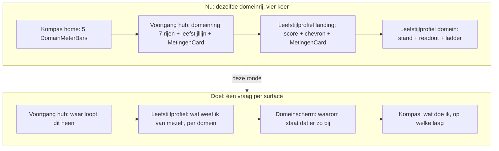

# Opus-prompt — Voortgang, leefstijlprofiel en de domeinen als één reis

> **Gebruik:** kopieer het blok vanaf "OPDRACHT" in een verse Claude Code-sessie (Opus) op branch `main`.
> **Output:** één verdict-document, secties A–K, in `docs/cursors/claude-opus-voortgang-leefstijlprofiel-doorstroom-verdict-2026-08.md`.
> **Datum:** 23 augustus 2026 · besluitronde, geen bouwronde.

## Plaats in de reeks

| Doc | Relatie |
|---|---|
| [`BEWEEG_COCKPIT_FUTURE_YOU.md`](../plan/BEWEEG_COCKPIT_FUTURE_YOU.md) | **BINDEND** — besluit 4 (nooit een tweede/bewegend cijfer naast de engine-score), §7 de afgewezen lijst (streaks, badges, sub-scores per capaciteit) |
| [`PLAN_KOMPAS_VOORTGANG_DOELNARRATIEF.md`](../plan/PLAN_KOMPAS_VOORTGANG_DOELNARRATIEF.md) | **BINDEND** — §2 het drie-anker-narratief (waar je vandaan kwam · nu · waar je naartoe werkt), §4 de randgevallen bij `optimaal` en bij ontbrekende baseline |
| [`PLAN_FUNCTIONELE_CAPACITEIT_PROGNOSE.md`](../plan/PLAN_FUNCTIONELE_CAPACITEIT_PROGNOSE.md) | **BINDEND voor S2** — traject A (programma-kalibratie, laag risico) versus traject B (prognose-copy, evidence-audit vereist); §2 de tabel persoonlijke prognose ✗ / bevolkingsniveau-feit ✓ |
| [`KOMPAS_SIDEBAR_ROADMAP_2026-08.md`](KOMPAS_SIDEBAR_ROADMAP_2026-08.md) | **VAST** — §1 de surface-rollen-tabel (inclusief de rij "Voortgang profiel"), §4 wat niet meer open is, §7 de drie W4-gates. Niet heropenen zonder kop `PIVOT` |
| [`claude-opus-kompas-sidebar-keuzehart-verdict-2026-08.md`](claude-opus-kompas-sidebar-keuzehart-verdict-2026-08.md) | **BINDEND** — lock N6, het *vanwege*-contract, de save-sleutel |
| [`claude-opus-beweging-mijn-dag-verdict-2026-08.md`](claude-opus-beweging-mijn-dag-verdict-2026-08.md) | **BINDEND** — de afvink-KILL's: `daily_action_log` is de enige completion-bron |
| [`PLAN_EIGEN_IJKPUNT_DOEL_PER_DOMEIN.md`](../plan/PLAN_EIGEN_IJKPUNT_DOEL_PER_DOMEIN.md) | Het eigen ijkpunt zoals het nu op de hub staat — de enige persoonlijke lijn die vandaag over tijd loopt |

---

## OPDRACHT

Je beoordeelt één reis, niet één scherm: **Voortgang-hub → Leefstijlprofiel-landing → domeinscherm.** Die drie
schermen staan achter elkaar op dezelfde tab, en ze tonen vandaag grotendeels hetzelfde: vijf tot zeven domeinrijen
met een score, een trend en een pijl naar rechts. Kompas-home doet dat óók, één tab verderop. Dennis' formulering:
*"nu is leefstijlprofiel herhalen van kompas?"*

De vraag van deze ronde is niet of dat zo is — de code laat het zien. De vraag is **wat elk scherm dan wél doet, zodat
de drie elkaar versterken in plaats van elkaar over te doen**, en welke data dat vandaag eerlijk kan dragen.

Drie richtingen liggen op tafel, alle drie van Dennis, alle drie te toetsen en niet vooraf gewonnen:

1. De **hero van Voortgang** wordt herkaderd op het toekomstverhaal dat in de plan-docs al vastligt, in plaats van op
   de dagteller die er nu staat.
2. Het **overzicht** mag per domein laten zien wat je keuze over **4–6 weken** kan doen.
3. De **leefstijlprofiel-landing** wordt vierkanten per domein die de belangrijke punten uit de check-vragenlijst
   tonen — slaap bijvoorbeeld slaapuren, biologische klok, slaapkwaliteit; beweging kracht en conditie — in plaats van
   een score met een chevron.

### De zes stellingen

Op elke stelling luidt je verdict **GO / REFINE / PARKEER**, met bewijs `bestand:regel`. Begin §A met één regel
totaaloordeel. Waar je PARKEER geeft, geef je de toetsbare drempel waarop de stelling terugkomt.

| # | Stelling |
|---|---|
| **S1** | De Voortgang-hero stapt van de bewijs-/dagteller-lezing naar het drie-anker-narratief (waar je vandaan kwam → waar je nu staat → waar dit heen loopt). `VoortgangBewijsband` en `VoortgangRichtingBeat` worden daarop herverdeeld; de hero en de beat mogen niet twee keer hetzelfde zeggen. |
| **S2** | Het overzicht toont per domein een horizon van 4–6 weken: wat de laag die je koos in die periode kán verschuiven. Als bevolkingsniveau-mechanisme plus je eigen ijkpuntlijn — nooit als persoonlijke prognose en nooit als tweede cijfer. |
| **S3** | De leefstijlprofiel-landing wordt één vierkant per domein met 2–4 échte kengetallen uit die domeincheck, in plaats van de huidige rij score + statuszin + chevron. |
| **S4** | Elke surface krijgt één vraag, en de doublures sneuvelen: `MetingenCard` staat vandaag twee keer op dezelfde tab, de leefstijllijn ook, en de domeinrij drie keer in de reis. |
| **S5** | Het domeinscherm is de derde laag die inlost wat het vierkant belooft — readout plus ladder als verklaring — zonder een derde ladderpresentatie naast `PrioriteitenLadder` en `DomainLifestyleLadder`. |
| **S6** | Waar de check niets meet, komt geen vierkant met nep-diepte. Stress, voeding, verbinding, energie en herstel krijgen een eerlijke, expliciet andere vorm dan slaap en beweging. |

### As-built → doel

### De as-built die je meekrijgt — toets hem, corrigeer waar de repo verder is

Geverifieerd tegen `main` op 23 augustus 2026. Waar je afwijkt: meld het, gok niet.

**De reis leeft op één tab.** Voortgang is geen eigen route maar `/dashboard?tab=voortgang`, met sub-schermen via
`screen=` en `fav=` ([`src/lib/dashboard-url.ts`](../../src/lib/dashboard-url.ts)). Legacy `inzichten` en `domein`
canonicaliseren naar `leefstijlprofiel`.

**De doublures, hard.**

| Wat | Waar het staat | En nóg een keer |
|---|---|---|
| `MetingenCard` | [`Dashboard.tsx:605`](../../src/components/dashboard/Dashboard.tsx) in `VitalityScoreSection`, die alleen rendert bij `voortgangScreen === "hub"` (r.576) | [`LeefstijlprofielKeuzeHub.tsx:131`](../../src/components/dashboard/voortgang/LeefstijlprofielKeuzeHub.tsx) |
| `LeefstijllijnSection` | [`VoortgangHubScroll.tsx:113`](../../src/components/dashboard/voortgang/VoortgangHubScroll.tsx), compact op de hub | [`VoortgangOverTijdSection.tsx:53`](../../src/components/dashboard/voortgang/VoortgangOverTijdSection.tsx), volledig in de uitklap eronder |
| De domeinrij (score · sparkline · band · delta) | [`VoortgangDomeinRing.tsx:101-225`](../../src/components/dashboard/voortgang/VoortgangDomeinRing.tsx), 5 interventies + 2 readouts | [`KompasHomeCard.tsx:418`](../../src/components/dashboard/kompas/KompasHomeCard.tsx) `DomainMeterBar`, en [`LeefstijlprofielKeuzeHub.tsx:88-127`](../../src/components/dashboard/voortgang/LeefstijlprofielKeuzeHub.tsx) |

**De leefstijlprofiel-landing is vandaag vier dingen:** een terugknop, de kop *"Wat past bij je check"*, vijf
knop-rijen met een scorebolletje en één statuszin (`"Aanbevolen acties en schap — blauwdruk live"` voor beweging,
`"Leefstijlkeuze volgt — beweging is de blauwdruk"` voor de rest), en `MetingenCard`. Geen enkel getal uit de
domeincheck zelf.

**De hero is een dagteller.** [`VoortgangHero.tsx:21-33,98`](../../src/components/dashboard/voortgang/VoortgangHero.tsx):
eyebrow `BEWIJS · DAG {n}`, vier H1-standen (`beantwoord` / `opbouwend` / `dun` / `wachtend`), copy uit
[`voortgang-bewijs-copy.ts`](../../src/lib/voortgang-bewijs-copy.ts). Het toekomstverhaal staat níét in de hero maar
in [`VoortgangRichtingBeat.tsx:148-160`](../../src/components/dashboard/voortgang/VoortgangRichtingBeat.tsx) —
*"Van waar je begon, naar waar dit heen kan."* — met start/nu/volgend-niveau op één as. Dat is precies §2 van het
doelnarratief-plan, al gebouwd, maar onder de vouw en alleen voor het prioriteitsdomein.

**De kengetallen die S3 nodig heeft, bestaan al berekend.** Ze worden alleen op het check-in-resultaat en in het
domeinscherm gebruikt, niet op de landing:

| Domein | Wat er ligt | Bron |
|---|---|---|
| Slaap | 8 feitenrijen: Slaapduur (uren, benchmark *"Populatierichtlijn: 7+ uur"*), Regelmaat, Avondafbouw, Ochtendlicht, Piekeren voor bed, Inslapen, Doorslapen, Uitgerust wakker | [`sleep-checkin-readout.ts:47-56`](../../src/lib/sleep-checkin-readout.ts) `FACT_ORDER`, gebouwd in `buildSleepFactRows` (r.79) |
| Beweging | 8 feitenrijen: Cardio en intensief samen, Kracht, Zitten, Ervaren conditie, Mobiliteit, Belastbaarheid, Consistentie, Motivatie — met WHO-benchmarks | [`movement-checkin/index.ts:552-574`](../../src/data/movement-checkin/index.ts), gebouwd in [`movement-assessment.ts:655`](../../src/lib/movement-assessment.ts) |
| Voeding | Score 0–100 plus 5 nutriëntbanden (eiwit, omega-3, magnesium, vitamine D, zink) — andere vorm dan feitenrijen | [`nutrition-intake-estimate.ts:97`](../../src/lib/nutrition-intake-estimate.ts) `estimateNutritionIntake` |
| Stress | 2 gescoorde dimensies (`STR_FREQ`, `STR_RCV`); de zeven diep-vragen sturen alleen ladder-routing. `evidenceByLayer` is **leeg** | [`domain-ladder-readout.ts:227-239`](../../src/lib/domain-ladder-readout.ts) |
| Verbinding | Eén intake-vraag `CON_SOC` plus een tag-profiel; geen numerieke check, geen readout | [`domain-ladder-readout.ts:249`](../../src/lib/domain-ladder-readout.ts) geeft `null` |
| Energie · herstel | Readouts zonder eigen check; alleen een score op de leefstijllijn | [`domain-role.ts:20`](../../src/lib/domain-role.ts) `READOUT_DRIVERS` |

**Een biologische klok als kengetal bestaat niet.** `morninglight` (Ochtendlicht) en `SLP_CONS` (Regelmaat) zijn de
circadiane proxies, plus `LIF_SUN` uit de intake. Als S3 "biologische klok" op een vierkant wil zetten, moet je
zeggen uit welke velden die regel wordt samengesteld en welk woord er dan staat — of dat het niet kan.

**Voor S2 is er geen engine.** Er staat nergens in `src/` een effectgrootte per actie of per laag, geen projectie,
geen verwachte verbetering. Wat er wel is: `cycleEvidence` met een cyclus van 30 dagen
([`voortgang-bewijsband.ts:4`](../../src/lib/voortgang-bewijsband.ts) `CYCLE_LENGTH = 30`), een domeincheck-interval
van 14 dagen ([`kompas-domain-check.ts:9`](../../src/lib/kompas-domain-check.ts)), het eigen ijkpunt met een reeks
scores per domein, en `getNextVitalityBand`
([`vitality-gauge.ts:78`](../../src/lib/vitality-gauge.ts)) die op elke 0–100-score werkt. "4–6 weken" komt uit geen
van die ritmes. Los dat op of wijs het af.

### Leeslijst — verplicht, citeer `pad:regel`

**Besluiten (lock):**
- `docs/plan/BEWEEG_COCKPIT_FUTURE_YOU.md` — §2.1, §2.4, §2.6, §3 (de verzin-strip), §7
- `docs/plan/PLAN_KOMPAS_VOORTGANG_DOELNARRATIEF.md` — hele doc
- `docs/plan/PLAN_FUNCTIONELE_CAPACITEIT_PROGNOSE.md` — §1, §2, §3
- `docs/cursors/KOMPAS_SIDEBAR_ROADMAP_2026-08.md` — §1, §4, §7
- `docs/core/WRITING_VOICE.md` + `docs/core/DOMAIN_MODEL.md` §5.1

**Code — de reis:**
- `src/components/dashboard/VoortgangHub.tsx` — de screen-router
- `src/components/dashboard/voortgang/VoortgangHubScroll.tsx` — de volgorde van de hub
- `src/components/dashboard/voortgang/VoortgangHero.tsx` + `src/lib/voortgang-bewijs-copy.ts` + `src/lib/voortgang-bewijsband.ts`
- `src/components/dashboard/voortgang/VoortgangRichtingBeat.tsx` — het narratief dat er al is
- `src/components/dashboard/voortgang/VoortgangDomeinRing.tsx`
- `src/components/dashboard/voortgang/LeefstijlprofielKeuzeHub.tsx` — het scherm dat S3 vervangt
- `src/components/dashboard/voortgang/LeefstijlprofielDomeinScherm.tsx` — `Je stand` (r.333), coverage + compacte ladder (r.372-379), `PrioriteitenLadder` (r.482), route-strip (r.512), schap-link (r.542), `choice.shelf_opened` (r.307)
- `src/components/dashboard/MetingenCard.tsx` + `src/components/dashboard/LeefstijllijnSection.tsx` + `src/lib/leefstijllijn.ts:67`
- `src/components/dashboard/Dashboard.tsx:510-608` (`VitalityScoreSection`) en r.2899-2921 (wat de hub aan extra's meekrijgt)
- `src/components/dashboard/kompas/KompasHomeCard.tsx:418` — de rij waarmee je moet vergelijken

**Code — de meetwaarden:**
- `src/lib/sleep-checkin-readout.ts` · `src/lib/movement-assessment.ts` · `src/lib/nutrition-intake-estimate.ts` · `src/lib/stress-assessment.ts`
- `src/lib/domain-ladder-readout.ts` — wie een readout heeft en wie `null` levert
- `src/lib/domain-role.ts` · `src/lib/context-rail.ts:46` (`KOMPAS_RAIL_PILLAR_IDS`) · `src/data/dashboard/index.ts` (`PILLARS`)
- `src/lib/domain-goal.ts` + `src/lib/domain-goal-client.ts` — het eigen ijkpunt over tijd
- `src/lib/vitality-gauge.ts:63,78` · `src/lib/score-bands.ts:25`
- `src/lib/kompas-domain-check.ts:9` · `src/lib/account-dashboard.ts` (hoe `cycleEvidence`, `domainCheckDaysAgo` en `remeasure` gevuld worden)

**Meetpad:** `src/lib/events.ts` · `src/lib/account-events-client.ts` · `src/app/api/account/events/route.ts` (account-scoped) en `src/lib/intake-events-client.ts` · `src/app/api/intake/events/route.ts` (intake).

### Gevraagde output — secties A–K

| Sectie | Inhoud |
|---|---|
| **A** | Verdict S1–S6: per stelling GO / REFINE / PARKEER met bewijs `bestand:regel`. Eén regel totaaloordeel bovenaan |
| **B** | Surface-contract: tabel met per surface (Kompas home · Kompas domein · Voortgang hub · Leefstijlprofiel landing · Leefstijlprofiel domein) **de ene vraag** × wat er blijft × wat eraf gaat × waar het naartoe verhuist. Sluit aan op de rollen-tabel in roadmap §1; als je daarvan afwijkt, kop `PIVOT` |
| **C** | Hero-herkadering: welke van de vier bewijs-standen overleven, welke copy de drie ankers draagt, en wat er met `VoortgangBewijsband` gebeurt. Expliciet: wat zegt de hero, wat zegt `VoortgangRichtingBeat`, en waarom is dat geen herhaling. Lever de copy per staat, inclusief de lege staat |
| **D** | Horizon-contract 4–6 weken. Kies de claim-klasse en verdedig hem tegen `PLAN_FUNCTIONELE_CAPACITEIT_PROGNOSE.md` §2. Lever: (1) welk ritme "4–6 weken" mag heten gegeven cyclus 30 en domeincheck 14, (2) per domein welke bron de regel draagt, (3) een ✗/✓-tabel met minstens vijf verboden en vijf toegestane formuleringen, (4) wat de regel doet als er nog geen tweede meting is. Als je concludeert dat dit vandaag niet eerlijk kan: zeg dat, en geef de kleinste versie die wél kan |
| **E** | Tegelcontract per domein (dit is de kern van S3). Tabel: domein × 2–4 kengetallen × exact veld × NL-label × bron `pad:regel` × wat er staat als de waarde ontbreekt. Geef per domein ook de **anatomie** van het vierkant: welke van de vier is de kop-waarde, wat is de benchmark-regel, en wat is de klik. Voor stress, voeding, verbinding, energie en herstel: de eerlijke andere vorm, of geen vierkant |
| **F** | Doublure-sanering: wat verdwijnt waar, met de migratiebestemming per stuk (`MetingenCard` ×2, `LeefstijllijnSection` ×2, de domeinrij ×3). Benoem per verwijdering wat de gebruiker dan kwijt is en waar hij het terugvindt |
| **G** | Domeinscherm-contract: wat het scherm moet toevoegen bovenop het vierkant, en hoe de twee ladderpresentaties (`DomainLifestyleLadder` compact op r.379 en `PrioriteitenLadder` op r.482) zich verhouden. Eén blijft, of allebei met een verschillende rol die je in één zin kunt uitleggen |
| **H** | 375px. Vier vierkanten in een 2×2-grid versus een lijst: kies, en verdedig met wat er op de eerste viewport past. De doelgroep zit op mobiel; een vierkant dat op 375px drie regels ellipsis wordt, is geen vierkant |
| **I** | Meetpunten. Per voorstel: hergebruikt event of nieuw event, en bij nieuw het volledige registratiepad. Sluit elk voorstel af met "Meetpunt: `<event>` — hier lees je het effect af" |
| **J** | Slice-volgorde, maximaal vijf. Per slice: wat erin zit, wat niet, en waaraan je afleest dat hij geslaagd is. Slaap of beweging eerst — kies, en zeg waarom die en niet de andere |
| **K** | Tegenspraak: minstens drie argumenten tégen deze richting. Verplicht daarin: het argument dat de doublure geen bug is maar een navigatie-affordance, en het argument dat vierkanten met kengetallen de landing zwaarder maken dan de scan die hij nu is. Per argument een toetsbare drempel waarop Dennis ongelijk heeft. Sluit af met je eigen aanbeveling |

### Harde constraints

- **Geen code, geen diffs, geen SQL, geen JSX.** Proza, tabellen, `pad:regel`.
- **Geen tweede score.** Geen bewegend cijfer, geen prognosegetal, geen sub-score per capaciteit naast de engine-score
  (`BEWEEG_COCKPIT_FUTURE_YOU.md` besluit 4 en §7). Een kengetal uit de check tonen is géén tweede score — het is het
  antwoord dat de gebruiker zelf gaf; maak dat onderscheid expliciet in §E, anders leest §E als een overtreding.
- **Geen persoonlijke medische of functionele prognose.** Bevolkingsniveau-mechanisme plus eigen ijkpunt, of niets.
  Adviezen, geen diagnoses.
- **Geen oordeelstaal en geen biologische leeftijd** — de harde grens uit het doelnarratief-plan §4.
- **Geen streaks, badges of gamification.**
- **Afvinken blijft op Mijn Dag.** Niet op Voortgang, niet op het leefstijlprofiel, niet op Kompas.
- **`account_favorites` blijft de opslag**, `laag-<domein>-p<n>-<slug>` blijft de sleutel, lock N6 blijft staan.
- **Geen semantische overlading van bestaande events.** Nieuwe betekenis = nieuw event, geen extra waarde op een
  bestaande parameter. Een nieuw meetpunt hoort in dezelfde slice als de knop die het meet.
- **Roadmap §1/§4/§7 en de afvink-KILL's niet heropenen** zonder kop `PIVOT` mét schade-analyse.
- **Elke aanname die je niet in code of docs kunt verifiëren: markeer als AANNAME.** Niet als feit presenteren.
- Nederlandse copy, Engelse identifiers. Geen affiliate-links in het dashboard.

### Acceptatiecriterium

- [ ] A: alle zes stellingen met GO/REFINE/PARKEER én bewijs, plus één regel totaaloordeel
- [ ] B: vijf surfaces, elk met precies één vraag, en per surface wat eraf gaat
- [ ] C: hero-copy per staat, en één zin die uitlegt waarom hero en richting-beat niet hetzelfde zeggen
- [ ] D: een gekozen claim-klasse, het ritme-antwoord op "waarom 4–6 weken", en minstens vijf ✗ naast vijf ✓
- [ ] E: per domein de exacte velden met `pad:regel`, inclusief een eerlijke lege plek voor stress, voeding en verbinding, en een expliciet antwoord op "biologische klok: uit welke velden, of niet"
- [ ] F: elke doublure heeft een bestemming, geen enkele verdwijnt zonder vervanging
- [ ] H: één gekozen 375px-vorm, verdedigd op de eerste viewport
- [ ] J: maximaal vijf slices, met een gekozen eerste domein
- [ ] K: minstens drie tegenargumenten, inclusief de twee verplichte, elk met drempel
- [ ] Geen regel code in het antwoord

**Meetpunt van dit document:** geen product-events — besluitstuk. Effect af te lezen aan het aantal PARKEER-items in
§A en aan de tijd tot slice 1 start.
