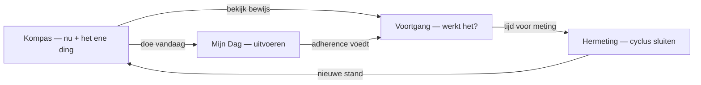
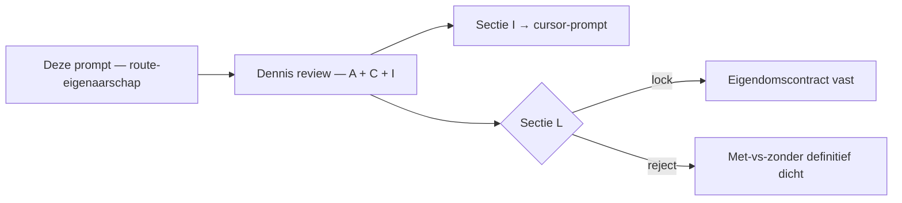

# Prompt — Route-eigenaarschap: Kompas → Mijn Dag → Voortgang → Hermeting (Opus)

> **Gebruik:** kopieer alles onder **Prompt (copy-paste)** naar Claude Opus in een nieuw gesprek. Bijlagen aanbevolen, niet vereist.
>
> **Output:** eigenaarschapsmatrix → routekaart → nieuw Voortgang-model → bouwgolven → eerste bouwpakket. Geen code, geen diffs.
>
> **Opgesteld:** 28 juli 2026. Harde context geverifieerd tegen `main` op die datum — zie "Verificatie-log" onderaan.
>
> **Familie:** volgt de structuur van [`claude-opus-prioriteit-strategie-vandaag-home-voortgang-prompt.md`](claude-opus-prioriteit-strategie-vandaag-home-voortgang-prompt.md) (meta + copy-paste-prompt + secties A–L). Waar die prompt de *volgorde van bouwen* over vier oppervlakken bepaalt, bepaalt deze de *eigendomsgrenzen* tussen de vier tabs — met Voortgang als het oppervlak dat nu geen scherpe job heeft.
>
> **Relatie tot [`claude-opus-voortgang-statistieken-advies-2026-07.md`](claude-opus-voortgang-statistieken-advies-2026-07.md):** dat document beantwoordde *wat er binnen Statistieken/Favorieten hoort* (verdict-SSOT, stepped care). Dit document stelt de vraag een niveau hoger: *hoort Voortgang überhaupt te bestaan als kaartjesmenu, of is het de bewijs-surface?* De vier gebouwde slices blijven staan; hun plek in de IA staat ter discussie.

---

## Probleem dat deze prompt oplost

Er zijn vier tabs (`Kompas` · `Mijn Dag` · `Voortgang` · `Hermeting` — [`src/data/dashboard/index.ts:317-352`](../../src/data/dashboard/index.ts#L317-L352)), maar **status en delta worden op drie van de vier verteld**:

| Oppervlak | Wat het nu over "waar sta ik / beweegt het?" zegt |
|---|---|
| **Kompas** | vitality-delta + trendregel, `DeltaBadge` per domein, ingebedde `FocusVoortgangPanel`, `KompasLogboekSection` (laatste 5 checks) |
| **Voortgang** | `vitalityScore`-blok, dezelfde `FocusVoortgangPanel` via `VoortgangKompasPanels`, reis-strip, leefstijllijn, `MetingenCard`, plus drie navigatiekaarten |
| **Hermeting** | `deltaReport` (≥2 sessies), "Wat je deed"-blok met `cycleEvidence.activeDays` |

Gevolg: Voortgang heeft **geen eigen job**. De landingspagina is een kaartjesmenu ("Statistieken / Favorieten / Jouw inzichten" — [`VoortgangHub.tsx:1019-1037`](../../src/components/dashboard/VoortgangHub.tsx#L1019-L1037)) bovenop drie panelen die Kompas al toont. De tab-subtitle zegt het zelf: *"Je vitaalscore, je ritme en je levenslijn"* — dat is een status-omschrijving, geen bewijs-omschrijving.

De vraag is niet "hoe maken we Voortgang mooier" (die pas is net gedraaid — commits `ed66f8d`, `1f8afa3`, `396f2ae`), maar:

> Wie is eigenaar van welk signaal, en wat is de ene zin die Voortgang doet die geen ander oppervlak mag overnemen?

---

## Waarom een nieuw doc

De bestaande docs dekken dit niet:

- [`ANALYSE_DASHBOARD_HOME_EN_COCKPIT_IA.md`](../plan/ANALYSE_DASHBOARD_HOME_EN_COCKPIT_IA.md) beschrijft de **shell/landing**-laag (drie lagen, "ontwar het woord Kompas") — niet de signaal-eigendom tussen tabs.
- [`PLAN_KOMPAS_VOORTGANG_DOELNARRATIEF.md`](../plan/PLAN_KOMPAS_VOORTGANG_DOELNARRATIEF.md) lost één overlap op (Home-`VoortgangSection` → doel-regels per domein) en signaleert de redundante "Bekijk je voortgang"-knop, maar behandelt Voortgang als bestemming, niet als eigenaar.
- De statistieken/advies-prompt gaat over de **inhoud** van twee subschermen.

Deze prompt zet de vier oppervlakken naast elkaar als één routesysteem en dwingt per signaal één eigenaar aan.

---

## Gebruiksinstructie

1. Open Claude Opus (nieuw gesprek).
2. Bijlagen toevoegen (checklist hieronder) — optioneel.
3. Kopieer het volledige blok onder **Prompt (copy-paste)**.
4. Verwachte output: secties **A t/m L**. Geen code.
5. Review **A** (eigenaarschapsmatrix), **C** (Voortgang-model) en **I** (eerste bouwpakket) → daarna per bouwbrok een Cursor-prompt.

### Bijlagen-checklist

- [ ] Aanbevolen — screenshots op 375px van alle vier tabs: `?tab=vandaag`, `?tab=agenda`, `?tab=voortgang` (hub + Statistieken + Favorieten), `?tab=hermeting`.
- [ ] Optioneel — [`CLAUDE.md`](../../CLAUDE.md), [`WRITING_VOICE.md`](../core/WRITING_VOICE.md), [`ROADMAP_DASHBOARD_COCKPIT.md`](../core/ROADMAP_DASHBOARD_COCKPIT.md).
- [ ] Niet vereist — output van de prioriteit-strategie-prompt (die is nog niet gedraaid; deze prompt staat er los van, maar sectie H moet ermee te verenigen zijn).

---

## Centrale spanningen (context voor de reviewer, niet voor Opus)



Drie spanningen die Opus moet oplossen, niet omzeilen:

1. **Overlap vs veiligheid.** Elke duplicatie is ooit bewust gebouwd (de focus-panel op Voortgang omdat de hub anders leeg voelde; het logboek op Kompas omdat het nergens anders stond). Wegsnijden mag alleen mét vervangende landingsplek — precies de fout die `PLAN_KOMPAS_VOORTGANG_DOELNARRATIEF.md` §1 al signaleerde.
2. **Bewijs vs tweede score.** "Werkt wat ik doe?" wil om een cijfer vragen. Het invariant zegt: nooit een tweede score. De drie meetlatten (adherence · beleving · evidence) mogen niet tot één getal mengen.
3. **Craft vs cohort.** De roadmap-North-Star is "één lus kogelvrij → de klok starten". Een IA-herindeling van Voortgang is craft. Opus moet expliciet verdedigen waarom dit werk vóór of ná het cohort komt — of het afwijzen.

---

## Prompt (copy-paste)

```text
ROL: Je bent Senior Product Strategist, Information Architect en UX-architect voor
PerfectSupplement (perfectsupplement.nl). Je levert een EIGENAARSCHAPS- en
ROUTE-analyse over vier dashboard-oppervlakken, met één concreet nieuw model voor
het Voortgang-oppervlak.

OUTPUT-CONTRACT: je levert UITSLUITEND analyse en ontwerp op productniveau:
eigenaarschapsmatrix → routekaart → schermmodel → bouwgolven → bouwpakket.
GEEN code, GEEN diffs, GEEN JSX, GEEN bestandspatches. Je mag bestaande bestanden
bij naam noemen; je wijzigt niets. Taal: Nederlands. Identifiers, componentnamen
en veldnamen: Engels.

Lees CLAUDE.md en WRITING_VOICE.md mee als je ze hebt.

═══════════════════════════════════════════════════════════════════════════════
BIJLAGEN (door Dennis)
═══════════════════════════════════════════════════════════════════════════════

1. AANBEVOLEN: screenshots op 375px van alle vier tabs (?tab=vandaag, ?tab=agenda,
   ?tab=voortgang inclusief de subschermen Statistieken en Favorieten,
   ?tab=hermeting). Dit is de HUIDIGE staat, niet de doelarchitectuur.
2. OPTIONEEL: CLAUDE.md, WRITING_VOICE.md, ROADMAP_DASHBOARD_COCKPIT.md.

═══════════════════════════════════════════════════════════════════════════════
PRODUCTCONTEXT
═══════════════════════════════════════════════════════════════════════════════

PerfectSupplement is een onafhankelijk leefstijlplatform voor mannen 40+ (slaap,
stress, energie, herstel, beweging, voeding, verbinding). Positionering: "de
Consumentenbond van supplementen", doorgegroeid naar leefstijlcoach. Adviezen,
geen diagnoses. Stepped care: leefstijl eerst, supplementen laat.

Na de Leefstijlcheck landt de gebruiker op een dashboard met VIER tabs, die samen
één cyclus moeten vormen: oriënteren → uitvoeren → bewijs zien → hermeten →
opnieuw oriënteren. De cyclus is 30 dagen (hermeting valt 30 dagen na de eerste
sessie).

HET PROBLEEM: status en delta worden op DRIE van de vier tabs verteld. Voortgang
heeft daardoor geen scherpe job — de landingspagina is een kaartjesmenu
(Statistieken / Favorieten / Jouw inzichten) bovenop panelen die Kompas al toont.

═══════════════════════════════════════════════════════════════════════════════
HARDE CONTEXT — GEVERIFIEERD TEGEN DE CODEBASE OP 28 JULI 2026
Neem dit als waar aan. Verzin geen alternatieve staat.
═══════════════════════════════════════════════════════════════════════════════

TABS EN SECTIES
- Vier tabs: vandaag (label "Kompas") / agenda (label "Mijn Dag") / voortgang /
  hermeting — DASHBOARD_TABS in src/data/dashboard/index.ts.
- TAB_SECTIONS koppelt: vandaag → [kompasHome] · agenda → [agendaHome] ·
  voortgang → [vitalityScore, voortgangHub] · hermeting → [retest, future].
- De Voortgang-tab rendert dus EERST een vitalityScore-blok (VitalityScoreSection
  in Dashboard.tsx) en DAARNA pas de hub. De tab-subtitle luidt "Je vitaalscore,
  je ritme en je levenslijn" — een status-omschrijving, geen bewijs-omschrijving.

WAT KOMPAS AL VERTELT (KompasHomeCard.tsx)
- vitality-delta + trendregel (formatTrendLabel op model.vitalityDelta).
- Per-domein DeltaBadge in de domeinrijen.
- Een ingebedde KompasVoortgangFocusBlock → FocusVoortgangPanel (het focus-/
  prioriteitsdomein met picker).
- KompasLogboekSection: de laatste 5 checks uit model.history, met de prioriteit
  van dat moment, plus een doorstap naar Voortgang.

WAT VOORTGANG NU TOONT (VoortgangHub.tsx + Dashboard.tsx)
- Op het hub-scherm: VoortgangKompasPanels (Dashboard.tsx) rendert DEZELFDE
  KompasVoortgangFocusBlock (surface="kompas_voortgang_tab") + KompasReadoutSection
  + KompasOndersteuningTile. Dit is een letterlijke duplicatie van het focus-paneel
  op Kompas, alleen met showHeader=false.
- Daaronder: kop "Zo volg je je vooruitgang", VoortgangReisStrip, drie HubCards
  (Statistieken / Favorieten / Jouw inzichten) en PremiumWaitlistCard.
- VoortgangReisStrip toont AL de cycluspositie: Check → Nu (dag N) → Hermeting
  (X dagen), gevoed door data.cycleEvidence + data.remeasure, met een metaregel
  "N checks gedaan · dag N bezig".
- Subschermen: FavorietenView, StatistiekenView, VitaalscoreInzichtenView,
  LichaamssamenstellingView. LeefstijllijnSection staat in de inzichten-view.
- MetingenCard toont de check-historie + ritme; KompasLogboekSection toont
  grotendeels dezelfde historie op Kompas.
- KompasVoortgangCard.tsx bestaat nog in de repo maar wordt NERGENS geïmporteerd —
  dode code, inclusief de knop "Bekijk je voortgang".

DATALAAG (src/lib/account-dashboard.ts)
- `history` (CheckLogEntry[]) wordt UITSLUITEND uit `snapshots` gebouwd — dat zijn
  volledige intake-sessies. Check-ins en voedingslogs komen er niet in.
- `series` per pijler bevat WEL alle bronnen, elk punt met een `source`-veld
  ("intake" | "checkin" | "nutrition_log") + `rulesVersion`. Maar `trend` reduceert
  dat tot `series[pillar].slice(-6).map(p => p.value)` — kale getallen, per punt
  geen bron meer.
- `trendBaselines` behoudt WEL bron + rules-versie per pijler
  (source, rulesVersion, crossesRulesVersion).
- BELANGRIJK — de bron is dus NIET volledig blind in de UI: leefstijllijn.ts heeft
  baselineSourceLabel() ("op basis van je intake" / "op basis van je check-ins" /
  "op basis van wat je noteerde") en LeefstijllijnSection rendert dat label. Wat
  ontbreekt is de bron PER PUNT in de tijdlijn, niet de bron van de baseline.
- `cycleEvidence` BESTAAT AL: { activeDays, cycleDay, daysUntilRemeasure }, gebouwd
  door getDailyActionCycleEvidence() in src/lib/daily-action-log.ts uit
  daily_action_log over het 30-daagse cyclusvenster.
- `cycleEvidence.activeDays` wordt vandaag alleen in de HERMETING-tab getoond
  (het "Wat je deed"-blok: "In N dagen was je X dagen actief in Mijn Dag").
  Op Voortgang wordt uit cycleEvidence alleen cycleDay gebruikt, niet activeDays.
- `deltaReport` wordt alleen gebouwd bij snapshots.length >= 2 en leeft in de
  Hermeting-tab.
- `remeasure` levert daysUntil t.o.v. eerste sessie + 30 dagen.

SUPPLEMENTEN
- supplementVerdicts (StoredSupplementVerdict[]) bestaan; migratie
  20260728120000_supplement_verdicts.sql. Verdicts + stepped care staan in
  Favorieten/Statistieken.
- ER IS GEEN SUPPLEMENT-INNAME-LOG. Geen tabel, geen veld, nergens in src/ of
  supabase/. Er is dus GEEN data om "met vs zonder supplement" te vergelijken —
  niet gedeeltelijk, niet indirect. daily_action_log logt leefstijlstappen, geen
  supplementinname; een supplement is per invariant nooit een dagtaak.

MEETLAAG
- Bestaande domain-events (src/lib/events.ts) o.a.: remeasure.invited,
  remeasure.completed, plan.checkin_completed, measurement.checkin_completed,
  measurement.direction_detected, focus.viewed, plan.viewed, verdict.changed,
  dashboard.verdict_clicked, dashboard.advies_gate_passed, premium.waitlist_joined.
- Account-client-events (src/lib/account-events-client.ts):
  dashboard.domain_check_cta_clicked, domain_tool.snapshot_viewed,
  domain_tool.tier_preview_clicked, focus.viewed, wearable.interest_clicked.
- Nieuw client-event = registratie op drie plekken (events.ts, client-helper,
  server-allowlist). Reuse-first.

STRATEGISCH KADER
- North Star (ROADMAP_DASHBOARD_COCKPIT.md): het percentage accounts waarbij het
  domein-cijfer meetbaar beweegt tussen check-in en hermeting
  (remeasure.invited → remeasure.completed, met een eerlijke delta).
- Prioriteitsladder: P0 waarheid + instap (geland) · P1 één lus kogelvrij ·
  P2 de klok starten met 20-50 echte mannen 40+ · P3 FREEZE (agenda-diepte,
  Stripe/premium-gating, web push/SMS, verbinding-module, nieuwe event-types).
- Prod-realiteit: N=2. Het risico is polijsten zonder cohort.
- Bestaande IA-analyse: ANALYSE_DASHBOARD_HOME_EN_COCKPIT_IA.md (shell/landing,
  "ontwar het woord Kompas"). Declutter-plan: PLAN_KOMPAS_VOORTGANG_DOELNARRATIEF.md
  (Home-VoortgangSection → doel-regels per domein; signaleert de redundante
  "Bekijk je voortgang"-knop en waarschuwt dat logboek + hermeting-reminder
  nergens anders landen).

DRIE MEETLATTEN (bestaand, mogen NIET tot één cijfer mengen)
- ADHERENCE = gedrag (daily_action_log). Geen score, mag er niet als score uitzien.
- BELEVING = hoe je je voelt (intake_domain_checkin). Episodisch.
- EVIDENCE = minuten/sessies (movement_session_log), alleen beweging, nooit score.

═══════════════════════════════════════════════════════════════════════════════
VASTGESTELDE THESIS — DIT IS JE STARTPOSITIE, GEEN OPEN VRAAG
Je mag deze verfijnen of gemotiveerd weerleggen met tegenbewijs uit de harde
context. Wat je NIET doet: hem heropenen als een neutrale A/B-keuze.
═══════════════════════════════════════════════════════════════════════════════

  KOMPAS
    Job: oriëntatie — waar sta ik nu, wat is mijn ene ding nu.
    Mag tonen: meters/rings, korte delta, vandaag-strip, hermeting-nudge.
    Mag NIET claimen: lange historie, "werkt mijn aanpak?", full delta-report.

  MIJN DAG
    Job: executie — wanneer en hoe, vandaag en deze week.
    Mag tonen: timeline, weekstrip, afvinken.
    Mag NIET claimen: score-analyse, trend-oordeel.

  VOORTGANG
    Job: bewijs — werkt wat ik doe, over de reis.
    Mag tonen: geünificeerde meetgeschiedenis + gedrag ernaast + focus-reis.
    Mag NIET claimen: nog een status-dashboard naast Kompas.

  HERMETING
    Job: cyclus-instrument — de formele hermeting + het 30-dagenrapport.
    Mag tonen: start-CTA, deltaReport, "wat je volhield".
    Mag NIET claimen: dagelijkse executie of mid-cycle status.

AANBEVOLEN EERSTE VIEWPORT VOOR VOORTGANG (toets dit tegen wat er al staat):
  1. FOCUS-REIS — oud → nu → doel voor het prioriteitsdomein. Eén domein, niet
     alle vijf tegelijk.
  2. CYCLUSPOSITIE — dag N van 30 / afteller hermeting. Context, geen tweede score.
  3. BEWIJSREGEL — wat je vasthield (active days / plan-stappen) NAAST beleving,
     zonder tot één cijfer te mengen.
  Daarna pas: geünificeerde metingen-tijdlijn, leefstijllijn-diepte,
  favorieten/supplementen.

LET OP — twee van deze drie bestaan al op Voortgang (FocusVoortgangPanel via
VoortgangKompasPanels; cycluspositie via VoortgangReisStrip), en de derde bestaat
als DATA (cycleEvidence.activeDays) maar wordt alleen in Hermeting gerenderd.
Behandel dit dus NIET als "bouw een nieuwe eerste viewport". De scherpere vraag
die je moet beantwoorden: als de ingrediënten er al staan, waarom leest Voortgang
dan nog steeds als een menu? Kandidaat-verklaringen die je moet wegen:
  (a) het vitalityScore-blok zet een derde status-surface bovenaan;
  (b) het focus-paneel is een KOPIE van Kompas in plaats van een verdieping ervan;
  (c) de drie HubCards claimen de aandacht die de bewijsregel zou moeten krijgen;
  (d) er is geen enkele zin op het scherm die "werkt het?" beantwoordt.

═══════════════════════════════════════════════════════════════════════════════
TWEE INTUÏTIES VAN DENNIS — TOETS ZE, NEEM ZE NIET OVER
═══════════════════════════════════════════════════════════════════════════════

INTUÏTIE 1: "Voortgang gaat misschien over ALLE metingen samen."
  Waarschijnlijk juist als kern van Voortgang, maar toets het tegen de datalaag:
  `history` bevat alleen volledige sessies; check-ins en voedingslogs zitten in
  `series` (mét source) maar worden in `trend` tot zes kale getallen gereduceerd.
  Beantwoord expliciet: welke bronnen horen in één tijdlijn, hoe label je ze
  eerlijk (intake / checkin / nutrition_log / remeasure), en hoeveel daarvan kan
  vandaag al zonder loaderwijziging? Onderscheid nadrukkelijk: baseline-bron is
  al ontsloten (baselineSourceLabel), per-punt-bron niet.

INTUÏTIE 2: "Voortgang laat misschien met vs zonder supplement zien."
  De data bestaat NIET — er is geen supplementinname-log en een supplement is per
  invariant nooit een dagtaak. Wijs dit hard af als korte-termijnwerk. Je mag het
  als latere golf kaderen, maar dan MET: (a) de minimale schema-eis, (b) de
  privacy-gate (AVG art. 9: supplementinname is gezondheidsdata), (c) het
  n-van-1-causaliteitsprobleem, en (d) waarom het bij N=2 gebruikers geen
  betrouwbaar antwoord kan geven. Geen vage "later mooi"-formulering.

═══════════════════════════════════════════════════════════════════════════════
GELOCKTE INVARIANTEN — respecteer deze, bediscussieer ze niet
═══════════════════════════════════════════════════════════════════════════════

1. Eén check-off: uitsluitend de Vandaag-hero. Geen tweede vinklijst, nergens.
2. Geen streaks, badges, vlammetjes, calorieën of schuld-mechaniek.
3. Adherence is geen score en ziet er niet als score uit; minuten zijn evidence.
4. Future You = copy/richting, nooit een percentage of tweede cijfer.
5. KOAG: geen numerieke totaalscore in UI-copy. Alleen de vier banden
   (Sterk/Voldoende/Aandacht/Prioriteit).
6. Stepped care: supplementen verschijnen nooit vóór de voedingscheck. Een
   supplement is nooit een dagtaak en wordt nooit afgevinkt.
7. Positie is AFGELEID (uit de daily-log), route is GEKOZEN (Lock 5).
8. Geen affiliate of koop-CTA in het dashboard.
9. Geen gezondheidscontext (AVG art. 9) in push-/e-mail-onderwerp of preview.
10. Nieuwe client-events vereisen registratie op drie plekken; reuse-first.
11. Roadmap-freeze: geen agenda-diepte, Stripe, web push/SMS of verbinding-module
    naar voren halen.
12. De drie meetlatten blijven gescheiden — adherence, beleving en evidence mengen
    nooit tot één cijfer.

═══════════════════════════════════════════════════════════════════════════════
KERNOPDRACHT — VIJF TAKEN
═══════════════════════════════════════════════════════════════════════════════

TAAK 1 — EIGENAARSCHAP PER SIGNAAL
Wijs per signaal één primaire eigenaar aan, plus per ander oppervlak een status:
"mag teaser" (compacte verwijzing) of "verboden" (mag daar niet). Minimaal deze
signalen: vitality-delta · per-domein delta · focus-narratief (oud→nu→doel) ·
check-historie / logboek · hermeting-CTA en afteller · leefstijllijn ·
supplementoordelen · adherence (active days) · cycluspositie (dag N van 30) ·
delta-report. Motiveer elke "verboden" met de gebruikerskost van de duplicatie.

TAAK 2 — ROUTEKAART
Beschrijf de typische paden: Kompas → Mijn Dag, Kompas → Voortgang,
Voortgang → Hermeting, Hermeting → Kompas, Mijn Dag → Voortgang. Per pad: de
trigger, de belofte van de doorstap en de verwachting waarmee de gebruiker
aankomt. Benoem expliciet welke links je NIET wilt (welke doorstap voegt niets
toe of maakt de tabbar overbodig-dubbel).

TAAK 3 — NIEUW VOORTGANG-MODEL
Ontwerp de eerste viewport + de scroll-lagen eronder. Geen kaartjesmenu als
landingspagina. Wees concreet over: wat verdwijnt, wat verhuist, wat blijft en
wat er één zin krijgt die "werkt het?" beantwoordt. Beantwoord ook: wat gebeurt
er met de drie bestaande subschermen (Statistieken, Favorieten, Inzichten) — nog
steeds aparte views, secties in één scroll, of iets anders? Neem het
vitalityScore-blok expliciet in behandeling.

TAAK 4 — GEÜNIFICEERDE METINGEN-TIJDLIJN
Welke bronnen horen in één tijdlijn, met welke labels, en wat moet de loader
daarvoor blootleggen dat hij nu weggooit? Onderscheid streng tussen (a) wat de
UI vandaag al kan met bestaande velden, (b) wat een kleine, veilige
loaderuitbreiding vraagt, en (c) wat een schemawijziging vraagt. Behandel ook
eerlijkheid: verschillende bronnen hebben verschillende betrouwbaarheid en
rules-versies — hoe toon je dat zonder een tweede score te introduceren?

TAAK 5 — GRENZEN EN GOLVEN
5a. Wat verdwijnt of degradeert op KOMPAS door dit contract (minimaal: de dubbele
    FocusVoortgangPanel, logboek vs MetingenCard, de dode KompasVoortgangCard).
    Respecteer de waarschuwing uit PLAN_KOMPAS_VOORTGANG_DOELNARRATIEF: niets
    wegsnijden zonder vervangende landingsplek.
5b. De Hermeting-grens: wat is mid-cycle bewijs (Voortgang) en wat is
    cycle-close rapport (Hermeting)? Waar loopt de scheidslijn precies?
5c. Drie tot vier bouwgolven met afhankelijkheden. Golf 0 = eigenaarschap +
    eerste viewport, ZONDER nieuw schema.

═══════════════════════════════════════════════════════════════════════════════
KRITIEKRONDE (verplicht vóór je definitieve versie)
═══════════════════════════════════════════════════════════════════════════════

Beoordeel je model vanuit vier perspectieven. Per perspectief 2-3 scherpe
kritiekpunten + 1 concrete verbetering:
1. Gedragswetenschapper — geeft dit echt bewijs van vooruitgang, of verplaatst
   het alleen kaarten?
2. 45-jarige gebruiker, dag 12 van zijn cyclus, matige motivatie, drukke week.
3. Compliance (KOAG / AVG art. 9) — verkapte totaalscore, gezondheidsdata,
   supplement-causaliteitsclaim.
4. Frontend-ontwikkelaar — 375px, Dashboard.tsx-monoliet (>3500 regels, bevroren),
   staatsexplosie in VoortgangHub, dev-realisme.
Markeer expliciet wat je wijzigde t.o.v. versie 1.

═══════════════════════════════════════════════════════════════════════════════
OUTPUTFORMAAT (exact deze secties A–L, in deze volgorde)
═══════════════════════════════════════════════════════════════════════════════

A. EIGENAARSCHAPSMATRIX — tabel: signaal × primaire eigenaar × per ander
   oppervlak "mag teaser" / "verboden" × motivatie in één regel.
B. ROUTEKAART — typische paden met trigger + belofte + aankomstverwachting,
   plus een expliciete "niet linken"-lijst. Eén mermaid-diagram.
C. NIEUW VOORTGANG-MODEL — eerste viewport (drie elementen, in volgorde, met de
   copy-intentie per element) + scroll-lagen eronder + wat er verdwijnt/verhuist.
   Expliciet oordeel over het vitalityScore-blok en over de drie subschermen.
D. GEÜNIFICEERDE METINGEN-TIJDLIJN — bronnen, labels, loader-eisen gesplitst in
   "kan nu al" / "kleine loaderuitbreiding" / "schemawijziging". Inclusief hoe je
   verschillende betrouwbaarheid eerlijk toont.
E. SUPPLEMENTEN OP VOORTGANG — rol van verdicts/stepped care NU, plus een
   expliciete DEFER-motivering voor met-vs-zonder (schema-eis + privacy-gate +
   causaliteit + N=2).
F. WAT VAN KOMPAS VERDWIJNT OF DEGRADEERT — per item: huidige plek, nieuwe plek,
   risico bij verwijderen, vervangende landingsplek.
G. HERMETING-GRENS — mid-cycle bewijs vs cycle-close rapport, met de scheidslijn
   in één regel en de randgevallen eronder.
H. BOUWGOLVEN 0-3 — doel · user-visible winst · afhankelijkheden ·
   acceptatiecriteria. Golf 0 zonder nieuw schema. Verdedig de plaatsing t.o.v.
   P0-P3 en het cohort-argument.
I. EERSTE CURSOR-BOUWPAKKET — welke bestanden, welke volgorde, 5
   acceptatiecriteria, en een expliciete "niet aanraken"-lijst.
J. MEETPLAN — reuse-first tegen de bestaande set (remeasure.*, check-in-events,
   focus.viewed, daily_action). Alleen nieuwe events waar geen bestaand event het
   meetdoel dekt, mét de drievoudige registratie benoemd. Sluit af met:
   "Meetpunt: <event(s)> — hier lees je het effect af."
K. RISICO'S — minimaal: cognitieve last, cohort-vóór-craft, AVG art. 9 / geen PII,
   en het risico dat Voortgang na de herindeling alsnog leeg voelt bij één meting.
L. BESLUITEN-TABEL — per besluit: LOCK / OPEN / REJECT, met één regel motivatie.
   Bevat verplicht een expliciet oordeel over Dennis' twee intuïties.

═══════════════════════════════════════════════════════════════════════════════
CONSTRAINTS
═══════════════════════════════════════════════════════════════════════════════

- GEEN code, GEEN diffs, GEEN JSX. Je verwijst naar bestanden, je wijzigt niets.
- Behandel de VASTGESTELDE THESIS als startpositie. Heropen hem niet als open
  A/B-keuze; verfijn of weerleg met tegenbewijs uit de harde context.
- Stel GEEN supplement-innameschema voor als bouwwerk op korte termijn.
- Herhaal Dennis' intuïties niet als antwoord — toets ze.
- Respecteer de roadmap-freeze (agenda-diepte, Stripe, push/SMS,
  verbinding-module, nieuwe event-types).
- Verzin geen ontbrekende data. Als je model iets nodig heeft dat niet bestaat,
  markeer het als "VEREIST NIEUW: ..." en zeg in welke golf het landt.
- Bij onduidelijkheid: kies de sterkste optie, documenteer als "AANNAME: ..." en
  ga door.
- Denk diep. Waar je afwijkt van de thesis of van de aanbevolen eerste viewport:
  zeg het hardop en onderbouw het.

BEGIN.
```

---

## Verwachte output (checklist)

- [ ] **A** — Eigenaarschapsmatrix per signaal (één primaire eigenaar + teaser/verboden)
- [ ] **B** — Routekaart met "niet linken"-lijst + mermaid
- [ ] **C** — Nieuw Voortgang-model: eerste viewport + scroll-lagen
- [ ] **D** — Geünificeerde metingen-tijdlijn met loader-eisen in drie categorieën
- [ ] **E** — Supplementen: rol nu + DEFER-motivering met-vs-zonder
- [ ] **F** — Wat van Kompas verdwijnt/degradeert, met vervangende landingsplek
- [ ] **G** — Hermeting-grens: mid-cycle vs cycle-close
- [ ] **H** — Bouwgolven 0–3, Golf 0 zonder nieuw schema
- [ ] **I** — Eerste Cursor-bouwpakket + niet-aanraken-lijst
- [ ] **J** — Meetplan (reuse-first)
- [ ] **K** — Risico's
- [ ] **L** — Besluiten-tabel met oordeel over beide intuïties

Geen code. Geen implementatie. Wel een eigendomskaart die direct om te zetten is in Cursor-prompts.

---

## Verificatie-log (28 juli 2026, tegen `main`)

Drie beweringen uit de uitgangsnotitie bleken **onnauwkeurig** en zijn in de prompt gecorrigeerd; de rest is bevestigd.

| Bewering in de uitgangsnotitie | Werkelijke staat | Bron |
|---|---|---|
| Tabs: vandaag / agenda / voortgang / hermeting | **Bevestigd.** Labels: Kompas · Mijn Dag · Voortgang · Hermeting | [index.ts:317-352](../../src/data/dashboard/index.ts#L317-L352) |
| Voortgang-tab = hub | **Aangevuld.** `TAB_SECTIONS.voortgang = ["vitalityScore", "voortgangHub"]` — er staat een apart vitaliteitsblok bóven de hub. Dat is een derde status-surface en zat niet in de notitie | [index.ts:353-357](../../src/data/dashboard/index.ts#L353-L357), [Dashboard.tsx:501](../../src/components/dashboard/Dashboard.tsx#L501) |
| Kompas toont vitality-delta + per-domein DeltaBadge + embedded FocusVoortgangPanel + logboek | **Bevestigd.** Alle vier aanwezig | [KompasHomeCard.tsx:209](../../src/components/dashboard/kompas/KompasHomeCard.tsx#L209), [:499](../../src/components/dashboard/kompas/KompasHomeCard.tsx#L499), [:718](../../src/components/dashboard/kompas/KompasHomeCard.tsx#L718), [:875](../../src/components/dashboard/kompas/KompasHomeCard.tsx#L875) |
| Voortgang gebruikt hetzelfde focus-panel via VoortgangKompasPanels | **Bevestigd — letterlijk dezelfde component.** `KompasVoortgangFocusBlock` met `surface="kompas_voortgang_tab"`, `showHeader={false}` | [VoortgangKompasPanels.tsx:36-42](../../src/components/dashboard/kompas/VoortgangKompasPanels.tsx#L36-L42), [Dashboard.tsx:3516](../../src/components/dashboard/Dashboard.tsx#L3516) |
| Hub is een kaartjesmenu | **Bevestigd.** Drie `HubCard`s (Statistieken / Favorieten / Jouw inzichten) + `PremiumWaitlistCard` | [VoortgangHub.tsx:1019-1037](../../src/components/dashboard/VoortgangHub.tsx#L1019-L1037) |
| `history` = alleen full sessions | **Bevestigd.** Gebouwd uit `snapshots` (intake-sessies) | [account-dashboard.ts:639-644](../../src/lib/account-dashboard.ts#L639-L644) |
| Check-ins/nutrition voeden alleen trend (last 6) | **Bevestigd.** `trend = series[pillar].slice(-6).map(p => p.value)` | [account-dashboard.ts:519-521](../../src/lib/account-dashboard.ts#L519-L521) |
| **"zonder bronlabels in UI"** | **DEELS ONJUIST.** `trendBaselines` behoudt `source` + `rulesVersion` + `crossesRulesVersion`, en `leefstijllijn.ts` vertaalt dat via `baselineSourceLabel()` naar zichtbare copy ("op basis van je intake" / "je check-ins" / "wat je noteerde"), gerenderd in `LeefstijllijnSection`. Wat écht ontbreekt is de bron **per punt** in de reeks | [leefstijllijn.ts:24-33](../../src/lib/leefstijllijn.ts#L24-L33), [:62](../../src/lib/leefstijllijn.ts#L62), [LeefstijllijnSection.tsx:164-172](../../src/components/dashboard/LeefstijllijnSection.tsx#L164-L172) |
| **Eerste viewport (focus-reis / cycluspositie / bewijsregel) is nieuw werk** | **DEELS ONJUIST — twee van de drie bestaan al.** Focus-reis staat er via `VoortgangKompasPanels`; cycluspositie staat er via `VoortgangReisStrip` (Check → Nu dag N → Hermeting X dgn). De bewijsregel bestaat als **data** (`cycleEvidence.activeDays`) maar wordt alleen in Hermeting gerenderd. De prompt herformuleert de opdracht daarom naar "waarom leest het dan nog als een menu?" | [VoortgangReisStrip.tsx:23-75](../../src/components/dashboard/voortgang/VoortgangReisStrip.tsx#L23-L75), [Dashboard.tsx:1715-1747](../../src/components/dashboard/Dashboard.tsx#L1715-L1747) |
| `cycleEvidence` bestaat | **Bevestigd.** `{ activeDays, cycleDay, daysUntilRemeasure }` uit `daily_action_log` over het 30-daagse venster | [daily-action-log.ts:131-168](../../src/lib/daily-action-log.ts#L131-L168), [account-dashboard.ts:652-668](../../src/lib/account-dashboard.ts#L652-L668) |
| `deltaReport` alleen bij ≥2 sessions | **Bevestigd.** `snapshots.length >= 2 ? buildDeltaReport(...) : null` | [account-dashboard.ts:744-745](../../src/lib/account-dashboard.ts#L744-L745) |
| Geen supplement-adherence / met-vs-zonder schema | **Bevestigd.** Geen enkele hit op inname-/adherence-tabellen in `src/` of `supabase/migrations/`. Wel `supplement_verdicts` (28 jul) | [20260728120000_supplement_verdicts.sql](../../supabase/migrations/20260728120000_supplement_verdicts.sql) |
| Bestaande events herbruikbaar (remeasure.*, check-in, daily_action) | **Bevestigd.** `remeasure.invited/completed`, `plan.checkin_completed`, `measurement.checkin_completed`, `measurement.direction_detected`, `focus.viewed` | [events.ts:8-75](../../src/lib/events.ts#L8-L75) |
| North Star: score beweegt check → hermeting | **Bevestigd.** Plus P0–P3-ladder met FREEZE op nieuwe event-types | [ROADMAP_DASHBOARD_COCKPIT.md:59](../core/ROADMAP_DASHBOARD_COCKPIT.md#L59) |
| **Extra vondst — niet in de notitie** | `KompasVoortgangCard.tsx` (inclusief de knop "Bekijk je voortgang") wordt **nergens geïmporteerd**: dode code. De redundantie die `PLAN_KOMPAS_VOORTGANG_DOELNARRATIEF.md` §1 signaleerde is dus feitelijk al verdwenen; wat rest is een op te ruimen bestand, geen IA-probleem | [KompasVoortgangCard.tsx:190](../../src/components/dashboard/kompas/KompasVoortgangCard.tsx#L190) |

**Gevolg voor de prompt.** Twee correcties zitten als expliciete instructie in het blok: (1) de bron-vraag gaat over per-punt-labels, niet over "de UI toont geen bronnen"; (2) de eerste-viewport-taak is geherformuleerd van "bouwen" naar "verklaren waarom de aanwezige ingrediënten niet als bewijs lezen" — met vier kandidaat-verklaringen die Opus moet wegen. De dode `KompasVoortgangCard` staat in de harde context zodat Opus hem niet als levend overlap-probleem behandelt.

---

## Volgende stap na Opus-output

1. Dennis draait de prompt (bijlagen optioneel).
2. Review: sectie **A** (eigenaarschapsmatrix), **C** (Voortgang-model), **I** (eerste bouwpakket).
3. Sectie **I** → Cursor-prompt in de bestaande `cursor-*`-familie.
4. Sectie **L** bepaalt of de met-vs-zonder-vraag definitief dicht gaat of als latere golf blijft staan.



Meetpunt: geen — dit document activeert niets. Het meetplan komt uit sectie J van de Opus-output en wordt pas bij implementatie geregistreerd (drievoudige client-event-registratie waar van toepassing).
