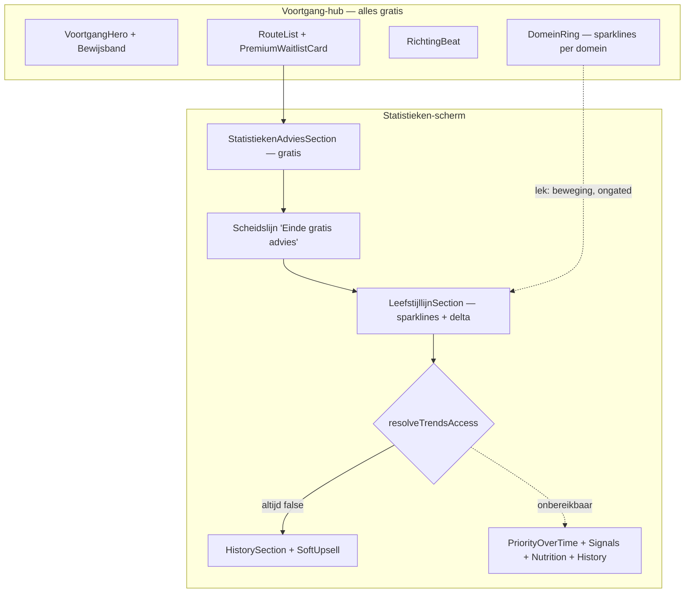
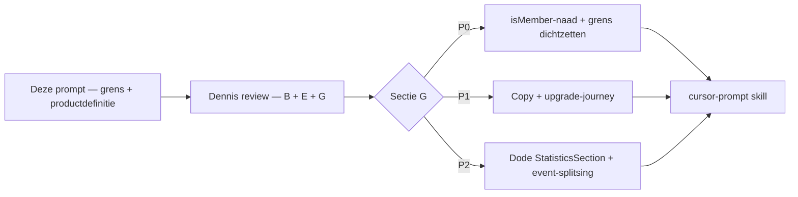

# Prompt — Voortgang · Statistieken: de premium-grens scherp maken (Opus)

> **Gebruik:** kopieer alles onder **Prompt (copy-paste)** naar Claude Opus in een nieuw gesprek. Bijlagen (screenshots) aanbevolen, niet vereist.
>
> **Output:** as-built inventarisatie → gratis/premium-matrix → grens-audit → design/IA → productdefinitie → upgrade-journey → prioriteiten → slices. Secties **A t/m L**. Geen code, geen diffs.
>
> **Opgesteld:** 29 juli 2026. Harde context geverifieerd tegen `main` (branch `s0-s1-stappenplan-ontdichten`, HEAD `2fd4f75`) — zie "Verificatie-log" onderaan.
>
> **Relatie tot de juli-analyse:** [`claude-opus-voortgang-statistieken-advies-2026-07.md`](claude-opus-voortgang-statistieken-advies-2026-07.md) definieerde de gratis advies-blokken (§C) en de grensregel *"nu = gratis, beweging = premium"* (§C). Dat is grotendeels **geïmplementeerd** — inclusief het complete meetplan uit §I. Deze prompt gaat over wat daarna is gaan schuren: de grens lekt, de premium-definitie is gesplitst, en de gate staat vandaag de facto dicht voor iedereen.

---

## Probleemstelling

Dennis' observatie na de Golf 0-oplevering (Voortgang-hero + Bewijsband, `4ba4132`/`2fd4f75`):

> "Voortgang is véél beter geworden. Maar het verschil tussen gratis en premium is niet scherp, en ik snap niet wat een gebruiker moet doen om te upgraden."

Die observatie klopt, en de oorzaak is scherper dan "onduidelijke copy". Uit de codebase-verificatie:

1. **De premium-kant is vandaag onbereikbaar.** `isMember` wordt nergens aan `<Dashboard>` doorgegeven en defaultet op `false`. Met `DARK_LAUNCH = true` leest `resolveTrendsAccess` uitsluitend `isMember` → **de unlocked-tak rendert voor niemand.** Het opgehaalde `hasTrendsFeature` wordt weggegooid.
2. **De grens lekt aan de gratis kant.** `LeefstijllijnSection` (sparklines + begin/nu/delta) staat ná de scheidslijn "Einde gratis advies" maar vóór de gate; `VoortgangDomeinRing` toont sparklines per domein ongated op de hub. Beide zijn "beweging over tijd" — precies wat premium zou zijn.
3. **Premium is twee verschillende producten.** De UI zegt "Premium · Statistieken", de API slaat `feature: "premium-coaching"` op, en `KompasBegeleidingLink` belooft "wekelijks iemand die met je meekijkt".
4. **Lichaamssamenstelling belooft twee dingen tegelijk.** Op de hub "Binnenkort in te vullen", op Statistieken een Premium-badge.

De vraag is dus niet "welke blokken zetten we achter de gate", maar:

> **Wat is Premium, voor wie is de grens vandaag zichtbaar, en welke minimale set maakt hem eerlijk én verkoopbaar — gegeven dat de unlocked-tak nu door niemand gezien wordt?**

---

## Waarom een nieuwe prompt en niet de juli-analyse opnieuw

De juli-analyse is *uitgevoerd*: advies-blokken staan er, `dashboard_advies_blok_getoond` / `dashboard_evidence_open` / `dashboard_ladder_step_click` / `dashboard.advies_gate_passed` zijn alle vier live, en de scheidslijn "Einde gratis advies" bestaat letterlijk. Wat die analyse niét deed:

- ze nam aan dat de unlocked-tak bereikbaar was;
- ze beschreef de grens per *blok*, niet per *oppervlak* (hub · statistieken · inzichten · lichaam vertellen nu vier verschillende premium-verhalen);
- ze had geen upgrade-journey — alleen een wachtlijst-CTA aan het eind.

Deze prompt is dus een **grens- en productdefinitie-analyse**, geen tweede IA-deep-dive op Statistieken.

---

## Gebruiksinstructie

1. Open Claude Opus (nieuw gesprek).
2. Voeg bijlagen toe (checklist hieronder) — optioneel maar sterk aanbevolen voor sectie D.
3. Kopieer het volledige blok onder **Prompt (copy-paste)**.
4. Verwachte output: secties **A t/m L**. Geen code.
5. Review sectie **B** (matrix), **E** (productdefinitie) en **G** (prioriteiten) → daarna per slice uit sectie **K** een Cursor-prompt via de `cursor-prompt` skill.

### Bijlagen-checklist

- [ ] Aanbevolen — screenshots 375px: Voortgang-hub, Statistieken (locked = wat iedereen nu ziet), Jouw inzichten (locked/blurred), Lichaamssamenstelling (locked/blurred), PremiumWaitlistCard.
- [ ] Aanbevolen — screenshot desktop ≥1280px van Statistieken **met contextkolom open** (voor de breedte-vraag in sectie D).
- [ ] Optioneel — [`WRITING_VOICE.md`](../core/WRITING_VOICE.md), [`ACCOUNT_DASHBOARD_SYSTEM.md`](../core/ACCOUNT_DASHBOARD_SYSTEM.md), [`CLAUDE.md`](../../CLAUDE.md).
- [ ] Niet vereist — een unlocked-screenshot. Die bestaat niet: de tak is onbereikbaar (zie verificatie-log).

---

## Centrale spanningen (context voor de reviewer, niet voor Opus)



**Grensregel uit juli** ([§C](claude-opus-voortgang-statistieken-advies-2026-07.md)): *de premium-grens loopt langs de tijdas, niet langs het advies. Alles wat "nu" is, is gratis. Alles wat "beweging" is, is premium.*

**Drie meetlatten** (niet mengen — [`PLAN_WEEKLIJKSE_LEEFSTIJLLOG.md`](../plan/PLAN_WEEKLIJKSE_LEEFSTIJLLOG.md) §3): adherence (`daily_action_log`) · beleving (`intake_domain_checkin`) · evidence (`movement_session_log`). Relevant voor de grens: welke meetlat mag gratis zichtbaar zijn, en welke pas na upgrade?

**Kernspanning.** De grensregel is verdedigbaar, maar hij is geschreven vóór de hub een Bewijsband en een DomeinRing met sparklines kreeg. "Beweging" is inmiddels het hart van het gratis product. Opus moet dus toetsen of de regel nog houdbaar is, of dat de as moet kantelen (bijv. *diepte* i.p.v. *tijd*: één lijn gratis, vergelijking + attributie premium).

---

## Prompt (copy-paste)

```text
ROL: Je bent Senior Product Strategist en UX-architect voor PerfectSupplement
(perfectsupplement.nl). Je levert een GRENS- en PRODUCTDEFINITIE-analyse voor de
Voortgang-tab, met focus op Statistieken en de premium-upsellpaden.

OUTPUT-CONTRACT: je levert UITSLUITEND analyse en ontwerp: inventarisatie →
matrix → audit → IA/design → productdefinitie → journey → prioriteiten → slices.
GEEN code, GEEN diffs, GEEN JSX, GEEN bestandspatches. Je mag bestanden bij naam
noemen; je wijzigt niets. Taal: Nederlands. Identifiers, componentnamen en
veldnamen: Engels.

Lees CLAUDE.md en WRITING_VOICE.md mee als je ze hebt.

═══════════════════════════════════════════════════════════════════════════════
BIJLAGEN (door Dennis)
═══════════════════════════════════════════════════════════════════════════════

1. AANBEVOLEN: screenshots 375px van Voortgang-hub, Statistieken (locked),
   Jouw inzichten (locked), Lichaamssamenstelling (locked), PremiumWaitlistCard.
   Plus één desktop-screenshot ≥1280px van Statistieken MET de contextkolom open.
2. OPTIONEEL: WRITING_VOICE.md, ACCOUNT_DASHBOARD_SYSTEM.md, CLAUDE.md.
3. NIET BESCHIKBAAR: een screenshot van de unlocked staat. Die bestaat niet —
   zie het kritieke feit hieronder. Vraag er niet om.

═══════════════════════════════════════════════════════════════════════════════
PRODUCTCONTEXT
═══════════════════════════════════════════════════════════════════════════════

PerfectSupplement is een onafhankelijk leefstijlplatform voor mannen 40+ (slaap,
stress, energie, herstel, beweging, voeding, verbinding). Positionering: "de
Consumentenbond van supplementen", doorgegroeid naar leefstijlcoach. Adviezen,
geen diagnoses. Stepped care: eerst je bord, daarna gericht aanvullen, en dan pas
welk potje.

Na de Leefstijlcheck landt de gebruiker op een dashboard met vier tabs:
Kompas · Mijn Dag · Voortgang · Hermeting. VOORTGANG is de payoff-surface: "wat
zich opstapelt sinds je check". Daaronder hangen vier schermen: Statistieken,
Favorieten, Jouw inzichten, Lichaamssamenstelling.

Monetisatie in het dashboard is NIET affiliate (dat is de publieke site). Het is
een toekomstig premium-abonnement, vandaag afgevangen met een WACHTLIJST — geen
checkout, geen prijs, geen Stripe.

═══════════════════════════════════════════════════════════════════════════════
HARDE CONTEXT — GEVERIFIEERD TEGEN DE CODEBASE OP 29 JULI 2026
Neem dit als waar aan. Verzin geen alternatieve staat.
═══════════════════════════════════════════════════════════════════════════════

--- NAVIGATIE ---

Voortgang-hub (VoortgangHubScroll.tsx), van boven naar beneden:
  1. VoortgangHero — bewijsregel + CTA's, bevat VoortgangBewijsband
  2. VoortgangDomeinRing — per domein: naam, SPARKLINE (72x24), score, DeltaBadge
  3. VoortgangRichtingBeat — richtingcopy + link naar Jouw inzichten
  4. VoortgangRouteList — 3 routerijen + blok BINNENKORT + PremiumWaitlistCard

Routerijen (VoortgangRouteList.tsx):
  - "Statistieken"    — "Wat je metingen zeggen over supplementen"
  - "Favorieten"      — "Je eigen keuzes en onze aanraders"
  - "Jouw inzichten"  — "Je vitaliteit in één beeld"
Daaronder, onder het kopje BINNENKORT, twee rijen met terra-badge:
  - "Lichaamssamenstelling" — badge "Binnenkort in te vullen"
  - "Je wearable koppelen"  — badge "Binnenkort"
Onderaan de sectie: PremiumWaitlistCard (surface="voortgang").

--- STATISTIEKEN-SCHERM (StatistiekenView in VoortgangHub.tsx) ---

Volgorde exact zoals gerenderd:
  1. StatistiekenAdviesSection            GRATIS
     (Waar sta je · Evidence-ladder · Eerst je bord · Ons oordeel)
     Layout: className "grid grid-cols-1 gap-4 lg:grid-cols-2 lg:gap-5"
  2. Scheidslijn, gecentreerde caps-tekst: "Einde gratis advies"
  3. LeefstijllijnSection (surface="voortgang")   GRATIS
     Bevat Sparkline + DeltaBadge per domein, "begin en laatste meting op één curve"
  4. Gate: resolveTrendsAccess(hasTrendsFeature, isMember)
     4a LOCKED : freeStatistics (= HistorySection) + StatistiekenSoftUpsell
     4b UNLOCKED: StatistiekenPriorityOverTime + SignalsSection +
                  NutritionIntakeSection + HistorySection +
                  PremiumValuePropsList variant="comingSoonOnly"
  5. HubCard "Lichaamssamenstelling" met Premium-badge (slotje)

--- GATING-MECHANIEK ---

  entitlement-access.ts:
    DARK_LAUNCH = true
    resolveTrendsAccess(hasEntitlement, isMember) => DARK_LAUNCH ? isMember
                                                                 : hasEntitlement

  KRITIEK FEIT — DE GATE STAAT VOOR IEDEREEN DICHT:
  isMember wordt NERGENS aan <Dashboard> doorgegeven. De prop defaultet op false
  (Dashboard.tsx: "isMember = false"). /dashboard/page.tsx bouwt dashboardProps
  uit uitsluitend initialTab / initialVoortgangScreen / initialKompasView /
  initialKompasDeepView. Gevolg, met DARK_LAUNCH = true:
    * resolveTrendsAccess retourneert ALTIJD false;
    * de hele unlocked-tak (PriorityOverTime, SignalsSection, NutritionIntake-
      Section in Statistieken, de comingSoonOnly-value-props) is DODE CODE in
      productie — niemand heeft hem ooit gezien;
    * hasFeature(accountId, "trends") wordt wél per dashboard-load uit
      account_entitlements gelezen en daarna WEGGEGOOID door de dark-launch-tak;
    * Jouw inzichten toont altijd de blurred tips; Lichaamssamenstelling toont
      altijd twee blurred ChartCards.
  Behandel dit als feit. "Premium" bestaat vandaag alleen als belofte, niet als
  ervaring. Je aanbevelingen moeten hierop aansluiten, niet eromheen redeneren.

--- PREMIUM-MESSAGING: DE PRODUCTDEFINITIE IS GESPLITST ---

  PremiumWaitlistCard.tsx
    eyebrow  : "Premium · Statistieken" (met BarChart-icoon)
    headline : "Zie precies waar je vooruitgang boekt — niet alleen een score."
    body     : "...Premium vergelijkt je metingen automatisch en laat trends per
                domein zien."
    prijszin : "Rond de prijs van een abonnement — we laten het weten bij launch."
    consent  : losse checkbox launchEmailOptIn (PREMIUM_LAUNCH_EMAIL_CONSENT_TEXT)
    CTA      : "Zet me op de wachtlijst voor Premium" (slot-icoon)
    POST     : /api/account/waitlist met feature: "premium-coaching"

  KompasBegeleidingLink.tsx (op Kompas, linkt naar #premium-begeleiding)
    "Gratis: na 30 dagen je hermeting onder het tabblad Hermeting.
     Premium: wekelijks iemand die met je meekijkt — wachtlijst op Voortgang."

  premium-value-props.ts — vier props, alle vier statistiek-taal:
    trends-per-domein · vergelijk-metingen · sterke-zwakke-punten ·
    activiteiten-logboek (comingSoon)
    Soft-upsell-copy: "Eén meting is een foto. Meerdere is een film."

  De UI verkoopt dus STATISTIEKEN, de link op Kompas verkoopt COACHING, en de
  backend registreert COACHING. Er is geen bundel-verhaal dat die twee verbindt.

--- BEKENDE GRENSBREUKEN (dit is je werkgebied) ---

  1. LEEFSTIJLLIJN STAAT AAN DE VERKEERDE KANT. LeefstijllijnSection rendert ná
     "Einde gratis advies" maar vóór de gate: sparklines, begin-vs-nu en delta
     per domein zijn gratis. Dat is letterlijk "beweging over tijd" — de premium-
     belofte uit de PremiumWaitlistCard ("trends per domein", "vergelijk je
     metingen") wordt drie blokken eerder gratis geleverd.
  2. DOMEINRING OP DE HUB TOONT SPARKLINES + DELTABADGE, ongated, nog vóór je
     Statistieken opent. Zelfde probleem, hoger in de funnel.
  3. HISTORYSECTION ZIT IN BEIDE BUNDELS. freeStatistics = <HistorySection/>;
     unlockedStatistics = PriorityOverTime + Signals + Nutrition + HistorySection.
     Upgraden voegt drie blokken toe en herhaalt er één.
  4. LICHAAMSSAMENSTELLING BELOOFT TWEE DINGEN. Op de hub: BINNENKORT-rij met
     badge "Binnenkort in te vullen". Op Statistieken: HubCard met Premium-badge
     en slotje. Het scherm zelf toont altijd blurred charts + wachtlijst.
  5. DE SCHEIDSLIJN IS EEN LABEL, GEEN POORT. "Einde gratis advies" staat op
     positie 2 van 5, terwijl er ná die lijn nog twee gratis blokken volgen
     (Leefstijllijn, HistorySection) plus de soft-upsell.
  6. GEEN PREVIEW OP STATISTIEKEN. Blur wordt alleen gebruikt op Jouw inzichten
     (BlurredInsightTips) en Lichaamssamenstelling (ChartCard blurred). Op
     Statistieken zie je van de premium-inhoud NIETS — alleen een tekstuele
     belofte. Drie oppervlakken, drie verschillende locked-patronen.

--- MEETPUNTEN DIE ER AL ZIJN (reuse-first; verzin niet opnieuw) ---

  GA4 (trackEvent, generieke helper — geen enum-registratie nodig):
    dashboard_statistieken_upsell     3 call-sites, GEMENGDE BETEKENIS:
                                      - VoortgangHub StatistiekenView: IMPRESSIE
                                        { state:"locked", surface:"voortgang" }
                                      - VoortgangHub openPremiumWaitlist: KLIK
                                        { state:"locked", surface, cta:"soft_upsell" }
                                      - Dashboard StatisticsSection: dode sectie
                                        (zie hieronder), zelfde payload als impressie
    dashboard_inzichten_upsell        impressie op Jouw inzichten
    dashboard_voortgang_hub_click     { destination, surface } — surfaces in gebruik:
                                      "verder_kijken", "statistieken", "bewijs_hero"
    dashboard_voortgang_bewijs_state  { state } op hero + bewijsregel
    dashboard_voortgang_terug         { from }
    premium_waitlist_shown            { surface }
    premium_waitlist_join             { feature, surface, launch_email_opt_in }
    dashboard_advies_blok_getoond / dashboard_evidence_open /
    dashboard_ladder_step_click       (uit de juli-analyse, alle drie live)
    dashboard_kompas_begeleiding_link_click { surface }
    wearable_interest                 { surface }

  Domain-events (durable, drievoudige registratie vereist bij nieuw):
    dashboard.advies_gate_passed      (live, op allowlist)
    wearable.interest_clicked         (live, account-events-allowlist)

  Clarity-tags: dashboard_statistieken (locked | soft_upsell_click),
    dashboard_voortgang (<destination> | inzichten_locked | bewijs_<state>),
    premium_value_props (<surface> | statistieken_locked), premium_waitlist (shown).

  MEETBUG OM MEE TE NEMEN: impressie en klik delen de eventnaam
  dashboard_statistieken_upsell en verschillen alleen in de optionele param
  cta="soft_upsell". Een conversieratio impressie→klik is daardoor niet
  betrouwbaar af te lezen. Bovendien vuurt de KLIK vanaf Jouw inzichten óók
  dashboard_statistieken_upsell (met surface:"inzichten"), terwijl de IMPRESSIE
  daar dashboard_inzichten_upsell heet. Twee schermen, asymmetrische naamgeving.

  DODE MEET-SURFACE: Dashboard.tsx bevat nog een oude StatisticsSection (section-
  type "statistics", id "statistieken") die SignalsSection + NutritionIntake-
  Section + HistorySection ongated toont en alleen de recovery-trend achter
  resolveTrendsAccess zet. Hij staat in DASHBOARD_SECTIONS maar in GEEN ENKELE
  TAB_SECTIONS-lijst (voortgang = ["voortgangHub"]), dus hij rendert nooit. Hij
  gebruikt bovendien een ANDERE gate (props.isMember rechtstreeks). Beoordeel of
  hij opgeruimd moet worden — hij is een tweede, tegenstrijdige waarheid.

--- WACHTLIJST-API: ÉÉN VELD LIGT ONGEBRUIKT KLAAR ---

  /api/account/waitlist accepteert priceIndication met de waarden
  "lt_10" | "10_20" | "20_35" | "gt_35" | "unknown", schrijft die naar
  price_indication en naar het domain-event (price_band). GEEN ENKELE UI STUURT
  DIT VELD. Tegelijk staat er in de card de zin "Rond de prijs van een abonnement
  — we laten het weten bij launch." Er is dus een prijsvraag-mechaniek die niets
  meet, en een prijsbelofte die niets zegt. Weeg dit in sectie F.

═══════════════════════════════════════════════════════════════════════════════
GELOCKTE INVARIANTEN — respecteer deze, bediscussieer ze niet
═══════════════════════════════════════════════════════════════════════════════

 1. Geen affiliate of koop-CTA in het dashboard. De enige conversie is de
    wachtlijst; er is geen checkout en die bouw je hier niet.
 2. Geen medische claims, geen diagnose-taal. Claimtekst uitsluitend uit
    getUsableClaims(); redentekst uit REASON_TEXT.
 3. KOAG: geen numerieke totaalscore in UI-copy — alleen de vier banden
    (Sterk / Voldoende / Aandacht / Prioriteit).
 4. Stepped care: supplementen verschijnen nooit vóór de voedingscheck.
 5. Geen streaks, badges, schuld-mechaniek of tweede scores.
 6. Adherence, beleving en evidence zijn drie gescheiden meetlatten en mogen
    niet tot één cijfer worden gemengd.
 7. Geen PII in GA4/Clarity: geen ruwe domeinscores, geen antwoorden, geen
    profiellabel, geen sessionId/accountId. Numerieke scores horen in
    domain_events (server-side).
 8. Nieuwe client-events vereisen registratie op drie plekken (events.ts +
    intake-events-client.ts + de allowlist in api/intake/events/route.ts).
    Reuse-first: verzin alleen iets nieuws als geen bestaand event het dekt.
 9. Dark launch blijft leidend tot entitlements live gaan: isMember is de
    schakelaar, niet hasTrendsFeature. Je mag WEL aanbevelen dat isMember
    daadwerkelijk doorgegeven wordt.
10. De Container/breedte-regel: binnen dashboardtegels gebruik je container-
    queries, niet viewport-breakpoints. De midden-zone is ~744px breed met open
    contextkolom, dus lg: (1024px viewport) vuurt terwijl de kolom smal is.
11. Geen dormant component activeren zonder meetpunt in dezelfde wijziging.

═══════════════════════════════════════════════════════════════════════════════
TWAALF ANALYSEVRAGEN — beantwoord ze allemaal, verdeeld over de secties
═══════════════════════════════════════════════════════════════════════════════

 1. Is de blokvolgorde in Statistieken logisch voor gratis én premium? Wat is de
    juiste volgorde als je hem vandaag opnieuw zou opbouwen?
 2. Waar breekt de grensregel "nu = gratis, beweging = premium" concreet
    (Leefstijllijn, HistorySection, DomeinRing)? Is de regel nog houdbaar nu de
    hub zelf op beweging draait, of moet de as kantelen (bijv. diepte i.p.v.
    tijd: één lijn gratis, vergelijking + attributie premium)?
 3. Wat is het minimale GRATIS pakket dat op zichzelf waardevol blijft, zonder
    premium te demoteren tot "hetzelfde maar meer"?
 4. Wat is het minimale PREMIUM pakket dat een upgrade vandaag rechtvaardigt —
    gegeven dat de as-built unlocked-tak (PriorityOverTime + Signals + Nutrition
    + History) door niemand gezien is en grotendeels bestaande blokken hergebruikt?
 5. Staat "Einde gratis advies" op de juiste plek? Moet het een lijn blijven, een
    echte poort worden, of verdwijnen?
 6. Hoe gedraagt de 2-koloms advies-grid (lg:grid-cols-2) zich in de ~744px
    midden-zone? Wat is de juiste breakpoint-strategie op 375px / 744px / 1280px+?
 7. Wat MOET Premium zijn: statistieken, coaching, of een bundel? Kies één
    verhaal en benoem exact welke copy, welke value-props en welke API-waarde
    (feature: "premium-coaching") meebewegen.
 8. Is blur + wachtlijst het juiste upgrade-patroon? Statistieken heeft geen
    preview, Inzichten en Lichaam wel. Harmoniseer naar één patroon en onderbouw.
 9. Hoe verhouden Statistieken, Jouw inzichten en Lichaamssamenstelling zich qua
    premium-belofte? Lichaamssamenstelling belooft "binnenkort" én "premium" —
    los dat op.
10. Welke hub-elementen (Bewijsband, DomeinRing, RichtingBeat) horen gratis en
    welke premium? De hub is de eerste indruk; wat mag daar weggegeven worden?
11. Welke drie copy-wijzigingen hebben het grootste effect op upgrade-clarity?
    Lever ze als exacte NL-tekst, niet als richting.
12. Welke slices bouw je eerst zodat gratis en premium daarna LOS meetbaar
    blijven — inclusief het repareren van de gemengde upsell-eventnaam?

═══════════════════════════════════════════════════════════════════════════════
KRITIEKRONDE (verplicht vóór je definitieve versie)
═══════════════════════════════════════════════════════════════════════════════

Beoordeel je eigen voorstel vanuit vier perspectieven. Per perspectief 2–3
scherpe kritiekpunten + 1 concrete verbetering:
 1. 46-jarige gebruiker, tweede keer op Voortgang, nog niets betaald.
 2. Compliance (KOAG/AVG art. 9): misleidende blur, "premium" suggereren bij een
    feature die niet bestaat, consent-bias in de launch-email-checkbox.
 3. Groei/conversie: is de wachtlijst nog het juiste instrument, of vraag je nu
    om commitment zonder ooit waarde geleverd te hebben?
 4. Frontend-ontwikkelaar: 375px, container-queries, Dashboard.tsx-omvang,
    dode secties, staatsexplosie.
Markeer expliciet wat je wijzigde t.o.v. versie 1.

═══════════════════════════════════════════════════════════════════════════════
OUTPUTFORMAAT (exact deze secties A–L, in deze volgorde)
═══════════════════════════════════════════════════════════════════════════════

A. AS-BUILT INVENTARISATIE per surface (hub · Statistieken locked · Statistieken
   unlocked-zoals-bedoeld · Jouw inzichten · Lichaamssamenstelling): per blok
   wat het toont, uit welke data, welke copy, welke gate. Markeer expliciet wat
   onbereikbaar is.
B. GRATIS vs PREMIUM MATRIX: per blok twee kolommen — "nu" en "ideaal" — met een
   reden per verschuiving. Dit is de kernsectie; wees uitputtend.
C. GRENS-AUDIT: waar scheurt de regel, per breuk: ernst, wie merkt het, en het
   fix-principe. Minimaal Leefstijllijn, HistorySection-dubbeling, DomeinRing,
   scheidslijn-positie, Lichaamssamenstelling-dubbele-belofte.
D. DESIGN / IA: nieuwe blokvolgorde, het lot van de scheidslijn, de 2-koloms
   grid bij 375 / 744 / 1280px, en waar de gate visueel moet landen.
E. PREMIUM PRODUCTDEFINITIE: één verhaal (statistieken / coaching / bundel) met
   de complete consequentielijst — copy, value-props, eyebrow, API-waarde,
   KompasBegeleidingLink.
F. UPGRADE JOURNEY: de momenten waarop iemand de grens raakt, wat hij dan ziet,
   wat hij verwacht, en wat er ontbreekt. Neem de prijsvraag mee (het ongebruikte
   priceIndication-veld) en beslis of die gesteld moet worden.
G. PRIORITEITEN P0 / P1 / P2, elk met onderbouwing en een expliciete
   NIET-NU-lijst.
H. COPY-HIËRARCHIE gratis/premium: per grens eyebrow / headline / body als
   exacte Nederlandse tekst. Volg de bestaande vaste woordenschat ("Eerst je
   bord." / "naast je leefstijl" / "Op basis van je laatste check").
I. WIREFRAMES 375px (ASCII): Statistieken met de verbeterde grens, plus het
   upgrade-moment. Eén variant, niet drie.
J. MEETPLAN: reuse-first tegen de bestaande set. Splits expliciet de gemengde
   dashboard_statistieken_upsell (impressie vs klik) en de asymmetrie met
   dashboard_inzichten_upsell. Definieer de cohorten waarmee gratis en premium
   los te lezen zijn. Sluit af met: "Meetpunt: <event(s)> — hier lees je het
   effect af."
K. IMPLEMENTATIE-SLICES (Cursor-ready, geen code): per slice doel, raakvlak,
   5 acceptatiecriteria, en een expliciete "niet aanraken"-lijst.
L. RISICO'S: compliance (KOAG, art. 9), consent-bias, misleidende blur, en het
   reputatierisico van een premium-belofte zonder bereikbare premium-ervaring.
   + ANTI-PATTERNS die je expliciet vermijdt.

═══════════════════════════════════════════════════════════════════════════════
CONSTRAINTS
═══════════════════════════════════════════════════════════════════════════════

- GEEN code, GEEN diffs, GEEN JSX. Je verwijst naar bestanden, je wijzigt niets.
- Behandel de dichte gate (isMember nooit doorgegeven) als FEIT, niet als
  hypothese. Een aanbeveling die aanneemt dat premium-gebruikers vandaag iets
  zien, is ongeldig.
- Stel geen checkout, Stripe of prijspagina voor. De wachtlijst is het mechanisme.
- Verzin geen nieuwe premium-features om de bundel te vullen. Werk met wat er is
  of met een expliciet gemarkeerde "nog te bouwen"-status.
- Bij onduidelijkheid: kies de sterkste optie, documenteer als "AANNAME: ..." en
  ga door.
- Denk diep. Kies niet de voor de hand liggende indeling. Waar je afwijkt van de
  juli-grensregel: zeg het hardop en onderbouw het.

BEGIN.
```

---

## Verwachte output (checklist)

- [ ] **A** — As-built inventarisatie per surface, met onbereikbare blokken gemarkeerd
- [ ] **B** — Gratis vs premium matrix (nu vs ideaal, met reden per verschuiving)
- [ ] **C** — Grens-audit met ernst + fix-principe per breuk
- [ ] **D** — Design/IA: volgorde, scheidslijn, grid bij 375/744/1280px
- [ ] **E** — Premium productdefinitie: één verhaal + complete consequentielijst
- [ ] **F** — Upgrade journey incl. besluit over de prijsvraag
- [ ] **G** — P0/P1/P2 + niet-nu-lijst
- [ ] **H** — Copy-hiërarchie als exacte NL-tekst
- [ ] **I** — Wireframe 375px (één variant)
- [ ] **J** — Meetplan incl. splitsing van de gemengde upsell-event
- [ ] **K** — Implementatie-slices met acceptatiecriteria + niet-aanraken-lijst
- [ ] **L** — Risico's + anti-patterns

Geen code. Wel een grensdefinitie die direct om te zetten is in Cursor-prompts.

---

## Verificatie-log (29 juli 2026, tegen `main` / HEAD `2fd4f75`)

Drie beweringen uit de uitgangsnotitie bleken **onjuist of onvolledig** en zijn in de prompt gecorrigeerd; de rest is bevestigd.

| Bewering | Werkelijke staat | Bron |
|---|---|---|
| `resolveTrendsAccess`: DARK_LAUNCH → unlock = `isMember` | **Bevestigd, maar met een groot gevolg dat de notitie miste.** `isMember` wordt nergens aan `<Dashboard>` doorgegeven en defaultet op `false`; `dashboardProps` bevat alleen de vier initial-props. De unlocked-tak is dus **dode code**, en `hasFeature(accountId,"trends")` wordt gelezen en weggegooid | [entitlement-access.ts:8-16](../../src/lib/entitlement-access.ts#L8-L16) · [Dashboard.tsx:3641](../../src/components/dashboard/Dashboard.tsx#L3641) · [page.tsx:92-97](../../src/app/dashboard/page.tsx#L92-L97) · [page.tsx:123](../../src/app/dashboard/page.tsx#L123) |
| Route-ondertitel Statistieken = "Wat je metingen zeggen over supplementen" | **Bevestigd** | [VoortgangRouteList.tsx:19-21](../../src/components/dashboard/voortgang/VoortgangRouteList.tsx#L19-L21) |
| Hub = Hero, DomeinRing (sparklines), RichtingBeat, RouteList + PremiumWaitlistCard | **Bevestigd, met nuance.** De `PremiumWaitlistCard` staat *binnen* `VoortgangRouteList`, niet als zusje in `VoortgangHubScroll` | [VoortgangHubScroll.tsx:33-58](../../src/components/dashboard/voortgang/VoortgangHubScroll.tsx#L33-L58) · [VoortgangRouteList.tsx:151](../../src/components/dashboard/voortgang/VoortgangRouteList.tsx#L151) |
| HubCard Lichaamssamenstelling met premium-badge is "altijd zichtbaar" | **Bevestigd op Statistieken — maar de hub zegt iets anders.** Op de hub staat Lichaamssamenstelling onder het kopje BINNENKORT met badge "Binnenkort in te vullen", náást een tweede binnenkort-rij "Je wearable koppelen". Twee tegenstrijdige beloftes voor hetzelfde scherm | [VoortgangHub.tsx:651-657](../../src/components/dashboard/VoortgangHub.tsx#L651-L657) · [VoortgangRouteList.tsx:112-131](../../src/components/dashboard/voortgang/VoortgangRouteList.tsx#L112-L131) |
| Statistieken-volgorde: advies → scheidslijn → leefstijllijn → gate → hubcard | **Bevestigd, letterlijk in deze volgorde** | [VoortgangHub.tsx:606-660](../../src/components/dashboard/VoortgangHub.tsx#L606-L660) |
| `freeStatistics` vs `unlockedStatistics` in Dashboard.tsx rond 3522–3533 | **Bevestigd** op regels 3522–3533. `HistorySection` zit in beide bundels | [Dashboard.tsx:3522-3533](../../src/components/dashboard/Dashboard.tsx#L3522-L3533) |
| Leefstijllijn = grensbreuk (sparklines/delta gratis) | **Bevestigd.** `Sparkline` + `DeltaBadge` per domein, copy "begin en laatste meting op één curve" | [LeefstijllijnSection.tsx:5](../../src/components/dashboard/LeefstijllijnSection.tsx#L5) · [:85](../../src/components/dashboard/LeefstijllijnSection.tsx#L85) · [:178](../../src/components/dashboard/LeefstijllijnSection.tsx#L178) |
| DomeinRing toont sparklines zonder gate | **Bevestigd.** `Sparkline w={72} h={24}` + `DeltaBadge`, geen gate-import in het bestand | [VoortgangDomeinRing.tsx:5](../../src/components/dashboard/voortgang/VoortgangDomeinRing.tsx#L5) · [:124](../../src/components/dashboard/voortgang/VoortgangDomeinRing.tsx#L124) |
| Premium = statistieken in UI vs coaching in API | **Bevestigd.** Eyebrow "Premium · Statistieken"; `feature: "premium-coaching"` in de POST; `KompasBegeleidingLink` belooft wekelijkse begeleiding | [PremiumWaitlistCard.tsx:46](../../src/components/dashboard/PremiumWaitlistCard.tsx#L46) · [:113](../../src/components/dashboard/PremiumWaitlistCard.tsx#L113) · [KompasBegeleidingLink.tsx:46-48](../../src/components/dashboard/KompasBegeleidingLink.tsx#L46-L48) |
| Blur alleen op Inzichten en Lichaam, niet op Statistieken | **Bevestigd.** `filter: "blur(5px)"` op `BlurredInsightTips` (Inzichten) en op `ChartCard` (Lichaam); Statistieken heeft geen preview | [VoortgangHub.tsx:511](../../src/components/dashboard/VoortgangHub.tsx#L511) · [:718](../../src/components/dashboard/VoortgangHub.tsx#L718) |
| Upgrade = wachtlijst, geen prijs | **Bevestigd, plus een ongebruikt veld.** De API accepteert `priceIndication` (`lt_10`/`10_20`/`20_35`/`gt_35`/`unknown`) en schrijft die naar `price_indication` + `price_band`; **geen enkele UI stuurt het** | [waitlist/route.ts:24-25](../../src/app/api/account/waitlist/route.ts#L24-L25) · [:95-108](../../src/app/api/account/waitlist/route.ts#L95-L108) · [:173](../../src/app/api/account/waitlist/route.ts#L173) |
| **Nieuw gevonden:** 2-koloms advies-grid gebruikt een viewport-breakpoint | `grid grid-cols-1 gap-4 lg:grid-cols-2 lg:gap-5` — `lg:` vuurt op 1024px viewport terwijl de cockpit-midden-zone ~744px is met open contextkolom. Bekende breedte-val; hier nog niet toegepast | [StatistiekenAdviesSection.tsx:66](../../src/components/dashboard/voortgang/StatistiekenAdviesSection.tsx#L66) |
| **Nieuw gevonden:** dode tweede statistieken-surface | `StatisticsSection` (type `statistics`, id `statistieken`) staat in `DASHBOARD_SECTIONS` maar in geen enkele `TAB_SECTIONS`-lijst (`voortgang: ["voortgangHub"]`). Hij gebruikt een ándere gate (`props.isMember` direct) en vuurt een eigen `dashboard_statistieken_upsell` | [Dashboard.tsx:2180-2192](../../src/components/dashboard/Dashboard.tsx#L2180-L2192) · [data/dashboard/index.ts:313](../../src/data/dashboard/index.ts#L313) · [:355](../../src/data/dashboard/index.ts#L355) |
| **Nieuw gevonden:** upsell-event mengt impressie en klik | `dashboard_statistieken_upsell` vuurt zowel bij het tonen van de locked staat als bij de soft-upsell-klik (alleen onderscheiden door `cta:"soft_upsell"`). De klik op Inzichten vuurt hetzelfde event met `surface:"inzichten"`, terwijl de impressie daar `dashboard_inzichten_upsell` heet | [VoortgangHub.tsx:589](../../src/components/dashboard/VoortgangHub.tsx#L589) · [:923](../../src/components/dashboard/VoortgangHub.tsx#L923) · [:457](../../src/components/dashboard/VoortgangHub.tsx#L457) |
| Meetplan uit de juli-analyse (§I) is uitgevoerd | **Bevestigd.** `dashboard_advies_blok_getoond`, `dashboard_evidence_open`, `dashboard_ladder_step_click` zijn live; `dashboard.advies_gate_passed` staat op alle drie de registratieplekken | [StatistiekenAdviesSection.tsx:45](../../src/components/dashboard/voortgang/StatistiekenAdviesSection.tsx#L45) · [:57](../../src/components/dashboard/voortgang/StatistiekenAdviesSection.tsx#L57) · [:271](../../src/components/dashboard/voortgang/StatistiekenAdviesSection.tsx#L271) · [events.ts:65](../../src/lib/events.ts#L65) · [intake/events/route.ts:19](../../src/app/api/intake/events/route.ts#L19) |
| Grensregel "nu = gratis, beweging = premium" komt uit de juli-analyse | **Bevestigd**, §C "Gratis vs. premium — de grens expliciet" | [claude-opus-voortgang-statistieken-advies-2026-07.md §C](claude-opus-voortgang-statistieken-advies-2026-07.md) |

**Gevolg voor de prompt.** Analysevraag 4 is aangescherpt: niet "wat is het minimale premium pakket", maar "wat rechtvaardigt een upgrade gegeven dat de as-built unlocked-tak door niemand gezien is". De dichte gate staat als *kritiek feit* in de harde context én als constraint, zodat Opus er niet omheen redeneert. De drie nieuw gevonden feiten (grid-breakpoint, dode `StatisticsSection`, gemengde upsell-event) zijn toegevoegd aan respectievelijk sectie D, C en J van het outputcontract.

---

## Volgende stap na Opus-output

1. Dennis draait de prompt (screenshots aanbevolen voor sectie D en I).
2. Review: sectie **B** (matrix), **E** (productdefinitie), **G** (prioriteiten).
3. Per slice uit sectie **K** een Cursor-prompt via de `cursor-prompt` skill.
4. Meetpunten uit sectie **J** meenemen in dezelfde PR als de UI-wijziging — nooit los.



Meetpunt: geen — dit document activeert niets. Het meetplan komt uit sectie J van de Opus-output en wordt pas bij implementatie geregistreerd (drievoudige registratie waar het om nieuwe domain-events gaat).
