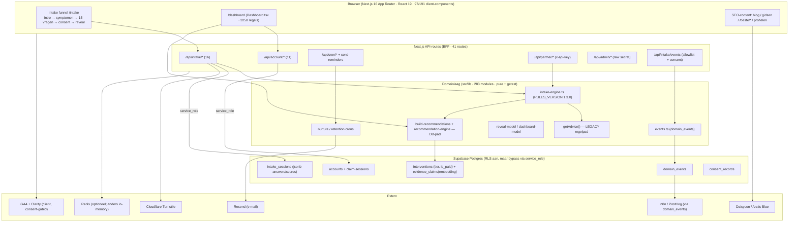
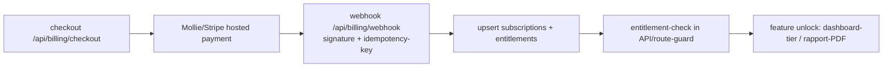

# Platform-audit — PerfectSupplement (herziene, zelf-geverifieerde run)

> **Uitgevoerd door:** Claude, direct op de codebase (`main`, 1 jul 2026). Geen aannames overgenomen uit de vorige run — elke bevinding hieronder is opnieuw in code geverifieerd. Waar de vorige rapportversie over- of onderclaimde, staat de correctie in **Bijlage D**.
>
> **Zekerheidslabels:** `BEWEZEN` = direct in code gezien (file:line) · `AFGELEID` = logische conclusie uit meerdere observaties · `AANNAME` = niet in code te verifiëren, expliciet benoemd.
>
> **Scope:** analyse-only. Geen code gewijzigd, niets gecommit.

---

## Executive summary

PerfectSupplement is een technisch **volwassen B2C-leefstijlcheck** met een uitzonderlijk sterke domein- en meetlaag voor een project van deze omvang: 283 `lib`-modules, 100 testbestanden, 41 API-routes, 40 SQL-migraties, 27 core-docs. De fundering voor *de huidige propositie* (funnel → reveal → account → hermeting → affiliate + nurture) is solide en groeibaar.

De sterkte zit in de **scheiding tussen regels en data**: een pure, geteste scoring-engine (`intake-engine.ts`, `RULES_VERSION 1.3.0`), een expliciet interventie-vs-readout domeinmodel, `rules_version` op sessies voor historische vergelijkbaarheid, en een drie-lagen analytics-stack met consent-gates. Passwordless account + dashboard-meetlus vormen een echte retentie-moat.

De zwakte zit in drie clusters: (1) **monetisatie voorbij affiliate is nog niet gefundeerd** — nul billing-infrastructuur, alleen seams (`maxTier`, `is_paid` op producten, `premium_waitlist`); (2) **SaaS/multi-tenant is een schema-naad, geen runtime** — `organization_id` overal, maar geen RBAC, geen org-UI, service_role omzeilt RLS overal; (3) **operationele hardening loopt achter op de featurelaag** — geen observability (Sentry), geen e2e-tests, geen code-splitting, en enkele auth-inconsistenties (admin raw-secret, `send-reminders` niet timing-safe, CSP met `unsafe-inline/eval`).

**Eindoordeel:** een goede fundering voor het B2C-ecosysteem voor 5-10 jaar — **voorwaardelijk** zodra betalingen, echte multi-tenancy of AI-op-schaal in beeld komen. Die drie vragen elk een expliciete architectuurstap vóór ze veilig kunnen landen.

**Scorecard (samengevat):** Architectuur 8 · Codekwaliteit 7 · Productvisie 8 · Schaalbaarheid 6 · SaaS 4 · AI 5 · Security 7 · Privacy 8 · Funnel 8 · Conversie 7 · Betaal-readiness 3. *(onderbouwing in sectie 22)*

---

## As-is architectuurdiagram

**Kernpatroon:** BFF (Backend-for-Frontend) — alle DB-toegang loopt via API-routes met de **service_role key** (`supabase-admin.ts`); er is geen anon-client in de codebase. Data-in en data-uit lopen door dezelfde `createSupabaseAdmin()`. `BEWEZEN` ([supabase-admin.ts:5](../../src/lib/supabase-admin.ts#L5)).

---

## Sectie 1 — Productvisie

**Observatie.** De architectuur scheidt bewust *productkennis* (interventions, evidence_claims, supplement-data in TS-files) van *persoonsgegevens* (intake_sessions, accounts). De stepped-care tiers (1-5) zijn data-gedreven via `org.settings.maxTier` (`org-settings.ts`, default 1, cap 5) `BEWEZEN`. Het account is een echte continuïteitslaag (passwordless, `account_claim_sessions`-migratie koppelt anonieme sessies aan een account). `BEWEZEN`.

**Impact.** Coaching, betaalde rapporten en AI kunnen conceptueel op deze kernel landen: de meetlus (baseline → check-ins → delta → hermeting) is de asset waar alle toekomstige waarde op stapelt. De tier-seam betekent dat feature-gating al bestaat vóórdat er een betaalmuur is.

**Aanbeveling.** Benoem expliciet een "platform kernel" (identity + measurement + events + consent) versus "feature modules" (funnel, content, coaching, billing). Nu zijn die impliciet. **[Kort]**

**Zekerheid:** BEWEZEN (seams), AFGELEID (landbaarheid AI/coaching).

---

## Sectie 2 — Funnel

**Observatie.** Journey: `/intake` (client-fasen) → satellieten `/intake/{slaap,stress,beweging,voeding}` + `/intake/plan/[domain]` → `/dashboard` → `/rapport/[sid]` → `/account/*`. De vragenset telt **15 items** (`intake-questions.ts`) — niet 16 zoals docs stellen `BEWEZEN`. De hoofd-submit is bot-beschermd met Turnstile + rate-limit + honeypot ([session/route.ts:194-224](../../src/app/api/intake/session/route.ts#L194)) `BEWEZEN`.

**Impact.** Eén vraag per scherm + reveal-storytelling (`reveal-model.ts` → prioriteit/kracht-framing) is sterk voor herkenning→validatie→actie. Risico: consent-timing — de consent-stap zit vóór de reveal; als gebruikers afhaken op consent verlies je de hele sessie. Meetbaar via bestaande `consent.*`/`intake.*` events.

**Aanbeveling.** Meet drop-off per fase expliciet (funnel in PostHog); overweeg reveal *vóór* volledige consent (progressive disclosure) zodat de waarde zichtbaar is voordat toestemming gevraagd wordt. **[Kort]**

**Zekerheid:** BEWEZEN (structuur, Turnstile), AFGELEID (consent-timing-risico).

---

## Sectie 3 — Behavioural Science

**Observatie per framework:**
- **SDT** — autonomie (keuze van pijler/thema), competentie (vitaliteitsscore + delta), verbondenheid (nieuw `connection_score` / CON_SOC als 5e interventiedomein, `RULES_VERSION 1.3.0`). Alle drie behoeften nu geadresseerd `BEWEZEN`.
- **COM-B** — Capability (quick wins, plan-content), Opportunity (reminders/nurture), Motivation (reveal-framing). Opportunity-fysiek (omgeving) het zwakst.
- **BJ Fogg / Tiny Habits** — `vitality-habit-kernel.ts` (210 regels) + `daily_action_log` = trigger→actie-substraat aanwezig, maar **geen streak/badge-UI** `BEWEZEN` (0 gamification-UI).
- **Transtheoretical / Motivational Interviewing** — copy volgt begrip→urgentie→actie (`WRITING_VOICE.md`), maar geen expliciete stage-of-change-detectie of change-talk-loop.

**Impact.** Sterke fundering voor gedragsverandering; de zwakte is *reinforcement over tijd* — er is een habit-kernel zonder de belonings-/voortgangsfeedback die adherentie draagt.

**Aanbeveling.** Bouw op `daily_action_log` een streak-/momentum-UI (kleine winst, hoge retentie-impact). **[Kort]** Voeg later stage-of-change-signaal toe aan de engine. **[Middel]**

**Zekerheid:** BEWEZEN (kernel, connection-domein), AFGELEID (framework-dekking).

---

## Sectie 4 — Clean Code

**Observatie.**
- **Sterk:** `lib` bestaat grotendeels uit pure functies met 92 unit-tests; scoring is testbaar en deterministisch.
- **Monoliet:** `Dashboard.tsx` = **3258 regels**, `VoortgangHub.tsx` 1016, `VitalityGauge.tsx` 744 `BEWEZEN`. Dit zijn SRP-overtreders.
- **Dubbel adviespad (DRY-breuk):** `getAdvice()` (legacy, in `intake-engine.ts`, ~340 regels hardcoded regels) wordt gebruikt via `intake-strategy.ts` (o.a. partner-API), terwijl het DB-pad (`build-recommendations`, `recommendation-engine`, `getPlanContent`) het dashboard voedt `BEWEZEN`. Twee bronnen van "wat adviseer ik".

**Impact.** De monolieten zijn onderhouds- en reviewrisico's; het dubbele adviespad kan tot inconsistente gebruikerservaring leiden (partner/legacy-advies ≠ dashboard-advies).

**Aanbeveling.** Splits `Dashboard.tsx` per tab in sub-componenten + hooks. **[Middel]** Kies één adviesbron: migreer `getAdvice()`-consumers naar het DB-pad, of markeer legacy expliciet als "compute-only voor partner-API". **[Middel]**

**Zekerheid:** BEWEZEN.

---

## Sectie 5 — Architectuur

**Observatie.** Layer-based (`app`/`components`/`lib`/`data`/`types`) met een de-facto BFF. Dependency-richting is overwegend gezond (`data` → `lib`, componenten → `lib`). De coupling-hotspots zijn `intake-engine`, `events`, en `dashboard-model`. `api-middleware.ts` is gemarkeerd *"EXPERIMENTAL … not used by production"* maar `withPartnerApi` **wordt** door de productie-route `partner/intake` gebruikt — stale comment `BEWEZEN`.

**Impact.** Voor de huidige monoliet prima. Bij mobile-app/embed-widget is het BFF-patroon een voordeel (één API-oppervlak), maar de layer-based indeling maakt feature-eigenaarschap diffuus naarmate modules groeien.

**Aanbeveling.** Overweeg feature-mappen voor nieuwe modules (billing, coaching) i.p.v. verder uitdijen in de gedeelde `lib`. Corrigeer de stale "experimental"-comment. **[Kort]**

**Zekerheid:** BEWEZEN.

---

## Sectie 6 — Future Proof

| Capability | Status | Bewijs |
|---|---|---|
| Abonnementen / Stripe / Mollie | **Afwezig** | 0 hits op stripe/mollie/checkout/subscription/invoice/entitlement in `src/` `BEWEZEN` |
| AI-coach / LLM | **Alleen infra** | RAG + `embedding vector(1536)`; **geen** LLM-call (grep openai/anthropic/gpt = leeg) `BEWEZEN` |
| Meerdere talen | **Afwezig** | geen next-intl/i18n-framework; NL hardcoded `BEWEZEN` |
| Meerdere funnels / partners | **Deels** | `IntakeStrategy` + `partner/intake` stateless compute-endpoint `BEWEZEN` |
| Tenants / orgs | **Schema-naad** | `organization_id` overal; geen runtime-org-context/RBAC `BEWEZEN` |
| PDF-generatie | **Deels** | `scripts/generate-guide-pdf.py` (build-time), geen runtime-rapport-PDF `BEWEZEN` |
| E-mailflows / CRM | **Aanwezig** | nurture, Zoho-env, n8n via `domain_events` `BEWEZEN` |
| Push / notificaties | **Afwezig** | alleen e-mail; geen service worker/web push `BEWEZEN` |
| A/B-testing / flags | **Minimaal** | `nurture_emails.variant`-kolom + `maxTier`; 0 feature-flag-infra `BEWEZEN` |
| Analytics | **Aanwezig** | 3-lagen (domain_events/GA4/Clarity) `BEWEZEN` |

**Aanbeveling.** Voeg een lichte feature-flag-laag toe (org.settings-uitbreiding volstaat als start) vóór je A/B-tests en gefaseerde uitrol nodig hebt. **[Kort]**

**Zekerheid:** BEWEZEN.

---

## Sectie 7 — Data Model

**Observatie.** 40 migraties, incrementeel en netjes gedateerd. `intake_sessions` gebruikt jsonb voor `answers`/`domain_scores` (flexibel, denormaliseert bewust). `rules_version` op sessies + baseline-snapshots (`intake_baseline_remeasure`) geven historische vergelijkbaarheid `BEWEZEN`. `hydrateDomainScores()` upgradet pre-1.3.0-sessies die `connection_score` missen — expliciet migratie-vriendelijk `BEWEZEN` ([intake-engine.ts:25](../../src/lib/intake-engine.ts#L25)).

**Impact.** Scoring kan evolueren zonder oude data te breken (versie + hydrate-patroon). Zwakte: `rules_version` versiet de *scoringregels*, niet de *vraagtekst* — bij herformulering van een vraag is oude/nieuwe data niet onderscheidbaar.

**Ontbrekende entiteiten** voor de toekomstvisie: `subscriptions`, `invoices`, `entitlements`, `prices`/`products`, `coaching_sessions`, `ai_conversations`/context-store, `wearable_connections`. `BEWEZEN` (afwezig in migraties).

**Aanbeveling.** Introduceer een `question_bank_version` (of versie per vraag) vóór grote vragenlijst-herzieningen. **[Middel]**

**Zekerheid:** BEWEZEN.

---

## Sectie 8 — Security

**Auth-modellen (per domein geverifieerd):**

| Domein | Mechanisme | Oordeel |
|---|---|---|
| Account | `psf_account` = HMAC-sha256 over `accountId.issuedAt`, timing-safe, 90d expiry + clock-skew | **Solide** `BEWEZEN` ([account-session-cookie.ts:47-58](../../src/lib/account-session-cookie.ts#L47)) |
| Cron (retention/nurture/n8n) | `verifyCronRequest` = HMAC-signature + timestamp-window + IP-allowlist | **Solide** `BEWEZEN` |
| Cron (`/api/send-reminders`) | Bearer via **plain `===`**, geen timing-safe, geen IP-allowlist | **Zwak / inconsistent** `BEWEZEN` ([send-reminders/route.ts:18](../../src/app/api/send-reminders/route.ts#L18)) |
| Admin | `admin_token` cookie == **raw secret** (`token === secret`, geen HMAC/sessie) | **Zwak** `BEWEZEN` ([admin-auth.ts:12](../../src/lib/admin-auth.ts#L12)) |
| Partner | `x-api-key` via `validKeys.includes()` — niet timing-safe | **Matig** `BEWEZEN` ([api-middleware.ts:82](../../src/lib/api-middleware.ts#L82)) |
| Intake | HMAC session-cookie + Turnstile + recovery-tokens | **Solide** `BEWEZEN` |

**Overige bevindingen:**
- **CSP zwak voor XSS:** `script-src 'self' 'unsafe-inline' 'unsafe-eval' …` ([proxy.ts:67](../../src/proxy.ts#L67)) — inline/eval toegestaan; CSP biedt hier weinig XSS-defensie. HSTS, `X-Frame-Options: DENY`, `object-src none`, `frame-ancestors none`, Referrer/Permissions-Policy zijn wél goed gezet `BEWEZEN`.
- **service_role overal → geen defense-in-depth:** één API-bug omzeilt RLS volledig `BEWEZEN`.
- **Feedback-spoofing:** `/api/intake/feedback` neemt `sessionId` uit de body (alleen UUID-format-check), **zonder** cross-check tegen de session-cookie — dit terwijl `/api/intake/events` diezelfde check wél doet ([events/route.ts:101](../../src/app/api/intake/events/route.ts#L101)). Een aanvaller kan feedback + `profile.recognition`-events aan een vreemde sessie hangen. Laag qua ernst (data-integriteit), maar reëel `BEWEZEN` ([feedback/route.ts:79-125](../../src/app/api/intake/feedback/route.ts#L79)).
- **OWASP:** injection laag (parametrized Supabase-client, geen raw SQL); rate-limiting aanwezig; SSRF n.v.t.; XSS gemitigeerd door React-escaping ondanks zwakke CSP.

**Aanbeveling (P0-P1).** Admin → HMAC-sessietoken i.p.v. raw secret; `send-reminders` → `timingSafeEqual` (of migreer naar `verifyCronRequest`); feedback → verifieer `sessionId` tegen cookie; CSP → nonce-based script-src plannen. **[Quick Win / Kort]**

**Zekerheid:** BEWEZEN.

---

## Sectie 9 — Privacy

**Observatie.** DPIA aanwezig met **technisch afgedwongen** bewaartermijnen: intake-sessies 24 mnd, reminders 12 mnd, webanalyse 14 mnd, via `retention`-cron `BEWEZEN` ([DPIA.md](../core/DPIA.md), [retention/route.ts](../../src/app/api/cron/retention/route.ts)). Consent-trails in `consent_records`; revoke-flows bestaan (`/api/account/revoke`, `/api/intake/consent` + `intake_consent_revoke_tx`-migratie) `BEWEZEN`. Analytics-events server-side alleen ná analytics-consent ([events/route.ts:111](../../src/app/api/intake/events/route.ts#L111)) `BEWEZEN`. Gezondheidsdata (art. 9) wordt bij intrekking geanonimiseerd/verwijderd.

**Gat:** **geen data-export-endpoint** (GDPR-portabiliteit) — grep leverde niets op `BEWEZEN`. Verwijderen/intrekken kan, exporteren niet.

**Aanbeveling.** Bouw een self-service data-export (JSON) voor de accounthouder. **[Kort]** Overweeg PII-minimalisatie in `domain_events` (e-mail wordt meegestuurd).

**Zekerheid:** BEWEZEN.

---

## Sectie 10 — Performance

**Observatie.**
- **97 van 191 componenten zijn `"use client"`** (~51%) `BEWEZEN` — hoge client-dichtheid voor een SEO-content-platform.
- **0 dynamic imports / `next/dynamic`** `BEWEZEN` — geen code-splitting, terwijl `framer-motion` (12.x) + `recharts` (3.x) + `Dashboard.tsx` (3258 r.) statisch geladen worden.
- **Slechts 5 bestanden gebruiken `next/image`** `BEWEZEN` — CLAUDE.md schrijft `next/image` met width/height voor; lage adoptie (mogelijk deels bewust voor iconen/SVG).
- Single VPS, geen CDN-edge-caching voor dynamische routes (`AANNAME`, infra buiten repo).

**Impact.** De grootste winst zit in het lazy-laden van de zware dashboard-/chart-bundle voor bezoekers die alleen content lezen.

**Aanbeveling.** `next/dynamic` voor `recharts`-grafieken en dashboard-tabs; audit ``-gebruik tegen `next/image`. **[Kort]**

**Zekerheid:** BEWEZEN (client-density, geen splitting), AANNAME (CDN).

---

## Sectie 11 — SEO

**Observatie.** Sterke infra: `sitemap.ts`, `seo/canonical.ts`, `seo/structuredData.ts`, en **55 routes met `metadata`/`generateMetadata`** `BEWEZEN`. Redirect-map in `next.config.ts` behoudt oude `/beste-*`-URL's (permanent). Content-spinnenweb per `SEO_RULES.md`.

**Impact.** Dit is een van de sterkste assen — de acquisitiemotor (content → intake) is technisch goed onderbouwd.

**Aanbeveling.** Borg dat `/dashboard`, `/intake`, `/rapport/*` op `noindex` staan (persoonlijke/functionele routes). Verifieer. **[Quick Win]**

**Zekerheid:** BEWEZEN (infra), AFGELEID (noindex-borging).

---

## Sectie 12 — Accessibility

**Observatie.** Semantische HTML is projectconventie; één-vraag-per-scherm is toetsenbord-vriendelijk in opzet. Geen geautomatiseerde a11y-tests, geen axe/ci-gate `AFGELEID`. Recharts-grafieken hebben doorgaans geen tekstalternatief `AANNAME` (te verifiëren in `VitalityGauge`).

**Aanbeveling.** Voeg focus-management toe bij fase-transities (focus naar nieuwe vraag/heading) en tekstalternatief bij de gauge/charts. Overweeg een `@axe-core/react`-check in dev. **[Kort]**

**Zekerheid:** AFGELEID / AANNAME (geen a11y-tests om tegen te verifiëren).

---

## Sectie 13 — Mobile

**Observatie.** Tailwind mobile-first met `Container` (`max-w-7xl px-6 lg:px-8`); doelgroep is telefoon-zwaar (CLAUDE.md: test op 375px). Geen zichtbare device-lab-/visual-regression-tests `AFGELEID`. De zware client-bundle (sectie 10) treft mobiel het hardst.

**Aanbeveling.** Combineer met sectie 10: lazy-load zware componenten scheelt het meest op mobiel netwerk. Verifieer touch-targets in OTP-invoer en consent. **[Kort]**

**Zekerheid:** AFGELEID.

---

## Sectie 14 — Analytics

**Observatie.** Drie lagen: `domain_events` → n8n/PostHog (`events.ts`, 40+ event-types), GA4 (`ga4.ts`), Clarity (`clarity.ts`), alle consent-gated. Nieuw client-event vereist registratie op 3 plekken (events.ts + intake-events-client.ts + server-allowlist) — dit is gedocumenteerd én afgedwongen.

**Bevinding (gecorrigeerd t.o.v. vorige run):** de client-type-union `ClientEmitType` bevat `intake.cta_to_nutrition_log` ([intake-events-client.ts:11](../../src/lib/intake-events-client.ts#L11)), maar de **server-allowlist `CLIENT_EMIT_TYPES` mist dit type** ([events/route.ts:12-29](../../src/app/api/intake/events/route.ts#L12)). **Echter:** dit event wordt momenteel alleen **server-side** geëmit (`nutrition-relog-nurture.ts:217` via `emitEvent`, dat de allowlist niet passeert) en door **geen enkel client-component** verstuurd. Het is dus een **latente** type-vs-runtime-val (403 zodra iemand het als client-event bedraadt), **niet** een live 403 zoals eerder gerapporteerd. `BEWEZEN`.

**Impact.** Funnel- en cohortanalyse zijn mogelijk (session-gebonden events). A/B is nog niet operationeel (`variant`-kolom bestaat maar wordt niet gevuld).

**Aanbeveling.** Synchroniseer client-union en server-allowlist (voeg `intake.cta_to_nutrition_log` toe of verwijder uit de client-union) zodat de drift verdwijnt vóór iemand erin trapt. **[Quick Win]**

**Zekerheid:** BEWEZEN.

---

## Sectie 15 — Betaalsysteem (expliciet)

**Is dit project technisch klaar om een betaalsysteem toe te voegen? → Nauwelijks.**

**Observatie.** **Nul** billing-infrastructuur: 0 hits op stripe/mollie/checkout/subscription/invoice/entitlement in `src/` `BEWEZEN`. Aanwezige seams: `org.settings.maxTier` (tier-gating), `is_paid` op `interventions` (product-vlag, geen user-entitlement), `premium_waitlist`-migratie (intentie, geen checkout) `BEWEZEN`.

**Wat ontbreekt:** billing-tabellen (`products`, `prices`, `subscriptions`, `invoices`, `entitlements`), webhook-endpoint met signature-verificatie + **idempotency**, entitlement-checks in API-routes, en een grace-period/dunning-model.

**Ideale flow (mermaid):**

**Advies:** **Mollie** voor NL-B2C (iDEAL/incasso, lagere drempel), **Stripe** zodra B2B/subscriptions/multi-currency dominant worden. Modelleer entitlements op **user-niveau** (B2C) met een `organization_id`-kolom die later org-seats mogelijk maakt. Voeg entitlements toe **vóór** checkout — de gate is de kern, niet de betaalprovider.

**Zekerheid:** BEWEZEN.

---

## Sectie 16 — SaaS Readiness

**Observatie.** Multi-tenancy is een **schema-naad, geen runtime-capability**. `organization_id` staat op tabellen en events; `getDefaultOrganizationId()` levert overal de default-org `BEWEZEN`. **Geen** RBAC (0 roles/permissions/seats buiten `maxTier`), **geen** org-admin-UI, **geen** coach-/klant-datamodel, en RLS wordt door service_role omzeild — dus geen tenant-isolatie op DB-niveau `BEWEZEN`.

**Impact.** "White-label per bedrijf" (Accendo-visie) is haalbaar op schema-niveau, maar vraagt een volledige RBAC- + org-context- + isolatielaag voordat het veilig multi-tenant kan.

**Aanbeveling.** Als SaaS prioriteit wordt: (1) org-context uit auth i.p.v. default; (2) RBAC (`role` op membership); (3) RLS-policies die daadwerkelijk op JWT-claims filteren i.p.v. service_role. **[Lang]**

**Zekerheid:** BEWEZEN.

---

## Sectie 17 — AI Readiness

**Observatie.** Infra-seams zijn er: `evidence_claims.embedding vector(1536)`, RAG-retrieval (`evidence-rag.ts`), chat-scaffold (`chat-intake.ts` met `role`-berichtenstructuur). **Maar er is geen enkele LLM-call in productie** — grep op openai/anthropic/claude/gpt/embedding-generatie/fetch in RAG+chat is **leeg** `BEWEZEN`. De RAG is puur ophalen (FTS + pgvector); chat-intake geeft scripted antwoorden. Er is **geen context-/conversatie-store** voor AI.

**Impact.** De data-scheiding (productkennis vs gezondheidsdata) is precies de juiste voorbereiding voor veilige AI. Wat ontbreekt is de LLM-integratielaag zelf + een AVG-conforme pipeline (gezondheidsdata → LLM vereist anonimisering/DPA).

**Aanbeveling.** Bij AI-coaching: begin met RAG-over-productkennis (geen PII naar LLM), sla conversaties in een aparte tabel met eigen retentie, en definieer system-prompt-guardrails (EFSA-claim-compliance). Gebruik de nieuwste Claude-modellen. **[Middel/Lang]**

**Zekerheid:** BEWEZEN.

---

## Sectie 18 — Developer Experience

**Observatie.** README aanwezig; `docs/_MASTER_INDEX.md` (120 r.) + 27 core-docs als kompas. Scripts: `dev/build/test/lint/generate-state`. **CI** (`.github/workflows/ci.yml`): lint → test → coverage → build op push/PR naar main `BEWEZEN`. **Git-hooks:** pre-commit (console.log-grep + `tsc`), pre-push (`tsc` + `vitest`) `BEWEZEN`. `.claude/skills/` bevat 2 skills (`cursor-prompt`, `klaar-check`) — AI-assisted-dev is ingebed.

**Drift/risico:** CI draait **Node 24**, productie draait **Node 20** (geheugen-notitie + lockfile-issue) — versie-drift kan build-verschillen geven `AFGELEID`. `api-middleware.ts` stale "experimental"-comment (sectie 5).

**Aanbeveling.** Pin CI-Node op de productieversie (20) om drift te elimineren. **[Quick Win]**

**Zekerheid:** BEWEZEN (CI/hooks/skills), AFGELEID (node-drift).

---

## Sectie 19 — Testing

**Observatie (geverifieerde verdeling):**
- Lib-tests: **92** · API-route-tests: **5** · Component-tests: **2** · Data-tests: **2** · **E2E: 0** `BEWEZEN`.
- Coverage-thresholds (80% lines/branches) gelden **alleen** voor `intake-engine.ts` + `cron-auth.ts` `BEWEZEN` ([vitest.config.ts](../../vitest.config.ts)).

**Impact.** Business-logica is uitstekend gedekt; de **HTTP/auth/integratielaag is dun** en er is geen end-to-end-vangnet voor de funnel. Regressierisico zit bij auth-flows, consent-revoke en cron — precies waar tests ontbreken.

**Top-10 tests met hoogste risicoreductie:** (1) admin-auth flow, (2) `send-reminders` auth, (3) feedback sessionId-cross-check, (4) events-allowlist round-trip, (5) account cookie verify/expiry, (6) consent-revoke transactie, (7) retention-cron delete-gedrag, (8) intake `session` submit happy+turnstile-fail, (9) partner-API key-auth, (10) één e2e-smoke intake→reveal→account.

**Aanbeveling.** Voeg een e2e-smoke (Playwright) toe voor de funnel + API-route-tests voor de 5 auth-domeinen. **[Kort/Middel]**

**Zekerheid:** BEWEZEN.

---

## Sectie 20 — Roadmap

### Quick Wins (uren)
| # | Item | Bestand | P |
|---|---|---|---|
| 1 | `send-reminders` → `timingSafeEqual` | `send-reminders/route.ts` | P0 |
| 2 | Feedback `sessionId` cross-check tegen cookie | `feedback/route.ts` | P0 |
| 3 | Sync client-union ↔ server event-allowlist | `events/route.ts` + `intake-events-client.ts` | P1 |
| 4 | CI-Node pinnen op 20 | `.github/workflows/ci.yml` | P1 |
| 5 | Stale "experimental"-comment fixen | `api-middleware.ts` | P2 |
| 6 | `noindex` borgen op /dashboard,/intake,/rapport | metadata | P1 |

### Kort (1-2 weken)
Admin-auth → HMAC-sessietoken (P0) · `next/dynamic` voor charts/dashboard-tabs (P1) · data-export-endpoint (P1) · streak-UI op `daily_action_log` (P1, retentie) · funnel-drop-off events in PostHog (P1).

### Middel (1-2 maanden)
`Dashboard.tsx` opsplitsen (P1) · één adviesbron kiezen (legacy vs DB) (P1) · API-route-tests + e2e-smoke (P1) · `question_bank_version` (P2) · billing-datamodel + entitlements ontwerpen (P1, blocker voor betaald) · Sentry/observability (P1).

### Lang (6-12 maanden)
Payments live (Mollie) + entitlement-gates (P1) · AI-coaching met data-scheiding + context-store (P2) · echte multi-tenancy (RBAC + RLS-op-JWT + org-UI) (P2) · wearables (Apple Health) (P3) · B2B/Accendo (P2).

**Sorteerregel toegepast:** binnen elke horizon eerst wat intake-completions / account-aanmaak / affiliate-clicks / hermetingen / retentie verhoogt.

---

## Sectie 21 — Gemiste kansen

| Domein | Status | Onderbouwing |
|---|---|---|
| Data-export (GDPR-portabiliteit) | **Blinde vlek** | revoke/delete wél, export niet `BEWEZEN` |
| Observability (Sentry/APM) | **Blinde vlek** | geen error-tracking; geen `@sentry`-dep `BEWEZEN` |
| E2E-tests | **Blinde vlek** | 0 Playwright/Cypress `BEWEZEN` |
| Code-splitting / lazy-load | **Blinde vlek** | 0 `next/dynamic` `BEWEZEN` |
| Gamification / streaks-UI | **Deels** | `daily_action_log`-substraat, geen UI `BEWEZEN` |
| Push/SMS-retentie | **Blinde vlek** | alleen e-mail `BEWEZEN` |
| Empty-dashboard-onboarding | **Blinde vlek** | geen first-time-UX voor lege accounts `AFGELEID` |
| Feature flags / experiment-framework | **Deels** | alleen `maxTier` + ongebruikte `variant` `BEWEZEN` |
| Vragenlijst-versiebeheer | **Deels** | `rules_version` (scoring), niet vraagtekst `BEWEZEN` |
| Disaster recovery / backup-automatisering | **Blinde vlek** | geen DR-docs/scripts in repo `BEWEZEN` |
| i18n / meertaligheid | **Bewust uitgesteld** | NL-only, geen framework `BEWEZEN` |
| Wearables / biomarkers | **Bewust uitgesteld** | buiten scope (docs) `AFGELEID` |
| Referral / community | **Blinde vlek** | geen infra `BEWEZEN` |
| Medische-validatie-workflow | **Blinde vlek** | geen content-review-pipeline in code `BEWEZEN` |

---

## Sectie 22 — Eindbeoordeling

### Scorecard
| Dimensie | Score | Kernonderbouwing |
|---|---|---|
| Architectuur | **8/10** | Heldere regel/data-scheiding + BFF; dual advice-path + monoliet drukken |
| Codekwaliteit | **7/10** | 92 pure lib-tests + strikte types; `Dashboard.tsx` 3258 r., dubbel adviespad |
| Productvisie | **8/10** | Coherente funnel→dashboard→hermeting-lus + stepped-care-model |
| Schaalbaarheid | **6/10** | Single VPS, service_role, geen CDN/code-splitting |
| SaaS-readiness | **4/10** | Schema-naad aanwezig; geen RBAC/org-runtime/isolatie |
| AI-readiness | **5/10** | RAG-infra + data-scheiding; **nul** LLM-call, geen context-store |
| Security | **7/10** | HMAC-cookies/cron/Turnstile/rate-limit sterk; admin raw-secret, `send-reminders` non-timing-safe, CSP `unsafe-inline/eval` |
| Privacy | **8/10** | Consent-trails, revoke, afgedwongen retentie; geen export |
| Funnelkwaliteit | **8/10** | Sterke reveal-psychologie + Turnstile; consent-timing-risico |
| Conversiepotentie | **7/10** | Affiliate + nurture + account-moat; betaalpad ontbreekt |
| Betaalsysteem-readiness | **3/10** | Seams (maxTier/is_paid/waitlist); nul billing-infra |

### Eindoordeel

> **Is dit een goede fundering voor een professioneel platform voor de komende 5-10 jaar?**

**Deels — ja voor het B2C-leefstijlcheck-ecosysteem (funnel + content + affiliate + retentie); voorwaardelijk voor volledig SaaS/payment/AI-platform.** De kernel (identity + measurement + events + consent) is uitzonderlijk sterk gefundeerd en getest voor dit stadium. Betalingen, echte multi-tenancy en AI-op-schaal zijn elk een expliciete, afgebakende architectuurstap — geen van drieën is per ongeluk geblokkeerd; ze zijn simpelweg nog niet gebouwd.

**Top 5 sterke punten (met bewijs):**
1. Pure, geteste scoring-engine + `rules_version` + `hydrateDomainScores` — evolueerbaar zonder historische breuk `BEWEZEN`.
2. Interventie-vs-readout domeinmodel (`INTERVENTION_DOMAIN_SCORE_KEYS`) — schaalbaar denkkader.
3. Drie-lagen analytics met consent-gates — meetbaar zonder privacy-lek.
4. Passwordless account + baseline/hermeting-lus — echte continuïteit-moat.
5. Afgedwongen retentie + revoke-transacties + DPIA — privacy by design.

**Top 5 risico's:**
1. Nul billing/entitlement-laag — blokkeert abonnementen en betaalde rapporten.
2. service_role omzeilt RLS overal — geen defense-in-depth bij één API-bug.
3. Monoliet `Dashboard.tsx` (3258 r.) + dubbel adviespad — onderhouds- en consistentierisico.
4. Geen observability (Sentry/APM) + 0 e2e — blind voor productie-incidenten en funnel-regressies.
5. Auth-inconsistenties (admin raw-secret, `send-reminders` non-timing-safe, CSP `unsafe-*`).

**Top 5 fundering-versterkers:**
1. Betaal-datamodel + entitlement-gates ontwerpen (deblokkeert monetisatie).
2. Auth-hardening quick wins (admin, send-reminders, feedback).
3. Sentry + e2e-smoke (operationele zichtbaarheid).
4. `Dashboard.tsx` splitsen + één adviesbron.
5. Code-splitting (`next/dynamic`) voor mobiele performance.

---

## Bijlage A — API-route-inventaris (41 routes)

| Groep | Routes | Auth | Rate limit |
|---|---|---|---|
| **account** (11) | claim-sessions, daily-log, plan, revoke, status, logout, login-eligibility, request-link, verify, verify-code, waitlist | `psf_account` HMAC-cookie (auth'd); OTP-flow (request-link/verify) | ja (per-IP) |
| **admin** (2) | auth, data | `admin_token` = **raw secret** ⚠ | — |
| **affiliate** (1) | click | publiek (tracking) | ja |
| **chat** (1) | chat | publiek (RAG, geen LLM) | ja |
| **consent** (1) | analytics | cookie-set | — |
| **contact** (1) | contact | Turnstile + honeypot | ja |
| **cron** (3) | n8n-events, nurture, retention | `verifyCronRequest` (HMAC+IP) ✅ | — |
| **gids** (1) | opt-in | consent + honeypot | ja |
| **intake** (16) | session, events, feedback, consent, plan, plan-content, primary-pillar, protein-target, recover, reminder, marketing-continuity, movement-checkin, sleep-checkin, stress-checkin, nutrition-log, chat | session-cookie / Turnstile (session) / consent (events) | ja |
| **partner** (2) | intake, analytics | `x-api-key` (niet timing-safe) ⚠ | ja (per key) |
| **send-reminders** (1) | — | Bearer via **plain `===`** ⚠ | — |
| **unsubscribe** (1) | — | token | — |

⚠ = hardening-kandidaat · ✅ = referentie-implementatie

## Bijlage B — Documentatie-drift (doc vs code)

| Doc | Claim | Werkelijkheid in code |
|---|---|---|
| CLAUDE.md | "Anon kan inserts doen op sessions/reminders/feedback" | Alle inserts via **service_role** (`supabase-admin.ts`); geen anon-client `BEWEZEN` |
| CLAUDE.md | Deploy via PM2 | Productie draait onder **systemd** (geheugen-notitie) `AFGELEID` |
| Audit-prompt | "16 vragen" | **15** items in `intake-questions.ts` `BEWEZEN` |
| `api-middleware.ts` | "not used by production" | `withPartnerApi` wél gebruikt door `partner/intake` `BEWEZEN` |
| Vorige audit | `intake.cta_to_nutrition_log` = live 403 P0 | **Latent**, alleen server-emit; geen client-emitter `BEWEZEN` |
| Vorige audit | Account-cookie fix "backlog" | Issued-at+expiry+timing-safe **is toegepast** `BEWEZEN` |

## Bijlage C — Top-20 test-gaps

Auth: admin-auth · send-reminders-auth · partner-key-auth · account-cookie-expiry · recovery-token. Consent/Privacy: consent-revoke-tx · retention-delete · analytics-consent-gate. Funnel: intake-session (turnstile ok/fail) · feedback-spoofing · events-allowlist round-trip · reveal-model edge-cases. Integration: nurture-cron dedup · nutrition-relog-nurture · claim-sessions. E2E (afwezig): intake→reveal→account · dashboard-hermeting · affiliate-click-tracking · check-in→delta-rapport · account-login-magic-link.

## Bijlage D — Correcties t.o.v. de vorige rapportversie

Deze run corrigeert drie punten uit de eerdere audit (herverifieerd in code):
1. **`intake.cta_to_nutrition_log` 403** — *niet* live P0; latente type/allowlist-drift (alleen server-emit). Ernst verlaagd naar Quick Win.
2. **Account-cookie-security** — *niet* meer backlog; issued-at + 90d-expiry + timing-safe HMAC zijn geïmplementeerd. Security-score omhoog gehouden op basis hiervan.
3. **AI-readiness** — verlaagd naar 5/10 (vorige: 6): er is nul LLM-call, niet alleen "geen context-store". Infra staat, integratie ontbreekt volledig.

Ongewijzigd bevestigd: service_role-bypass, admin raw-secret, `send-reminders` zwakke auth, feedback-spoofing, dual advice-path, `Dashboard.tsx`-monoliet, nul billing-infra.

---

*Herziene run — 1 jul 2026. Elke `BEWEZEN`-bevinding is direct in de aangegeven bestanden geverifieerd; `AFGELEID`/`AANNAME` zijn expliciet gelabeld.*
