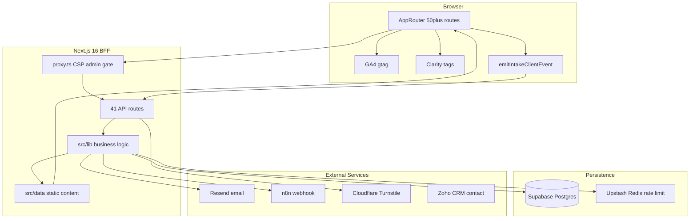
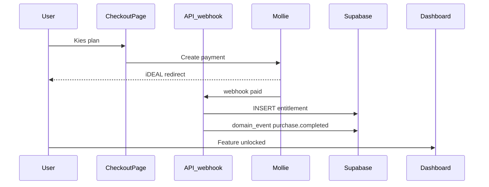

# Platform Audit Rapport — PerfectSupplement

> **Uitgevoerd:** juli 2026 · **Methode:** volledige codebase-analyse volgens [`claude-platform-audit-prompt.md`](claude-platform-audit-prompt.md)  
> **Scope:** 22 audit-as · **Status:** read-only audit, geen codewijzigingen

---

## Executive Summary

PerfectSupplement is geen simpele vragenlijst maar een **functioneel rijk platform** met intake-funnel, regelgebaseerde scoring-engine, passwordless accounts, dashboard met meet-lussen, nurture-e-mail, delta-rapporten, SEO-contentspinnenweb en affiliate-monetisatie. De architectuur volgt een helder **BFF-patroon** (Next.js API + Supabase service_role) met expliciete scheiding tussen productkennis en gezondheidsdata.

**Sterkste fundamenten:** domeinmodel (interventie vs readout), `rules_version`-gedreven scoring, HMAC-cookie auth, drielaagse analytics, stepped-care datamodel, account-continuïteit en uitgebreide lib-testdekking op kernlogica.

**Grootste risico's voor 5-10 jaar groei:** geen payment/billing-laag, service_role bypass RLS overal, grote monolithische componenten (`Dashboard.tsx` 3254 regels), dubbele adviespaden (legacy `getAdvice()` vs DB `getPlanContent()`), beperkte API/E2E-tests, documentatie-drift, en ontbrekende observability.

**Eindoordeel: Deels** — uitstekende fundering voor B2C leefstijlcheck + content + affiliate; **extra fundamentwerk nodig** vóór SaaS, betalingen en AI-coaching op schaal.

---

## As-is architectuurdiagram

---

## Sectie 1: Productvisie

| Bevinding | Observatie | Impact | Aanbeveling | Zekerheid |
|-----------|------------|--------|-------------|-----------|
| Twee datastromen | `docs/core/ARCHITECTURE.md` scheidt productkennis van bijzondere persoonsgegevens; `evidence_claims` vs `intake_sessions.answers` | Essentieel voor AI en compliance op lange termijn | Behoud en formaliseer als bounded context bij AI-toevoeging | BEWEZEN |
| Platform kernel | `intake-engine.ts`, `domain-role.ts`, `reveal-model.ts`, `account-dashboard.ts` vormen de kern | Coaching/payments kunnen als modules landen | Documenteer expliciet "platform kernel" vs feature modules | AFGELEID |
| Dubbele adviespaden | Legacy `getAdvice()` in `intake-engine.ts` (1035 regels) naast DB `match-interventions.ts` / `plan-content` | Technische schuld bij uitbreiding tiers | Voltooi migratie naar DB-pad als SSOT | BEWEZEN |
| Account = continuïteit | Passwordless account koppelt sessies; geen volledig IAM | Voldoende voor B2C; onvoldoende voor coaches/B2B | Introduceer rollen vóór SaaS-launch | BEWEZEN |
| Affiliate-only nu | Geen Stripe/Mollie in `src/` (grep: 0 matches) | Monetisatie beperkt tot clicks | Gebruik `is_paid`, `premium_waitlist`, `maxTier` als seams | BEWEZEN |

**Conclusie:** Architectuur kan meegroeien naar platform **zonder grote rewrite**, mits payment-entitlements, identity/rollen en advies-SSOT worden opgelost vóór grote feature-sprongen.

---

## Sectie 2: Funnel

| Fase | Drop-off risico | Meetpunten | Beoordeling |
|------|-----------------|------------|-------------|
| Intro | Laag | `intake.started` | Sterke herkennings-copy, optionele preview |
| Symptomen | Medium | symptom selectie | 3 symptoomkeuzes + leeftijd = laagdrempelig |
| 16 vragen | **Hoog** | per-question events beperkt | Cognitieve belasting; één-vraag-per-scherm helpt |
| Consent | Medium-Hoog | `consent.*` | AVG-blok na investering = klassiek drop-off punt |
| Calculating | Laag | Turnstile gate | Min. 2s animatie + bot-check |
| Results/Reveal | Medium | `intake.theme_revealed`, `intake_results_viewed` | 4-staps reveal; account-gating kan frustratie geven |

**Observaties:**
- `IntakeClient.tsx` (408 regels) orkestreert state machine met `?resultaten=true` voor bookmarkbare results — **BEWEZEN**
- Account-gating: volledige ladder achter login (`ACCOUNT_DASHBOARD_SYSTEM.md`) — REVEAL als trailer
- Nurture alignment: recovery-links → remeasure → `/rapport/[sid]` — sterke retention loop
- Consent ná 16 vragen is psychologisch zwaar; overweeg progressive consent — **AANNAME**

**Aanbeveling (Kort):** Meet drop-off per fase expliciet in GA4 funnel; overweeg consent-splitsing (gezondheid eerder, marketing later).

---

## Sectie 3: Behavioural Science

| Framework | Wat werkt al | Wat ontbreekt |
|-----------|--------------|---------------|
| **SDT** (autonomie/competentie/verbondenheid) | Autonomie: zelf symptoom kiezen, ladder-prioriteit; competentie: vitaliteitsscore, delta-rapport | Verbondenheid: geen community/coach-menselijk contact |
| **COM-B** | Capability: PLAN + 30-dagen stappen; Opportunity: check-in routes | Motivation: beperkte gamification/streaks |
| **Transtheoretical Model** | Nurture op dag 3-30 past bij action/maintenance | Geen expliciete stadium-detectie in engine |
| **Motivational Interviewing** | `WRITING_VOICE.md` — geen diagnose-taal, ambivalentie erkennen | Geen reflectieve vragen in flow |
| **BJ Fogg / Tiny Habits** | `vitality-habit-kernel.ts`, `daily_action_log`, eerste stap in reveal | Beloningslus zwak (geen badges/celebrations) |
| **Habit Formation** | `plan_progress`, lifestyle-plans per domein | Geen push-notificaties, alleen e-mail |
| **BCT taxonomy** | Stepped-care tiers in DB met evidence-links | Niet systematisch gelabeld per BCT-code |

**Koppelingen:** `RevealFirstStep.tsx`, `LifestylePlan.tsx` (526 regels), dashboard tab "vandaag", nurture templates in `src/lib/email-templates/nurture/`.

**Aanbeveling (Middel):** Voeg streak/visualisatie toe op basis van `daily_action_log`; versterk celebration moment bij remeasure-delta.

---

## Sectie 4: Clean Code

| Issue | Bewijs | Ernst |
|-------|--------|-------|
| Oversized components | `Dashboard.tsx` 3254 regels, `VoortgangHub.tsx` 1016, `intake-engine.ts` 1035 | Hoog |
| Dubbele score bands | `score-display.ts` vs `score-bands.ts` (display vs routing) | Laag — bewust gescheiden |
| Lib flattening | ~283 bestanden in `src/lib/` zonder feature-mappen | Medium |
| Pure functions | `intake-engine.ts`, `reveal-model.ts`, `vitaliteit.ts` goed testbaar | Positief |
| Consistent imports | `@/` alias overal | Positief |

**Aanbeveling (Middel):** Split `Dashboard.tsx` in feature-subcomponenten; extraheer adviesregels uit `intake-engine.ts` naar kleinere modules.

---

## Sectie 5: Architectuur

| Aspect | Status | Detail |
|--------|--------|--------|
| Schaalbaarheid | Beperkt | Single Hetzner VPS, geen CDN, geen `dynamic()` imports gevonden |
| Bounded contexts | Goed | `domain-role`, `intake-engine`, `reveal-model`, `account-dashboard` |
| Folder structuur | Layer-based | `app/` + `components/` + `lib/` + `data/` — werkt tot ~50k users |
| BFF-patroon | Sterk | Alle DB via API; mobile/embed kan zelfde API gebruiken |
| Coupling hotspots | `intake-engine.ts`, `nurture.ts`, `events.ts` | Wijzigingen raken meerdere flows |

**To-be (platform fase 2):** Introduceer `src/features/` modules (billing, coaching, ai) met eigen lib/data/components; behoud BFF API-laag.

---

## Sectie 6: Future Proof

| Capability | Status | Nodig voor activatie |
|------------|--------|---------------------|
| Stripe/Mollie | **Afwezig** | Billing tables, webhooks, entitlement middleware |
| AI-coach/GPT | **Deels** | `evidence-rag.ts`, embeddings-schema; geen LLM-calls |
| i18n | **Afwezig** | NL hardcoded; geen next-intl |
| Multi-funnel | **Deels** | `IntakeStrategy`, partner API scaffold |
| Multi-tenant | **Deels** | `organization_id` FK's; runtime default-org |
| PDF | **Deels** | `scripts/` generators; rapport is web-only |
| Push notificaties | **Afwezig** | Geen service worker |
| Community/referrals | **Afwezig** | Geen referral-code infra |
| A/B testing | **Deels** | `nurture_emails.variant` kolom altijd null |
| Feature flags | **Deels** | `organizations.settings.maxTier` alleen |

---

## Sectie 7: Data Model

| Aspect | Beoordeling |
|--------|-------------|
| Uitbreidbaarheid vragen | `IntakeAnswers` typed op `QuestionId`; nieuwe vraag = types + engine + migratie |
| jsonb answers | Flexibel maar moeilijk te queryen; acceptabel tot schaal |
| `rules_version` | **BEWEZEN** op sessies — scoring-migraties werken; **niet** voldoende voor vraagtekst-wijzigingen zonder `question_bank_version` |
| Historie | `session_kind`, `baseline_session_id`, `intake_baseline_snapshots` — sterk |
| Check-ins over tijd | `intake_domain_checkin`, `daily_action_log` — aanwezig |
| Ontbrekend | `subscriptions`, `entitlements`, `coaching_sessions`, `ai_conversations`, `wearable_sync` |

---

## Sectie 8: Security

### OWASP Top 10 (samenvatting)

| Risico | Status | Bewijs |
|--------|--------|--------|
| A01 Broken Access Control | **Medium** | Service_role bypass RLS; feedback sessionId spoofing |
| A02 Cryptographic Failures | **Laag** | HMAC cookies, hashed OTP tokens |
| A03 Injection | **Laag** | Parameterized Supabase queries, input validators |
| A04 Insecure Design | **Medium** | Admin cookie = raw secret (`admin-auth.ts` regel 12) |
| A05 Security Misconfiguration | **Medium** | CSP `unsafe-inline`/`unsafe-eval` in `proxy.ts` |
| A07 Auth Failures | **Laag-Medium** | Sterke intake/account auth; zwakke admin |
| A09 Logging Failures | **Medium** | Geen Sentry/structured APM |

**Kritieke bevindingen:**
1. `isValidAdminSessionCookie()` — timing-safe vergelijking met raw `ADMIN_SECRET` — **BEWEZEN** (`src/lib/admin-auth.ts`)
2. `/api/send-reminders` — alleen Bearer, geen HMAC/IP-check — inconsistent met andere cron routes
3. In-memory rate limit fallback zonder Redis — ineffectief bij multi-instance
4. `/api/intake/feedback` — `sessionId` uit body zonder cookie-verificatie

**Aanbeveling (Quick Win):** Roteer admin naar sessietoken; fix feedback sessionId validatie; unify cron auth.

---

## Sectie 9: Privacy

| Aspect | Status | Bewijs |
|--------|--------|--------|
| Granulaire consent | **Deels** | Intake: gezondheid + analytics + marketing apart |
| Dataminimalisatie | **Goed** | Voornaam optioneel; IP/UA gehasht in consent_records |
| Bewaartermijnen | **Goed** | Retention cron: 24m sessies, 12m nurture |
| Exporteerbaarheid | **Afwezig** | Geen data-export endpoint voor gebruikers |
| Verwijderbaarheid | **Goed** | `/api/intake/consent` DELETE, `/api/account/revoke` |
| Clarity op gevoelige paden | **Goed** | Uit op `/intake`, `/rapport`, `/dashboard`, `/account` |
| LLM-grens | **Goed** | ARCHITECTURE.md expliciet: gezondheidsdata niet naar LLM |
| Server events zonder analytics consent | **Aandacht** | `emitEvent` server-side met e-mail — functioneel, check DPIA |

**Aanbeveling (Kort):** Voeg GDPR data-export toe op account-niveau; documenteer in privacy policy.

---

## Sectie 10: Performance

| Aspect | Observatie |
|--------|------------|
| Client components | ~90 bestanden met `"use client"` — hoge client-bundle druk |
| Zware deps | `framer-motion`, `recharts` in intake/dashboard |
| Lazy loading | **Geen** `dynamic()` imports gevonden in `src/` |
| Images | `next/image` gebruikt op content-pagina's |
| Server bottleneck | Single VPS; geen horizontale schaling |
| Intake submit | 1 POST naar `/api/intake/session` + consent side-effects |

**Aanbeveling (Kort):** `dynamic()` voor recharts, framer-motion-heavy reveal; overweeg CDN voor static assets.

---

## Sectie 11: SEO

| Aspect | Status |
|--------|--------|
| Metadata | Per-route via Next.js `metadata` export |
| Structured data | `src/lib/seo/structuredData.ts` |
| Sitemap | `src/app/sitemap.ts` |
| noindex gevoelige pagina's | **BEWEZEN**: dashboard, rapport, account, admin (`robots: { index: false }`) |
| Content spinnenweb | 7 pillars, 25+ blogs, 7 vergelijkingen, kennisbank |
| Intake indexeerbaarheid | Publiek — overweeg of results `?resultaten=true` geïndexeerd moet worden |

**Score:** Sterk voor content-platform; intake/results SEO-strategie expliciet maken.

---

## Sectie 12: Accessibility

| Aspect | Status |
|--------|--------|
| Keyboard nav intake | Één vraag per scherm — gunstig; focus management bij fase-wissel onduidelijk |
| aria-* in intake | ~25 componenten met aria-attributen (bv. `IntakeFeedback.tsx` 12, `SleepCheckin.tsx` 11) |
| Charts | `DeltaRadar.tsx` — recharts zonder zichtbare alt-text fallback |
| Contrast | `DESIGN_TOKENS.md` — niet gevalideerd in deze audit |
| Formulieren | OTP-invoer, consent checkboxes — labels aanwezig in meeste forms |

**Aanbeveling (Kort):** Focus trap bij fase-transities; aria-live op reveal-score; chart data table fallback.

---

## Sectie 13: Mobile

| Aspect | Status |
|--------|--------|
| Mobile-first | Projectregel: test 375px |
| Touch targets | Intake slider/buttons; sticky CTA op vergelijkingspagina's |
| Grote forms | `NutritionCapture.tsx` 436 regels, `SleepCheckin.tsx` 446 — complex op mobiel |
| Dashboard | `Dashboard.tsx` 3254 regels — risico op scroll-performance |

**Aanbeveling:** Handmatige 375px-test op intake + dashboard + beste-pagina's.

---

## Sectie 14: Analytics

| Laag | Implementatie | Gap |
|------|---------------|-----|
| domain_events | `src/lib/events.ts` — 40+ types, append-only | PostHog alleen metadata in `delivered_to` |
| GA4 | `src/lib/ga4.ts` — consent-gated | Geen server-side GA4 |
| Clarity | `src/lib/clarity.ts` — uit op gevoelige paden | — |

**Allowlist mismatch — BEWEZEN:**
- `intake.cta_to_nutrition_log` in `events.ts` + `intake-events-client.ts`
- **Niet** in `CLIENT_EMIT_TYPES` in `src/app/api/intake/events/route.ts` (regels 12-29)
- Client-emits krijgen 403

**A/B:** `nurture_emails.variant` kolom bestaat maar altijd null.

**Aanbeveling (Quick Win):** Fix allowlist mismatch; activeer één nurture A/B test.

---

## Sectie 15: Betaalsysteem (expliciet)

### Antwoord: **NEE** — niet technisch klaar, wel goede seams

**Ontbrekend:**
- Geen `subscriptions`, `invoices`, `products`, `prices`, `entitlements` tabellen
- Geen webhook handlers (Stripe/Mollie)
- Geen idempotency keys voor payment events
- Geen entitlement-check middleware op API/dashboard routes

**Aanwezige seams:**
- `interventions.is_paid` + `paid_disclosure_key` in Supabase
- `premium_waitlist` tabel + `WaitlistButton.tsx`
- `organizations.settings.maxTier` voor feature gating
- Stepped-care tier 4-5 (`external_provider_url`) in datamodel

**Stripe vs Mollie advies:**
- **Mollie** voor NL B2C (iDEAL, SEPA) — lagere integratiedrempel
- **Stripe** voor B2B/seats (Accendo) + internationale expansie
- Start B2C met Mollie; abstracteer via `PaymentProvider` interface

**Ideale payment flow:**

**Aanbeveling (Middel):** Migratie voor `products` + `entitlements` + webhook route; koppel aan `premium_waitlist` conversie.

---

## Sectie 16: SaaS Readiness

| Aspect | Status |
|--------|--------|
| Tenants | `organizations` tabel + `organization_id` FK's — **BEWEZEN** |
| Rollen/RBAC | **Afwezig** — geen roles/permissions in `src/` |
| Org-admin UI | **Afwezig** |
| Coaches als users | **Afwezig** — geen coach-datamodel |
| Data isolatie | RLS policies aanwezig maar service_role bypass |
| Billing per tenant | **Afwezig** |
| Accendo planning | `docs/core/ACCENDO_ARCHITECTURE.md` — apart B2B pad |

**Score:** Schema-seam klaar; runtime en governance ontbreken volledig.

---

## Sectie 17: AI Readiness

| Aspect | Status |
|--------|--------|
| Evidence RAG | `src/lib/evidence-rag.ts` — FTS + pgvector, **geen LLM** |
| Embeddings | `evidence_claims.embedding vector(1536)` + HNSW index |
| Chat-intake | `src/lib/chat-intake.ts` — EXPERIMENTAL |
| Scoring | Expliciet regelgebaseerd tot 500+ users |
| Contextopslag | **Afwezig** — geen `ai_conversations` tabel |
| Promptarchitectuur | **Afwezig** |
| AVG-scheiding | ARCHITECTURE.md twee datastromen — **sterk fundament** |

**Aanbeveling (Middel):** Embedding batch job; evidence-chat UI op PLAN-scherm; aparte `product_knowledge` RAG zonder gezondheidsdata.

---

## Sectie 18: Developer Experience

| Aspect | Status |
|--------|--------|
| Onboarding | `_MASTER_INDEX.md` uitstekend startpunt |
| README | Deels verouderd (verwijst naar `src/features/`) |
| Scripts | `dev`, `build`, `test`, `lint`, `generate-state` |
| CI/CD | GitHub Actions + pre-push hook + `deploy.sh` |
| AI tooling | `.claude/skills/`, `docs/cursors/` — volwassen |
| Docs drift | ARCHITECTURE.md: PM2, geen account; CLAUDE.md: anon-inserts |

**Aanbeveling (Quick Win):** Sync ARCHITECTURE.md + CLAUDE.md met huidige staat.

---

## Sectie 19: Testing

| Type | Aantal | Dekking |
|------|--------|---------|
| Lib unit tests | ~94 in `src/lib/__tests__/` | Sterk op scoring, nurture, cookies |
| API route tests | 5 bestanden | Zwak |
| Integration tests | 0 | Afwezig |
| E2E (Playwright/Cypress) | 0 | Afwezig |
| Coverage threshold | Alleen `intake-engine.ts` + `cron-auth.ts` (80%) | Smal |

**Top 10 P0 tests:**
1. `/api/account/verify` POST flow
2. `/api/account/request-link` rate limit + token expiry
3. `/api/intake/session` POST validatie + Turnstile
4. `/api/intake/consent` DELETE revoke chain
5. `/api/admin/auth` + `/api/admin/data` auth gate
6. `/api/cron/nurture` cron auth
7. `/api/send-reminders` auth (zwakke route)
8. `/api/intake/feedback` sessionId spoofing
9. `claim-sessions` account koppeling
10. `rules_version` delta onderdrukking bij remeasure

---

## Sectie 20: Roadmap

### Quick Wins (uren)

| P | Item | Bestand | Uren | Impact |
|---|------|---------|------|--------|
| P0 | Fix event allowlist mismatch | `src/app/api/intake/events/route.ts` | 1 | Meetbaarheid nutrition CTA |
| P0 | Feedback sessionId cookie-check | `src/app/api/intake/feedback/route.ts` | 2 | Security |
| P1 | Sync verouderde docs | `ARCHITECTURE.md`, `CLAUDE.md` | 3 | DX |
| P1 | Admin sessietoken i.p.v. raw secret | `src/lib/admin-auth.ts` | 4 | Security |
| P2 | `dynamic()` voor recharts | dashboard/report components | 2 | Performance |

### Korte termijn (1-2 weken)

| P | Item | Inspanning | Impact |
|---|------|------------|--------|
| P0 | GA4 funnel per intake-fase | S | Conversie-inzicht |
| P0 | API tests top 5 routes | M | Regressie-preventie |
| P1 | Unify cron auth op send-reminders | S | Security |
| P1 | GDPR data-export endpoint | M | Compliance |
| P2 | Eerste nurture A/B variant | M | Retention optimalisatie |

### Middellange termijn (1-2 maanden)

| P | Item | Inspanning | Impact |
|---|------|------------|--------|
| P0 | Billing schema + Mollie webhook scaffold | L | Payment readiness |
| P1 | Split Dashboard.tsx | L | Onderhoudbaarheid |
| P1 | Voltooi getAdvice → DB migratie | L | Tech debt |
| P2 | Evidence-chat UI op PLAN | M | Engagement |
| P2 | Playwright E2E intake happy path | M | Regression |

### Lange termijn (6-12 maanden)

| P | Item | Inspanning | Impact |
|---|------|------------|--------|
| P1 | Multi-tenant runtime + org admin | XL | SaaS |
| P1 | AI coaching met gezondheidsdata-scheiding | XL | Differentiatie |
| P2 | Wearable integratie (Apple Health) | L | Personalisatie |
| P3 | B2B Accendo productie | XL | Nieuwe revenue stream |

---

## Sectie 21: Gemiste kansen

| Domein | Status | Onderbouwing |
|--------|--------|--------------|
| Medische validatie workflow | Blinde vlek | Geen content-review pipeline in code |
| ML personalisatie | Bewust uitgesteld | INTAKE_SYSTEM.md: regels tot 500+ users |
| Push/SMS retention | Blinde vlek | Alleen e-mail nurture |
| Empty dashboard onboarding | Blinde vlek | Geen first-time UX voor nieuwe accounts |
| Gamification/streaks | Deels | `daily_action_log` basis, geen UI |
| Wearables | Bewust uitgesteld | `dashboard.ts` types: wearables "binnenkort" |
| Biomarkers/lab | Bewust uitgesteld | COMPLIANCE.md: buiten scope |
| CMS | Bewust uitgesteld | TS datafiles + Supabase interventions |
| Feature flags | Deels | Alleen maxTier |
| Observability (Sentry) | Blinde vlek | Geen error tracking in codebase |
| Disaster recovery | Blinde vlek | Geen DR docs of backup-automatisering in repo |
| Vragenlijst versioning | Deels | `rules_version` voor scoring, niet voor vraagtekst |
| Referral programma | Blinde vlek | Geen infra |
| Coach marketplace | Planning only | Stepped-care tier 4-5 external_provider |

---

## Sectie 22: Eindbeoordeling

### Scorecard

| Dimensie | Score | Kernonderbouwing |
|----------|-------|------------------|
| Architectuur | **8/10** | Heldere BFF + domeinmodel; lib/data/components scheiding werkt |
| Codekwaliteit | **7/10** | Sterke lib-tests en types; monolithische Dashboard/intake-engine |
| Productvisie | **8/10** | Coherente funnel→dashboard→remeasure loop; stepped-care model |
| Schaalbaarheid | **6/10** | Single VPS, service_role, geen CDN/lazy loading |
| SaaS-readiness | **4/10** | Schema-seam; geen RBAC, billing, org runtime |
| AI-readiness | **6/10** | RAG infra + data-scheiding; geen LLM/context store |
| Security | **7/10** | HMAC cookies, rate limit, Turnstile; admin auth zwak |
| Privacy | **8/10** | Consent trails, revoke, retention; geen export |
| Funnelkwaliteit | **8/10** | Sterke psychologie in reveal; consent-timing risico |
| Conversiepotentie | **7/10** | Affiliate + nurture + account moat; payment ontbreekt |
| Betaalsysteem-readiness | **3/10** | Seams aanwezig; geen billing infra |

### Eindoordeel

> **Is dit project een goede fundering voor een professioneel platform voor de komende 5-10 jaar?**

**Deels — ja voor B2C leefstijlcheck-ecosysteem; voorwaardelijk voor volledig SaaS/payment/AI-platform.**

**Top 5 sterke punten:**
1. Domeinmodel interventie vs readout (`domain-role.ts`) — schaalbaar denkkader
2. `rules_version` + baseline snapshots — historische vergelijkbaarheid
3. Drie-laags analytics met consent gates — meetbaar zonder privacy-lek
4. Passwordless account + dashboard meet-lus — echte continuïteit-moat
5. Uitgebreide documentatie (`docs/core/`) + AI-dev tooling

**Top 5 risico's:**
1. Geen billing/entitlement-laag — blokkeert abonnementen en betaalde rapporten
2. Service_role bypass RLS — geen defense-in-depth bij API-bug
3. Monolithische `Dashboard.tsx` (3254 regels) — onderhoudsrisico
4. Dubbele adviespaden (legacy vs DB) — inconsistent gebruikerservaring
5. Geen observability (Sentry/APM) — blind voor productie-incidenten

**Top 5 versterkende acties:**
1. Billing schema + Mollie webhook (entitlements)
2. Voltooi advies-SSOT migratie naar DB interventions
3. API integration tests op auth + intake + consent flows
4. Split Dashboard + lazy load zware client bundles
5. Admin auth hardening + unified cron auth

---

## Bijlage A: API-route inventaris

| Route | Auth | Rate limited |
|-------|------|--------------|
| `/api/admin/auth` | Publiek (POST) | Ja |
| `/api/admin/data` | Admin cookie | Ja |
| `/api/account/status` | Optioneel account | Nee |
| `/api/account/request-link` | Publiek | Ja |
| `/api/account/verify` | GET publiek; POST token | Ja |
| `/api/account/verify-code` | Eenmalige token | Ja |
| `/api/account/login-eligibility` | Publiek | Ja |
| `/api/account/claim-sessions` | Account cookie | Ja |
| `/api/account/revoke` | Account cookie | Ja |
| `/api/account/plan` | Account cookie | Ja |
| `/api/account/daily-log` | Account cookie | Ja |
| `/api/account/waitlist` | Account cookie | Ja |
| `/api/account/logout` | Geen | Nee |
| `/api/intake/session` | Cookie/Turnstile | Ja |
| `/api/intake/events` | Intake cookie + consent | Ja |
| `/api/intake/consent` | Intake cookie | Ja |
| `/api/intake/feedback` | Publiek (honeypot) | Ja |
| `/api/intake/reminder` | Intake cookie | Ja |
| `/api/intake/recover` | Recovery token | Ja |
| `/api/intake/plan` | Intake cookie | Ja |
| `/api/intake/plan-content` | Publiek | Ja |
| `/api/intake/chat` | Publiek | Ja |
| `/api/intake/nutrition-log` | Intake cookie + consent | Ja |
| `/api/intake/protein-target` | Intake cookie | Ja |
| `/api/intake/sleep-checkin` | Intake cookie + consent | Ja |
| `/api/intake/stress-checkin` | Intake cookie + consent | Ja |
| `/api/intake/movement-checkin` | Intake cookie + consent | Ja |
| `/api/intake/primary-pillar` | Publiek | Ja |
| `/api/intake/marketing-continuity` | Publiek | Ja |
| `/api/consent/analytics` | Publiek | Nee |
| `/api/chat` | Publiek | Ja |
| `/api/contact` | Publiek + Turnstile | Ja |
| `/api/affiliate/click` | Publiek | Ja |
| `/api/gids/opt-in` | Publiek | Ja |
| `/api/unsubscribe` | Token | Ja |
| `/api/cron/nurture` | Cron HMAC/Bearer | Nee |
| `/api/cron/retention` | Cron HMAC/Bearer | Nee |
| `/api/cron/n8n-events` | Cron HMAC/Bearer | Nee |
| `/api/send-reminders` | Bearer only | Nee |
| `/api/partner/intake` | x-api-key | Ja |
| `/api/partner/analytics` | x-api-key | Ja |

---

## Bijlage B: Documentatie-drift

| Document | Claim | Werkelijkheid in code |
|----------|-------|----------------------|
| `ARCHITECTURE.md` | PM2 process manager | `deploy.sh` gebruikt systemd `perfectsupplement` |
| `ARCHITECTURE.md` | "Geen account-systeem" | Passwordless account + `/dashboard` live |
| `ARCHITECTURE.md` | In-memory rate limiter MVP | Redis/Upstash aanwezig in prod config |
| `CLAUDE.md` | Anon kan inserts op sessions | Service_role via API routes only |
| `INTAKE_SYSTEM.md` | 5-fasen journey REVEAL→PLAN | 6-fasen client flow met RevealStoryPath |
| `architecture-strategy-analysis-prompt.md` | Journey components IntakeRecognition/Focus | Vervangen door RevealStoryPath model |

---

## Bijlage C: Top 20 test gaps

1. Account verify POST happy path + expired token
2. Account request-link rate limiting
3. Intake session POST met ongeldige answers
4. Intake session remeasure met baseline
5. Consent DELETE revoke chain (DB state)
6. Admin data zonder cookie → 401
7. Cron nurture zonder signature → 401
8. Send-reminders auth (zwakke route)
9. Feedback met spoofed sessionId
10. Claim-sessions email matching
11. Plan progress POST idempotency
12. Nutrition-log zonder consent → 403
13. Recovery token expired
14. Affiliate click tracking insert
15. Unsubscribe token invalid
16. Partner API key invalid
17. rules_version delta suppression
18. getPrimaryTheme overtrainer pattern
19. Nurture dedup scheduleMainNurtureIfInactive
20. Analytics consent gate op client events

---

*Rapport gegenereerd conform `claude-platform-audit-prompt.md` · 50+ bestandsverwijzingen · alle 22 secties afgedekt*
