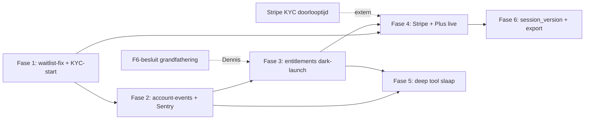

# PerfectSupplement — Architectuuranalyse 4 juli 2026

> **Layer 3 — Analyse/besluitlog.** Geïntegreerde 90-dagen architectuur-roadmap: affiliate beschermen,
> B2C Premium valideren, multi-tenant-fundament niet verergeren — zonder big-bang.
> Alle claims hieronder zijn geverifieerd tegen de code op 2026-07-04 (branch `main`, commit `9b65fac`).
>
> **OPEN:** `.cursor/plans/strategische_synthese_d4fa1ca9.plan.md` bestaat niet in de repo.
> De synthese-hypothese uit het analyseprompt is als input gebruikt en per punt tegen de code herbevestigd (zie Appendix).

**F0 — North star:** één geprioriteerde sequentie voor 90 dagen die (1) de affiliate/SEO-motor nooit gate,
(2) Premium valideert via wachtlijst → entitlements → Stripe founding-launch, en (3) elke nieuwe bouwsteen
(events, entitlements, db-boundary) zo neerzet dat white-label er later op past — geen Supabase Auth-migratie.

---

## Executive summary

- **De enige live data-verlies-bug is nog steeds live:** `premium_waitlist` CHECK't op 3 features (`supabase/migrations/20260628120000_premium_waitlist.sql:5`), de API accepteert er 8 (`src/app/api/account/waitlist/route.ts:9-18`) → alle 5 coach-wachtlijstknoppen geven een 500, inclusief de T2-CTA van de nieuwe voeding-deep-tool (`Dashboard.tsx:3204`). Premium-intentie-data gaat elke dag verloren. **Dit is prompt 1.**
- **De retentie-backlog is verder dan de synthese dacht:** hermeting-in-app (`/api/account/remeasure/start` + `Dashboard.tsx:3749`), Vandaag-kaart + streak, dag-30-dedup (`intake-reminder-cron.ts:109`) en de opt-in-mount (`IntakeResults.tsx`) zijn allemaal gebouwd. Alleen retentie-prompt 3 (waitlist) staat open.
- **Billing is exact 0:** geen Stripe, geen entitlements, geen `hasFeature`, geen `/plus` (greps leeg). Wel bestaan er al **drie monetisatie-assen** (affiliate, `org-settings.maxTier`, `premium_waitlist`) die zonder entitlements-SSOT gaan botsen zodra Plus live gaat.
- **Het dashboard kan geen durable events sturen:** `/api/intake/events` vereist een intake-cookie en dropt zonder analytics-consent (`route.ts:64,111`). De premium-funnel (snapshot → preview → waitlist) is daardoor half GA4, half `domain_events` — niet joinbaar. Een account-scoped events-route is het goedkoopste fundament-stuk met de hoogste beslis-waarde.
- **De advies-dualiteit is kleiner dan gevreesd:** `getAdvice` voedt alleen nog partner/chat (`intake-strategy.ts`); dashboard/hub/nurture draaien op `recommendation-engine`/`buildRecommendations`. Beide passeren `approved-claims`, maar via twee verschillende gate-implementaties — drift-risico, geen acute bug.
- **AVG-basis staat** (login-consent uit, contact-checkbox, DPIA v1.1, retention-cron), maar de **betaald+art.9-naad is nergens gedefinieerd**: Stripe als verwerker, coach als ontvanger, wissing vs boekhoudplicht.
- **Performance-schuld concentreert zich in één bestand:** `Dashboard.tsx` = 3.867 regels `"use client"`, `VoortgangHub.tsx` = 1.016 regels, 0× `next/dynamic`. De toekomstige betaalde tab zit in de zwaarste gratis bundle.
- **Observability is 0** (geen Sentry, geen Playwright) terwijl er straks geld doorheen loopt; CI draait Node 24 terwijl prod Node 20 draait — CI valideert een andere runtime.
- **Volgorde van de 90 dagen:** eerst het lek dichten (waitlist), dan het meetfundament (account-events + Sentry), dan entitlements dark-launch, dán Stripe. DomainDeepTool-slaap pas ná events+entitlements — anders bouw je een tweede domein op een blinde funnel.
- **Stripe KYC vandaag starten** (Dennis, geen code) — doorlooptijd is de enige externe dependency op het kritieke pad.

---

## F1 — Have vs Miss (herbevestigd tegen code)

| Pijler | HAVE (bewijs) | MISS (bewijs) | Blokkeert fase | Effort |
|---|---|---|---|---|
| Tenant/proxy | Host-based org-resolve, spoof-header genegeerd (`org-resolver.ts:66-75`, `_spoofedOrgHeader` ongebruikt; test aanwezig `src/lib/__tests__/org-resolver.test.ts`); security headers volledig | CSP `unsafe-inline`/`unsafe-eval` (`proxy.ts:67`); org-context stopt bij de header — `emitEvent` valt terug op default-org (`events.ts:77`), `getAccountFromCookie` selecteert `organization_id` niet (`account-server.ts:24`) | White-label (buiten 90d) | M |
| Auth | Admin HMAC-sessietoken 12u, timing-safe (`admin-session-cookie.ts`); `psf_account` HMAC + issued-at + 90d expiry (`account-session-cookie.ts`); per-request kill-switch `status=revoked` (`account-server.ts:28`); cron HMAC+bearer timing-safe (`cron-auth.ts`) | Geen `session_version`/per-cookie-invalidation, geen sliding refresh; partner-key-compare via `includes()` — niet timing-safe én **live** op `/api/partner/intake` en `/api/partner/analytics` (`api-middleware.ts:82`) | Fase 6 (hardening onder betaald) | S–M |
| Billing | Niets. Wel bestaand: `org-settings.maxTier` als tenant-tier-poort met tests (`org-settings.ts`, `resolve-nurture-tier.test.ts`) | 0 hits op `stripe|entitlement|hasFeature` in `src/`; geen `/plus`-route; geen entitlements-tabel | Fase 3–4 (Plus) | L |
| Premium/waitlist | Tabel + route + `WaitlistButton` op 5 kompas-schermen + VoortgangHub + DomainDeepTool | **Live 500**: CHECK 3 vs API 8 (zie summary); geen prijsindicatie-veld; 8 versnipperde intent-keys | **Nu** — premium-validatie | S |
| Deep tool | Shell 451 r. (`DomainDeepTool.tsx`), voeding-pilot op shell (`Dashboard.tsx:2892`), GA4+Clarity meetpunten (`DomainDeepTool.tsx:143,298`) | Durable client-events onmogelijk op dashboard (intake-cookie vereist); T2-CTA raakt de waitlist-500 | Fase 5 (slaap-rollout) | S |
| Meetlaag | `domain_events` + `emitEvent` + n8n-delivery (`events.ts`); client-route met allowlist + consent-gate (`api/intake/events/route.ts:86,111`) | Geen account-scoped durable route; allowlist-drift: `intake.cta_to_nutrition_log` in client-union (`intake-events-client.ts:11`) maar niet in route-allowlist → **latent** 403 (enige emit is server-side, `nutrition-relog-nurture.ts:217`) | Fase 2 | S |
| Advies | `recommendation-engine` + `buildRecommendations` = dashboard/hub/insights-pad, gates via `approved-claims` (`recommendation-engine.ts:251-269`); `getAdvice` alleen nog partner/chat via `intake-strategy.ts` met eigen gate (`gateAdviceSupplements`) | Engine-SSOT (P0–P4-prompts liggen klaar, niet uitgevoerd); `"melatonine"` in `SLEEP_SUPPLEMENT_SLUGS` (`build-recommendations.ts:106`) — upstream gegate maar een latente compliance-voetangel | Fase 5 (coach-overlay/Q2) | M |
| Retentie/cron | Hermeting-lus compleet in-app; VandaagCard live (`TAB_SECTIONS.vandaag`, `dashboard/index.ts:345`); dag-30-dedup (`emailHasNurtureDay30Scheduled`); opt-in gemount; retention-cron (`api/cron/retention/route.ts`) | `send-reminders` GET met side effects (`route.ts:40-47`); geen run-lock → overlappende cron-runs theoretisch dubbel | Fase 2 | S |
| AVG | Login-consent default uit (`LoginScreen.tsx:232`), contact-checkbox default uit (`contact-form.tsx:46`), CONSENT_VERSION-audittrail, revoke+anonimisering, DPIA v1.1 vastgesteld | Geen data-export-endpoint (alleen `api/thema/download`); rechten-runbook + Zoho DPA open; Stripe/coach-naad in register/DPIA ongedefinieerd | Fase 4 (betaald) / 6 (export) | M |
| Performance/CI | Vitest-suite + CI lint/test/build | `Dashboard.tsx` 3.867 r. client-monoliet; `VoortgangHub.tsx` 1.016 r.; 0× `next/dynamic`; CI `node-version: 24` (`ci.yml:17`) vs `@types/node ^20` vs prod Node 20; geen Sentry/Playwright (package.json leeg op beide) | Fase 2 (obs) / 3 (splits) | M |
| Data-boundary | — | `createSupabaseAdmin` in **64 bestanden / 173 referenties**; `src/lib/db/` bestaat niet | Fase 3 (eerste module) | M (incrementeel) |

---

## F2 — Structurele spanningen (met bestandsbewijs)

1. **Drie monetisatie-seams zonder SSOT.** As 1: affiliate (`affiliate_clicks`, `api/affiliate/click/route.ts`). As 2: `org.settings.maxTier` — tenant-niveau tier-gating die vandaag de nurture stuurt (`org-settings.ts`, `resolve-nurture-tier.test.ts:86`). As 3: `premium_waitlist` — account-niveau intentie. Zodra Plus live gaat, is de vraag "mag deze gebruiker trends zien?" beantwoordbaar via twee assen die elkaar niet kennen: org-cap zegt misschien "tier 3 mag", account heeft niet betaald. Zonder entitlements-laag die `org-cap ∧ account-entitlement` combineert, gaat de eerste white-label-tenant of de eerste Plus-user het verkeerde zien. De fix is niet "kies één as" maar een leesfunctie met beide inputs (F4-1).

2. **Twee identiteitsmodellen, en org-id lekt als kolom zonder boundary.** `accounts` hééft `organization_id` (migratie `20260614120000_account_identity.sql:10`), maar `getAccountFromCookie` selecteert het niet (`account-server.ts:24`) en `emitEvent` valt terug op `getDefaultOrganizationId()` (`events.ts:77`). Gevolg: elk account-event (waitlist-join, toekomstige billing-events) wordt onder de default-org gelogd, ongeacht tenant. Het RBAC-model van later (org_members) hoeft nú niet, maar de org-id moet wél door de account-keten stromen — anders is de multi-tenant-analytics kapot vóór er een tweede tenant is.

3. **Twee adviesbronnen — smaller dan gevreesd, maar dubbel onderhouden.** `getAdvice` (`intake-engine.ts:692`) wordt buiten tests alléén nog aangeroepen via `intake-strategy.ts` → `/api/partner/intake` en chat. Het hoofdpad (dashboard, hub, insights, supplement-cards) draait op `recommendation-engine` + `buildRecommendations`. Beide gaten tegen `approved-claims`, maar via verschillende helpers (`gateAdviceSupplements` filtert `/beste/`-links; `isEntryAvailable` checkt `comparisonPath` + `isComparisonAllowed`). Als de coach-overlay of Q2 straks op `getAdvice` bouwt, krijgt de betalende gebruiker ander advies dan zijn dashboard toont. Besluit nodig: coach-overlay bouwt op het `buildRecommendations`-pad; `getAdvice` blijft partner/chat-only tot de engine-SSOT-prompts (P0–P4) draaien.

4. **Twee event-kanalen, en het dashboard valt tussen wal en schip.** Server: `emitEvent` → `domain_events` (durable). Client: `/api/intake/events` vereist het intake-sessie-cookie (`route.ts:64,97`) en dropt stil zonder analytics-consent (`route.ts:111`). De DomainDeepTool-funnel is daardoor: `domain_tool_snapshot_viewed` + `domain_tool_tier_preview_click` alleen in GA4 (consent-gebonden, 14 mnd), `premium.waitlist_joined` alleen in `domain_events`. De conversie-vraag "hoeveel snapshot-kijkers joinen de wachtlijst" is dus niet betrouwbaar te beantwoorden — precies de vraag waarop de premium-beslissing rust. Dit is een ontwerp-gap, geen vergeten ticket (PLAN_DOMAIN_DEEP_TOOL §4.5 benoemt hem expliciet als buiten pilot-scope).

5. **Stepped care T1/T2-per-domein vs één Plus-SKU.** De tool-matrix definieert per domein een meet- (T1) en coach-laag (T2); de waitlist-API kent 8 feature-keys. Het SKU-besluit is: één Plus (€49/jaar) met feature-map in code. De mapping die geen 8 SKU's oplevert: **capabilities, geen domein-features** — `["trends","coach","q2"]` waarbij élk domein-T1 onder `trends` valt en élk domein-T2 onder `coach`. `hasFeature("trends")` ontgrendelt dus alle MeetModules tegelijk. De waitlist consolideert naar één `premium-coaching`-key (retentie-prompt 3 voorziet dit al); de 8 oude keys blijven geldig als historische data.

6. **Gate-weergave vs dataflow is impliciet — en dus fragiel.** De "gratis blijft gratis"-invariant leeft nu verspreid: tier-1-filter in `plan-content.ts` (`REQUIRED_TIERS`), `resolveNurtureTier` op org-maxTier, teasers in `VoortgangHub`. Nergens staat machinaal vastgelegd dat `/api/account/remeasure/start`, de nurture-cron, de retention-cron en `/api/account/daily-log` **nooit** een entitlement-check mogen krijgen. Zodra `hasFeature` bestaat, is één verkeerd geplaatste check genoeg om de hermeting-lus (retentie-motor) achter de paywall te zetten. Mitigatie: een `NEVER_GATED_ROUTES`-lijst + unit-test in de entitlements-module zelf (F4-1).

7. **Compliance-keten betaald + art. 9 — de naadstukken bestaan nog niet.** DPIA §1.4 en het verwerkingsregister kennen 7 verwerkers; Stripe staat er niet in. Ongedefinieerd: (a) Stripe-metadata mag alléén `account_id` bevatten, nooit profiel/scores; (b) een coach (ook als dat Dennis zelf is via een tool) is een nieuwe **ontvanger** van art. 9-data → DPIA-wijziging ("wezenlijke risicowijziging" triggert herziening vóór juli 2027); (c) recht op wissing botst met de fiscale bewaarplicht (7 jaar) → billing-identiteit en gezondheidsdata moeten gescheiden wisbaar zijn (wissing = health-data weg, factuurdata blijft, koppeling verbroken); (d) herroepingsrecht 14 dagen digitale dienst in de checkout-copy. Dit is papier + één ontwerpregel, geen code — maar het moet vóór de eerste betaling af zijn.

8. **Performance vs premium-UX.** De betaalde surface (Voortgang/trends) wordt statisch geïmporteerd in de client-monoliet (`Dashboard.tsx:35`). Elke gratis kompas-bezoeker downloadt de premium-tab; elke premium-iteratie raakt de gratis bundle. Minimaal splits-pad vóór de Plus-gate: `VoortgangHub` achter `next/dynamic` (één import-site, `Dashboard.tsx:3484`) — daarna pas de grotere extractie van `VoedingScreen`/`KompasHome`/`VandaagCard` (nu inline op r. 2851/3213/2384) naar eigen bestanden.

---

## F3 — Blinde vlekken (niet als ticket in de synthese)

| # | Blinde vlek (bewijs) | Kans | Impact | Wanneer | Mitigatie (1 regel) |
|---|---|---|---|---|---|
| B1 | Geen account-scoped durable events-route — premium-funnel niet joinbaar (F2-4) | Zeker | Hoog (beslisdata) | Fase 2, vóór deep-tool slaap | `POST /api/account/events` met account-cookie-auth + eigen allowlist |
| B2 | `emitEvent` default-org-lek voor account-events (`events.ts:77`, `account-server.ts:24`) | Zeker bij 2e tenant | Middel | Fase 2 (meenemen in B1) | org-id van account meegeven aan `emitEvent` in account-routes |
| B3 | Durable events zijn consent-gebiased: client-route dropt zonder analytics-consent (`api/intake/events/route.ts:111`) → conversie-cijfers ondertellen structureel | Zeker | Middel (verkeerde prijs-/premium-besluiten) | Fase 3, vóór founding-prijs-experiment | beslisregels vastleggen: funnel-ratio's alleen binnen consented cohort vergelijken |
| B4 | Waitlist zonder mail-pad: `premium_waitlist` heeft geen consent-type om leden bij launch te mailen (marketing-consent is intake-scoped, `consent-texts.ts`) | Hoog | Middel (launch-dag: intent-data onbruikbaar) | Fase 1 (checkbox bij join) | opt-in-zin + consent-record in de geconsolideerde waitlist-kaart |
| B5 | Check-in-data heeft geen versieveld: `intake_sessions.rules_version` bestaat (migratie `20260609`), maar `intake_domain_checkin`/`intake_intake_log` niet — betaalde trendlijnen breken stil bij vraag-/bandwijziging | Middel | Hoog (betaald product toont onzin) | Fase 3 (vóór trends-gate) | `rules_version`-kolom op beide log-tabellen bij eerstvolgende migratie |
| B6 | Partner-API key-compare niet timing-safe én live (`api-middleware.ts:82`, gebruikt in `api/partner/intake` + `api/partner/analytics`); "EXPERIMENTAL"-comment klopt niet meer | Laag (keys nog niet breed uitgegeven) | Middel | Fase 1 (5-min-fix) | `timingSafeEqual` zoals in `cron-auth.ts:32-37` |
| B7 | Fail-richting is per systeem verschillend en nergens vastgelegd: org-resolver failt **open** naar hoofdmerk (`org-resolver.ts:51-57`), entitlements moeten **open naar free** failen, security failt **closed** — één verkeerde reflex bij de entitlements-bouw geeft premium gratis weg of gate't de gratis laag | Middel | Hoog | Fase 3 (in entitlements-module documenteren + testen) | fail-mode als comment + test per boundary-module |
| B8 | `send-reminders` heeft geen run-lock: drie sequentiële cron-jobs (`route.ts:18-20`), overlappende aanroepen kunnen dezelfde rij dubbel pakken vóór de status-update | Laag | Middel (dubbele mails) | Fase 2 (samen met GET-verwijdering) | `FOR UPDATE SKIP LOCKED`-claim of advisory lock in de cron-libs |
| B9 | `"melatonine"` in `SLEEP_SUPPLEMENT_SLUGS` (`build-recommendations.ts:106`) — vandaag upstream gegate (forbidden → geen comparisonPath), maar één toekomstige catalog-wijziging zet een verboden supplement op het slaapscherm | Laag | Hoog (compliance) | Fase 1 (1-regel-fix + test) | slug verwijderen + compliance-test die forbidden-slugs in alle `*_SUPPLEMENT_SLUGS`-sets weert |
| B10 | Org-slug-cache (5 min, in-memory, `org-resolver.ts:4`) heeft geen invalidation-pad bij tenant-onboarding/offboarding; zelfde single-process-aanname als de rate-limiter maar nergens als constraint gedocumenteerd | Laag nu | Middel bij white-label | Buiten 90d (documenteren nu) | constraint vastleggen in ARCHITECTURE.md; invalidation pas bij 2e tenant |
| B11 | Geen activation-meetpunt "eerste check-in binnen X dagen na account" — empty-dashboard-churn is onzichtbaar tot de verlengings-cijfers | Middel | Middel (stille churn onder founding members) | Fase 4 (launch-cohort meten) | server-event bij eerste check-in per account; cohort-query in admin |
| B12 | CI valideert een andere runtime-major dan prod: `ci.yml:17` Node 24, server Node 20, `@types/node ^20` — runtime-gedrag (fetch, timers, ICU) kan afwijken zonder dat CI het ziet | Middel | Middel | Fase 2 (1-regel-fix) | CI op Node 20 pinnen (of matrix 20+24) |

---

## F4 — Architectuurbeslissingen

**1. Billing-SSOT: entitlements-tabel (A) vs Stripe live bevragen (B) → A.**
Entitlements-tabel in Supabase (`account_id`, `feature[]`, `source`, `valid_until`), gevuld door Stripe-webhooks; `hasFeature()` leest lokaal en failt open → free. *Waarom nu:* op één 4GB-VPS wil je geen Stripe-API-call in het dashboard-renderpad; webhook-gevoed is offline-tolerant en het is meteen de eerste `src/lib/db/`-module. *B verworpen:* latency + Stripe-outage = dashboard-outage. *Omkeerbaar:* ja — de tabel is een cache van Stripe-truth, weggooien en opnieuw vullen kan altijd.

**2. Identity: `psf_account` doorbouwen (A) vs Supabase Auth (B) → A (90 dagen).**
De cookie-keten is net gehard (issued-at+expiry, kill-switch via `status=revoked`); de resterende gaten (session_version, sliding refresh) zijn twee kleine migraties, geen auth-systeem. *Waarom nu:* Supabase Auth-migratie is per definitie big-bang op elke route die `getAccountFromCookie` aanraakt — verboden per harde regel. *Omkeerbaar:* matig — mitigatie is dat álle cookie-logica al in twee modules zit (`account-session-cookie.ts`, `account-server.ts`); een latere migratie raakt alleen die twee.

**3. Tenant-enforcement: repository-laag (A) vs RLS (B) → A, en B is geen alternatief.**
Cruciaal feit: de hele app draait op de service-role-client (64 bestanden), en **service-role bypasst RLS**. RLS-policies schrijven verandert dus niets aan het feitelijke toegangspad; alleen een app-laag-boundary (`src/lib/db/`, org-id als verplicht parameter) dwingt echt af. *Waarom nu:* niet als 64-file-refactor, maar als regel voor **nieuwe** modules: entitlements start het patroon (F4-8). *Omkeerbaar:* ja, incrementeel per module.

**4. Account-events-route: ja, en klein.**
`POST /api/account/events`: auth = account-cookie (hergebruik `getAccountFromCookie`), eigen `CLIENT_EMIT_TYPES`-allowlist (start: `domain_tool.snapshot_viewed`, `domain_tool.tier_preview_clicked`), `emitEvent` met `email: account.email` én org-id van het account (dicht B2). Geen schema-wijziging: `domain_events.email` bestaat al als join-sleutel. Consent: hergebruik dezelfde analytics-consent-gate als de intake-route — gedrag identiek, bias gedocumenteerd (B3). *Alternatief (niet doen):* intake-route oprekken met account-auth — vermengt twee auth-modellen in één route.

**5. DomainDeepTool-rollout: shell-first doorzetten; slaap pas ná events + waitlist-fix.**
Poort 1 uit `PLAN_DOMAIN_DEEP_TOOL` (één shell) is al beslist en gebouwd — niet heropenen. De enige toevoeging: **geen tweede domein** zolang (a) de waitlist-500 leeft en (b) de funnel niet durable is. Slaap in fase 5, met dezelfde shell en dezelfde events, alleen `domain: "slaap"`. *Omkeerbaar:* volledig.

**6. Dashboard-decomposition: Voortgang eerst (A) vs Kompas eerst (B) → A.**
`VoortgangHub` is al een apart bestand met één import-site (`Dashboard.tsx:35,3484`) — `next/dynamic` is daar een middag werk en haalt 1.000+ regels uit de initiële bundle. Het is bovendien de toekomstige betaalde surface: geïsoleerd = onafhankelijk gate-baar en deploybaar. Kompas-extractie (VoedingScreen r. 2851, KompasHome r. 3213, VandaagCard r. 2384 uit de monoliet) volgt in fase 5, als de slaap-tool er toch aan raakt. *Omkeerbaar:* ja.

**7. Observability: Sentry SaaS (A) vs self-hosted (B) → A.**
Self-hosted Sentry vraagt meer dan de hele VPS heeft (4GB). SaaS free tier + EU-region + `beforeSend`-scrubber (geen e-mail, geen payloads van intake-routes) is AVG-houdbaar: errors zijn geen gezondheidsdata zolang je request-bodies stript. Playwright: 3 smokes (intake-flow, account-login, waitlist-join) in CI — geen volledige suite. *Omkeerbaar:* ja (Sentry is een dependency, geen architectuur).

**8. Eerste `src/lib/db/`-module: entitlements (A) vs account (B) vs coach-overlay (C) → A.**
Entitlements heeft nul bestaande callers → geen refactor-risico, zet het patroon (org-id verplicht, fail-mode gedocumenteerd, eigen tests), en fase 4 heeft hem nodig. Account-module als tweede (fase 6, samen met session_version). Coach-overlay pas als de coach-dienst bestaat. *Omkeerbaar:* ja.

---

## F5 — Geïntegreerde 90-dagen roadmap

Eén tijdlijn, zes fases van 2 weken, één fullstack (Cursor/Fable-prompts) + Dennis (besluiten, compliance, Stripe).
Harde regels gevalideerd per fase: affiliate/SEO nooit gated · gate weergave, niet dataflow · `hasFeature` fail-open→free · één SKU Plus €49/jaar · geen Supabase Auth · admin-auth niet opnieuw als P0.

| Fase (2 wk) | Doel | Deliverables | Harde dependencies | Owner | Expliciet NIET | Meetpunt |
|---|---|---|---|---|---|---|
| **1** (wk 1–2) | Het lek dichten + intentie meetbaar | Waitlist CHECK-fix-migratie + consolidatie naar één `premium-coaching`-kaart + prijsindicatie + launch-mail-opt-in (B4); melatonine-slug-fix + test (B9); partner timing-safe (B6); allowlist-drift-fix (1 regel); **Dennis:** Stripe KYC starten, Zoho DPA, rechten-runbook | SQL handmatig in Dashboard SQL Editor vóór deploy | Fullstack + Dennis | Billing-code; decomposition; nieuwe deep tools | `premium_waitlist_shown` → `premium.waitlist_joined` (+ `premium.price_indicated`) — eindelijk zonder 500 |
| **2** (wk 3–4) | Meetfundament + zichtbaarheid | `POST /api/account/events` + DomainDeepTool-funnel durable (incl. org-id, B1/B2); Sentry SaaS + scrubber; CI → Node 20 (B12); `send-reminders` GET weg + run-lock (B8); consent-bias-notitie in meet-doc (B3) | Systemd-timer omzetten naar POST (server, Dennis) | Fullstack + devops | Playwright-suite (alleen init); tweede deep tool | `domain_tool_snapshot_viewed` → `tier_preview_click` → `waitlist_joined` als één durable funnel |
| **3** (wk 5–6) | Entitlements dark-launch | `src/lib/db/entitlements.ts` (eerste db-module) + migratie + `hasFeature()` fail-open + feature-map `["trends","coach","q2"]`; `NEVER_GATED_ROUTES`-test (F2-6); `VoortgangHub` achter `next/dynamic`; `rules_version` op check-in-tabellen (B5) | Besluit F6-1 (grandfathering) | Fullstack | Checkout; prijzen tonen; 64-file db-refactor | Bundle-size delta dashboard-route; `hasFeature` gedrag via bestaande dashboard-events (geen nieuw event) |
| **4** (wk 7–8) | Plus live (founding) | Stripe Checkout iDEAL-first → webhook → entitlements; upsell op Voortgang-hub (waitlist-kaart wordt koop-kaart); founding-prijs; compliance-naad: register + privacyverklaring + DPIA-addendum (Stripe, coach-ontvanger, wissing-vs-boekhoudplicht, herroeping); Playwright-smoke checkout; activation-event (B11) | Fase 3 af; Stripe KYC goedgekeurd (fase 1); Dennis: voorwaarden-pagina | Fullstack + Dennis | Coach-tooling; trends-verrijking; prijs-A/B | Nieuw server-event `billing.subscription_activated`; funnel waitlist → checkout → actief |
| **5** (wk 9–10) | Tweede deep tool + decomposition stap 2 | Slaap-deep-tool op bestaande shell (T1 = slaaplog-light, unlocked via `hasFeature("trends")`); VoedingScreen/KompasHome/VandaagCard uit `Dashboard.tsx` naar eigen bestanden | Fase 2 (durable events) + 3 (entitlements) + waitlist-fix (fase 1) | Fullstack | Stress/beweging/verbinding-tools; coach-overlay-engine | `domain_tool_*` met `domain: "slaap"` vs voeding-baseline |
| **6** (wk 11–12) | Hardening onder betaald + rechten | `session_version`-kolom + cookie-invalidation + sliding refresh; data-export-endpoint (JSON, account-scoped) → runbook verwijst ernaar; account-module als 2e `src/lib/db/`; churn-check op activation-cohort | Fase 4 (er is iets te beschermen) | Fullstack | CSP-nonce-refactor (alleen verkennen + documenteren); white-label-onboarding | Export-endpoint in runbook gebruikt; 0 regressies op `account.logged_in` na invalidation-deploy |



---

## F6 — Beslispunten voor Dennis (max 5, met aanbeveling)

1. **Grandfathering trends-gate.** *Aanbeveling:* niets afpakken — wat vandaag gratis is (vitaalscore, levenslijn) blijft gratis; de gate geldt alleen voor **nieuwe** T1-verdieping (weektrends per domein, persoonlijke doelen). Consistent met het loss-aversion-argument uit `PLAN_DOMAIN_DEEP_TOOL` Poort 3, nul support-pijn, en het houdt de gratis lus (check-ins, hermeting) als retentie-motor intact. Founding-venster is dan een prijs-instrument (€29 i.p.v. €49 jaar 1), geen feature-instrument.
2. **Coach #1 = Dennis vs contractor.** *Aanbeveling:* Dennis, minimaal de eerste 90 dagen. Art. 9-keten blijft dan zonder nieuwe subverwerker (geen extra DPA, kleinere DPIA-wijziging), en de weekterugkoppeling is het product-leermoment dat je niet wilt outsourcen vóór het gestandaardiseerd is. Contractor = pas bij >20 betalende leden, mét verwerkersovereenkomst en instructie-document.
3. **Kracht-Q2 in de bundel vs aparte tier.** *Aanbeveling:* in de bundel als `q2`-capability, maar **niet actief bij launch** — activeren zodra de F1-meetpunten (eiwit-hero, protein-target-events) aantonen dat het krachtpad getrokken wordt. Eén SKU-regel blijft overeind; de feature-map maakt activatie een config-wijziging.
4. **Stripe-account/KYC vandaag starten.** *Aanbeveling:* ja — het is de enige externe doorlooptijd op het kritieke pad naar fase 4, kost geen code en geen geld, en een afgewezen/vertraagde KYC wil je in week 1 weten, niet in week 7.
5. **Account-events-route vóór DomainDeepTool-slaap.** *Aanbeveling:* ja (fase 2 vóór fase 5). Zonder durable funnel bouw je een tweede domein op dezelfde blinde plek; de route is ~1 dag werk en dicht meteen het default-org-lek (B2).

---

## F7 — Cursor-handoff (3 prompts, prioriteitsvolgorde)

### Prompt 1 — Waitlist-fix + consolidatie (LIVE bug — geverifieerd nog aanwezig)

**Doel (1 zin):** stop het dagelijkse verlies van premium-intentie-data (500 op 5 coach-knoppen) en maak van 8 versnipperde fake-doors één meetbare wachtlijst met prijsindicatie en launch-mail-opt-in.
**Effort:** ~1 dag. **Blokkerende voorwaarde:** geen — SQL wél handmatig draaien vóór deploy. **Synthese-tier:** P0.

> Gebruik **integraal** de bestaande prompt: `docs/cursors/fable-prompts-retentie-backlog-2026-07.md` → **Prompt 3** (geverifieerd 4 jul: nog volledig accuraat — migratie ongewijzigd, route accepteert 8 keys, `Dashboard.tsx:3204` voedt `voeding-coach` de bug in).
> **Twee toevoegingen aan die prompt:**
> 1. Voeg aan de PremiumWaitlistCard een optionele opt-in-checkbox toe: *"Mail me zodra premium live is"* → eigen consent-record (patroon: `measurement_reminder` in `src/lib/consent-texts.ts`) — zonder dit is de wachtlijst bij launch niet aanschrijfbaar (blinde vlek B4).
> 2. Neem in dezelfde sessie de 1-regel-fixes mee: `intake.cta_to_nutrition_log` toevoegen aan `CLIENT_EMIT_TYPES` in `src/app/api/intake/events/route.ts` (of uit de client-union halen — kies en onderbouw), en `"melatonine"` verwijderen uit `SLEEP_SUPPLEMENT_SLUGS` in `src/lib/build-recommendations.ts:106` + compliance-test die forbidden-claim-slugs in alle `*_SUPPLEMENT_SLUGS`-sets weert.

### Prompt 2 — Account-scoped durable events + funnel compleet

```text
MODEL-CONTEXT: Claude Fable — implementatie met expliciete redeneerstappen.
PROJECT: PerfectSupplement (Next.js 16, TypeScript strict, Supabase).
TAAL: Nederlands in UI-copy; Engelse code-identifiers.
LEES VÓÓR JE BEGINT: CLAUDE.md, docs/cursors/fable-architectuur-synthese-rapport-2026-07.md (F2-4, F4-4),
docs/plan/PLAN_DOMAIN_DEEP_TOOL.md §4.5, .cursor/rules/meten.mdc

F0 — NORTH STAR
Het dashboard kan durable domain_events sturen onder account-auth, zodat de premium-funnel
(snapshot → preview → waitlist) in één kanaal joinbaar is — inclusief juiste organization_id.

F1 — VERIFICATIE (open; bij afwijking melden, niet gokken)
- src/app/api/intake/events/route.ts — het patroon om te spiegelen (allowlist, consent-gate,
  rate-limit, payload-normalisatie); vereist intake-cookie → ongeschikt voor dashboard.
- src/lib/account-server.ts — getAccountFromCookie() selecteert id,email,status; GEEN organization_id.
- supabase/migrations/20260614120000_account_identity.sql — accounts.organization_id bestaat.
- src/lib/events.ts — emitEvent valt terug op getDefaultOrganizationId() (r.77).
- src/components/dashboard/DomainDeepTool.tsx r.143,298 — GA4-only meetpunten die durable moeten.

F2/F3 — KERNBESLISSINGEN (onderbouw kort)
- Nieuwe route POST /api/account/events (géén oprekken van de intake-route — twee auth-modellen
  in één route vermengen is de afgewezen optie).
- getAccountFromCookie uitbreiden met organization_id (select toevoegen) en die meegeven aan
  emitEvent — dicht het default-org-lek voor ALLE account-emits; pas ook de bestaande
  waitlist-route (src/app/api/account/waitlist/route.ts) hierop aan.
- Allowlist nieuw + strikt: "domain_tool.snapshot_viewed", "domain_tool.tier_preview_clicked"
  (registreren in DOMAIN_EVENT_TYPES). Geen intake-events in deze allowlist.
- Zelfde analytics-consent-gate als de intake-route (gedrag identiek); documenteer de
  consent-bias in de besluitlog (meting telt alleen consented users).

F4 — ONTWERP
- Client-helper src/lib/account-events-client.ts (spiegel intake-events-client.ts, eigen type-union).
- DomainDeepTool: naast bestaande GA4/Clarity-calls óók de durable emit (GA4 NIET verwijderen).
- Payload: { domain, layer/target_tier, has_checkin } — geen scores, geen PII.

F5 — SCOPE
Nieuw: route + client-helper. Aangepast: events.ts (2 types), account-server.ts (org-id),
waitlist-route (org-id), DomainDeepTool.tsx (2 emits). NIET: nieuwe tabellen, intake-route,
GA4-verwijdering, tweede deep tool.

F6 — HANDOFF
- [ ] POST zonder account-cookie → 401; met cookie + valide type → rij in domain_events
      met de organization_id van het account (niet default) — verifieer in code-pad
- [ ] premium.waitlist_joined krijgt voortaan ook account-org mee
- [ ] grep console.log schoon; npx tsc --noEmit; vitest; build groen (niet naast next dev)
- Meetpunt: "domain_tool.snapshot_viewed → domain_tool.tier_preview_clicked →
  premium.waitlist_joined — één durable funnel; hier lees je premium-intentie af."
Geen commit. Stop na de wijzigingen voor review.
```

**Effort:** ~1 dag. **Blokkerende voorwaarde:** geen (prompt 1 hoeft niet eerst, wel vóór deep-tool-slaap). **Synthese-tier:** meetfundament (P1).

### Prompt 3 — Entitlements-fundament (dark launch, geen Stripe)

```text
MODEL-CONTEXT: Claude Fable — implementatie met expliciete redeneerstappen.
PROJECT: PerfectSupplement (Next.js 16, TypeScript strict, Supabase).
LEES VÓÓR JE BEGINT: CLAUDE.md, docs/cursors/fable-architectuur-synthese-rapport-2026-07.md
(F2-1, F2-5, F2-6, F4-1, F4-3, F4-8), docs/core/STEPPED_CARE_MODEL.md

F0 — NORTH STAR
Eén leesbare waarheid voor "wat mag deze gebruiker zien": hasFeature(account, feature) —
fail-open naar free, capabilities i.p.v. domein-features, en machinaal geborgd dat de
gratis lus (hermeting/nurture/cron/affiliate) NOOIT gegate wordt.

F1 — VERIFICATIE
- src/lib/db/ bestaat niet — dit wordt de EERSTE module; patroon: org-id verplicht,
  fail-mode gedocumenteerd in de module zelf, eigen tests.
- src/lib/org-settings.ts (maxTier) — tenant-cap; entitlements = account-laag ERBOVENOP
  (effectief = org-cap ∧ account-entitlement). Niet vervangen.
- Geen bestaande hasFeature/entitlements/stripe in src/ (geverifieerd 4 jul).

F3 — KERNBESLISSINGEN
- Migratiebestand supabase/migrations/: account_entitlements
  (account_id FK, feature text CHECK in ('trends','coach','q2'), source text,
  valid_until timestamptz null, unique(account_id, feature)); RLS aan, service-role-only.
  SQL óók in besluitlog — Dennis draait handmatig (NOOIT db push).
- src/lib/db/entitlements.ts: getEntitlements(accountId), hasFeature(accountId, feature).
  Fail-open → free: DB-fout of ontbrekende rij = géén feature (free), nooit een throw
  die een gratis pagina breekt. Documenteer het contrast met security (fail-closed) in
  een comment bovenin de module.
- NEVER_GATED-test: unit-test die faalt zodra een import van entitlements opduikt in
  /api/account/remeasure/*, /api/account/daily-log, nurture-cron, intake-reminder-cron,
  retention-cron, /api/affiliate/* (bv. via een glob op imports).
- VoortgangHub achter next/dynamic (import-site Dashboard.tsx:3484), ssr false indien
  nodig; visueel identiek. Trends-secties krijgen hasFeature("trends")-plumbing maar
  met een DARK_LAUNCH-constante die alles op true houdt — gedrag verandert deze
  wijziging NIET.

F5 — SCOPE
Nieuw: db-module + migratie + tests. Aangepast: Dashboard.tsx (dynamic import),
VoortgangHub (props-plumbing). NIET: Stripe, checkout, prijzen, UI-gates activeren,
64-file refactor, org-settings wijzigen.

F6 — HANDOFF
- [ ] Bundle van de dashboard-route aantoonbaar kleiner (build-output vóór/na in besluitlog)
- [ ] hasFeature met DB-stub getest: rij → true; geen rij/DB-error → false (fail-open free)
- [ ] NEVER_GATED-test aanwezig en groen; draait mee in vitest
- [ ] Visueel geen verschil op /dashboard (dark launch)
- Meetpunt: geen nieuw event — bundle-delta + bestaande dashboard-events als regressie-check.
Geen commit. Stop na de wijzigingen voor review.
```

**Effort:** 2–3 dagen. **Blokkerende voorwaarde:** besluit F6-1 (grandfathering) vastleggen vóór de gates ooit aangaan; voor deze dark-launch niet blokkerend. **Synthese-tier:** billing-fundament (P1).

---

## Risicoregister (top 10)

| # | Risico | Kans | Impact | Early warning |
|---|---|---|---|---|
| R1 | Waitlist-500 blijft nog een sprint live → premium-besluit op lege data | Zeker (tot fix) | Hoog | `[premium-waitlist] insert failed` in server-logs; 0 rijen met coach-features |
| R2 | Entitlement-check lekt in gratis dataflow (hermeting/nurture) | Middel | Hoog | NEVER_GATED-test rood; daling `remeasure.completed` na een Plus-deploy |
| R3 | Stripe KYC vertraagt → fase 4 schuift, founding-momentum weg | Middel | Middel | Geen KYC-goedkeuring vóór week 4 |
| R4 | Premium-funnel-cijfers consent-gebiased → verkeerde prijs/feature-keuze | Hoog | Middel | Groot gat tussen GA4-counts en domain_events-counts |
| R5 | Coach (art. 9-ontvanger) start zonder DPIA-addendum/registerrij | Middel | Hoog (AP-exposure) | Eerste weekterugkoppeling verstuurd terwijl register ongewijzigd |
| R6 | Dashboard-monoliet groeit sneller dan de decomposition (nu 3.867 r., was 3.712 op 3 jul) | Hoog | Middel | `wc -l Dashboard.tsx` stijgt na fase 5 |
| R7 | Trendlijnen breken stil bij vraag/band-wijziging (geen versieveld op logs) | Middel | Hoog (betaald product) | Delta-sprongen in trends na een intake-vragen-deploy |
| R8 | Account-cookie-diefstal wordt lucratief onder betaald (90d geldig, geen per-cookie-revocation) | Laag | Hoog | Support-melding "ik zie andermans data"; ongebruikelijke login-patronen |
| R9 | Tweede tenant onboardt vóór org-id door de account-keten stroomt → analytics/entitlements per tenant kapot | Laag (90d) | Hoog | White-label-gesprek concreet terwijl B2 open staat |
| R10 | Geen Sentry tijdens checkout-launch → stille betaalfouten | Middel | Hoog | Stripe-dashboard toont betalingen zonder entitlement-rij |

## Niet-doen-lijst (90 dagen)

- **Geen Supabase Auth-migratie** (harde regel; psf_account volstaat met session_version in fase 6).
- **Geen 8 SKU's / geen aparte tier per domein** — capabilities-map onder één Plus.
- **Geen RLS-refactor van de 64 service-role-callers** — service-role bypasst RLS; boundary komt module-voor-module via `src/lib/db/`.
- **Geen self-hosted Sentry / geen Redis of Upstash** — past niet op 4GB en is bewust uitgesteld tot horizontale schaal.
- **Geen tweede én derde deep tool parallel** — slaap pas in fase 5, stress/beweging erna, verbinding laatste (geen check-in-route, geen affiliate).
- **Geen nurture-consolidatie big-bang** — de dag-30-dedup dekt het acute gat; engine-SSOT (P0–P4) heeft eigen prompts en eigen moment (ná fase 4).
- **Geen CSP-nonce-refactor als blokkerende eis** — verkennen + documenteren in fase 6; `unsafe-inline` eruit is een Next-brede operatie die geen 90-dagen-doel dient.
- **Geen white-label-onboarding** — wel B2/B10 dichten zodat het later kan.
- **Geen Mollie-heroverweging, geen Accendo-code in deze repo, geen medische claims in premium-copy.**
- **Geen admin-auth-werk** — is gehard (HMAC, expiry, timing-safe); niet opnieuw plannen.

## Appendix — correcties op eerdere analyses

| Eerdere claim (bron) | Werkelijkheid (bewijs, 4 jul) |
|---|---|
| Synthese-document `.cursor/plans/strategische_synthese_d4fa1ca9.plan.md` | **Bestaat niet in de repo** — hypothese uit het prompt gebruikt en per punt tegen code herbevestigd |
| "Dag-30 dubbele mail mogelijk; dedup ontbreekt" (retentie-backlog, 3 jul) | **Gefixt**: `emailHasNurtureDay30Scheduled` in `intake-reminder-cron.ts:109` |
| "MeasurementReminderOptIn nergens gemount" (retentie-backlog) | **Gemount** in `src/components/intake/IntakeResults.tsx` |
| "onRemeasure = platte router.push zonder baseline" (retentie-backlog) | **Gefixt**: `window.location.assign("/api/account/remeasure/start")` (`Dashboard.tsx:3749`); route bestaat |
| "intake.cta_to_nutrition_log allowlist-drift → 403-risico" (synthese) | **Latent, niet acuut**: type-union staat het toe (`intake-events-client.ts:11`) maar er is geen client-caller; enige emit is server-side (`nutrition-relog-nurture.ts:217`) |
| "~60× createSupabaseAdmin" (synthese) | 64 bestanden, 173 referenties |
| "Dashboard.tsx ~3712 regels" (PLAN_DOMAIN_DEEP_TOOL, 3 jul) | 3.867 regels — +155 in één dag; de monoliet groeit actief |
| api-middleware.ts is "EXPERIMENTAL scaffold, not used by production" (comment r.1) | **Live** op `/api/partner/intake` en `/api/partner/analytics` — comment verouderd; timing-unsafe compare is dus productie-code |
| "getAdvice = tweede adviesbron naast DB-pad" (synthese) | Dualiteit bevestigd maar smal: `getAdvice` alleen partner/chat via `intake-strategy.ts`; hoofdapp = `recommendation-engine`/`buildRecommendations` |
| "audit_log append-only vs wissing" (blinde-vlek-voorbeeld) | Geen `audit_log` in repo of migraties — voorbeeld vervalt; wissing-spanning verschuift naar Stripe-facturen (F2-7) |
| CLAUDE.md: deploy via PM2 / "Geen account-systeem" (COMPLIANCE.md §AVG) | Prod = systemd; accounts bestaan (`psf_account` + accounts-tabel) — beide docs op dit punt verouderd |
| "Rate limiter in-memory" (synthese) | Genuanceerd: pluggable backend met memory-fallback (`rate-limit.ts:13`) — bewuste keuze, maar single-process-aanname geldt ook voor de org-slug-cache (B10) |
| DPIA §R1 "HMAC bearer-token met issued-at+expiry" | Klopt sinds de account-cookie-fix; `session_version`/sliding refresh blijven open (fase 6) |

**Niet verifieerbaar vanuit de repo (OPEN):** DPA-archief in `Documenten/` (buiten git); live systemd-timer-configuratie (GET vs POST op send-reminders); Supabase-productiestatus van de waitlist-tabel (aanname: migratie is gedraaid zoals geschreven, dus CHECK op 3 features actief).

---

*Opgesteld: 4 juli 2026 (Fable-sessie architectuur-synthese). Geen code gewijzigd, geen commits.*
