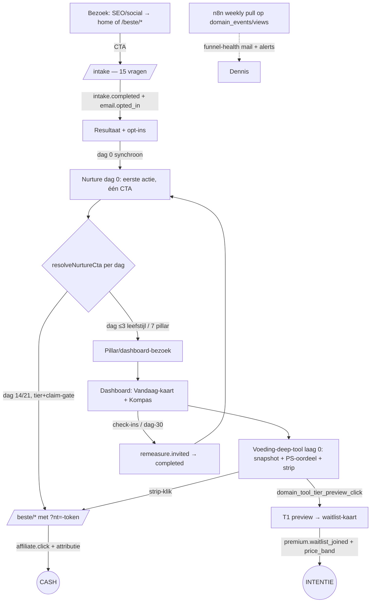

# PerfectSupplement — Conversie- & datastrategie 4 juli 2026

> **Layer 3 — Strategie/besluitlog.** Eerste conversie maximaliseren (cash + premium-intentie),
> volledig geautomatiseerd groeibewijs via datatransformatie, en het ontwerp-pad naar B2B-verkoop
> van geaggregeerde inzichten. Geen code — strategie, prioriteiten, meetplan, acties.
> Loopt **naast** het Cursor 0-30-dagen hardening-plan (`.cursor/plans/0-30_dagen_cursor_prompt_e9ac3467.plan.md`)
> en bouwt op het architectuurrapport (`docs/cursors/fable-architectuur-synthese-rapport-2026-07.md`).
> Alles hieronder geverifieerd tegen de code op 2026-07-04.

---

## 1. Executive summary

- **Definitie eerste conversie (Poort 1): composiet** — binnen 30 dagen na `intake.completed` óf een geattribueerde `affiliate.click` (cash) óf een `premium.waitlist_joined` (intentie). Beide zijn durable `domain_events`, joinbaar op `session_id`/e-mail — één KPI, twee benen.
- **De cash-funnel is verder dan gedacht:** de "zwaktes" uit de opdracht (hardcoded CTA's, supplement vóór dag 14, geen resolver) zijn **10 juni gefixt** — `resolve-nurture-cta.ts:194-228` dwingt leefstijl-eerst af, en de mail→klik-attributie (P1–P4, `?nt=`-HMAC-token) is live. Wat ontbreekt is niet plumbing maar **aflezing**: niemand ziet de cijfers zonder handmatige SQL.
- **De premium-funnel lekt op twee plekken:** de waitlist-500 (nog live; fix staat pas in Cursor Wave 6, dag 10-18 — te laat) en de deep-tool-funnel die half GA4 / half durable is.
- **PostHog en n8n zijn níet actief** (`VERWERKINGSREGISTER.md:126,218-219`) en `emitEvent` pusht alleen bij `deliveredTo: "n8n_webhook"` — vrijwel alle emits taggen `"posthog"` (`events.ts:108-119`). Daarom: **pull-based n8n** (leest `domain_events` via read-only rol), geen push, geen PostHog nu.
- **Vijf event-types zijn stubs** (0 emit-sites): `focus.viewed`, `plan.tier_action_clicked`, `plan.evidence_clicked`, `plan.theme_switched`, `intake.cta_to_primary_checkin`. De lijst telt 40 types, geen 49.
- **T1 voeding (Poort 2): fake-door + prijsintentie, zonder Stripe** — via de al ontworpen prijsbanden op de geconsolideerde waitlist-kaart (retentie-prompt 3); de T1-preview linkt daarheen door. Eén prijsinstrument, geen tweede.
- **4-wekenplan:** week 1 lek dichten (waitlist naar voren, uit Wave 6 knippen) → week 2 durable funnel (account-events) → week 3 pipeline live (n8n-weekrapport, ná register-update) → week 4 cohort-review + T1-besluit op data.
- **B2B blijft ontwerp:** verkoopbare aggregaten zijn gedefinieerd (cohort-benchmarks, click-indexen), drempels hard: 500+ intakes, k≥20 per cel, per-tenant isolatie, register/DPIA-addendum — niets daarvan vóór bewezen B2C-conversie.

---

## 2. F0 — North star

> **Elke voltooide intake levert binnen 30 dagen automatisch meetbaar bewijs op — een affiliate-klik of vastgelegde premium-intentie — in één durable event-stroom die zonder handwerk wekelijks tot funnel-cijfers transformeert, en die later als k-anoniem aggregaat B2B-verkoopbaar is.**

T1 hangt hieraan als het intentie-been: de voeding-deep-tool is het enige scherm waar het cash-been (laag 0: snapshot + PS-beoordeling + affiliate-strip) en het intentie-been (T1-preview → T2-waitlist) samenkomen. Elke verbetering aan die tool voedt beide benen van dezelfde composiet-KPI.

---

## 3. F1 — Verificatie (WEL/NIET live, met correcties)

| Vraag uit de opdracht | Antwoord | Bewijs |
|---|---|---|
| DomainDeepTool voeding live met 3 lagen? | **JA** | Shell 451 r. (`DomainDeepTool.tsx`), `VoedingScreen` op de shell (`Dashboard.tsx:2892-3209`), GA4/Clarity-meetpunten (`DomainDeepTool.tsx:143,298`) |
| premium_waitlist nog 500 op coach-features? | **JA** | Migratie CHECK't 3 features (`20260628120000_premium_waitlist.sql:5`), API accepteert 8 (`waitlist/route.ts:9-18`); geen fix-migratie aanwezig |
| Welke funnel-events zijn stubs? | `focus.viewed`, `plan.tier_action_clicked`, `plan.evidence_clicked`, `plan.theme_switched`, `intake.cta_to_primary_checkin` — 0 emit-sites buiten registratie/allowlist | Emit-audit over alle 40 types (niet 49 — telling gecorrigeerd). `quiz_gestart` is een **GA4**-naam (`ga4.ts:2`), geen domain event |
| PostHog/n8n geconfigureerd? | **NEE** — expliciet vastgelegd als niet-actief; `N8N_WEBHOOK_URL` ontbreekt, geen PostHog-SDK. Bij activatie: **eerst register + privacyverklaring bijwerken** (verplichting staat er letterlijk) | `VERWERKINGSREGISTER.md:126,218-219,238`. Plus: `emitEvent` pusht alleen bij `deliveredTo: "n8n_webhook"` — bijna alle emits taggen `"posthog"` (`events.ts:108-119`), dus push werkt zelfs mét URL niet zonder codewijziging |

**Correcties op de opdracht-hypothese (belangrijk):**

1. **SPOR 1-zwaktes zijn verouderd.** De centrale CTA-resolver mét leefstijl-guard bestaat: dag ≤3 leefstijl, dag 7 pillar, dag 14/21 supplement alléén achter tier- én claim-gate, dag 30 hermeting (`resolve-nurture-cta.ts:188-228`). De meet-haakjes P1–P4 zijn live sinds 10 juni: `nurture.email_sent` met `cta_kind/cta_slug/candidate_rank/variant`, `affiliate.click`-spiegel-event verrijkt via het HMAC `?nt=`-attributietoken (`affiliate/click/route.ts:86-98`), `variant`-kolom, ononderbroken `session_id`-join (`PLAN_NURTURE_MULTIPRODUCT` DEEL 0, bevestigd in code).
2. **Vandaag-kaart is niet dormant** — live op de Kompas-tab (`TAB_SECTIONS.vandaag = ["vandaagCard","kompasHome"]`).
3. **Cursor-plan status:** Wave 1 (x-org-id + admin-HMAC) is aantoonbaar af in code (front-matter zegt nog "pending" — verouderd). Waves 2–7 zijn open: de GET-handler op `send-reminders` bestaat nog, geen Playwright/Sentry/entitlements/Stripe in de repo. **De waitlist-CHECK-fix zit in Wave 6 (dag 10-18)** — voor een live data-verlies-bug is dat te laat; zie Poort-overstijgend besluit in F5/F6.
4. **Nurture-dedup en atomaire cron-claim staan** (`emailHasNurtureDay30Scheduled`, `status='sending'`-claim per `PLAN_NURTURE` DEEL 0) — dubbelzend-risico is gedicht.
5. **Nog open uit PLAN_FUNNEL DEEL 1:** de dag-0-herinrichting (recap → eerste actie) en het per-profiel sequence-zwaartepunt (Overtrainer valt na dag 0 terug op "Lage Batterij"). Dit is copy-werk, geen plumbing — status: OPEN (geverifieerd: geen eigen Overtrainer-`NurtureBlock`-set).
6. **Tier 2 vs Premium T1 is al gescheiden vastgelegd:** gratis = herhaalbare inname-banden-check (stepped-care tier 2, `is_paid=false` nu); Premium T1 = de *verdieping* (kcal/macro's, persoonlijke doelen, weektrends) — `PLAN_DOMAIN_DEEP_TOOL` Poort 3 + `PLAN_MEASUREMENT` §A/§E. Geen herdefinitie nodig.

---

## 4. F2 — Diagnose per spoor

### Spoor 1 — Cash (affiliate)

- **As-is:** intake → dag-0 (synchroon) → dag 3-30 via resolver met leefstijl-guard → `/beste/*` met `?nt=`-attributie → `affiliate.click` (tabel + spiegel-event met `session_id/sequence_day/profile_label`). Compliance-gates deterministisch.
- **Gewenst:** dezelfde keten, maar afleesbaar per week zonder SQL-handwerk, en een dag-0-mail die verplaatst i.p.v. herhaalt.
- **Grootste blokkade:** **aflezing** — de attributiedata landt in `domain_events` en wordt door niemand geaggregeerd. Tweede: dag-0 is nog recap (PLAN_FUNNEL 1A open).
- **Meetbaar verbeter-signaal:** CTR `nurture.email_sent`(cta_kind=supplement) → `affiliate.click` per (dag, profiel, slug), wekelijks.

### Spoor 2 — Premium-intentie (T1/T2)

- **As-is:** dashboard → voeding-deep-tool met 3 lagen; snapshot + preview meten alleen in GA4 (consent-gebonden), waitlist-join durable maar **kapot voor 5 van de 8 features** (500).
- **Gewenst:** één durable funnel snapshot → preview → waitlist(+prijsband), zonder 500, joinbaar per account.
- **Grootste blokkade:** de waitlist-500 (dagelijks dataverlies) en het ontbreken van een account-scoped events-route (funnel niet joinbaar).
- **Meetbaar signaal:** eerste week met `premium.waitlist_joined`-rijen op coach/`premium-coaching`-features > 0; daarna snapshot→preview- en preview→join-ratio's.

### Spoor 3 — Retentie → toekomstige B2B-data

- **As-is:** rijker dan de opdracht aannam — Vandaag-kaart + streak live, check-ins per domein (`measurement.checkin_completed`, 4 emit-sites), hermeting-lus compleet (`remeasure.invited`→`completed`), `nutrition_score`-tijdreeks. Bekende schuld: dubbele persistentie plan_progress vs daily_action_log (geen blokkade).
- **Gewenst:** dezelfde stromen, maar met versieveld op de check-in-logs (trend-integriteit) en een wekelijkse activiteits-aggregatie als B2B-substraat.
- **Grootste blokkade:** geen aggregatie-/anon-laag; geen `rules_version` op `intake_domain_checkin`/`intake_intake_log` (blinde vlek B5 uit het architectuurrapport).
- **Meetbaar signaal:** % accounts met ≥1 check-in per week; `remeasure.completed`/`remeasure.invited`-ratio.

---

## 5. F3 — Beslissingspoorten

**Poort 1 — Definitie "eerste conversie" → C (composiet).**
A (alleen affiliate) negeert het premium-been dat je nu juist valideert; B (alleen waitlist) negeert de motor die vandaag geld verdient. C = per intake-cohort: `affiliate.click` (geattribueerd) OF `premium.waitlist_joined` binnen 30 dagen. Beide zijn al durable events met dezelfde join-keys — de composiet kost nul extra instrumentatie en stuurt beide benen met één cijfer.

**Poort 2 — T1-invulling voeding → B (fake-door + prijsintentie, zonder Stripe), met één prijsinstrument.**
A meet alleen nieuwsgierigheid; C verspilt 3-4 weken leertijd terwijl Wave 7 (Stripe testmode) toch parallel loopt. B, maar níet als apart prijsscherm achter de T1-preview (frictie, tweede instrument): de preview-klik linkt door naar de **geconsolideerde waitlist-kaart met prijsbanden** uit retentie-prompt 3. Zo meet je betalingsbereidheid één keer, consistent, en leer je vóór Stripe live gaat wat de founding-prijs moet zijn.

**Poort 3 — Gratis vs betaald in T1 → moat-lijn aanhouden (geen herdefinitie).**
Gratis (laag 0): herhaalbare inname-banden-check + domeinscore + delta t.o.v. vorige check + PS-beoordeling op productgroep-niveau + tier-3-supplementstrip. Dit ís stepped-care tier 2 en tegelijk het cash-been. Betaald (T1): precisie + longitudinaliteit + persoonlijke doelen — kcal/macro's, eiwitdoel/TDEE (lengte/gewicht pas bij start; `IDENTITY_FIELDS` ligt dormant klaar), weektrends, export. De grens is exact `BRAND_POSITIONING` §4: **uitkomsten gratis, verdieping/longitudinaal betaald**; de leading-indicator-lus (check-ins, hermeting) blijft áltijd gratis — harde regel.

**Poort 4 — Data-automatisering nu → B-light: pull-based n8n, geen PostHog.**
C (alles GA4) verworpen: consent-bias, 14 mnd retentie, geen server-events. A (handmatige SQL) verworpen: schendt de automatiserings-eis. B aangepast op twee verificatiefeiten: (1) push via `emitEvent` werkt niet zonder codewijziging (bijna alles tagt `"posthog"`, niet `"n8n_webhook"` — `events.ts:108-119`); (2) PostHog = nieuwe verwerker → register/DPF/consent-werk. Dus: **n8n self-hosted op de VPS** (±300-500 MB, past; geen nieuwe verwerker, geen doorgifte), **pull-based**: n8n leest `domain_events` en SQL-views via een aparte read-only Postgres-rol op een schedule. Nul app-codewijziging, at-least-once, en de compliance-stap blijft klein (register-regel "n8n actief, self-hosted, geen externe doorgifte" + privacyverklaring — verplicht per `VERWERKINGSREGISTER.md:126` vóór activatie). PostHog pas als het weekrapport vragen oproept die views niet beantwoorden — trigger, geen datum.

**Poort 5 — Domein-prioriteit na voeding → volgorde handhaven (slaap eerst), derde keuze op data.**
Slaap blijft #1: check-in-infra klaar, magnesium is de sterkste vergelijkingspagina, grootste doelgroep-pijn. Beweging #2 (creatine + eiwit = twee affiliate-paden, protein-target-API half klaar). Afwijken op affiliate-ROI is nu giswerk — er is nog geen per-domein-tool-CTR. Daarom: na de slaap-launch beslist het cijfer `(domain_tool affiliate-klik-ratio × commissie per klik)` of stress of beweging domein #3 wordt.

**Poort 6 — B2B-horizon → ontwerpen ja, commercieel pas achter vier harde drempels.**
Verkoopbaar zonder art. 9-lek (alle waarden k-anoniem, k≥20 per cel, banden i.p.v. exacte waarden): (a) profiel-/domeinscore-benchmarks per leeftijdsband ("mannen 40+ scoren gem. X op slaap, kwartaal-op-kwartaal"), (b) supplement-interesse-index (click-rates per domein×profiel), (c) nurture-CTR-benchmarks. Nooit: individuele scores, sessies, e-mails, kleine cellen. Drempels (uit de eigen docs): **500+ intakes** (`PLAN_MEASUREMENT` §F fase 2) + **doorlopen anon-pipeline** (§D2) + **per-tenant k-isolatie en DPA** (`PLAN_NURTURE` §4C) + **bewezen B2C-conversie** (`PLAN_FUNNEL` DEEL 4). Plus register-/DPIA-addendum vóór het eerste verkochte rapport, en de timing-safe fix op de partner-API (die al in week-1-scope zit). Tot die tijd: alleen de events zó houden dat aggregaten later berekenbaar zijn — dat is nu al het geval (payloads = categorie/dag/slug/band).

---

## 6. F4 — Ontwerp

### 6.1 Conversie-architectuur (bezoek → eerste euro)



Automatisering grijpt op twee plekken in: de nurture-cron (bestaat) en de n8n-pull (nieuw, week 3). Er komt géén nieuwe CTA-mechaniek — de resolver ís de conversie-architectuur; alles hier hergebruikt hem.

### 6.2 T1 voeding — concrete invulling per laag

| Laag | Inhoud (concreet) | Conversiemiddel | Compliance-anker |
|---|---|---|---|
| **0 — gratis** | Snapshot: 5 inname-banden + datum ("op basis van je laatste check-in") + **delta t.o.v. vorige check** ("omega-3: laag → rond" — de delta bestaat al in de nutrition-log-API); intake-fallback (NUT_O3/NUT_PROT); empty → check-in-CTA. PS-beoordeling productgroepen (`nutrition-curated.ts`). Ondersteunende statistieken: `nutrition_score`-tijdreeks, vitaliteitsscore, hermeting-delta | Supplementstrip via `buildRecommendations` (tier 3, `rel="nofollow sponsored"`) — het cash-been | Banden = inname-inschatting; vuistregel-disclaimer blijft; geen merken in het PS-oordeel |
| **1 — T1 locked** | Preview-bullets die de klik triggeren: "Je persoonlijke **eiwitdoel in gram** — berekend op jouw gewicht en doel" · "Kcal- en macro-inschatting per dag" · "**Weektrend** van je inname-banden" · "Je energiebehoefte (TDEE-schatting)". Vormgeving: één geblurde placeholder-waarde ("Jouw eiwitdoel: ●● g — wordt berekend zodra je start") — curiosity gap zonder valse data. Preview-klik → scroll/link naar de waitlist-kaart (Poort 2) | Geen affiliate in T1-copy (onafhankelijkheid); conversie = `domain_tool_tier_preview_click` → waitlist | "Inname-inschatting", "streefwaarde", "op basis van wat jij invult" — nooit "tekort", nooit "gemeten"; lengte/gewicht pas bij start (staat erbij) |
| **2 — T2** | Vast verhaal (retentie-prompt 3): "Elke week kijkt er iemand met je mee — onafhankelijk, zonder merkverkoop" + prijsbanden-vraag (optioneel) + launch-mail-opt-in | `premium.waitlist_joined` + `premium.price_indicated` | "Leefstijlbegeleiding, geen diagnose"; **vereist de constraint-fix** — vandaag geeft deze CTA een 500 |

### 6.3 Data-transformatie-pipeline (geautomatiseerd groeibewijs)

Keten: **Supabase (`domain_events` + `nurture_emails` + `affiliate_clicks` + `premium_waitlist`) → 4 SQL-views → n8n scheduled pull (read-only rol) → wekelijkse "Funnel health"-mail + 2 alerts.** Geen handwerk, geen PII in de output (views aggregeren; geen e-mails/session_id's in het rapport).

| # | Transformatie | Input | Output-metric | Goed / slecht | Alert naar |
|---|---|---|---|---|---|
| T1 | `intake.completed` → `nurture.scheduled` → `nurture.email_sent` per `sequence_day×profiel×cta_kind` | `domain_events`, `nurture_emails` | Send-rate per dagstap; dropoff-punt | ≥95% / **<90% = cron-alarm** | Dennis (direct, niet wekelijks) |
| T2 | `nurture.email_sent`(supplement) + `?nt=` → `affiliate.click` (join `session_id`) | `domain_events` | CTR per (dag, profiel, `cta_slug`); candidate_rank-winst | ≥3% / <1% op dag 14/21 | Weekrapport |
| T3 | `domain_tool_snapshot_viewed` → `tier_preview_click` → `premium.waitlist_joined` | GA4 (tot de account-events-route er is; daarna `domain_events`) | Snapshot→preview-ratio; preview→join-ratio; prijsband-verdeling | preview ≥10% van snapshots; join ≥20% van previews (voorlopige drempels — herijken na 2 weken data) | Weekrapport |
| T4 | `measurement.checkin_completed` per domein + `dashboard.daily_action_toggled` | `domain_events`, `daily_action_log` | Wekelijks actieve checkers (% accounts), streak-verdeling | ≥30% accounts ≥1 check-in/wk / dalende trend 2 wkn = signaal | Weekrapport |
| T5 | `remeasure.invited` → `remeasure.completed` | `domain_events` | 30-dagen-lussluiting | ≥25% / <10% | Weekrapport |
| T6 | Composiet: intake-cohort → (T2-klik OF waitlist-join) ≤30 dagen | alles hierboven | **Dé eerste-conversie-KPI** per weekcohort | baseline eerst meten; doel = stijgende trend | Weekrapport, kop-cijfer |

Consent-nuance (vastleggen in het rapport-sjabloon): client-events (T3, deels T2-kliks) tellen alleen consented users — **vergelijk ratio's binnen het consented cohort**, nooit absolute aantallen tegen server-events.

### 6.4 Toekomst B2B (ontwerp, geen bouw)

- **Producten** (alle k-anoniem, k≥20, banden): kwartaal-benchmark "Leefstijlprofiel mannen 40+" (profiel-/scoreverdelingen per leeftijdsband); supplement-interesse-index per domein×profiel (click-rates); nurture-CTR-benchmark voor coaches/uitgevers. Wordt technisch: dezelfde views als 6.3, met een k-anon-drempellaag erop.
- **Nooit:** individuele scores/sessies, cellen < k, cross-tenant aggregatie zonder aparte grondslag (`PLAN_NURTURE` §4C), claims of statusduiding in rapporten.
- **Drempels (concreet):** ≥500 intakes (`intake.completed`-count) · ≥3 maanden stabiele event-emissie · anon-pipeline (§D2) doorlopen · register/DPIA-addendum "aggregaat-verkoop" · partner-API timing-safe (week 1) · bewezen B2C-conversie (T6-KPI ≥ baseline+trend). **Geen enkele verkoop vóór alle zes.**

---

## 7. F5 — Actieplan 4 weken

Rolverdeling: **Cursor** draait parallel de hardening-waves (2–7) — de taken hieronder overlappen daar niet mee, met één bewuste ingreep: de waitlist-fix wordt **uit Wave 6 naar voren geknipt** (het is een live data-verlies-bug; dag 10-18 is te laat). Geef Cursor bij Wave 6 expliciet mee: *"CHECK-fix premium_waitlist vervalt — al gedaan via retentie-prompt 3."*

| Week | Dennis (max 3) | Cursor/Fable-implementatie (max 2, geen wave-overlap) | Meet-KPI van de week |
|---|---|---|---|
| **1 — Lek dichten + baseline** | 1. Stripe KYC starten · 2. Besluit bevestigen: waitlist-fix naar voren + prijsbanden (<€10 / 10-20 / 20-35 / >€35 / weet niet) · 3. SQL uit retentie-prompt 3 draaien in Dashboard SQL Editor vóór deploy | 1. **Retentie-prompt 3** (waitlist-fix + consolidatie + prijsindicatie + launch-mail-opt-in) · 2. 1-regel-fixes: partner timing-safe + melatonine-slug + allowlist-drift (architectuurrapport prompt 1-toevoegingen) | `premium.waitlist_joined` > 0 op de geconsolideerde feature — bewijs dat het lek dicht is |
| **2 — Durable funnel + T1 aanscherpen** | 1. n8n self-hosted opzetten op de VPS (nog zonder data) · 2. Read-only Postgres-rol aanmaken (recept in F6) · 3. Dag-0-copy-besluit: recap indikken (PLAN_FUNNEL 1A — aanbeveling: ja) | 1. **Account-events-route** (architectuurrapport prompt 2) → deep-tool-funnel durable + org-id-fix · 2. T1-preview-bullets per 6.2 + doorlink preview→waitlist-kaart | Snapshot→preview-ratio baseline (GA4, consented cohort) |
| **3 — Pipeline live** | 1. Register + privacyverklaring bijwerken: "n8n actief, self-hosted, geen doorgifte" (**verplicht vóór activatie**, `VERWERKINGSREGISTER.md:126`) · 2. n8n-workflows bouwen: weekrapport + cron-alarm (T1-drempel) — no-code, recept in F6 · 3. Eerste weekrapport lezen | 1. **Funnel-views-prompt** (zie §9): 4 SQL-views + view-migratiebestand · 2. `rules_version`-kolom op `intake_domain_checkin`/`intake_intake_log` (blinde vlek B5) | Eerste geautomatiseerde "Funnel health"-mail ontvangen zonder handwerk |
| **4 — Review + besluit** | 1. Cohort-review op T6 (composiet-conversie) · 2. T1-besluit op data: fake-door houden / prijsintentie verdiepen / wachten op Stripe testmode (Wave 7) · 3. Domein #2 (slaap) bevestigen; criterium voor #3 vastleggen (Poort 5) | 1. Dag-0-herinrichting (PLAN_FUNNEL 1A, copy) · 2. Reserve / uitloop | **T6: % week-1-intakecohort met affiliate.click óf waitlist-join ≤30 dagen** — de eerste-conversie-baseline |

---

## 8. F6 — Handoff

### KPI-dashboard (7 KPI's, exacte namen en afleesplek)

| # | KPI | Event(s)/bron | Waar aflezen |
|---|---|---|---|
| 1 | Intake-volume/week | `intake.completed` | n8n-weekrapport (view `v_funnel_week`) |
| 2 | Nurture-gezondheid | `nurture.email_sent` ÷ `nurture.scheduled` per `sequence_day` | n8n-weekrapport + direct-alarm <90% |
| 3 | Mail→klik CTR | `nurture.email_sent`(cta_kind=supplement) → `affiliate.click` (join `session_id` via `?nt=`) | n8n-weekrapport (view `v_nurture_ctr`) |
| 4 | Cash-volume | `affiliate_clicks`-tabel (waarheid) + `affiliate.click`-spiegel per bron | n8n-weekrapport; commissies handmatig uit Daisycon (enige niet-automatiseerbare bron — accepteren) |
| 5 | Premium-intentie | `premium.waitlist_joined` + `premium.price_indicated` (banden-verdeling) | n8n-weekrapport (view `v_premium_intent`) |
| 6 | Deep-tool-funnel | `domain_tool_snapshot_viewed` → `domain_tool_tier_preview_click` (GA4 → na week 2 durable als `domain_tool.*`) | GA4 Exploration (consented cohort) → daarna weekrapport |
| 7 | Retentie-lus | `measurement.checkin_completed` %actieve accounts + `remeasure.completed`÷`invited` | n8n-weekrapport (view `v_checkin_activity`) |

**Meetpunt-regel:** `domain_tool_snapshot_viewed` → `domain_tool_tier_preview_click` → `premium.waitlist_joined` **OF** `affiliate.click` (geattribueerd) — hier lees je de eerste conversie af, per intake-weekcohort (T6).

### Drempels voor B2B (samengevat)

500+ intakes · 3 mnd stabiele emissie · anon-pipeline doorlopen · k≥20 per cel, per tenant · register/DPIA-addendum · T6-KPI bewezen stijgend. Alle zes groen → dan pas het eerste benchmark-rapport als product.

### Open besluiten voor Dennis (max 5)

1. **Waitlist-fix naar voren, uit Wave 6 knippen?** Aanbeveling: **ja** — live dataverlies weegt zwaarder dan wave-volgorde; Wave 6-prompt aanpassen.
2. **n8n self-hosted op de VPS?** Aanbeveling: **ja** — ±300-500 MB past (swap staat sinds 16 jun), geen nieuwe verwerker, kleinste register-impact. Alternatief (EU-cloud) alleen als de VPS krap blijkt.
3. **PostHog nu?** Aanbeveling: **nee** — uitstellen tot het n8n-weekrapport aantoonbaar tekortschiet (trigger, geen datum).
4. **Dag-0 recap indikken tot zwakste domein + quick-win?** Aanbeveling: **ja** (PLAN_FUNNEL 1A) — dag 0 landt op de betrokkenheidspiek en moet verplaatsen, niet herhalen.
5. **Prijsbanden definitief?** Aanbeveling: de vijf banden uit retentie-prompt 3 ongewijzigd overnemen — consistentie met het eerdere ontwerp weegt zwaarder dan finetuning vóór er data is.

### Wat NIET in deze fase

- Geen optimizer/bandit of dynamische `candidates[]`-herordening (YAGNI tot 500+; `PLAN_NURTURE` 1D).
- Geen PostHog, geen GTM, geen nieuw analytics-vendor.
- Geen tweede deep tool binnen deze 4 weken (slaap = week 5+, ná durable funnel).
- Geen B2B-verkoop, geen cross-tenant aggregatie, geen partner-API-promotie.
- Geen `affiliate_clicks`-tabelwijziging (spiegel-event volstaat) en geen aanraking van de 15-vragen-intake.
- Geen nieuwe GA4-event-namen zonder de drie-plekken-registratie (meet-standaard CLAUDE.md).
- Geen wearables/home-scan (horizon met drempels, `PLAN_FUNNEL` DEEL 4).

### Aansluiting op Cursor Wave 6/7 (geen dubbel werk)

- **Wave 6 (entitlements inert):** blijft zoals gepland, mínus punt 5 (waitlist-CHECK-fix — vervalt, al gedaan in week 1). De `plans.features`-seed (`trends, remeasure, coach, q2_content`) matcht de capabilities-mapping uit het architectuurrapport — geen conflict. Let op: **`remeasure` hoort niet als gate-bare feature** (hermeting = gratis dataflow, harde regel) — geef Cursor mee dat `remeasure` uit de plus-feature-seed kan of nooit een UI-gate krijgt.
- **Wave 7 (Stripe testmode):** ongewijzigd; de prijsband-data uit week 1-4 voedt het price-object-besluit (€49 vs €29 founding).
- **Account-events-route (week 2)** is additioneel — komt in geen enkele wave voor.
- **Sentry/Playwright/CSP** (waves 3-5): volledig bij Cursor; dit plan raakt ze niet.

---

## 9. Follow-up Cursor-prompt — Funnel-health views (hoogste-ROI codewijziging zonder bestaande prompt)

> De waitlist-fix (retentie-prompt 3) en de account-events-route (architectuurrapport prompt 2) hebben al copy-paste prompts. De enige hoge-ROI-wijziging zonder prompt is de aflees-laag:

```text
MODEL-CONTEXT: Claude Fable/Cursor — implementatie met expliciete redeneerstappen.
PROJECT: PerfectSupplement (Next.js 16, TypeScript strict, Supabase).
LEES VÓÓR JE BEGINT: CLAUDE.md, docs/cursors/fable-conversie-datastrategie-2026-07.md §6.3,
src/lib/events.ts (payload-shapes), supabase/migrations/20260529200000_domain_events.sql

F0 — NORTH STAR
Vier SQL-views die de funnel wekelijks afleesbaar maken voor een pull-based n8n-workflow —
zonder app-codewijziging, zonder PII in de view-output.

F1 — VERIFICATIE
- domain_events kolommen: event_type, session_id, email, payload jsonb, occurred_at, organization_id.
- nurture_emails: sequence_day, status, variant; premium_waitlist: feature, source, price_indication
  (na retentie-prompt 3); affiliate_clicks: bestaande tabel, ALLEEN lezen.
- Payload-keys: nurture.email_sent → cta_kind/cta_slug/candidate_rank; affiliate.click →
  session_id/sequence_day/profile_label (bij attributie).

F3 — KERNBESLISSINGEN
- Eén migratiebestand supabase/migrations/: 4 views + 1 read-only rol.
  v_funnel_week      — per ISO-week: intakes, opt-ins, nurture sent per dagstap, sent/scheduled-ratio
  v_nurture_ctr      — per (sequence_day, profile_label, cta_slug): emails, geattribueerde clicks, CTR
  v_premium_intent   — per week: waitlist-joins per feature/surface, prijsband-verdeling
  v_checkin_activity — per week: unieke accounts met checkin, remeasure invited/completed
- GEEN e-mailadressen of session_id's in view-output — alleen counts, ratio's, banden, weken.
- Rol n8n_readonly: SELECT op uitsluitend de 4 views (niet op de brontabellen).
  SQL óók in de besluitlog; Dennis draait handmatig in de Dashboard SQL Editor (NOOIT db push).

F5 — SCOPE
Alleen het migratiebestand + besluitlog met de exacte SQL en 3 voorbeeld-queries voor n8n.
NIET: app-code, n8n-workflows zelf, PostHog, wijziging aan tabellen of RLS-policies.

F6 — HANDOFF
- [ ] Views draaien foutloos op een lege én gevulde database (idempotent: create or replace)
- [ ] Geen PII-kolom in enige view (verifieer per view in de besluitlog)
- [ ] n8n_readonly kan de views lezen en de brontabellen NIET
- Meetpunt: "v_funnel_week als kop van het wekelijkse n8n-rapport — hier lees je groei
  en eerste conversie (T6) af."
Geen commit. Stop na de wijzigingen voor review.
```

**Effort:** ~halve dag. **Blokkerende voorwaarde:** retentie-prompt 3 eerst (anders mist `price_indication`). **Dekt:** week 3 van het actieplan.

---

*Opgesteld: 4 juli 2026 (Fable-sessie conversie & datastrategie). Geen code gewijzigd, geen commits.*
