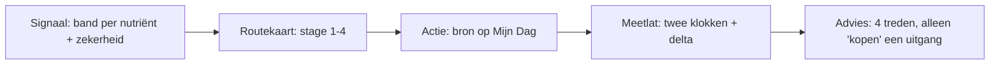

# Fable-verdict — Domeinen als analyse + advies × conversiekaart × productbron

> **Fable-sessie 2 augustus 2026.** Analyse-rapport, geen code, geen commits.
> Repo-stand geverifieerd op `main`, commit `c3f73f1`. Alle bewijspaden zijn
> `pad:regel` in de werkelijke bestanden, gelezen tijdens deze sessie.
> Opdracht: [`fable-domeinen-analyse-advies-voortgang-2026-08.md`](fable-domeinen-analyse-advies-voortgang-2026-08.md).
>
> **Bijgewerkt 2 aug ná review.** Uit Golf 1 zijn **V1**, **B1** en **B2** gebouwd, plus het
> **ST1-besluit** (stress → `eerst_leefstijl`). Wat er in `src/` staat wijkt op één punt af van
> de oorspronkelijke spec hieronder: `bloodMarker` is een **drie-standen-veld**
> (`improves` \| `limited` \| `none`), niet de booleaan `{ok, why}` uit
> [`voortgang-plan-later.md`](../design/voortgang-plan-later.md) item 4 — het onderliggende
> onderzoek kent drie standen en een booleaan gooit "beperkt" en "geen route" op één hoop.
> Goedgekeurd. De secties hieronder zijn op die punten bijgewerkt; de rest is de
> oorspronkelijke analyse.

---

## F0 — North star (1 alinea)

De zeven domeinen zijn ongelijk volwassen: voeding heeft een complete keten van
log → delta → advies → verdict → Favorieten, beweging heeft een doe/log-keten met
een gelockt IA-besluit, en slaap/stress/verbinding hebben een check-in of niets —
terwijl de conversiekaart-prebuild een sjabloon aanneemt dat élk domein moet kunnen
voeden. Het gat dat deze ronde sluit: **één uniform domeincontract** (analyse-shell ·
advies-ladder · product-oordeel · klaar-staat-gate) dat uit de twee bewezen ketens
wordt gegeneraliseerd, zodat elk domein met zijn éigen datadiepte — zonder nep-diepte —
de conversiekaart kan voeden, en productadvies affiliate-first blijft achter een
`ProductSource`-abstractie die later een tweede implementatie toelaat zonder UI-omslag.

## F1 — Verificatie (samenvatting; detail in sectie B)

Alle verificatie-targets uit de opdracht geopend. Uitkomst per as-built-bullet:

| Claim uit de opdracht | Verdict | Bewijs |
|---|---|---|
| DOMAIN_ROLE 5+2, READOUT_DRIVERS energie←slaap/voeding/beweging, herstel←slaap/beweging/stress | **WEL** | `src/lib/domain-role.ts:9-23`; `isReadoutDomain` r.29, `isInterventionDomain` r.33 |
| PILLARS r.16, 7 pijlers | **WEL** | `src/data/dashboard/index.ts:16-134`; NB verbinding heeft `hubRoute: "/inzichten"` (r.132), de enige zonder eigen hub-pagina |
| RecommendationInput r.5-11 zonder wearable/blood-veld | **WEL** | `src/types/recommendation.ts:5-11` |
| Engine-exports op r.34/384/402/434/461 | **WEL** | `src/lib/recommendation-engine.ts:34,384,402,434,461`; beschikbaarheidspoort `isEntryAvailable` r.237-245 eist `comparisonPath !== null` |
| build-recommendations hubSlug/comparisonPath-mapping r.82-96 | **WEL (r.81-108)** | `src/lib/build-recommendations.ts:81-108`; `comparisonHref`-resolutie r.93-97; strip-gate r.66-68 |
| supplement-eligibility r.12/18/24/34 | **WEL** | `src/lib/supplement-eligibility.ts:12,18,24,34` |
| domain-supplement-candidates per domein | **WEL** | `src/data/domain-supplement-candidates.ts:8-15`; NB `stress_score: []` en `recovery_score: ["magnesium"]` — zie L1/L2 |
| lifestyle-plans zonder verbinding | **WEL** | `src/data/lifestyle-plans/index.ts:23-28` (`PLAN_TEMPLATE_DOMAINS` = sleep/stress/nutrition/movement) |
| movement = enige sessiecatalogus + doe/log-keten | **WEL** | `src/data/movement/` (7 bestanden incl. `session-catalog.ts`, `sport-catalog.ts`); `movement-session-log.ts:10-77`, `movement-week-roadmap.ts:125`, `movement-plan-execution.ts:7` |
| voeding = rijkste analyse-keten | **WEL** | `nutrition-delta.ts:31,71` · `nutrition-advice-personalization.ts:60` · `nutrition-log-response.ts:35` · `nutrition-lifestyle-extras.ts:31` · `src/data/dashboard/nutrition-curated.ts` · verdicts `src/lib/supplement-verdict-copy.ts:113` |
| Voortgang-productie ≠ conversiekaart | **WEL** | `src/components/dashboard/voortgang/` (16 componenten); `VoortgangRouteList.tsx:16-32` is een 3-rijen-lijst, geen stage-rail; surface nog `"verder_kijken"` (r.52-55) |
| wearable-stub voedt niets | **WEL** | `src/types/wearable-signals.ts:1-15` (expliciet "not LifestylePlan checklists"); `api/account/wearable/snapshot/route.ts:7-15` retourneert 503 `wearable_not_enabled` |
| getReadoutPresentation driverLabels + primaryCta | **WEL** | `src/lib/dashboard-readout.ts:13-25`; primaryCta = eerste driver mét check-in-route |
| drie-plekken-registratie + account-allowlist | **WEL** | `src/lib/events.ts:8-82` · `intake-events-client.ts:3-30` · `api/intake/events/route.ts` · `account-events-client.ts:3-15` · `api/account/events/route.ts:9-21` |
| prebuild-notitie stage-model/meetlat/koppelstrip/events | **WEL** | `docs/design/voortgang-prebuild-notitie-2026-07.md:22-48,61-116`; stage-ids in de HTML: `voortgang-conversiekaart-prebuild-2026-07.html:1117-1125` |

**Afwijkingen — de repo is vérder dan de opdracht aanneemt (gemeld, niet gegokt):**

1. **Eigen-ijkpunt slices A–C zijn GELAND.** `src/lib/domain-goal.ts` bestaat,
   `api/account/domain-goal/` bestaat, `DomeinDoelZetten.tsx` staat in de
   voortgang-map, `VoortgangRichtingBeat.tsx:34-36` bevat de drie modus-zinnen
   (verwerven/behouden/herpakken), en `goal.benchmark_set`/`goal.benchmark_rescored`
   staan in `events.ts:80-81`. Het plan-doc (`PLAN_EIGEN_IJKPUNT_DOEL_PER_DOMEIN.md`
   §10.1) beschrijft dit nog als te bouwen. Gevolg voor deze ronde: de
   **ijkpunt-chip van de conversiekaart-meetlat bestaat al als databron** — een van
   de prebuild-delta's is dicht (zie G).
2. **RULES_VERSION = "1.5.0"** (`src/lib/intake-engine.ts:21`), niet 1.4.0. Raakt
   geen verdict hier, wel de delta-vergelijkbaarheidsregel in het feed-contract (G).
3. **Slaap heeft al een publieke analyse-flow**: `SleepAnalysisFlow.tsx` +
   `guide.sleep_analysis.started/completed` (`events.ts:78-79`) + eigen event-route
   (`api/gids/sleep-analysis/event/`). Slaap is dus minder "dun" dan de bullet zegt —
   maar die analyse leeft in de gids, niet in het dashboard (zie D-slaap).
4. **build-recommendations-mapping is r.81-108** (opdracht zei r.82-96) — cosmetisch.

---

## A — North star + scope

**Wat deze ronde WEL beslist:**

- Eén **uniform domeincontract** met vier lagen (C), gegeneraliseerd uit
  BESLUIT_BEWEGING C.4 en de voeding-keten — inclusief de minimale data-input per
  laag zodat verbinding het contract eerlijk kan dragen.
- Per domein (7×) een **KEEP/REFINE/KILL/DEFER-verdict** met maximaal 3 bets,
  effort×impact (D), plus een readout-spec (E).
- De **productbron-architectuur**: wat de vragenlijst vandaag levert, waar dat
  knelt, hoe wearable/bloed als optionele enrichment aanhaken, en het
  `ProductSource`-interface met affiliate als eerste implementatie (F).
- Het **feed-contract naar de conversiekaart-v1-prebuild** + delta-tabel (G), de
  bouwgolven met een meetbare uit-park-poort (H), meetpunten (I), de
  premium-grens per laag (J) en copy-/IA-skeletons (K).

**Wat deze ronde NIET beslist:**

- Geen herontwerp van de conversiekaart (v1-prebuild = referentie, default 4).
- Geen heropening van 5+2, de UX-hiërarchie, de klaar-staat-regel, of besluiten uit
  de eerdere Fable-docs en de drie vastgelegde plannen (ijkpunt, doelgreep-dosis,
  stappenplan-blauwdruk) — die worden in H geïntegreerd, niet geherprioriteerd.
- Geen go-to-market voor eigen producten; alleen het interface-extensiepunt.
- Geen wearable-integratie (route staat bewust op 503 tot DPIA + consent).
- Geen bouw: sectie M levert prompt-skeletten, de volledige Cursor-prompts volgen
  ná Dennis' review.

---

## B — F1 as-is gap-matrix per domein

Legenda: **WEL** = bestaat en draagt het contract · **DEELS** = bestaat maar
onvolledig · **NIET** = ontbreekt. Elk oordeel met bewijspad.

| Domein | Analyse-diepte | Doe-surface | Voortgang-feeds | Product-hook | Schaalbaarheidschuld |
|---|---|---|---|---|---|
| **Voeding** | **WEL** — log → estimate-banden → delta (`nutrition-delta.ts:31`) → advies-personalisatie (`nutrition-advice-personalization.ts:60`) → verdicts (`supplement-verdict-copy.ts:113`) | **WEL** — `VoedingScreen` op de `DomainDeepTool`-shell (fable-vervolg A1, geverifieerd: `DomainDeepTool.tsx` bestaat) | **WEL** — `StatistiekenBlikPanels.tsx:213-275` (nutriënten-lus + laddertrap), `EvidenceLadderCard`, `FavorietenAanraderSection.tsx:72-80` | **WEL** — eligibility-poort `canShowSupplementRecommendation` (`supplement-eligibility.ts:24`) + `nutritionSupplementGate`; alles interne routes | **DEELS** — zekerheid/bloed-oordeel is nog code-comment i.p.v. getypeerd veld (`intake-reference.ts:36-60` heeft géén `confidence`/`bloed`); drempels indicatief met open TODO (`intake-reference.ts:6-9`) |
| **Beweging** | **DEELS** — assessment/delta/PAL-helpers bestaan (`movement-delta.ts`, `movement-assessment.ts`, `movement-pal.ts`) maar de analyse-objecten staan nog op de doe-surface (BESLUIT_BEWEGING B#7) | **WEL** — enige domein met sessiecatalogus (`src/data/movement/session-catalog.ts`) + log-keten (`movement-session-log.ts:26`, `movement-week-roadmap.ts:125`) + gelockt doe-surface-besluit (BESLUIT_BEWEGING C.1) | **DEELS** — score/delta in de ring (`VoortgangDomeinRing.tsx:170`), maar geen beweging-specifieke statistieken-blik; Statistieken is nutriënten-only (`StatistiekenBlikPanels.tsx:12`) | **WEL** — `MOVEMENT_SUPPLEMENT_SLUGS` creatine/eiwit (`build-recommendations.ts:113`) + nutrient-bridge (`movement-nutrient-bridge.ts`), gids-link i.p.v. koopknop conform G.2 | **WEL (bekend en belegd)** — positie-fragmentatie `current_phase_id` vs daily-log (BLAUWDRUK §5.1, `plan-progress.ts:210`); kill/pivot-lijst loopt via de S-volgorde, niet via deze ronde |
| **Slaap** | **DEELS** — 4 intake-items (DOMAIN_MODEL §3.1), check-in-route (`api/intake/sleep-checkin/`), én een publieke analyse-gids (`SleepAnalysisFlow.tsx`, events `events.ts:78-79`) — maar de gids-analyse voedt het dashboard niet | **DEELS** — `SleepScreen.tsx` (268 r.) met plan-template, nog niet op het D.1-first-viewport-contract | **DEELS** — alleen score/delta in de ring; geen slaap-rij in Statistieken | **WEL** — `SLEEP_SUPPLEMENT_SLUGS` = magnesium (`build-recommendations.ts:115`), catalog-entry `supplement-catalog.ts:76-82` | **DEELS** — twee analyse-plekken (gids vs dashboard) zonder gedeelde bron; scherm dupliceert cockpit-bouwstenen (fable-vervolg A6) |
| **Stress** | **DEELS** — 2 items, check-in-route (`api/intake/stress-checkin/`); geen delta-keten, geen gids | **DEELS** — `StressScreen.tsx` (244 r.) met plan-template, zelfde vorm als slaap | **DEELS** — idem slaap | **DEELS — inconsistent**: `STRESS_SUPPLEMENT_SLUGS` = magnesium (`build-recommendations.ts:114`) maar `DOMAIN_SUPPLEMENT_CANDIDATES.stress_score = []` (`domain-supplement-candidates.ts:10`) — twee haken, twee antwoorden (→ L1) | **DEELS** — idem slaap minus de gids-doublure |
| **Verbinding** | **NIET** — 1 item (CON_SOC), geen check-in-route (`PILLAR_CHECKIN_ROUTES`, `dashboard/index.ts:292-297`); check loopt via de volledige leefstijlcheck (`VerbindingScreen.tsx:38-47`) | **DEELS** — 3 statische mini-acties + 2 `coming_soon`-knoppen (`VerbindingScreen.tsx:95-133`) | **NIET** — geen plan, geen log, geen eigen feed; **maar**: `DomeinDoelZetten` werkt wél voor verbinding (ijkpunt slice B, domeinrij-entry) | **NIET (correct zo)** — `connection_score: []` (`domain-supplement-candidates.ts:14`), `PILLARS.verbinding.supplement: null` (`dashboard/index.ts:131`) | **WEL** — de twee `coming_soon`-knoppen beloven inhoud die niet bestaat; botst met ontwerpverbod A.4-5 zodra C.4 domeinbreed wordt (→ L4) |
| **Energie** (readout) | **DEELS** — 2 items; drivers + CTA liggen klaar (`dashboard-readout.ts:13-25`) maar geen UI consumeert `READOUT_DRIVERS` als DriverDeepView (fable-vervolg A7: 0 hits) | **n.v.t. — correct**: geen plan-template, geen doe-surface (default 1) | **DEELS** — score/delta in de ring | **NIET (correct)** — `energy_score: []`, `supplement: null` | **NIET** — klein oppervlak |
| **Herstel** (readout) | **DEELS** — 1 item (RCV_PHYS = {33,67,100}, "grof signaal, geen precisiemaat", DOMAIN_MODEL §3.1 r.81); drivers klaar, geen consumer | **n.v.t. — correct** | **DEELS** — idem energie | **NIET op het dashboard (correct)**; **maar** `recovery_score: ["magnesium"]` in de nurture-kandidaten (`domain-supplement-candidates.ts:13`) — een readout mét product-kandidaat in de nurture-keten (→ L2) | **NIET** — klein oppervlak |

**De feitenbasis in één zin:** er bestaan vandaag twee complete, maar
niet-uitwisselbare ketens — voeding (analyse→advies→verdict) en beweging
(voorstel→doen→log) — en vijf domeinen die elk een deel van één van beide vormen
naäpen zonder het contract erachter.

---

## C — Uniform domeincontract

Generalisatie van BESLUIT_BEWEGING C.4 ("elk domein: één doe-surface, één
besturings-sheet, één gedeeld meetscherm") + de voeding-keten
(gap → actie → dagenstrip → gegate supplement → verdict). Vier lagen; per laag de
minimale data-input zodat een dun domein het contract draagt zonder nep-diepte.

### C.1 Laag 1 — Analyse-shell ("waar sta ik, beweegt het?")

| Element | Invulling | Minimale input (dun domein) |
|---|---|---|
| **Stand** | Domeinscore 0–100 uit de engine — bestaat voor alle 7 (`calcDomainScores`, DOMAIN_MODEL §2) | Alleen de score. Geen banden verzinnen waar geen banden-bron is |
| **Lijn/trend** | Het **twee-klokken-model** uit de prebuild-notitie (r.134-143), gegeneraliseerd: (a) *checkpunten* — verspringt alleen bij check/hermeting, rules_version-bewaakt; (b) *gedragsteller* — dagen uit `daily_action_log`/domeinlog, loopt continu. Nooit vermengd | Alleen klok (a): checkpunten uit `intake_sessions`. Klok (b) verschijnt pas als het domein een log-bron heeft |
| **Check-in** | Eén bron per domein: sleep/stress/movement via `intake_domain_checkin`-routes, voeding via `nutrition-log`. | Verbinding: **hermeting-only** (geen eigen route bouwen vóór het S6-besluit); de score-checkpunten komen uit de leefstijlcheck |
| **Subjectieve lijn** | De ijkpunt-reeks (`domain_goal_score`, append-only) als tweede leesregel — al gebouwd, staat náást de engine-score en gaat nooit de ring in (PLAN_EIGEN_IJKPUNT lock 1) | Werkt vandaag al voor alle 5 interventiedomeinen incl. verbinding — dit ís de eerlijke analyse-laag voor een dun domein |

### C.2 Laag 2 — Advies-ladder (leefstijl eerst → supplement)

Stepped-care-treden 1–3 (STEPPED_CARE_MODEL r.29-38), per domein gevuld met wat de
check daadwerkelijk meet:

1. **Tier 1 — leefstijl**: bestaat voor alle 5 interventiedomeinen (plan-templates
   voor 4, statische mini-acties voor verbinding). Verplicht: minstens één quick-win
   uit een **ander** domein (cross-domein-balansregel, ANALYSIS_PILLAR_COVERAGE §2 r.50-66).
2. **Tier 2 — meten/patroon**: de check-in-lus zelf. Gratis, herhaalbaar.
3. **Tier 3 — supplement**: alléén via het product-oordeel (C.3). Domeinen zonder
   kandidaat (verbinding, energie) tonen deze trede **niet** — een lege trede is
   eerlijker dan een gevulde die de check niet dekt.

Minimale input dun domein: alleen trede 1+2. Het contract eist niet dat elke trede
bestaat, wel dat een bestaande trede uit echte data komt.

### C.3 Laag 3 — Product-oordeel (wanneer verschijnt een route?)

Generaliseer de bestaande voeding-poort naar één per-domein-poort:

```
canShowProductJudgement(domain) =
  hasDomainEvidence(domain)        — voeding: nutrition-log gedaan (supplement-eligibility.ts:12)
                                     beweging: sessie-log of beweegcheck aanwezig
                                     slaap/stress: domeincheck-in gedaan
                                     verbinding/energie: nooit (geen kandidaten)
  && verdict === "kopen"           — uit de verdict-keten (supplement-verdict-copy.ts:113);
                                     de andere drie VerdictValues zijn eindpunten zonder CTA
  && claim-gate                    — approved-claims; on_hold/forbidden nooit (melatonine-regel,
                                     STEPPED_CARE r.108)
```

De uitgang is **altijd** een interne route: `comparisonPath` (`/beste/*`) of
`hubSlug` (gids) — nooit een shop-URL (default 5, BESLUIT_BEWEGING G.2). Maximaal
twee signalen tegelijk, altijd met een "waarom je dit misschien niet nodig hebt"-regel
(G.2-tabel).

### C.4 Laag 4 — Klaar-staat-gate

De toestandsregel uit BESLUIT_BEWEGING A.2 (r.40-44), domeinbreed en herbruikbaar:

```
adviceMayOutrankDayStep(domain) =
  geen open dagstap voor dit domein vandaag
  (afgevinkt · rustdag · ander domein heeft prioriteit)
```

Zolang er een open stap staat, is de doe-laag de enige primary en is analyse
maximaal de één-regel-reden onder het voorstel (D.1-contract). Dit is een
**rendering-conditie**, geen tijdsregel — en hij is de goedkoopste
generalisatie-winst van deze hele ronde, omdat hij als pure functie op
`daily_action_log` + agenda voor élk domein identiek is.

**Waarom dit contract een dun domein draagt zonder nep-diepte:** elke laag heeft
een gedefinieerde leeg-staat (alleen score-checkpunten; alleen trede 1+2; geen
product-trede; geen dagstap → analyse direct zichtbaar). Verbinding voldoet vandaag
al aan het contract — mager maar eerlijk — zonder één regel nieuwe content.

---

## D — Verdicts + bets per domein

Regels vooraf: geen bet bouwt een oefeningenbibliotheek; geen bet vult een domein
met content die de check niet meet. Effort: S (dagen) / M (week) / L (meer).
Impact: richting het C-contract + conversiekaart-voedbaarheid.

### D.1 Voeding — **KEEP** (referentie-implementatie van het contract)

De keten is compleet en het contract is eruit afgeleid; niets killen, niets pivoten.

| Bet | Wat | Effort | Impact |
|---|---|---|---|
| **V1 — GELAND** | `confidence: 1\|2\|3\|4` + `confidenceWhy` + `bloodMarker: {value, why}` als getypeerde velden op `NutrientReference`, gevuld uit de bestaande comments. Waarden: eiwit 4, omega-3 3, zink 2, magnesium 1, vitamine D 1. `bloodMarker.value` is een drie-standen-union (`improves`/`limited`/`none`) i.p.v. de booleaan uit voortgang-plan-later item 4 — vitamine D is de enige `improves`, en een test vergrendelt dat | **S** | **Hoog** — maakt de zekerheidsladder datagedreven; dit is óók het veld waar wearable/bloed-enrichment later op inhaakt (F.2), dus het is de goedkoopste toekomstvaste stap van de ronde |
| **V2** | `previousBand` in de dashboard-snapshot: `nutrition-delta.ts` heeft alleen intake-flow-consumers (fable-vervolg A4) — de delta-bouwsteen bestaat en is getest, het dashboard toont hem niet | **S** | **Middel** — levert de meetlat-rij "delta" voor voeding zonder nieuwe logica |
| **V3** | Registry `action_key → nutrient` naast `portion-dictionary.ts` (besluit prebuild-notitie r.87-97: afleiden, geen migratie; sleutel `voeding:<nutrient>:<slug>`) | **S/M** | **Hoog** — dit is de Mijn Dag-koppeling van het feed-contract; zonder registry geen "staat 9 van 14 dagen aan"-leesregel |

### D.2 Beweging — **KEEP op de doe-kant, REFINE op de analyse-kant (reeds belegd)**

Het doe-surface-besluit is gelockt en de verhuislijst van analyse-objecten naar
Voortgang staat compleet in BESLUIT_BEWEGING E.3 (r.472-483). Deze ronde voegt daar
**geen** nieuwe beweging-bets aan toe — herprioriteren van de S-volgorde is
expliciet verboden. Wat deze ronde wél oplevert:

| Bet | Wat | Effort | Impact |
|---|---|---|---|
| **B1 — GELAND** | De **klaar-staat-gate als gedeelde helper** (C.4): `src/lib/domain-ready-state.ts` met `resolveDayStepState` + `adviceMayOutrankDayStep`, pure functie op geplande stap × afgevinkte keys × prioriteitsdomein. Precedentie volgt A.2 letterlijk: een open stap houdt de deur dicht, óók buiten het prioriteitsdomein. **Nog zonder consumers** — aansluiten gebeurt in de beweging-slice en in Golf 2 | **S** | **Hoog** — dit is de C.4-generalisatie; slaap/stress erven hem gratis |
| **B2 — GELAND** | De positieregel als **herbruikbaar type**: `src/lib/domain-position-line.ts` met vier bouwfases (`building_base`/`progressing`/`maintaining`/`returning` → basis leggen/opbouwen/onderhouden/terugkomen). `buildMovementPositionLine` mapt alleen nog fase-id → fase en delegeert; uitvoer bit-voor-bit gelijk (bestaande test ongewijzigd groen). Een test verbiedt expliciet een rangnummer in de regel | **S** | **Middel** |

### D.3 Slaap — **REFINE** (grootste winst per eenheid werk van de vijf)

Slaap heeft check-in-infra, een plan-template, de sterkste supplement-hook
(magnesium) én al een analyse-flow — alleen op de verkeerde plek (publieke gids,
niet dashboard). De REFINE is: de bestaande onderdelen op het contract leggen, geen
nieuwe content.

| Bet | Wat | Effort | Impact |
|---|---|---|---|
| **S1** | **Slaap-analyse-rij op Voortgang**: checkpunten-lijn uit `intake_domain_checkin` + de bestaande SLP_*-herkenningsregels als patroonregels (dezelfde data die `SleepAnalysisFlow` al duidt, nu uit de dashboard-bron). Geen slaaplog, geen nieuwe vragen | **M** | **Hoog** — het eerste niet-voeding-domein dat stage 2→3 van de kaart kan dragen |
| **S2** | Twee-klokken voor slaap: gedragsteller = de avondritme-dagstap uit `daily_action_log` naast de score-checkpunten, mét de "twee weken verandert je gemiddelde maar beperkt"-copy uit de prebuild-notitie (r.141) | **S** (na S1 + registry-patroon V3) | **Middel** |
| **S3** | Gids↔dashboard-naad: de sleep-analysis-gids krijgt een "log in om dit naast je eigen lijn te zien"-uitgang; dashboard-analyse en gids delen dezelfde herkenningsregels als data (geen tweede copy-bron) | **S** | **Middel** — dicht de dubbele-analyse-schuld zonder herbouw |

### D.4 Stress — **REFINE, ná slaap** (zelfde sjabloon, één beslissing eerst)

Stress erft S1/S2 letterlijk (zelfde check-in-tabel, zelfde vorm). Eén eigen bet:

| Bet | Wat | Effort | Impact |
|---|---|---|---|
| **ST1 — BESLOTEN + GELAND (2 aug)** | Stress krijgt **geen** product-hook. Doorslag: `magnesiumSignal` vereist in beide takken een slaap-item (`intake-engine.ts:531`), dus er is geen stress-only route naar het signaal; de losse trigger `stress_score < 50` (`supplement-catalog.ts:84`) vuurde puur op ervaren belasting, terwijl de EFSA-claim een innamegat veronderstelt dat de stress-check niet meet. Geen compliance-breuk maar een **inferentiebreuk**. Uitvoering: nieuwe `DOMAIN_PRODUCT_STANCE` (`src/data/domain-product-stance.ts`) met `stress: {kind: "lifestyle_first", reason}`; `buildStressRecommendations()` levert `[]` als uitkomst van dat oordeel; `StressScreen` toont de reden onder "Supplementen — ons oordeel". Magnesium blijft bij slaap | **S** | **Middel** — één antwoord per domein op "is er een product-hook" is een harde eis van het contract |

### D.5 Verbinding — **DEFER voor diepte, REFINE voor eerlijkheid**

Het domein kan het contract vandaag al mager dragen (score + ijkpunt + tier 1).
Diepte toevoegen vóór er een databron is = nep-diepte; de check-in-route is
S6-gebied en blijft dicht.

| Bet | Wat | Effort | Impact |
|---|---|---|---|
| **VB1** | De twee `coming_soon`-knoppen (`VerbindingScreen.tsx:95-133`) vervangen door één regel "Wat er nog niet is →" conform voortgang-plan-later item 8 — geen badges, geen beloofde panelen | **S** | **Middel** — consistentie met het A.4-5-verbod zodra C.4 domeinbreed geldt |
| **VB2** | Verbinding expliciet als **ijkpunt-first domein** documenteren in de analyse-shell: de `domain_goal`-reeks is de primaire lijn, de CON_SOC-score de secundaire. Geen nieuwe data — wel de eerste bewijsplaats dat het contract dun kán | **S** | **Middel** |

### D.6 Energie — **KEEP als readout**, één bet

| Bet | Wat | Effort | Impact |
|---|---|---|---|
| **E1** | **DriverDeepView light** (PLAN_DOMAIN_DEEP_TOOL Poort 5, nog steeds 0 UI-consumers): gauge + per driver de score-delta + CTA via `getReadoutPresentation` (`dashboard-readout.ts:13`). Geen plan, geen product, geen eigen T2 | **S/M** | **Middel** — maakt de readout-rij op de meetlat verklaarbaar ("volgt uit …") i.p.v. een doodlopend getal |

### D.7 Herstel — **KEEP als readout**, erft E1

Zelfde DriverDeepView, drivers slaap/beweging/stress. Extra regel: herstel is een
1-item-schaal — de meetlat-rij toont hem als **grof signaal** (bandtaal, geen
precisie-delta), conform DOMAIN_MODEL §3.1 r.81. Geen eigen bet verder; de
`recovery_score`-magnesium-kandidaat is een L-signalering (L2), geen bouwpunt.

### D.8 Effort×impact-overzicht

| Bet | Effort | Impact | Golf (H) |
|---|---|---|---|
| V1 confidence/bloed-veld | S | Hoog | 1 |
| B1 klaar-staat-helper | S | Hoog | 1 |
| V3 action_key→nutrient-registry | S/M | Hoog | 1 |
| S1 slaap-analyse-rij | M | Hoog | 2 |
| V2 snapshot-delta | S | Middel | 1 |
| ST1 stress-hook-besluit | S | Middel | 1 (besluit) / 2 (code) |
| E1 DriverDeepView light | S/M | Middel | 2 |
| S2/S3 slaap-klokken + gids-naad | S | Middel | 2 |
| B2 positieregel-type | S | Middel | 2 |
| VB1/VB2 verbinding-eerlijkheid | S | Middel | 2 |

---

## E — Readouts-spec (energie/herstel)

Hoe een readout het C-contract **gedeeltelijk** draagt:

| Contractlaag | Readout-invulling | Bewijs/grond |
|---|---|---|
| Analyse-shell | **WEL, verklarend**: gauge + drivers + delta per driver via `getReadoutPresentation` (`dashboard-readout.ts:13-25`); primaryCta = eerste driver met check-in-route | `READOUT_DRIVERS` (`domain-role.ts:20-23`) |
| Advies-ladder | **NIET** — nooit een eigen plan (default 1; `PLAN_TEMPLATE_DOMAINS` bevat ze terecht niet) | `lifestyle-plans/index.ts:23-28` |
| Product-oordeel | **NIET** — nooit een eigen product-primary; `energy_score: []` klopt, en de herstel-kandidaat in de nurture-laag hoort dáár te blijven (L2) | `domain-supplement-candidates.ts:9,13` |
| Klaar-staat-gate | **n.v.t.** — een readout heeft geen dagstap; zijn "actie" is de CTA naar de driver-stap |

**Wat een readout WEL aan de conversiekaart levert:**

1. Een **meetlat-rij** (score, delta, checkpunten-sparkline) — gelabeld "Rapport ·
   aangedreven door {drivers}", herstel in bandtaal (1-item-schaal).
2. Een **doorverwijzing, nooit een focuschip**: prioriteit/focus komt uitsluitend uit
   de interventiedomeinen (DOMAIN_MODEL §1 r.14: "readouts worden getoond, niet
   gestuurd").
3. **Stage-plafond**: een readout-rij komt nooit verder dan stage 2 (Check); stages
   Advies/Favorieten/Beste zijn per definitie interventie-stages.
4. Mijn Dag-koppeling: alleen indirect — de driver-CTA linkt naar de dagstap van het
   sterkste stuurdomein.

---

## F — Productbron-architectuur

### F.1 Vandaag: wat de vragenlijst levert en waar dat knelt

`RecommendationInput` (`recommendation.ts:5-11`) = `{scores, signals, profileLabel,
answers, rulesVersion}` — uitsluitend vragenlijst + afgeleide signalen. De keten:
engine (`recommendation-engine.ts:384`) → catalog-entry met `comparisonPath`/`hubSlug`
(`supplement-catalog.ts:57-140`) → `buildRecommendations` mapt naar interne routes
(`build-recommendations.ts:81-108`) achter de strip-gate (r.66-68).

Knelpunten (feiten, geen heropening):

1. **Verse gedragsdata voedt de rec-keten niet.** Check-ins, `movement_session_log`
   en `nutrition-log`-banden bestaan, maar `RecommendationInput` kent alleen de
   intake-`answers`. De eligibility-poort (voedingscheck gedaan) is de enige plek
   waar post-intake-gedrag meetelt — als aan/uit-schakelaar, niet als signaal.
2. **Routetype-asymmetrie**: vitamine-D heeft `comparisonPath:
   "/supplementen/vitamine-d"` (`supplement-catalog.ts:135`) — geen `/beste/*`-pad.
   `isEntryAvailable` (r.244) accepteert elk non-null-pad, maar de
   `/beste/`-startsWith-checks (`recommendation-engine.ts:370`,
   `build-recommendations.ts:95`) filteren hem er stilzwijgend uit. Werkt, maar het
   route-onderscheid zit impliciet in string-prefixes (→ F.3 lost dit typmatig op).
3. **Twee per-domein-hakenbestanden** (`domain-supplement-candidates.ts` voor
   nurture, `RECOMMENDATION_DOMAIN_SLUG_SETS` voor dashboard) met verschillende
   dekking (L1/L2).

### F.2 Extensiepunten: wearable + bloed als OPTIONELE enrichment

De vorm bestaat al: `WearableSignalSnapshot` (`wearable-signals.ts:4-15`) is
expliciet analyse-laag, geen checklist-input (r.2). Het extensiepunt:

```ts
interface RecommendationInput {
  scores: DomainScores;
  signals: DeficiencySignals;
  profileLabel: ProfileLabel;
  answers: Record<string, number>;
  rulesVersion: string;
  enrichment?: {                      // OPTIONEEL — afwezig = huidige gedrag, bit-voor-bit
    wearable?: WearableSignalSnapshot;
    bloodReferral?: { nutrient: NutrientId; hasRecentResult: boolean };  // boolean, nooit een waarde
  };
}
```

**De zekerheidsladder-regel die de basis-keten beschermt:** enrichment mag
uitsluitend de `confidence` van een bestaand oordeel verhogen of verlagen (het
V1-veld uit D.1) en de `missing[]`-lijst verkorten — het mag **nooit** een verdict
van niet-kopen naar kopen kantelen zonder vragenlijst-basis, en bloed is
referral-only: er wordt geen waarde opgeslagen of geduid (STEPPED_CARE r.42), alleen
het feit "gebruiker meldt een recente uitslag" als interesse-/zekerheidssignaal
(vitamine D is per de meetbron-ladder de enige stof waar dat iets betekent,
prebuild-notitie r.149-157). Resolutie: `enrichment` afwezig → identiek pad; aanwezig
→ zelfde verdict-logica, andere confidence-annotatie. Geen enkele bestaande test
hoeft te wijzigen.

### F.3 `ProductSource`-interface: affiliate eerst, tweede implementatie erachter

```ts
type ProductRoute =
  | { kind: "comparison"; path: string }        // /beste/* — affiliate zit op de bestemmingspagina
  | { kind: "guide"; path: string }             // /supplementen/* — geen commercie
  | { kind: "catalog"; ref: string };           // LATER: own-SKU / white-label coach-catalogus

interface ProductSource {
  id: "affiliate" | "own" | "coach";
  resolve(rec: RankedRecommendation, ctx: { organizationId: string }): ProductRoute | null;
}
```

- **Resolutie-volgorde**: org-config bepaalt de actieve source (mono-tenant vandaag:
  altijd `affiliate`) → `resolve()` levert een `ProductRoute` → de UI rendert een
  interne link op `route.path`. De UI kent alleen `ProductRoute`, nooit de source.
- **Eerste implementatie (nu)**: `AffiliateProductSource` = een dunne wrapper om de
  bestaande `comparisonPath`/`hubSlug`-velden. De vitamine-D-asymmetrie (F.1-2) wordt
  hier expliciet: `kind: "guide"` i.p.v. een string-prefix-check — dat is de enige
  zichtbare verbetering vandaag.
- **Tweede implementatie (later, geen go-to-market)**: `own`/`coach` resolven naar
  `kind: "catalog"` met dezelfde `RankedRecommendation` als input. Omdat verdict,
  claim-gate en eligibility **vóór** de source zitten (C.3), en de UI alleen een
  interne route rendert, merkt geen enkel scherm de omslag. De merkbelofte "geen
  eigen producten" (BRAND_POSITIONING r.17) blijft vandaag intact: er bestaat geen
  tweede implementatie, alleen het naadvlak.
- **Wat dit expliciet niet is**: geen shop-URL in het dashboard (default 5/8), geen
  prijs- of voorraaddata in de interface, geen multi-tenant-resolver — één veld in
  org-config volstaat mono-tenant.

---

## G — Koppelcontract → conversiekaart

Wat elk "klaar" domein aan de v1-prebuild levert (stage-model
Test → Check → Advies → Favorieten → Beste, `voortgang-conversiekaart-prebuild-2026-07.html:1117-1125`):

### G.1 Het contract per domein-rij

| Kaart-element | Veld/bron | Vandaag leverbaar door |
|---|---|---|
| **Meetlat-rij: score** | domeinscore laatste check | alle 7 |
| **Meetlat-rij: delta** | verschil met vorige check, alléén binnen dezelfde rules_version-vergelijkbaarheidsgrens (nu 1.5.0, `intake-engine.ts:21`); over de grens: "methodiek gewijzigd"-annotatie (DOMAIN_MODEL §8) | alle 7 |
| **Meetlat-rij: sparkline-bron** | checkpunten-reeks: `intake_sessions` + `intake_domain_checkin` (slaap/stress/beweging) / `intake_intake_log` (voeding) | voeding, slaap, stress, beweging; verbinding/readouts: alleen sessie-punten |
| **Meetlat-rij: ijkpunt-chip** | `domain_goal` + laatste `domain_goal_score` — **GELAND** (`src/lib/domain-goal.ts`, `api/account/domain-goal/`) | alle 5 interventiedomeinen (opt-in) |
| **Focuschip** | prioriteitspijler via `getPrimaryTheme`/`getPriorityPillarId` — alleen interventiedomeinen (DOMAIN_MODEL §3.5) | alle 5; readouts nooit |
| **Stage-bepaling** | Test = intake/hermeting gedaan · Check = check-in-lus actief (≥1 domeincheck) · Advies = `hasDomainEvidence && adviesstate open` (voeding: `resolveAdviesState`) · Favorieten = verdict-kaarten beschikbaar (`buildVerdictCards`, `supplement-verdict-copy.ts:113`) · Beste = **ghost, blijft uit** (voortgang-plan-later items 2-3: bestaat pas bij een gebruikslijst + herbestelmoment) | Stage 3-4 vandaag alleen voeding; slaap na S1 |
| **Mijn Dag-koppeling** | open dagstap per domein uit `daily_action_log` (+ agenda-blokken); leesregel "staat N van 14 dagen aan" vereist de registry (V3); de strip zelf woont op Mijn Dag, in Voortgang alleen de leesregel (voortgang-plan-later item 5) | beweging + voeding-acties; overige na V3-patroon |
| **Klaar-staat** | `adviceMayOutrankDayStep(domain)` (C.4) bepaalt of de Advies-stage prominenter mag renderen dan de dagstap-koppeling | na B1 |
| **Events** | GA4-laag: bestaand `dashboard_voortgang_hub_click` + inventaris prebuild-notitie r.36-48; durable: bestaande account-allowlist (`api/account/events/route.ts:9-21`); **geen** nieuwe durable events nodig voor de kaart zelf | bestaand |

### G.2 Delta-tabel: wat de prebuild aanneemt vs wat productie vandaag kan

| # | Prebuild-aanname | Productie vandaag | Wie dicht hem |
|---|---|---|---|
| 1 | Meetlat: 5 rijen met sparkline + delta + ijkpunt-chip (notitie r.30) | Score+delta: ja (ring, `VoortgangDomeinRing.tsx:170`); sparkline-bron per domein: alleen checkpunten; ijkpunt-chip: **dicht** (geland) | S1 (slaap), stress erft; verbinding blijft sessie-punten — eerlijk |
| 2 | Stage 3 (Advies) per focusdomein | Alleen voeding heeft een adviesstate/verdict-keten | S1 → daarna stress; beweging via G-deur uit BESLUIT_BEWEGING (bestaande S-volgorde) |
| 3 | Stage 4 (Favorieten) met vier verdict-tonen | Bestaat voor voeding (`VerdictValue`, `verdict.ts:6`; alleen `kopen` een uitgang) | per-domein zodra C.3-poort voor dat domein leeft |
| 4 | Stage 5 (Beste) als ghost | Bewust niet gebouwd | niemand — uit park pas bij gebruikslijst (plan-later item 2/3); poort-item, geen bet |
| 5 | 14-dagen-leesregel bij gap-nutriënt | `daily_action_log` heeft `domain`+`action_key`; registry ontbreekt | **V3** |
| 6 | `ContextRailMode "voortgang"` + rail-inventaris | Union is gesloten: `"profile" \| "kompasHome" \| "domainTools"` (`context-rail.ts:13`, notitie r.218) | Golf 3 (implementatie-item, geen domein-bet) |
| 7 | Event-surface `rail`/`mobiel_sheet` | Productie vuurt `"verder_kijken"` (`VoortgangRouteList.tsx:52-55`) | Golf 3 + GA4-annotatie op de omslagdatum |
| 8 | Zekerheids-dots + meetbron-ladder per nutriënt | **DICHT (2 aug)** — `confidence` + `confidenceWhy` + `bloodMarker` staan als data op `NutrientReference`; de UI kan de vier dots en de ladder nu uit data renderen i.p.v. uit component-copy | V1 (gedaan) |
| 9 | Snapshot toont beweging t.o.v. vorige check ("was: band") | `nutrition-delta` alleen in de intake-flow | **V2** |

Geen nieuwe HTML; de prebuild blijft ongewijzigd als referentie staan (default 4).

---

## H — Bouwgolven + poort

### H.1 De naad met de al vastgelegde volgordes (niet herprioriteren)

- **Beweging S-volgorde** (BLAUWDRUK + geconsolideerde 11-stappenvolgorde): loopt
  door en heeft voorrang op Voortgang-werk (voorkeur-notitie 30 jul). B1/B2 zijn
  meelift-bets ín die volgorde, geen nieuwe stappen ervoor.
- **Eigen-ijkpunt**: slices A–C zijn geland (F1-afwijking 1); slice D
  (check-in-haak) staat open en blijft op zijn plek in dat plan. Deze ronde
  consumeert het ijkpunt alleen (meetlat-chip) — geen wijziging aan het plan.
- **Doelgreep-dosis**: blijft DEFER tot stap 8 (na S2/S3/S4), onveranderd. De
  meetlat-rij toont tot die tijd géén dosis-greep.
- **Verbinding check-in (S6)**: blijft dicht; VB1/VB2 raken de route niet.

### H.2 Golven

| Golf | Inhoud | Afhankelijkheden |
|---|---|---|
| **1 — Contract-fundament** | ~~V1~~ · V2 (snapshot-delta) · V3 (registry) · ~~B1~~ · ~~B2~~ · ~~ST1~~ — **V1, B1, B2 en ST1 geland 2 aug**; V2 en V3 resteren | geen onderlinge; alle op bestaande data |
| **2 — Domein-verbreding** | S1 → S2 → S3 (slaap) · daarna stress op het S1-sjabloon (incl. ST1-code) · E1 (DriverDeepView light, kan parallel) · B2 · VB1/VB2 | S2 gebruikt het V3-registry-patroon; stress ná slaap |
| **3 — Kaart-koppeling** | stage-resolver + meetlat-model als leesfuncties · `ContextRailMode "voortgang"` · surface-migratie `verder_kijken` → `rail`/`mobiel_sheet` (met GA4-annotatie) · Mijn Dag-koppelstrip-leesregel | Golf 1 compleet; Golf 2 minimaal S1; beweging-S3 (programma-kaart) af |

### H.3 De poort: "Voortgang-v1 mag uit park wanneer …" (checklist, geen datum)

- [ ] **≥3 interventiedomeinen** leveren een volledige meetlat-rij (score + delta +
      checkpunten-sparkline uit een echte bron) — vandaag 1 (voeding), na S1 2, na
      stress 3.
- [ ] De **stage-resolver** geeft voor voeding én minstens één tweede domein een
      niet-lege stage 3 (Advies) uit productie-data — geen demo-states.
- [x] De **ijkpunt-chip** heeft een databron voor het focusdomein (geland:
      `domain_goal`/`domain_goal_score`).
- [ ] De **klaar-staat-gate** (B1) bestaat als gedeelde helper en wordt door minstens
      beweging én één ander domein gebruikt. *Helper geland 2 aug; consumers nog nul —
      dit item vinkt pas af als er daadwerkelijk op gerenderd wordt.*
- [ ] De **Mijn Dag-leesregel** leest `daily_action_log` via het registry (V3) —
      strip op Mijn Dag, leesregel in Voortgang.
- [ ] **Beweging-S3** (programma-kaart) is af, zodat de kaart geen tweede
      beweging-waarheid introduceert naast de lopende herbouw.
- [ ] Stage 5 blijft uit tot de plan-later-condities (gebruikslijst + herbestelmoment)
      bestaan — dit is een blijvende uitsluiting, geen checklist-item dat ooit
      vanzelf afvinkt.

---

## I — Meetpunten (per golf; hergebruik eerst)

**Golf 1** — geen nieuw event. V1/V2/V3 zijn data/leesveranderingen; het effect lees
je af op bestaande events: `dashboard_ladder_step_click` (supplement-trede per
nutriënt, `StatistiekenBlikPanels.tsx:275`) en `dashboard.aanrader_clicked`
(`FavorietenAanraderSection.tsx:80`, al in de intake-client-union).
> Meetpunt: `dashboard_ladder_step_click` + `dashboard.aanrader_clicked` — stijgt de
> doorklik op advies met zichtbare zekerheid/delta erbij?

Eén event **stopt** met het ST1-besluit: `dashboard_stress_supplement_click` had alleen
een emit-site op de stress-supplementstrip. Dat is bedoeld — er valt niets meer te
klikken — maar zet een GA4-annotatie op de deploydatum, anders leest de breuk later als
een meetgat.

**Golf 2** — hergebruik `domain_tool.snapshot_viewed` (staat al in de
account-allowlist, `api/account/events/route.ts:11`) met `domain: "slaap"|"stress"`
voor de nieuwe analyse-rijen, en `dashboard.domain_check_cta_clicked` (allowlist r.10)
voor de check-in-CTA erin. Voor E1: `domain_tool.snapshot_viewed` met
`domain: "energie"|"herstel"` — géén nieuw event.
> Meetpunt: `domain_tool.snapshot_viewed{domain}` → `dashboard.domain_check_cta_clicked`
> — leidt de analyse-rij tot een nieuwe check-in (de lus die stage 2 draaiend houdt)?

**Golf 3** — één nieuw client-event is verdedigbaar: `dashboard.voortgang_stage_shown`
`{domain, stage}` (durable, account-allowlist-pad: registreren in
`DOMAIN_EVENT_TYPES` in `src/lib/events.ts` + union in
`src/lib/account-events-client.ts` + `CLIENT_EMIT_TYPES` in
`src/app/api/account/events/route.ts`). De GA4-laag hergebruikt
`dashboard_voortgang_hub_click` met de nieuwe surface-waarden; op de omslag
`verder_kijken` → `rail`/`mobiel_sheet` komt een GA4-annotatie (prebuild-notitie r.221).
> Meetpunt: `dashboard.voortgang_stage_shown` → `dashboard_voortgang_hub_click` —
> op welke stage haken mensen door, en blijft iemand op stage 1-2 hangen?

Geen PII in enige payload; scores gaan niet mee (alleen stage/domein-enums).

---

## J — Premium-grens per contractlaag

As: *zelf lezen = gratis · met je meekijken = premium* (bestaand besluit, o.a.
PLAN_EIGEN_IJKPUNT §9). Geen gated producten (default 6); geen nieuwe locks zonder
meetpunt — het bestaande instrument is `PremiumWaitlistCard` + `domain_tool.tier_preview_clicked`.

| Laag | Gratis | Premium (later) |
|---|---|---|
| Analyse-shell | Score, delta, checkpunten, ijkpunt, twee klokken — volledig | Diepere longitudinaliteit: weektrends over cycli heen, export, persoonlijke doelen (TDEE/eiwitdoel) — de bestaande T1-lijn (PLAN_DOMAIN_DEEP_TOOL Poort 3) |
| Advies-ladder | Trede 1 + 2 volledig; de check-in-lus blijft **áltijd** gratis (harde regel, fable-conversie Poort 3) | Trede-overstijgende weekterugkoppeling = begeleiding (T2, waitlist) |
| Product-oordeel | Volledig gratis — het verdict is de Consumentenbond-belofte; gating zou "betere producten achter betaalmuur" suggereren | nooit |
| Klaar-staat-gate | Gratis (rendering-regel, geen feature) | n.v.t. |

---

## K — Copy-/IA-skeletons per domeintype

### K.1 Rijk (voeding) — het contract op volle diepte



Copy-anker: *"Je band komt uit je check; je dagen komen uit Mijn Dag. Eén portie is
geen nieuwe stand — daar is je volgende check voor."* (twee-klokken-regel, notitie r.141).

### K.2 Middel (slaap · stress · beweging) — analyse-rij + klaar-staat

```
[Doe-surface]   VANDAAG-voorstel → waarom-regel → positieregel (B2-type)
[Voortgang]     checkpunten-lijn · patroonregel uit check-antwoorden · ijkpunt
[Advies]        pas ná open dagstap; max 2 signalen; altijd een tegenargument-regel
```

Copy-anker slaap: feit-eerst uit de bestaande herkenningsregels ("Je ligt lang
wakker voordat je in slaap valt"), dan één actie — geen coach-generalisaties
(copy-stijl-lock). **Opus-follow-up:** de patroonregel-copy per SLP_*/STR_*-combinatie
(1-regel-briefing: zet elke herkenningsregel om naar één feit-eerst-zin + één
actiezin, wetenschappelijk verankerd, geen diagnose-taal).

### K.3 Dun (verbinding) — eerlijk mager

```
[Analyse]  score-checkpunten + ijkpunt-reeks ("bij je start 4, nu 6")
[Actie]    3 mini-acties (bestaand) · geen product-trede · geen beloofde panelen
[Leegte]   één regel: "Wat er nog niet is →"
```

Copy-anker: *"Dit domein meet één ding: of je steun hebt. Meer beweren zou meer zijn
dan we meten."* **Opus-follow-up:** de eerlijke-leegte-copy (1-regel-briefing:
formuleer de "wat er nog niet is"-pagina-regel voor verbinding zonder belofte-taal).

### K.4 Readout (energie · herstel) — verklaren, niet sturen

```
[Gauge] score + "Rapport"-badge
[Drivers] "volgt uit slaap · voeding · beweging" + delta per driver
[CTA] één: naar de check-in van de sterkste driver (getReadoutPresentation)
```

Copy-anker herstel: bandtaal ("je herstel-signaal staat laag"), nooit een
precisie-delta op een 1-item-schaal. **Opus-follow-up:** driver-verklaringszinnen per
readout×driver-combinatie (1-regel-briefing: 6 zinnen, mechanisme-eerst, geen
"boost"-taal).

---

## L — Open risico's + bewuste NIET-lijst

**Botsingen defaults ↔ code, gevonden in F1 (signaleren, niet herbeslissen):**

1. ~~**Stress-producthaak is intern inconsistent**~~ — **OPGELOST 2 aug.** Drie bronnen
   spraken elkaar tegen (`DOMAIN_SUPPLEMENT_CANDIDATES.stress_score = []`,
   `PILLARS.stress.supplement = null`, `STRESS_SUPPLEMENT_SLUGS = {magnesium}`). Stress
   staat nu op `lifestyle_first` in `DOMAIN_PRODUCT_STANCE`, met een test die vastlegt dat
   het een oordeel is en geen toevallig lege uitkomst. **Meetgevolg:**
   `dashboard_stress_supplement_click` had alleen daar een emit-site en stopt met vuren —
   GA4-annotatie zetten op het moment van deployen.
2. **Readout met product-kandidaat**: `recovery_score: ["magnesium"]`
   (`domain-supplement-candidates.ts:13`) in de nurture-keten. Botst niet met
   default 8 (dashboard) zolang dit bestand nurture-only blijft — maar zodra iemand
   het als dashboard-hook hergebruikt, breekt de E-spec. Aanbeveling: comment/typering
   die het bestand expliciet nurture-scoped houdt.
3. **Vitamine-D-route buiten `/beste/*`** (`supplement-catalog.ts:135`) wordt door
   string-prefix-checks stilzwijgend uitgefilterd — werkt, maar is impliciet;
   F.3 maakt het routetype expliciet.
4. **Verbinding-`coming_soon`-knoppen** (`VerbindingScreen.tsx:95-133`) botsen met
   ontwerpverbod A.4-5 zodra C.4 domeinbreed wordt (VB1).
5. **Plan-doc-drift**: PLAN_EIGEN_IJKPUNT beschrijft slices A–C als open terwijl ze
   geland zijn — statusregel bijwerken (buiten deze ronde; dit rapport wijzigt geen
   bestaande docs).
6. **Rules-version-grens**: meetlat-delta's over de 1.5.0-grens moeten de bestaande
   "methodiek gewijzigd"-annotatie erven (DOMAIN_MODEL §8) — anders toont de kaart
   een delta die geen gedrag is.
7. **Event-surface-breuk** bij `verder_kijken` → `rail`/`mobiel_sheet`: bestaande
   reeks breekt; GA4-annotatie verplicht op omslagmoment (prebuild-notitie r.221).
8. **Statistieken-subtitel** "Wat je metingen zeggen over supplementen"
   (`VoortgangRouteList.tsx:20`) frame't de analyse-laag supplement-eerst — klein,
   maar tegengesteld aan analyse-primair; meenemen in Golf 3-copy.

**Bewuste NIET-lijst:**

- Geen oefeningen-/sessiebibliotheek voor enig ander domein dan beweging.
- Geen verbinding-check-in-route vóór het S6-besluit.
- Geen wearable-integratie of activatie van de snapshot-route (DPIA + consent eerst);
  geen bloedwaarden opslaan of duiden, in geen enkele vorm.
- Geen tweede `ProductSource`-implementatie, geen SKU's, geen prijzen — alleen het
  interface.
- Geen nieuwe HTML-prebuild en geen wijziging aan de bestaande.
- Geen nieuwe premium-locks; de check-in-lus blijft gratis.
- Geen herprioritering van de beweging-S-volgorde, het ijkpunt-plan of de
  doelgreep-DEFER.
- Geen dosis-greep op de meetlat vóór stap 8 van de bestaande volgorde.

---

## M — Cursor-bouwpakketten (skeletten per golf)

Volgens het bestaande promptpatroon (Rol · Context/leeslijst · Taak · Constraints ·
Acceptatie · Verificatie). Volledige prompts volgen ná review.

### M.1 Golf 1 — "Contract-fundament: zekerheid, delta, registry, klaar-staat"

- **Rol**: senior TS-engineer in PerfectSupplement; strict TS, geen `any`, `@/`-imports.
- **Leeslijst**: `src/data/nutrition/intake-reference.ts` ·
  `src/lib/nutrition-delta.ts` · `src/data/nutrition/portion-dictionary.ts` ·
  `src/data/dashboard/nutrition-curated.ts` · `docs/design/voortgang-prebuild-notitie-2026-07.md`
  (r.87-116, 216-236) · `docs/design/BESLUIT_BEWEGING_PRODUCT_EN_IA.md` §A.2.
- **Taak-kern**: (1) `confidence: 1|2|3|4` + `confidenceWhy` + `bloed: {ok, why}` op
  `NutrientReference`, gevuld uit de bestaande comments; (2) `previousBand` in de
  dashboard-snapshot via `compareNutritionEstimates`; (3) registry
  `action_key → nutrient` (afleiden, geen migratie, sleutelconventie
  `voeding:<nutrient>:<slug>`); (4) `adviceMayOutrankDayStep(domain)` als pure helper
  op `daily_action_log`+agenda.
- **Constraints**: geen migratie; banden-/inname-taal, geen statusclaims; geen
  UI-herontwerp — alleen data + leesfuncties + minimale weergave.
- **Acceptatie**: bestaande verdicts bit-voor-bit gelijk zonder enrichment; nieuwe
  velden getest; klaar-staat-helper met unit-tests op de drie klaar-condities.
- **Verificatie**: `npx tsc --noEmit` · `vitest` · `eslint --max-warnings 0` ·
  `grep -rn "console.log" src/` — geen commit, Dennis reviewt.

### M.2 Golf 2 — "Slaap-analyse-rij + stress-erfenis + DriverDeepView light"

- **Rol**: idem.
- **Leeslijst**: `api/intake/sleep-checkin` + `intake_domain_checkin`-model ·
  `SleepAnalysisFlow.tsx` (herkenningsregels als bron, niet als UI) ·
  `src/lib/dashboard-readout.ts` · `src/components/dashboard/voortgang/` ·
  DOMAIN_MODEL §5.1 · dit rapport C + D.3/D.4/D.6.
- **Taak-kern**: slaap-checkpuntenlijn + patroonregels op Voortgang; klaar-staat-gate
  aangesloten; daarna stress op hetzelfde sjabloon (ná ST1-besluit); DriverDeepView
  light voor energie/herstel op `getReadoutPresentation`.
- **Constraints**: geen slaaplog-backend, geen nieuwe vragen, geen readout-plan of
  -product; herstel in bandtaal.
- **Acceptatie**: stage 3 voor slaap uit productie-data; meetpunten conform I-Golf 2.
- **Verificatie**: idem M.1 + mobiel 375px.

### M.3 Golf 3 — "Kaart-koppeling: stage-resolver, rail-mode, surface-migratie"

- **Rol**: idem.
- **Leeslijst**: `src/lib/context-rail.ts` · `VoortgangRouteList.tsx` ·
  prebuild-notitie r.216-236 · dit rapport G.
- **Taak-kern**: stage-resolver + meetlat-leesmodel als pure functies;
  `ContextRailMode "voortgang"`; surface-waarden migreren (GA4-annotatie);
  `dashboard.voortgang_stage_shown` via het volledige account-allowlist-registratiepad;
  Mijn Dag-leesregel op het registry.
- **Constraints**: prebuild-HTML onaangetast; ghost-stage 5 blijft uit; geen
  affiliate-links in het dashboard.
- **Acceptatie**: de poort-checklist uit H.3 volledig afvinkbaar behalve de bewust
  open items; delta-tabel G.2 rijen 5-7 dicht.
- **Verificatie**: idem M.1.

---

## N — Verdict in 10 regels voor Dennis

1. Het contract bestaat al in je codebase — voeding en beweging zíjn de twee helften;
   deze ronde legt ze als één sjabloon vast (C) in plaats van iets nieuws te verzinnen.
2. Alle as-built-aannames uit je prompt kloppen; de repo is op twee punten vérder:
   het eigen-ijkpunt (slices A–C) is geland en RULES_VERSION staat op 1.5.0.
3. Daardoor is de ijkpunt-chip van de conversiekaart-meetlat al gedekt — een van de
   negen prebuild-delta's is dicht zonder dat iemand het plande.
4. Grootste winst per euro: Golf 1 — confidence/bloed als getypeerd veld, snapshot-delta,
   het action→nutrient-registry en de klaar-staat-helper. Alles S-effort, alles op
   bestaande data.
5. Slaap is domein #2 (niet stress): check-in + plan + magnesium-hook + een bestaande
   analyse-gids die alleen op de verkeerde plek woont.
6. ~~Van jou nodig: het ST1-besluit~~ — **beslist 2 aug: stress krijgt geen product-hook.**
   Een domein waar het antwoord "geen potje, alleen gedrag" is, is het sterkste bewijs
   van de leefstijl-eerst-belofte dat je kunt leveren.
7. De poort voor Voortgang-uit-park is een checklist (H.3): 3 domeinen met echte
   meetlat-rij, stage 3 voor twee domeinen, klaar-staat-gate domeinbreed, registry
   live, beweging-S3 af. Eén item is al afgevinkt.
8. ProductSource is één interface + één wrapper om wat er al staat; de enige
   zichtbare verbetering vandaag is dat vitamine-D's gids-route expliciet wordt
   i.p.v. een string-prefix-truc. Geen go-to-market, merkbelofte intact.
9. Wearable/bloed haken later als optionele `enrichment` op het confidence-veld uit
   Golf 1 — ze verhogen zekerheid, kantelen nooit een verdict.
10. **Stand na review (2 aug):** V1, B1, B2 en ST1 zijn gebouwd en geverifieerd
    (tsc + 1623 tests + lint schoon, niets gecommit). Uit Golf 1 resteren **V2**
    (`previousBand` in de snapshot) en **V3** (het `action_key → nutrient`-registry).
    Daarna is de open vraag niet code maar substraat — zie hieronder.

---

## O — Vervolgvraag uit de review: meetdiepte per domein

Bij de review kwam een vraag boven die het C-contract raakt en hier hoort te staan, want
hij bepaalt of Golf 2 eerlijk kan zijn.

De juli-evidence-audit is **dicht** (geverifieerd: de omgekeerde melatonine-copy is
gecorrigeerd in `explanation-copy.ts:21`, en beide P0-veldverwijderingen zijn doorgevoerd
in `insight-metadata.ts:71,151`). Wat er wél ligt is een andere as. Sinds `1.5.0` meet
beweging **10 deelvragen** (`MOV2_*`, uitsluitend in de movement-checkin — de intake bleef
16 items), terwijl stress op 2 items staat, verbinding op 1, en herstel op 1 item met een
3-puntsschaal.

| Domein | Meetdiepte |
|---|---|
| Beweging | 2 intake-items + 10 deelvragen in de check-in |
| Slaap | 4 intake-items + check-in |
| Voeding | 2 intake-items + de volledige nutrition-log-laag |
| Stress | 2 items, geen verdiepingslaag |
| Verbinding | 1 item |
| Herstel | 1 item, 3-puntsschaal |

Dat is dezelfde vraag als ST1, één niveau dieper: je mag niet meer *zeggen* dan je *meet*.
Het C-contract veronderstelt dat elk domein een analyse-regel kan produceren, maar stress
zou die uit 2 ervaringsitems moeten trekken.

**Afbakening — geen open-eindige engine-review.** De vraag is niet "klopt de evidence"
(dat is gedaan) maar: *welke domeinen hebben genoeg meetsubstraat om het analyse+advies-
contract te dragen, en wat is per domein de minimale itemset om dat te sluiten?* Beweging
heeft het antwoordpatroon al bewezen: verdiepen via de **check-in-laag**, niet via een
langere intake.

**Plek in de volgorde: tussen Golf 1 en Golf 2.** Nu is te vroeg (Golf 1 is claim-vrije
structuur), ná Golf 2 is te laat (dan staan de analyse-rijen er al).

---

*Fable-sessie 2 augustus 2026 · rapport bijgewerkt ná review met de stand van V1/B1/B2/ST1 · geen git-commando's uitgevoerd.*
