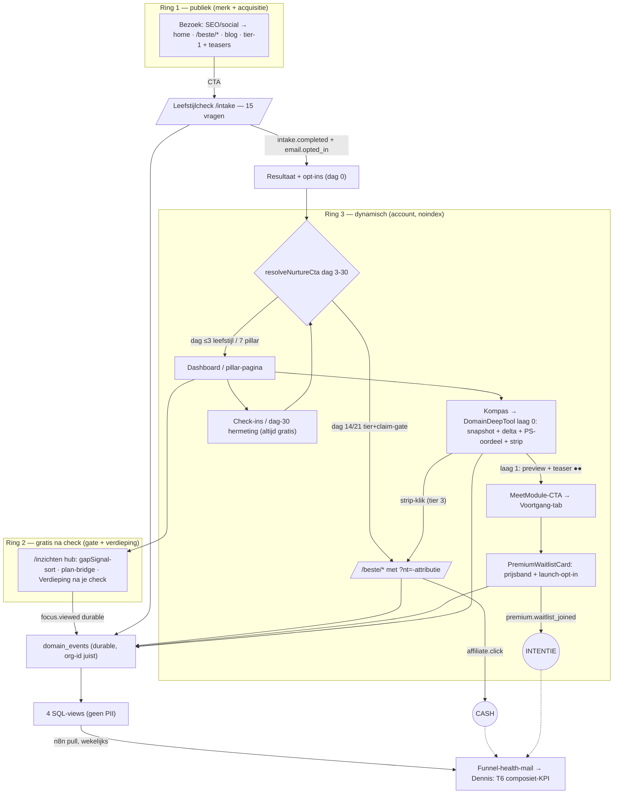

# Fable — Geïntegreerd vervolgplan juli 2026 (DomainDeepTool + conversie + moat)

> **Layer 3 — Strategie/besluitlog + Cursor-prompt-levering.** Sluit de open gaten die
> conversie, geloofwaardigheid en meetbaarheid blokkeren vóór er nieuwe features gepromoot
> worden, en levert het geprioriteerde 4-weken-vervolg als zes copy-paste Cursor-prompts.
> Bouwt op: `PLAN_DOMAIN_DEEP_TOOL.md` · `fable-conversie-datastrategie-2026-07.md` ·
> `fable-moat-google-ai-premium-2026-07.md` · `fable-kennisbank-tier-herziening-2026-07.md` ·
> `fable-cursor-prompts-moat-2026-07.md` · `moat-kpi-review-2026-07.md` ·
> `fable-architectuur-synthese-rapport-2026-07.md` ·
> `fable-leefstijlcheck-metadata-evidence-audit-2026-07.md` (de evidence-audit — al gearchiveerd).
> Alles hieronder geverifieerd tegen de code op **2026-07-05** (branch `main`, commit `43c65e0`).
> Geen code gewijzigd, geen commits.

**Composiet-KPI (leidend):** `intake.completed` → binnen 30 dagen geattribueerde
`affiliate.click` OF `premium.waitlist_joined`, per intake-weekcohort (T6).
**Deep-tool meetpunt-regel:** `domain_tool_snapshot_viewed` → `domain_tool_tier_preview_click`
→ `premium.waitlist_joined` OF `affiliate.click`.
**30-dagen review:** 4 augustus 2026 (conform `moat-kpi-review-2026-07.md`).

---

## 1. Executive summary

1. **De hypothese-tabel uit de opdracht was op zes punten verouderd — in gunstige zin.** Naast de bekende LIVE-items blijken óók al gedaan: entitlements dark-launch (`ba84f5d`, `src/lib/db/entitlements.ts` + migratie `20260704140000`), de melatonine-slug-fix (`SLEEP_SUPPLEMENT_SLUGS` = alleen magnesium), de allowlist-drift-fix, de extractie van Sleep/Stress/Beweging/Verbinding-schermen uit `Dashboard.tsx`, `VoortgangHub` achter `next/dynamic`, en de evidence-audit is al gearchiveerd als `fable-leefstijlcheck-metadata-evidence-audit-2026-07.md`.
2. **De drie acute lekken staan exact waar de opdracht ze vermoedde:** (a) de zes P0-copyregels + twee metadata-velden + twee vitaliteit-strings zijn ongewijzigd fout (`explanation-copy.ts:17-77`, `insight-metadata.ts:71-74,154-157`, `vitality-score-copy.ts:61,107`); (b) de T1-preview is een doodlopende toggle zonder pad naar de waitlist (`DomainDeepTool.tsx:298-310`); (c) er is geen enkele SQL-view — de composiet-KPI is alleen met handwerk afleesbaar.
3. **Eén ding kan alleen Dennis verifiëren:** of de migraties `20260704120000` (waitlist-CHECK-fix + price_indication) en `20260704140000` (entitlements) op de **productie**-database zijn gedraaid. Zolang dat onbevestigd is, geeft de coach-waitlist in productie mogelijk nog steeds een 500 — checklist-punt 1.
4. **Volgorde bevestigd (Poort 1):** integriteit → funnel → meting → slaap. Prompt 1 (evidence P0) en prompt 2 (funnel) zijn shipbaar zonder afhankelijkheden; prompt 3 (views) vereist de prod-migratie; prompt 4 (slaap) pas ná 1–2.
5. **T2 blijft geconsolideerd** (`PremiumWaitlistCard` bovenaan de Voortgang-hub, `KompasBegeleidingLink` per domein); `DeepToolCoachModule` is dead code geworden en wordt in prompt 2 verwijderd.
6. **Prompt 6 = verbinding-content** (niet dag-0 nurture): verbinding is sinds rules 1.3.0 een volwaardig interventiedomein met nul content en een misleidende taxonomy-proxy — dat is een integriteits-gat in de check-belofte en past bij de north star (geloofwaardigheid vóór promotie). Dag-0 blijft week-4-copywerk uit het conversieplan.

---

## 2. F1 — Verificatie: WEL/NIET-tabel

### Spoor A — DomainDeepTool

| # | Item | Status | Bewijs (pad:regel) |
|---|---|---|---|
| A1 | Voeding-pilot op shell, 3 lagen | **LIVE** | `src/components/dashboard/DomainDeepTool.tsx` (461 r., shell + MeetModule); `Dashboard.tsx:2888-3197` (`VoedingScreen` op de shell) |
| A2 | `DeepToolCoachModule` | **DEAD CODE** | Export op `DomainDeepTool.tsx:416`; 0 imports in heel `src/` (grep). T2 in de tool = `KompasBegeleidingLink` (`Dashboard.tsx:3194`) sinds de waitlist-consolidatie `8382a17` |
| A3 | T2 geconsolideerd (één waitlist) | **LIVE** | `PremiumWaitlistCard.tsx` (feature `premium-coaching`, 5 prijsbanden, launch-mail-opt-in); mount bovenaan Voortgang-navigatie (`VoortgangHub.tsx:987`); `KompasBegeleidingLink` op alle 5 domein-schermen → `/dashboard?tab=voortgang` |
| A4 | Nutrition-delta in laag 0 | **OPEN** | `src/lib/nutrition-delta.ts` (`compareNutritionEstimates`, `deltaStatementFor`) heeft alleen intake-flow-consumers (nutrition-log-API, `NutritionCapture`, `NutritionResultView`); `DashboardData.nutritionIntake` heeft geen vorige band (`types/dashboard.ts:151-162`) |
| A5 | Preview-klik → waitlist | **OPEN** | `DeepToolMeetModule.togglePreview` (`DomainDeepTool.tsx:298-310`) opent alleen bullets; geen link naar de waitlist-kaart |
| A6 | Vervolg-domeinen op shell | **OPEN** (wel geëxtraheerd) | `SleepScreen.tsx` (485 r.), `StressScreen.tsx`, `BewegingScreen.tsx`, `VerbindingScreen.tsx` bestaan als eigen bestanden maar dupliceren nog `KOMPAS_LIGHT`/`KompasLightPanel`/`SoonPill` lokaal — niet op de shell |
| A7 | `DriverDeepView` energie/herstel | **OPEN** | 0 hits; `READOUT_DRIVERS` (`domain-role.ts:20`) heeft alleen taxonomy-consumers, geen UI |

### Spoor B — Conversie & data

| # | Item | Status | Bewijs |
|---|---|---|---|
| B1 | Waitlist-500-fix + consolidatie + prijsindicatie | **Code LIVE; prod-deploy ONBEVESTIGD** | Migratie `supabase/migrations/20260704120000_premium_waitlist_consolidation.sql` (9 feature-keys incl. `premium-coaching`, `price_indication` met 5 banden) in repo; of hij op de productie-DB is gedraaid is vanuit de repo niet verifieerbaar → **checklist 1** |
| B2 | Account-scoped durable events | **LIVE en compleet** | `src/app/api/account/events/route.ts` (allowlist: `domain_tool.snapshot_viewed`, `domain_tool.tier_preview_clicked`, `focus.viewed`); `src/lib/account-events-client.ts`; emits in `DomainDeepTool.tsx:149,305` en `InzichtenFocusViewedPing.tsx:21`; waitlist-route emit met `account.organization_id` (`waitlist/route.ts:169`) — default-org-lek dicht |
| B3 | n8n + SQL-views (`v_funnel_week` etc.) | **OPEN** | Geen views-migratie in `supabase/migrations/`; laatste migraties zijn waitlist-consolidatie + entitlements |
| B4 | PostHog / Sentry | **NIET actief** (bevestigd) | 0 hits in `package.json` |
| B5 | Event-stubs (0 emit-sites) | **4 resterend** | `plan.tier_action_clicked`, `plan.evidence_clicked`, `plan.theme_switched`, `intake.cta_to_primary_checkin` — alleen registratie/allowlist. `focus.viewed` is inmiddels wél live (weaving-prompt) |
| B6 | Allowlist-drift `intake.cta_to_nutrition_log` | **GEFIXT** | Client-union (`intake-events-client.ts:4-21`) en route-allowlist (`api/intake/events/route.ts:12-29`) zijn in sync; de slug staat in geen van beide |
| B7 | Dag-0 herinrichting (PLAN_FUNNEL 1A) | **OPEN** | `nurture.ts:170-240`: dag-0 draait op de CTA-resolver maar de mail-copy is nog recap-opzet; geen eigen Overtrainer-sequence |
| B8 | Entitlements dark-launch | **LIVE — stond niet in de hypothese** | `ba84f5d`; `src/lib/db/entitlements.ts` (`hasFeature`, fail-open), migratie `20260704140000_account_entitlements.sql`; `VoortgangHub` achter `next/dynamic` (`Dashboard.tsx:37`) |

### Spoor C — Moat & kennislaag

| # | Item | Status | Bewijs |
|---|---|---|---|
| C1 | Teaser+gate tier ≥2 + sitemap `/inzichten` | **LIVE** | `kennisbank/[slug]/page.tsx:175-187` (`isGated` + `canAccessVerdieping`), `KennisbankVerdiepingGate.tsx`, `kennisbank-access.ts`; `sitemap.ts:74` |
| C2 | Tier-herziening 4 entries | **LIVE** | `c03dca4` + filtertest `3b47388` |
| C3 | Weaving-consumer | **LIVE** | `InzichtenPlanBridgeCard` (`inzichten/page.tsx:237`), `InsightPhaseNote` (`BlogArticlePage.tsx:254` + kennisbank-page), gapSignal-sort (`inzichten/page.tsx:99-107`), `InzichtenFocusViewedPing` (`page.tsx:228`) |
| C4 | CONTENT_METADATA 55/55 + category insightSlugs | **LIVE** | `bd2cb69`; coverage-test dwingt volledigheid af (`src/data/__tests__/insight-metadata.test.ts`) |
| C5 | Evidence P0 copy | **NOG FOUT** (alle 6) | `explanation-copy.ts`: melatonine omgekeerd (r.21-22), cortisol_risk hersteltijd-claim (r.18), creatine trainings-aanname (r.19-20), Lage Batterij lichaams-claim (r.38), PILLAR_CONTEXT slaap (r.74) + voeding (r.77) |
| C6 | insight-metadata P0-velden | **NOG AANWEZIG** | `middagdip-bloedsuiker-na-40` gapSignal (`insight-metadata.ts:71-74`); `oxidatieve-stress` relatedSupplementId (`:154-157`) |
| C7 | vitality-score-copy verbinding | **NOG FOUT** | locked-body zonder verbinding (`vitality-score-copy.ts:61`); `METINGEN_DOMAINS_HINT` "(slaap, stress, voeding, beweging)" (`:107`) |
| C8 | `creatine_signal` recoveryPrimary-tak | **NOG AANWEZIG** | `intake-engine.ts:196-201`: `recoveryPrimary` vuurt zonder trainingsbelasting; `RULES_VERSION = "1.3.0"` (r.12) |
| C9 | Verbinding-content | **0/55 + lege map + proxy** | 0 entries `theme: "connection"` in `insight-metadata.ts`; `THEME_CONTENT_MAP.connection` leeg (`theme-content-map.ts:30-34`); taxonomy `verbinding-steun` heeft alléén `stress-werk-grenzen-stellen` (`category-taxonomy.ts:142-150`) |
| C10 | KPI-baseline (moat-kpi-review §2) | **LEEG** | Tabel niet ingevuld → checklist 3 |
| C11 | melatonine in `SLEEP_SUPPLEMENT_SLUGS` (B9) | **GEFIXT** | `build-recommendations.ts:106` = `new Set(["magnesium"])` |
| C12 | Evidence-audit archiveren (F6-eis opdracht) | **AL GEDAAN** | `docs/cursors/fable-leefstijlcheck-metadata-evidence-audit-2026-07.md` bestaat en is de bron voor prompt 1 en 5 |
| C13 | Leefstijlcoach-disclaimer (moat-besluit 6) | **LIVE — bonus** | commits `d69f06d`/`15243d7` |

**Hypothese-correcties (opdracht-bijlage):** de rijen "Evidence P0", "Preview→waitlist",
"Nutrition-delta", "n8n views", "Slaap", "creatine_signal", "DriverDeepView" en
"Verbinding" kloppen (OPEN). Onjuist of onvolledig waren: evidence-audit-archief (bestaat al),
entitlements dark-launch (al gebouwd), melatonine-slug + allowlist-drift (al gefixt),
domein-scherm-extractie + `next/dynamic` (al gedaan), en `DeepToolCoachModule` (door de
consolidatie dead code geworden — het plandoc-wireframe is op dat punt verouderd, zie §8).

---

## 3. F2 — Diagnose

**Spoor A (deep tool):** de pilot staat, de funnel niet af. De T1-preview meet nieuwsgierigheid
maar biedt geen vervolgstap — het intentie-been eindigt in een toggle. De snapshot toont banden
maar geen beweging, terwijl de delta-bouwsteen (`nutrition-delta.ts`) al bestaat en getest is.
De shell is klaar voor domein #2, maar vier schermen dupliceren nog altijd hun bouwstenen.

**Spoor B (meetbaarheid):** de durable funnel is af (dat was hét gat van vorige week), maar
niemand kan hem aflezen: geen views, geen n8n, en de composiet-KPI T6 bestaat alleen als
SQL-handwerk. De enige mogelijk-nog-live productiebug (waitlist-500) hangt op een
migratie-deploy die alleen Dennis kan bevestigen.

**Spoor C (geloofwaardigheid):** de moat-stack (gate, tiers, weaving, metadata) is compleet —
maar de copy-laag eronder beweert op vier plekken dingen die de engine niet meet, waarvan één
feitelijk omgekeerd aan de trigger. Twee methodiek-strings beschrijven de eigen vitaalscore
verkeerd (verbinding ontbreekt). Wie verbinding als prioriteit krijgt, komt in een lege winkel
met als enige "evidence-link" een werkstress-artikel dat een ander construct meet.

**Kruis-risico's uit de opdracht — status en oplossing:**

1. *Copy-integriteit ondermijnt premium-intentie vóór je op data stuurt* → bevestigd; daarom is prompt 1 onvoorwaardelijk eerst (Poort 5).
2. *Deep-tool funnel niet één klik-pad* → bevestigd; prompt 2 maakt preview → waitlist één klik (Poort 4).
3. *Geen geautomatiseerde aflezing* → bevestigd; prompt 3 levert de views, Dennis de n8n-pull (Poort 6).
4. *creatine_signal recoveryPrimary-tak* → bevestigd; prompt 1 maakt de copy tak-veilig, prompt 5 dicht de engine-tak met RULES_VERSION-bump (Poort 5).
5. *Documentatie-schuld* → PLAN_DOMAIN_DEEP_TOOL F6-checkboxes + T2-wireframe verouderd; update-instructie in §8 (geen commit).

---

## 4. F3 — Beslissingen (Poorten 1–8)

**Poort 1 — Volgorde 4 weken → A (default bevestigd): integriteit → funnel → meting → slaap.**
Concreet: prompt 1 → prompt 2 → prompt 3 → prompt 5 → prompt 4 → prompt 6.
Twee toegestane verschuivingen: (a) prompt 3 mag parallel aan 1–2 zodra Dennis de
consolidatie-migratie in productie bevestigt (de views-migratie faalt anders op de ontbrekende
`price_indication`-kolom); (b) prompt 6 (verbinding) is onafhankelijk en mag elk moment ná
prompt 1 (zelfde bestand `insight-metadata.ts`, disjuncte regels). Niets mag vóór prompt 1:
copy die de engine tegenspreekt ondergraaft elke intentie-meting die je daarna doet.

**Poort 2 — T2-architectuur → A (bevestigd): geconsolideerde `PremiumWaitlistCard` op Voortgang blijft; geen terugkeer naar 8 per-domein waitlists.**
`DeepToolCoachModule`: **verwijderen** (optie A). Het is dead code sinds `8382a17`; het
T2-patroon is definitief kaart-op-Voortgang + `KompasBegeleidingLink` per domein, en een
ongebruikte export met "Premium · begeleiding"-copy is precies het soort dormant component dat
de meetregel verbiedt te reactiveren zonder meetpunt. Verwijdering zit in prompt 2 (zelfde
bestand, één diff). Herintroductie kan altijd uit git-historie als een domein ooit een eigen
coach-verhaal krijgt — nu is dat YAGNI.

**Poort 3 — Deep-tool laag 0 → A: nutrition-delta ja, én de curiosity-teaser nu.**
Delta: `NutritionIntakeItem` krijgt `previousBand`; de snapshot toont per gewijzigd nutriënt
een klein "was: {bandlabel}" naast de huidige band-pill. Copy blijft banden-taal
(inname-inschatting, "vuistregel, geen meting") — de bestaande `NUTRITION_BAND`-labels zijn al
conform; er komt géén status- of causale taal bij. De curiosity-teaser ("Jouw eiwitdoel: ●● g —
wordt berekend zodra je start") gaat mee in dezelfde MeetModule-diff (prompt 2): hij was al
ontworpen (conversiedoc §6.2), kost drie regels, en de preview-CTA (Poort 4) heeft een
concrete belofte nodig om naartoe te klikken. Geen valse data: ●● is expliciet placeholder.

**Poort 4 — Preview → waitlist → C: inline CTA in de geopende preview, deep-link naar de Voortgang-tab.**
Geen scroll-hack en geen apart scherm. De `PremiumWaitlistCard` staat **bovenaan** de
Voortgang-hub-navigatie (`VoortgangHub.tsx:987`), dus `/dashboard?tab=voortgang` landt er
direct op — exact het pad dat `KompasBegeleidingLink` al gebruikt (bewezen patroon). Meting:
hergebruik `dashboard_kompas_begeleiding_link_click` met nieuwe surface-waarde
`meetmodule_{domain}` (bestaand GA4-event, dus geen drie-plekken-registratie nodig). Het
durable been is al compleet: `domain_tool.tier_preview_clicked` → `premium.waitlist_joined`
zijn beide account-joinbaar. **Eén prijsinstrument:** de prijsbanden op de waitlist-kaart —
er komt geen tweede scherm en geen prijs in de MeetModule.

**Poort 5 — Evidence P0 → bevestigd als blokkerend, en de engine-fix gaat apart.**
Copy-fix (prompt 1) is data-only, vandaag shipbaar, en maakt élke regel waar onder de
huidige engine (de creatine-regel wordt de tak-veilige variant uit de audit). De engine-fix
(prompt 5) verandert signaalgedrag → eigen RULES_VERSION-bump (1.3.0 → **1.3.1**), eigen
tests, eigen changelog-regel. Zelfde PR zou de P0-copy laten wachten op engine-review — de
verkeerde koppeling. 1.3.1 is veilig: `isVitalityDeltaComparable` blijft true (beide versies
≥ 1.3.0-grens; het signaal raakt scores/vitaliteit niet).

**Poort 6 — n8n → B-light bevestigd: self-hosted op de VPS, pull-based; de views-migratie nu, de n8n-installatie bij Dennis.**
PostHog blijft uit (trigger, geen datum). **Register-zin, letterlijk, vóór activatie in
`VERWERKINGSREGISTER.md` én de privacyverklaring:**
> "n8n (workflow-automatisering, self-hosted op de eigen Hetzner-VPS, EU) leest op schema
> geaggregeerde funnel-statistieken uit read-only databaseviews zonder persoonsgegevens;
> er is geen externe doorgifte en geen nieuwe verwerker."
De views bevatten uitsluitend counts, ratio's, banden en weken (geen e-mail, geen session-id
in de output); de `n8n_readonly`-rol kan de brontabellen niet lezen.

**Poort 7 — Slaap als domein #2 → bevestigd: ná prompt 1–2, niet parallel.**
Gratis laag 0 slaap heeft geen banden-equivalent; het snapshot-equivalent is:
**slaapscore-gauge + "Op basis van je laatste check-in · {datum}"** uit
`intake_domain_checkin` (nieuw veld `domainCheckinDates` in `DashboardData`), met de bestaande
Ritme-hefbomen als leefstijl-laag en de magnesium-strip als tier-3-pad. Empty state = de
shell-tekst "Nog geen check-in voor dit domein" + check-in-CTA. T1 = slaaplog-preview
(bedtijd/wektijd, avondprikkels, weektrend — self-report, expliciet "geen slaapmeting").
T2 = bestaande `KompasBegeleidingLink`. Het losse `dashboard_slaap_premium_upsell`-event
vervalt — opgevolgd door `domain_tool_snapshot_viewed` met `domain: "slaap"`, zelfde patroon
als bij voeding.

**Poort 8 — Wat NIET nu → bevestigd, met twee aanvullingen.**
Geen Stripe-checkout (entitlements blijven dark-launch), geen B2B, geen PostHog, geen tweede
deep tool parallel aan slaap, geen `affiliate_clicks`-tabelwijziging. Aanvullend: (a) geen
`DriverDeepView` in deze 4 weken (P2 — klein, maar elke week aandacht vóór de funnel leest is
verkeerd besteed); (b) geen activatie van de 4 resterende event-stubs zonder bijbehorende
feature (stubs zijn registratie-vooruitbetaling, geen schuld); (c) dag-0-herinrichting blijft
week-4-copywerk (conversieplan) — geen prompt in deze set.

---

## 5. F4 — Ontwerp

### 5.1 Geïntegreerde architectuur



Waar de sporen samenkomen: de deep tool (laag 0 = ring-3-assemblage van check-data +
tier-3-affiliate = cash-been; laag 1→2 = intentie-been), en de views (beide benen in één
T6-cijfer). Ring 2 (gate/verdieping) voedt terugkeer; ring 1 blijft ongegate acquisitie.

### 5.2 Open-werk matrix

| # | Item | Spoor | Prio | Effort | Blokkeerder | Cursor-prompt |
|---|---|---|---|---|---|---|
| 1 | Evidence P0: 6 copy-regels + 2 metadata-velden + 2 vitaliteit-strings | C | **P0** | 0,5 d | — | **1** |
| 2 | Preview→waitlist-CTA + curiosity-teaser + `DeepToolCoachModule` verwijderen | A/B | **P0** | 0,5 d | — | **2** |
| 3 | Nutrition-delta in laag-0-snapshot | A | P1 | 0,5 d | — (zelfde diff) | **2** |
| 4 | Prod-deploy migraties bevestigen (waitlist + entitlements) | B | **P0** | 5 min | alleen Dennis | — (checklist 1) |
| 5 | 4 SQL-funnel-views + `n8n_readonly`-rol | B | P1 | 0,5 d | item 4 (`price_indication`-kolom) | **3** |
| 6 | n8n installeren + weekrapport + register-update | B | P1 | 1 d (Dennis) | item 5 | — (checklist 2) |
| 7 | `creatine_signal` engine-fix + RULES_VERSION 1.3.1 | C | P1 | 0,5 d | prompt 1 eerst | **5** |
| 8 | Slaap op DomainDeepTool-shell + `domainCheckinDates` | A | P1 | 1 d | prompts 1–2 | **4** |
| 9 | Verbinding-content + taxonomy-fix | C | P1 | 0,5–1 d | prompt 1 eerst (zelfde bestand) | **6** |
| 10 | KPI-baseline invullen (moat-kpi-review §2) | C | **P0** | 30 min | GA4/SC-toegang (Dennis) | — (checklist 3) |
| 11 | Dag-0 herinrichting (recap → eerste actie) | B | P2 | 0,5 d | copy-besluit Dennis | — (wk 4, conversieplan) |
| 12 | `DriverDeepView` energie/herstel | A | P2 | 1 d | ná slaap | later |
| 13 | Stress/beweging-schermen naar shell | A | P2 | 1 d/domein | data-besluit ná slaap (Poort 5 conversiedoc) | later |
| 14 | `rules_version`-kolom op check-in-logtabellen (blinde vlek B5) | B | P2 | klein | volgende migratieronde | later |
| 15 | 4 event-stubs activeren | B | P2 | n.v.t. | emit-sites ontstaan pas bij features | geen |

Dekking: alle OPEN-items uit §2 staan in de matrix; niets hierin is al live (gecheckt tegen
commits `c9ba895`…`43c65e0`).

**Bestandsconflicten tussen prompts (volgorde-dwang):**
`insight-metadata.ts`: 1 → 6 · `DomainDeepTool.tsx`/`Dashboard.tsx`/`account-dashboard.ts`/`types/dashboard.ts`: 2 → 4 · overige prompts disjunct.

### 5.3 Acceptatie + meetpunt per open item

**Evidence P0 (prompt 1).** De copy mag per regel alléén beweren wat de trigger meet:
`melatonine_signal` = `SLP_ONSET <= 2 && STR_FREQ >= 3` (stress juist beheersbaar,
`intake-engine.ts:202-203`); `cortisol_risk` = STR_FREQ+SLP_CONS+NRG_PATN (géén
STR_RCV/hersteltijd); `creatine_signal` heeft drie takken waarvan één zonder training
(`:196-201`) → copy mag geen trainingsaanname bevatten tot prompt 5 draait; "Lage Batterij"
kan puur movement-getriggerd zijn; voeding-prioriteit kan door alleen NUT_PROT ontstaan
(NUT_O3 hoog). Meetpunt: reveal-feedback-rating ("Herken je jezelf…") vóór/na, plus
ongewijzigde hub-sort-events.

**Deep-tool delta (prompt 2).** Veld: `NutritionIntakeItem.previousBand?: NutritionIntakeBand`
(`src/types/dashboard.ts:151-154`), gevuld in `loadAccountDashboardData` uit de een-na-laatste
`intake_intake_log`-rij via `compareNutritionEstimates`. Acceptatie: "was: …" verschijnt
alleen bij ≥2 logs én bandverschil. Meetpunt: geen nieuw event (weergave-verrijking);
effect lees je af aan `dashboard_voeding_checkin_click` (her-log-frequentie).

**Preview→waitlist (prompt 2).** GA4: `dashboard_kompas_begeleiding_link_click` met
`surface: "meetmodule_voeding"` (bestaand event, nieuwe surface-waarde). Durable: bestaande
keten `domain_tool.tier_preview_clicked` → `premium.waitlist_joined` (beide al live, joinbaar
op account/e-mail). Geen nieuw domain_event-type.

**n8n-views (prompt 3).** Exacte namen: `v_funnel_week`, `v_nurture_ctr`, `v_premium_intent`,
`v_checkin_activity`. Geen PII: uitsluitend week/event_type/counts/ratio's/banden — geen
e-mail, geen session-id, geen account-id in enige view-output. Voorbeeldquery voor het
weekrapport-kopcijfer (T6-benadering):
```sql
select week, event_type, events from v_funnel_week
where week >= date_trunc('week', now() - interval '28 days')
order by week desc, event_type;
```

**Slaap deep tool (prompt 4).** Component-tree:
```
SleepScreen.tsx (herbouwd)
└─ DomainDeepTool (domain="slaap")          ← shell: header + gauge + datum + check-in-CTA
   ├─ sectie "Leefstijl eerst · Ritme-hefbomen"      (bestaand, DeepToolSectionHeader)
   ├─ sectie "Ondersteunend · Voeding & supplementen" (bestaand: hint + magnesium-strip)
   ├─ sectie "Slaaproutine tools" + DeepToolSoonPill  (bestaand grid)
   ├─ DeepToolMeetModule (T1: slaaplog, locked)       (nieuw)
   └─ KompasBegeleidingLink (T2)                      (bestaand)
+ FooterLinks (plan / gids / inzichten)               (bestaand, buiten shell-children ok)
```
Meetpunt: `domain_tool_snapshot_viewed` / `domain_tool_tier_preview_click` met
`domain: "slaap"` (GA4 + durable, automatisch via de shell) vs de voeding-baseline.

### 5.4 Copy-principes (hergebruik audit)

1. **Score-first is de referentiestandaard:** "laag in jouw antwoorden" (`score-bands.ts:42`),
   "Datapunt op basis van je antwoorden — geen diagnose" (`results-reveal-copy.ts:5`).
   Copy op laag N beweert alleen wat laag N-1 vastlegt (epistemische ladder, audit §2).
2. **Inname vs status** (`docs/core/COMPLIANCE.md`): banden en delta's zijn
   inname-inschattingen — "bewoog de goede kant op", nooit "tekort" of "gemeten".
3. **Drie "premium"-betekenissen strikt gescheiden:** *Verdieping na je check* = gratis
   kennisbank (nooit "premium" in copy) · *Premium · meten/begeleiding* = de betaalde
   Plus-laag (alleen in de deep tool en de waitlist-kaart) · *q2_content* = toekomstige
   programma-content. Geen enkele prompt hieronder introduceert het woord "premium" in de
   gratis laag.

---

## 6. F5 — Cursor-prompts

> Volgorde: **1 → 2 → 3 → 5 → 4 → 6** (3 mag parallel zodra checklist-punt 1 bevestigd is;
> 5 en 6 mogen elk moment ná 1). Elke prompt is zelfstandig shipbaar.

### Prompt 1 — Evidence P0-bundel (copy + metadata + vitaliteit-strings)

```text
## Rol
Je bent Next.js/TypeScript developer voor PerfectSupplement (perfectsupplement.nl).

## Context
Lees vóór je begint:
- docs/cursors/fable-leefstijlcheck-metadata-evidence-audit-2026-07.md (§6 voor/na-paren, §10 P0)
- docs/core/COMPLIANCE.md (inname vs status) en src/lib/score-bands.ts (referentie-toon)
- Bestanden (exacte paden, geverifieerd):
  - src/data/explanation-copy.ts — SIGNAL_COPY (r.17-25), PROFILE_COPY (r.37-41),
    PILLAR_CONTEXT_COPY (r.73-80): hier zitten de zes te vervangen regels
  - src/data/insight-metadata.ts — entry "middagdip-bloedsuiker-na-40" (r.71-74) en
    "oxidatieve-stress" (r.154-157): twee veld-verwijderingen
  - src/lib/vitality-score-copy.ts — locked-body-string (r.61) en METINGEN_DOMAINS_HINT (r.107)
  - src/lib/__tests__/recommendation-explainer.test.ts — r.98 asserteert de oude
    PILLAR_CONTEXT_COPY.voeding-string; die assert werk je bij (r.42 en r.112 asserteren
    SIGNAL_COPY.omega3_deficiency — die copy blijft ongewijzigd, asserts niet aanraken)
- ALLEEN LEZEN: src/lib/intake-engine.ts (triggers, r.186-210), src/lib/recommendation-explainer.ts,
  src/components/intake/RevealHeroCard.tsx (consumers van deze copy)

## Taak
1. src/data/explanation-copy.ts — vervang exact zes strings (score-first, uit de audit §6):
   - SIGNAL_COPY.melatonine_signal →
     "Inslapen kost je tijd, terwijl stress in jouw antwoorden beheersbaar lijkt"
   - SIGNAL_COPY.cortisol_risk →
     "Je gaf aan vaak gestrest te zijn, met een onregelmatig slaapritme en lage dagenergie — dat patroon vraagt eerst om ritme en herstelmomenten"
   - SIGNAL_COPY.creatine_signal →
     "Herstel kwam laag uit jouw antwoorden"
   - PROFILE_COPY["Lage Batterij"] →
     "Energie of beweging kwam laag uit jouw antwoorden — daar zit je snelste winst"
   - PILLAR_CONTEXT_COPY.slaap →
     "Slaap kwam in jouw antwoorden het laagst naar voren — daar begin je"
   - PILLAR_CONTEXT_COPY.voeding →
     "Voeding kwam in jouw antwoorden het laagst naar voren — daar begin je"
   Alle overige regels (incl. omega3_deficiency, sleep_issue_no_stress, low_recovery_no_load)
   blijven byte-identiek.
2. src/data/insight-metadata.ts — verwijder het veld `gapSignal: "omega3_deficiency"` bij
   "middagdip-bloedsuiker-na-40" (theme blijft staan) en het veld
   `relatedSupplementId: "omega-3"` bij "oxidatieve-stress" (theme blijft staan).
   Raak geen enkele andere entry aan.
3. src/lib/vitality-score-copy.ts — twee strings conform rules 1.3.0 (verbinding is
   interventiedomein):
   - r.61: "Slaap, stress, voeding en beweging — samengebracht in één score. …" →
     "Slaap, stress, voeding, beweging en verbinding — samengebracht in één score. Zie waar je lekt, en waar je het snelst winst pakt."
   - METINGEN_DOMAINS_HINT: "(slaap, stress, voeding, beweging)" →
     "(slaap, stress, voeding, beweging, verbinding)" — rest van de zin ongewijzigd.
4. src/lib/__tests__/recommendation-explainer.test.ts — werk de assert op r.98 bij naar de
   nieuwe PILLAR_CONTEXT_COPY.voeding-string. Geen andere test-wijzigingen tenzij vitest
   aantoonbaar op een van de zes oude strings faalt; werk dan alleen die assert bij.

Privacy/meten: copy- en data-only — geen nieuwe events; bestaande metingen (hub-sort,
fase-regel, reveal) blijven ongewijzigd doorlopen.

## Constraints
- GEEN wijzigingen aan src/lib/intake-engine.ts (RULES_VERSION-bump is een aparte prompt)
- Geen wijzigingen aan componenten, routes of andere data-bestanden
- Nederlandse UI strings, Engelse variabelen/functies
- Geen medische claims; inname-taal, geen status-taal
- Verander NIETS aan: src/app/intake/, src/data/affiliate-links.ts, src/lib/scoring.ts,
  globals.css, deploy.sh, .env.local
- Geen git commands, geen commit

## Acceptatiecriterium
- [ ] Geen SIGNAL_COPY/PROFILE_COPY/PILLAR_CONTEXT_COPY-regel beweert iets dat de
      bijbehorende trigger niet meet (check tegen intake-engine.ts getDeficiencySignals)
- [ ] "middagdip-bloedsuiker-na-40" heeft geen gapSignal; "oxidatieve-stress" geen
      relatedSupplementId; beide houden hun theme
- [ ] Beide vitaliteit-strings noemen vijf interventiedomeinen incl. verbinding
- [ ] Diff raakt uitsluitend de 3 genoemde src-bestanden + 1 testbestand
- [ ] Geen nieuwe console.log in src/
- [ ] tsc groen; vitest groen (insight-metadata.test.ts blijft slagen — de verwijderde
      velden zijn optioneel)

## Verificatie
Draai vóór je stopt:
1. grep -rn "console.log" src/
2. npx tsc --noEmit
3. npx vitest run

Niet automatisch committen. Stop na de aanpassingen zodat ik kan reviewen.
# Voorgestelde commit: git add -A && git commit -m "fix(evidence): P0 score-first copy, metadata-velden en vitaliteit-strings conform engine-triggers"
```

**Meetpunt:** reveal-feedback-rating vóór/na + ongewijzigde hub-sort — hier lees je af of de
herschreven herkenning-copy beter herkend wordt.

---

### Prompt 2 — Deep-tool funnel: preview→waitlist, curiosity-teaser, nutrition-delta laag 0

```text
## Rol
Je bent Next.js/TypeScript developer voor PerfectSupplement (perfectsupplement.nl).

## Context
Lees vóór je begint:
- docs/plan/PLAN_DOMAIN_DEEP_TOOL.md (§4.2 lagen, §4.5 meetpunten)
- docs/cursors/fable-conversie-datastrategie-2026-07.md (§6.2 T1-invulling)
- docs/core/COMPLIANCE.md (inname vs status)
- Bestanden (exacte paden, geverifieerd):
  - src/components/dashboard/DomainDeepTool.tsx — DeepToolMeetModule (r.282-413) met
    previewOpen-state en togglePreview; DeepToolCoachModule (r.416-461) is DEAD CODE
    (0 imports — verifieer met grep en verwijder); Link is al geïmporteerd (r.5)
  - src/components/dashboard/KompasBegeleidingLink.tsx — KOPIEER het meetpatroon:
    trackEvent("dashboard_kompas_begeleiding_link_click", { surface }) + clarityTag,
    link naar /dashboard?tab=voortgang; dit bestand zelf NIET wijzigen
  - src/components/dashboard/Dashboard.tsx — VoedingScreen r.2859-3197: snapshot-items
    (r.2916-2952, band-pill via NUTRITION_BAND en SNAPSHOT_BAND_COLOR) en de
    DeepToolMeetModule-aanroep (r.3186-3193)
  - src/lib/account-dashboard.ts — nutritionIntake wordt gebouwd uit de laatste
    intake_intake_log-rij (r.328-346); logRows bevat ALLE logs gesorteerd op logged_at
  - src/lib/nutrition-delta.ts — compareNutritionEstimates(previous, current) → per
    nutriënt { from, to, direction }; puur en getest; NIET wijzigen
  - src/types/dashboard.ts — NutritionIntakeItem (r.151-154)

## Taak
1. src/types/dashboard.ts — breid NutritionIntakeItem uit:
   `previousBand?: NutritionIntakeBand;` (optioneel, met doc-comment: alleen gezet als er
   een vorige log is én de band veranderde).

2. src/lib/account-dashboard.ts — vul previousBand:
   - Pak naast latestLog ook `const previousLog = logRows?.[logRows.length - 2]`.
   - Als beide een geldige estimate-array hebben: bereken
     `compareNutritionEstimates(previousEstimate, latestEstimate)` (import uit
     @/lib/nutrition-delta) en zet per item `previousBand = delta.from` uitsluitend waar
     `direction !== "unchanged"` (match op entry.nutrient vóór het mappen naar label).
   - Geen nieuwe query's — logRows wordt al volledig opgehaald.

3. src/components/dashboard/Dashboard.tsx — VoedingScreen snapshot-item:
   naast de bestaande band-pill, als item.previousBand bestaat, een subtiel label:
   `<span style={{ fontSize: 11, color: KOMPAS_LIGHT.subtle }}>was: {NUTRITION_BAND[item.previousBand].label.toLowerCase()}</span>`
   direct vóór de huidige pill (zelfde flex-rij). Geen andere snapshot-wijzigingen; de
   vuistregel-disclaimer blijft staan.

4. src/components/dashboard/DomainDeepTool.tsx — DeepToolMeetModule:
   a) Nieuwe optionele prop `teaser?: string`. Als previewOpen én teaser: render als eerste
      element in het preview-blok, vóór de bullets:
      `<div style={{ fontFamily: "var(--f-serif)", fontSize: 17, color: DEEP_TOOL_LIGHT.text }}>{teaser}</div>`
   b) Onder de note (nog binnen previewOpen): een CTA-link, hetzelfde meetpatroon als
      KompasBegeleidingLink maar met eigen surface:
      label "Zet me op de wachtlijst →", href "/dashboard?tab=voortgang",
      onClick: trackEvent("dashboard_kompas_begeleiding_link_click",
        { surface: `meetmodule_${domain}` }) en
      clarityTag("dashboard_kompas_begeleiding", `meetmodule_${domain}`).
      Stijl: zelfde inline-flex linkstijl als de bestaande toggle-button, kleur var(--sage),
      fontWeight 600.
   c) Verwijder de export DeepToolCoachModule volledig (r.416-461) — dead code sinds de
      waitlist-consolidatie. Verifieer eerst: grep -rn "DeepToolCoachModule" src/ mag alleen
      de definitie zelf tonen.

5. src/components/dashboard/Dashboard.tsx — geef de teaser mee aan de bestaande
   DeepToolMeetModule-aanroep in VoedingScreen:
   `teaser="Jouw eiwitdoel: ●● g — wordt berekend zodra je start"`

Privacy/meten: hergebruik van bestaande event-types (dashboard_kompas_begeleiding_link_click
met nieuwe surface-waarde; GA4/Clarity, geen domain_event) — geen drie-plekken-registratie
nodig. De durable funnel (domain_tool.tier_preview_clicked → premium.waitlist_joined) bestaat
al en blijft ongewijzigd. Payloads bevatten geen PII.

## Constraints
- Imports via `@/` (niet relatief)
- Nederlandse UI strings, Engelse variabelen/functies
- "use client" alleen waar het al staat
- Delta-copy is banden-taal (inname-inschatting) — nooit "tekort", nooit "gemeten"
- Geen nieuwe GA4-eventnamen, geen nieuwe domain_event-types
- Verander NIETS aan: src/app/intake/, src/data/affiliate-links.ts, src/lib/scoring.ts,
  globals.css, deploy.sh, .env.local, src/lib/nutrition-delta.ts,
  src/components/dashboard/KompasBegeleidingLink.tsx, PremiumWaitlistCard.tsx
- Geen git commands, geen commit

## Acceptatiecriterium
- [ ] Preview openen toont teaser-regel met "●● g" (geen echt getal) + bullets + note +
      CTA "Zet me op de wachtlijst →"
- [ ] CTA-klik navigeert naar /dashboard?tab=voortgang (PremiumWaitlistCard staat daar
      bovenaan) en vuurt dashboard_kompas_begeleiding_link_click met surface
      meetmodule_voeding
- [ ] Snapshot toont "was: …" uitsluitend bij ≥2 voedingslogs én een bandverschil;
      bij één log is de weergave identiek aan vandaag
- [ ] DeepToolCoachModule bestaat niet meer; grep -rn "DeepToolCoachModule" src/ → 0 hits
- [ ] Geen nieuwe console.log in src/
- [ ] tsc groen; vitest groen; build groen (stop een draaiende next dev eerst)

## Verificatie
Draai vóór je stopt:
1. grep -rn "console.log" src/
2. grep -rn "DeepToolCoachModule" src/
3. npx tsc --noEmit
4. npx vitest run
5. npm run build   (nooit naast een live dev-server)

Niet automatisch committen. Stop na de aanpassingen zodat ik kan reviewen.
# Voorgestelde commit: git add -A && git commit -m "feat(deeptool): preview→waitlist-CTA + eiwitdoel-teaser + inname-delta in snapshot; dead CoachModule weg"
```

**Meetpunt:** `dashboard_kompas_begeleiding_link_click` surface `meetmodule_voeding` (GA4) +
durable `domain_tool.tier_preview_clicked` → `premium.waitlist_joined` — hier lees je af of de
T1-preview intentie doorzet naar de wachtlijst.

---

### Prompt 3 — SQL funnel-views (migratie, geen app-code)

> **Blokkerende voorwaarde:** migratie `20260704120000_premium_waitlist_consolidation.sql`
> moet op productie gedraaid zijn (checklist 1) — anders faalt `v_premium_intent` op de
> ontbrekende `price_indication`-kolom.

```text
## Rol
Je bent Postgres/Supabase-engineer voor PerfectSupplement (perfectsupplement.nl).

## Context
Lees vóór je begint:
- docs/cursors/fable-conversie-datastrategie-2026-07.md §6.3 (transformaties T1-T6) en §9
- docs/cursors/fable-vervolg-geintegreerd-2026-07.md §5.3 (PII-regel views)
- Geverifieerde schema's:
  - public.domain_events: organization_id, occurred_at, event_type, session_id (uuid),
    email, payload (jsonb), delivered_to (supabase/migrations/20260529200000_domain_events.sql)
  - public.nurture_emails: session_id, email, sequence_day, scheduled_at, sent_at, status
    (pending|sent|failed|cancelled), profile_label (20260410000000_baseline_core_tables.sql:25-40)
  - public.premium_waitlist: account_id, feature, source, created_at, price_indication
    (20260628120000 + 20260704120000)
  - public.intake_domain_checkin: session_id, domain_key, score, created_at
  - public.intake_intake_log: session_id, estimate, logged_at, nutrition_score
  - Payload-keys: nurture.email_sent → sequence_day/profile_label/cta_kind/cta_slug;
    affiliate.click → categorie/comparison_slug + (bij attributie) session_id/sequence_day/
    profile_label/variant (src/app/api/affiliate/click/route.ts:88-101)

## Taak
Eén nieuw migratiebestand supabase/migrations/20260706120000_funnel_views.sql met vier
views (idempotent: create or replace view). GEEN wijziging aan tabellen, RLS-policies of
bestaande migraties. Geen rol/grants in dit bestand (die SQL draait Dennis apart, zie onder).

1. v_funnel_week — weekcounts per event-type (kop van het weekrapport):
   select date_trunc('week', occurred_at)::date as week, event_type, count(*) as events
   from public.domain_events
   where event_type in (
     'intake.completed','email.opted_in','nurture.scheduled','nurture.email_sent',
     'domain_tool.snapshot_viewed','domain_tool.tier_preview_clicked',
     'premium.waitlist_joined','premium.price_indicated','affiliate.click',
     'remeasure.invited','remeasure.completed','focus.viewed'
   )
   group by 1, 2;

2. v_nurture_ctr — per (week, sequence_day, profile_label, cta_kind, cta_slug):
   emails_sent, attributed_clicks, ctr. Sent-kant uit domain_events
   event_type='nurture.email_sent' (payload->>'sequence_day' etc.); click-kant uit
   event_type='affiliate.click' met payload ? 'session_id'. Join op session-id én
   sequence_day. Cast payload->>'session_id' defensief (alleen geldige uuid's meenemen,
   bv. via een regex-filter vóór de ::uuid-cast) zodat de view nooit op een malformed
   payload breekt. ctr = attributed_clicks::numeric / nullif(emails_sent,0), afgerond op 4
   decimalen. GEEN session_id of email in de select-output.

3. v_premium_intent — per week: joins per feature × source × price_indication:
   select date_trunc('week', created_at)::date as week, feature,
     coalesce(source,'onbekend') as source, coalesce(price_indication,'none') as price_indication,
     count(*) as joins
   from public.premium_waitlist group by 1,2,3,4;
   (GEEN account_id in de output.)

4. v_checkin_activity — per week: active_sessions (count distinct session_id over
   intake_domain_checkin ∪ intake_intake_log), totaal checkins, plus remeasure_invited en
   remeasure_completed uit domain_events (filter-aggregaten). Alleen counts in de output.

Zet bovenaan het bestand een comment-blok: doel, PII-regel ("views bevatten uitsluitend
weken, categorieën, counts en ratio's"), en de instructie dat Dennis dit handmatig in de
Supabase Dashboard SQL Editor draait (NOOIT supabase db push — remote migratie-historie is
leeg).

Lever daarnaast in je antwoord (NIET in de repo, want er hoort een wachtwoord in) het
role-blok dat Dennis apart draait:
  create role n8n_readonly login password '<VERVANG-DOOR-STERK-WACHTWOORD>';
  grant usage on schema public to n8n_readonly;
  grant select on public.v_funnel_week, public.v_nurture_ctr,
    public.v_premium_intent, public.v_checkin_activity to n8n_readonly;
plus de verificatie: `set role n8n_readonly; select count(*) from public.domain_events;`
moet permission denied geven, de vier views moeten leesbaar zijn. (Views draaien met
owner-rechten — standaard security_invoker=off — dus géén grants op brontabellen.)

## Constraints
- Idempotent (create or replace); draait foutloos op lege én gevulde database
- Geen PII-kolom in enige view-output (verifieer per view en benoem dat in je afronding)
- Geen wijziging aan app-code, tabellen, RLS of bestaande migraties
- Geen git commands, geen commit

## Acceptatiecriterium
- [ ] Bestand supabase/migrations/20260706120000_funnel_views.sql met exact 4 views
- [ ] Elke view select-output bevat uitsluitend week/categorie/count/ratio-kolommen
- [ ] v_nurture_ctr breekt niet op payloads zonder of met malformed session_id
- [ ] Role-blok + verificatiequery's geleverd in de afronding (niet in de repo)
- [ ] Geen console.log; tsc groen (geen TS geraakt — sanity check)

## Verificatie
1. Syntax-check de SQL (bv. door de statements lokaal tegen een lege postgres of via
   de Supabase SQL Editor in een read-only sessie te valideren; documenteer wat je deed)
2. grep -rn "console.log" src/
3. npx tsc --noEmit

Niet automatisch committen. Stop na de aanpassingen zodat ik kan reviewen.
# Voorgestelde commit: git add -A && git commit -m "feat(meet): funnel-views migratie voor pull-based n8n weekrapport (geen PII)"
```

**Meetpunt:** `v_funnel_week` als kop van het wekelijkse n8n-rapport — hier lees je groei en
de composiet-eerste-conversie (T6) af zonder handwerk.

---

### Prompt 4 — Slaap op de DomainDeepTool-shell

> **Pas uitvoeren ná prompt 2** (zelfde bestanden: `Dashboard.tsx`, `account-dashboard.ts`,
> `types/dashboard.ts`, `DomainDeepTool.tsx`).

```text
## Rol
Je bent Next.js/TypeScript developer voor PerfectSupplement (perfectsupplement.nl).

## Context
Lees vóór je begint:
- docs/plan/PLAN_DOMAIN_DEEP_TOOL.md (§4.1 slaap-rij, §4.2 shell, §4.4 compliance per laag)
- docs/cursors/fable-vervolg-geintegreerd-2026-07.md §5.3 (component-tree slaap)
- Bestanden (exacte paden, geverifieerd):
  - src/components/dashboard/SleepScreen.tsx (485 r.) — het te herbouwen scherm; bevat nu
    lokale kopieën KOMPAS_LIGHT / KompasLightPanel / KompasSectionHeader / SoonPill, een
    header-card met KompasDomainGauge, een check-in-link naar
    /intake/slaap?from=dashboard&kompas=slaap, secties "Ritme-hefbomen",
    "Voeding & supplementen" (getSleepNutritionHint + buildSleepRecommendations),
    "Slaaproutine tools" (SLEEP_TOOLS-grid), KompasBegeleidingLink en drie FooterLinks
  - src/components/dashboard/DomainDeepTool.tsx — de shell (DomainDeepTool,
    DeepToolSectionHeader, DeepToolSoonPill, DeepToolMeetModule incl. teaser-prop en
    waitlist-CTA uit de funnel-prompt, DEEP_TOOL_LIGHT)
  - src/components/dashboard/Dashboard.tsx — VoedingScreen (r.2888-3197) als
    REFERENTIE-implementatie op de shell; SleepScreen-mount op r.3323
    (`withDomainTopNav(<SleepScreen model={currentModel} />)`); `data` (DashboardData)
    is daar in scope (zie r.3329)
  - src/lib/account-dashboard.ts — de checkin-loop (r.365-389) itereert
    intake_domain_checkin-rijen met created_at en CHECKIN_DOMAIN_TO_PILLAR;
    formatDashboardDate bestaat in dit bestand
  - src/types/dashboard.ts — DashboardData (r.156-171)

## Taak
1. src/types/dashboard.ts — voeg aan DashboardData toe:
   `domainCheckinDates: Partial<Record<PillarId, string>>;`
   (doc-comment: datum van de laatste intake_domain_checkin per pillar, geformatteerd;
   voeding loopt via nutritionIntake). Werk EMPTY_DASHBOARD_DATA in account-dashboard.ts
   bij met `domainCheckinDates: {}`.

2. src/lib/account-dashboard.ts — houd in de bestaande checkin-loop per pillar de hoogste
   created_at-timestamp bij en lever na de loop
   `domainCheckinDates[pillar] = formatDashboardDate(new Date(ts).toISOString())` op in het
   returnobject. Geen extra query's.

3. src/components/dashboard/Dashboard.tsx — geef de datum door:
   `<SleepScreen model={currentModel} checkinDate={data?.domainCheckinDates?.slaap ?? null} />`

4. src/components/dashboard/SleepScreen.tsx — herbouw op de shell, met VoedingScreen als
   referentie:
   - Props worden `{ model, checkinDate }: { model: DashboardModel; checkinDate: string | null }`.
   - Vervang KompasLightPanel + de eigen header-card + de losse check-in-link door:
     <DomainDeepTool
       domain="slaap" pillar={PILLAR.slaap} score={model.scores.slaap ?? 0}
       eyebrow="Ritme & herstel" tagline="Stapsgewijs beter slapen met vaste routines."
       checkinDate={checkinDate} hasDomainCheckin={checkinDate !== null}
       checkin={{ href: "/intake/slaap?from=dashboard&kompas=slaap",
         label: "Doe de slaap-check (1 min)",
         icon: <Icons.Moon s={18} style={{ color: "var(--sage)", flexShrink: 0 }} />,
         onClick: () => { trackEvent("dashboard_slaap_checkin_click", { surface: "kompas_slaap" });
           clarityTag("dashboard_slaap_checkin", "click"); } }}
     >…children…</DomainDeepTool>
   - Children, in volgorde (bestaande inhoud verhuist, copy ongewijzigd tenzij genoemd):
     a) sectie "Leefstijl eerst · Ritme-hefbomen" (bestaand, nu met DeepToolSectionHeader)
     b) sectie "Ondersteunend · Voeding & supplementen" (bestaand: nutritionHint,
        voedingscheck-link, supplementstrip met dashboard_slaap_supplement_click)
     c) sectie "Slaaproutine tools" met DeepToolSoonPill (bestaand grid)
     d) NIEUW DeepToolMeetModule:
        domain="slaap"
        title="Meten: je slaaplog & weektrend"
        description="Log bedtijd, wektijd en avondprikkels en zie je weektrend — op basis
        van wat jij invult, geen slaapmeting."
        bullets={[
          "Bedtijd- en wektijd-log met je consistentie per week",
          "Avondprikkels bijhouden: cafeïne, alcohol en schermlicht",
          "Weektrend: zie of je ritme richting je vaste tijden beweegt",
        ]}
        note="Zelf-gerapporteerd gedrag — geen slaapmeting, geen diagnose."
        teaser="Jouw ritme-consistentie: ●● % — wordt berekend zodra je start"
     e) KompasBegeleidingLink surface="kompas_slaap" (bestaand)
   - De drie FooterLinks (plan/gids/inzichten) blijven, direct ná de shell (zelfde plek in
     de flex-kolom als nu).
   - Verwijder: de lokale KOMPAS_LIGHT/KompasLightPanel/KompasSectionHeader/SoonPill-kopieën
     (gebruik DEEP_TOOL_LIGHT en de DeepTool-varianten) en het
     dashboard_slaap_premium_upsell-mount-effect — dat meetpunt is opgevolgd door
     domain_tool_snapshot_viewed { domain: "slaap" } uit de shell (zelfde vervangings-
     patroon als bij voeding).
   - FooterLink (lokale helper) mag blijven; hernoem KOMPAS_LIGHT-referenties daarin naar
     DEEP_TOOL_LIGHT.

Privacy/meten: de shell vuurt automatisch domain_tool_snapshot_viewed (GA4 + durable) en
DeepToolMeetModule vuurt domain_tool_tier_preview_click — bestaande, geregistreerde events;
alleen de domain-waarde is nieuw ("slaap"). Alle dashboard_slaap_*-events blijven bestaan
behalve dashboard_slaap_premium_upsell (vervalt, gedocumenteerd hierboven). Geen PII.

## Constraints
- Imports via `@/` (niet relatief); "use client" blijft staan
- Nederlandse UI strings, Engelse variabelen/functies
- Copy laag 1: self-report/gedrag — nooit "slaapmeting", "slaapstoornis" of diagnose-taal
- Geen nieuwe event-types; geen wijziging aan DomainDeepTool.tsx zelf
- Verander NIETS aan: src/app/intake/, src/data/affiliate-links.ts, src/lib/scoring.ts,
  globals.css, deploy.sh, .env.local, src/lib/build-recommendations.ts,
  StressScreen/BewegingScreen/VerbindingScreen (die volgen later)
- Geen git commands, geen commit

## Acceptatiecriterium
- [ ] /dashboard?tab=vandaag&kompas=slaap toont de shell: header met gauge + "Op basis van
      je laatste check-in · {datum}" (of "Nog geen check-in voor dit domein"), check-in-CTA,
      laag 0-secties, locked MeetModule met preview + waitlist-CTA, begeleiding-link
- [ ] Zonder slaap-check-in: datumregel toont de empty-tekst; met check-in: de datum van de
      laatste intake_domain_checkin-rij voor sleep
- [ ] domain_tool_snapshot_viewed en domain_tool_tier_preview_click vuren met
      domain: "slaap" (GA4 + POST /api/account/events)
- [ ] grep -rn "dashboard_slaap_premium_upsell" src/ → 0 hits
- [ ] SleepScreen bevat geen lokale KompasLightPanel/KompasSectionHeader/SoonPill meer
- [ ] Geen nieuwe console.log in src/
- [ ] tsc groen; vitest groen; build groen (stop een draaiende next dev eerst)

## Verificatie
Draai vóór je stopt:
1. grep -rn "console.log" src/
2. grep -rn "dashboard_slaap_premium_upsell" src/
3. npx tsc --noEmit
4. npx vitest run
5. npm run build   (nooit naast een live dev-server)

Niet automatisch committen. Stop na de aanpassingen zodat ik kan reviewen.
# Voorgestelde commit: git add -A && git commit -m "feat(deeptool): slaap op de DomainDeepTool-shell — snapshot, slaaplog-T1, geconsolideerde T2"
```

**Meetpunt:** `domain_tool_snapshot_viewed` → `domain_tool_tier_preview_click` →
`premium.waitlist_joined` met `domain: "slaap"` vs de voeding-baseline — hier lees je af of
het shell-patroon domein-overdraagbaar premium-intentie opwekt.

---

### Prompt 5 — Engine: `creatine_signal` recoveryPrimary-tak (RULES_VERSION 1.3.1)

> **Pas uitvoeren ná prompt 1** (copy is dan al tak-veilig; deze fix scherpt de engine aan).

```text
## Rol
Je bent TypeScript-engineer (scoring-engine) voor PerfectSupplement (perfectsupplement.nl).

## Context
Lees vóór je begint:
- docs/cursors/fable-leefstijlcheck-metadata-evidence-audit-2026-07.md (§7 beweging/herstel-
  trace, §10 P1.5): de recoveryPrimary-tak laat creatine-/overtraining-content vooraan komen
  bij iemand die aangaf niet te trainen
- Bestanden (exacte paden, geverifieerd):
  - src/lib/intake-engine.ts — RULES_VERSION = "1.3.0" (r.12); getDeficiencySignals
    (r.186-210): `const recoveryPrimary = getSortedDomains(scores)[0].domain === "recovery";`
    (r.196-197) voedt creatine_signal ongeacht movementLoad
  - src/lib/rules-version.ts — isVitalityDeltaComparable e.a. (r.60-100): drempel-gebaseerd
    (beide versies ≥ grens); NIET wijzigen, wel testen
  - src/lib/__tests__/intake-engine.signals.test.ts — bestaande signal-cases
  - src/lib/__tests__/rules-version.test.ts — comparability-cases
  - docs/core/INTAKE_SYSTEM.md — vermeldt rules_version ≥ 1.3.0 (r.130); changelog-plek
- Consumers van creatine_signal (gedrag versmalt bewust — niet aanpassen):
  src/lib/recommendation-input.ts, src/lib/resolve-domain-supplement-tip.ts,
  src/lib/content/match-interventions.ts, src/data/insight-metadata.ts (hub-sort)

## Taak
1. src/lib/intake-engine.ts:
   - recoveryPrimary beperken tot aantoonbare trainingsbelasting:
     `const recoveryPrimary = getSortedDomains(scores)[0].domain === "recovery" && movementLoad >= 2;`
   - Werk het doc-comment op die regel bij: herstel-als-laagste-domein telt alleen mee als
     signaal-tak wanneer er ten minste matige trainingsbelasting is (1.3.1) — voorkomt
     creatine-/overtraining-routing bij niet-trainers.
   - RULES_VERSION: "1.3.0" → "1.3.1".
2. src/lib/__tests__/intake-engine.signals.test.ts — voeg minimaal twee cases toe:
   - Niet-trainer (movementLoad < 2) met herstel als laagste domein en recovery_score >= 50
     → creatine_signal false (vóór deze fix true).
   - movementLoad = 2 met herstel als laagste domein → creatine_signal true.
   Werk bestaande cases bij die impliciet op de oude tak leunden; documenteer per aangepaste
   case in één regel waarom.
3. src/lib/__tests__/rules-version.test.ts — voeg toe:
   `expect(isVitalityDeltaComparable("1.3.0", "1.3.1")).toBe(true);`
   (de bump introduceert géén nieuwe comparability-grens: scores en vitaliteit zijn
   ongewijzigd, alleen een signaal-tak versmalt).
4. docs/core/INTAKE_SYSTEM.md — één changelog-regel bij de rules_version-vermelding:
   "1.3.1 (jul 2026): creatine_signal recoveryPrimary-tak vereist movementLoad >= 2 —
   geen creatine-routing meer bij niet-trainers. Scores/vitaliteit ongewijzigd; delta's
   blijven vergelijkbaar met 1.3.0."

Gevolg-check (benoem in je afronding, geen code): minder creatine-aanbevelingen en een
lagere hub-positie voor creatine-en-herstel/overtrainingssyndroom bij niet-trainers — dat is
het beoogde effect. SIGNAL_COPY.creatine_signal is na de P0-prompt al tak-veilig
("Herstel kwam laag uit jouw antwoorden") en blijft ongewijzigd.

## Constraints
- GEEN wijzigingen aan src/lib/scoring.ts, calcDomainScores, getProfileLabel of de
  vraag-set — alleen de ene signaal-tak + versie + tests + changelog
- Geen wijzigingen aan consumers (recommendation-input, match-interventions, etc.)
- Verander NIETS aan: src/app/intake/, src/data/affiliate-links.ts, globals.css,
  deploy.sh, .env.local
- Geen git commands, geen commit

## Acceptatiecriterium
- [ ] RULES_VERSION === "1.3.1"; nieuwe sessies krijgen dit stempel (bestaand mechanisme)
- [ ] creatine_signal vuurt niet meer op recovery-laagste zonder movementLoad >= 2;
      de takken (recovery_score < 50 && movementLoad >= 3) en overtrainerPattern
      blijven exact zoals ze waren
- [ ] isVitalityDeltaComparable("1.3.0","1.3.1") === true (test aanwezig)
- [ ] INTAKE_SYSTEM.md bevat de 1.3.1-changelog-regel
- [ ] Geen nieuwe console.log in src/
- [ ] tsc groen; vitest volledig groen (incl. recommendation-engine.test.ts, die tegen
      RULES_VERSION importeert en automatisch meebeweegt)

## Verificatie
Draai vóór je stopt:
1. grep -rn "console.log" src/
2. npx tsc --noEmit
3. npx vitest run

Niet automatisch committen. Stop na de aanpassingen zodat ik kan reviewen.
# Voorgestelde commit: git add -A && git commit -m "fix(engine): creatine_signal recoveryPrimary vereist trainingsbelasting — RULES_VERSION 1.3.1"
```

**Meetpunt:** geen nieuw event — het effect lees je af aan de hub-sort (creatine-content
zakt bij niet-trainers) en aan `rules_version: "1.3.1"` in nieuwe `domain_events`-payloads.

---

### Prompt 6 (optioneel) — Verbinding-content + taxonomy-fix

> **Pas uitvoeren ná prompt 1** (zelfde bestand `insight-metadata.ts`, andere regels).

```text
## Rol
Je bent Next.js/TypeScript developer + NL-redacteur voor PerfectSupplement
(perfectsupplement.nl).

## Context
Lees vóór je begint:
- docs/cursors/fable-leefstijlcheck-metadata-evidence-audit-2026-07.md (§9 vraag 4: de
  verbinding-steun-proxy is als enige link misleidend; §5: verbinding = interventiedomein
  met 0 content)
- docs/core/WRITING_VOICE.md en docs/core/COMPLIANCE.md
- Bestanden (exacte paden, geverifieerd):
  - src/data/kennisbank.ts — interface KennisbankTerm (r.12-38: slug, term, theme
    (lichaam-veroudering|leefstijl-herstel|supplementwetenschap|longevity), insightTier,
    shortDefinition, content{whatIsIt,howItWorks,whyItMatters}, relatedSlugs,
    relatedComparisons, metaTitle, metaDescription, referenties via toRefs([...]),
    laatstBijgewerktOp); KOPIEER de stijl van een bestaande tier-1-entry
    (bv. slug 'healthspan' of 'adh')
  - src/data/insight-metadata.ts — CONTENT_METADATA; elke insight MOET een entry met
    theme hebben (coverage-test src/data/__tests__/insight-metadata.test.ts dwingt dit af)
  - src/data/theme-content-map.ts — THEME_CONTENT_MAP.connection is leeg (r.30-34)
  - src/data/approach/category-taxonomy.ts — categorie verbinding-steun (r.141-150) heeft
    insightSlugs: ["stress-werk-grenzen-stellen"] (de misleidende proxy als enige link)
  - src/data/leefstijlcheck-evidence.ts — socialConnectionRefs (r.240-…): Holt-Lunstad 2015,
    Santini 2015, Umberson 2010 — de evidence-basis bestaat al

## Taak
1. src/data/kennisbank.ts — voeg één nieuwe term toe (alfabetisch/logisch tussen de
   bestaande entries, zelfde code-stijl):
   slug: 'sociale-verbinding' · term: 'Sociale verbinding' · theme: 'leefstijl-herstel' ·
   insightTier: 1 (bewust publiek: acquisitie + geen supplement-hoek — dit is
   Consumentenbond-handtekening: een domein waarvoor we níets verkopen)
   - shortDefinition: "Mensen bij wie je jezelf kunt zijn en op wie je kunt terugvallen —
     een van de sterkst onderbouwde leefstijlfactoren voor gezond ouder worden."
   - content.whatIsIt (2 alinea's, gebruik deze tekst als basis en houd de toon van
     WRITING_VOICE.md):
     "Sociale verbinding gaat niet over hoeveel mensen je kent, maar over de kwaliteit van
     een handvol relaties: mensen bij wie je jezelf kunt zijn en op wie je kunt terugvallen
     als het tegenzit. Voor veel mannen boven de 40 versmalt dat netwerk ongemerkt — werk,
     gezin en agenda eten de vriendschappen op die vroeger vanzelf gingen.
     In grote overzichtsstudies hangt het ontbreken van zulke steun samen met een hoger
     risico op vroegtijdig overlijden — in de orde van grootte van bekende risicofactoren
     als roken en overgewicht. Dat maakt verbinding geen 'soft' thema, maar een volwaardig
     leefstijldomein, naast slaap, stress, voeding en beweging."
   - content.howItWorks (2 alinea's, basis):
     "Het mechanisme loopt via je stress-systeem. Betrouwbaar contact dempt de
     stressrespons: in gezelschap van mensen die je vertrouwt, komt je lichaam sneller
     terug in de herstelstand. Chronisch gebrek aan steun houdt datzelfde systeem juist
     licht geactiveerd — met doorwerking op slaap, energie en herstel.
     Daarnaast werkt verbinding via gedrag: wie ergens verwacht wordt, beweegt meer,
     drinkt gemiddeld minder en houdt routines makkelijker vol. Steun ontvangen en
     grenzen stellen zijn daarbij verschillende vaardigheden — een vol werkleven is geen
     vervanging voor mensen bij wie je terecht kunt."
   - content.whyItMatters (2 alinea's, basis):
     "Er bestaat geen supplement voor dit domein — en dat zeggen we er nadrukkelijk bij.
     De winst zit in gedrag: één vast contactmoment per week met iemand bij wie je jezelf
     kunt zijn, is een kleinere stap dan het klinkt en een van de best onderbouwde
     leefstijlacties die er zijn.
     In de Leefstijlcheck telt verbinding mee als interventiedomein. Scoort het bij jou
     laag, begin dan niet met méér agenda-items, maar met één terugkerend moment —
     bellen, wandelen, sporten met dezelfde persoon. Herhaling bouwt de terugvalbasis,
     niet de grootte van je netwerk."
   - relatedSlugs: ['nervus-vagus', 'cortisol', 'healthspan'] (bestaan alle drie)
   - relatedComparisons: [] (bewust leeg — geen supplement-hoek)
   - metaTitle: 'Sociale verbinding en gezondheid na je 40e | PerfectSupplement'
   - metaDescription: 'Waarom sociale verbinding een volwaardig leefstijldomein is voor
     mannen 40+: wat het met je stress-systeem doet, wat de wetenschap zegt en welke
     kleine stap het meest oplevert. Geen supplement — bewust.'
   - referenties: toRefs([...]) met exact deze vijf (Vancouver-stijl zoals de bestaande
     entries):
     'Holt-Lunstad J, Smith TB, Layton JB. Social relationships and mortality risk: a
      meta-analytic review. PLoS Med. 2010.',
     'Holt-Lunstad J, Smith TB, Baker M, et al. Loneliness and social isolation as risk
      factors for mortality: a meta-analytic review. Perspect Psychol Sci. 2015.',
     'Santini ZI, Koyanagi A, Tyrovolas S, et al. The association between social
      relationships and depression: a systematic review. J Affect Disord. 2015.',
     'Umberson D, Montez JK. Social relationships and health: a flashpoint for health
      policy. J Health Soc Behav. 2010.',
     'Valtorta NK, Kanaan M, Gilbody S, et al. Loneliness and social isolation as risk
      factors for coronary heart disease and stroke: systematic review and meta-analysis.
      Heart. 2016.'
   - laatstBijgewerktOp: '2026-07-05'
2. src/data/insight-metadata.ts — voeg toe (verplicht door de coverage-test):
   `"sociale-verbinding": { theme: "connection" },`
   Geen gapSignal, geen profile, geen relatedSupplementId (er is geen verbinding-signal en
   geen supplement — bewust).
3. src/data/theme-content-map.ts — vul connection:
   `connection: { pillarHref: null, profileSlug: null, knowledgeSlugs: ["sociale-verbinding"] },`
4. src/data/approach/category-taxonomy.ts — categorie verbinding-steun:
   `insightSlugs: ["sociale-verbinding", "stress-werk-grenzen-stellen"],`
   (nieuwe directe link eerst; de werkstress-proxy degradeert naar tweede positie —
   audit §9 vraag 4).

Redactieregels voor de teksten: geen "eenzaamheid" als klinisch label, geen
diagnose-/therapie-taal, geen belofte ("verlaagt je risico") maar patroon-taal
("hangt samen met"), en de geen-supplement-boodschap expliciet houden — dat is het
onderscheidend vermogen van dit stuk.

Privacy/meten: data/content-only — geen nieuwe events. De pagina krijgt automatisch de
bestaande kennisbank-metingen (route, sitemap, DefinedTerm-schema) en verschijnt als tier-1
in de publieke feed; de gate-events blijven ongewijzigd.

## Constraints
- Imports via `@/` (niet relatief); data-bestanden only — geen componenten of routes
- Nederlandse content, Engelse variabelen; toon: begrip → urgentie → actie (WRITING_VOICE.md)
- Geen medische claims, geen supplement-verwijzing in dit stuk
- Verander NIETS aan: src/app/intake/, src/data/affiliate-links.ts, src/lib/scoring.ts,
  globals.css, deploy.sh, .env.local, bestaande kennisbank-entries, de gate-logica
- Geen git commands, geen commit

## Acceptatiecriterium
- [ ] /kennisbank/sociale-verbinding rendert volledig publiek (tier 1, geen gate) met drie
      content-secties + referenties-footer en staat in de sitemap (automatisch)
- [ ] Coverage-test groen: allInsights-count klopt, entry heeft theme "connection"
- [ ] Taxonomy-test groen: beide insightSlugs bestaan; sociale-verbinding staat eerst
- [ ] THEME_CONTENT_MAP.connection.knowledgeSlugs = ["sociale-verbinding"]
- [ ] Nergens een supplement-link of koop-CTA in de nieuwe content
- [ ] Geen nieuwe console.log in src/
- [ ] tsc groen; vitest groen; build groen (stop een draaiende next dev eerst)

## Verificatie
Draai vóór je stopt:
1. grep -rn "console.log" src/
2. npx tsc --noEmit
3. npx vitest run
4. npm run build   (nooit naast een live dev-server)

Niet automatisch committen. Stop na de aanpassingen zodat ik kan reviewen.
# Voorgestelde commit: git add -A && git commit -m "feat(kennisbank): sociale-verbinding — eerste verbinding-content + taxonomy-fix (geen supplement-hoek)"
```

**Meetpunt:** Search Console-impressies `/kennisbank/sociale-verbinding` + `focus_area_click`
met pillar `verbinding` — hier lees je af of het verbinding-domein niet langer een lege
winkel is.

---

## 7. Dennis-checklist (besluiten die alleen jij kunt nemen)

1. **Productie-migraties bevestigen/draaien (5 min, blokkeert prompt 3 en het hele
   intentie-been).** In de Supabase Dashboard SQL Editor (NOOIT `db push`):
   `20260704120000_premium_waitlist_consolidation.sql` en
   `20260704140000_account_entitlements.sql` — controleer daarna dat een waitlist-join op een
   coach-feature géén 500 meer geeft en dat er `premium.waitlist_joined`-rijen landen.
2. **n8n self-hosted op de VPS: ja/nee + register.** Aanbeveling: ja (conversiedoc Poort 4).
   Vóór activatie de register-zin uit §4 Poort 6 in `VERWERKINGSREGISTER.md` + privacy-
   verklaring zetten; daarna de `n8n_readonly`-rol aanmaken met het role-blok uit prompt 3.
3. **KPI-baseline invullen** (`docs/cursors/moat-kpi-review-2026-07.md` §2) — binnen 7 dagen
   na de gate-deploy; noteer ook de deploy-datum. Zonder baseline is de review van 4 augustus
   niet interpreteerbaar.
4. **Dag-0-besluit (PLAN_FUNNEL 1A):** recap indikken tot zwakste domein + één eerste actie?
   Aanbeveling: ja — copy-werk voor week 4; pas daarna een prompt laten maken.
5. **Criterium domein #3 vastleggen** (na slaap): `domain_tool` affiliate-klik-ratio ×
   commissie per klik beslist stress vs beweging (conversiedoc Poort 5). Geen derde tool
   vóór die data er is.

---

## 8. Update-instructie `docs/plan/PLAN_DOMAIN_DEEP_TOOL.md` (tekst — Dennis of volgende sessie past toe, geen commit door Fable)

1. **F6 pilot-acceptatiecriteria:** alle vijf checkboxes afvinken — 3 lagen live
   (`Dashboard.tsx:2888-3197`), banden-snapshot + intake-fallback + check-in-CTA aanwezig,
   locked copy conform (geen "tekort"/"live gemeten"), meetpunten conform §4.5, checks groen
   bij de betreffende commits.
2. **§4.2 component-tree — noot toevoegen:** "`DeepToolCoachModule` is vervallen: T2 is
   geconsolideerd naar één `PremiumWaitlistCard` op de Voortgang-tab (commit `8382a17`);
   laag 2 in de tool is een `KompasBegeleidingLink`, geen eigen module. Het component wordt
   als dead code verwijderd in de funnel-prompt (vervolgplan juli, prompt 2)."
3. **§4.5 afwijking bijwerken:** "de account-scoped events-route bestaat inmiddels
   (`/api/account/events`, commit `13fc9c6`); `domain_tool.*` zijn durable — de beperking
   'kan niet op het dashboard' is vervallen."
4. **F6 randvoorwaarde T2:** "constraint-fix zit in de repo (`20260704120000`);
   productie-deploy bevestigen — zie vervolgplan juli, checklist 1."
5. **F6 vervolgvolgorde:** bij "1. Slaap" noteren: "prompt geleverd
   (`fable-vervolg-geintegreerd-2026-07.md` §6 prompt 4); uitvoeren ná evidence-P0 en
   funnel-prompt."

---

## 9. Wat NIET in deze fase

Geen Stripe-checkout of entitlement-gates activeren (dark-launch blijft dark) · geen B2B,
geen PostHog, geen GTM · geen tweede-en-derde deep tool parallel (stress/beweging op data ná
slaap) · geen `affiliate_clicks`-tabelwijziging · geen nieuwe GA4-/domain-event-namen buiten
de hergebruik-patronen hierboven · geen activatie van dormant `profile`/`relatedSupplementId`-
metadata zonder review + meetpunt (audit-regel) · geen `DriverDeepView` · geen wijziging aan
de 15-vragen-intake.

---

*Opgesteld: 5 juli 2026 (Fable-sessie geïntegreerd vervolgplan). Geen code gewijzigd, geen
commits. 30-dagen review: 4 augustus 2026.*
