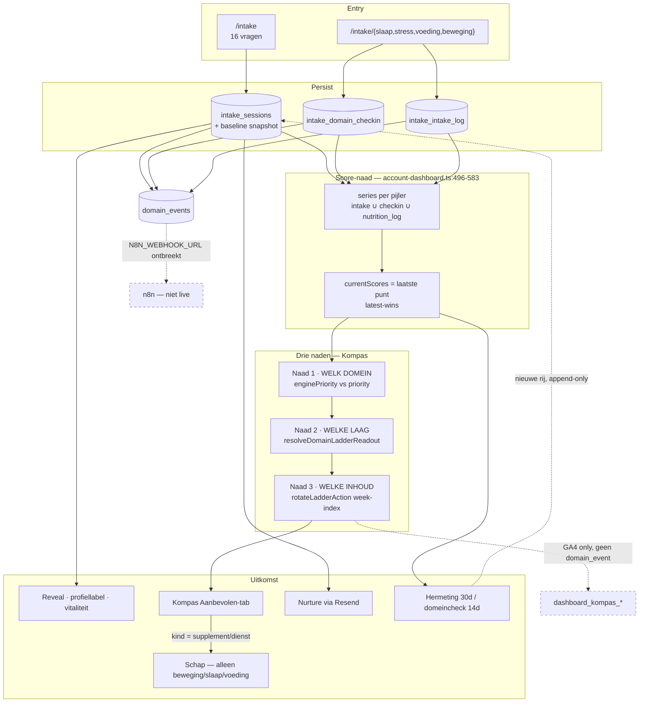

# Verdict — Loop onderbouwing: vragenlijst-check als product-dienst, evidence, n8n, EU-wet

> **Ronde:** 26 augustus 2026. Denkronde, geen bouw.
> **Bron-prompt:** [claude-opus-loop-onderbouwing-n8n-vragenlijst-check-prompt.md](claude-opus-loop-onderbouwing-n8n-vragenlijst-check-prompt.md)
> **Geverifieerd tegen:** working tree op `main` (bevat ongecommitte wijzigingen — zie F1 rij 15).

---

## F0 · Scope

Deze ronde beslist:

1. Of de huidige check-loop (leefstijlcheck + domeinchecks → Kompas) houdbaar is als fundament voor producten en diensten op naad 3.
2. Of de stelling "een betaald item toevoegen = de rotatiebron uitbreiden" overeind blijft — en zo niet, wat er eerst moet.
3. Welke n8n-koppeling vandaag veilig is, en wat er vóór activatie uit de payloads moet.
4. Waar de EU-keten dekking heeft en waar niet.

Deze ronde beslist **niet**: per-vraag psychometrie (1.3.1-review blijft staan), de hermeting-cyclus, wearable-scope, de rolverdeling tussen surfaces (roadmap §1 blijft), inbound-n8n-architectuur, AI-Act-classificatie, of de volgorde D1–D5 uit de roadmap §9.2.

Deze ronde levert **geen** code, SQL, diffs of prebuild.

---

## F1 · Verificatie — as-built vs de startwaarheid uit de prompt

| # | Stelling in de prompt | Oordeel | Bewijs |
|---|---|---|---|
| 1 | Leefstijlcheck heeft 16 vragen (copy zegt soms 15) | **WEL** — en de tegenspraak zit óók op de evidence-pagina zelf | 16 id's in `src/data/intake-questions.ts:116-299`; `src/app/onderbouwing/page.tsx:87` schrijft "15 vragen" en rendert vervolgens `QUESTIONS.map` (:214) over 16 |
| 2 | `RULES_VERSION = 1.6.0`, engine is `intake-engine.ts` | **WEL** | `src/lib/intake-engine.ts:32`; changelog 1.3.1→1.6.0 op `:13-26` |
| 3 | `intake.completed` / `remeasure.completed` gaan naar nurture, niet n8n | **WEL** | `src/app/api/intake/session/route.ts:489` en `:522` — `deliveredTo: ["nurture"]` |
| 4 | Sleep/stress/movement `measurement.checkin_completed` heeft `deliveredTo: []` | **WEL** | `sleep-checkin/route.ts:439`, `stress-checkin/route.ts:234`, `movement-checkin/route.ts:307` |
| 5 | Sleep-checkin payload draagt ruwe itemwaarden | **WEL** | `sleep-checkin/route.ts:432-438`: `grip, duur, winddown, nightload, morninglight, sleepconfidence` |
| 6 | Movement blijft categorisch | **WEL** | `movement-checkin/route.ts:301-305`: `domain_key, rules_version, checkin_mode` |
| 7 | Nutrition-log is de enige checkin die n8n getagd is | **WEL — en dat is precies de verkeerde** | `nutrition-log/route.ts:242` `["posthog","n8n_webhook"]`, mét `nutrition_score` en `band` in de payload (`:236-241`) |
| 8 | Cron pakt de oudste 50 rijen, niet alleen getagde | **WEL — ernstiger dan de prompt stelt** | `src/lib/n8n-webhook.ts:110-115`: `from("domain_events")` zónder `event_type`-filter, `.order(occurred_at asc).limit(50)`. De `deliveredTo`-tag stuurt alleen de *directe* push (`events.ts:155`) — de cron negeert hem volledig |
| 9 | Geen HMAC op de webhook | **WEL** | `src/lib/n8n-webhook.ts:32` — enkel `Content-Type` |
| 10 | Inbound `/api/webhooks/*` is ABSENT | **WEL** | Enige n8n-route is `src/app/api/cron/n8n-events/` |
| 11 | `v_funnel_week` telt geen checkin-events | **DEELS** — maar er is wél een checkin-view | `funnel_views.sql:16-38` (12 event-types, geen `measurement.*`); `:120-155` `v_checkin_activity` telt `intake_domain_checkin` + `intake_intake_log` op tabelniveau |
| 12 | `n8n_readonly`-rol ABSENT in migraties | **WEL** | Alleen als commentaar: `funnel_views.sql:10`, `20260812120000_funnel_views_revoke_anon.sql:13`. Geen `create role`/`grant` in de repo |
| 13 | Latest-wins: één getal uit drie bronnen | **WEL** | `src/lib/account-dashboard.ts:517` (`"intake"`), `:552` (`"checkin"`), `:572` (`"nutrition_log"`); `currentScores` = laatste punt op `:581-583` |
| 14 | `origin.kind "ladder"` valt terug op laag 1 met eerlijke copy | **DEELS — de copy is onwaar voor voeding** | `kompas-aanbeveling.ts:39` fallback, `:122-127` origin-keuze, `:202` "Nog niet apart gemeten". Maar `account-dashboard.ts:743` vult `domainCheckDaysAgo["voeding"]` bij élke voedingslog, terwijl `domain-ladder-readout.ts:249` voor voeding `null` teruggeeft |
| 15 | Naad 3 = `KompasAanbevelingSectie` | **NIET meer** | Dat bestand is verwijderd; de Aanbevolen-tab zit nu in `KompasKeuzeSectie.tsx:158-188` (`buildAanbevolenGroups`). `KompasContextSpine.tsx` is nieuw en ongecommit |
| 16 | De tegel draagt al een `kind`, dus uitbreiden volstaat | **NIET** | Het *type* draagt drie kinds (`account-favorites.ts:4`), maar beide bouwers zetten hem hard op `"activiteit"`: `KompasKeuzeSectie.tsx:184` en `LadderActionRow.tsx:47`. De rotatiebron zelf is `readonly string[]` (`leefstijl-ladder.ts:26`) — een string draagt geen kind, geen claim-id, geen oordeel |
| 17 | GA4 kompas-events zijn client-only, geen domain_event | **WEL — en ze staan ook niet in het GA4-register** | `KompasKeuzeSectie.tsx:612` en `:739` roepen `trackEvent` aan met vrije strings; `src/lib/ga4.ts:27` accepteert elke string en `GA4_EVENTS` (`:1-26`) kent ze niet |
| 18 | Register claimt "geen bijzondere gegevens in payloads" | **WEL — en die claim botst met de code** | `docs/core/VERWERKINGSREGISTER.md:120`. Tegenbewijs: sleep-items (rij 5), `nutrition_score` (rij 7), `profile_label` in nurture-payloads (`src/lib/nurture.ts:213`) |
| 19 | Privacyverklaring noemt n8n niet | **WEL** | Verwerkerstabel `src/app/privacy/page.tsx:481-521`: Supabase, Hetzner, Cloudflare, GA, Clarity, Zoho, Resend, Sentry — n8n ABSENT |
| 20 | Slaap/stress/beweging hebben geen `/onderbouwing`-dekking | **WEL, met nuance** | Geen route buiten `/onderbouwing` en `/onderbouwing/voeding`. In-product: beweging draagt 12 `anchor`-richtlijnregels (`src/data/movement-checkin/index.ts`), slaap en stress **nul** |

---

## A. Executive summary

Het zijn **twee producten met één gedeelde meetas**. De leefstijlcheck (16 vragen, 30-daagse hermeting) is het brede oordeel; de domeincheck (14 dagen, één pijler) is het diepe. Kompas is geen derde check maar de aanbevelingslaag erbovenop: het kiest domein (naad 1), laag (naad 2) en inhoud (naad 3) uit wat die twee al hebben opgeleverd.

**GO/NO-GO: GO op de loop, NO-GO op n8n-activatie, en NO-GO op betaalde inhoud in naad 3.**

De loop zelf is houdbaar. De drie naden liggen echt apart, hebben elk één eigenaar, en de eerlijkheidslat ("geen reden verzinnen zonder check") is consequent doorgevoerd. Dat is een bruikbaar fundament.

Drie dingen staan die conclusie in de weg, in deze volgorde van ernst:

1. **De n8n-cron heeft geen event-filter.** `N8N_WEBHOOK_URL` + cron aanzetten stuurt de *hele historische* `domain_events`-tabel — inclusief e-mailadressen, profiellabels en ruwe slaap-items — 50 rijen per run naar een endpoint zonder HMAC. De `deliveredTo`-tags zijn géén filter voor de cron. Dit is één env-var van een art. 9-datalek verwijderd.
2. **De rotatiebron kan geen betaald item dragen.** `layer.actions` is een `string[]`. Een string heeft geen veld voor claim-id, oordeel of sponsored-disclosure, en beide bouwers overschrijven het `kind` naar `"activiteit"`.
3. **Eén user-facing onwaarheid.** Wie de voedingscheck deed, leest op Kompas "Nog niet apart gemeten" — omdat voeding wel een check-timestamp heeft maar geen ladder-readout.

**Wat Dennis nu wél doet:** de cron-filter als besluit vastleggen vóór er ooit een URL gezet wordt; de voeding-copy-onwaarheid erkennen als blokker; en het rotatiebron-contract typeren vóórdat W1/D5 begint.
**Wat Dennis nu niet doet:** n8n aanzetten, een supplement in de rotatie zetten, of naad 2 en naad 3 samenvoegen.

---

## B. Plattegrond as-built

### De twee producten naast elkaar

| | **Leefstijlcheck (product A)** | **Domeincheck (product B)** |
|---|---|---|
| **Entry** | `/intake` | `/intake/{slaap,stress,voeding,beweging}` |
| **Vragenbron** | `QUESTIONS`, 16 items (`intake-questions.ts:116-299`) | `sleep-checkin/`, `stress-checkin/`, `movement-checkin/`, `nutrition/lifescore-questions.ts` |
| **Write-tabel** | `intake_sessions` + baseline-snapshot | `intake_domain_checkin` (slaap/stress/beweging) · `intake_intake_log` (voeding) |
| **User-artifact** | Reveal: profiellabel, vitaliteit, ladder, herkenning | 1-pijler snapshot + conclusie, optioneel ijkpunt-prompt |
| **Effect op Kompas** | Levert de eerste punten van élke reeks; zet profiellabel | Verschuift `currentScores` → verschuift `enginePriority`; levert de winst-laag voor naad 2 (beweging/slaap/stress) |
| **Effect op Schap** | Geen — schrijft geen schap-staat | Geen directe; alleen via de laag waarop naad 3 landt |
| **Hermeting-rol** | Ís de hermeting (30d, `REMEASURE_CYCLE_DAYS`, `account-dashboard.ts:162`) | Eigen ritme, 14d (`kompas-domain-check.ts:9`); geen nieuwe baseline (uitz.: movement-full merget MOV2 in `answers`) |
| **Event bij afronden** | `intake.completed` / `remeasure.completed`, `deliveredTo: ["nurture"]` | `measurement.checkin_completed`, `deliveredTo: []` — behalve voeding: `["posthog","n8n_webhook"]` |
| **n8n vandaag** | Nee | Alleen voeding — de enige checkin mét een gezondheidsscore in de payload |

### ABSENT-routes

Drie domeinen hebben geen eigen check-entry, en dat zijn drie verschillende soorten afwezigheid. **Energie** en **herstel** zijn readouts (`domain-role.ts`): ze worden berekend uit de leefstijlcheck en krijgen bewust nooit een eigen instrument — een check bouwen zou ze tot interventiedomein promoveren. **Verbinding** heeft de status `remeasure` in `kompas-domain-check.ts`: het meet alleen mee in de 30-daagse hermeting via `CON_SOC`, en dat is een compliance-besluit, geen achterstand — `COMPLIANCE.md:72-90` verbiedt schap, nurture en upsell op dit domein structureel. Gevolg voor de naden: verbinding en voeding leveren geen ladder-readout (`domain-ladder-readout.ts:249`), dus naad 2 valt daar altijd terug op laag 1 — bij verbinding terecht, bij voeding onterecht (zie D).

---

## C. Drie naden als product-dienst-contract

### Naad 1 · Welk domein

- **Bron van waarheid:** twee velden, geen samenvoeging. `model.enginePriority` = `getPriorityPillar(domainScores, answers)` (`dashboard-model.ts:63`); `model.priority` = de handmatige keuze uit `account_priority_pref` met `source: "user_selected" | "accept_engine"` (`account-priority-pref.ts:7`), anders gelijk aan de engine (`dashboard-model.ts:66-67`).
- **Wat de gebruiker ziet als ze uiteenlopen:** het analyse-domein staat bovenaan mét beide chips zichtbaar, plus de nudge — maar alleen in de Aanbevolen-tab (`KompasKeuzeSectie.tsx:734`). De nudge verschijnt uitsluitend als de focus zelf gekozen is (`priority-over-time.ts:63-68`), dringt niet aan, en verdwijnt zodra beide samenvallen.
- **Waar producten/diensten mogen landen:** nergens. Dit is een navigatie-naad, geen aanbod-naad. Een domein dat commercieel interessanter is mag nooit een reden zijn om `enginePriority` te wegen.
- **Wat je NIET mag doen:** de focus stil overrulen (dan is de keuze betekenisloos) óf een verschoven analyse verbergen (dan is de meting betekenisloos). En: `accept_engine` mag nooit automatisch gezet worden — dat is de enige plek waar de gebruiker een geautomatiseerde aanwijzing bewust overneemt, en die menselijke handeling is wat de art. 22-positie draagt (zie F).

### Naad 2 · Welke laag

- **Bron van waarheid:** `resolveDomainLadderReadout(domain, data).focusLayer` (`domain-ladder-readout.ts:242-249`). Levert een laag voor beweging, slaap en stress; `null` voor voeding en verbinding. Bij `null`: `LADDER_FALLBACK_LAYER = 1` (`kompas-aanbeveling.ts:39`).
- **Wat de gebruiker ziet als ze uiteenlopen:** de laag schuift alleen bij een nieuwe meting, nooit per week. Is er geen readout, dan staat er géén staat-label en géén reden — alleen "Nog niet apart gemeten" (`:202`). Die lat is dezelfde als `resolveLadderLayerReason`.
- **Waar producten/diensten mogen landen:** hier ligt de enige verdedigbare landingsplaats — een laag die uit een meting komt, in een domein met schap. Dat zijn vandaag exact twee combinaties: **beweging** en **slaap**. Voeding heeft schap maar geen readout; stress heeft readout maar geen schap (`schap-availability.ts:22`, `domain-product-stance.ts:17`).
- **Wat je NIET mag doen:** de laag laten rouleren. Dat is expliciet vastgelegd in de docstring van `kompas-aanbeveling.ts:15-25` en het is de belofte waar naad 3 op rust. En: nooit betaalde inhoud op een fallback-laag — een laag die niemand gemeten heeft is geen grond voor een aankoopvoorstel.

### Naad 3 · Welke inhoud

- **Bron van waarheid:** `rotateLadderAction(layer.actions, weekIndex)` (`kompas-aanbeveling.ts:84`), met `weekIndexFromDate` doorlopend vanaf epoch (`:75`). De bron zelf is `layer.actions: readonly string[]` (`leefstijl-ladder.ts:26`).
- **Wat de gebruiker ziet als ze uiteenlopen:** één actie in een laag betekent elke week dezelfde actie. Dat is bewust: het is de eerlijke stand van die laag, geen bug.
- **Waar producten/diensten mogen landen:** in principe hier — de bestemmingsregel bestaat al (`resolveKeuzeDestination`, `KompasKeuzeSectie.tsx:197-215`: supplement of dienst → schap mits `hasSchap`, anders domein). Maar niet vóór het contract hieronder is gerepareerd.
- **Wat je NIET mag doen:** de tegel verbouwen tot een tweede commerciële surface — dat botst met de surface-lock (`KOMPAS_SIDEBAR_ROADMAP_2026-08.md:19`, Kompas home: "Niet — kaarten met prijs/oordeel") en met D4 ("per domein één plek met oordeel", `:252`).

### Toets: "een betaald item toevoegen = de rotatiebron uitbreiden"

**REFINE.** Het principe klopt, de aanname over de as-built niet.

1. `layer.actions` is `readonly string[]` (`leefstijl-ladder.ts:26`). Een string heeft geen veld voor claim-id, bond-oordeel of sponsored-disclosure. "Magnesium 300 mg voor het slapen" ís uitbreidbaar als tekst — en precies daarom gevaarlijk.
2. Beide bouwers overschrijven het `kind` hard naar `"activiteit"` (`KompasKeuzeSectie.tsx:184`, `LadderActionRow.tsx:47`). De kind-machinerie bestaat in het type (`account-favorites.ts:4`) maar wordt op dit pad niet gevoed.
3. `ladderActionFavoriteId` slugificeert de actietekst tot `laag-<domein>-p<n>-<slug>` (`leefstijl-ladder.ts:125-131`). Een supplement belandt dan in dezelfde sleutelruimte als activiteiten en wordt door `parseLadderFavoriteLayer` als ladderrij gelezen — ladder-archief en schap-archief lopen stil in elkaar.
4. De rotatie draait op een klok, niet op een handeling. Een betaald item verschijnt en verdwijnt wekelijks zonder dat de gebruiker iets deed — dat vraagt disclosure bij élke vertoning, niet eenmalig.
5. Het eerste domein waar een betaald item commercieel voor de hand ligt is voeding — en dat is precies het domein waar de laag een fallback is, geen meting.

**Wat kapotgaat bij PIVOT** (de tegel wél verbouwen in plaats van de bron uitbreiden): je krijgt een tweede oordeel-surface op Kompas home naast het schap, wat de surface-lock §1 breekt en het W4b-besluit ("draagt de laag aanbod, dan wijkt de laag-kaart óf het schap — niet allebei blijven", `roadmap:252`) vooruit forceert zonder dat D1/D2 gedaan zijn.

---

## D. Evidence-toets van de loop

Per schakel in de keten, niet per vraag.

| # | Schakel | Feitelijk onderbouwd in repo | ABSENT | Label |
|---|---|---|---|---|
| 1 | Leefstijlcheck-vraag → itemscore | Alle 16 vragen hebben een `QuestionEvidence`-record met `whyThisQuestion`, `scientificRationale` en referenties, publiek op `/onderbouwing` (`page.tsx:214-244`) | — | ✅ |
| 2 | Itemscores → domeinscore → profiellabel | Herskalering en domein-gemiddelde staan in `intake-engine.ts:13-26`; `LEEFSTIJLCHECK_INTERPRETATION_NOTES` en `_TRANSPARANTIE_NOTES` staan publiek | Geen publieke uitleg van de profiellabel-beslislogica zelf | ⚠️ |
| 3 | Profiellabel → Reveal-copy | `leefstijl-disclaimer.ts:2` dekt "geen diagnose, geen bloedwaarden"; compliance-testsuite tegen ziektetaal (`DPIA.md:106`) | — | ✅ |
| 4 | Domeincheck-vraag → domeinscore | **Beweging:** 12 `anchor`-richtlijnregels in-product (`movement-checkin/index.ts`, o.a. "150–300 minuten matig per week"). **Voeding:** eigen `/onderbouwing/voeding` | **Slaap: nul anchors, geen pagina. Stress: nul anchors, geen pagina.** Twee van de drie readout-dragende checks publiceren niets | ⚠️ |
| 5 | Domeinscore → `currentScores` (latest-wins) | De reeks-opbouw is transparant in code (`account-dashboard.ts:496-583`) | Geen enkele user-facing regel die zegt wélk instrument het laatste punt zette | ⚠️ |
| 6 | `currentScores` → winst-laag (naad 2) | Beweging en slaap dragen staten **plus** feitrijen; stress draagt staten | Stress heeft geen `evidenceByLayer` (roadmap D1); voeding en verbinding hebben geen readout | ⚠️ |
| 7 | Winst-laag → geroteerde actie (naad 3) | De acties zijn gratis leefstijl-acties; geen claim nodig | Geen enkele actie draagt een verwijzing naar zijn onderbouwing | ⚠️ |
| 8 | Geroteerde actie → toekomstig supplement/dienst | `approved-claims.ts:102` draagt de EFSA-claims per nutriënt mét PMID-onderbouwing; `FORBIDDEN_PHRASES_GLOBAL:91` | Geen koppeling tussen ladder-actie en claim-id — zie C | ❌ zolang die koppeling ontbreekt |
| 9 | Schap → affiliate | Schap bestaat alleen waar een claim bestaat (`schap-availability.ts:22`); stress en verbinding uitgesloten met genoemde reden | — | ✅ |

**Delta 1.3.1 → 1.6.0 die de loop raakt.** De expert-review (juli 2026) beoordeelde 1.3.1. Sindsdien: 1.4.0 herschaalde items naar `(waarde−1)/(max−1)×100` met domein=gemiddelde, 1.5.0 breidde de beweging-hercheck van 2 naar 10 deelvragen, 1.6.0 repareerde de `CON_SOC`-schaalfout en maakte `movement → "Overtrainer"` onbereikbaar (`intake-engine.ts:307`) — het P2-punt uit de review is daarmee gesloten. De review is verder niet ingehaald: de per-vraag-oordelen gelden onverkort. Wat de review níét dekt zijn de vraagsets van product B, en dat is precies waar rij 4 hierboven het gat aanwijst.

### De drie specifieke toetsen

**1. Mag latest-wins zo gecommuniceerd worden?**
**DEELS — het is geen tweede meetconstruct, maar wel twee meetritmes op één as zonder comparabiliteitsbewaking.** De reeks mengt drie soorten punten in één lijn: `"intake"`-punten dragen een `rulesVersion`, `"checkin"`-punten dragen die van hun eigen instrument, en `"nutrition_log"`-punten dragen `rulesVersion: null` (`account-dashboard.ts:571-577`). De engine heeft wél een comparabiliteitsgrens voor de intake-reeks (`isRulesVersionBefore`, `intake-engine.ts:698-701`) — maar op de gemengde reeks staat geen enkele guard. Het is verdedigbaar: alle drie meten hetzelfde leefstijlconstruct en de app claimt nergens meetprecisie. Het is niet verdedigbaar zolang de UI zwijgt over de herkomst van het laatste punt.
**Veilige copy:** "Dit cijfer komt uit je slaapcheck van 3 dagen geleden — je laatste volledige leefstijlcheck was 18 dagen terug." Niet: "je slaapscore is gestegen" zonder te zeggen welk instrument dat vaststelde.

**2. Mag `origin.kind "ladder"` user-facing blijven zonder evidence-regel?**
**JA als principe, NEE in de huidige uitvoering.** De constructie zelf is voorbeeldig: geen readout betekent geen verzonnen reden, en de copy zegt dat hardop. Maar `"Nog niet apart gemeten — dit is de basis van je ladder."` (`kompas-aanbeveling.ts:202`) is feitelijk onwaar voor voeding: `account-dashboard.ts:743` zet `domainCheckDaysAgo["voeding"]` bij élke voedingslog, terwijl `domain-ladder-readout.ts:249` `null` teruggeeft. Wie gisteren de voedingscheck deed leest vandaag dat hij niet gemeten is. Dat is een eerlijkheidsclaim die zichzelf tegenspreekt in het domein waar straks vijf nutriënten in het schap staan.
**Veilige copy tot D2 klaar is:** "Je deed de voedingscheck 1 dag geleden — die levert nog geen winst-laag op, dus dit is de basis van je ladder."

**3. Mag naad 3 ooit een supplement roteren zonder dat die actie op `/onderbouwing` of in `approved-claims` staat?**
**Nee. ❌** Twee onafhankelijke gronden. Claimsverordening 1924/2006: zodra een aanbeveling een voedingsstof aan een fysiologisch effect koppelt is dat een gezondheidsclaim, ongeacht of er een prijs bij staat — de bewoording moet uit `approved-claims.ts` komen. En intern: `COMPLIANCE.md:67` legt vast dat EFSA-tekst letterlijk bewaard blijft en niet herschreven wordt, wat onmogelijk is als de rotatiebron een vrije string is. Daar komt sponsored-disclosure bovenop zodra de rij naar een affiliate-bestemming leidt. Een rotatie die wekelijks wisselt vraagt die disclosure per vertoning.

---

## E. n8n-triage: check + hertest → kompas-schap

De realiteit vandaag: outbound-only, niet geconfigureerd, geen HMAC, geen inbound-route. Alles hieronder geldt onder die aanname.

### WEL — orchestratie buiten de request-cyclus

| Taak | Waarom veilig | Wat n8n leest |
|---|---|---|
| **Weekrapport op views** | `v_funnel_week` en `v_checkin_activity` bevatten per constructie alleen weken, categorieën en counts (`funnel_views.sql:6-7`), en zijn al ingetrokken bij `anon`/`authenticated` (`revoke_anon.sql:23-26`) | Pull op vier views |
| **Hertest-invite timing** | `remeasure.invited` is al n8n-getagd (`intake-reminder-cron.ts:324`) en de mail is al verstuurd — n8n orkestreert opvolging, niet de meting | Event, ná het strippen van `email` |
| **Affiliate-click fan-out** | `affiliate.click` draagt geen e-mail; `session_id` alleen bij nurture-attributie (`affiliate/click/route.ts:88-102`) | Event zoals het is |

### DEELS — mag n8n lezen, maar de app houdt de naden

**Domain-check completed.** Vandaag staan de drie gedrags-checkins op `deliveredTo: []` en is voeding de enige die n8n bereikt — mét `nutrition_score` en `band` erin. Dat is omgekeerd: de enige checkin die de grens over gaat is de enige met een gezondheidsscore in de payload. Taakverdeling als dit ooit aan gaat: de app bepaalt de score, de laag en het domein; n8n mag hooguit weten *dát* er gemeten is, met welk domein en op welke `rules_version` — de vorm die movement al heeft (`movement-checkin/route.ts:301-305`).

**Engine-shift en aanbeveling-shown.** Deze bestaan alleen als GA4-string (`KompasKeuzeSectie.tsx:612`, `:739`) en staan niet eens in het `GA4_EVENTS`-register (`ga4.ts:1-26`). n8n ziet ze dus niet en kán ze niet zien. Wil je ze durable maken, dan zijn dat drie registratieplekken plus een vierde: dit zijn account-context-events, dus de allowlist is `src/app/api/account/events/route.ts:9-24` en de client-union `account-events-client.ts` — niet de intake-variant. Consent-laag is daarmee `account-storage-consent`, niet de intake-consent. **Aanbeveling: doe dit niet nu.** Er is geen n8n-workflow die erop wacht, en een durable event met `from`/`to`-domein is gezondheidsgerelateerd waar de GA4-variant dat niet durable vastlegt.

**Schap-signalen** (`dashboard.schap_*`, `choice.shelf_opened`) — durable en al aanwezig via de account-route, maar ze staan in geen enkele view. Lezen mag; erop sturen niet.

### NIET

Scoring (`intake-engine.ts`), de `accept_engine`-beslissing (`account-priority-pref.ts`), het schap-oordeel (`approved-claims.ts` + `supplement_verdicts`), art. 9-payloads in de webhook-body, en elke inbound content-push die een naad zou overschrijven. n8n mag **timing en kanaal** zijn — niet de kiezer van domein, laag of inhoud. Die grens is niet stilistisch: naad 1 hangt aan een menselijke handeling (`accept_engine`), en dat is precies wat de art. 22-positie in F draagt.

### Minimale veilige eerste koppeling

**Pull op `v_funnel_week`, met een aparte databasegebruiker die SELECT heeft op uitsluitend de vier views. Niet de webhook.**

Waarom deze: geen PII per constructie, geen wijziging in applicatiecode, geen nieuw event, en het is precies waar de views voor gebouwd zijn. De rol bestaat nog niet in de repo (`funnel_views.sql:10` noemt hem alleen als commentaar) — die aanmaken is de enige technische stap.

**Gate vóór activatie, in deze volgorde:** (1) registerregel voor n8n in `VERWERKINGSREGISTER.md` — de huidige "Niet actief"-regel op `:126` moet vervallen; (2) n8n toevoegen aan de verwerkerstabel in `privacy/page.tsx:481-521`; (3) verwerkersovereenkomst; (4) pas dan de rol. Dit is de projectregel, niet mijn toevoeging.

### Cron-broadcast-risico

Dit is de zwaarste bevinding van de ronde. `runPendingN8nDomainEvents` (`n8n-webhook.ts:110-115`) selecteert uit `domain_events` **zonder `event_type`-filter**, geordend oplopend op `occurred_at`, 50 per run, en stuurt alles wat `n8n_webhook` nog niet in `delivered_to` heeft. De `deliveredTo`-tags die zorgvuldig per emit-site zijn gezet sturen uitsluitend de *directe* push in `events.ts:155` — de cron negeert ze volledig. Zet iemand `N8N_WEBHOOK_URL` en een cron van 5 minuten aan, dan wordt de complete historische tabel in batches van 50 naar buiten gepompt: `intake.completed` met profiellabel, `nurture.email_sent` met e-mailadres en profiellabel, ruwe slaap-items, `nutrition_score`. Naar een endpoint zonder HMAC (`:32`). De env-var is de enige rem, en het endpoint retourneert netjes 503 zonder (`cron/n8n-events/route.ts:9-13`) — wat de indruk wekt dat het veilig uit staat. Het staat niet veilig uit; het staat toevallig uit.

### Wat er uit de payloads moet vóór activatie

| Wat | Waar | Waarom |
|---|---|---|
| Top-level `email` | `nurture.ts:211`, `nurture-cron.ts:379`, `intake-reminder-cron.ts:320` | Direct identificerend; `emitEvent` zet het in de webhook-body (`events.ts:171`) |
| `profile_label` | `nurture.ts:213`, `nurture-cron.ts:383` | Afgeleid gezondheidsgegeven (art. 9) |
| `nutrition_score` + `band` | `nutrition-log/route.ts:237-239` | Gezondheidsscore, en dit is vandaag de énige n8n-getagde checkin |
| Ruwe slaap-items | `sleep-checkin/route.ts:432-438` | Zes ruwe itemwaarden; ondermijnt de registerclaim op `VERWERKINGSREGISTER.md:120` |

Voor n8n volstaat een pseudonieme sleutel plus categorische velden. Wie de e-mail nodig heeft is de mailer — en die draait al in de app.

---

## F. EU-wetgevingsloop

| Schakel | Regime | Wat de code doet | Wat ontbreekt |
|---|---|---|---|
| **Consent** | Art. 6(1)(a) + art. 9(2)(a); ePrivacy voor cookies | Granulair en per doel: `health_data_processing`, `anonymous_analytics`, `marketing_email`, `affiliate_marketing` (`consent-texts.ts:7-11`), plus losse teksten voor `domain_checkin_logging` (`:47`), voeding, account-opslag, body-metrics, connection-profile. `CONSENT_VERSION 2.1`. Elke tekst zegt "geen medisch advies en geen diagnose" | — |
| **Verwerking** | Art. 9 — bijzondere categorie | Supabase EU-Frankfurt, RLS aan, `pd_*`/`af_*` deny-all. Register dekt 19 verwerkingen met expliciete art. 9-markering | Registerregel §7 claimt "geen bijzondere gegevens in payloads" (`:120`) — weerlegd door vier plekken (zie E) |
| **Scoring** | Art. 22 + DPIA R7 | Volledig regelgebaseerd, geen model, geen bloedwaarden, `LEEFSTIJL_DISCLAIMER` op de output | AI Act: **ABSENT** als documentsectie voor dit product. Alleen `COMPLIANCE_AUDIT_AFFILIATE_PLATFORM.md:19` noemt de verordening, en dat gaat over PartnerDesk fase 4 — niet over de check-loop. Markeer als hiaat |
| **UI-uitkomst** | 1924/2006 · MDR 2017/745 | EFSA-bewoording letterlijk uit `approved-claims.ts`; verbinding-lock structureel (`COMPLIANCE.md:72-90`); MDR-grens expliciet op `:91`; kill-lijst op `:108` | Naad 3 heeft geen koppeling naar claim-id (zie C/D) |
| **Events/analytics** | Art. 6(1)(a); ePrivacy | Client-allowlists op beide event-routes; Clarity uit op health-routes; durable client-events droppen zonder analytics-consent | GA4 kompas-events zijn vrije strings buiten `GA4_EVENTS` — niet inventariseerbaar, dus niet auditeerbaar |
| **n8n** | Art. 28 + doelbinding | Niet actief | Register + privacy + VWO ontbreken alle drie |
| **Retentie/revoke** | Art. 5(1)(e), art. 17 | Sessions 24m, nurture 12m, cron-afgedwongen; revoke anonimiseert via RPC (`intake-consent-revoke.ts:14`) | — |

**Is de dual-ritme-score nog "informatief/vrijblijvend" onder art. 22?**
**Vandaag ja.** DPIA R7 (`DPIA.md:99`) stelt terecht dat er geen besluit met rechtsgevolg of vergelijkbaar aanmerkelijk effect wordt genomen: de output is een ordening van aandachtspunten, de gebruiker hoeft niets, en de engine-shift-nudge zegt dat letterlijk ("Je hoeft niets te doen"). Belangrijker nog: `accept_engine` is een expliciete menselijke handeling — de gebruiker neemt een geautomatiseerde aanwijzing bewust over. Dat is de kern van waarom dit géén art. 22-besluit is.

**Zodra naad 3 betaalde of affiliate-inhoud roteert kantelt dat niet naar art. 22, maar wél naar profilering met merkbaar effect onder art. 4(4) + art. 13(2)(f).** Er is dan een geautomatiseerde beoordeling van gezondheidsgedrag die bepaalt welk commercieel aanbod iemand wekelijks te zien krijgt. Geen rechtsgevolg, dus geen art. 22-verbod — maar wel: expliciete informatieplicht over de logica, een bezwaarrecht dat werkt (art. 21), en een DPIA-actualisatie. De huidige DPIA dekt dat scenario niet.

**MDR-grens bij inbound n8n.** Outbound-only is laag risico: de app bepaalt de inhoud, n8n verplaatst hooguit een signaal. Zodra n8n inbound content zou pushen die een naad overschrijft, verschuift de *intended purpose*: dan bepaalt een externe orkestratielaag wat er als aanbeveling op een gezondheidsdomein verschijnt, zonder de compliance-testsuite die op de app-copy draait (`DPIA.md:106`). Dat is de grens waar "welzijn/leefstijl" richting "behandelsuggestie" schuift. Niet ontwerpen zolang de triage NIET zegt.

**Doelbinding.** `domain_checkin_logging`-consent is gegeven voor "een persoonlijk leefstijloverzicht en vervolgstappen" (`consent-texts.ts:47`). Marketing-orchestratie via n8n is een **ander doel** — dat vraagt een eigen registerregel en, waar het marketing raakt, de bestaande `marketing_email`-grondslag. Geen stille meelifter op de check-consent. Dit is precies de functie-creep die DPIA R4/R8 benoemt.

**Verbinding — de lock herhaald.** Geen nurture, e-mail of upsell op een laag `CON_SOC`-antwoord; geen schap; geen supplement, merk, prijs of vergelijklink in enige verbinding-surface (`COMPLIANCE.md:80-88`). Dat geldt ook voor n8n: een orkestratielaag die "lage verbindingsscore" als trigger zou gebruiken breekt de lock, ongeacht welk kanaal eruit komt.

---

## G. Gap-matrix

| Schakel | Loop nu | Evidence | n8n | Wet | Ernst |
|---|---|---|---|---|---|
| n8n-cron zonder event-filter | `n8n-webhook.ts:110-115` stuurt alles, tags zijn geen filter | n.v.t. | Broadcast van de hele tabel bij één env-var | Art. 9 naar niet-geregistreerde verwerker | **Blokker** |
| Webhook zonder HMAC | `n8n-webhook.ts:32` alleen `Content-Type` | n.v.t. | Geen herkomstverificatie | Art. 32 beveiliging | **Blokker** (samen met bovenstaande) |
| Sleep-checkin ruwe items in event | `sleep-checkin/route.ts:432-438` | n.v.t. | `deliveredTo: []` — maar de cron negeert dat | Weerlegt `VERWERKINGSREGISTER.md:120` | **Blokker** |
| Nutrition-log naar n8n mét score | `nutrition-log/route.ts:237-242` | n.v.t. | Enige n8n-getagde checkin, en de enige met gezondheidsscore | Art. 9 | **Blokker** |
| Voeding-copy "Nog niet apart gemeten" | `kompas-aanbeveling.ts:202` vs `account-dashboard.ts:743` | Spreekt zichzelf tegen | — | Geen wetsissue, wel de eerlijkheidsclaim | **Blokker** |
| Rotatiebron is `string[]` | `leefstijl-ladder.ts:26`, kind hard op `"activiteit"` | Geen claim-koppeling mogelijk | — | 1924/2006 zodra betaald | **Blokker voor W1/D5** |
| Slaap + stress: geen publieke onderbouwing | Nul anchors, geen `/onderbouwing`-route | ABSENT | — | Geen directe overtreding; wel asymmetrie met product A | Later |
| Stress zonder feitrijen | `domain-ladder-readout.ts:214-236` | Staten zonder reden | — | — | Later (roadmap D1) |
| Voeding zonder readout | `domain-ladder-readout.ts:249` → `null` | Schap zonder winst-laag | — | — | Later (roadmap D2) |
| Latest-wins zonder herkomstregel | `account-dashboard.ts:581` | Drie instrumenten, één as, geen guard | — | Transparantie art. 13 | Later |
| GA4 kompas-events buiten register | `ga4.ts:1-26` kent ze niet | Niet auditeerbaar | Niet leesbaar voor n8n | Art. 30-inventaris | Later |
| `n8n_readonly`-rol bestaat niet | Alleen commentaar in twee migraties | n.v.t. | Blokkeert de veilige pull-route | — | Bewust (buiten repo) |
| AI Act ABSENT voor de check-loop | Geen documentsectie | — | — | Hiaat, geen overtreding — regelgebaseerd ≠ AI-systeem | Bewust |

---

## H. Open vragen + één volgende stap

1. **Wil je de n8n-cron behouden of vervangen door pull-op-views?** — *Blokkeert.* De cron is de enige plek met broadcast-risico. Vervalt hij, dan vervalt de zwaarste rij in G en is de webhook alleen nog het (getagde) directe pad.
2. **Wanneer landt de voeding-copy-fix?** — *Blokkeert niet de ronde, wel de geloofwaardigheid van naad 2.* Het is één conditie, maar het is de enige plek waar de app iets onwaars zegt over de eigen meting.
3. **Moet het rotatiebron-contract getypeerd worden vóór D4, of is dat onderdeel van D4?** — *Blokkeert niet nu.* Bepaalt wel of W1/D5 (`LayerRecommendation` / `bond_verdict` / `is_monetised`) naar voren schuift.
4. **Krijgen slaap en stress een publieke onderbouwingspagina?** — *Blokkeert niet.* Wel de asymmetrie: product B stuurt naad 2 en naad 3, en publiceert voor twee van de vier domeinen niets.
5. **Wil je de engine-shift-events durable maken?** — *Blokkeert niet, en mijn advies is nee.* Er is geen consument, en durable maken van een `from`/`to`-domein voegt een gezondheidsgerelateerd event toe zonder dat iemand erop wacht.

Aanbeveling: leg als besluit vast dat `/api/cron/n8n-events` alleen events met `n8n_webhook` in `delivered_to` mag doorsturen — en dat n8n pas aan gaat via een pull op `v_funnel_week`, ná register en privacyverklaring.

---

*Opgesteld 26 augustus 2026. Alle pad:regel-verwijzingen geverifieerd tegen de working tree op `main` van diezelfde dag; die bevat ongecommitte wijzigingen aan de Kompas-componenten (F1 rij 15).*
