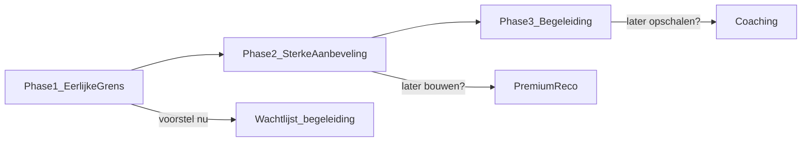

# Premium-as · Wederprompt · Productvoorstel · Meetkader

> **29 juli 2026.** Voorstel ter bespreking — geen definitief besluit. Gebaseerd op Claude Opus-analyse (`[claude-opus-voortgang-statistieken-premium-grens-advies-2026-07.md](claude-opus-voortgang-statistieken-premium-grens-advies-2026-07.md)`) en jouw vraag of premium aanbevelingen naast begeleiding zou moeten staan.
> Doel: een **vragende wederprompt** en een **productvoorstel** dat je kunt accepteren, aanpassen of afwijzen.

---

## 0. Waar dit vandaan komt

Claude liep de code na vanuit een juli-prompt die premium koppelde aan *tijd* ("trends over tijd = betaald"). Tijdens die audit kwam hij tot drie observaties die hem deden twijfelen aan die regel — niet als harde waarheid, maar als **hypotheses die jij kunt toetsen**:

1. *Zou het kunnen dat we premium al gratis leveren?* Trends en vergelijking staan op hub, RichtingBeat en Leefstijllijn — terwijl de wachtlijstkaart hetzelfde belooft.
2. *Is de premium-bundel achter de gate überhaupt een product?* PriorityOverTime is nieuw maar nergens zichtbaar; SignalsSection is leeg; Nutrition en History horen eerder gratis.
3. *Spreekt de backend al een andere taal dan de UI?* `premium-coaching`, consent-tekst "begeleiding", KompasBegeleidingLink — versus kaarten die "statistieken" verkopen.

Daarop formuleerde Claude een **voorstel** voor een nieuwe as. Onderstaand document zet dat voorstel neer als iets om over na te denken — inclusief open vragen voor jou.

---

## 1. Wederprompt voor Claude (vragend, niet dwingend)

Gebruik dit blok als je Claude (of een andere agent) wilt laten **heroverwegen** vanuit code-realiteit, zonder de juli-tijdas als uitgangspunt te nemen. De toon is: "dit zag ik — klopt het, en wat zou je dan voorstellen?"

```text
## Rol
Je bent productarchitect + Next.js-reviewer voor PerfectSupplement. Je redeneert vanuit de as-built code en formuleert voorstellen — geen decreten.

## Uitgangspunt — mijn audit (ter verificatie)
Ik heb het volgende in src/ gevonden. Klopt dit, en wat betekent het voor de premium-grens?

1. **Gratis vs premium-belofte**
   - VoortgangDomeinRing: sparkline + DeltaBadge per domein (gratis)
   - VoortgangRichtingBeat: baseline → nu → target mét getallen (gratis)
   - LeefstijllijnSection: "begin en laatste meting op één curve" (gratis)
   - PremiumWaitlistCard body: "Premium vergelijkt je metingen… trends per domein"
   → Mijn lezing: geen grenslek maar een dood aanbod. Zie jij het anders?

2. **Premium-bundel achter resolveTrendsAccess**
   - StatistiekenPriorityOverTime: enig echt nieuw blok, nergens anders in src/
   - SignalsSection: SIGNALS allemaal status "binnenkort", data: []
   - NutritionIntakeSection + HistorySection: overlap met gratis stepped care
   → Mijn lezing: gate openzetten zou de eerste betaler teleurstellen. Wat zou jij achter premium zetten?

3. **Backend vs UI**
   - STORED_FEATURE = "premium-coaching"
   - Consent: "…zodra premium begeleiding live is."
   - KompasBegeleidingLink: "Premium: wekelijks iemand die met je meekijkt"
   - Alleen PremiumWaitlistCard + premium-value-props zeggen "statistieken"
   → Moet de UI naar de backend bewegen, of wil je bewust twee proposities testen?

4. **Reputatie-risico's (P0?)**
   - MOCK_TREND geblurrd onder "Gewicht"/"Lengte" (VoortgangHub.tsx:72)
   - openPremiumWaitlist: setScreen("hub") → contextverlies na klik in Statistieken
   - BlurredInsightTips over echte explainer-tekst van eigen scores
   - Lichaamssamenstelling locked zonder CTA
   → Welke hiervan zou jij prioriteren, en waarom?

5. **IA-frictie**
   - Label "Einde gratis advies" gevolgd door gratis blokken
   - Stap 1/2 van 3, geen Stap 3 (grep leeg)
   - 2-koloms grid vs genummerde eyebrows
   → Grid schrappen of container-queries? Stap 3 toevoegen of telling weglaten?

## Voorstel waar ik jouw oordeel over wil (niet als feit)
**Hypothese:** de juli-regel "beweging over tijd = premium" is verlopen. Nieuwe as zou kunnen zijn:
**zelf lezen = gratis · met je meekijken = premium.**

Leefstijllijn zou dan niet "verkeerd staan" maar de regel zou verkeerd zijn. Sparklines terugvorderen zou een werkend gratis product uitkleden voor een tier die nooit live is geweest.

**Vraag aan jou:**
- Ga je akkoord met die as, of zie je nog een verdedigbare premium-grens op data/trends?
- Moet premium vandaag = alleen begeleiding (wachtlijst), of ook ruimte voor "sterke aanbevelingen" (Phase 2)?
- Welke slices (K1–K7) zou je eerst doen, en welke expliciet niet?

## Antwoordformaat (voorstel, geen bevel)
1. Bevestig of weerleg mijn vijf auditpunten met bestandsreferenties.
2. Geef je aanbeveling voor gratis vs premium — inclusief wat je bewust níet zou gaten.
3. Lever implementatievoorstellen in slices (K1–K7) met per slice:
   - 5 acceptatiecriteria
   - Niet-aanraken-lijst
   - Risico's als we het níet doen
4. Meetvoorstel: welke events behouden/verwijderen/toevoegen — met motivatie.

Begin met K1 als je P0 deelt; anders leg uit waarom niet.

## P0-aanvulling — waar bouwen? (vraag aan Claude/Cursor)

Producteigenaar is akkoord met slice K1 (P0). Graag expliciet beantwoorden:

**Waar hoort de lock-opruiming architecturaal thuis?**

Mijn voorkeur (ter toetsing):

| Laag | Bestand | Rol in K1 |
|---|---|---|
| **Orchestrator schermen** | `VoortgangHub.tsx` | Alle `resolveTrendsAccess`-takken, blur, soft-upsell, teleport, MOCK_TREND — Statistieken · Inzichten · Lichaam |
| **Compositie kinderen** | `Dashboard.tsx` (~3522) | `freeStatistics` + `unlockedStatistics` samenvoegen tot één `statisticsContent`; geen dubbele HistorySection |
| **Wachtlijst + copy** | `PremiumWaitlistCard.tsx`, `premium-value-props.ts`, `vitality-score-copy.ts` | Begeleiding-copy; `offer: "begeleiding"` op GA4 |
| **Niet in K1** | `entitlement-access.ts`, dode `StatisticsSection` | Alleen UI stoppen met gaten — opruimen = slice K6 |

**Vraag:** Zie jij reden om locks op te splitsen naar losse componenten (bijv. `StatistiekenView.tsx` extract), of is `VoortgangHub` de juiste monoliet voor P0?

**Teleport-fix (K1-minimum):** `PremiumWaitlistCard` inline in `StatistiekenView` renderen; hub-kaart in `VoortgangRouteList` mag blijven tot K3. Klopt die prioritering?

**Inzichten (K1-scope):** `VitaalscoreInzichtenView` — altijd `RecommendedInsights` + ongeblurde tips; upsell-blok vervangen door dezelfde begeleidings-uitnodiging (geen statistieken-copy). Akkoord?

**Vitaliteit vs nieuwe leefstijlring (K1-verificatie):** Op Voortgang-hub staat nu `VoortgangDomeinRing` (7 domeinen, sparklines, "Wat je van jezelf weet") + `VoortgangRichtingBeat`. Op Kompas-tab staat `LeefstijlKompas` / `KompasRings` (5 ringen + leefstijlscore in het midden). "Jouw inzichten" toont nog `VitalityGauge` (300px) + `getVitalityScoreCardCopy` — route-subtitle: "Je vitaliteit in één beeld".

**Vraag:** Staat die vitaalscore-view nog logisch naast de hub-leefstijlring, of voelt het dubbel? Zelfde `model.vitality` / `buildKompasDomainRows` — maar andere visualisatie en andere belofte. Moet K1:
- (a) alleen verifiëren dat getallen/copy consistent zijn en doublure noteren voor K2,
- (b) minimale copy aanpassen (subtitle Inzichten-routerij, upsell-strings),
- (c) of Inzichten herpositioneren (bijv. band + habit-kernel zonder grote gauge)?

Geen volledige ring-refactor in K1 — wel expliciet oordeel in PR-notities.
```

---

## 2. Productvoorstel — drie lagen (ter bespreking)

Claude stelt voor om premium niet als één blok te zien, maar als **groeipad**. Dit is zijn redenering — geen vast productbesluit.

### 2.1 Voorgestelde lagen


| Laag                                          | Wat Claude bedoelt                                                | Voorbeeld                                                | As-built vandaag                |
| --------------------------------------------- | ----------------------------------------------------------------- | -------------------------------------------------------- | ------------------------------- |
| **Gratis — zelf lezen**                       | Alles wat iemand uit eigen data kan afleiden                      | Scores, trends, delta, evidence-ladder, basis oordeel    | Grotendeels gebouwd             |
| **Premium — sterke aanbeveling** *(Phase 2?)* | Geprioriteerde actie over domeinen, met trade-offs en "waarom nu" | "Voeding +4, slaap −3 → eerst avondritme vóór magnesium" | Nog niet gebouwd                |
| **Premium — begeleiding** *(wachtlijst nu)*   | Wekelijks meekijken, ritme, accountability                        | Review + hermeting-coaching                              | Backend/consent wijzen hierheen |


### 2.2 Open vragen — gratis vs premium

**Claude neigt ernaar om het volgende gratis te houden.** Ben je het eens?

- Ruwe metingen, sparklines, historie, Leefstijllijn
- Evidence-ladder + bronlabels
- Stepped care: Eerst je bord → Ons oordeel
- Enkelvoudig supplement-oordeel per check (koop / niet nu)
- Leefstijlfocus wijzigen (gebruiker kiest zelf)
- `RecommendedInsights` (kennisbank bij prioriteitsdomein)

**Claude ziet premium-aanbeveling als Phase 2-bouwsteen — niet vandaag gated.** Zou jij dit premium maken?

- Cross-domain prioritering op trenddata ("stress daalt terwijl voeding stijgt → eerst X")
- Actie-sequentie met expliciete trade-offs
- Confidence gekoppeld aan hermeting ("wacht met supplement Y tot…")
- Eén geprioriteerde route over voeding → supplement → andere producten
- Verschuiving-detectie: focus op voeding, maar slaap beweegt het hardst — doorsturen?

**Claude stelt begeleiding voor als wachtlijst-propositie vandaag:**

- Wekelijks iemand die meekijkt
- Hermeting-ritme (niet alleen reminder)
- Eventueel **bovenop** sterke aanbeveling — niet als vervanging

### 2.3 Jouw vraag: gratis inzicht → premium aanbeveling?

Claude's **voorlopige antwoord** (voorstel, geen besluit):

> Verschuiving naar premium aanbevelingen lijkt zinvol **als tweede laag**, niet als vervanging van begeleiding — en **niet** door gratis trends af te pakken.

Zijn redenering in drie punten:

1. **Begeleiding alleen** is eerlijk voor de wachtlijst (sluit aan op consent), maar geeft gebruikers die nú waarde zoeken weinig om op te wachten.
2. **Statistieken achter slot** houden werkt waarschijnlijk niet: dezelfde data staat al gratis op hub + Leefstijllijn — dat voelt als terugverkopen, niet als upgrade.
3. **Sterke aanbeveling** zou wél differentieerbaar kunnen zijn: gratis = *wat* en *waar*; premium = *wat eerst*, *waarom*, *wanneer hermeten*.

**Concreet voorbeeld (leefstijldomein) — ter illustratie:**


| Gratis (Claude's voorstel) | Premium aanbeveling (Phase 2?)                         | Begeleiding (wachtlijst)                       |
| -------------------------- | ------------------------------------------------------ | ---------------------------------------------- |
| "Voeding 52, trend +6"     | "Houd focus nog 2 weken vóór je naar slaap verschuift" | "We kijken vrijdag mee of hermeting zin heeft" |
| Evidence 2★ op slaapvraag  | "Supplement Z pas na stabiel avondritme (hermeet 14d)" | Coach stuurt bij na week 1                     |


**Vraag aan jou:** Wil je Phase 2 (aanbevelings-engine) al in copy/meetplan meenemen, of eerst alleen begeleiding valideren?




### 2.4 Waar Claude expliciet níet premium van zou maken

Ter check — zou jij hier ergens anders over denken?

- Affiliate / vergelijkingspagina's
- Enkelvoudige verdicts in OnsOordeelCard
- Wearables (blijven "binnenkort")
- Hermeting-reminder zelf (gratis; begeleiding eromheen premium)

---

## 3. Meetvoorstel — instrumentation (ter goedkeuring)

Claude stelt voor om **geen events te meten voor staten die verdwijnen**. Dit is zijn voorstel — geen implementatie-opdracht.

### 3.1 Waarom

Als locks verdwijnen, meten `dashboard_statistieken_upsell` en `dashboard_inzichten_upsell` een funnel-stap die niet meer bestaat. De bestaande waitlist-keten zou volstaan, verrijkt met context.

### 3.2 Voorstel: verwijderen (als locks weg zijn)


| Event                           | Waar                     | Claude's motivatie            |
| ------------------------------- | ------------------------ | ----------------------------- |
| `dashboard_statistieken_upsell` | VoortgangHub.tsx         | Meet vergrendelde staat       |
| `dashboard_inzichten_upsell`    | VitaalscoreInzichtenView | Idem                          |
| Clarity `locked`-tags           | VoortgangHub.tsx         | Idem                          |
| Dode `StatisticsSection`-gate   | Dashboard.tsx            | Rendert niet via TAB_SECTIONS |


**Vraag:** Wil je lock-events tijdelijk behouden voor before/after-vergelijking, of direct opruimen?

### 3.3 Voorstel: behouden + parameter

Geen nieuw event-type. Alleen `offer` (en later optioneel `offer_variant`) op bestaande keten:


| Event                     | Params-voorstel                                                     |
| ------------------------- | ------------------------------------------------------------------- |
| `premium_waitlist_shown`  | `surface`, `offer: "begeleiding"`                                   |
| `premium_waitlist_join`   | `feature`, `surface`, `launch_email_opt_in`, `offer: "begeleiding"` |
| `premium.waitlist_joined` | server-side,zelfde + `price_band`                                   |
| `premium.price_indicated` | server-side, na prijsvraag                                          |


**Vraag:** Moet `offer` ook `"begeleiding_plus_aanbevelingen"` kunnen worden voor A/B, of pas later?

### 3.4 Voorstel: prijsvraag ná join

Claude's flow-voorstel (API ondersteunt dit al):

1. POST 1 — join + optionele launch-mail consent
2. Succes-staat — prijsbanden-vraag (nul frictie vóór join)
3. POST 2 — upsert `priceIndication` met `**launchEmailOptIn: false`** (geen dubbele consent)

**Vraag:** Prijs vóór of na join — blijf je bij "na join"?

> **Meetpunt (voorstel):** `premium_waitlist_shown` → `premium_waitlist_join` → `premium.price_indicated` op cohort `offer:"begeleiding"` per `surface`.

---

## 4. A/B-voorstel — premium positionering (optioneel)

Claude stelt een experiment voor **als** je twijfelt tussen alleen begeleiding vs aanbeveling+begeleiding in copy. Niet verplicht vóór K1.

### 4.1 Hypothese


| Variant | Copy-richting             | Verwachting Claude                    |
| ------- | ------------------------- | ------------------------------------- |
| **A**   | Alleen begeleiding        | Simpeler; wint bij eerste bezoek      |
| **B**   | Aanbeveling + begeleiding | Hogere join bij ≥2 checks (trenddata) |


### 4.2 Setup-voorstel

- 50/50 op account; sticky variant-label (localStorage **of** server-metadata — project heeft liever geen localStorage)
- Primair surface: PremiumWaitlistCard op Statistieken
- Params: `offer`, `offer_variant`

### 4.3 Succesmetrics (14 dagen, min. ~200 shown/variant)

- Primair: join / shown
- Secundair: `premium.price_indicated`-rate
- Guardrails: Clarity time-on-screen Statistieken; D7 terugkeer voortgang-tab

### 4.4 Beslismoment-voorstel

- Geen verschil → default **A** (sluit aan op consent + STORED_FEATURE)
- B wint → Phase 2 aanbevelings-engine prioriteren vóór coaching-hire

**Vraag:** A/B nu, of eerst K1 shippen en copy handmatig kiezen?

### 4.5 Wat Claude níet zou A/B-testen

- Lock vs unlock (fix, geen test)
- MOCK_TREND vs fake preview (altijd eerlijk leeg)
- Leefstijllijn gratis vs gated (Claude: altijd gratis)

---

## 5. Implementatievoorstel — Slice K1 (P0)

**Producteigenaar: akkoord met K1.** Onderstaand inclusief bouwplaats en P0-aanvullingen.

### 5.1 Waar dit het best gebouwd wordt

**Aanbeveling: twee lagen, niet verspreiden over het hele dashboard.**

1. `**VoortgangHub.tsx`** — enige plek voor scherm-logica (Statistieken / Inzichten / Lichaam). Alle `trendsUnlocked`-takken, blur, slotjes, soft-upsell en teleport horen hier weg. Geen extract naar nieuwe files in P0 — het bestand kent de screens al; splitsen is K2+ refactor.
2. `**Dashboard.tsx` (renderer `voortgangHub`, ~3513–3539)** — compositie-laag. Vandaag:
  - `freeStatistics` = alleen `HistorySection`
  - `unlockedStatistics` = PriorityOverTime + Signals + Nutrition + History (duplicaat)
   **K1-wijziging:** één doorlopende lijst kinderen doorgeven (bijv. prop `statisticsContent` i.p.v. free/unlocked split), zonder `resolveTrendsAccess` in de parent. VoortgangHub rendert altijd de volledige analyse-stack.
3. `**PremiumWaitlistCard.tsx` + copy-bestanden** — begeleiding-propositie en `offer`-param. Geen gate-logica in deze component.
4. **Bewust níet in K1:** `StatisticsSection` (dode route), `resolveTrendsAccess` verwijderen, hub-kaart verplaatsen (→ K3), prijs na join (→ K4), grid IA (→ K2).

```text
Dashboard.tsx          →  statisticsContent (flat, geen gate)
       ↓
VoortgangHub.tsx       →  StatistiekenView / InzichtenView / Lichaam (geen locks)
       ↓
PremiumWaitlistCard    →  copy begeleiding + offer-param (inline op Statistieken in K1)
```

### 5.2 P0-aanvullingen t.o.v. basis-K1


| #   | Aanvulling                                                                                        | Waarom                                                                    |
| --- | ------------------------------------------------------------------------------------------------- | ------------------------------------------------------------------------- |
| 8   | `VitaalscoreInzichtenView`: altijd tips + `RecommendedInsights`; upsell → begeleiding (geen blur) | C.7 — eigen uitleg niet terugverkopen                                     |
| 9   | `HubCard` Lichaamssamenstelling op Statistieken: `premium`-badge weg → "Binnenkort"               | C.5 — één belofte per scherm                                              |
| 10  | `LichaamssamenstellingView`: locked-tak weg; geen slotjes op `IDENTITY_FIELDS`                    | Eerlijke lege staat i.p.v. misleidende slotjes                            |
| 11  | `Dashboard.tsx`: merge free/unlocked statistics                                                   | Voorkomt dubbele HistorySection na gate-removal                           |
| 12  | `vitality-score-copy.ts`: upsell-strings naar begeleiding                                         | Inzichten-copy aligned met consent                                        |
| 13  | **Vitaliteit vs leefstijlring:** verificatie + minimal copy (zie 5.2.1)                           | Na unlock voelt Inzichten anders dan hub — doublure voorkomen of benoemen |


**Niet in K1:** hub-kaart verplaatsen (K3), prijsbanden (K4), value-props herschrijven (K5 — alleen minimum copy in K1), VitalityGauge vervangen door ring-visual (→ K2 IA).

### 5.2.1 Vitaliteit vs leefstijlring — wat checken in K1?

Drie oppervlakken, één databron (`DashboardModel` / `computeVitaliteit`):


| Surface            | Component                         | Wat het toont                                 | Domeinen                  |
| ------------------ | --------------------------------- | --------------------------------------------- | ------------------------- |
| **Voortgang hub**  | `VoortgangDomeinRing`             | Lijst + sparkline + band per domein           | 7 (interventie + readout) |
| **Voortgang hub**  | `VoortgangRichtingBeat`           | Prioriteitsdomein op as (start → nu → target) | 1 focus                   |
| **Kompas tab**     | `LeefstijlKompas` / `KompasRings` | Concentrische ringen + leefstijlscore midden  | 5 interventie             |
| **Jouw inzichten** | `VitalityGauge` + copy            | Één score hero + habit-kernel                 | Aggregaat                 |


**Hypothese na K1-unlock:** hub levert al "beweging per domein"; Inzichten levert "totaalbeeld + interpretatie". Dat kan complementair zijn — maar de routerij belooft nog "vitaliteit in één beeld" terwijl de hub dat deels al dekt via DomeinRing.

**K1-verificatie (geen grote refactor):**

1. **Dataconsistentie** — `model.vitality` op Inzichten = leefstijlscore in KompasRings; domeinscores in `MetingenCard` = DomeinRing-rijen.
2. **Copy-consistency** — geen statistieken-/premium-belofte op Inzichten; upsell → begeleiding. Overweeg routerij-subtitle (`VoortgangRouteList`: "Je vitaliteit in één beeld") aan te passen naar iets dat hub ≠ Inzichten onderscheidt, bijv. *"Je totaalscore en wat je prioriteit drijft"* — alleen als het na visuele check logisch voelt.
3. **Doublure-oordel** — in PR-notities kort: blijft VitalityGauge hero staan (ja/nee) of backlog K2 (Inzichten slanker / closer to habit-kernel)?

**Referenties:** `VoortgangHubScroll.tsx`, `VoortgangDomeinRing.tsx`, `LeefstijlKompas.tsx`, `VitaalscoreInzichtenView` in `VoortgangHub.tsx`, `VoortgangRouteList.tsx` (ROUTE_ROWS inzichten-subtitle), `lib/kompas-home.ts` (`buildKompasDomainRows`, `KOMPAS_LINES_EXPLAINER`).

### 5.3 Cursor-prompt K1 (akkoord producteigenaar)

```text
## Rol
Je bent Next.js/TypeScript developer voor PerfectSupplement.

## Context
Lees:
- docs/cursors/premium-axis-wederprompt-productas-2026-07.md (sectie 5)
- docs/cursors/claude-opus-voortgang-statistieken-premium-grens-advies-2026-07.md (C.5–C.8)

Bestanden (bouwplaats):
- src/components/dashboard/VoortgangHub.tsx — orchestrator: alle lock/blur/teleport weg
- src/components/dashboard/Dashboard.tsx — voortgangHub renderer ~3513: merge statistics children
- src/components/dashboard/PremiumWaitlistCard.tsx — begeleiding-copy + offer-param
- src/data/dashboard/premium-value-props.ts — minimum hub/soft props → begeleiding (geen trends-belofte)
- src/lib/vitality-score-copy.ts — Inzichten upsell-strings → begeleiding
- src/components/dashboard/voortgang/VoortgangRouteList.tsx — subtitle routerij "Jouw inzichten"
- src/components/dashboard/kompas/LeefstijlKompas.tsx — referentie leefstijlring (KompasRings)
- src/components/dashboard/voortgang/VoortgangDomeinRing.tsx — referentie hub-leefstijlring

Niet aanraken in K1: entitlement-access.ts, StatisticsSection verwijderen (K6), VoortgangRouteList hub-kaart verplaatsen (K3), VitalityGauge → ring refactor (K2).

## Taak — Slice K1 (P0, akkoord)
1. VoortgangHub: verwijder MOCK_TREND, ChartCard blur, alle resolveTrendsAccess lock-takken
2. StatistiekenView: verwijder "Einde gratis advies", StatistiekenSoftUpsell; render altijd volledige statisticsContent; PremiumWaitlistCard inline (id premium-begeleiding) — geen setScreen("hub") bij waitlist-CTA
3. VitaalscoreInzichtenView: geen BlurredInsightTips; altijd RecommendedInsights; upsell → PremiumWaitlistCard of begeleiding-copy
4. LichaamssamenstellingView: geen locked-tak; eerlijke lege staat; geen premium slotjes op IDENTITY_FIELDS
5. HubCard Lichaam op Statistieken: geen premium-badge
6. Dashboard.tsx: één statisticsContent prop i.p.v. freeStatistics/unlockedStatistics split (PriorityOverTime + History + overige zonder duplicaat-gate)
7. PremiumWaitlistCard + vitality-score-copy: begeleiding-copy (niet statistieken)
8. Verwijder dashboard_statistieken_upsell / dashboard_inzichten_upsell + bijbehorende useEffects
9. premium_waitlist_shown / premium_waitlist_join: offer: "begeleiding"
10. **Vitaliteit vs leefstijlring:** vergelijk hub (VoortgangDomeinRing + RichtingBeat) met Jouw inzichten (VitalityGauge + MetingenCard). Controleer dat model.vitality en domeinscores consistent zijn. Pas minimale copy aan waar hub en Inzichten elkaar tegenspreken (routerij-subtitle, upsell). Documenteer in PR-notities of VitalityGauge-hero blijft of naar K2 IA-backlog gaat — geen ring-refactor in K1.

## Constraints
- Imports via `@/`; NL UI, EN variabelen
- Geen nieuwe domain_events; geen resolveTrendsAccess delete (K6)
- Verander NIETS aan: src/app/intake/, affiliate-links.ts, scoring.ts, globals.css, deploy.sh, .env.local
- Geen git commands, geen commit

## Acceptatiecriterium
- [ ] Geen MOCK_TREND, blur, slotjes op eigen data
- [ ] Statistieken toont volledige analyse + inline wachtlijst (geen hub-teleport)
- [ ] Inzichten: tips + RecommendedInsights zichtbaar zonder gate
- [ ] Lichaam: eerlijke lege staat, geen misleidende preview
- [ ] Wachtlijst-copy = begeleiding; offer op GA4 waitlist-events
- [ ] dashboard_statistieken_upsell / dashboard_inzichten_upsell weg uit src/
- [ ] Vitaliteit: getallen consistent hub ↔ Inzichten ↔ Kompas; copy geen statistieken-premium; PR-notitie doublure gauge vs ring
- [ ] tsc groen; geen console.log

## Verificatie
1. grep -rn "MOCK_TREND\|dashboard_statistieken_upsell\|dashboard_inzichten_upsell\|Einde gratis advies" src/
2. grep -rn "console.log" src/
3. npx tsc --noEmit
4. Handmatig: Statistieken → wachtlijst → blijft op Statistieken; Inzichten → geen blur
5. Handmatig: hub DomeinRing vs Inzichten VitalityGauge — zelfde vitality-getal; geen tegenstrijdige belofte in subtitles

Niet committen. Stop voor review.
# Voorgestelde commit: fix(dashboard): K1 eerlijke premium-grens — geen locks, begeleiding copy
```

---

## 6. Verdere slices K2–K7 (voorstel, niet gecommit)


| Slice  | Prioriteit | Claude's idee                                                                                       | Vraag aan jou                             |
| ------ | ---------- | --------------------------------------------------------------------------------------------------- | ----------------------------------------- |
| **K2** | P1         | 1 kolom Statistieken; Leefstijllijn omhoog; Stap 3 of telling weg; **Inzichten IA** (gauge vs ring) | Grid schrappen ja/nee? Inzichten slanker? |
| **K3** | P1         | Wachtlijstkaart hub → Statistieken; hub = stille regel                                              | Waar hoort conversie?                     |
| **K4** | P1         | Prijs na join (POST 2)                                                                              | Akkoord met flow?                         |
| **K5** | P1         | premium-value-props → begeleiding                                                                   | Welke props blijven?                      |
| **K6** | P2         | Dode StatisticsSection + resolveTrendsAccess opruimen                                               | Nu of later?                              |
| **K7** | P2         | isMember/DARK_LAUNCH documenteren                                                                   | Docs-only OK?                             |
| **K8** | P1         | Inzichten-IA: gauge vs ring + CTA-herroutering RichtingBeat → Statistieken (gratis)                 | Akkoord (29 jul) — zie hieronder          |


### 6.1 K8 · Inzichten-IA + CTA-herroutering (toegevoegd 29 juli 2026, **uitgevoerd** 29 juli 2026)

K2 liet dit bewust liggen ("Inzichten-IA (gauge vs ring) bewust niet aangeraakt in deze slice"). Scope:

- `VoortgangRichtingBeat` CTA gaat naar **Statistieken** i.p.v. Inzichten. Prop `onOpenInzichten` → `onOpenStatistieken`; geen wijziging nodig in `VoortgangHub.tsx` (regel 671/673 hadden beide callbacks al klaarstaan) — alleen `VoortgangHubScroll.tsx` (regel 51: welk prop naar `VoortgangRichtingBeat` gaat) en `VoortgangRichtingBeat.tsx` zelf (prop, handler, knoptekst) zijn aangepast.
- CTA-copy herschreven van *"Je vitaliteit in één beeld →"* naar **"Bekijk je cijfers over tijd →"** — de oude tekst was een belofte die bij de Inzichten-bestemming hoorde (één aggregaatgetal), niet bij Statistieken (`StatistiekenPriorityOverTime`/`PriorityOverTimePanel` + voeding + historie — per-domein trend, geen aggregaat). Meesturen van de oude tekst naar de nieuwe bestemming was zelf een kleine misleiding — dezelfde categorie fout die K1 net had opgeruimd.
- Tracking: bestaand `dashboard_voortgang_hub_click` met `destination: "statistieken"`, `surface: "richting_beat"`; `clarityTag` tweede argument mee aangepast naar `"statistieken"`. Geen nieuw event-type.
- **Blijft gratis.** Statistieken premium maken zou K1 terugdraaien; hermeting staat expliciet in de niet-gaten-lijst (§2.4) en "sterke aanbeveling" is Phase 2, niet dezelfde bundel.
- `npx tsc --noEmit` groen; geen andere call sites van `VoortgangRichtingBeat` (geen tests, geen tweede parent).

**Niet in K8:** de doelbalk zelf. Die wordt geen herverfde vitaliteitsband maar een kwalitatief doel per domein — eigen traject met eigen datamodel, zie [`../plan/PLAN_EIGEN_IJKPUNT_DOEL_PER_DOMEIN.md`](../plan/PLAN_EIGEN_IJKPUNT_DOEL_PER_DOMEIN.md). K8 gaat vóór dat traject, zodat het doelblok niet op een routering wordt gebouwd die daarna verschuift. **Ook niet in K8:** de `data`-prop naar `VoortgangRichtingBeat` doorgeven — dat is slice C van het ijkpunt-traject (`data.cycleEvidence` heeft daar pas een gebruiker). Een ongebruikte prop nu toevoegen is bouwen voor een latere slice, niet voor deze.

#### Doublure-oordeel (uitgevoerd, geverifieerd tegen de as-built code)

De oorspronkelijke driedeling uit §5.2.1 (`VitalityGauge` vs `VoortgangDomeinRing` vs `KompasRings`) klopt niet met de code: **`VoortgangDomeinRing` toont geen aggregaat.** Het rendert `model.scores[pillarId]` per domein (lijst + sparkline) — dat is een per-domein-readout, geen doublure-kandidaat. En **`LeefstijlKompas.tsx`** (waar de wederprompt in §5.3 naar verwijst als "referentie leefstijlring") is **dode code** — nergens geïmporteerd behalve door zichzelf; laatst aangeraakt vóór de huidige Kompas-implementatie. De live `KompasRings` zit in **`KompasHomeCard.tsx:117`**, gerenderd op de Vandaag/home-tegel, en gebruikt óók `model.vitality` (regel 837: `<KompasRings rows={rows} vitality={model.vitality} />`).

De echte doublure is dus **tweeledig, niet drieledig**: `KompasHomeCard`/`KompasRings` (Vandaag) en `VitaalscoreInzichtenView`/`VitalityGauge` (Inzichten) tonen letterlijk hetzelfde getal (`model.vitality`), in andere chrome.

**Verdict: `KompasHomeCard`/`KompasRings` blijft de aggregaat-hero.** Het is de eerste tegel na inloggen én rijker dan `VitalityGauge` alleen — het codeert de vitaliteitsband ín de samenstelling van vijf domeinringen, niet als los getal. `VitalityGauge` op Inzichten is daarmee de partij die moet verantwoorden waarom hij hetzelfde getal een tweede keer als hero toont.

**Geen ring-refactor in K8** (zelfde regel als K1 al hanteerde voor deze vraag). Backlog naar **K2**, waar "Inzichten slanker?" al als openstaande vraag staat (§6-tabel): concreet voorstel — `VitalityGauge` in `VitaalscoreInzichtenView` verkleinen/decentraliseren zodat Inzichten leidt met de uitleg (`InsightTips` + `RecommendedInsights`) in plaats van met een tweede hero-getal, of een korte referentiezin toevoegen ("hetzelfde cijfer als op je startscherm, hier uitgelegd") zodat het geen verrassing is dat het getal terugkomt. Producteigenaar beslist welke van de twee bij K2.

**Wat al klopte vóór dit oordeel:** de routerij-subtitle in `VoortgangRouteList` ("Jouw inzichten" → *"Je totaalscore en wat je prioriteit drijft"*) was al bijgewerkt tijdens K1 — geen actie meer nodig, de eerdere aanname in deze paragraaf dat hij nog "vitaliteit in één beeld" beloofde was gebaseerd op de oude prompttekst, niet op de huidige code.


---

## 7. Beslispunten — samenvatting voor jou


| Vraag                                      | Claude's voorstel                   | Jouw besluit                     |
| ------------------------------------------ | ----------------------------------- | -------------------------------- |
| Nieuwe as: zelf lezen vs meekijken?        | Ja — juli-tijdas vervallen          | ☐ akkoord ☐ aanpassen ☐ afwijzen |
| Leefstijllijn gratis houden?               | Ja — niet terugvorderen             | ☐                                |
| Wachtlijst = begeleiding (copy + backend)? | Ja — UI naar backend                | ☐                                |
| Phase 2: premium aanbevelingen?            | Ja — na eerlijke grens              | ☐ nu ☐ later ☐ nee               |
| Lock-events opruimen?                      | Ja — na K1                          | ☐                                |
| Prijsvraag na join?                        | Ja — POST 2 zonder dubbele consent  | ☐                                |
| A/B begeleiding vs aanbeveling+copy?       | Optioneel — na K1                   | ☐                                |
| Eerst implementeren?                       | K1 (P0)                             | ☑ akkoord                        |
| Bouwplaats K1?                             | VoortgangHub + Dashboard compositie | ☑ sectie 5.1                     |


---

## 8. Hoe verder?

1. ~~Beantwoord sectie 7~~ — K1/P0 akkoord.
2. **Optioneel:** sectie 1 P0-aanvulling terug naar Claude ter bevestiging bouwplaats.
3. **Slice K1 uitvoeren** via prompt sectie 5.3.
4. **Daarna K2–K7** — IA, hub-verplaatsing, prijs, props, opruimen.

### 8.1 Vastgelegde volgorde (29 juli 2026)

| # | Blok | Waarom hier | Status |
|---|---|---|---|
| 1 | **K1** — P0 eerlijke premium-grens | Fundament: zolang Statistieken gegate is, kun je er geen CTA heen sturen | Akkoord, prompt in §5.3 |
| 2 | **K8** — Inzichten-IA + CTA-herroutering | Klein, en het legt de props-signatuur van `VoortgangRichtingBeat` vast waar het doelblok bovenop komt | Akkoord, §6.1 |
| 3 | **Eigen ijkpunt** — kwalitatief doel per focusdomein | Vervangt de inhoud van `VoortgangRichtingBeat`; eigen tabellen, raakt de route niet | 4 bouwslices, zie [`../plan/PLAN_EIGEN_IJKPUNT_DOEL_PER_DOMEIN.md`](../plan/PLAN_EIGEN_IJKPUNT_DOEL_PER_DOMEIN.md) §10.1 |
| 4 | **K2–K7** — IA, hub, prijs, props, opruimen, docs | Alles wat niet in het pad van het doelblok ligt | Voorstel, §6 |

**Volgorde-afhankelijkheden die echt bindend zijn** (de rest is voorkeur):

- K1 → K8: de CTA mag pas naar Statistieken zodra Statistieken ongated is. Andersom stuur je verkeer naar een slotje.
- K8 → ijkpunt: beide schrijven in `VoortgangRichtingBeat`. Andersom herschrijf je het blok en verander je er direct daarna de props van.
- K2 blijft ná het ijkpunt: K2 bevat "VitalityGauge → ring-visual", en dat oordeel hangt af van wat er ná het doelblok nog aan band-visuals overblijft.
- **Niet tegelijk:** het ijkpunt-traject en de dosis-greep (`PLAN_DOELGREEP_DOSIS_NA_CHECK.md`, stap 8). Beide claimen hetzelfde blok; twee doelbegrippen in één tegel is precies de verwarring die lock 5 daar moet voorkomen.

**Wat de volgorde níet raakt:** de pre-traffic-regel uit `docs/core/CURRENT_SPRINT.md`. K1, K8 en het ijkpunt zijn alle drie gratis en Stripe-loos; slice D van het ijkpunt raakt de check-in-flows maar herverdeelt geen vraagset (dat is S4) en gate't geen plan (dat is S6).

**Meetpunt (voorstel):** `premium_waitlist_shown` → `premium_waitlist_join` → `premium.price_indicated` met `offer:"begeleiding"` — effect aflezen per surface zodra locks en copy aligned zijn.