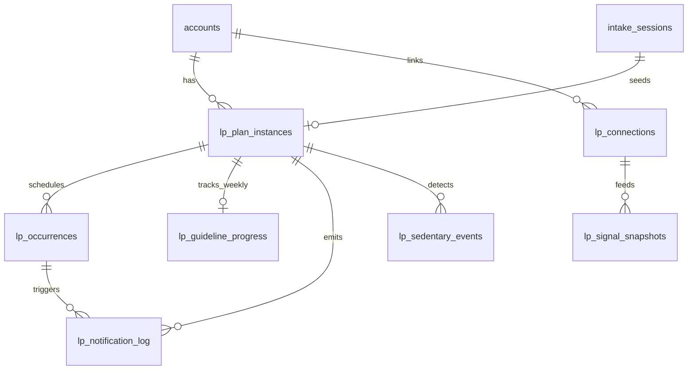
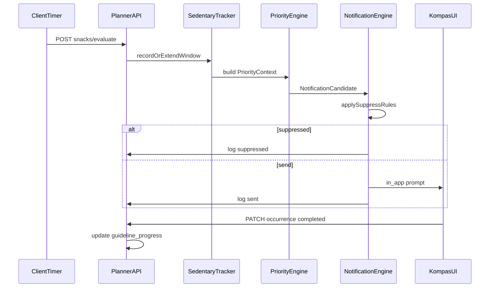
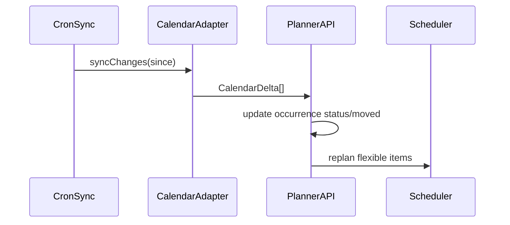

# Lifestyle Planning Engine — technisch ontwerp (Kompas / Beweegplan)

> **Status:** ontwerp (juli 2026). Geen productiecode — dit document is de blauwdruk voor implementatie.
> **Scope:** generieke leefstijlplanning-engine; **Beweegplan** is de eerste module.
> **Relatie:** voortbouw op bestaande leefstijlplan-templates — zie [`LEEFSTIJLPLAN_HANDBOOK.md`](LEEFSTIJLPLAN_HANDBOOK.md).

---

## Samenvatting

Kompas helpt gebruikers vandaag de **juiste leefstijlinterventie op het juiste moment** uit te voeren. De bestaande leefstijlplan-laag (`LifestylePlanTemplate` + `PlanProgress`) beantwoordt *wat* je in week 1–12 doet. De **Lifestyle Planning Engine** beantwoordt *wanneer*, *met welke prioriteit*, en *hoe* dat in het dagelijks leven landt — inclusief agenda, wearables, notificaties en sedentaire onderbrekingen (beweegsnacks).

**Architectuurprincipes:**

- Twee lagen: **content/checklist** (bestaand) + **planning/uitvoering** (nieuw).
- Account-scoped onder `/dashboard` (Kompas-tab, pijler Beweging).
- Geen Prisma — TypeScript-interfaces + Supabase-migraties (`lp_*`-tabellen).
- Modulair: `movement` eerst; later `energy`, `recovery`, `nutrition`, `sleep`, `stress`.
- Pure engines (Priority, Progression, Notification) + adapter-interfaces (Calendar, Wearable).
- Privacy-gate vóór OAuth/health-data: register, DPA, DPIA — zie §15.

---

## 1. Softwarearchitectuur

### 1.1 Twee lagen

| Laag | Rol | Bestaat? | Locatie |
|------|-----|----------|---------|
| **Content / checklist** | Weekplan, stappen, rationale, evidence | Ja | `src/types/lifestyle-plan.ts`, `src/data/lifestyle-plans/`, `src/lib/plan-progress.ts` |
| **Planning / uitvoering** | Scheduling, prioriteit, snacks, signalen, notificaties | Nee | `src/lib/planner/`, `src/types/planner.ts`, tabellen `lp_*` |

```
Leefstijlcheck (intake)
        │
        ▼
LifestylePlanTemplate ──► PlanProgress (checklist, session-scoped)
        │                         │
        │ seed + phase unlock     │
        ▼                         ▼
Lifestyle Planning Engine ◄── daily_action_log (account dag-tracker)
        │
        ├── Scheduler
        ├── PriorityEngine ──► Kompas "vandaag"-kaart
        ├── NotificationEngine
        ├── CalendarService (adapters)
        └── WearableService (adapters)
```

### 1.2 Modulestructuur (`src/lib/planner/`)

```
src/lib/planner/
├── db.ts                    # createSupabaseAdmin() wrapper (PartnerDesk-patroon)
├── domain/
│   ├── types.ts             # re-export uit src/types/planner.ts
│   ├── time-range.ts        # TimeRange helpers
│   └── module-registry.ts   # LifestyleModule registry
├── engines/
│   ├── scheduler.ts
│   ├── priority-engine.ts
│   ├── progression-engine.ts
│   ├── recommendation-engine.ts
│   ├── notification-engine.ts
│   └── evidence-engine.ts   # hooks naar evidence_claims / PLAN DB
├── services/
│   ├── calendar/
│   │   ├── calendar-service.ts      # interface
│   │   ├── google-calendar.ts
│   │   ├── outlook-calendar.ts
│   │   └── apple-caldav.ts          # later
│   ├── wearable/
│   │   ├── wearable-service.ts
│   │   ├── health-connect-client.ts # client-side bridge
│   │   ├── garmin-adapter.ts
│   │   └── fitbit-adapter.ts
│   └── notification-delivery.ts     # in-app, e-mail, push (later)
└── movement/
    ├── module.ts            # LifestyleModule implementatie
    ├── catalog.ts           # ActivityDefinitions (main + micro)
    ├── guidelines.ts
    └── progression-curve.ts
```

**Data-catalogus:** `src/data/planner/movement.ts` — activity-definities als code (DB pas bij coach/CMS).

**UI:** Kompas Beweging (`src/components/dashboard/BewegingScreen.tsx`) consumeert `/api/account/planner/today`.

**ID-mapping:** engine `movement` ↔ dashboard `beweging` via `SCORE_KEY_BY_PILLAR` in `src/data/dashboard/index.ts`.

### 1.3 Componenten (overzicht)

| Component | Verantwoordelijkheid |
|-----------|---------------------|
| `LifestylePlan` | Template + module-definitie per leefstijldomein |
| `Activity` / `MainActivity` / `MicroActivity` | Catalogus + occurrences (`kind: main \| micro`) |
| `Scheduler` | Vrije blokken → occurrence-suggesties |
| `CalendarService` | Free/busy, event CRUD, sync-delta |
| `WearableService` | Genormaliseerde `SignalSnapshot` |
| `NotificationService` | Dosering, delivery, suppress-log |
| `RecommendationEngine` | Kandidaten genereren (rules → later AI) |
| `PriorityEngine` | Eén "beste interventie nu" |
| `ProgressionEngine` | Week-opbouw, unlock-regels |
| `EvidenceEngine` | Wetenschappelijke refs uit PLAN DB |
| `HabitEngine` | Completion-streaks, adherence (deelt logica met `daily_action_log`) |
| `PersonalizationEngine` | Intake-context + gedrag → progression modifiers |

---

## 2. Domeinmodel

### 2.1 Kernentiteiten

| Entiteit | Beschrijving |
|----------|--------------|
| `LifestylePlanInstance` | Actieve planner per `account_id` + `module_id`; optioneel gekoppeld aan intake-sessie voor seed |
| `ActivityDefinition` | Catalogus-item: duur, intensiteit, categorie, evidence, prioriteit |
| `ActivityOccurrence` | Geplande of uitgevoerde instantie op datum/tijd |
| `GuidelineTarget` | Weekdoel (bv. 250 min matig, 2× kracht) |
| `GuidelineProgress` | Aggregaat t.o.v. weekdoelen |
| `SedentaryWindow` | Onafgebroken zitperiode → trigger voor micro-activity |
| `ProgressionState` | Weekindex, unlock-set, belastbaarheidsniveau |
| `NotificationCandidate` | Voorgestelde melding + prioriteit + suppress-reden |
| `ExternalConnection` | OAuth/token-metadata calendar of wearable |
| `SignalSnapshot` | Genormaliseerde signalen (geen raw vendor dump) |

### 2.2 Beweegplan: hoofdactiviteiten vs beweegsnacks

| Soort | `kind` | Doel | Richtlijn |
|-------|--------|------|-----------|
| **Hoofdactiviteit** | `main` | Bijdragen aan beweegrichtlijnen | minuten/week matig, 2× kracht, mobiliteit |
| **Beweegsnack** | `micro` | Sedentair gedrag doorbreken | onderbreking na 20–30 min onafgebroken zitten |

**Harde regel:** beweegsnacks tellen **niet** mee in `moderate_minutes_week` — aparte teller `sedentary_breaks_today` / `sedentary_breaks_week`.

### 2.3 Occurrence lifecycle

```
suggested → scheduled → completed
              │    └──► skipped
              └──► moved (reschedule)
```

**Bron (`source`):** `user` | `scheduler` | `calendar` | `snack_trigger` | `wearable`

### 2.4 Toekomstige modules (zelfde engine)

| `moduleId` | Voorbeelden activiteiten |
|------------|--------------------------|
| `energy` | focusblok, micropauze, ademhaling |
| `recovery` | slaaproutine, ontspanning, herstelwandeling |
| `nutrition` | maaltijdmoment, drinkherinnering, eiwitinname |
| `sleep` | wind-down, schermvrij venster |
| `stress` | mindfulness, ademhalingsoefening |

Elke module implementeert `LifestyleModule`: catalogus + guidelines + progression curve.

---

## 3. TypeScript-interfaces

Nieuw bestand: `src/types/planner.ts`. Geen Prisma — handgeschreven types, spiegel van DB-kolommen.

```typescript
/** Engine-domein (Engels); UI pijler-id is Nederlands (beweging, slaap, …). */
export type PlannerModuleId =
  | "movement"
  | "energy"
  | "recovery"
  | "nutrition"
  | "sleep"
  | "stress";

export type ActivityKind = "main" | "micro";
export type Intensity = "low" | "moderate" | "vigorous";
export type Flexibility = "fixed" | "flexible";
export type TimeOfDay = "morning" | "midday" | "afternoon" | "evening";

export type OccurrenceStatus =
  | "suggested"
  | "scheduled"
  | "completed"
  | "skipped"
  | "moved";

export type OccurrenceSource =
  | "user"
  | "scheduler"
  | "calendar"
  | "snack_trigger"
  | "wearable";

export type NotificationPriorityBand = "high" | "mid" | "low";

export type PlanInstanceStatus = "active" | "paused" | "completed";

export interface TimeRange {
  start: string; // ISO 8601
  end: string;
}

/** Catalogus-item — id is stabiel contract, nooit hernoemen. */
export interface ActivityDefinition {
  id: string;
  moduleId: PlannerModuleId;
  kind: ActivityKind;
  title: string;
  description: string;
  category: string;
  durationMin: number;
  intensity: Intensity;
  defaultFrequencyPerWeek?: number;
  preferredDays?: number[]; // 0=zondag … 6=zaterdag
  preferredTimeOfDay?: TimeOfDay;
  flexibility: Flexibility;
  evidenceRef?: string;
  lifestyleGoalIds: string[];
  basePriority: number; // 1–100
  recoveryMinutesNeeded?: number;
}

export interface GuidelineTarget {
  id: string;
  moduleId: PlannerModuleId;
  metric:
    | "moderate_minutes_week"
    | "strength_sessions_week"
    | "mobility_sessions_week"
    | "sedentary_breaks_day"
    | "sedentary_breaks_week";
  targetValue: number;
  unit: "minutes" | "sessions" | "count";
}

export interface GuidelineProgress {
  weekStart: string; // ISO date (maandag)
  metrics: Record<string, { current: number; target: number }>;
}

export interface ProgressionState {
  weekIndex: number; // 1-based
  unlockedActivityIds: string[];
  loadLevel: "conservative" | "standard" | "ambitious";
  snackIntervalMin: number; // 20–30, module-specifiek
}

export interface ActivityOccurrence {
  id: string;
  planInstanceId: string;
  activityId: string;
  kind: ActivityKind;
  status: OccurrenceStatus;
  source: OccurrenceSource;
  scheduledStart: string | null;
  scheduledEnd: string | null;
  completedAt: string | null;
  durationMin: number;
  calendarEventRef: ExternalEventRef | null;
  metadata?: Record<string, string | number | boolean>;
}

export interface LifestylePlanInstance {
  id: string;
  accountId: string;
  moduleId: PlannerModuleId;
  sessionId: string | null;
  organizationId: string;
  status: PlanInstanceStatus;
  progression: ProgressionState;
  templateVersion: string | null;
  startedAt: string;
  updatedAt: string;
}

export interface SedentaryWindow {
  id: string;
  planInstanceId: string;
  startedAt: string;
  endedAt: string | null;
  source: "timer" | "wearable" | "manual";
  breakOfferedAt: string | null;
  breakCompleted: boolean;
}

export interface SignalSnapshot {
  capturedAt: string;
  stepsToday: number | null;
  activeMinutesToday: number | null;
  restingHeartRate: number | null;
  hrvMs: number | null;
  sleepScore: number | null;
  sleepDurationMin: number | null;
  trainingLoad: number | null;
  recoveryScore: number | null;
  sedentaryMinutesToday: number | null;
  caloriesBurned: number | null;
}

export interface NotificationCandidate {
  id: string;
  activityId: string;
  occurrenceId: string | null;
  priority: NotificationPriorityBand;
  score: number;
  title: string;
  body: string;
  suppressReason: string | null;
}

export interface NotificationLogSummary {
  lastSentAt: string | null;
  lowCountToday: number;
  midCountToday: number;
  highCountToday: number;
}

export interface PriorityContext {
  now: Date;
  moduleId: PlannerModuleId;
  agendaBusy: TimeRange[];
  openOccurrences: ActivityOccurrence[];
  weekProgress: GuidelineProgress;
  signals: SignalSnapshot | null;
  progression: ProgressionState;
  recentNotifications: NotificationLogSummary;
  focusMode?: boolean;
  sleepWindow?: TimeRange;
  lastMainActivityCompletedAt: string | null;
}

export interface PriorityDecision {
  selected: NotificationCandidate | null;
  alternatives: NotificationCandidate[];
  rationale: string; // intern/debug; niet in analytics-payload
}

export interface ProgressionCurve {
  moduleId: PlannerModuleId;
  weeks: ProgressionWeekDefinition[];
}

export interface ProgressionWeekDefinition {
  weekIndex: number;
  unlockActivityIds: string[];
  guidelineOverrides?: Partial<Record<string, number>>;
  snackIntervalMin: number;
  notes?: string;
}

export interface LifestyleModule {
  id: PlannerModuleId;
  activityCatalog: ActivityDefinition[];
  guidelines: GuidelineTarget[];
  progression: ProgressionCurve;
}

/** Adapter: calendar */
export interface ExternalEventRef {
  provider: "google" | "outlook" | "apple";
  externalId: string;
  calendarId: string;
}

export interface CalendarDelta {
  externalEventRef: ExternalEventRef;
  change: "created" | "updated" | "deleted";
  newTimeRange: TimeRange | null;
}

export interface CalendarService {
  listFreeBusy(range: TimeRange): Promise<TimeRange[]>;
  createEvent(occurrence: ActivityOccurrence, title: string): Promise<ExternalEventRef>;
  updateEvent(ref: ExternalEventRef, patch: Partial<ActivityOccurrence>): Promise<void>;
  deleteEvent(ref: ExternalEventRef): Promise<void>;
  syncChanges(since: Date): Promise<CalendarDelta[]>;
}

export interface WearableService {
  fetchSignals(range: TimeRange): Promise<SignalSnapshot>;
}

/** Recommendation: rules default, AI later */
export interface RecommendationStrategy {
  generateCandidates(ctx: PriorityContext): NotificationCandidate[];
}

export interface RulesRecommendationStrategy extends RecommendationStrategy {}

export interface ModelRecommendationStrategy extends RecommendationStrategy {
  modelVersion: string;
}
```

**Koppeling bestaande types:** `PlanIntakeContext` uit `src/types/lifestyle-plan.ts` blijft input voor seeding en progression-modifiers; geen merge in één type.

---

## 4. Database — tabellen (`lp_*`)

Migraties via **Supabase Dashboard SQL Editor** — nooit `supabase db push`. RLS enable, **geen policies** (service-role only), account-scoped zoals `daily_action_log`.

### 4.1 Fase 1 (minimum viable)

#### `lp_plan_instances`

```sql
-- Lifestyle Planning Engine — plan-instantie per account + module
-- Dashboard SQL Editor — nooit supabase db push
create table if not exists public.lp_plan_instances (
  id uuid primary key default gen_random_uuid(),
  account_id uuid not null references public.accounts (id) on delete cascade,
  organization_id uuid not null default '00000000-0000-0000-0000-000000000001'
    references public.organizations (id),
  module_id text not null check (module_id in (
    'movement', 'energy', 'recovery', 'nutrition', 'sleep', 'stress'
  )),
  session_id uuid references public.intake_sessions (id) on delete set null,
  status text not null default 'active'
    check (status in ('active', 'paused', 'completed')),
  template_version text,
  progression jsonb not null default '{}'::jsonb,
  started_at timestamptz not null default now(),
  updated_at timestamptz not null default now(),
  unique (account_id, module_id)
);

create index if not exists lp_plan_instances_account_id_idx
  on public.lp_plan_instances (account_id);

alter table public.lp_plan_instances enable row level security;
-- Geen anon/authenticated policies: alleen service role via API-routes.
```

#### `lp_occurrences`

```sql
create table if not exists public.lp_occurrences (
  id uuid primary key default gen_random_uuid(),
  plan_instance_id uuid not null references public.lp_plan_instances (id) on delete cascade,
  organization_id uuid not null default '00000000-0000-0000-0000-000000000001'
    references public.organizations (id),
  activity_id text not null,
  kind text not null check (kind in ('main', 'micro')),
  status text not null default 'suggested'
    check (status in ('suggested', 'scheduled', 'completed', 'skipped', 'moved')),
  source text not null default 'scheduler'
    check (source in ('user', 'scheduler', 'calendar', 'snack_trigger', 'wearable')),
  scheduled_start timestamptz,
  scheduled_end timestamptz,
  completed_at timestamptz,
  duration_min integer not null,
  calendar_event_ref jsonb,
  metadata jsonb not null default '{}'::jsonb,
  created_at timestamptz not null default now(),
  updated_at timestamptz not null default now()
);

create index if not exists lp_occurrences_plan_instance_idx
  on public.lp_occurrences (plan_instance_id, scheduled_start);

create index if not exists lp_occurrences_status_idx
  on public.lp_occurrences (plan_instance_id, status);

alter table public.lp_occurrences enable row level security;
```

#### `lp_guideline_progress`

```sql
create table if not exists public.lp_guideline_progress (
  plan_instance_id uuid not null references public.lp_plan_instances (id) on delete cascade,
  week_start date not null,
  metrics jsonb not null default '{}'::jsonb,
  updated_at timestamptz not null default now(),
  primary key (plan_instance_id, week_start)
);

alter table public.lp_guideline_progress enable row level security;
```

#### `lp_notification_log`

```sql
create table if not exists public.lp_notification_log (
  id uuid primary key default gen_random_uuid(),
  plan_instance_id uuid not null references public.lp_plan_instances (id) on delete cascade,
  organization_id uuid not null default '00000000-0000-0000-0000-000000000001'
    references public.organizations (id),
  activity_id text,
  occurrence_id uuid references public.lp_occurrences (id) on delete set null,
  priority_band text not null check (priority_band in ('high', 'mid', 'low')),
  channel text not null check (channel in ('in_app', 'email', 'push')),
  action text not null check (action in ('sent', 'suppressed', 'clicked', 'dismissed')),
  suppress_reason text,
  created_at timestamptz not null default now()
);

create index if not exists lp_notification_log_plan_created_idx
  on public.lp_notification_log (plan_instance_id, created_at desc);

alter table public.lp_notification_log enable row level security;
```

### 4.2 Fase 2+ (integraties)

#### `lp_sedentary_events`

```sql
create table if not exists public.lp_sedentary_events (
  id uuid primary key default gen_random_uuid(),
  plan_instance_id uuid not null references public.lp_plan_instances (id) on delete cascade,
  started_at timestamptz not null,
  ended_at timestamptz,
  source text not null check (source in ('timer', 'wearable', 'manual')),
  break_offered_at timestamptz,
  break_completed boolean not null default false,
  created_at timestamptz not null default now()
);

alter table public.lp_sedentary_events enable row level security;
```

#### `lp_connections` (OAuth — privacy-gate verplicht)

```sql
create table if not exists public.lp_connections (
  id uuid primary key default gen_random_uuid(),
  account_id uuid not null references public.accounts (id) on delete cascade,
  organization_id uuid not null default '00000000-0000-0000-0000-000000000001'
    references public.organizations (id),
  provider text not null check (provider in (
    'google_calendar', 'outlook_calendar', 'apple_caldav',
    'garmin', 'fitbit', 'oura', 'polar', 'samsung_health', 'health_connect'
  )),
  provider_account_id text,
  token_ref text not null, -- encrypted secret ref, niet plaintext in DB
  scopes text[] not null default '{}',
  status text not null default 'active' check (status in ('active', 'revoked', 'expired')),
  connected_at timestamptz not null default now(),
  updated_at timestamptz not null default now(),
  unique (account_id, provider)
);

alter table public.lp_connections enable row level security;
```

#### `lp_signal_snapshots`

```sql
create table if not exists public.lp_signal_snapshots (
  id uuid primary key default gen_random_uuid(),
  account_id uuid not null references public.accounts (id) on delete cascade,
  connection_id uuid references public.lp_connections (id) on delete set null,
  captured_at timestamptz not null,
  signals jsonb not null,
  retention_until timestamptz not null,
  created_at timestamptz not null default now()
);

create index if not exists lp_signal_snapshots_account_captured_idx
  on public.lp_signal_snapshots (account_id, captured_at desc);

alter table public.lp_signal_snapshots enable row level security;
```

#### `lp_activity_definitions` (optioneel — pas bij coach/CMS)

Catalogus start **code-only** in `src/data/planner/movement.ts`. DB-tabel pas wanneer B2B-coaches activiteiten willen toevoegen zonder deploy.

### 4.3 Revoke / account-delete

Alle `lp_*`-tabellen met `account_id` of via `plan_instance_id` cascade-en bij account-verwijdering. Uitbreiden:

- `PREFLIGHT_TABLES` + account-cleanup in `src/lib/account-server.ts` (of equivalent)
- `cleanup_intake_session_linked_data`: `session_id` op `lp_plan_instances` → `set null` (niet verwijderen bij sessie-revoke; account-data blijft)

---

## 5. Database-relaties



**Relatie bestaande tabellen:**

| Bestaand | Nieuw | Relatie |
|----------|-------|---------|
| `plan_progress` | `lp_plan_instances` | Soft: phase unlock leest `current_phase_id` + step states |
| `daily_action_log` | `lp_occurrences` | Parallel: dag-tracker blijft; occurrences zijn rijkere planning |
| `intake_domain_checkin` | `lp_guideline_progress` | Check-in scores kunnen progression modifiers voeden |

---

## 6. API-endpoints

Alle routes onder `/api/account/planner/*` — auth via `getAccountFromCookie()` (`src/lib/account-server.ts`). Geen anon-toegang.

### 6.1 Account-scoped

| Method | Path | Beschrijving |
|--------|------|--------------|
| `GET` | `/api/account/planner` | Actieve plan-instances + samenvatting weekvoortgang |
| `POST` | `/api/account/planner/start` | Start module (`moduleId`); seed uit intake + week 1 progression |
| `GET` | `/api/account/planner/today` | `PriorityEngine`-output voor Kompas-vandaag-kaart |
| `GET` | `/api/account/planner/occurrences` | Query: `from`, `to`, `kind`, `status` |
| `PATCH` | `/api/account/planner/occurrences` | Body: `{ id, status, scheduledStart?, scheduledEnd? }` |
| `POST` | `/api/account/planner/snacks/evaluate` | Sedentary/timer → snack-kandidaat of suppress |
| `POST` | `/api/account/planner/connections` | Start OAuth-flow (fase 4+) |
| `DELETE` | `/api/account/planner/connections/:provider` | Revoke koppeling |

### 6.2 Cron

| Method | Path | Beschrijving |
|--------|------|--------------|
| `GET` | `/api/cron/planner-notify` | Batch: `NotificationEngine` → in-app/e-mail queue |

Auth: `verifyCronRequest` (`CRON_SECRET`) — zelfde patroon als `/api/cron/nurture`.

### 6.3 Request/response-voorbeelden

**POST `/api/account/planner/start`**

```json
{ "moduleId": "movement" }
```

Response:

```json
{
  "planInstance": { "id": "…", "moduleId": "movement", "progression": { "weekIndex": 1 } },
  "today": { "selected": { "activityId": "mov-walk-10", "priority": "mid" } }
}
```

**GET `/api/account/planner/today`**

```json
{
  "decision": {
    "selected": {
      "activityId": "mov-snack-walk-3",
      "priority": "low",
      "title": "3 minuten wandelen",
      "body": "Je zit inmiddels 25 minuten. Tijd voor een beweegsnack?"
    },
    "weekProgress": {
      "moderate_minutes_week": { "current": 80, "target": 100 }
    }
  }
}
```

**POST `/api/account/planner/snacks/evaluate`**

```json
{
  "sedentaryStartedAt": "2026-07-16T08:00:00Z",
  "source": "timer"
}
```

Rate-limit: eigen bucket (niet gedeeld met intake-session) — max 1 evaluate / 60s per account.

---

## 7. CalendarService

### 7.1 Ondersteunde providers (gefaseerd)

| Provider | Mechanisme | Fase |
|----------|------------|------|
| Google Calendar | OAuth 2.0 + Calendar API v3 | 4 |
| Outlook Calendar | Microsoft Graph | 4 |
| Apple Calendar | CalDAV of native app-bridge | 5+ |

### 7.2 Functionaliteiten

- Activiteit als afspraak plannen (`createEvent`)
- Herinneringen via calendar-native reminders + Kompas-notificatie
- Free/busy voor `Scheduler` en `RecommendationEngine`
- Sync-delta: externe wijziging → `occurrence.status = moved` + herplan
- Automatisch verplaatsen alleen bij `flexibility: flexible`

### 7.3 Implementatie

```typescript
// src/lib/planner/services/calendar/calendar-service.ts
export function getCalendarService(
  connection: LpConnection,
): CalendarService {
  switch (connection.provider) {
    case "google_calendar":
      return new GoogleCalendarAdapter(connection);
    case "outlook_calendar":
      return new OutlookCalendarAdapter(connection);
    default:
      throw new Error(`Unsupported calendar provider: ${connection.provider}`);
  }
}
```

Tokens: encrypted ref in `lp_connections.token_ref` — nooit plaintext in logs of events.

---

## 8. WearableService

### 8.1 Ondersteunde bronnen (gefaseerd)

| Bron | Mechanisme | Fase |
|------|------------|------|
| Health Connect (Android) | Client-side SDK → API POST genormaliseerde snapshot | 5 |
| Apple Health | Client-side HealthKit → API POST | 5 |
| Garmin / Fitbit / Oura / Polar | Vendor OAuth waar beschikbaar | 5+ |
| Samsung Health | Vendor SDK/OAuth | 5+ |

### 8.2 Gebruikte signalen → planning

> **Bindende waarheid (analyse-first, 18 jul 2026 — Analyse-SSOT-verdict).** Een `WearableSignalSnapshot` landt eerst op de **analyse-laag** (trend/context-verrijking), niet op de checklist. De onderstaande "effect op planning" is dus een **afgeleide, feature-gated soft hint** (`computeRecoveryFit` → `showWhen`-hint of analyse-banner via `movement-recovery-bridge.ts`), nooit een alternate domeinscore en nooit sensor-raw in een `PlanStep`-body. Zie `docs/core/DOMAIN_MODEL.md` §5.1 + `src/types/wearable-signals.ts`.

| Signaal | Effect op planning (afgeleide hint) |
|---------|-------------------|
| Slechte slaap (`sleepScore` laag) | Lichtere intensiteit voorstellen |
| Hoge `trainingLoad` | Herstelwandeling i.p.v. kracht |
| Lange `sedentaryMinutesToday` | Snack-prioriteit verhogen |
| Weekdoel bijna gehaald | Main-activity prioriteit verlagen |
| Kracht 0× deze week | Kracht-prioriteit verhogen (high band) |
| HRV / recoveryScore laag | Geen vigorous; conservative load |

### 8.3 Normalisatie

Raw vendor payloads **niet** opslaan in core tables. Alleen `SignalSnapshot` in `lp_signal_snapshots.signals` met TTL (`retention_until`, bijv. 90 dagen).

Health Connect / Apple Health: **client-side** aggregatie; server ontvangt alleen genormaliseerde snapshot (privacy by design).

---

## 9. Notification Priority Engine

### 9.1 Prioriteitsbanden

| Band | Voorbeelden |
|------|-------------|
| **High** | Kracht deze week nog niet; weekdoel dreigt te falen; langdurig volledig inactief |
| **Mid** | Geplande wandeling, fietstocht, mobiliteit |
| **Low** | Beweegsnack, stretch, korte mobiliteit |

### 9.2 Scoringsformule

```
score = basePriority × guidelineUrgency × recoveryFit × timingFit × fatiguePenalty
```

| Factor | Bereik | Logica |
|--------|--------|--------|
| `basePriority` | 1–100 | Uit `ActivityDefinition` |
| `guidelineUrgency` | 0.5–2.0 | Hoe ver achter op weekdoel |
| `recoveryFit` | 0–1 | Past bij HRV/slaap/trainingLoad |
| `timingFit` | 0–1 | Past bij preferredTimeOfDay + agenda-vrij |
| `fatiguePenalty` | 0–1 | Recente notificaties, focusmodus |

Band mapping: score ≥ 70 → high; 40–69 → mid; < 40 → low.

### 9.3 Suppress-regels (notificatiemoeheid voorkomen)

- **Slaapvenster:** geen meldingen binnen `sleepWindow`
- **Focusmodus:** alleen high band
- **Low band:** max 8/dag, min interval 20 min tussen snacks
- **Geen snack** als main-activity < 60 min geleden completed
- **Agenda busy:** geen mid/high met `flexibility: fixed` overlap
- **Deduplicatie:** zelfde `activityId` niet opnieuw binnen 4 uur (low)

### 9.4 Delivery-kanalen (gefaseerd)

| Fase | Kanaal |
|------|--------|
| 2 | In-app Kompas (vandaag-kaart + badge) |
| 3 | E-mail via bestaande Resend/cron-patroon |
| 6+ | Web push (aparte productbeslissing + register) |

### 9.5 Voorbeeldcopy (NL)

- High: "Krachttraining staat deze week nog open. 20 minuten thuis is genoeg."
- Mid: "Je geplande wandeling — nu 30 vrije minuten in je agenda."
- Low: "Je zit inmiddels 25 minuten. Tijd voor een beweegsnack van 3 minuten?"
- Low (achterstand): "Je had vandaag weinig onderbrekingen. Een korte wandeling helpt langdurig zitten doorbreken."

---

## 10. Progression Engine

Gebruikers starten **niet** direct op volledige beweegrichtlijnen. `ProgressionEngine` bepaalt welke activiteiten unlocked zijn en welke weekdoelen gelden.

### 10.1 Inputs

| Input | Bron |
|-------|------|
| Leeftijd | `intake_sessions.age_range` |
| Belastbaarheid | `recovery_score`, `MOV_*` antwoorden |
| Conditie | `movement_score`, `MOV_CARD`, `MOV_STR` |
| Motivatie | Later: opt-in slider |
| Aandoeningen | Self-report flags (geen diagnose) |
| Doelen | Primary theme + plan template fase |

### 10.2 Load levels

| Level | Wanneer |
|-------|---------|
| `conservative` | Lage recovery, hoge leeftijd, lage movement_score |
| `standard` | Default |
| `ambitious` | Hoge movement_score, jonge age_range, goede recovery |

Conservative: +1 week delay op kracht-unlock; lagere week-minuten targets.

### 10.3 Beweegplan — week 1–12

| Week | Hoofdactiviteiten | Beweegsnacks | Weekdoelen (richting) |
|------|-------------------|--------------|------------------------|
| 1 | 10 min wandelen/dag | 1/uur werktijd | ~70 min matig; breaks 4/dag |
| 2 | 2× wandelen (15 min) | Elke 30 min zitten | ~100 min matig |
| 3 | Wandelen + mobiliteit 5 min/dag | Elke 30 min | ~120 min |
| 4 | + Eerste kracht (20 min, 1×) | Elke 30 min | ~150 min; 1× kracht |
| 5 | Wandelen uitbreiden | Elke 25 min | ~170 min; 1× kracht |
| 6 | Kracht 2× (licht) | Elke 25 min | ~200 min; 2× kracht |
| 7 | Langere wandeling (30 min) | Elke 25 min | ~220 min |
| 8 | Kracht + mobiliteit structureel | Elke 20 min | ~230 min |
| 9–10 | Volledige mix | Elke 20 min | ~240 min |
| 11–12 | Richting richtlijn | Elke 20 min | **250 min matig; 2× kracht; mobiliteit 3×/week** |

**Koppeling checklist:** movement-template fases (`mov-phase-deze-week`, …) blijven de *copy*; ProgressionEngine unlockt `ActivityDefinition`-ids die corresponderen met plan steps.

### 10.4 Unlock-mechanisme

```typescript
function getUnlockedActivities(
  progression: ProgressionState,
  curve: ProgressionCurve,
): ActivityDefinition[] {
  const weekDef = curve.weeks.find((w) => w.weekIndex === progression.weekIndex);
  // merge weekDef.unlockActivityIds with loadLevel modifiers
}
```

Week advance: automatisch maandag 06:00 **of** bij ≥ 80% weekdoel vóór zondag (early unlock, optioneel).

---

## 11. Priority Engine + Recommendation Engine

### 11.1 PriorityEngine

Pure functie — geen I/O:

```typescript
export function selectNextBest(ctx: PriorityContext): PriorityDecision {
  const candidates = new RulesRecommendationStrategy().generateCandidates(ctx);
  const scored = candidates
    .map((c) => ({ ...c, score: computeScore(c, ctx) }))
    .filter((c) => !c.suppressReason)
    .sort((a, b) => b.score - a.score);
  return {
    selected: scored[0] ?? null,
    alternatives: scored.slice(1, 4),
    rationale: buildRationale(scored[0], ctx),
  };
}
```

**Kompas-integratie:** `/api/account/planner/today` voedt BewegingScreen "volgende stap". Op termijn verrijkt dit `vitality-habit-kernel.ts` voor `beweging`; andere pijlers blijven kernel tot hun module bestaat.

### 11.2 RecommendationEngine

Genereert occurrence-suggesties:

1. Bepaal vrije blokken (`agendaBusy` inverse + preferredTimeOfDay)
2. Filter op unlocked activities + open weekdoelen
3. Score per kandidaat (zelfde formule als notifications)
4. Persist als `status: suggested` (optioneel auto-`scheduled`)

**Tijd-voorbeelden:**

| Tijd | Typische prioriteit |
|------|---------------------|
| Ochtend | Wandeling, mobiliteit |
| Werk | Beweegsnack na 20–30 min zitten |
| Lunch | Korte wandeling |
| Avond | Krachttraining (indien unlocked + recovery OK) |

### 11.3 EvidenceEngine

Koppelt `ActivityDefinition.evidenceRef` aan `evidence_claims` / PLAN DB (`src/lib/content/plan-content.ts`). Geen medische claims — Consumentenbond-positionering.

### 11.4 HabitEngine

- Completion-streaks per `activityId`
- Adherence % per week
- Deelt data met `daily_action_log` waar mogelijk (één bron voor "vandaag afgevinkt")

---

## 12. AI-uitbreidingsmogelijkheden

### 12.1 Architectuur-hook

```typescript
interface RecommendationStrategy {
  generateCandidates(ctx: PriorityContext): NotificationCandidate[];
}
```

- **Fase 1–3:** `RulesRecommendationStrategy` (deterministisch, testbaar)
- **Fase 6+:** `ModelRecommendationStrategy` (scored rerank)

### 12.2 Feature store (pseudoniem, geen PII)

| Feature | Bron |
|---------|------|
| Completion rate per timeslot | `lp_occurrences` |
| Skip rate per activityId | `lp_occurrences` |
| Best-performing categories | Aggregatie |
| Recovery × intensity outcome | `lp_signal_snapshots` + occurrences |
| Preferred movement windows | Histogram completed_at |

Training/inference **buiten** request-path (batch job of externe service). Online: alleen pre-scored candidates accepteren binnen guardrails (max intensity, medical boundary).

### 12.3 Leerdoelen (toekomst)

- Tijdstippen waar iemand het beste beweegt
- Optimale snack-frequentie zonder fatigue
- Personaliseerde progression curves
- Energiepatronen (module `energy`)

**Geen** vrije-tekst of ruwe health dumps in model-features. Geen medische output.

---

## 13. Event-flow

### 13.1 Domain events (analytics)

Hergebruik waar mogelijk: `plan.*`, `dashboard.*`. Nieuwe types — triple-registratie (`events.ts` + client union + route allowlist):

| Event | Trigger | Payload (categorisch) |
|-------|---------|------------------------|
| `planner.started` | POST start | `module_id`, `week_index` |
| `planner.occurrence_completed` | PATCH complete | `module_id`, `activity_id`, `kind`, `source` |
| `planner.occurrence_skipped` | PATCH skip | `module_id`, `activity_id`, `kind` |
| `planner.snack_offered` | evaluate → niet suppressed | `module_id`, `activity_id` |
| `planner.snack_completed` | PATCH complete micro | `module_id`, `activity_id` |
| `planner.priority_selected` | GET today (1×/sessie) | `module_id`, `activity_id`, `priority_band` |
| `planner.connection_linked` | OAuth success | `provider` (geen tokens) |
| `planner.notification_suppressed` | server | `module_id`, `priority_band`, `suppress_reason` |

GA4: `trackEvent("planner_occurrence_completed", { module_id, kind })` — geen PII.

Clarity: `clarityTag("planner_module", "movement")` op BewegingScreen.

### 13.2 Sequence — sedentary → snack



### 13.3 Sequence — calendar sync



---

## 14. Beweegplan — activity catalogus (Fase 1)

### 14.1 Hoofdactiviteiten (`kind: main`)

| id | title | category | durationMin | intensity | freq/week |
|----|-------|----------|-------------|-----------|-----------|
| `mov-walk-10` | Wandelen 10 min | cardio | 10 | moderate | 7 |
| `mov-walk-20` | Wandelen 20 min | cardio | 20 | moderate | 5 |
| `mov-walk-30` | Wandelen 30 min | cardio | 30 | moderate | 3 |
| `mov-bike-30` | Fietsen 30 min | cardio | 30 | moderate | 2 |
| `mov-run-20` | Hardlopen 20 min | cardio | 20 | vigorous | 2 |
| `mov-swim-30` | Zwemmen 30 min | cardio | 30 | moderate | 1 |
| `mov-strength-home-20` | Krachttraining thuis | strength | 20 | moderate | 2 |
| `mov-strength-gym-45` | Krachttraining sportschool | strength | 45 | moderate | 2 |
| `mov-mobility-5` | Mobiliteit 5 min | mobility | 5 | low | 7 |
| `mov-mobility-15` | Mobiliteit 15 min | mobility | 15 | low | 3 |
| `mov-yoga-20` | Yoga 20 min | mobility | 20 | low | 2 |
| `mov-sport-session` | Sport/sessie | sport | 45 | moderate | 1 |

### 14.2 Beweegsnacks (`kind: micro`)

| id | title | durationMin | trigger |
|----|-------|-------------|---------|
| `mov-snack-walk-3` | 3 min wandelen | 3 | 20–30 min zitten |
| `mov-snack-stairs` | Traplopen | 2 | zittend werk |
| `mov-snack-stand` | 1 min staan/rekken | 1 | bureau |
| `mov-snack-mobility` | Mobiliteitsoefeningen | 3 | lang zitten |
| `mov-snack-squats` | 10 squats | 2 | lang zitten |
| `mov-snack-shoulders` | Schouderoefeningen | 2 | bureau |
| `mov-snack-desk-gym` | Bureaugym | 3 | werktijd |
| `mov-snack-balance` | Balansoefening | 2 | pauze |

### 14.3 Richtlijnen (einddoel week 12)

| metric | target |
|--------|--------|
| `moderate_minutes_week` | 250 |
| `strength_sessions_week` | 2 |
| `mobility_sessions_week` | 3 |
| `sedentary_breaks_day` | ≥ 8 (elke ~20–30 min werktijd) |

---

## 15. Schaalbaarheid, onderhoud & privacy

### 15.1 Schaalbaarheid

- Pure engines → horizontaal testbaar; geen side effects in Priority/Progression
- Adapter pattern → nieuwe calendar/wearable zonder core-wijziging
- Activity catalogus code-first → geen DB-migratie bij content-tweak
- Cron batch voor notifications → geen per-user polling
- Rate limits op `snacks/evaluate` en OAuth callbacks
- `lp_signal_snapshots.retention_until` → automatische opschoning (cron retention)

### 15.2 Onderhoud

- Activity `id`s stabiel (zelfde regel als `step.id` in leefstijlplan)
- Module toevoegen = `LifestyleModule` + `src/data/planner/<module>.ts` + registry entry
- Dual ID-mapping documenteren in code (`movement` ↔ `beweging`)
- `Dashboard.tsx` monolith: planner-UI in dedicated componenten (`PlannerTodayCard`, `SnackPrompt`)
- Tests: unit tests op engines (vitest); geen I/O in engine tests

### 15.3 AVG / privacy-gate (calendar & wearables)

**Implementatie van OAuth/health-data start pas na:**

| # | Actie | Document |
|---|-------|----------|
| 1 | Verwerking registreren (doel, grondslag, bewaartermijn, verwerker) | `docs/core/VERWERKINGSREGISTER.md` |
| 2 | Publieke privacy-pagina bijwerken indien nieuwe cookie/verwerker | `src/app/privacy/page.tsx` |
| 3 | DPA accepteren en archiveren per SaaS-verwerker | `Documenten/.../privacy/dpa/` |
| 4 | DPIA herzien (art. 9 gezondheidsgegevens, doorgifte buiten EU) | `docs/core/DPIA.md` |
| 5 | Legal PDF's genereren | `npm run generate-legal-pdfs` |

**Gezondheidsdata (art. 9):** wearable-signalen, slaap, HRV, hartslag — expliciete toestemming + informatieplicht. Geen activering zonder register-update in dezelfde PR als codewijziging.

**Data-minimalisatie:**

- Geen raw vendor payloads in core
- Geen tokens in logs, events of analytics
- `SignalSnapshot` TTL 90 dagen (configureerbaar)
- Client-side Health Connect/HealthKit waar mogelijk

**Fase 1–3 (zonder OAuth):** alleen timer/self-report voor sedentary → geen nieuwe art. 9-verwerking; bestaande account-intake-grondslag volstaat voor planner-state.

### 15.4 Meetpunten (bij implementatie)

| Event | Waar aflezen |
|-------|--------------|
| `planner.started` | PostHog funnel: start → week 4 retention |
| `planner.occurrence_completed` | Adherence per module/kind |
| `planner.snack_offered` / `snack_completed` | Snack-conversie, sedentary interrupt rate |
| `planner.priority_selected` | Kompas engagement |
| `planner.notification_suppressed` | Fatigue tuning |
| GA4 `planner_occurrence_completed` | Aggregatie dashboards |

---

## 16. Gefaseerde bouwroadmap

| Fase | Inhoud | Afhankelijkheden |
|------|--------|------------------|
| **1** | Types, `lp_*` minimum tabellen, `/today` + `/start` API, PriorityEngine (rules), movement catalog | Account-login |
| **2** | Kompas Beweging UI, snack evaluate (timer), guideline progress | Fase 1 |
| **3** | NotificationEngine in-app + e-mail cron, domain events | Fase 2 |
| **4** | Google/Outlook calendar adapters + register/DPA | Privacy-gate |
| **5** | Wearable adapters + signal snapshots + DPIA | Privacy-gate |
| **6** | ModelRecommendationStrategy (AI rerank) | Voldoende occurrence-data |

**Buiten scope van dit document:** OAuth-app registraties, push-certificaten, native iOS/Android apps.

---

## 17. Bestandskaart (implementatie)

| Verantwoordelijkheid | Bestand (toekomstig) |
|---------------------|----------------------|
| Types | `src/types/planner.ts` |
| Movement catalogus | `src/data/planner/movement.ts` |
| Engines | `src/lib/planner/engines/*.ts` |
| DB access | `src/lib/planner/db.ts` |
| API routes | `src/app/api/account/planner/**` |
| Cron notify | `src/app/api/cron/planner-notify/route.ts` |
| UI | `src/components/dashboard/BewegingScreen.tsx`, `PlannerTodayCard.tsx` |
| Migratie | `supabase/migrations/*_lp_planner_fase1.sql` |
| Events | `src/lib/events.ts` + `account-events-client.ts` |
| SSOT content-laag | [`LEEFSTIJLPLAN_HANDBOOK.md`](LEEFSTIJLPLAN_HANDBOOK.md) |

---

*Laatst bijgewerkt: juli 2026*
