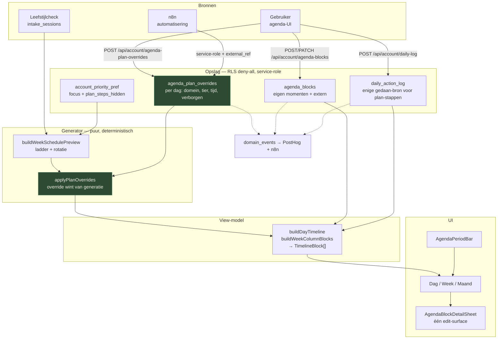

> **Herkomst:** uitkomst van [`PROMPT_CLAUDE_AGENDA_MIJN_DAG_AUDIT.md`](PROMPT_CLAUDE_AGENDA_MIJN_DAG_AUDIT.md),
> Claude Opus, 5 augustus 2026. Gearchiveerd uit de sessie op 5 aug 2026 — stond niet in de repo.
>
> **Stand 5 aug 2026:** plak 1 geland (`6b813c6`), plak 2 geland (`fb97901`, desktop-variant deels
> teruggedraaid in `34d11dc`). Plak 3 t/m 7 open — geen `AgendaViewProvider`, geen
> `agenda_plan_overrides`-migratie, `categoryId` nog niet in de PATCH-allowlist,
> geen `agenda_mutation`-rate-limit-bucket, `AgendaTeaser.tsx` nog dood.
>
> **Correctie 5 aug 2026 (avond), live gemeten op 16.3.0:** sectie B1's rekensom (163px
> toolbar, 309px/46,3% chrome) is **stale** — die beschrijft de 3-rijige toolbar van vóór
> `fb97901`. Live op 375×667 (`getBoundingClientRect()` na scroll, sticky-toestand):
> header 88px + toolbar **59px** (niet 163px) = 147px boven, bottom-nav 63px onder →
> **210px chrome (31,5%)**, tijdlijnvenster **457px** (was 358px). Dat is beter dan B4's
> eigen streefdoel voor optie ① (79px toolbar, 442px). Op 390×844 (zonder
> `safe-area-inset-bottom` in deze meetopstelling): 147px + 63px = 210px (24,9%), 634px
> venster — met een echte inset erbij landt dat rond 28,9%/600px.
> **C5 is ook al gerealiseerd:** "Meer acties" bevat alleen Focus + Plan, geen losse
> Kalender-item meer; het datumlabel ("Kies een dag") is de enige tik-ingang naast de
> week-strip — twee ingangen, zoals aanbevolen, niet drie.
> **Nog steeds open, ongewijzigd:** de tijdlijn-rail staat nog vast op 1044px
> (`HOUR_HEIGHT_PX=58 × 18u`, [AgendaDayTimeline.tsx:384-389](../../src/components/dashboard/agenda/AgendaDayTimeline.tsx#L384-L389)) — in het 457px-venster
> zie je ~6,4 van de 18 uur. Optie ④ (eigen scrollcontainer) uit B2/B4 is niet gebouwd.

---

# Audit "Mijn dag" — agenda-tab

**Werkboom:** `main`, working tree met de uncommitted wijzigingen uit de opdracht. Alles hieronder is gelezen, niet herinnerd.

**Verificatie vooraf**

| Check | Uitkomst |
|---|---|
| `npx tsc --noEmit` | exit 0 |
| `vitest` (4 agenda-libs) | 4 files, **59 tests passed** |
| `eslint src/components/dashboard/agenda src/lib/agenda-*.ts --max-warnings 0` | exit 0 |
| `grep -rn "console.log" src/` | 0 hits |

De suite is groen én de feature is stuk. Twee tests bewijzen dat samen:

- [agenda-timeline-drag.test.ts:17](src/lib/__tests__/agenda-timeline-drag.test.ts#L17) — `expect(result.endTime).toBe("24:00")`
- [account-priority-pref.test.ts:57](src/lib/__tests__/account-priority-pref.test.ts#L57) — `expect(isValidLocalTime("24:00")).toBe(false)`

De één produceert wat de ander weigert. Geen enkele test loopt over die naad heen, want er is geen test die een route of een sheet aanraakt.

---

## A. Functionele audit — acht paden

### A1. Moment toevoegen — **HALF**

Happy path werkt, en dit is het **enige** mutatiepad met een werkend foutpad: `createAgendaBlock` gooit ([agenda-blocks-client.ts:54-56](src/lib/agenda-blocks-client.ts#L54-L56)), `handleCreateBlock` laat de fout door ([AgendaScreen.tsx:452-466](src/components/dashboard/agenda/AgendaScreen.tsx#L452-L466), `try/finally` zónder `catch`), en de sheet vangt hem en toont hem ([AgendaAddBlockSheet.tsx:133-139](src/components/dashboard/agenda/AgendaAddBlockSheet.tsx#L133-L139)).

De datum klopt als je op een andere dag staat: `date` = `context.date` = `selectedDate` ([AgendaDayTimeline.tsx:134](src/components/dashboard/agenda/AgendaDayTimeline.tsx#L134), doorgegeven op [:519-527](src/components/dashboard/agenda/AgendaDayTimeline.tsx#L519-L527)). Ook vanuit het weekraster ([AgendaScreen.tsx:661-665](src/components/dashboard/agenda/AgendaScreen.tsx#L661-L665)).

Kapot aan de randen:

1. **24:00 wordt aangeboden en dan geweigerd.** `endTimeFromStartAndDuration` klemt op 1440 → `"24:00"` ([agenda-time-picker.ts:60-66](src/lib/agenda-time-picker.ts#L60-L66)). De client-check laat het door (1410 < 1440, [AgendaAddBlockSheet.tsx:110-115](src/components/dashboard/agenda/AgendaAddBlockSheet.tsx#L110-L115)). De server weigert het: `normalizeLocalTime` returnt `null` bij `hours > 23` ([account-priority-pref.ts:74-76](src/lib/account-priority-pref.ts#L74-L76)) → 400 "Ongeldig tijdvenster."
   *Repro:* dagview → tik op de onderste 30 minuten van de rail → titel invullen → Toevoegen → foutmelding over een tijd die de app zelf voorstelde.
2. **De tijdkiezer heeft een dode knop.** `buildQuarterHourSlots` loopt `minutes <= endMinutes`, dus `"24:00"` staat als chip in de popover ([agenda-time-picker.ts:33-44](src/lib/agenda-time-picker.ts#L33-L44), gerenderd via [AgendaTimePopover.tsx:225](src/components/dashboard/agenda/AgendaTimePopover.tsx#L225)). Kies je hem en bevestig je: `applyTime` valt stil terug op `isValidLocalTime` ([AgendaScheduleFields.tsx:100-105](src/components/dashboard/agenda/AgendaScheduleFields.tsx#L100-L105)). Geen fout, geen effect, popover sluit.
3. Geen optimistische insert — volledige refetch van het bereik ([AgendaScreen.tsx:227-235](src/components/dashboard/agenda/AgendaScreen.tsx#L227-L235)). Verdedigbaar, maar traag voelend op mobiel.

### A2. Afvinken en weer openzetten — **KAPOT (stil falen)**

`handleToggleBlockDone` heeft `try/finally` zonder `catch` ([AgendaScreen.tsx:468-476](src/components/dashboard/agenda/AgendaScreen.tsx#L468-L476)); beide aanroepers gooien de promise weg met `void` ([AgendaScreen.tsx:866](src/components/dashboard/agenda/AgendaScreen.tsx#L866), [AgendaDayTimeline.tsx:552](src/components/dashboard/agenda/AgendaDayTimeline.tsx#L552)). Een 4xx/5xx wordt een unhandled rejection.

Erger: de tracking vuurt **direct na de aanroep**, vóór enig antwoord ([AgendaBlockDetailSheet.tsx:176-186](src/components/dashboard/agenda/AgendaBlockDetailSheet.tsx#L176-L186)).

*Repro:* DevTools → offline → open een moment → "Markeer als gedaan". Niets verandert, geen melding, en GA4 heeft een `agenda_block_toggled` geteld die niet bestaat.

De basis-stap heeft een eigen, tweede stille faalpad: `toggleDaily` doet `if (!response.ok) { return; }` binnen `try/finally` ([AgendaTodayHero.tsx:220-223](src/components/dashboard/agenda/AgendaTodayHero.tsx#L220-L223)). Twee grootboeken (`agenda_blocks.status` en `daily_action_log`), twee keer hetzelfde gat.

### A3. Verplaatsen (sheet + drag) — **KAPOT**

**Via de sheet.** `handleRetimeSubmit` roept `onRetime()` aan zonder `await` (het prop-type is `void`, [AgendaBlockDetailSheet.tsx:35](src/components/dashboard/agenda/AgendaBlockDetailSheet.tsx#L35)), vuurt dan `trackAgendaBlockUpdated` ([:130](src/components/dashboard/agenda/AgendaBlockDetailSheet.tsx#L130)), `clarityTag` ([:135](src/components/dashboard/agenda/AgendaBlockDetailSheet.tsx#L135)) en sluit de sheet ([:136](src/components/dashboard/agenda/AgendaBlockDetailSheet.tsx#L136)). `handleRetimeBlock` heeft geen `catch` ([AgendaScreen.tsx:478-490](src/components/dashboard/agenda/AgendaScreen.tsx#L478-L490)).

De 24:00-grens slaat hier hard toe: de guard is `endMinutes > 24 * 60` ([:118](src/components/dashboard/agenda/AgendaBlockDetailSheet.tsx#L118)), dus `endMinutes === 1440` glipt erdoor → `minutesToTime(1440)` = `"24:00"` → `validateUpdateBlockInput` gooit "Ongeldig eindtijd." ([agenda-blocks.ts:160-162](src/lib/agenda-blocks.ts#L160-L162)) → 400 → onzichtbaar.

*Repro:* moment om 23:00, 60 min → Verplaatsen → start 23:00 laten staan → "Verplaats moment". Sheet sluit, blok blijft staan, tracking meldt succes.

**Via drag.** Zelfde grens: `resolveRetimeFromDrag` klemt op 1440 ([agenda-timeline-drag.ts:16-30](src/lib/agenda-timeline-drag.ts#L16-L30)) — geverifieerd: `resolveRetimeFromDrag("14:00","14:30","23:45")` → `{startTime:"23:45", endTime:"24:00"}`. `void onRetimeBlock(...)` op [AgendaDayTimeline.tsx:262](src/components/dashboard/agenda/AgendaDayTimeline.tsx#L262) en [AgendaWeekTimeColumn.tsx:122](src/components/dashboard/agenda/AgendaWeekTimeColumn.tsx#L122); tracking daarna op regel 263 resp. 123.

**Eén gebaar, twee schrijfpaden.** De vertakking staat op [AgendaDayTimeline.tsx:245-249](src/components/dashboard/agenda/AgendaDayTimeline.tsx#L245-L249) (analysis → `postScheduledTime` naar `account_priority_pref`) versus [:253-262](src/components/dashboard/agenda/AgendaDayTimeline.tsx#L253-L262) (routine → `agenda_blocks`).

**Datum verplaatsen kan nooit via drag.** De rail is één dag ([AgendaDayTimeline.tsx:217-220](src/components/dashboard/agenda/AgendaDayTimeline.tsx#L217-L220)); in het weekraster is `getTrackRect` de eigen kolom ([AgendaWeekTimeColumn.tsx:76-79](src/components/dashboard/agenda/AgendaWeekTimeColumn.tsx#L76-L79)) en staat `moved_date: false` hardgecodeerd ([:126](src/components/dashboard/agenda/AgendaWeekTimeColumn.tsx#L126)).

### A4. Verwijderen / herstellen / definitief — **HALF**

Alleen **definitief** verwijderen is aangesloten ([AgendaBlockDetailSheet.tsx:341-351](src/components/dashboard/agenda/AgendaBlockDetailSheet.tsx#L341-L351) → `handlePurge` [:139-168](src/components/dashboard/agenda/AgendaBlockDetailSheet.tsx#L139-L168) → `?permanent=1`). Dit pad heeft wél een `catch` en toont `purgeError` — samen met create het enige nette pad. `handlePurgeBlock` hergooit expliciet ([AgendaScreen.tsx:498-505](src/components/dashboard/agenda/AgendaScreen.tsx#L498-L505)).

**Soft delete en herstellen bestaan volledig — en zijn onbereikbaar.** Server: `DELETE` zonder `permanent` ([route.ts:213](src/app/api/account/agenda-blocks/[id]/route.ts#L213)), `PATCH {restore:true}` ([route.ts:57-82](src/app/api/account/agenda-blocks/[id]/route.ts#L57-L82)), `deleteBlock`/`restoreBlock` ([agenda-blocks.ts:311-367](src/lib/agenda-blocks.ts#L311-L367)), migratie `20260718170000`. Client: `deleteAgendaBlock`, `restoreAgendaBlock`, `fetchArchivedAgendaBlocks` ([agenda-blocks-client.ts:38-113](src/lib/agenda-blocks-client.ts#L38-L113)). **Nul aanroepers** buiten dat bestand (geverifieerd met grep over `src/`). Het domain-event `agenda.block_restored` ([events.ts:26](src/lib/events.ts#L26)) kan dus nooit vuren.

Ook: `window.confirm` als bevestiging ([:144](src/components/dashboard/agenda/AgendaBlockDetailSheet.tsx#L144)) — buiten de sheet-chrome, en in sommige in-app browsers onbetrouwbaar.

### A5. Plan-stap: tijd, verbergen, herstellen — **HALF, met één dataverlies**

**Tijd** gaat naar `account_priority_pref.scheduled_time`, niet naar `agenda_blocks` ([priority-pref-client.ts `postScheduledTime`](src/lib/priority-pref-client.ts)). `handleScheduledTime` heeft geen `catch` ([AgendaScreen.tsx:428-450](src/components/dashboard/agenda/AgendaScreen.tsx#L428-L450)), aanroeper `void` ([:763-765](src/components/dashboard/agenda/AgendaScreen.tsx#L763-L765)). Stil.

**Verbergen per dag verliest de vorige keuze.** `plan_step_dismissed_date` is één kolom in een tabel met `unique (account_id)` ([20260718140000_account_priority_pref.sql](supabase/migrations/20260718140000_account_priority_pref.sql), kolom uit `20260718180000`). `isPlanStepHidden` vergelijkt op gelijkheid ([day-model.ts:189-198](src/lib/day-model.ts#L189-L198)).

*Repro:* verberg de stap op maandag → ga naar dinsdag → verberg daar ook → ga terug naar maandag. De stap staat er weer. De gebruiker heeft twee keuzes gemaakt en er is er één bewaard. **Dit is dataverlies van intentie, niet van rijen — en daarom onzichtbaar.**

**Herstellen** kan alleen via de Add-sheet ([AgendaAddBlockSheet.tsx:158-227](src/components/dashboard/agenda/AgendaAddBlockSheet.tsx#L158-L227)), en alleen als `hiddenPlanStep` gevuld is, wat een `selectedSlot` vereist ([AgendaScreen.tsx:174-192](src/components/dashboard/agenda/AgendaScreen.tsx#L174-L192)) — op een orphan-dag dus niet. De verwijzing in de detail-sheet luidt "Terugzetten kan via Moment." ([:286-288](src/components/dashboard/agenda/AgendaBlockDetailSheet.tsx#L286-L288)); "Moment" is een knop onderaan de dagview, niet iets in de sheet.

Tracking vuurt weer vóór de server ([:253-261](src/components/dashboard/agenda/AgendaBlockDetailSheet.tsx#L253-L261) en [:271-279](src/components/dashboard/agenda/AgendaBlockDetailSheet.tsx#L271-L279)).

### A6. Dag / week / maand + vorige/volgende — **HALF, deels KAPOT**

Wisselen werkt ([AgendaScreen.tsx:414-426](src/components/dashboard/agenda/AgendaScreen.tsx#L414-L426)). Navigeren werkt mechanisch ([:618-640](src/components/dashboard/agenda/AgendaScreen.tsx#L618-L640)).

**Kapot: voorbij deze week is het plan leeg.** `slots` wordt gebouwd zonder `anchorDate` ([AgendaScreen.tsx:125](src/components/dashboard/agenda/AgendaScreen.tsx#L125)), dus `buildWeekSchedulePreview` valt terug op `todayInAgendaTimezone()` ([agenda-week-preview.ts:106](src/lib/agenda-week-preview.ts#L106)). Elke dag buiten de huidige kalenderweek is `orphan` ([agenda-day-context.ts:24-31](src/lib/agenda-day-context.ts#L24-L31)). Ook de gedaan-staat is aan deze week geketend: `getDailyActionWeekState` gebruikt `getCalendarWeekDates(today)` ([daily-action-log.ts:100-107](src/lib/daily-action-log.ts#L100-L107)).

*Repro:* week-view → chevron rechts → alle zeven kolommen tonen alleen eigen momenten; domeinstippen in de week-strip zijn leeg ([AgendaScreen.tsx:336-346](src/components/dashboard/agenda/AgendaScreen.tsx#L336-L346)). Leest als "mijn plan houdt hier op".

**Inconsistentie week-view.** Onder `lg` toont `AgendaWeekOverview` per dag wél `planStepTitle` ([AgendaScreen.tsx:369](src/components/dashboard/agenda/AgendaScreen.tsx#L369)); vanaf `lg` toont `buildWeekColumnBlocks` de plan-stap alléén als `placement === "grid"` ([agenda-timeline.ts:138-145](src/lib/agenda-timeline.ts#L138-L145)), wat alleen voor vandaag met gezette tijd geldt ([:313](src/lib/agenda-timeline.ts#L313)). Mobiel zie je je week, op desktop niet.

**Springende toolbar.** `actions` alleen bij `view === "dag"` ([AgendaScreen.tsx:717-731](src/components/dashboard/agenda/AgendaScreen.tsx#L717-L731)) → mobiel drie rijen op dag, twee op week/maand: de tijdlijn schuift 50px verticaal bij elke viewwissel.

### A7. Terug naar vandaag + deeplink — **HALF**

`handleGoToday` werkt ([:403-412](src/components/dashboard/agenda/AgendaScreen.tsx#L403-L412)). Hard refresh op `?tab=agenda&view=week&dag=…` werkt: de initiële state leest `window.location` ([Dashboard.tsx:3432-3448](src/components/dashboard/Dashboard.tsx#L3432-L3448)). Browser-back werkt via `popstate` → `syncTabFromLocation` ([Dashboard.tsx:3595-3624](src/components/dashboard/Dashboard.tsx#L3595-L3624)).

Drie gaten:

1. **History-vervuiling.** Elke datumwissel doet `pushState` ([dashboard-url.ts `syncDashboardDagParam`](src/lib/dashboard-url.ts)). Een week doorbladeren = 7 history-entries; "terug" gaat dag-voor-dag terug in plaats van naar waar je vandaan kwam. Een dag-chevron hoort `replaceState` te zijn.
2. **Maand-anker staat niet in de URL.** De chevrons in maand-view zetten alleen `monthOverride` ([:627](src/components/dashboard/agenda/AgendaScreen.tsx#L627), [:639](src/components/dashboard/agenda/AgendaScreen.tsx#L639)). Niet deeplinkbaar, overleeft geen refresh, en back springt onlogisch.
3. `selectedBlockId` staat niet in de URL → een open detail-sheet is niet deelbaar en back sluit hem niet.

### A8. Orphan-dag — **HALF**

Het concept klopt en de melding is eerlijk ([AgendaScreen.tsx:748-753](src/components/dashboard/agenda/AgendaScreen.tsx#L748-L753)). Maar `hiddenPlanStep` is dan `null` ([:174-177](src/components/dashboard/agenda/AgendaScreen.tsx#L174-L177)) → geen herstelpad, en de focus-knop verdwijnt ([:722](src/components/dashboard/agenda/AgendaScreen.tsx#L722)). Gecombineerd met A6 is "orphan" niet de zeldzame rand maar de normale toestand zodra je vooruit kijkt.

---

### Doorsnijdende bevindingen

**Tijdzone en DST.** Dit is grotendeels goed gedaan. `addAgendaDays` rekent op `T12:00:00.000Z` + `setUTCDate` ([agenda-week-preview.ts:42-46](src/lib/agenda-week-preview.ts#L42-L46)) — DST-proof. `todayInAgendaTimezone` gebruikt `en-CA` in `Europe/Amsterdam` ([:33-40](src/lib/agenda-week-preview.ts#L33-L40)) — correct. `getCurrentTimelineMinutes` geverifieerd: `nl-NL` met `hour12:false` geeft `"00:05"` om middernacht, geen `"24:05"`.

Het echte tijd-probleem is niet DST maar de **24:00-grens** (zie A1/A3) en het feit dat blokken die over middernacht lopen niet bestaan: `isValidTimeRange` eist `start < end` binnen dezelfde dag ([agenda-blocks.ts:50-59](src/lib/agenda-blocks.ts#L50-L59)) en de rail begint op 06:00 ([agenda-timeline.ts:13](src/lib/agenda-timeline.ts#L13)). Voor een slaap-platform is "23:30–06:30" niet representeerbaar. Dat is een productgat, geen bug — maar het verdient een besluit.

**Toegankelijkheid.**
- Geen focus-trap en geen focus-restore: `AgendaSheetFrame` focust het paneel bij mount en zet niets terug bij unmount ([AgendaSheetFrame.tsx:27-43](src/components/dashboard/agenda/AgendaSheetFrame.tsx#L27-L43)). Tab loopt de sheet uit naar de pagina erachter.
- Geen toetsenbord-alternatief voor drag: Enter/Space op een sleepbare chip opent alleen de detail-sheet ([AgendaTimelineChip.tsx:127-133](src/components/dashboard/agenda/AgendaTimelineChip.tsx#L127-L133), idem [AgendaPlanStepStrip.tsx:80-87](src/components/dashboard/agenda/AgendaPlanStepStrip.tsx#L80-L87)). Voor routine-blokken is de "Verplaatsen"-sectie het alternatief; voor een plan-stap op een niet-vandaag-dag bestaat er géén.
- `aria-live="polite"` staat op de `<p>` met `periodLabel` — die wordt **ge-unmount** zodra `showGoToday` waar is ([AgendaToolbar.tsx:65-82](src/components/dashboard/agenda/AgendaToolbar.tsx#L65-L82)). Precies bij een periodewissel weg van vandaag wordt er dus niets aangekondigd.
- Tapdoelen op 375px zijn in orde: `min-h-9` (36px) in de toolbar is onder de 44px-richtlijn maar met `p-0.5`-container 42px hoog; week-strip `min-h-[64px]` ([AgendaWeekStrip.tsx:67](src/components/dashboard/agenda/AgendaWeekStrip.tsx#L67)); maandcellen `min-h-[6.5rem]` ([AgendaMonthGrid.tsx:127](src/components/dashboard/agenda/AgendaMonthGrid.tsx#L127)). De chevrons (36×36) zijn de zwakste plek.

**Rate limiting — verkeerde bucket.** Alle agenda-routes gebruiken `intake_session`: [agenda-blocks/route.ts:54-58](src/app/api/account/agenda-blocks/route.ts#L54-L58), [\[id\]/route.ts:26-30](src/app/api/account/agenda-blocks/[id]/route.ts#L26-L30) en [:165-169](src/app/api/account/agenda-blocks/[id]/route.ts#L165-L169), plus `priority-pref` en `daily-log`. Productiewaarde: **20 per 15 minuten per IP** ([rate-limit-config.ts `PRODUCTION_LIMITS`](src/lib/rate-limit-config.ts)). Dat is een bucket voor "één intake per bezoeker", geen bucket voor een agenda. Vijf blokken verslepen = 5 PATCHes; een gebruiker die zijn week inricht raakt de limiet, en een huishouden of kantoor achter één NAT-IP deelt hem. Bovendien zit de agenda achter een login: limiteren hoort op `account.id`, niet op IP.

**Dode code na de refactor.**
- `AgendaTeaser.tsx` heeft geen enkele importeur (grep over `src/`). Dood.
- `KompasLooseCard.tsx` leeft alleen nog via `PriorityOverTimePanel` (die wél gebruikt wordt in [Dashboard.tsx:3222](src/components/dashboard/Dashboard.tsx#L3222)) en via het dode `AgendaTeaser`.
- Van `AgendaProvenanceStrip` zijn **geen** resten in `src/` — alleen twee doc-verwijzingen ([docs/cursors/claude-opus-voortgang-verdunning-conversiekaart-2026-07.md:244](docs/cursors/claude-opus-voortgang-verdunning-conversiekaart-2026-07.md#L244)). Schoon opgeruimd.
- `ActionGroup` wordt tweemaal in de DOM gerenderd ([AgendaToolbar.tsx:190](src/components/dashboard/agenda/AgendaToolbar.tsx#L190) en [:193](src/components/dashboard/agenda/AgendaToolbar.tsx#L193)). `hidden` is `display:none`, dus geen dubbele tabstops — wel dubbele DOM en twee `role="group"`-landmarks met hetzelfde label.
- `domainToCategoryId` mapt `energie`/`herstel` naar `persoonlijke_routine` ([agenda-timeline.ts:244-246](src/lib/agenda-timeline.ts#L244-L246)). Nu onbereikbaar omdat `interventionDomains` readouts filtert ([agenda-week-preview.ts:81-86](src/lib/agenda-week-preview.ts#L81-L86)), maar `domainForDayIndex` geeft voor vandaag `model.priority.id` ongefilterd terug ([:94-96](src/lib/agenda-week-preview.ts#L94-L96)). Latent.

---

### Bevindingen op severity

#### BLOCKER

**B1 — De 24:00-grens breekt elke verplaatsing naar de onderrand, stil.**
Keten: `clampTimelineMinutes` max 1440 ([agenda-timeline.ts:81-83](src/lib/agenda-timeline.ts#L81-L83)) → `minutesToTime(1440)` = `"24:00"` ([:75-79](src/lib/agenda-timeline.ts#L75-L79)) → `normalizeLocalTime` weigert `>23` ([account-priority-pref.ts:74-76](src/lib/account-priority-pref.ts#L74-L76)) → 400 → geen `catch` → geen melding.
*Geverifieerd runtime:* `resolveRetimeFromDrag("14:00","14:30","23:45")` → `endTime: "24:00"`; `isValidLocalTime("24:00")` → `false`.

**B2 — Vijf van de zeven mutaties falen stil.** Toggle, retime, scheduled_time, dismiss, hide/show: alle vijf `try/finally` zonder `catch` in [AgendaScreen.tsx:428-556](src/components/dashboard/agenda/AgendaScreen.tsx#L428-L556), alle vijf aangeroepen met `void`. Alleen create ([:452](src/components/dashboard/agenda/AgendaScreen.tsx#L452)) en purge ([:492](src/components/dashboard/agenda/AgendaScreen.tsx#L492)) landen bij de gebruiker.

**B3 — `plan_step_dismissed_date` verliest de vorige dagkeuze.** Eén kolom, `unique (account_id)`. Zie A5.

**B4 — Vier tracking-punten vuren vóór succes.** [AgendaBlockDetailSheet.tsx:130](src/components/dashboard/agenda/AgendaBlockDetailSheet.tsx#L130), [:180](src/components/dashboard/agenda/AgendaBlockDetailSheet.tsx#L180), [:255](src/components/dashboard/agenda/AgendaBlockDetailSheet.tsx#L255), [:273](src/components/dashboard/agenda/AgendaBlockDetailSheet.tsx#L273), plus [AgendaDayTimeline.tsx:263](src/components/dashboard/agenda/AgendaDayTimeline.tsx#L263) en [AgendaWeekTimeColumn.tsx:123](src/components/dashboard/agenda/AgendaWeekTimeColumn.tsx#L123). Alles wat je hierna over agenda-gebruik meet, is systematisch te hoog — en juist het foutpad is oververtegenwoordigd, want een falende mutatie leidt tot herhaalpogingen die élk geteld worden.

#### HOOG

**H1** — Plan-stap: tijd alleen vandaag, dag nooit. `resolvePlanStepPlacement` → tray ([agenda-timeline.ts:306-314](src/lib/agenda-timeline.ts#L306-L314)); tray-drag alleen `isToday` ([AgendaDayTimeline.tsx:275-276](src/components/dashboard/agenda/AgendaDayTimeline.tsx#L275-L276)); `scheduleControl` alleen `isToday` ([AgendaTodayHero.tsx:249](src/components/dashboard/agenda/AgendaTodayHero.tsx#L249)). De tray-copy belooft "Sleep naar je dag of tik voor tijd" en valt op andere dagen terug op "tik voor tijd" ([AgendaPlanStepStrip.tsx:47-51](src/components/dashboard/agenda/AgendaPlanStepStrip.tsx#L47-L51)) — de tik opent een sheet zonder tijdknop. Doodlopend pad met een belofte ervoor.

**H2** — `categoryId` niet wijzigbaar, en de API slikt het stil. Ontbreekt in [types/agenda.ts:79-86](src/types/agenda.ts#L79-L86) én in de PATCH-allowlist ([\[id\]/route.ts:92-106](src/app/api/account/agenda-blocks/[id]/route.ts#L92-L106)). Een client die `categoryId` meestuurt krijgt 200 terug met een ongewijzigd blok. Bovendien heeft `agenda_blocks.category_id` **geen check-constraint** ([20260718160000_agenda_blocks.sql](supabase/migrations/20260718160000_agenda_blocks.sql)) — validatie is puur app-side.

**H3** — Weeknavigatie voorbij deze week toont een leeg plan. Zie A6.

**H4** — Soft delete/restore: complete dode feature met live migratie en een event dat nooit vuurt.

**H5** — Mobiele chrome eet 46% van het scherm. Zie B.

**H6** — De toolbar verliest de datum precies wanneer je hem nodig hebt: `showGoToday` vervángt `periodLabel` ([AgendaToolbar.tsx:65-82](src/components/dashboard/agenda/AgendaToolbar.tsx#L65-L82)). Sta je op donderdag, dan staat er "Vandaag" — niet "do 6 aug".

#### MIDDEN

**M1** `aria-live` ge-unmount bij periodewissel · **M2** geen focus-trap/restore · **M3** geen toetsenbord-drag · **M4** history-vervuiling + maand-anker niet in URL · **M5** rate-limit-bucket · **M6** eindtijd read-only ([AgendaScheduleFields.tsx:226-234](src/components/dashboard/agenda/AgendaScheduleFields.tsx#L226-L234)) — je kunt geen 90 minuten sport plannen zonder de duur-stepper 6× te tikken (`MAX_DURATION_MINUTES` = 120, stap 15) · **M7** twee schrijfpaden voor één gebaar · **M8** `body.style.overflow` restore-volgorde bij geneste sheets (*aanname:* in de huidige code niet bereikbaar, want alle sheets sluiten elkaar uit; wel latent).

#### LAAG

**L1** `AgendaTeaser.tsx` dood · **L2** `ActionGroup` dubbel in de DOM · **L3** `resolveNowPickerTime` klemt "Nu" naar 06:00 buiten het venster ([agenda-time-picker.ts:93-104](src/lib/agenda-time-picker.ts#L93-L104)) · **L4** `domainToCategoryId` readout-val · **L5** `wearable.interest_clicked` staat in de client-union ([intake-events-client.ts:27](src/lib/intake-events-client.ts#L27)) maar niet in de route-allowlist ([intake/events/route.ts:12-37](src/app/api/intake/events/route.ts#L12-L37)) → 403. Bestaand bewijs dat de drie-plekken-regel echt bijt.

---

### Testdekking — welke paden raakt geen enkele test?

**Alle acht.** De acht bestanden in `src/lib/__tests__/agenda-*.test.ts` testen uitsluitend pure functies. Er is geen component-test, geen route-test, geen integratietest.

| Pad | Wat wél getest wordt | Wat níét |
|---|---|---|
| 1 Toevoegen | `validateCreateBlockInput`, `normalizeCreateBlockInput` | POST-route, sheet-submit, foutweergave, 24:00 |
| 2 Afvinken | — (niets) | PATCH-status, toggle-wiring, tracking-volgorde |
| 3 Verplaatsen | `validateUpdateBlockInput`, `resolveRetimeFromDrag` | PATCH-route, `handleRetimeSubmit`, drag→commit, 24:00-naad |
| 4 Verwijderen | — | DELETE/purge/restore, confirm-flow |
| 5 Plan-stap | `resolvePlanStepPlacement`, `isPlanStepHidden` | pref-routes, dismiss-per-dag-collisie |
| 6 Views | `getCalendarWeekDates`, `agenda-month` | view-wissel, orphan-week, toolbar |
| 7 Deeplink | — | URL-parsing in context, popstate, history-gedrag |
| 8 Orphan | `resolveAgendaDayContext` | UI-gedrag, ontbrekend herstelpad |

---

## B. Pijnpunt 1 — sticky balken vreten het mobiele scherm

### B1. De rekensom

**CockpitHeader** ([CockpitHeader.tsx:127](src/components/dashboard/cockpit/CockpitHeader.tsx#L127), `sticky top-0 z-20`)

| Onderdeel | Klassen | px |
|---|---|---|
| Rij 1 padding | `pt-3` + `pb-2.5` ([:132](src/components/dashboard/cockpit/CockpitHeader.tsx#L132)) | 12 + 10 = 22 |
| Rij 1 inhoud | profielknop `py-1` + border 2 + avatar `h-7` ([CockpitProfileMenu.tsx:61-65](src/components/dashboard/cockpit/CockpitProfileMenu.tsx#L61-L65)) | 8 + 2 + 28 = **38** |
| domainNav | afwezig op `tab=agenda` ([Dashboard.tsx:3880](src/components/dashboard/Dashboard.tsx#L3880)) | 0 |
| Compliance-regel | `border-t` 1 + `py-1.5` 12 + 10px × `leading-snug` 1.375 ≈ 14 ([:198](src/components/dashboard/cockpit/CockpitHeader.tsx#L198)) | **27** |
| `border-b` | | 1 |
| | | **≈ 88** |

**AgendaToolbar** ([AgendaToolbar.tsx:173-176](src/components/dashboard/agenda/AgendaToolbar.tsx#L173-L176)), onder 640px

| Onderdeel | px |
|---|---|
| `pt-2` + `pb-3` + `border-b` | 8 + 12 + 1 = 21 |
| `gap-2` × 2 (drie rijen) | 16 |
| PeriodNav: border 2 + `p-0.5` 4 + `min-h-9` 36 | 42 |
| ViewSwitcher: idem ([AgendaViewSwitcher.tsx:28](src/components/dashboard/agenda/AgendaViewSwitcher.tsx#L28)) | 42 |
| ActionGroup (dag-view): idem ([:193](src/components/dashboard/agenda/AgendaToolbar.tsx#L193)) | 42 |
| | **= 163** |

**CockpitBottomNav** ([CockpitBottomNav.tsx:22](src/components/dashboard/cockpit/CockpitBottomNav.tsx#L22)): `border-t` 1 + `py-2.5` 20 + icoon 20 + `gap-1` 4 + label ≈ 13 = **58** + `env(safe-area-inset-bottom)`.

| Toestel | Boven | Onder | Bezet | % van viewport | Over voor de tijdlijn |
|---|---|---|---|---|---|
| **375 × 667** (SE, inset 0) | 251 | 58 | **309** | **46,3 %** | 358 px |
| **390 × 844** (iPhone 14, inset ≈ 34) | 251 | 92 | **343** | **40,6 %** | 501 px |

Op de SE is bijna de helft van het scherm permanent chrome. En de rail is 1044px hoog en hard vastgezet met `height`, `minHeight` én `maxHeight` ([AgendaDayTimeline.tsx:384-389](src/components/dashboard/agenda/AgendaDayTimeline.tsx#L384-L389)): in dat venster van 358px zie je **6,2 van de 18 uur**. Je hebt drie schermen scroll nodig om je dag te overzien, en op elk daarvan is 251px bezet door dingen die niets over je dag zeggen.

### B2. Vier richtingen

**① Eén samengevoegde compacte rij** — periode + view + acties in één rij, acties achter een overflow-knop.
*Wint:* 84px terug (163 → ~79). *Kost:* de view-schakelaar moet krimpen tot iconen of een select; "Plan" en "Kalender" verdwijnen achter een menu (één tik extra). *Risico:* op 320px wordt het krap.

**② Collapse-on-scroll** — bij scroll omlaag krimpt de balk tot alleen de datum.
*Wint:* ~120px tijdens het scrollen. *Kost:* een scroll-listener met richtingsdetectie en hysterese, een patroon dat **nergens anders in dit dashboard bestaat**. Het interacteert met de gemeten sticky-offset ([use-sticky-header-offset.ts](src/lib/use-sticky-header-offset.ts)) die de header via `ResizeObserver` volgt — een krimpende toolbar zou dan een tweede meetketen worden. *Oordeel:* de complexiteit is niet in verhouding; dit is een optimalisatie ná een structurele fix, niet in plaats daarvan.

**③ Toolbar niet sticky, alleen een dunne datumstrip plakken**
*Wint:* 163 → ~32px. *Kost:* view wisselen en periode navigeren vereist terugscrollen — en dat zijn juist de acties die je middenin de dag wilt doen.

**④ Eigen scrollcontainer voor de tijdlijn**
*Wint:* de rail scrolt binnen zichzelf; de balken staan er structureel buiten.
*Kost:* de rail moet dan een viewport-relatieve hoogte krijgen (`height: calc(100dvh - <chrome>)`) in plaats van de vaste 1044px. Dat is precies de reden dat dit nú niet kan: de blokken zijn absoluut gepositioneerd in **px** via `getBlockTimelineTopPx(startTime, HOUR_HEIGHT_PX)` ([agenda-timeline.ts:169-177](src/lib/agenda-timeline.ts#L169-L177)) met `HOUR_HEIGHT_PX = 58` als constante ([AgendaDayTimeline.tsx:42](src/components/dashboard/agenda/AgendaDayTimeline.tsx#L42)). Een flexibele hoogte vereist óf terug naar percentages (`getBlockTimelineStyle` bestaat al, [:148-162](src/lib/agenda-timeline.ts#L148-L162)) óf een gemeten `hourHeightPx` in state. Bovendien breekt het de bottom-nav-marge in [CockpitFrame.tsx:256](src/components/dashboard/cockpit/CockpitFrame.tsx#L256) (`pb-[calc(4.5rem+…)]`), die er nu vanuit gaat dat de pagina scrolt.

### B3. Zijn bottom nav en toolbar dubbelop?

Nee — ze doen verschillende dingen (tab-navigatie versus periode/view binnen de tab) en mogen naast elkaar bestaan. **Maar de toolbar is intern wél dubbelop**: er zijn drie ingangen naar één datum (chevrons, week-strip, kalender-sheet), en de week-strip staat óók nog eens in de scroll-flow eronder ([AgendaScreen.tsx:777-784](src/components/dashboard/agenda/AgendaScreen.tsx#L777-L784)). Dát is de verdubbeling die geld kost, niet de bottom nav.

### B4. Aanbeveling

**Doe ① nu, en ④ als aparte, latere plak.**

Concreet voor ①: één rij op mobiel — `[‹] [datum, tikbaar] [›]` links, `[Dag|Week|Maand]` rechts, en Plan/Focus/Kalender achter één overflow-knop (`⋯`). Toolbar van 163 → **~79px**, bezet van 309 → **225px (33,7%)**, tijdlijnvenster van 358 → **442px**. De datum wordt de tikbare ingang naar de kalender-sheet, waarmee de derde datum-ingang vanzelf verdwijnt.

**Wat ik bewust niet doe:**
- **Geen collapse-on-scroll (②).** Nieuw patroon, tweede meetketen, en de winst verdampt zodra ① is gedaan.
- **Geen niet-sticky toolbar (③).** Periode-navigatie moet bereikbaar blijven waar je bent.
- **Nu geen eigen scrollcontainer (④).** Die vereist eerst het loskoppelen van `HOUR_HEIGHT_PX` als constante. Dat is een eigen plak met een eigen risico, en ① levert de meeste ruimte tegen de laagste kosten.
- **Ik raak de compliance-regel niet aan.** 27px, permanent zichtbaar, maar dat is een bewuste juridische keuze ([CockpitHeader.tsx:195-197](src/components/dashboard/cockpit/CockpitHeader.tsx#L195-L197)).

---

## C. Pijnpunt 2 — breedte en architectuur van de balk

### C1. Hiërarchie: periode primair, view secundair

Periode-navigatie is de hoge-frequentie-actie (elke sessie meermaals: naar morgen, terug naar vandaag). View wisselen is laagfrequent en meestal een sessie-instelling — je kiest "week" en blijft daar. De huidige balk geeft ze **gelijk gewicht**: twee identiek ogende `rounded-xl border bg-black/20`-groepen naast elkaar ([AgendaToolbar.tsx:53](src/components/dashboard/agenda/AgendaToolbar.tsx#L53) en [AgendaViewSwitcher.tsx:28](src/components/dashboard/agenda/AgendaViewSwitcher.tsx#L28)).

Erger: de periode-zone toont de datum **niet** zodra je van vandaag af navigeert ([:65-82](src/components/dashboard/agenda/AgendaToolbar.tsx#L65-L82)). Dat moet om: datum altijd zichtbaar, "Vandaag" als aparte, kleinere terugkeer-knop die alleen verschijnt wanneer nodig.

### C2. Plan, Focus, Kalender

De hoogtesprong bij viewwissel is **storend, niet gewenst** — de tijdlijn schuift 50px onder je vinger vandaan. Bovendien is de indeling conceptueel scheef: "Kalender" is een datum-ingang (hoort bij de periode-zone), "Focus" is een dag-instelling die inderdaad alleen op vandaag betekenis heeft, en "Plan" is een uitgaande link naar een andere pagina — die hoort helemaal niet in een periode-balk.

Voorstel: **Kalender** wordt de tikbare datum in de periode-zone (alle views). **Focus** en **Plan** verhuizen naar een overflow-menu met vaste breedte, dat op alle views bestaat maar per view andere items bevat. Constante hoogte, geen sprong.

### C3. Schalen naar 4-5 views

Bij vier of meer views past een segmented control niet meer op 375px. Model: **tot drie views een segmented control, daarboven een dropdown** met de actieve view als label. De primitief moet die omslag zelf maken op basis van `views.length`, niet elke aanroeper.

Op mobiel achter overflow: alles behalve periode-navigatie en view-keuze.

### C4. Full-bleed of max-breedte

**Full-bleed houden.** De negatieve marges corresponderen exact met de padding van `<main>` — `-mx-3 sm:-mx-4 min-[1440px]:-mx-6` ([AgendaToolbar.tsx:174](src/components/dashboard/agenda/AgendaToolbar.tsx#L174)) tegenover `px-3 sm:px-4 min-[1440px]:px-6` ([CockpitFrame.tsx:282](src/components/dashboard/cockpit/CockpitFrame.tsx#L282)). Dat klopt en moet zo blijven: een sticky balk met een scheidingslijn hoort de volle breedte van zijn kolom te pakken. De *inhoud* van de balk mag wel een max-breedte krijgen die met de content meeloopt.

Let op de bekende breedte-val: de midden-zone is ~744px bij een open contextkolom. Gebruik binnen de balk `@container`-queries, geen `lg:`/`xl:`.

### C5. Datum-selectie: drie ingangen, één te veel

Minimaal consistent model — **twee** ingangen:
1. **Chevrons + tikbaar datumlabel** in de balk (relatief: vorige/volgende; absoluut: kalender-sheet).
2. **Week-strip** als context-en-sprong binnen de zichtbare week.

De losse "Kalender"-knop vervalt: die functie zit in het datumlabel. Dat scheelt een knop én een rij op mobiel.

### C6. State-architectuur

Nu: `agendaView` en `agendaDate` liggen in `Dashboard.tsx` ([:3432-3448](src/components/dashboard/Dashboard.tsx#L3432-L3448)) met losse URL-helpers ([dashboard-url.ts](src/lib/dashboard-url.ts)), en worden als vier props doorgegeven ([AgendaScreen.tsx:65-73](src/components/dashboard/agenda/AgendaScreen.tsx#L65-L73)). Elke nieuwe view = nieuwe prop-drilling door een bestand van 4000 regels.

**URL-first met een dunne context.** De URL is de bron van waarheid; de context is er alleen om prop-drilling te vermijden, niet om een tweede state te zijn.

**Component-grens:**
- **Server component** — `/dashboard/page.tsx` leest `searchParams`, valideert met de bestaande parsers, geeft `initialView`/`initialDate` door. Dit gebeurt al.
- **Client** — alles binnen `AgendaViewProvider`: de URL-schrijfacties (`history.pushState`/`replaceState`) en `popstate` vereisen de browser. De toolbar is client (event handlers). De tijdlijn is client (drag, pointer events).
- De provider hoort **in de agenda**, niet in `Dashboard.tsx`. `Dashboard` levert alleen de initiële waarden en ontvangt een `onNavigate`-callback voor tab-synchronisatie.

Twee correcties die hier meteen thuishoren: dag-chevrons gebruiken `replaceState` (M4), en het maand-anker krijgt een eigen URL-param.

### C7. Componentboom

```
AgendaViewProvider                          [client] — enige bron van view+datum+maand-anker
│   props:  initialView: AgendaViewId
│           initialDate: string             // ISO
│           initialMonthAnchor: string | null
│           onNavigate?: (s: AgendaNavState) => void
│   levert: { view, date, monthAnchor, today,
│             setView(v, opts?: {history?: "push"|"replace"}),
│             setDate(d, surface: AgendaSelectSurface, opts?),
│             stepPeriod(dir: -1|1), goToday(surface) }
│
├── AgendaPeriodBar                         [client] — één rij, vaste hoogte, alle views
│   │   props:  views: readonly AgendaViewDef[]     // { id, label, icon? }
│   │           overflowItems?: readonly AgendaOverflowItem[]
│   │           stickyTop: number
│   │   verantwoordelijkheid: navigeren en schakelen. Kent GEEN blokken,
│   │   geen model, geen domeinen. Hoogte is invariant over views.
│   │
│   ├── AgendaPeriodStepper                 [client]
│   │       props: { label: string; onPrev; onNext; onPickDate;
│   │                showToday: boolean; onToday }
│   │       — datum ALTIJD zichtbaar; "Vandaag" is een extra knop, geen vervanger
│   │       — aria-live op een altijd-gemounte <span>
│   │
│   ├── AgendaViewSwitcher                  [client]
│   │       props: { views; value; onChange }
│   │       — ≤3 views: segmented control; >3: dropdown. Zelf beslissen.
│   │
│   └── AgendaOverflowMenu                  [client]
│           props: { items: readonly AgendaOverflowItem[] }
│           type AgendaOverflowItem =
│             | { kind: "link"; id: string; label: string; href: string; onSelect?: () => void }
│             | { kind: "action"; id: string; label: string; onSelect: () => void;
│                 disabled?: boolean; expanded?: boolean }
│           — vaste triggerbreedte ⇒ geen hoogtesprong bij viewwissel
│
├── AgendaDatePickerSheet                   [client] — de enige absolute datum-ingang
│       props: { open; anchorMonth: string; selectedDate: string;
│                itemsByDate: ReadonlyMap<string, readonly AgendaMonthDayItem[]>;
│                onSelectDate; onAnchorChange; onClose }
│
└── AgendaViewOutlet                        [client] — kiest de view, kent de balk niet
    ├── AgendaDayView    { model; context; blocks; … }
    ├── AgendaWeekView   { model; days; slots; … }
    └── AgendaMonthView  { anchorDate; itemsByDate; … }
```

Sleuteleigenschap: `AgendaPeriodBar` krijgt **geen** `model`, `slot` of `blocks`. Een nieuwe view registreert zich in `views` en levert eventueel `overflowItems` — de balk verandert niet.

**Wat ik bewust afwijs:**
- **Geen globale state-manager (Zustand/Redux).** De URL is al de bron van waarheid en het project heeft er geen; dat introduceren voor twee waarden is overkill.
- **Geen view-specifieke balk-varianten.** Dat is precies de huidige hoogtesprong.
- **Geen `useSearchParams` als enige lees-pad.** Er staat al een `popstate`-listener ([Dashboard.tsx:3624-3630](src/components/dashboard/Dashboard.tsx#L3624-L3630)) omdat de tab-knoppen `pushState` gebruiken buiten de Next-router om. Die twee moeten in de provider samenkomen, niet naast elkaar blijven bestaan.

---

## D. Pijnpunt 3 — basis/beweging is niet aanpasbaar

### D1. Oorzaken per as

**As 2 — het domein van een dag.** Komt uit een hardgecodeerd rotatiepatroon: `DOMAIN_SLOT_PATTERN = [0,0,1,2,0,1,2]` ([agenda-week-preview.ts:16](src/lib/agenda-week-preview.ts#L16)) gecombineerd met `model.priority.id` en de top-3 uit de ladder ([:88-100](src/lib/agenda-week-preview.ts#L88-L100)). Dit wordt **elke render opnieuw berekend** en nergens bewaard. Er bestaat geen kolom, geen API en geen UI om te zeggen "donderdag doe ik slaap in plaats van stress". De enige knop die iets doet is de focus-picker, en die verandert `model.priority.id` — dus **alle** dagen tegelijk.

**As 3 — de beweging-tier.** `movement_day_choice` + `movement_day_choice_date` in `account_priority_pref` ([20260801120000](supabase/migrations/20260801120000_account_priority_pref_movement_day_choice.sql)), en `resolveMovementDayChoiceForToday` geeft `null` zodra `choiceDate !== today` ([account-priority-pref.ts:41-50](src/lib/account-priority-pref.ts#L41-L50)). Eén waarde, alleen geldig vandaag.

Bovendien staat de keuze-UI **niet in de agenda**: `MovementTodayHero` wordt alleen gerenderd door `MovementCockpit` ([MovementCockpit.tsx:136](src/components/dashboard/beweging/MovementCockpit.tsx#L136)), oftewel Kompas › beweging. Vanuit "Mijn dag" is rust/conditie/kracht niet te kiezen — voor geen enkele dag, ook vandaag niet.

En de schrijfactie is fire-and-forget met een lege catch ([MovementTodayHero.tsx:295-306](src/components/dashboard/beweging/MovementTodayHero.tsx#L295-L306)).

**Tijd/datum.** Zie A3 en H1: voor een basis-stap kan de tijd alleen vandaag, en de datum nooit.

**Waar de code de assen verwart.** `resolveBlockRole` (as 1) is netjes gescheiden ([agenda-timeline.ts:225-233](src/lib/agenda-timeline.ts#L225-L233)). Maar:
- `buildAnalysisBlock` propt as 2 in het `categoryId`-veld via `domainToCategoryId` ([:244-246](src/lib/agenda-timeline.ts#L244-L246), gebruikt op [:269](src/lib/agenda-timeline.ts#L269)). Het domein wordt daarnaast apart bewaard in `block.domain` ([:282](src/lib/agenda-timeline.ts#L282)) — twee velden voor één as, waarvan er één lelijk degradeert.
- `getBlockRoleLabel` mengt as 1 en as 2 in één string ([:235-242](src/lib/agenda-timeline.ts#L235-L242)): "Beweging · basis".
- As 3 lekt de duur in: `resolvePlanStepDuration` leidt de blokduur af uit de tier ([agenda-plan-duration.ts:74-82](src/lib/agenda-plan-duration.ts#L74-L82)), maar de tier zelf is niet zichtbaar of instelbaar in het blok. Het blok wordt korter of langer om een reden die de gebruiker in de agenda nergens ziet.

### D2. User stories

> **U1 — "Ik wil donderdag rust in plaats van kracht, zonder mijn hoofdfocus te veranderen."**
> Als beweging donderdag het domein is, kan ik in het blok de tier kiezen (rust / conditie / kracht). Mijn focus, mijn andere dagen en mijn plan blijven ongemoeid. De duur past zich aan de tier aan.
> *Nu onmogelijk:* geen per-dag opslag, geen tier-UI in de agenda.

> **U2 — "Ik wil mijn basisstap van dinsdag naar woensdag verplaatsen."**
> Ik sleep het blok naar woensdag, of kies in de sheet een andere dag. Dinsdag wordt leeg (of krijgt de rustdag-behandeling), woensdag krijgt de stap.
> *Nu onmogelijk:* `slot.date` is een positie in een berekend array ([agenda-week-preview.ts:112](src/lib/agenda-week-preview.ts#L112)).

> **U3 — "Ik wil de tijd van mijn basisstap op elke dag zetten."**
> Ik open zaterdag, kies 09:30, en dat blijft staan. Ook als ik zondag iets anders kies.
> *Nu onmogelijk:* `scheduled_time` is één waarde, alleen toegepast als `slot.isToday` ([day-model.ts:180-182](src/lib/day-model.ts#L180-L182)).

> **U4 — "Als ik iets aanpas en het lukt niet, wil ik dat zien."**
> Bij een fout blijft de sheet open, verschijnt een melding in gewone taal, en wordt er geen succes-event geteld.
> *Nu:* zie B2 en B4.

### D3. De kernvraag: override of losgekoppeld moment?

**Override. Een aangepaste dag blijft een plan-dag.**

Onderbouwing: als een aanpassing de koppeling verbreekt, straft het systeem precies het gedrag dat het wil uitlokken. Iemand die kracht naar rust verzet omdat hij ziek is, doet aan zelfregulatie — de kern van wat dit product claimt te ondersteunen. Zou dat zijn dag uit de voortgangsmeting kieperen, dan leert de gebruiker: níét aanpassen, gewoon overslaan. Dat is slechter voor de data én voor de gebruiker.

**Consequenties voor voortgangsmeting:**

1. De dag telt mee als "plan gevolgd" wanneer de stap is afgevinkt — ongeacht of hij aangepast is. De completie-bron blijft `daily_action_log`, zoals nu ([agenda-timeline.ts:274-278](src/lib/agenda-timeline.ts#L274-L278) legt dit al vast als ontwerpregel).
2. De aanpassing wordt apart bijgehouden als `user_modified` + wat er veranderd is. Dat is een **signaal**, geen straf: "in week 3 is 5× van kracht naar rust geschoven" is diagnostische informatie over belastbaarheid.
3. **Uitzondering:** een tier-verlaging binnen beweging telt mee voor "plan gevolgd", maar níét voor een trainingsvolume-doel. Rust is geen training. Die twee metingen moeten gescheiden blijven — de tier hoort in de payload, zodat de voortgangsmotor zelf kan kiezen.
4. Een **domein**wissel (as 2) is zwaarder dan een tier-wissel (as 3). Voorstel: domeinwissel telt mee voor "actief geweest", maar de domein-specifieke reeks van het oorspronkelijke domein wordt niet voortgezet. Eerlijk in beide richtingen.

### D4. Eén edit-surface voor beide bloktypes

Nu zijn het twee totaal verschillende sheets: `isAnalysis` levert `AgendaTodayHero` ([AgendaBlockDetailSheet.tsx:213-291](src/components/dashboard/agenda/AgendaBlockDetailSheet.tsx#L213-L291)), anders een `<article>` met verplaats/verwijder ([:292-401](src/components/dashboard/agenda/AgendaBlockDetailSheet.tsx#L292-L401)). Ze delen geen enkel bewerkveld.

Voorstel — **één sheet met dezelfde velden in dezelfde volgorde**, waarbij het type alleen bepaalt welke velden aanwezig zijn en welke context erbij staat:

| Veld | Basis (plan) | Aanvulling (eigen) |
|---|---|---|
| Dag | ✓ (override) | ✓ |
| Begintijd | ✓ (override, elke dag) | ✓ |
| Duur | ✓ (default uit tier) | ✓ |
| Domein (as 2) | ✓ (override) | ✓ = categorie |
| Beweging-tier (as 3) | ✓ als domein = beweging | — |
| Titel | ✗ (komt uit het plan) | ✓ |
| Gedaan | ✓ → `daily_action_log` | ✓ → `agenda_blocks.status` |
| Verwijderen | "Verberg deze dag" | "Verwijderen" |
| **Herkomst-context** | onderbouwing + "Meer hulp hierbij" | — |

Het verschil dat overblijft is **betekenisvol**: een basis-stap heeft een reden (evidence-link) en kun je niet hernoemen omdat de titel uit het plan komt; een eigen moment heeft geen reden nodig maar wel een naam. Alles daarbuiten — dag, tijd, duur, domein — werkt identiek.

Copy-regel: nergens "override" of "basis-blok". De gebruiker leest "Verzet naar", "Andere dag", "Rustiger vandaag". Geen diagnose-taal, geen medische claims.

**Wat ik bewust afwijs:**
- **Niet: plan-stappen bewerkbaar maken door ze in een gewoon moment te veranderen.** Dat verliest de onderbouwing en de meting.
- **Niet: as 2 en as 3 in één picker.** "Donderdag: slaap/stress/rust/kracht" is één lijst met twee soorten dingen erin. Domein eerst, tier alleen als het domein beweging is.
- **Niet: de tier-keuze uit `MovementCockpit` slopen.** Die blijft de rijke uitleg-plek; de agenda krijgt een compacte variant die dezelfde bron schrijft.

---

## E. Prebuild — plan-blokken materialiseren

### E1. Drie opties

#### Optie 1 — `agenda_blocks` uitbreiden met `source = 'analysis'`

```sql
alter table public.agenda_blocks add column if not exists plan_step_id text;
alter table public.agenda_blocks add column if not exists domain text;
alter table public.agenda_blocks add column if not exists movement_tier text;
alter table public.agenda_blocks add column if not exists generation_id uuid;
alter table public.agenda_blocks add column if not exists generated_at timestamptz;
alter table public.agenda_blocks add column if not exists user_modified boolean not null default false;
```

| Criterium | Beoordeling |
|---|---|
| Idempotente regeneratie | Mogelijk via `on conflict (account_id, date, source) where source='analysis'`, met `where user_modified = false` in de `do update`. Werkt, maar: één tabel voor twee levenscycli. Een `delete`-regeneratie moet `user_modified` ontzien — één vergeten `where` en de gebruiker is zijn aanpassingen kwijt. |
| Horizon | Vrij te kiezen. |
| Prefs-migratie | Direct: `scheduled_time` → `start_time` op de rij van vandaag. |
| Beveiliging | Ongewijzigd: RLS deny-all, service-role. |
| n8n-contract | `generation_id` + unieke index als idempotency key. |
| Kosten | ~365 rijen/gebruiker/jaar bij één stap/dag. |
| Backwards compat | `analysis:${date}` → echte uuid. Breekt de UI en de tracking. |
| **Risico** | Elke query op `agenda_blocks` die nu "eigen momenten" bedoelt, krijgt er stilzwijgend plan-rijen bij. `listBlocksForRange` ([agenda-blocks.ts:173-196](src/lib/agenda-blocks.ts#L173-L196)) filtert **niet** op `source` — dat wordt op dag één een dubbeltelling in de maandweergave ([AgendaScreen.tsx:290-331](src/components/dashboard/agenda/AgendaScreen.tsx#L290-L331) telt plan-stappen apart bij de blokken op). |

#### Optie 2 — aparte tabel `agenda_plan_blocks`

| Criterium | Beoordeling |
|---|---|
| Idempotente regeneratie | Schoon: `truncate where user_modified = false and date >= today` raakt `agenda_blocks` nooit. |
| Horizon | Vrij. |
| Prefs-migratie | Eén insert per bestaande gebruiker. |
| Beveiliging | Nieuwe tabel, nieuw deny-all. |
| n8n-contract | Schoon, eigen upsert-sleutel. |
| Kosten | Idem optie 1. |
| Backwards compat | Idem — id-vorm verandert. |
| **Risico** | De samenvoeging verhuist naar de applicatielaag, waar hij nu al zit (`buildWeekColumnBlocks`, [agenda-timeline.ts:127-146](src/lib/agenda-timeline.ts#L127-L146)). Twee tabellen, twee routes, twee validatiepaden — de sortering en overlap-logica moet je nu twee keer voeden. Meer code voor dezelfde uitkomst. |

#### Optie 3 — alleen een override-tabel, generatie blijft virtueel

```sql
create table public.agenda_plan_overrides (
  account_id uuid not null references public.accounts (id) on delete cascade,
  date date not null,
  ...
  primary key (account_id, date)
);
```

| Criterium | Beoordeling |
|---|---|
| Idempotente regeneratie | **Triviaal — er is niets te regenereren.** De generator blijft puur; de override is de enige staat. Conflictregel: bij focuswissel blijven overrides staan (de gebruiker heeft expliciet iets gezegd), maar er komt een signaal "je hebt 3 dagen zelf ingesteld — meenemen of opnieuw beginnen?". |
| Horizon | **Geen horizon nodig.** Alleen dagen waar de gebruiker iets deed bestaan als rij. Dagen die nooit bezocht worden kosten niets. |
| Prefs-migratie | Directe vertaling — zie E3. |
| Beveiliging | Eén nieuwe tabel, deny-all, service-role. Voor n8n hooguit één extra kolom. |
| n8n-contract | n8n schrijft overrides, niet de basis. Precies wat je wilt: automatisering die *bijstuurt*, niet die de bron dupliceert. |
| Kosten | **Alleen aangepaste dagen.** Realistisch enkele tientallen rijen per gebruiker per jaar in plaats van 365. |
| Backwards compat | `analysis:${date}` **blijft geldig** — de id is nog steeds afgeleid van de datum. Geen enkele breuk in UI of tracking. |
| **Risico** | De voortgangsmotor en n8n kunnen niet "in het blok schrijven" zonder de generator te draaien. Voor n8n is dat prima (die schrijft toch een override). Voor een toekomstige externe agenda-sync (Google Calendar → plan-blok) is het lastiger. |

### E2. Aanbeveling: **optie 3, met een expliciete naad naar optie 1**

Waarom niet materialiseren:

1. **De vraag "wat staat er op donderdag" is nu een pure functie.** `buildWeekSchedulePreview` is deterministisch en getest ([agenda-week-preview.test.ts](src/lib/__tests__/agenda-week-preview.test.ts)). Materialiseren maakt het antwoord afhankelijk van "heeft de cron gedraaid" — een hele klasse bugs die er nu niet is.
2. **Het echte probleem is niet dat plan-stappen virtueel zijn, maar dat aanpassingen nergens landen.** Vier prefs in `account_priority_pref` met `unique(account_id)` proberen per-dag-staat te bewaren in een per-account-rij. Dát is de bug (zie B3). Een override-tabel lost precies dat op — materialisatie is een veel duurdere manier om hetzelfde te bereiken.
3. **Kosten en opruimen verdwijnen als probleem.** Geen horizon-beleid, geen cron, geen "wat met dagen die niemand bezoekt".
4. **Niets breekt.** `analysis:${date}` overleeft.

Wanneer je alsnog naar optie 1 gaat: zodra externe agenda's blokken **de andere kant op** moeten schrijven, of zodra een plan-stap meerdere keren per dag moet voorkomen. De naad daarvoor: houd de view-model-laag (`buildDayTimeline` / `buildWeekColumnBlocks`) de enige plek die weet waar blokken vandaan komen. Zolang de UI alleen `TimelineBlock[]` ziet, is de bron vervangbaar.

### E3. Migratieschets

```sql
-- Per-dag afwijkingen op de gegenereerde plan-stap. De generatie blijft puur;
-- deze tabel is de enige plek waar de gebruiker (of n8n) een dag bijstuurt.
create table if not exists public.agenda_plan_overrides (
  id uuid primary key default gen_random_uuid(),
  account_id uuid not null references public.accounts (id) on delete cascade,
  organization_id uuid not null default '00000000-0000-0000-0000-000000000001'
    references public.organizations (id),
  date date not null,

  -- As 2: domein van deze dag. NULL = volg de generator.
  domain text,
  -- As 3: belastings-tier binnen beweging. NULL = volg de generator.
  movement_tier text,
  -- Tijd van deze dag. NULL = geen claim op een tijdstip (blijft in de tray).
  scheduled_time text,
  -- Duur in minuten. NULL = afgeleid uit tier/domein.
  duration_minutes smallint,
  -- Verborgen op deze dag. Vervangt plan_step_dismissed_date.
  hidden boolean not null default false,

  -- Herkomst van de override: wie stuurde bij.
  origin text not null default 'user',
  -- Idempotency voor n8n: dezelfde levering twee keer = één rij.
  external_ref text,

  created_at timestamptz not null default now(),
  updated_at timestamptz not null default now(),

  unique (account_id, date),
  constraint agenda_plan_overrides_domain_chk
    check (domain is null or domain in
      ('slaap','energie','stress','voeding','beweging','herstel','verbinding')),
  constraint agenda_plan_overrides_tier_chk
    check (movement_tier is null or movement_tier in ('herstel','matig','trainen')),
  constraint agenda_plan_overrides_origin_chk
    check (origin in ('user','n8n','engine')),
  constraint agenda_plan_overrides_time_chk
    check (scheduled_time is null or scheduled_time ~ '^([01][0-9]|2[0-3]):[0-5][0-9]$'),
  constraint agenda_plan_overrides_duration_chk
    check (duration_minutes is null or (duration_minutes between 5 and 480))
);

create index if not exists agenda_plan_overrides_account_date_idx
  on public.agenda_plan_overrides (account_id, date);
create unique index if not exists agenda_plan_overrides_external_ref_idx
  on public.agenda_plan_overrides (account_id, external_ref)
  where external_ref is not null;

alter table public.agenda_plan_overrides enable row level security;
-- Geen anon/authenticated policies: alleen service role via API-routes.
```

Let op de `scheduled_time`-constraint: die weigert `24:00` **op databaseniveau**. Daarmee wordt B1 een 400 met een duidelijke oorzaak in plaats van een stille mismatch tussen twee validators. De app moet dan wél eerst klemmen op 23:45 — zie plak 1.

**Datamigratie van de bestaande prefs** (idempotent, in dezelfde SQL-file, ná de `create table`):

```sql
-- scheduled_time gold alleen voor vandaag; verhuist naar de rij van de dag
-- waarop hij is gezet. updated_at is de beste beschikbare benadering.
insert into public.agenda_plan_overrides (account_id, organization_id, date, scheduled_time, origin)
select p.account_id, p.organization_id, (p.updated_at at time zone 'Europe/Amsterdam')::date,
       p.scheduled_time, 'user'
from public.account_priority_pref p
where p.scheduled_time is not null
on conflict (account_id, date) do update set scheduled_time = excluded.scheduled_time;

-- plan_step_dismissed_date droeg al een datum: één-op-één.
insert into public.agenda_plan_overrides (account_id, organization_id, date, hidden, origin)
select p.account_id, p.organization_id, p.plan_step_dismissed_date, true, 'user'
from public.account_priority_pref p
where p.plan_step_dismissed_date is not null
on conflict (account_id, date) do update set hidden = true;

-- movement_day_choice gold alleen als de datum matcht: die datum is de rij.
insert into public.agenda_plan_overrides (account_id, organization_id, date, movement_tier, origin)
select p.account_id, p.organization_id, p.movement_day_choice_date, p.movement_day_choice, 'user'
from public.account_priority_pref p
where p.movement_day_choice is not null and p.movement_day_choice_date is not null
on conflict (account_id, date) do update set movement_tier = excluded.movement_tier;
```

`plan_steps_hidden` blijft waar het staat: dat is een account-brede voorkeur ("toon me geen plan-stappen") en hoort **niet** per dag. Dat is de enige van de vier die correct gemodelleerd is.

De oude kolommen worden **niet gedropt** in dezelfde migratie — zie de risicoparagraaf.

**Uit te voeren via de Supabase Dashboard SQL Editor**, als bestand in `supabase/migrations/`.

### E4. Doelarchitectuur



### E5. n8n-contract

- **Idempotency key:** `(account_id, external_ref)`, uniek waar `external_ref is not null`. Dubbele levering = één rij.
- **Upsert, niet append-only.** Dit is intentie-staat, geen grootboek. Het grootboek blijft `domain_events` + `daily_action_log`.
- **`origin`** onderscheidt `user` / `n8n` / `engine`. Een n8n-override mag een `user`-override **nooit** overschrijven; de API weigert dat met 409.
- **Toegangspad:** service-role via `createSupabaseAdmin()`, achter een API-route met eigen auth. n8n krijgt géén directe database-toegang — in lijn met het projectpatroon voor `pd_*` en `af_*`.
- **Dubbele levering:** `on conflict (account_id, external_ref) do nothing` → 200 met `{ ok: true, duplicate: true }`.

### E6. Backwards compatibility

`analysis:${slot.date}` ([agenda-timeline.ts:267](src/lib/agenda-timeline.ts#L267)) blijft ongewijzigd. Er breekt niets in de UI (`selectedBlockId`-vergelijkingen op [AgendaDayTimeline.tsx:180-184](src/components/dashboard/agenda/AgendaDayTimeline.tsx#L180-L184) en [AgendaScreen.tsx:687-704](src/components/dashboard/agenda/AgendaScreen.tsx#L687-L704)) en niets in de tracking. **Dit is het sterkste argument voor optie 3** en het is geen toeval: de id is afgeleid van de datum, en de datum is precies de sleutel van de override-tabel.

---

## Risicoparagraaf — wat breekt er voor bestaande gebruikers

| Risico | Impact | Opvang |
|---|---|---|
| **Dubbel-lezen van prefs tijdens de overgang** | Een gebruiker die vandaag een tijd zette, ziet hem verdwijnen als de code alleen nog de override leest en de migratie de rij niet aanmaakte | Lees **beide** bronnen met override-voorrang, gedurende minimaal één release. Drop de oude kolommen pas in een aparte migratie ná bevestiging dat de nieuwe route schrijft |
| **`movement_day_choice` migreert naar een dag in het verleden** | Een keuze van gisteren wordt zichtbaar als override op gisteren | Gewenst: hij gold ook alleen gisteren. Geen actie |
| **`scheduled_time` → datum uit `updated_at`** | Als de gebruiker de tijd weken geleden zette en sindsdien niets deed, landt de override op een oude dag; vandaag is dan weer tray | Bewust. Merk op: het huidige gedrag (een weken oude tijd geldt eeuwig voor "vandaag") is het echte defect. Communiceren met één zin in de tray-copy |
| **Toolbar-herbouw verandert de tap-posities** | Spiergeheugen: "Kalender" verdwijnt als losse knop | Datum wordt de tikbare ingang; de eerste keer een korte hint. Meetbaar via `dashboard_agenda_period_picker_open` |
| **`plan_step_dismissed_date` gaat van 1 naar N** | Een gebruiker die één dag verborg, ziet dat correct terug; wie meerdere dagen probeerde te verbergen ziet er ineens meer verborgen | Feitelijk herstel van intentie. Alleen de laatste is bewaard, dus de migratie kan niet méér verbergen dan er nu al staat |
| **Rate-limit-wijziging** | Een nieuwe, ruimere bucket kan misbruik toelaten | De agenda-routes zitten achter een login-cookie; limiteren op `account.id` is strenger per gebruiker dan de huidige gedeelde IP-bucket |
| **24:00-klem verandert bestaand gedrag** | Slepen naar de onderrand landt voortaan op 23:45 in plaats van te falen | Dat is de fix. Geen bestaande rij bevat `24:00` (de database heeft ze altijd geweigerd) |

---

## Implementatie in reviewbare plakken

Elke plak is los deploybaar, en de app blijft werken als de volgende nooit komt.

---

**Plak 1 — Stille faalpaden dicht + 24:00-klem** · *raakt geen datamodel*

- `catch` + foutstaat in de vijf mutaties in [AgendaScreen.tsx:428-556](src/components/dashboard/agenda/AgendaScreen.tsx#L428-L556); fout doorgeven aan de sheets.
- `handleRetimeSubmit` wordt `async` + `await`; tracking en `onClose()` **ná** succes ([AgendaBlockDetailSheet.tsx:104-137](src/components/dashboard/agenda/AgendaBlockDetailSheet.tsx#L104-L137)). Idem voor toggle en dismiss.
- `TIMELINE_END_MINUTES` blijft 1440 voor de *rendering*, maar `clampTimelineMinutes` krijgt een variant `clampWritableMinutes` die op 1425 (23:45) klemt voor alles wat naar de server gaat: `resolveRetimeFromDrag`, `endTimeFromStartAndDuration`, `positionToTimelineTime`, `buildQuarterHourSlots`.
- **Gate:** `npx tsc --noEmit` + `vitest` + `eslint --max-warnings 0` + `grep -rn "console.log" src/`
- **Nieuwe tests:** (a) `resolveRetimeFromDrag` produceert nooit een tijd die `isValidLocalTime` afwijst — property-test over alle kwartieren; (b) `buildQuarterHourSlots` bevat alleen geldige tijden; (c) **route-test** op `PATCH /api/account/agenda-blocks/[id]` met de allowlist, 24:00, ongeldige datum en 404 — de eerste route-test in dit gebied; (d) **component-test** op `AgendaBlockDetailSheet`: bij een falende `onRetime` blijft de sheet open, verschijnt een melding en vuurt er geen tracking.
- **Meetpunt:** `agenda.block_updated` daalt naar het reële niveau (het huidige cijfer is opgeblazen door B4). Nieuw GA4-event `agenda_mutation_failed` met `{ operation, reason }` — geen PII.

---

**Plak 2 — Compacte toolbar (pijnpunt 1 + 2, visueel)** · *raakt geen datamodel*

- `AgendaPeriodBar` als één rij; `AgendaPeriodStepper` toont de datum **altijd** met "Vandaag" als aparte knop; `aria-live` op een altijd-gemounte `<span>`; datum wordt de kalender-ingang; Plan/Focus naar `AgendaOverflowMenu` met vaste breedte.
- Losse "Kalender"-knop weg (C5).
- **Gate:** idem, plus visuele controle op 375px en 390px.
- **Nieuwe tests:** component-test `AgendaPeriodBar` — (a) de balk heeft dezelfde hoogte in alle drie de views; (b) de datum is zichtbaar wanneer `showToday` waar is; (c) een periodewissel wordt aangekondigd via `aria-live`.
- **Meetpunt B:** zie F.

---

**Plak 3 — `AgendaViewProvider`** · *pure refactor*

- Provider met view/datum/maand-anker; `Dashboard.tsx` levert alleen initiële waarden; dag-chevrons naar `replaceState`; maand-anker in de URL.
- **Gate:** idem. Deeplinks + hard refresh + browser-back handmatig langslopen (pad 7).
- **Nieuwe tests:** unit-tests op de navigatie-reducer — `stepPeriod` per view, `goToday` vanuit elke view, en dat de URL-vorm rond-reist (parse → build → parse).
- **Meetpunt:** hergebruik `dashboard_agenda_view_set` en `dashboard_agenda_day_selected` — geen nieuw event.

---

**Plak 4 — `agenda_plan_overrides`: tabel + API + lezen** · *migratie, gedrag ongewijzigd*

- Migratie uit E3 inclusief datamigratie. `GET`/`POST` route. `applyPlanOverrides` tussen generator en view-model. **Dubbel lezen** (override wint, pref als fallback). Geen UI-wijziging.
- **Gate:** idem + `npm run check:db-schema`.
- **Nieuwe tests:** `applyPlanOverrides` (override wint, `NULL` = volg generator, `hidden` per dag onafhankelijk); route-test op auth, validatie en de 409 bij `origin`-conflict.
- **Meetpunt:** nieuw domain-event `agenda.plan_override_set` met `{ field, origin, day_offset }` — durable, want de voortgangsmotor moet dit later kunnen lezen. Registratie: [events.ts](src/lib/events.ts) `DOMAIN_EVENT_TYPES`. Server-side geëmit, dus géén client-union en géén allowlist nodig.

---

**Plak 5 — Per-dag verbergen en per-dag tijd via de nieuwe tabel** · *herstelt B3*

- Schrijven gaat naar de override; `plan_step_dismissed_date` en `scheduled_time` worden alleen nog gelezen als fallback. Tijd zetten werkt op **elke** dag (U3).
- **Gate:** idem.
- **Nieuwe tests:** verbergen op dag A en dag B laat beide verborgen (de regressietest voor B3); tijd op dag A raakt dag B niet.
- **Meetpunt:** hergebruik `agenda.plan_step_dismissed` — nu met een betekenisvolle `date` in de payload.

---

**Plak 6 — Eén edit-surface: domein en tier per dag** · *D4, U1 + U2*

- Verenigde detail-sheet; domein-picker (as 2) en tier-picker (as 3, alleen bij beweging); dagwissel voor de basis-stap; `categoryId` toevoegen aan `UpdateAgendaBlockInput` **én** aan de PATCH-allowlist (H2) — beide, anders blijft het stil slikken.
- **Gate:** idem.
- **Nieuwe tests:** route-test dat `categoryId` daadwerkelijk wordt weggeschreven; component-test dat de tier-picker alleen verschijnt bij domein = beweging.
- **Meetpunt:** `agenda.plan_override_set` met `field: "domain" | "movement_tier"`. Voor recordings: `clarityTag("agenda_block", "tier_changed")`.

---

**Plak 7 — Rate-limit-bucket + opruimen** · *klein*

- Nieuwe route `agenda_mutation` in [rate-limit-config.ts](src/lib/rate-limit-config.ts) (voorstel: 120 / 5 min), gescoped op `account.id`. `AgendaTeaser.tsx` weg. Beslissen over soft delete: aansluiten of migratie+code verwijderen.
- **Gate:** idem.
- **Nieuwe tests:** `getRateLimitConfig("agenda_mutation")` respecteert de env-override; de bestaande `rate-limit`-test uitbreiden met account-scoping.

---

## NIET bouwen

| Buiten scope | Waarom |
|---|---|
| **Materialiseren van plan-blokken als rijen** (optie 1/2) | Optie 3 lost het echte probleem op tegen een fractie van de kosten en breekt `analysis:${date}` niet. Herwegen zodra externe agenda's terug moeten schrijven |
| **Collapse-on-scroll** | Nieuw patroon, tweede meetketen; winst verdampt na plak 2 |
| **Eigen scrollcontainer voor de rail** | Vereist eerst het loskoppelen van `HOUR_HEIGHT_PX`; eigen plak, eigen risico |
| **Blokken over middernacht (23:30–06:30)** | Productbesluit, geen bug. Raakt het raster (06–24), de validatie en de weekkolommen. Apart voorleggen |
| **Optimistische UI met rollback** | Zonder werkende foutpaden is optimistisch renderen gevaarlijker dan traag renderen. Pas overwegen ná plak 1 |
| **Volledige regeneratie/cron/horizon-beleid** | Bestaat niet in optie 3 |
| **n8n-adapter zelf** | Het contract wordt vastgelegd in plak 4; de adapter blijft uitgesteld, conform de blueprint |
| **Focus-trap generiek voor het hele dashboard** | `AgendaSheetFrame` fixen mag mee in plak 2; een dashboard-brede a11y-sweep is een eigen traject |
| **Tweakable week / swap-pool** | Blijft DEFER achter de retentie-trigger (2e-dag-retour < 30%), zoals vastgelegd in [agenda-week-preview.ts:7-11](src/lib/agenda-week-preview.ts#L7-L11) |
| **`intake/`, `affiliate-links.ts`, `scoring.ts`, `globals.css`, `deploy.sh`, `.env.local`** | Buiten opdracht |

---

## F. Meetplan

### Regel vooraf

Elk **nieuw client-event** heeft drie registratieplekken nodig, anders volgt een 403:
1. `DOMAIN_EVENT_TYPES` in [src/lib/events.ts](src/lib/events.ts)
2. de `ClientEmitType`-union in [src/lib/intake-events-client.ts:3-30](src/lib/intake-events-client.ts#L3-L30)
3. `CLIENT_EMIT_TYPES` in [src/app/api/intake/events/route.ts:12-37](src/app/api/intake/events/route.ts#L12-L37)

Dat dit echt bijt bewijst `wearable.interest_clicked`: staat in 1 en 2, **niet** in 3 → elke emit krijgt 403. Los dat mee op in plak 1.

Alle nieuwe events hieronder zijn **server-side** (`emitEvent` vanuit een route). Die hebben alleen plek 1 nodig. Dat is bewust: server-side emitten omzeilt de 403-val volledig en is niet te blokkeren door adblockers.

### Per voorstel

| Voorstel | Bestaand event volstaat | Nieuw nodig | Laag |
|---|---|---|---|
| **B** compacte toolbar | `dashboard_agenda_view_set`, `dashboard_agenda_day_selected`, `dashboard_agenda_go_today` | `agenda_period_picker_open` | GA4 + `clarityTag("dashboard_agenda","period_picker")` |
| **C** balk-architectuur | dezelfde drie | geen | — |
| **D** edit-surface | `agenda.block_updated`, `agenda.plan_step_dismissed` | `agenda.plan_override_set` `{ field, origin, day_offset }` | **domain_events** — de voortgangsmotor moet dit later kunnen lezen |
| **D** foutpaden | — | `agenda_mutation_failed` `{ operation, reason }` | GA4 + Clarity. Bewust **niet** durable: dit is een gezondheidsmeter, geen gedragsfeit |
| **E** overrides | — | `agenda.plan_override_set` (zelfde event, `origin` onderscheidt user/n8n) | domain_events |

Geen PII in GA4- of Clarity-payloads: alleen enums (`field`, `origin`, `operation`, `reason`, `view`), getallen (`day_offset`) en booleans. Geen titels, geen datums-als-identifier, geen e-mail.

### Het cijfer voor de mobiele scroll-fix (B)

Eén primaire metriek, twee bewakers.

**Primair — het aandeel dag-sessies waarin een moment wordt aangeraakt.**

```
mobile_block_interaction_rate =
  sessies (viewport < 640px, view = dag) met ≥1 van
    { agenda_block_updated, agenda_block_toggled, agenda_block_created }
  ────────────────────────────────────────────────────────────────────
  sessies (viewport < 640px, view = dag) met dashboard_agenda_shown
```

Dit is de juiste maat omdat de klacht gaat over blokken die je niet kunt bereiken zonder je door chrome heen te scrollen. Het tijdlijnvenster gaat van 358 → 442px (+23%); de hypothese is dat de interactie-ratio **relatief met minstens 15%** stijgt. Meet over twee volle weken, mobiel-only.

**Bewaker 1 — Clarity, scrolldiepte tot het eerste blok.** Filter op `dashboard_agenda: shown` met viewport < 640px. Nu moet een blok om 14:00 op ~450px van de paginatop staan (251 chrome + tray + week-strip + rail-offset); na plak 2 is dat ~370px. Zichtbaar in de recordings als minder "scroll-zoek-scroll".

**Bewaker 2 — `agenda_mutation_failed` blijft dalen.** Als de interactie-ratio stijgt maar de failure-rate stijgt mee, is de toolbar-fix niet de verklaring maar de plak-1-fix — dan trekken we de verkeerde conclusie. Deze twee moeten samen worden gelezen.

**Meetpunt: `dashboard_agenda_view_set`, `dashboard_agenda_day_selected`, `agenda.block_updated`, `agenda.plan_override_set`, `agenda_mutation_failed` — hier lees je het effect af.**

---

## Acceptatiecriteria

| Criterium | |
|---|---|
| Acht paden, elk met oordeel + `bestand:regel` + repro | ✅ A1–A8 |
| Bevindingen op severity, blockers bovenaan | ✅ B1–B4, H1–H6, M1–M8, L1–L5 |
| B, C, D elk ≥3 richtingen + één aanbeveling + wat je afwijst | ✅ B (4 richtingen), C (per subvraag), D (D4) |
| B bevat een rekensom op 375px | ✅ 309px = 46,3% |
| C bevat een componentboom met props-vorm | ✅ C7 |
| E vergelijkt 3 opties op alle criteria + kolommen/constraints/indexen/migratieschets | ✅ E1, E3 |
| E bevat een mermaid-diagram | ✅ E4 |
| Risicoparagraaf | ✅ |
| Reviewbare plakken, elk deploybaar, elk met gate + meetpunt | ✅ 7 plakken |
| Expliciete "NIET bouwen"-lijst | ✅ |
| Per voorstel: welke test ontbreekt en welke erbij hoort | ✅ per plak, met nadruk op de PATCH-route en de sheets |

**Geen bestanden gewijzigd, geen git-commando's uitgevoerd, geen migratie gedraaid.** Alleen de vier read-only checks uit de opdracht.

De scherpste conclusie in één zin: de agenda heeft geen tekort aan functies, maar een tekort aan **plekken om iets op te slaan** — vier per-dag-intenties geperst in een tabel met `unique(account_id)` — en geen enkel pad waarlangs een mislukte opslag de gebruiker bereikt.