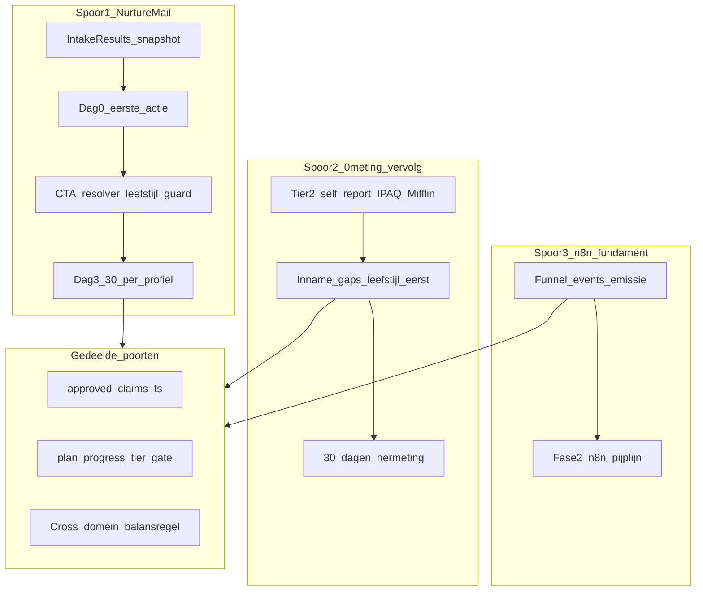
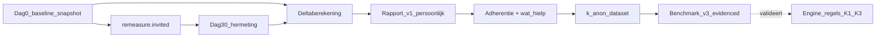
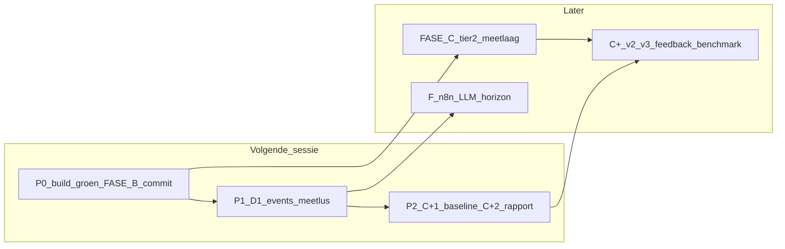

# PLAN — Fundament prioriteiten (consolidatie)

> **Layer 3 — Plan.** Eén geordende prioriteitsvolgorde die de drie bestaande plannen samenvoegt tot één afhankelijkheidsgeordend fundament: nurture mail, 0-meting → vervolg (evidenced / persoonlijk / stepped), en meetbaarheid (n8n-voorwaarde). Dit document **herhaalt geen analyse** — de bron-docs blijven de diepte. **Alleen planning — geen code, geen `src/`-wijziging.** Pseudostructuur ter illustratie.
>
> Kruisverwijzingen: [`PLAN_FUNNEL_DATA_PRIORITY.md`](PLAN_FUNNEL_DATA_PRIORITY.md) · [`PLAN_MEASUREMENT_PERSONALIZATION.md`](PLAN_MEASUREMENT_PERSONALIZATION.md) · [`ANALYSIS_PILLAR_COVERAGE.md`](ANALYSIS_PILLAR_COVERAGE.md) · [`STEPPED_CARE_MODEL.md`](../core/STEPPED_CARE_MODEL.md) · [`COMPLIANCE.md`](../core/COMPLIANCE.md) · [`EMAIL_SYSTEM.md`](../core/EMAIL_SYSTEM.md) · [`ENTITY_MODEL.md`](../core/ENTITY_MODEL.md) · [`WRITING_VOICE.md`](../core/WRITING_VOICE.md) · [`ARCHITECTURE.md`](../core/ARCHITECTURE.md)

---

## Samenvatting

Op 5–6 juni 2026 zijn de harde compliance- en infrastructuur-gaten in de funnel gedicht (tier-gating, EFSA-afdwinging, ashwagandha-fix, `buildNurtureEmail`-dedup). Wat nu het verschil maakt zit in **narratief, gating en meetbaarheid** — niet in plumbing.

Dit plan consolideert drie bron-docs tot één volgorde:

| Bron | Wat het levert |
|---|---|
| [`PLAN_FUNNEL_DATA_PRIORITY.md`](PLAN_FUNNEL_DATA_PRIORITY.md) | Nurture-fundament (dag 0 → dag 30), productschema, funnel-events, horizon-drempels |
| [`PLAN_MEASUREMENT_PERSONALIZATION.md`](PLAN_MEASUREMENT_PERSONALIZATION.md) | Tier-2 self-report meetlaag (IPAQ-short, Mifflin-St Jeor), advies-matching, RAG, anonimisering |
| [`ANALYSIS_PILLAR_COVERAGE.md`](ANALYSIS_PILLAR_COVERAGE.md) | Scheefheid-risico, domein-interactie K1–K3, cross-domein-balansregel |

**Kernkeuze (6 juni 2026):** het fundament-NU bouwt op **zelf-rapportage** (IPAQ-short + Mifflin-St Jeor). Wearable/BIA/Katch-McArdle/NEAT/voedingsdagboek en het geïntegreerde supplement-koppelings-algoritme zijn **expliciet horizon** — ze pluggen later in zonder herbouw van het fundament.

**Drie fundament-sporen** lopen parallel maar delen poorten:

1. **Nurture mail** — leefstijl-eerst-verhaal van dag 0 tot dag 30.
2. **0-meting → vervolg** — tier-2 inname-laag, evidence-gated advies, 30-dagen-hermeting.
3. **n8n** — schone event-emissie als harde voorwaarde; automatisering pas daarna.

---

## De drie fundament-sporen



| Spoor | Doel | Kernwerk |
|---|---|---|
| **1 — Nurture mail** | Van recap naar eerste actie; één leefstijl-eerst-verhaal | Dag-0-scharnier, CTA-resolver, per-profiel zwaartepunt, balansregel in mail |
| **2 — 0-meting → vervolg** | Evidenced, persoonlijk, stepped: inname-schatting → advies → hermeting | Domein-interactie K1–K3, tier-2 meetlaag, compliance-templates, gratis verdieping |
| **3 — n8n** | End-to-end funnel meten vóór automatisering | `nurture.email_sent`, `remeasure.invited`, `measurement.*`, `affiliate.click` |

---

## Geconsolideerde prioriteitsvolgorde

> Volgorde = afhankelijkheden, geen kalenderdata. Per item: bron, spoor, afhankelijkheid.

### FASE A — Funnel-narratief (kan direct; copy/resolver, geen schema)

| # | Stap | Bron | Spoor | Afhankelijkheid |
|---|---|---|---|---|
| **A1** | **Dag-0 herinrichten:** recap → eerste actie; één CTA; quick-win uit zwakste domein als held | FUNNEL §1A | 1 | Geen — *hoogste hefboom* |
| **A2** | **Centrale CTA-resolver + leefstijl-guard:** dag 0/3 = leefstijl; supplement pas dag 14+ met tier-gate | FUNNEL §1B-i | 1 | Geen |
| **A3** | **Per-profiel zwaartepunt + eigen recovery/overtrainer-blokken** (niet meer → "Lage Batterij") | FUNNEL §1B-ii | 1 | A2 |
| **A4** | **Domein-interactie K1–K3 versterken** (onderherstel-zonder-training, slaap-zonder-stress, energie-zonder-slaap/voeding) | PILLAR §3 | 2 | Geen — nul nieuwe data |
| **A5** | **Cross-domein-balansregel** in mail- én engine-output (harde invariant) | FUNNEL §1B-iii + PILLAR §2 | 1 + 2 | A2/A4 |
| **A6** | **Mail/scherm-coherentie:** profielpagina als anker; `In Balans` → leefstijl-overzicht i.p.v. dode profiel-link | FUNNEL §1C | 1 | Naast A1–A5 |

**CTA-resolver (pseudostructuur, ter illustratie):**

```
resolveNurtureCta(profile, sequenceDay, domainScores, planGate):
  - dag 0 en 3  → altijd leefstijl-doel
  - dag 7       → educatief (blog/pillar), leefstijl-frame
  - dag 14/21   → supplement-compare TOEGESTAAN als:
        approved-claims[stof].status == 'approved' && comparisonPath != null
        && intervention-highlight vrijgegeven door tier-gate
  - guard: supplement-compare-CTA NOOIT de enige actie vóór dag 14
```

**Per-profiel zwaartepunt (samenvatting):**

| Profiel | Zwaartepunt | Supplement secundair vanaf |
|---|---|---|
| Stressdrager | Leefstijl-dominant (ritme, ademhaling) | dag 21, magnesium-context |
| Onrustige Slaper | Leefstijl-eerst (licht, bedtijd) | dag 14, magnesium |
| Lage Batterij | Leefstijl-eerst (eiwit, daglicht) | dag 14, omega-3 (géén energie-claim) |
| Overtrainer/recovery | Leefstijl-dominant, eigen stem | dag 21, magnesium |
| In Balans | Optimalisatie/behoud | dag 21 |

---

### FASE B — Productdata-fundament (gating afdwingbaar)

| # | Stap | Bron | Spoor | Afhankelijkheid |
|---|---|---|---|---|
| **B1** | **Productschema normaliseren:** `dosering`, `vorm`, `efsaClaimIds`, `voldoetAanClaimConditie`, `thirdPartyTested` als getypeerde velden (geen vrije tekst in `specs[]`) | FUNNEL §2A | 2 | Geen |
| **B2** | **Referentiewaarden-datafile** (ADH/DRV/RI per nutriënt, niet-persoonlijk) | MEASUREMENT §C1 | 2 | Geen — parallel met B1 |
| **B3** | **Advies→nurture-invariant** expliciteren + testen: claim-poort + comparison-poort + tier-gate + balansregel als één invariant | FUNNEL §2C + MEASUREMENT §B2 | 1 + 2 | A5 + B1 |

```
supplement-suggestie zichtbaar  ⇔
   approved-claims[stof].status == 'approved'
   && comparisonPath != null
   && supplementAdviceAllowed / isComparisonAllowed == true
   && intervention-highlight vrijgegeven door tier-gate
   && cross-domein-balansregel voldaan
```

---

### FASE C — 0-meting → vervolg (tier-2 self-report; evidenced / persoonlijk / stepped)

| # | Stap | Bron | Spoor | Afhankelijkheid |
|---|---|---|---|---|
| **C1** | **Tier-2 consent + datavelden** (`consent_type`/`consent_version` voor lengte/gewicht/voeding vóór verzameling) | MEASUREMENT §D1 | 2 | Geen |
| **C2** | **Inname-schattingslaag** in nieuwe `src/lib/`-module: PAL via IPAQ-short, BMR via Mifflin-St Jeor, TDEE, macro, micro — **additief**, 15-vragen-intake ongewijzigd | MEASUREMENT §A | 2 | B2 + C1 |
| **C3** | **Advies-matching:** inname-gaps → leefstijl eerst, dan supplement (`getAdvice`/`RankedItem`-patroon) | MEASUREMENT §B1 | 2 | C2 + A4 |
| **C4** | **Compliance-template-laag** + forbidden-phrases + unit-tests (inname-vs-status op template-niveau) | MEASUREMENT §B3 | 2 | C3 |
| **C5** | **Tier-2 UI** als `measurement`-interventie, gratis (groei-eerst via bestaande `is_paid`/`tier`) | MEASUREMENT §E | 2 | C4 |

**Meetlaag-keuzes (fundament-NU, ongewijzigd t.o.v. MEASUREMENT §A):**

- **PAL:** IPAQ-short-geïnspireerde zelfrapportage (niet wearable-stappen).
- **BMR:** Mifflin-St Jeor; leeftijd uit `age_range`-band (geen geboortedatum).
- **Micro:** alleen stoffen mét claim + vergelijkingspagina in `approved-claims.ts`.
- **Output:** altijd inname-inschatting, nooit statusclaim ([`COMPLIANCE.md`](../core/COMPLIANCE.md)).

---

### FASE C+ — 30-dagen-deltarapport (de bewijslaag)

> **Statusnoot 9 juni 2026.** FASE A is volledig live (A1–A6 in `src/`, tests groen). FASE B is gecommit (`4d3ca33`, governance-tests `42576b2`, melatonine-cleanup `b1f3f76`). Werkboom schoon. Dit blok maakt de tot nu **impliciete** "remeasure" (C-spoor in het mermaid-diagram) expliciet als eigen fundament-feature.

**Waarom dit een eigen fundament-blok is.** Vandaag emit de funnel `remeasure.invited` en zegt dag-30 *"Doe de herhaalmeting → /intake"*, maar er is **geen baseline-koppeling, geen delta en geen rapport**. De gebruiker doet de check opnieuw als een vreemde. Daarmee mist de funnel zijn sterkste troef: het bewijs dat de leefstijl-aanpak werkt. Het deltarapport tilt PerfectSupplement van *eenmalig advies* naar een **coachingsrelatie met bewijs** — en levert tegelijk de dataset die de "Consumentenbond van supplementen"-positionering later hard maakt.

| # | Stap | Bron | Spoor | Afhankelijkheid |
|---|---|---|---|---|
| **C+1** | **Baseline-koppeling + snapshot:** link de dag-30-hermeting deterministisch aan de dag-0-sessie (recovery-token in de hermeting-link, niet e-mail-match). Bevries de dag-0 `domain_scores` + profiel + gekozen acties als onveranderlijke baseline. | FUNNEL §1A + MEASUREMENT §E | 1 + 2 | `remeasure.invited` (bestaat) |
| **C+2** | **Deltaberekening + rapportpagina v1:** per domein `nieuw − baseline`, met eerlijke zelfrapportage-framing. Eén pagina, deelbaar, SEO-waardig. | MEASUREMENT §E | 1 + 2 | C+1 |
| **C+3** | **Feedback-koppeling v2:** verrijk de delta met *welke acties zijn volgehouden* (`plan_progress`/check-ins) + één vraag "wat hielp het meest?". Maakt de delta uitlegbaar én voedt de aggregatie. | MEASUREMENT §B1 + F | 2 | C+2 + FASE C |
| **C+4** | **Geanonimiseerde benchmark v3:** *"mannen met jouw profiel die deze acties volhielden, verbeterden gemiddeld +X (n=…)"* — pas mét `n` en `k ≥ 20`. | MEASUREMENT §F + D2 | 2 + 3 | C+3 + volume + anon-pad (F3) |

**Rijpheidsladder — van anekdote naar bewijs.** Eén persoon over 30 dagen is ruis (zelfrapportage, regressie naar het gemiddelde, seizoen, placebo). "Mijn slaapscore ging +14" is geen bewijs; het wordt bewijs door volume + adherentie-koppeling over tijd.

| Versie | Toont | Betrouwbaarheidsanker | Wanneer |
|---|---|---|---|
| **v1 — persoonlijke delta** (n=1) | Jouw scores dag 0 → dag 30 | Framing: *"je eigen ervaren verandering"*, richting niet schijnprecisie | C+1/C+2 — bouwbaar nu |
| **v2 — feedback-gekoppeld** | Delta + volgehouden acties + "wat hielp" | Koppelt verbetering aan **gedrag**, niet aan toeval | C+3, naast FASE C |
| **v3 — evidenced benchmark** (volume) | Profiel-gemiddelde delta met `n` | k-anonieme aggregatie (`k ≥ 20`) van baseline→delta-paren | C+4, bij 500+/2000+ (zie F4) |

**Drie harde guardrails (anders breekt het de eigen positionering):**

1. **Nooit toeschrijven aan een supplement.** "Je magnesium verbeterde je slaapscore" = impliciete efficacy-/gezondheidsclaim → verboden. Verbetering schrijf je toe aan **gedrag en de hele aanpak**, niet aan een product. EFSA-discipline blijft ([`COMPLIANCE.md`](../core/COMPLIANCE.md)).
2. **Verandering, geen status.** "Je slaap is verbeterd" (ervaren verandering) mag; "je herstel is nu gezond" (statusoordeel) niet — dezelfde inname-vs-status-grens.
3. **Aggregaat pas mét `n` en k-anon.** Geen benchmark-claim vóór `k ≥ 20`. Een te kleine `n` als bewijs presenteren ondermijnt juist de geloofwaardigheid.



#### Wat je nu al kunt doen om de toekomst aan te sluiten (no-regret)

> Kernprincipe: **data die je vandaag niet vastlegt, kun je morgen nooit analyseren.** Geschiedenis is niet te backfillen. Deze drie acties zijn goedkoop nu en onmisbaar later — ze blokkeren niets en openen v2/v3.

| Nu-actie | Kosten nu | Wat het later mogelijk maakt |
|---|---|---|
| **Baseline-snapshot bevriezen** bij intake (scores + profiel + gekozen acties, met recovery-token-anker) | Klein — schrijfveld + token-koppeling | Elke latere delta, het hele rapport, alle benchmarks |
| **Delta-events emitteren** zodra een hermeting binnenkomt (`remeasure.completed { profile, per_domain_delta }`, anoniem payload) — óók vóór de rapport-UI bestaat | Klein — één `emitEvent`-aanroep in het bestaande `DOMAIN_EVENT_TYPES`-patroon | Je verzamelt baseline→delta-paren vanaf dag één i.p.v. pas vanaf de UI-launch |
| **Adherentie + feedback blijven loggen** (`plan_progress`, `intake_feedback`) en niet weggooien | Bestaat al | v2-narratief + v3-validatie van de engine-regels (FASE F spoor 1) |

Met deze drie staat het fundament onder het rapport vóórdat je één pixel UI bouwt. De rapportpagina wordt dan een *weergave* van data die je al hebt, geen data-archeologie achteraf.

---

### FASE D — Meetbaarheid (n8n-fundament)

| # | Stap | Bron | Spoor | Afhankelijkheid |
|---|---|---|---|---|
| **D1** | **Ontbrekende funnel-events** toevoegen aan `DOMAIN_EVENT_TYPES` | FUNNEL §3A + MEASUREMENT §F | 3 | Logisch ná FASE A (anders meet je bewegend doel) |
| **D2** | **Verifieer atomaire claim-stap** in `runPendingNurtureEmails` (dubbelzend-risico bij overlappende cron-runs) | FUNNEL status-tabel | 3 | Vóór cron-frequentie omhoog |

**Events (lijst):**

```
nurture.email_sent        { sequence_day, profile_label, primary_domain, status }
nurture.email_failed      { sequence_day, error_class }
remeasure.invited         { days_since_intake }
remeasure.completed       { profile_label, per_domain_delta }   // anoniem payload — voedt C+ deltarapport/benchmark
affiliate.click           { categorie, comparison_slug }   // spiegel, tabel blijft
measurement.intake_estimate_completed
measurement.gap_detected  // anoniem payload, gebande signalen
```

**Anonimiseringspad (koppeling D1):** payloads bevatten geen e-mail/session_id; na strip direct k-anon-geschikt. Volledig pad: pseudonimisering → strip identifiers → k-anonimiteit (k ≥ 20) vóór aggregatie (MEASUREMENT §D2 / FUNNEL §3B).

---

### FASE E — Parallel / niet-blokkerend

| # | Stap | Bron | Spoor | Afhankelijkheid |
|---|---|---|---|---|
| **E1** | **Productkennis-RAG-track** (niet-persoonlijk, vroeg, los van intake-volume; bouwt op `evidence_claims.embedding`) | MEASUREMENT §C3 | 2 | B1 — kan parallel met FASE C |

---

### FASE F — Pas ná fundament + volume (gated)

| # | Stap | Bron | Spoor | Afhankelijkheid |
|---|---|---|---|---|
| **F1** | **Korting/kwaliteit-haak in nurture** (ná dag 14, disclosure + claimconditie) — Dennis-besluit | FUNNEL §2B | 1 | A2 + B1 + B3 |
| **F2** | **Semi-automatische productverrijking / n8n-pijplijn** (Fase 2) | FUNNEL §2B | 3 | B1 + D1 |
| **F3** | **Anonimiserings-pipeline** bij nadering 500+-drempel | FUNNEL §3B + MEASUREMENT §D2 | 3 | D1 + volume |
| **F4** | **LLM-spoor 1:** patroonherkenning (500+) → voorspellend model (2000+) | MEASUREMENT §F | 2 | F3 + volume |

---

## Kritiek pad voor morgen (geactualiseerd 9 juni 2026)

FASE A is volledig live; het oude morgen-pad (A1→A5) is verzilverd. FASE B is gecommit. De hefboom verschuift naar **meten → bewijzen**.

**Volgorde volgende sessie:**

```
P0  FASE B productschema/gating           ✅ afgerond (4d3ca33 + 42576b2 + b1f3f76)
P1  D1 events-meetlus sluiten               (nurture.email_sent + remeasure.invited + D2 atomaire cron)
P2  30-dagen-deltarapport v1 (FASE C+)       (baseline-koppeling + delta + rapportpagina)
```

Nuance op de volgorde:

- **P1 is nu de hefboom** — meetlus tilt FASE A van *aanname* naar *feit*.
- **P1 vóór P2** omdat het rapport op `remeasure`-events en baseline-opslag leunt; en omdat de meetlus het enige is dat "FASE A werkt" van *aanname* naar *feit* tilt. Pas nu zinvol: de A-richting staat vast, dus je meet geen bewegend doel.
- **P2 = jouw prioriteit + de proof-of-positioning** — zie FASE C+. Begin bij C+1 (baseline-koppeling): zonder deterministische dag-0↔dag-30-link is geen enkele delta betrouwbaar.

**Hangt aan fundament (niet volgende sessie):**

- FASE C (tier-2 meetlaag, PAL/Mifflin) wacht op B2 + C1-consent.
- FASE C+ v2/v3 (feedback-koppeling, benchmark) wacht op FASE C + volume + anon-pad.
- FASE F (n8n-pijplijn, LLM, anonimisering) wacht op B1 + D1 + volume.
- Horizon (wearable/BIA) wacht op FASE A–D + Dennis-besluit.



---

## Horizon (expliciet NÁ fundament, met drempels)

> **Niets hiervan komt nu op PerfectSupplement.** Dit is vervolg/horizon — geen scope. Het fundament-NU (IPAQ-short + Mifflin) is zo ontworpen dat deze laag **later inplugt zonder herbouw**.

### Harde toegangsdrempels

Geen horizon-item start vóór:

1. **FASE A live** — nurture-narratief + CTA-guard + balansregel.
2. **FASE B live** — genormaliseerd productschema met claimconditie.
3. **FASE D live** — schone event-emissie + gemeten funnel-conversie.
4. **Volume + anonimiseringspad** — 500+/2000+-drempels + k-anon (k ≥ 20).
5. **Expliciet Dennis-besluit** — wearable ja/nee.

### Vervolglaag: upgraded leefstijlcheck (uit externe analyse)

Deze items vervangen of verrijken het fundament-NU **pas na drempels 1–5**:

| Onderdeel | Upgrade (horizon) | Waarom later |
|---|---|---|
| **Activiteit** | Wearable-stappen (14-dag gemiddelde) → PAL via Tudor-Locke-mapping i.p.v. IPAQ-short | Device-integratie, art. 9-zwaarder, API-onderhoud |
| **BMR** | BIA/huidplooi → Katch-McArdle (vetvrije massa) i.p.v. Mifflin-St Jeor | Grenst aan lichaamssamenstelling-meting; consent-uitbreiding |
| **NEAT** | Gedragsaudit (werk, transport, zittijd) → PAL-fijnafstelling ±0.05–0.1 | Extra vragen; plugt op PAL-laag |
| **Validatie** | Voedingsdagboek 4–7 dagen + nuchter wegen → TDEE vs gewichtstrend | Dynamische nulmeting; hogere gebruikerslast |
| **Slaap/stress** | Wearable HRV, slaapfases, rusthartslag → herstel-koppeling | Risico statusduiding; grensbewaking streng |
| **Koppeling** | Geïntegreerd 3-staps algoritme: basis → biometrie → chemie (bloedwaarden) | Tier 4–5 = referral-only ([`STEPPED_CARE_MODEL.md`](../core/STEPPED_CARE_MODEL.md)) |

**3-staps doelbeeld (horizon, niet nu):**

```
STAP 1  Leeftijd + geslacht + activiteit (wearable/IPAQ)  →  TDEE & macro
STAP 2  LBM (BIA) + NEAT + slaap/HRV                     →  gedrag & functionele supplementen
STAP 3  Bloedwaarden + vitaminestatus                    →  medische validatie (referral-only)
```

**Supplement-koppeling via harde metrics (horizon-voorbeeld):**

| Gemeten factor | Voedingsaanpassing | Gericht supplement (EFSA-gated) |
|---|---|---|
| Hoog LBM | Eiwit 1.8–2.2 g/kg LBM | Creatine, whey (indien vergelijkingspagina) |
| Hoge stappen/PAL | Koolhydraten rond activiteit | Elektrolyten (magnesium/kalium) |
| Sedentair kantoorwerk | Volume via vezels/groenten | Vitamine D3 + K2 |
| Lage HRV/slaapscore | Geen cafeïne na 12:00 | Magnesium bisglycinaat |

### Apart product / entiteit (niet PerfectSupplement-funnel)

| Item | Reden |
|---|---|
| **Home scan** (zelf-meting thuis) | Meet-/diagnostiek-propositie botst met "leefstijlcoach, geen status" |
| **Agency/B2B** (white-label via `organization_id`) | Apart kanaal; pas als B2C-funnel bewezen converteert |

---

## Wat bewust NIET nu

- **Geen wearable/BIA/Katch-McArdle/NEAT/voedingsdagboek in het fundament.** Zelf-rapportage (IPAQ-short + Mifflin) is de basis; horizon plugt later in.
- **Geen n8n/automatische verrijkingspijplijn vóór schone events (D1) + genormaliseerd schema (B1).**
- **Geen tweede primaire CTA per mail/pagina.** Eén conversiedoel; CTA-resolver (A2) borgt leefstijl-eerst.
- **Geen supplement-CTA als enige actie vóór dag 14.**
- **Geen statusclaims of tekortdiagnoses.** Inname-inschatting mag; "je hebt een tekort" niet ([`COMPLIANCE.md`](../core/COMPLIANCE.md)).
- **Geen bloed-/HRV-tier, geen klinische duiding.** Tier 4–5 = referral-only.
- **Geen migratie productkennis naar Supabase nu.** Getypeerde datafiles blijven source of truth.
- **Geen gedeelde tabel productkennis + intake-data.** Twee strikt gescheiden stromen ([`ARCHITECTURE.md`](../core/ARCHITECTURE.md)).
- **Geen aanraking `affiliate_clicks` of basis-15-vragen-intake/domein-maxima.** `affiliate.click` is spiegel-event.
- **Geen herbouw 5–6 juni-werk.** Tier-gating, EFSA, ashwagandha-fix, `buildNurtureEmail`-dedup blijven zoals ze zijn.

---

## Open beslispunten voor Dennis

| # | Beslispunt | Aanbeveling | Bepaalt |
|---|---|---|---|
| 1 | **Dag-0-overzichtsblok:** volledig recap of indikken tot zwakste domein + quick-win? | Indikken (vooruit i.p.v. terug) | A1 copy |
| 2 | **Hardheid cross-domein-balansregel:** harde invariant of zachte voorkeur? | Hard, gelijk aan engine | A5 + B3 tests |
| 3 | **Korting/kwaliteit-haak in nurture** (Arctic Blue e.d.) ná dag 14? | Ja, mits disclosure + claimconditie + leefstijl-guard | F1 |
| 4 | **`affiliate.click` in event-stream** als spiegel naast `affiliate_clicks`? | Uniforme funnel-meting; tabel blijft ongemoeid | D1 |
| 5 | **Wearable/HRV — ja of nee?** | Geen aanbeveling — strategische keuze | Hele horizon-sectie |
| 6 | **Eerste tranche kruisregels:** K1–K3 akkoord of andere selectie? | K1–K3 eerst | A4 |
| 7 | **Verbinding-pijler:** bewust content-only of later gescoorde vraag? | Nu content-only | — |

### Notitie: 12 vs 15 vragen

Sommige opdrachten noemen "12 vragen"; [`INTAKE_SYSTEM.md`](../core/INTAKE_SYSTEM.md) documenteert **15 vragen / 7 categorieën** als waarheid. Dit plan volgt de intake-doc. Geen wijziging aan de doc — als 12 het beoogde aantal is, graag bevestigen.

---

## Status: wat 5–6 juni al gefixt is (niet herhalen)

| Item | Status |
|---|---|
| Intervention-highlight dag 3/14/21 + tier-gating | ✅ `2495c2b` |
| `is_efsa_authorized` in plan-gating | ✅ `15009fc` |
| Stress-nurture los van ashwagandha | ✅ `066c9ba` |
| `buildNurtureEmail` ontdubbeld, dood send-reminders-pad weg | ✅ `59333de` |
| Centrale CTA-resolver (A2) | ✅ Live — `src/lib/resolve-nurture-cta.ts` + tests (7 juni) |
| Per-profiel sequence-zwaartepunt + Overtrainer-stem (A3) | ✅ Live — `NurtureProfileKey`, eigen blokken dag 0–30 (7 juni) |
| Cross-domein-balansregel in mail + engine (A5) | ✅ Live — `enforceCrossDomainBalance` + balance/signals-tests (7 juni) |
| K1–K3 domein-interactie (A4) | ✅ Live — `intake-engine.ts` + `intake-engine.signals.test.ts` (7 juni) |
| FASE B productschema/gating | ✅ Gecommit (`4d3ca33` + `42576b2` + `b1f3f76`) |
| Atomaire cron-claim | ⚠️ Te verifiëren → D2 |
| 30-dagen-deltarapport | ❌ Open → FASE C+ (alleen `remeasure.invited` bestaat, geen delta/rapport) |

---

## Kruisverwijzingen

| Document | Relevantie |
|---|---|
| [`PLAN_FUNNEL_DATA_PRIORITY.md`](PLAN_FUNNEL_DATA_PRIORITY.md) | Bron funnel: DEEL 1–4, events, horizon-drempels |
| [`PLAN_MEASUREMENT_PERSONALIZATION.md`](PLAN_MEASUREMENT_PERSONALIZATION.md) | Bron meetlaag: A–F, RAG, anonimisering, LLM-roadmap |
| [`ANALYSIS_PILLAR_COVERAGE.md`](ANALYSIS_PILLAR_COVERAGE.md) | Bron scheefheid, K1–K3, balansregel, wearable-beslispunt |
| [`STEPPED_CARE_MODEL.md`](../core/STEPPED_CARE_MODEL.md) | Tier-model, `is_paid`/`tier`, tier 4–5 referral-only |
| [`COMPLIANCE.md`](../core/COMPLIANCE.md) | EFSA, inname-vs-status, affiliate-disclosure |
| [`EMAIL_SYSTEM.md`](../core/EMAIL_SYSTEM.md) | Nurture-sequence, cron, Resend |
| [`ENTITY_MODEL.md`](../core/ENTITY_MODEL.md) | `domain_events`, `nurture_emails`, `plan_progress` |
| [`WRITING_VOICE.md`](../core/WRITING_VOICE.md) | Toon dag-0 en reeks |
| [`ARCHITECTURE.md`](../core/ARCHITECTURE.md) | Twee gescheiden datastromen |
| [`INTAKE_SYSTEM.md`](../core/INTAKE_SYSTEM.md) | 15 vragen, 6 domeinscores, 500+-drempel |

---

*Opgesteld: 6 juni 2026. Planning-document — geen code, geen `src/`-wijziging. Consolideert [`PLAN_FUNNEL_DATA_PRIORITY.md`](PLAN_FUNNEL_DATA_PRIORITY.md), [`PLAN_MEASUREMENT_PERSONALIZATION.md`](PLAN_MEASUREMENT_PERSONALIZATION.md) en [`ANALYSIS_PILLAR_COVERAGE.md`](ANALYSIS_PILLAR_COVERAGE.md).*
