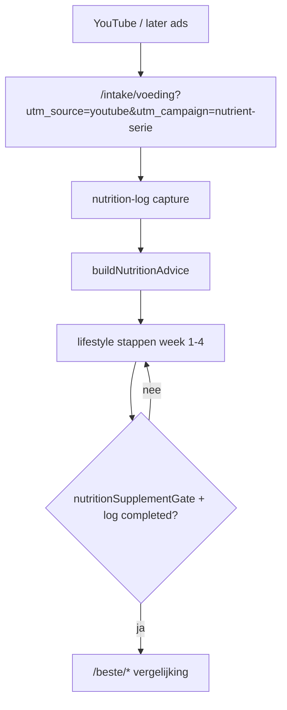

# PLAN — Voeding eerst + YouTube-funnel (Consumentenbond-route)

> **Layer 3 — Plan.** Concrete content- + product-roadmap: YouTube/ad-verkeer → voedingscheck → leefstijlstappen → pas daarna supplement. Sluit aan op merkprincipe *"Eerst de basis, dan de pil"* (`nutrition-advice.ts`) en bestaande voedings-lus (`PLAN_NUTRITION_SELFEVAL_LOOP.md`).
>
> Kruisverwijzingen: [`WRITING_VOICE.md`](../core/WRITING_VOICE.md) · [`COMPLIANCE.md`](../core/COMPLIANCE.md) · [`AFFILIATE_SYSTEM.md`](../core/AFFILIATE_SYSTEM.md) · [`PLAN_NUTRITION_SELFEVAL_LOOP.md`](PLAN_NUTRITION_SELFEVAL_LOOP.md)

---

## Samenvatting

**Doel:** PerfectSupplement wordt de *Consumentenbond van supplementen* — onafhankelijk advies, voeding als eerste antwoord bij macro/micro-tekorten, supplement alleen als logische aanvulling.

**Kanaal:** YouTube (later ads) → landingspagina voedingscheck → stapsgewijze leefstijl → gegate vergelijking.

**Kernprobleem vandaag:** de voedingscheck (`/intake/voeding`) handhaaft de ladder wél; dashboard/hub/intake-resultaten tonen soms nog supplement-strips zonder die check. YouTube-traffic versterkt dat misalignment.

**Oplossing in twee sporen:**
1. **Content** — 3 pilot-video's (scripts hieronder), één CTA, geen gezondheidsclaims.
2. **Product** — gedeelde eligibility-gate vóór elke supplement-CTA buiten `/intake/voeding`.

---

## Funnel



**Landings-URL (vast voor alle pilot-video's):**

```
https://perfectsupplement.nl/intake/voeding?utm_source=youtube&utm_campaign=nutrient-serie-2026
```

Optioneel per aflevering: `&utm_content=ep1-totaliteit` / `ep2-eiwit` / `ep3-magnesium`

**Meetpunt acquisitie:** `intake_sessions.referral_source` (= `utm_source`) + GA4 `page_view` op `/intake/voeding` met UTM-params.

---

## Video-compliance (voor opname)

**Wel in video:**
- Patronen en gewoontes ("je haalt je eiwitdoel niet via je bord")
- Ervaringsbeelden ("herstel duurt langer", "energie dip't eerder op de dag")
- Concrete voedingsstappen (maaltijd, portie, ritme)
- "Geen diagnose — wel bewustwording"

**Niet in video:**
- Ziekte/diagnose ("je krijgt X", "dit veroorzaakt Y")
- Genezings- of preventieclaims
- "Dit supplement lost het op"
- Superlatieven, hype, emoji-stacks

**Vaste disclaimer (ondertitel + beschrijving):**
> PerfectSupplement geeft leefstijladviezen, geen medische diagnoses. Supplementen vullen aan waar voeding structureel tekortschiet — altijd na je bord, niet ervoor.

---

## Pilot-serie: 3 video-scripts

Stijl: [`WRITING_VOICE.md`](../core/WRITING_VOICE.md) — begrip → urgentie → actie. Duur per video: 8–12 minuten.

---

### Aflevering 1 — "Wat er gebeurt als je bord structureel tekortschiet"

**YouTube-titel (werkversie):**  
*Je lichaam wacht niet op het juiste supplement — wat er wél gebeurt als voeding structureel tekortschiet*

**Thumbnail-tekst:** Eerst je bord. Niet je potje.

**Hook (0:00–0:45)**  
Je hebt geen tijd om uit te zoeken wat klopt. Logisch — daar is je leven te druk voor. Maar je lichaam rekent niet in supplementen. Het rekent in wat er dagelijks op je bord komt: eiwit, vezels, vetzuren, mineralen — de totaliteit.

**Probleem benoemen (0:45–3:00)**  
De meeste mannen boven de 40 eten "gezond genoeg" — tot herstel trager wordt, energie eerder wegzakt, of training meer moeite kost dan het oplevert. Niet omdat je lui bent. Omdat gewoontes zich stapelen: ontbijt overslaan, 's avonds inhalen, weinig vis, weinig groente, te weinig eiwit verspreid over de dag.

Dat is geen diagnose. Het is een patroon dat ik steeds terugzie.

**Mechanisme zonder claim (3:00–6:00)**  
Stel je voor dat je week na week net onder je behoefte zit — niet catastrofaal, maar structureel:
- **Eiwit:** minder bouwmateriaal voor spier en herstel na training
- **Vezels en regelmaat:** minder stabiele energie over de dag
- **Vette vis / omega-3-bronnen:** minder structurele inname uit voeding
- **Magnesiumrijke voeding:** minder van je dagelijkse basis via noten, groente, peulvruchten

Geen enkel punt is "nu ben je ziek". Wel: je basis wordt dunner. En dunne basis + druk leven = je voelt het eerder.

**Provocatie (gericht, niet naar kijker) (6:00–7:30)**  
De supplement-industrie verdient aan snelheid. Neem dit potje, stack die stack. Weinig kanalen nemen de tijd om je bord eerst te fixen. Wij wel — daarom ben ik dit kanaal gestart.

**Stapsgewijze ladder (7:30–9:30)**  
Drie stappen, altijd in deze volgorde:
1. **Zien** waar je frequentie tekortschiet (geen calorieën tellen — wel: hoe vaak komt eiwit, vis, groente voor?)
2. **Eén gewoonte** deze week veranderen — niet vijf
3. **Pas daarna** kijken of een supplement logisch is als aanvulling

**CTA (9:30–10:30)**  
Gratis voedingscheck — drie minuten, geen account, geen e-mail verplicht. Je ziet waar jouw frequentie tekortschiet en krijgt concrete stappen voor deze week.

Link in beschrijving:  
`perfectsupplement.nl/intake/voeding?utm_source=youtube&utm_campaign=nutrient-serie-2026&utm_content=ep1-totaliteit`

**Outro**  
Volgende week: eiwit — de grootste winst voor de meeste mannen 40+, zonder poeder.

---

### Aflevering 2 — "Eiwit: de grootste winst zonder poeder"

**YouTube-titel:**  
*Te weinig eiwit na 40? Begin hier — vóór je aan whey denkt*

**Hook**  
Krachttraining zonder eiwit op je bord is half werk. Niet omdat poeder slecht is — maar omdat je bord de basis is.

**Kern (visueel: dag-schema)**  
Veel mannen zitten op:
- Licht ontbijt of overslaan
- Redelijk lunch
- Groot avondeten

Resultaat: eiwit te dun verspreid. Na 40 gebruikt je lichaam eiwit minder efficiënt — verspreiden over de dag telt meer dan één grote portie 's avonds.

**Deze week — 2 stappen (concreet)**  
1. Begin elke maaltijd met een eiwitbron: ei, kwark, kip, vis, peulvruchten  
2. Eet op vaste tijden — geen urenlang overslaan en 's avonds inhalen

Geen dieet. Eén anker.

**Wanneer is poeder logisch? (zonder verkoop)**  
Als je na twee weken structureel onder je dagdoel blijft — bijvoorbeeld door reizen, shifts, of weinig eetlust — dan is poeder een **praktische aanvulling naast maaltijden**. Niet als vervanging van je bord.

**CTA**  
Doe de voedingscheck — je ziet of eiwit jouw grootste gap is.

`...&utm_content=ep2-eiwit`

**Outro**  
Volgende: magnesium en groente — slaap, stress en je bord.

---

### Aflevering 3 — "Magnesium: eerst noten en groente, dan pas een pil"

**YouTube-titel:**  
*Magnesium en slaap — wat je bord wél en niet voor je doet*

**Hook**  
Slecht slapen? De reflex is een pil. Soms is de eerste vraag: komt er genoeg magnesiumrijke voeding in je week voor?

**Kern**  
Magnesium zit in bladgroente, noten, peulvruchten, volkoren. Niet spectaculair. Wel de basis waar supplementen op voortbouwen.

**Stapsgewijze week**  
- Dagelijks: handvol noten of extra portie groente  
- Avond: voorspelbare maaltijd, minder prikkels laat op de dag  
- Slaaproutine vóór elk supplementgesprek

**Supplement-framing (Consumentenbond)**  
Een magnesiumsupplement kan aanvullen als je voedingsfrequentie structureel laag blijft — mét EFSA-conforme claims, niet als slaapmiddel-belofte. Eerst voeding + ritme. Dan pas vergelijken.

**CTA**  
`...&utm_content=ep3-magnesium`

**Serie-afsluiting**  
Drie weken, drie lagen van dezelfde ladder. De voedingscheck is je nulpunt — herhaal over een maand en zie of je frequentie beweegt.

---

## Product-roadmap

### Fase A — Quick wins (1–2 weken, vóór YouTube-live)

| # | Wijziging | Bestanden | Acceptatie |
|---|-----------|-----------|------------|
| A1 | **Vaste YouTube-landingscopy** op `/intake/voeding` bij `utm_source=youtube` | `src/app/intake/voeding/page.tsx`, eventueel kleine client banner component | Hero benadrukt "voedingscheck", niet intake algemeen |
| A2 | **UTM-persistentie** uitbreiden: `utm_campaign` + `utm_content` in cookie of session metadata | `IntakeIntro.tsx`-patroon hergebruiken of gedeelde `referral-cookie.ts` | Admin/referral kan campagne onderscheiden |
| A3 | **GA4 events** op voedings-funnel | `NutritionResultView.tsx`, `/intake/voeding` | `nutrition_youtube_landing`, `nutrition_log_completed`, `nutrition_supplement_revealed` |
| A4 | **Dashboard supplement-strip: voedingscheck-CTA** i.p.v. direct `/beste/*` wanneer geen log | `Dashboard.tsx`, `RecommendedForYou.tsx`, `VoortgangHub.tsx` | Tekst: "Doe eerst de voedingscheck" + link `/intake/voeding` |

**Meetpunt Fase A:** GA4 funnel + `referral_source` in admin; geen nieuwe domain_events verplicht (publieke pagina).

---

### Fase B — Gedeelde gate (2–3 weken, kern)

**Nieuw:** `src/lib/supplement-eligibility.ts`

```typescript
export type SupplementEligibilityInput = {
  sessionId?: string;
  nutritionLogCompleted?: boolean; // uit intake_intake_log of session flag
  lifestyleTierCompleted?: boolean; // optioneel: plan tier 1 afgerond
};

export function canShowSupplementRecommendation(
  nutrient: NutrientId,
  input: SupplementEligibilityInput,
): boolean {
  if (!input.nutritionLogCompleted) return false;
  return nutritionSupplementGate(nutrient).allowed;
}
```

| # | Wijziging | Bestanden |
|---|-----------|-----------|
| B1 | Gate module + tests | `src/lib/supplement-eligibility.ts`, `src/lib/__tests__/supplement-eligibility.test.ts` |
| B2 | `buildRecommendations` filtert op eligibility | `src/lib/build-recommendations.ts`, `src/lib/recommendation-engine.ts` |
| B3 | Session flag `nutrition_log_completed` | API nutrition-log route, session payload type |
| B4 | UI: supplement achter disclosure + "Je hebt de voedingscheck gedaan" | `Dashboard.tsx`, `AanpakMode.tsx`, `RecommendedForYou.tsx` |
| B5 | Intake-resultaten: CTA naar voeding vóór supplement-strip | Intake results componenten |

**Gedrag na Fase B:**
- Geen nutrition-log → geen eiwitpoeder/omega-3/magnesium in hub/dashboard strips
- Wel: lifestyle copy + link naar `/intake/voeding`
- Na log + gap + gate → zelfde UX als `NutritionResultView` (supplement in `<details>`)

---

### Fase C — Leefstijl-ladder zichtbaar (2 weken)

| # | Wijziging | Bestanden |
|---|-----------|-----------|
| C1 | Na nutrition-log: toon `nutritionPlanTemplate.phases` week 1 | `nutrition.ts`, voedings-result UI |
| C2 | E-mail/nurture: geen supplement-CTA zonder log-flag | nurture templates, `resolve-nurture-cta.ts` |
| C3 | `/voeding-na-40` pillar: primaire CTA = voedingscheck | `src/app/voeding-na-40/page.tsx` |

---

### Fase D — YouTube schalen + ads (na data)

**Start ads alleen als:**
- `nutrition_log_completed` / `intake.cta_to_nutrition_log` > 15% van YouTube-sessies
- ≥ 50 completed logs van `utm_source=youtube`

| # | Actie |
|---|-------|
| D1 | Retargeting op voedingscheck-completers, niet op `/beste/*` |
| D2 | Aflevering 4+ alleen voor gaps met hoogste `measurement.gap_detected` volume |
| D3 | Affiliate alleen op "supplement revealed" event — attributie schoon |

---

## Wat niet in scope (nu)

- Nieuwe nutrienten buiten de 5 in `intake-reference.ts` (vezels apart — later)
- Volledige catalogus-CRUD (zie affiliate-dashboard plan)
- Partner-API als admin-backend
- Health-claim video's of "10 jaar later"-dramatisering

---

## KPI's (eerste 90 dagen)

| KPI | Doel | Waar meten |
|-----|------|------------|
| YouTube → voedingscheck start | > 8% CTR op link | YouTube Studio + GA4 |
| Voedingscheck completion | > 40% van starts | `nutrition_log_completed` |
| Supplement reveal rate | 20–35% van completions | alleen na gate — bewust lager dan nu |
| Affiliate clicks per YouTube-user | stijgend, maar **na** log | `affiliate_clicks` + `referral_source` |
| Herhaal-log binnen 30d | > 10% | `intake_intake_log` delta |

---

## Implementatie-volgorde (aanbeveling)

```
Week 1–2:  Fase A (landingscopy, UTM, GA4, dashboard CTA)
Week 3–5:  Fase B (supplement-eligibility gate — kritisch)
Week 6–7:  Fase C (zichtbare leefstijl-fases)
Week 8+:   Pilot 3 video's live → 4 weken data → Fase D beslissing
```

**Eerste code-PR voorstel:** `feat: voeding-eerst gate — hide supplement strips until nutrition log`

**Eerste content-PR:** film ep1–ep3 met vaste UTM's; geen productie-deploy van ads tot Fase B live is.

---

## Consumentenbond-checklist (publiek verdedigbaar)

- [ ] Ranking niet afhankelijk van commissie-hoogte
- [ ] Elke supplement-CTA heeft voedingscheck als voorwaarde
- [ ] Video's: geen diagnose, geen genezingsbelofte
- [ ] Vergelijkingen: EFSA-gate + disclosure op pagina
- [ ] Methodologie-link zichtbaar vanaf voedingsresultaat

---

*Laatst bijgewerkt: juli 2026*
